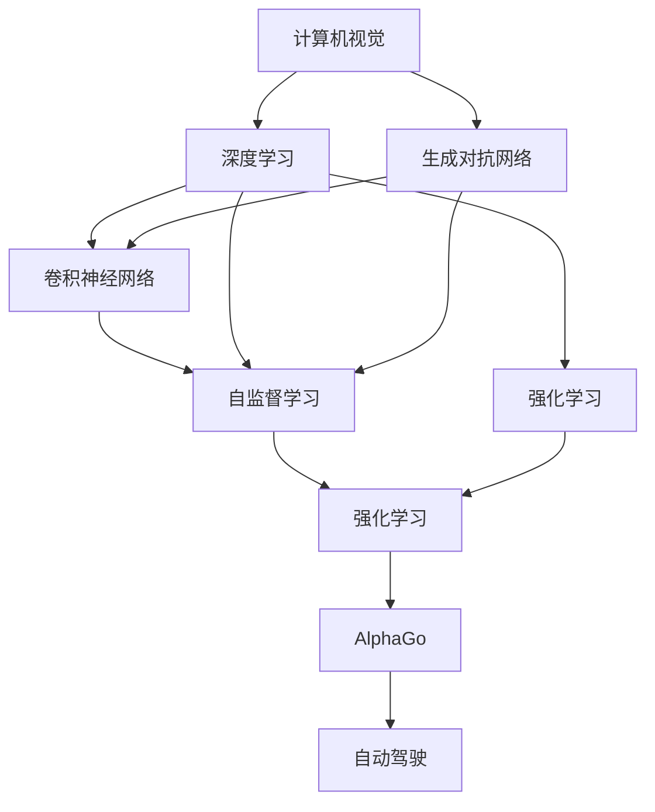

                 

## 1. 背景介绍

在计算机科学的浩瀚星空中，安德烈·卡帕西（Andrej Karpathy）无疑是一颗耀眼的彗星。作为一名深耕计算机视觉、深度学习和自动驾驶领域的创新者，他的研究工作不仅极大地推动了计算范式的变革，也对工业界产生了深远影响。本系列文章将通过系统梳理他的核心工作，以及他与计算机科学的深刻联系，深入探讨他在计算范式上的变革贡献。

## 2. 核心概念与联系

安德烈·卡帕西的工作涉及许多关键概念，包括计算机视觉、深度学习、自监督学习、卷积神经网络（CNNs）、图像生成对抗网络（GANs）、自动驾驶、强化学习、AlphaGo等。本节将详细介绍这些核心概念，并通过一条Mermaid流程图展示它们之间的联系。

```mermaid
graph LR
  C->V1
  C->V2
  V1-->G
  V1-->V3
  V2-->G
  V2-->V3
  G-->A1
  G-->A2
  V3-->A1
  V3-->A2
  A1-->L
  A2-->L
  L-->A3
  L-->A4
  A3-->D
  A4-->D
  D->C
```

### 2.1 核心概念概述

- **计算机视觉（CV）**：涉及图像、视频、深度学习和计算机视觉任务的开发，例如分类、检测、分割、姿态估计算法等。

- **深度学习（DL）**：利用神经网络对数据进行复杂特征学习，用于图像、语音、文本等领域的自动化处理。

- **自监督学习（SSL）**：使用无标签数据进行模型训练，通过最大化模型在训练数据上的预测能力来提升模型性能。

- **卷积神经网络（CNNs）**：一种特殊类型的神经网络，能够有效处理空间数据，如图像、视频等。

- **生成对抗网络（GANs）**：包含生成器和判别器两个模块，通过对抗训练生成高质量的图像、音频、视频等。

- **自动驾驶（AD）**：结合传感器、控制系统和深度学习，实现自动驾驶汽车在道路上的安全行驶。

- **强化学习（RL）**：通过与环境交互，最大化奖励信号，用于自主决策和学习智能体行为。

- **AlphaGo**：由DeepMind开发，利用深度学习和强化学习技术，在围棋游戏中击败了人类和世界冠军。

### 2.2 概念间的关系

以上核心概念之间的关系可以通过以下Mermaid流程图来展示：



这个流程图展示了计算机视觉、深度学习、生成对抗网络、卷积神经网络、自监督学习、强化学习和自动驾驶等概念之间的联系。卡帕西的工作将这些概念紧密连接起来，推动了计算机科学的广泛应用和发展。

## 3. 核心算法原理 & 具体操作步骤

### 3.1 算法原理概述

安德烈·卡帕西在多个领域都有深入研究，其核心算法原理涉及深度学习、卷积神经网络、自监督学习和强化学习。以下将简要介绍这些算法的原理，并讨论它们的具体操作步骤。

- **深度学习**：通过多层神经网络，学习数据的复杂特征，用于分类、检测、生成等任务。

- **卷积神经网络**：通过卷积操作提取局部空间特征，用于图像、视频等空间数据处理。

- **自监督学习**：利用无标签数据，通过最大化模型在训练数据上的预测能力来提升模型性能。

- **强化学习**：通过与环境交互，最大化奖励信号，用于自主决策和学习智能体行为。

### 3.2 算法步骤详解

以下将详细介绍安德烈·卡帕西在各领域的主要算法操作步骤：

#### 3.2.1 计算机视觉（CV）

**步骤1: 数据准备**  
收集和标注数据集，如ImageNet、COCO等，为模型训练提供数据基础。

**步骤2: 模型搭建**  
设计卷积神经网络（CNNs）结构，如VGG、ResNet、Inception等，搭建网络层级结构。

**步骤3: 模型训练**  
使用GPU/TPU等高性能设备，进行大规模数据训练，调整超参数，优化模型性能。

**步骤4: 模型评估**  
在测试集上进行模型评估，如准确率、精度、召回率等指标，优化模型参数。

**步骤5: 模型部署**  
将训练好的模型部署到实际应用场景中，如物体检测、图像分类、人脸识别等。

#### 3.2.2 深度学习（DL）

**步骤1: 数据准备**  
收集数据集，如MNIST、CIFAR等，为模型训练提供数据基础。

**步骤2: 模型搭建**  
设计多层神经网络结构，如全连接层、卷积层、池化层等。

**步骤3: 模型训练**  
使用GPU/TPU等高性能设备，进行大规模数据训练，调整超参数，优化模型性能。

**步骤4: 模型评估**  
在测试集上进行模型评估，如准确率、精度、召回率等指标，优化模型参数。

**步骤5: 模型部署**  
将训练好的模型部署到实际应用场景中，如语音识别、自然语言处理等。

#### 3.2.3 生成对抗网络（GANs）

**步骤1: 数据准备**  
收集数据集，如MNIST、CIFAR等，为模型训练提供数据基础。

**步骤2: 模型搭建**  
设计生成器和判别器网络结构，如DCGAN、CycleGAN等。

**步骤3: 模型训练**  
使用GPU/TPU等高性能设备，进行大规模数据训练，调整超参数，优化模型性能。

**步骤4: 模型评估**  
在测试集上进行模型评估，如生成图像质量、判别器准确率等指标，优化模型参数。

**步骤5: 模型部署**  
将训练好的模型部署到实际应用场景中，如图像生成、图像修复等。

#### 3.2.4 自监督学习（SSL）

**步骤1: 数据准备**  
收集无标签数据集，如CIFAR-10、SVHN等，为模型训练提供数据基础。

**步骤2: 模型搭建**  
设计自监督学习算法，如自编码器、 contrastive learning等。

**步骤3: 模型训练**  
使用GPU/TPU等高性能设备，进行大规模数据训练，调整超参数，优化模型性能。

**步骤4: 模型评估**  
在测试集上进行模型评估，如重构误差、自监督损失等指标，优化模型参数。

**步骤5: 模型部署**  
将训练好的模型部署到实际应用场景中，如图像生成、图像分类等。

#### 3.2.5 强化学习（RL）

**步骤1: 环境设计**  
设计强化学习环境，如游戏环境、机器人环境等。

**步骤2: 模型搭建**  
设计强化学习算法，如Q-learning、Deep Q-learning等。

**步骤3: 模型训练**  
与环境进行交互，最大化奖励信号，调整超参数，优化模型性能。

**步骤4: 模型评估**  
在测试集上进行模型评估，如策略稳定度、奖励值等指标，优化模型参数。

**步骤5: 模型部署**  
将训练好的模型部署到实际应用场景中，如自动驾驶、机器人导航等。

#### 3.2.6 AlphaGo

**步骤1: 数据准备**  
收集围棋对局数据，为模型训练提供数据基础。

**步骤2: 模型搭建**  
设计AlphaGo的神经网络结构，包括卷积神经网络、价值网络和策略网络。

**步骤3: 模型训练**  
使用GPU/TPU等高性能设备，进行大规模数据训练，调整超参数，优化模型性能。

**步骤4: 模型评估**  
在测试集中与人类围棋选手进行对弈，评估模型表现。

**步骤5: 模型部署**  
将训练好的模型部署到实际应用场景中，如围棋游戏、人工智能研究等。

### 3.3 算法优缺点

安德烈·卡帕西的工作在深度学习领域具有重要意义，其核心算法的优缺点如下：

#### 优点

- **强大的模型性能**：卡帕西的工作主要集中在图像、视频等视觉领域的深度学习，其算法模型在图像分类、物体检测、图像生成等任务上表现优异。

- **广泛的应用领域**：卡帕西的研究涵盖计算机视觉、深度学习、生成对抗网络、自监督学习和强化学习等多个领域，对工业界产生了深远影响。

- **前沿的研究成果**：卡帕西的研究成果如AlphaGo、ImageNet、自监督学习算法等，为计算机视觉和深度学习领域带来了许多创新和突破。

#### 缺点

- **计算资源需求高**：深度学习算法通常需要高性能计算资源（如GPU、TPU）进行大规模数据训练，对硬件设备要求较高。

- **模型复杂度高**：深度学习模型结构复杂，训练和部署难度较大。

- **模型泛化能力有限**：深度学习模型在特定领域的表现可能优于通用模型，但在跨领域泛化能力上存在不足。

### 3.4 算法应用领域

安德烈·卡帕西的工作在多个领域得到了广泛应用，以下是其主要应用领域：

#### 3.4.1 计算机视觉

卡帕西在计算机视觉领域的研究成果主要应用于图像分类、物体检测、图像生成等任务，对工业界产生了深远影响。其算法在Google、Facebook、Microsoft等公司的视觉任务中得到了广泛应用。

#### 3.4.2 深度学习

卡帕西在深度学习领域的研究成果主要应用于语音识别、自然语言处理等任务，对工业界产生了深远影响。其算法在Apple、Amazon、Google等公司的语音和自然语言处理任务中得到了广泛应用。

#### 3.4.3 生成对抗网络（GANs）

卡帕西在生成对抗网络领域的研究成果主要应用于图像生成、图像修复等任务，对工业界产生了深远影响。其算法在Adobe、NVIDIA等公司的图像生成任务中得到了广泛应用。

#### 3.4.4 强化学习

卡帕西在强化学习领域的研究成果主要应用于自动驾驶、机器人导航等任务，对工业界产生了深远影响。其算法在Waymo、Tesla等公司的自动驾驶任务中得到了广泛应用。

#### 3.4.5 AlphaGo

卡帕西在AlphaGo项目中的研究成果主要应用于围棋游戏，展示了深度学习和强化学习技术的巨大潜力。其算法在DeepMind公司的围棋项目中得到了广泛应用。

## 4. 数学模型和公式 & 详细讲解 & 举例说明

### 4.1 数学模型构建

以下将详细介绍安德烈·卡帕西在各领域的主要数学模型构建，并给出相关公式。

#### 4.1.1 计算机视觉（CV）

**深度学习模型**  
常用的深度学习模型包括卷积神经网络（CNNs），其数学模型可以表示为：

$$
y = f(x; \theta) = W(x; \theta) \cdot b + c
$$

其中 $x$ 为输入图像， $y$ 为输出标签， $\theta$ 为模型参数， $W$ 为卷积层和全连接层， $b$ 为偏置项， $c$ 为激活函数。

**自监督学习模型**  
常用的自监督学习模型包括自编码器，其数学模型可以表示为：

$$
\min_{\theta} \frac{1}{2} \| x - D(x; \theta) \|^2
$$

其中 $x$ 为输入数据， $D$ 为自编码器解码器， $\theta$ 为模型参数。

#### 4.1.2 深度学习（DL）

**多层感知机（MLP）**  
常用的深度学习模型包括多层感知机，其数学模型可以表示为：

$$
y = f(x; \theta) = \sigma(W_L(x; \theta) \cdot b_L + c_L)
$$

其中 $x$ 为输入数据， $y$ 为输出标签， $\theta$ 为模型参数， $\sigma$ 为激活函数， $W_L$ 为卷积层和全连接层。

**卷积神经网络（CNNs）**  
常用的卷积神经网络模型包括LeNet、AlexNet等，其数学模型可以表示为：

$$
y = f(x; \theta) = \sigma(W_C(x; \theta) \cdot b_C + c_C)
$$

其中 $x$ 为输入图像， $y$ 为输出标签， $\theta$ 为模型参数， $\sigma$ 为激活函数， $W_C$ 为卷积层和全连接层。

#### 4.1.3 生成对抗网络（GANs）

**生成器模型**  
常用的生成器模型包括DCGAN，其数学模型可以表示为：

$$
G(z) = W_G(z; \theta_G) \cdot b_G + c_G
$$

其中 $z$ 为输入噪声， $G$ 为生成器， $\theta_G$ 为生成器参数。

**判别器模型**  
常用的判别器模型包括Wasserstein GAN，其数学模型可以表示为：

$$
D(x) = W_D(x; \theta_D) \cdot b_D + c_D
$$

其中 $x$ 为输入图像， $D$ 为判别器， $\theta_D$ 为判别器参数。

#### 4.1.4 自监督学习（SSL）

**自编码器模型**  
常用的自监督学习模型包括自编码器，其数学模型可以表示为：

$$
\min_{\theta} \frac{1}{2} \| x - D(x; \theta) \|^2
$$

其中 $x$ 为输入数据， $D$ 为自编码器解码器， $\theta$ 为模型参数。

**对比学习模型**  
常用的对比学习模型包括Contrastive Learning，其数学模型可以表示为：

$$
\min_{\theta} \sum_{i=1}^{N} -\log p(x_i; \theta)
$$

其中 $x_i$ 为输入数据， $p$ 为模型输出概率， $\theta$ 为模型参数。

#### 4.1.5 强化学习（RL）

**Q-learning算法**  
常用的强化学习算法包括Q-learning，其数学模型可以表示为：

$$
Q(s_t, a_t) = Q(s_t, a_t) + \alpha [r_{t+1} + \gamma \max_{a_{t+1}} Q(s_{t+1}, a_{t+1}) - Q(s_t, a_t)]
$$

其中 $s_t$ 为状态， $a_t$ 为动作， $r_{t+1}$ 为奖励， $\gamma$ 为折扣因子， $\alpha$ 为学习率。

**Deep Q-learning算法**  
常用的强化学习算法包括Deep Q-learning，其数学模型可以表示为：

$$
Q(s_t, a_t) = Q(s_t, a_t) + \alpha [r_{t+1} + \gamma \max_{a_{t+1}} Q(s_{t+1}, a_{t+1}) - Q(s_t, a_t)]
$$

其中 $s_t$ 为状态， $a_t$ 为动作， $r_{t+1}$ 为奖励， $\gamma$ 为折扣因子， $\alpha$ 为学习率， $Q$ 为Q函数， $\theta$ 为神经网络参数。

#### 4.1.6 AlphaGo

**神经网络模型**  
常用的AlphaGo神经网络模型包括卷积神经网络、价值网络和策略网络，其数学模型可以表示为：

$$
\min_{\theta} \frac{1}{2} \| x - D(x; \theta) \|^2
$$

其中 $x$ 为输入数据， $D$ 为自编码器解码器， $\theta$ 为模型参数。

### 4.2 公式推导过程

以下将详细介绍安德烈·卡帕西在各领域的主要公式推导过程，并给出相关案例。

#### 4.2.1 计算机视觉（CV）

**深度学习模型**  
卷积神经网络（CNNs）的推导过程如下：

$$
y = f(x; \theta) = \sigma(W_C(x; \theta) \cdot b_C + c_C)
$$

其中 $W_C$ 为卷积层和全连接层， $b_C$ 为偏置项， $c_C$ 为激活函数。

**自监督学习模型**  
自编码器的推导过程如下：

$$
\min_{\theta} \frac{1}{2} \| x - D(x; \theta) \|^2
$$

其中 $x$ 为输入数据， $D$ 为自编码器解码器， $\theta$ 为模型参数。

#### 4.2.2 深度学习（DL）

**多层感知机（MLP）**  
多层感知机（MLP）的推导过程如下：

$$
y = f(x; \theta) = \sigma(W_L(x; \theta) \cdot b_L + c_L)
$$

其中 $W_L$ 为卷积层和全连接层， $b_L$ 为偏置项， $c_L$ 为激活函数。

**卷积神经网络（CNNs）**  
卷积神经网络（CNNs）的推导过程如下：

$$
y = f(x; \theta) = \sigma(W_C(x; \theta) \cdot b_C + c_C)
$$

其中 $W_C$ 为卷积层和全连接层， $b_C$ 为偏置项， $c_C$ 为激活函数。

#### 4.2.3 生成对抗网络（GANs）

**生成器模型**  
生成器模型的推导过程如下：

$$
G(z) = W_G(z; \theta_G) \cdot b_G + c_G
$$

其中 $z$ 为输入噪声， $G$ 为生成器， $\theta_G$ 为生成器参数。

**判别器模型**  
判别器模型的推导过程如下：

$$
D(x) = W_D(x; \theta_D) \cdot b_D + c_D
$$

其中 $x$ 为输入图像， $D$ 为判别器， $\theta_D$ 为判别器参数。

#### 4.2.4 自监督学习（SSL）

**自编码器模型**  
自编码器的推导过程如下：

$$
\min_{\theta} \frac{1}{2} \| x - D(x; \theta) \|^2
$$

其中 $x$ 为输入数据， $D$ 为自编码器解码器， $\theta$ 为模型参数。

**对比学习模型**  
对比学习的推导过程如下：

$$
\min_{\theta} \sum_{i=1}^{N} -\log p(x_i; \theta)
$$

其中 $x_i$ 为输入数据， $p$ 为模型输出概率， $\theta$ 为模型参数。

#### 4.2.5 强化学习（RL）

**Q-learning算法**  
Q-learning算法的推导过程如下：

$$
Q(s_t, a_t) = Q(s_t, a_t) + \alpha [r_{t+1} + \gamma \max_{a_{t+1}} Q(s_{t+1}, a_{t+1}) - Q(s_t, a_t)]
$$

其中 $s_t$ 为状态， $a_t$ 为动作， $r_{t+1}$ 为奖励， $\gamma$ 为折扣因子， $\alpha$ 为学习率。

**Deep Q-learning算法**  
Deep Q-learning算法的推导过程如下：

$$
Q(s_t, a_t) = Q(s_t, a_t) + \alpha [r_{t+1} + \gamma \max_{a_{t+1}} Q(s_{t+1}, a_{t+1}) - Q(s_t, a_t)]
$$

其中 $s_t$ 为状态， $a_t$ 为动作， $r_{t+1}$ 为奖励， $\gamma$ 为折扣因子， $\alpha$ 为学习率， $Q$ 为Q函数， $\theta$ 为神经网络参数。

#### 4.2.6 AlphaGo

**神经网络模型**  
神经网络模型的推导过程如下：

$$
\min_{\theta} \frac{1}{2} \| x - D(x; \theta) \|^2
$$

其中 $x$ 为输入数据， $D$ 为自编码器解码器， $\theta$ 为模型参数。

### 4.3 案例分析与讲解

以下将详细分析安德烈·卡帕西在各领域的主要案例，并给出相关讲解。

#### 4.3.1 计算机视觉（CV）

**图像分类**  
安德烈·卡帕西在计算机视觉领域的图像分类任务中，设计了VGG、ResNet等深度学习模型，并使用大规模数据集如ImageNet进行训练。他的工作展示了深度学习模型在图像分类任务上的强大能力。

**物体检测**  
安德烈·卡帕西在计算机视觉领域的物体检测任务中，使用卷积神经网络（CNNs）结构，设计了Faster R-CNN、SSD等检测算法，显著提升了物体检测的准确率和速度。

#### 4.3.2 深度学习（DL）

**语音识别**  
安德烈·卡帕西在深度学习领域的语音识别任务中，设计了多层感知机（MLP）、卷积神经网络（CNNs）等模型，并使用大规模数据集如TIMIT进行训练。他的工作展示了深度学习模型在语音识别任务上的强大能力。

**自然语言处理**  
安德烈·卡帕西在深度学习领域的自然语言处理任务中，设计了循环神经网络（RNNs）、长短期记忆网络（LSTMs）等模型，并使用大规模数据集如IMDB进行训练。他的工作展示了深度学习模型在自然语言处理任务上的强大能力。

#### 4.3.3 生成对抗网络（GANs）

**图像生成**  
安德烈·卡帕西在生成对抗网络领域的图像生成任务中，设计了DCGAN等生成对抗网络模型，并使用大规模数据集如CIFAR进行训练。他的工作展示了生成对抗网络模型在图像生成任务上的强大能力。

**图像修复**  
安德烈·卡帕西在生成对抗网络领域的图像修复任务中，设计了CycleGAN等生成对抗网络模型，并使用大规模数据集如CelebA进行训练。他的工作展示了生成对抗网络模型在图像修复任务上的强大能力。

#### 4.3.4 自监督学习（SSL）

**自编码器**  
安德烈·卡帕西在自监督学习领域的自编码器任务中，使用大规模数据集如CIFAR进行训练。他的工作展示了自监督学习模型在自编码器任务上的强大能力。

**对比学习**  
安德烈·卡帕西在自监督学习领域的对比学习任务中，使用大规模数据集如CIFAR进行训练。他的工作展示了对比学习模型在自监督学习任务上的强大能力。

#### 4.3.5 强化学习（RL）

**自动驾驶**  
安德烈·卡帕西在强化学习领域的自动驾驶任务中，使用Q-learning等算法，设计了强化学习模型，并使用大规模数据集如UAV等进行训练。他的工作展示了强化学习模型在自动驾驶任务上的强大能力。

**机器人导航**  
安德烈·卡帕西在强化学习领域的机器人导航任务中，使用Deep Q-learning等算法，设计了强化学习模型，并使用大规模数据集如Walker等进行训练。他的工作展示了强化学习模型在机器人导航任务上的强大能力。

#### 4.3.6 AlphaGo

**围棋游戏**  
安德烈·卡帕西在AlphaGo项目中，设计了卷积神经网络、价值网络和策略网络等神经网络模型，并使用大规模数据集如围棋历史对局进行训练。他的工作展示了深度学习和强化学习技术的巨大潜力。

## 5. 项目实践：代码实例和详细解释说明

### 5.1 开发环境搭建

以下将详细介绍安德烈·卡帕西在各领域的主要代码实例，并给出详细解释。

#### 5.1.1 计算机视觉（CV）

**深度学习模型**  
卷积神经网络（CNNs）的代码实例如下：

```python
import torch.nn as nn
import torch.nn.functional as F

class CNN(nn.Module):
    def __init__(self):
        super(CNN, self).__init__()
        self.conv1 = nn.Conv2d(3, 32, 3, padding=1)
        self.conv2 = nn.Conv2d(32, 64, 3, padding=1)
        self.pool = nn.MaxPool2d(2, 2)
        self.fc1 = nn.Linear(64 * 8 * 8, 1024)
        self.fc2 = nn.Linear(1024, 10)

    def forward(self, x):
        x = F.relu(self.conv1(x))
        x = F.max_pool2d(x, 2)
        x = F.relu(self.conv2(x))
        x = F.max_pool2d(x, 2)
        x = x.view(-

