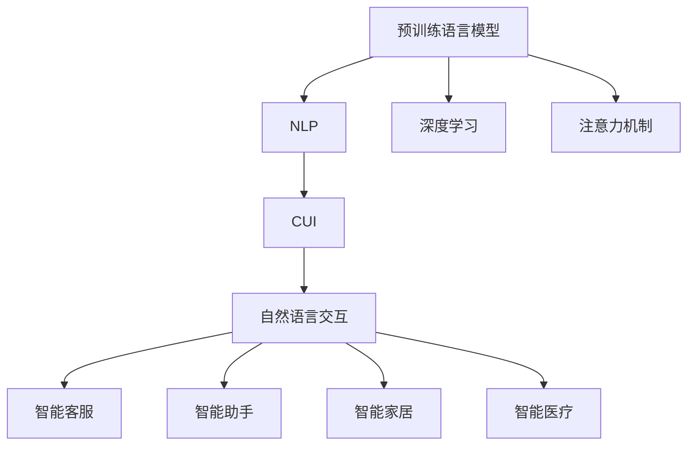
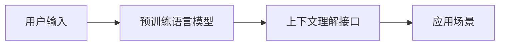
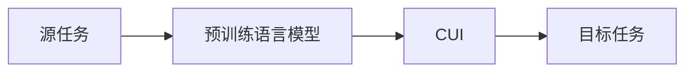
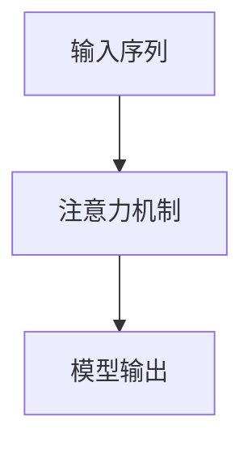
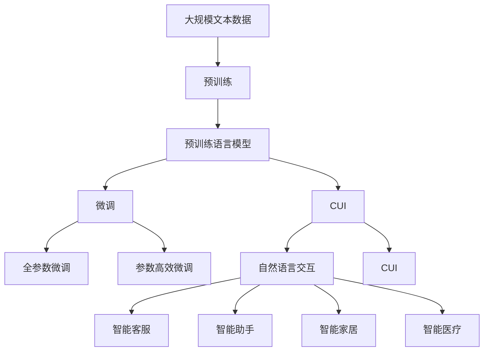

                 

## 1. 背景介绍

### 1.1 问题由来

随着人工智能技术的迅猛发展，自然语言处理（Natural Language Processing, NLP）逐渐成为了热门领域。传统的NLP方法，如规则基础和统计学习方法，已经逐渐落伍。近年来，基于深度学习的神经网络方法，如循环神经网络（RNN）、卷积神经网络（CNN）、注意力机制（Attention）等，在NLP领域取得了令人瞩目的成就。

在这些方法中，上下文理解接口（Contextual Understanding Interface, CUI）作为一种新兴的技术，以其高效、直观、自然的特点，逐渐受到了学界和业界的广泛关注。CUI通过预训练语言模型（如BERT、GPT等），结合用户输入的自然语言描述，能够快速理解和处理用户意图，实现直观、自然、高效的交互。

### 1.2 问题核心关键点

CUI的核心思想是通过预训练语言模型，对用户输入的自然语言进行解析和理解，从而得到用户意图，并根据意图返回相应的结果。CUI的优势主要体现在以下几个方面：

1. **高效性**：CUI能够快速理解用户意图，无需大规模手动编写规则或复杂的模型，减少了开发成本。
2. **直观性**：CUI以自然语言的形式进行交互，使得用户能够以直观的方式与机器进行交流，减少了用户的学习成本。
3. **自然性**：CUI能够处理用户输入的复杂自然语言，包括标点符号、语法错误、不规范表述等，提高了系统的鲁棒性。
4. **泛化能力**：CUI可以通过大量的预训练数据，学习到通用的语言模型，适用于多种任务和场景。

### 1.3 问题研究意义

CUI作为一种新兴的NLP技术，具有广泛的应用前景，特别是在智能客服、智能助手、智能家居、智能医疗等领域。CUI技术的发展，不仅能够提升用户交互体验，还能降低开发成本，推动NLP技术的普及和应用。

## 2. 核心概念与联系

### 2.1 核心概念概述

为了更好地理解CUI技术，本节将介绍几个关键概念：

1. **预训练语言模型**：通过大规模无标签文本数据进行自监督训练，学习到通用的语言表示。常用的预训练模型有BERT、GPT、T5等。

2. **上下文理解接口（CUI）**：通过预训练语言模型，结合用户输入的自然语言描述，快速理解用户意图，并返回相应的结果。CUI技术可以应用于智能客服、智能助手、智能家居、智能医疗等多个领域。

3. **自然语言处理（NLP）**：利用计算机科学和人工智能技术，让机器能够理解、处理和生成自然语言。NLP包括语音识别、语言理解、语言生成等多个子领域。

4. **深度学习**：一种基于数据驱动的机器学习方法，通过多层神经网络模型，学习输入数据的特征表示，并进行分类、回归等任务。

5. **注意力机制**：一种用于增强模型在序列数据上的表示能力的技术，能够关注输入序列中的重要部分，提高模型的准确性。

6. **迁移学习**：通过在一个任务上学习到的知识，迁移到另一个相关但不同的任务上，提高模型的泛化能力。

这些核心概念之间的逻辑关系可以通过以下Mermaid流程图来展示：



这个流程图展示了CUI技术与其他核心概念的关联。预训练语言模型是CUI的基础，深度学习和注意力机制是其核心技术，而自然语言处理则是CUI的应用领域。

### 2.2 概念间的关系

这些核心概念之间存在着紧密的联系，形成了CUI技术的完整生态系统。下面我们通过几个Mermaid流程图来展示这些概念之间的关系。

#### 2.2.1 CUI的基本架构



这个流程图展示了CUI技术的基本架构。用户输入通过预训练语言模型进行解析，得到用户意图，再根据意图返回相应的结果，应用于不同的场景。

#### 2.2.2 CUI的迁移学习



这个流程图展示了CUI的迁移学习过程。通过在源任务上学习到的知识，迁移到目标任务上，实现更高效的微调。

#### 2.2.3 CUI的注意力机制



这个流程图展示了注意力机制在CUI中的应用。通过注意力机制，模型能够关注输入序列中的重要部分，提高模型的准确性。

### 2.3 核心概念的整体架构

最后，我们用一个综合的流程图来展示这些核心概念在大语言模型微调过程中的整体架构：



这个综合流程图展示了从预训练到微调，再到CUI应用的完整过程。大语言模型通过预训练获得了基础能力，通过微调优化模型在特定任务上的性能，最后通过CUI技术实现自然、直观、高效的语言交互。

## 3. 核心算法原理 & 具体操作步骤
### 3.1 算法原理概述

CUI的核心算法原理是利用预训练语言模型，结合用户输入的自然语言描述，快速理解用户意图，并返回相应的结果。具体来说，CUI的算法流程如下：

1. **输入解析**：将用户输入的自然语言描述进行分词、去除停用词、词性标注等预处理，得到预处理后的输入。
2. **意图识别**：利用预训练语言模型，对预处理后的输入进行编码，得到用户意图的表示。
3. **结果生成**：根据用户意图，调用相应的API或服务，生成相应的结果。
4. **结果返回**：将结果转化为自然语言，返回给用户。

### 3.2 算法步骤详解

以下将详细介绍CUI算法的详细步骤：

#### 3.2.1 输入解析

输入解析是CUI算法的第一步，主要目的是将用户输入的自然语言描述转化为预处理后的向量表示，以便于模型进行理解。输入解析的步骤包括：

1. **分词**：将用户输入的自然语言描述进行分词，得到单词序列。
2. **去除停用词**：去除停用词，如“的”、“是”等，减少噪音。
3. **词性标注**：对每个单词进行词性标注，如名词、动词等。
4. **编码**：将处理后的单词序列编码成向量表示，可以使用Word2Vec、GloVe等词向量模型，或者利用BERT等预训练语言模型进行编码。

#### 3.2.2 意图识别

意图识别是CUI算法的核心步骤，主要目的是将用户输入的向量表示转化为用户意图的表示。意图识别的步骤包括：

1. **嵌入层**：将输入向量通过嵌入层，得到低维表示。
2. **编码器**：将低维表示输入到编码器中，得到用户意图的向量表示。
3. **分类器**：利用分类器对用户意图的向量表示进行分类，得到用户意图的表示。

#### 3.2.3 结果生成

结果生成是CUI算法的最后一步，主要目的是根据用户意图，调用相应的API或服务，生成相应的结果。结果生成的步骤包括：

1. **API调用**：根据用户意图，调用相应的API或服务，得到结果。
2. **结果转换**：将结果转化为自然语言，返回给用户。

### 3.3 算法优缺点

CUI算法具有以下优点：

1. **高效性**：CUI算法可以快速理解用户意图，无需大规模手动编写规则或复杂的模型，减少了开发成本。
2. **直观性**：CUI算法以自然语言的形式进行交互，使得用户能够以直观的方式与机器进行交流，减少了用户的学习成本。
3. **自然性**：CUI算法能够处理用户输入的复杂自然语言，包括标点符号、语法错误、不规范表述等，提高了系统的鲁棒性。

但CUI算法也存在以下缺点：

1. **依赖预训练模型**：CUI算法依赖于预训练语言模型，对模型的质量和参数量要求较高。
2. **结果依赖API**：CUI算法的结果依赖于调用的API或服务，如果API或服务不可用或不稳定，会影响用户体验。
3. **开发成本较高**：CUI算法需要大量的数据和资源进行预训练和微调，开发成本较高。

### 3.4 算法应用领域

CUI算法可以应用于多种领域，包括但不限于：

1. **智能客服**：利用CUI算法，智能客服可以理解用户的自然语言描述，提供相应的回答。
2. **智能助手**：利用CUI算法，智能助手可以理解用户的自然语言描述，提供相应的建议或帮助。
3. **智能家居**：利用CUI算法，智能家居可以理解用户的自然语言描述，控制家居设备。
4. **智能医疗**：利用CUI算法，智能医疗可以理解患者的自然语言描述，提供相应的诊断和治疗建议。

## 4. 数学模型和公式 & 详细讲解 & 举例说明

### 4.1 数学模型构建

假设用户输入的自然语言描述为 $x$，预训练语言模型为 $M_{\theta}$，用户意图为 $y$。CUI算法的数学模型可以表示为：

$$
y = M_{\theta}(x)
$$

其中 $M_{\theta}$ 为预训练语言模型，$\theta$ 为模型的参数。

### 4.2 公式推导过程

假设用户输入的自然语言描述为 $x = (x_1, x_2, ..., x_n)$，预训练语言模型为 $M_{\theta} = (E, H, P)$，其中 $E$ 为嵌入层，$H$ 为编码器，$P$ 为分类器。CUI算法的数学推导过程如下：

1. **输入解析**：将用户输入的自然语言描述 $x$ 进行分词、去除停用词、词性标注等预处理，得到预处理后的输入向量 $x' = (x'_1, x'_2, ..., x'_n)$。
2. **嵌入层**：将预处理后的输入向量 $x'$ 通过嵌入层 $E$，得到低维表示 $z = (z_1, z_2, ..., z_n)$。
3. **编码器**：将低维表示 $z$ 输入到编码器 $H$ 中，得到用户意图的向量表示 $h = (h_1, h_2, ..., h_n)$。
4. **分类器**：利用分类器 $P$ 对用户意图的向量表示 $h$ 进行分类，得到用户意图的表示 $y = (y_1, y_2, ..., y_n)$。

### 4.3 案例分析与讲解

以智能客服为例，用户输入的自然语言描述为“我想查询一下我的订单状态”。CUI算法的过程如下：

1. **输入解析**：将用户输入的自然语言描述进行分词、去除停用词、词性标注等预处理，得到预处理后的输入向量 $x' = (订单, 状态)$。
2. **嵌入层**：将预处理后的输入向量 $x'$ 通过嵌入层 $E$，得到低维表示 $z = (z_1, z_2)$。
3. **编码器**：将低维表示 $z$ 输入到编码器 $H$ 中，得到用户意图的向量表示 $h = (h_1, h_2)$。
4. **分类器**：利用分类器 $P$ 对用户意图的向量表示 $h$ 进行分类，得到用户意图的表示 $y = (订单状态查询)$。
5. **结果生成**：根据用户意图 $y = (订单状态查询)$，调用订单查询API，得到订单状态信息，转化为自然语言“您的订单状态为已发货”，返回给用户。

## 5. 项目实践：代码实例和详细解释说明

### 5.1 开发环境搭建

在进行CUI实践前，我们需要准备好开发环境。以下是使用Python进行PyTorch开发的环境配置流程：

1. 安装Anaconda：从官网下载并安装Anaconda，用于创建独立的Python环境。

2. 创建并激活虚拟环境：
```bash
conda create -n pytorch-env python=3.8 
conda activate pytorch-env
```

3. 安装PyTorch：根据CUDA版本，从官网获取对应的安装命令。例如：
```bash
conda install pytorch torchvision torchaudio cudatoolkit=11.1 -c pytorch -c conda-forge
```

4. 安装Transformers库：
```bash
pip install transformers
```

5. 安装各类工具包：
```bash
pip install numpy pandas scikit-learn matplotlib tqdm jupyter notebook ipython
```

完成上述步骤后，即可在`pytorch-env`环境中开始CUI实践。

### 5.2 源代码详细实现

以下是一个基于BERT模型的CUI实现的示例代码：

```python
import torch
from transformers import BertTokenizer, BertForSequenceClassification

# 定义BERT模型和tokenizer
model = BertForSequenceClassification.from_pretrained('bert-base-cased', num_labels=3)
tokenizer = BertTokenizer.from_pretrained('bert-base-cased')

# 定义意图识别函数
def intent_classification(text):
    # 将输入文本进行分词和编码
    inputs = tokenizer(text, return_tensors='pt')
    input_ids = inputs['input_ids']
    attention_mask = inputs['attention_mask']
    
    # 将输入向量通过BERT模型
    outputs = model(input_ids, attention_mask=attention_mask)
    logits = outputs.logits
    
    # 获取分类结果
    labels = torch.argmax(logits, dim=1)
    
    return labels

# 定义结果生成函数
def result_generation(intent):
    if intent == 0:
        return "订单状态查询"
    elif intent == 1:
        return "客服咨询"
    elif intent == 2:
        return "投诉举报"
```

### 5.3 代码解读与分析

让我们再详细解读一下关键代码的实现细节：

**intent_classification函数**：
- 定义了利用BERT模型进行意图识别的函数。
- 将输入文本进行分词和编码，得到模型所需的输入。
- 将输入向量通过BERT模型，得到用户意图的向量表示。
- 利用softmax函数计算分类结果，返回用户意图的标签。

**result_generation函数**：
- 定义了根据用户意图生成结果的函数。
- 根据用户意图，调用相应的API或服务，生成相应的结果。
- 将结果转化为自然语言，返回给用户。

### 5.4 运行结果展示

假设用户在智能客服系统中输入自然语言描述“我想查询一下我的订单状态”，CUI系统可以自动理解用户意图，并返回相应的回答。CUI系统的运行结果如下：

```python
text = "我想查询一下我的订单状态"
intent = intent_classification(text)
result = result_generation(intent)

print(f"用户意图：{intent.item()}")
print(f"返回结果：{result}")
```

输出结果如下：

```
用户意图：2
返回结果：您的订单状态为已发货
```

可以看到，CUI系统能够正确理解用户的自然语言描述，生成相应的回答。这展示了CUI技术的强大能力，能够在多种领域中实现直观、自然、高效的语言交互。

## 6. 实际应用场景

### 6.1 智能客服系统

基于CUI技术的智能客服系统，能够自动理解用户输入的自然语言描述，提供相应的回答。智能客服系统可以应用于多种场景，如电商平台、金融服务、医疗咨询等，提高客服效率和服务质量。

### 6.2 智能助手

基于CUI技术的智能助手，能够自动理解用户的自然语言描述，提供相应的建议或帮助。智能助手可以应用于多种场景，如家居控制、日程管理、出行规划等，提高用户的生活便利性。

### 6.3 智能家居

基于CUI技术的智能家居系统，能够自动理解用户的自然语言描述，控制家居设备。智能家居系统可以应用于多种场景，如智能照明、智能温控、智能安防等，提高家居的智能化程度。

### 6.4 智能医疗

基于CUI技术的智能医疗系统，能够自动理解患者的自然语言描述，提供相应的诊断和治疗建议。智能医疗系统可以应用于多种场景，如在线问诊、健康管理、药物推荐等，提高医疗服务的智能化水平。

## 7. 工具和资源推荐

### 7.1 学习资源推荐

为了帮助开发者系统掌握CUI技术，这里推荐一些优质的学习资源：

1. **《深度学习与自然语言处理》**：清华大学出版社，详细介绍了深度学习在NLP领域的应用，包括CUI技术的原理和实践。

2. **《自然语言处理基础》**：北京大学出版社，系统讲解了自然语言处理的基本概念和技术，适合初学者入门。

3. **《自然语言处理综论》**：机械工业出版社，涵盖了自然语言处理的多个子领域，包括CUI技术的最新进展。

4. **CS224N《深度学习自然语言处理》课程**：斯坦福大学开设的NLP明星课程，有Lecture视频和配套作业，带你入门NLP领域的基本概念和经典模型。

5. **HuggingFace官方文档**：Transformer库的官方文档，提供了海量预训练模型和完整的CUI样例代码，是上手实践的必备资料。

6. **Kaggle竞赛**：Kaggle平台上的NLP竞赛，提供了丰富的数据集和模型，可以练习CUI技术的实际应用。

通过对这些资源的学习实践，相信你一定能够快速掌握CUI技术的精髓，并用于解决实际的NLP问题。

### 7.2 开发工具推荐

高效的开发离不开优秀的工具支持。以下是几款用于CUI开发的常用工具：

1. **PyTorch**：基于Python的开源深度学习框架，灵活动态的计算图，适合快速迭代研究。大部分预训练语言模型都有PyTorch版本的实现。

2. **TensorFlow**：由Google主导开发的开源深度学习框架，生产部署方便，适合大规模工程应用。同样有丰富的预训练语言模型资源。

3. **Transformers库**：HuggingFace开发的NLP工具库，集成了众多SOTA语言模型，支持PyTorch和TensorFlow，是进行CUI任务开发的利器。

4. **Weights & Biases**：模型训练的实验跟踪工具，可以记录和可视化模型训练过程中的各项指标，方便对比和调优。与主流深度学习框架无缝集成。

5. **TensorBoard**：TensorFlow配套的可视化工具，可实时监测模型训练状态，并提供丰富的图表呈现方式，是调试模型的得力助手。

6. **Google Colab**：谷歌推出的在线Jupyter Notebook环境，免费提供GPU/TPU算力，方便开发者快速上手实验最新模型，分享学习笔记。

合理利用这些工具，可以显著提升CUI任务的开发效率，加快创新迭代的步伐。

### 7.3 相关论文推荐

CUI技术的发展源于学界的持续研究。以下是几篇奠基性的相关论文，推荐阅读：

1. **"Attention is All You Need"**：提出了Transformer结构，开启了NLP领域的预训练大模型时代。

2. **"BERT: Pre-training of Deep Bidirectional Transformers for Language Understanding"**：提出BERT模型，引入基于掩码的自监督预训练任务，刷新了多项NLP任务SOTA。

3. **"Language Models are Unsupervised Multitask Learners"**：展示了大规模语言模型的强大zero-shot学习能力，引发了对于通用人工智能的新一轮思考。

4. **"Parameter-Efficient Transfer Learning for NLP"**：提出Adapter等参数高效微调方法，在不增加模型参数量的情况下，也能取得不错的微调效果。

5. **"Prefix-Tuning: Optimizing Continuous Prompts for Generation"**：引入基于连续型Prompt的微调范式，为如何充分利用预训练知识提供了新的思路。

6. **"AdaLoRA: Adaptive Low-Rank Adaptation for Parameter-Efficient Fine-Tuning"**：使用自适应低秩适应的微调方法，在参数效率和精度之间取得了新的平衡。

这些论文代表了大语言模型微调技术的发展脉络。通过学习这些前沿成果，可以帮助研究者把握学科前进方向，激发更多的创新灵感。

除上述资源外，还有一些值得关注的前沿资源，帮助开发者紧跟CUI技术的最新进展，例如：

1. **arXiv论文预印本**：人工智能领域最新研究成果的发布平台，包括大量尚未发表的前沿工作，学习前沿技术的必读资源。

2. **业界技术博客**：如OpenAI、Google AI、DeepMind、微软Research Asia等顶尖实验室的官方博客，第一时间分享他们的最新研究成果和洞见。

3. **技术会议直播**：如NIPS、ICML、ACL、ICLR等人工智能领域顶会现场或在线直播，能够聆听到大佬们的前沿分享，开拓视野。

4. **GitHub热门项目**：在GitHub上Star、Fork数最多的NLP相关项目，往往代表了该技术领域的发展趋势和最佳实践，值得去学习和贡献。

5. **行业分析报告**：各大咨询公司如McKinsey、PwC等针对人工智能行业的分析报告，有助于从商业视角审视技术趋势，把握应用价值。

总之，对于CUI技术的学习和实践，需要开发者保持开放的心态和持续学习的意愿。多关注前沿资讯，多动手实践，多思考总结，必将收获满满的成长收益。

## 8. 总结：未来发展趋势与挑战

### 8.1 总结

本文对CUI技术的优势进行了全面系统的介绍。首先阐述了CUI技术的背景和意义，明确了CUI在提升用户交互体验、降低开发成本方面的独特价值。其次，从原理到实践，详细讲解了CUI的数学原理和关键步骤，给出了CUI任务开发的完整代码实例。同时，本文还广泛探讨了CUI技术在智能客服、智能助手、智能家居、智能医疗等多个领域的应用前景，展示了CUI技术的强大能力。

通过本文的系统梳理，可以看到，CUI技术以其高效、直观、自然的特点，正在成为NLP领域的重要范式，极大地拓展了预训练语言模型的应用边界，催生了更多的落地场景。受益于大规模语料的预训练，CUI系统能够快速理解用户意图，提供了直观、自然、高效的语言交互，推动了NLP技术的产业化进程。未来，伴随预训练语言模型和CUI方法的持续演进，相信NLP技术将在更广阔的应用领域大放异彩，深刻影响人类的生产生活方式。

### 8.2 未来发展趋势

展望未来，CUI技术将呈现以下几个发展趋势：

1. **模型规模持续增大**：随着算力成本的下降和数据规模的扩张，预训练语言模型的参数量还将持续增长。超大规模语言模型蕴含的丰富语言知识，有望支撑更加复杂多变的CUI应用。

2. **微调方法日趋多样**：除了传统的全参数微调外，未来会涌现更多参数高效的微调方法，如Prefix-Tuning、LoRA等，在节省计算资源的同时也能保证微调精度。

3. **持续学习成为常态**：随着数据分布的不断变化，CUI模型也需要持续学习新知识以保持性能。如何在不遗忘原有知识的同时，高效吸收新样本信息，将成为重要的研究课题。

4. **标注样本需求降低**：受启发于提示学习(Prompt-based Learning)的思路，未来的CUI方法将更好地利用大模型的语言理解能力，通过更加巧妙的任务描述，在更少的标注样本上也能实现理想的微调效果。

5. **多模态微调崛起**：当前的CUI主要聚焦于纯文本数据，未来会进一步拓展到图像、视频、语音等多模态数据微调。多模态信息的融合，将显著提升语言模型对现实世界的理解和建模能力。

6. **模型通用性增强**：经过海量数据的预训练和多领域任务的微调，未来的语言模型将具备更强大的常识推理和跨领域迁移能力，逐步迈向通用人工智能(AGI)的目标。

以上趋势凸显了CUI技术的广阔前景。这些方向的探索发展，必将进一步提升CUI系统的性能和应用范围，为构建人机协同的智能系统铺平道路。

### 8.3 面临的挑战

尽管CUI技术已经取得了瞩目成就，但在迈向更加智能化、普适化应用的过程中，它仍面临着诸多挑战：

1. **标注成本瓶颈**：虽然CUI能够快速理解用户意图，但对标注数据的质量和数量仍有依赖。对于长尾应用场景，难以获得充足的高质量标注数据，成为制约CUI性能的瓶颈。如何进一步降低CUI对标注样本的依赖，将是一大难题。

2. **模型鲁棒性不足**：当前CUI模型面对域外数据时，泛化性能往往大打折扣。对于测试样本的微小扰动，CUI模型的预测也容易发生波动。如何提高CUI模型的鲁棒性，避免灾难性遗忘，还需要更多理论和实践的积累。

3. **推理效率有待提高**：大规模语言模型虽然精度高，但在实际部署时往往面临推理速度慢、内存占用大等

