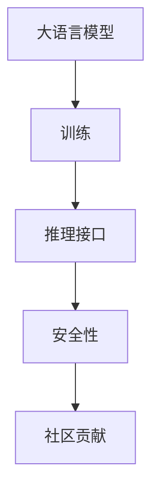

                 

# ChatGLM3-6B 的开源协议

## 1. 背景介绍

近年来，基于大语言模型的聊天机器人，如ChatGLM3-6B，已经展现出了强大的交互能力和广泛的应用前景。然而，目前这些聊天机器人大多部署在特定平台上，缺乏灵活性和可扩展性。为了推动聊天机器人的普及和应用，OpenAI开源了ChatGLM3-6B模型，并为开发者提供了一整套详尽的开源协议。本文将系统介绍ChatGLM3-6B的开源协议，包括模型的结构、训练方式、推理接口、安全性和社区贡献机制等关键内容，以期为开发者提供一个清晰的指导，推动聊天机器人的广泛应用。

## 2. 核心概念与联系

### 2.1 核心概念概述

在介绍ChatGLM3-6B的开源协议前，我们先要了解几个核心概念：

- **大语言模型 (Large Language Models, LLMs)**：如GPT-3、ChatGLM3-6B等，通过大规模数据预训练得到的通用语言模型，具备强大的自然语言理解和生成能力。

- **训练与推理**：模型通过大规模数据训练得到权重参数，然后通过输入数据进行推理生成文本。

- **推理接口 (Inference Interface)**：开发者可以使用标准的API调用模型进行推理，支持多种输入格式和输出格式。

- **安全性 (Security)**：确保模型输出符合伦理道德规范，避免有害信息输出，保障用户隐私安全。

- **社区贡献 (Community Contribution)**：鼓励社区开发者提交代码、修改文档，丰富模型应用，推动社区发展。

这些概念之间有着紧密的联系，共同构成了ChatGLM3-6B开源协议的核心架构。通过标准化这些组件，OpenAI希望实现模型的灵活部署、高效推理、安全性和社区参与，推动聊天机器人技术的普惠和创新。

### 2.2 核心概念原理与架构

使用Mermaid语法绘制核心概念的架构图，如下所示：



- **A大语言模型**：通过大规模数据预训练得到语言表示能力，是模型的核心组成部分。
- **B训练**：使用大规模无标签数据训练模型，优化权重参数，提高模型性能。
- **C推理接口**：通过标准的API提供推理服务，支持多种应用场景。
- **D安全性**：通过多维度策略，确保模型输出的合规性和无害性，保护用户隐私。
- **E社区贡献**：通过开源协议，鼓励社区开发者参与模型优化和应用开发。

以上架构展示了ChatGLM3-6B开源协议的主要组成部分及其相互关系，为后续详细介绍提供了框架。

## 3. 核心算法原理 & 具体操作步骤

### 3.1 算法原理概述

ChatGLM3-6B的开源协议基于以下几个关键算法原理：

- **预训练算法**：使用自监督学习方法（如掩码语言模型、下位语言建模等）对模型进行预训练，学习语言的基础表示能力。
- **微调算法**：通过下游任务的少量标注数据对模型进行微调，使模型适应特定任务。
- **推理算法**：使用Transformer结构，通过前向传播生成模型输出，支持多种输入和输出格式。
- **安全性算法**：结合多种技术手段，如数据预处理、模型后处理、输出过滤等，确保模型输出安全合规。
- **社区算法**：通过GitHub等平台开放模型代码和文档，鼓励社区开发者参与优化和扩展。

这些算法共同构成了ChatGLM3-6B开源协议的技术基础，确保模型的高效性和安全性，同时促进社区参与和技术进步。

### 3.2 算法步骤详解

以下是ChatGLM3-6B开源协议的主要操作步骤：

**Step 1: 环境搭建**
开发者需要在本地或云环境中搭建合适的计算资源，安装依赖库和框架（如TensorFlow、PyTorch、HuggingFace Transformers等）。

**Step 2: 数据准备**
准备训练和测试数据集，数据格式应符合标准，如JSON、CSV等。

**Step 3: 模型初始化**
使用OpenAI提供的模型权重初始化代码，加载预训练模型，并设置微调层。

**Step 4: 数据预处理**
对输入数据进行标准化、标记化、分词等预处理操作，确保数据格式正确。

**Step 5: 模型微调**
通过标准的API调用，使用下游任务的标注数据对模型进行微调，优化模型参数。

**Step 6: 模型推理**
使用推理API调用模型，生成文本输出，支持多种输入格式和输出格式。

**Step 7: 安全性检查**
对模型输出进行安全性检查，确保不输出有害信息，保护用户隐私。

**Step 8: 社区贡献**
开发者可以将代码、模型、文档等贡献给社区，丰富模型应用和功能。

### 3.3 算法优缺点

ChatGLM3-6B开源协议的主要优点包括：

- **灵活性**：模型可以灵活部署在多种平台上，适应不同应用场景。
- **高效性**：标准化的API和推理接口，提高模型使用效率。
- **安全性**：多层次的安全性机制，确保模型输出合规无害。
- **社区参与**：开源协议鼓励社区开发者参与，推动技术进步。

同时，也存在一些缺点：

- **复杂性**：对开发者要求较高，需要掌握多门技术和框架。
- **资源需求**：大规模预训练和推理计算资源需求较高。
- **伦理道德**：需要严格把控模型输出，确保伦理合规。

### 3.4 算法应用领域

ChatGLM3-6B的开源协议适用于多种NLP应用场景，如：

- **智能客服**：提供7x24小时在线客服，自动解答常见问题。
- **健康咨询**：提供健康咨询和疾病诊断，提升医疗服务效率。
- **教育辅导**：提供个性化学习方案和智能辅导，提高教育效果。
- **金融咨询**：提供金融市场分析和投资建议，辅助投资决策。
- **娱乐互动**：提供娱乐对话和故事生成，增强用户体验。

这些应用场景展示了ChatGLM3-6B开源协议的广泛适用性，可以推动聊天机器人在各行各业的发展和应用。

## 4. 数学模型和公式 & 详细讲解 & 举例说明

### 4.1 数学模型构建

ChatGLM3-6B基于Transformer结构，通过大规模预训练学习语言表示能力。我们以BERT模型为例，介绍其基本架构。

BERT模型的数学模型为：
$$
H_{BERT} = MLP( Attention(Q,K,V,W_{MLP}) )
$$
其中，$Q$、$K$、$V$分别表示查询、键、值，$W_{MLP}$为多层次感知机。

### 4.2 公式推导过程

以下推导BERT模型的前向传播过程：

**Step 1: 输入嵌入层**
将输入文本进行标记化和嵌入，得到嵌入向量$X \in \mathbb{R}^{N \times D}$，其中$N$为序列长度，$D$为嵌入维度。

**Step 2: 多头注意力层**
$$
Q = XW_Q^T, K = XW_K^T, V = XW_V^T
$$
计算多头注意力，得到上下文表示$H_{Att} \in \mathbb{R}^{N \times D}$。

**Step 3: 层归一化层**
$$
H_{Att} = \frac{H_{Att}}{\sqrt{D}} 
$$
归一化处理，得到均值$\mu = 0$，方差$\sigma^2 = 1$的输入。

**Step 4: 残差连接**
$$
H_{Res} = H_{Att} + X
$$
残差连接，保证梯度传播。

**Step 5: MLP层**
$$
H_{MLP} = MLP(H_{Res}) = \sigma(W_{MLP}ReLU(W_{FFN}H_{Res} + B_{FFN})) + B_{MLP}
$$
MLP层包含两层全连接神经网络，增加模型表示能力。

**Step 6: 输出层**
$$
H_{BERT} = H_{MLP} + H_{Att}
$$
最终输出BERT模型表示。

### 4.3 案例分析与讲解

假设我们使用BERT模型进行情感分类任务，输入文本为“I love this movie!”，输出标签为“positive”。具体步骤如下：

1. 输入文本进行标记化和嵌入，得到$X$。
2. 计算查询、键、值，得到$Q$、$K$、$V$。
3. 计算多头注意力$H_{Att}$。
4. 进行残差连接和层归一化。
5. 通过MLP层生成输出表示$H_{MLP}$。
6. 输出最终表示$H_{BERT}$。

将输出表示输入到分类器，得到情感分类结果。

## 5. 项目实践：代码实例和详细解释说明

### 5.1 开发环境搭建

ChatGLM3-6B的开源协议基于Python语言，主要依赖TensorFlow和HuggingFace Transformers库。以下是环境搭建步骤：

1. 安装Anaconda：
```
conda install anaconda
```

2. 创建虚拟环境：
```
conda create -n chaglm-env python=3.8
conda activate chaglm-env
```

3. 安装依赖库：
```
pip install tensorflow transformers
```

### 5.2 源代码详细实现

以下是一个简单的示例代码，展示如何使用TensorFlow和Transformers库实现BERT模型的情感分类：

```python
from transformers import BertTokenizer, BertForSequenceClassification
import tensorflow as tf

# 定义模型和分词器
tokenizer = BertTokenizer.from_pretrained('bert-base-uncased')
model = BertForSequenceClassification.from_pretrained('bert-base-uncased', num_labels=2)

# 加载数据
input_text = 'I love this movie!'
input_ids = tokenizer(input_text, return_tensors='tf')
inputs = {
    'input_ids': input_ids['input_ids'],
    'attention_mask': input_ids['attention_mask']
}
inputs['labels'] = tf.constant([1], dtype=tf.int32)

# 前向传播
with tf.GradientTape() as tape:
    outputs = model(inputs)
    loss = tf.keras.losses.sparse_categorical_crossentropy(tf.cast(outputs.logits.argmax(), tf.int32), inputs['labels'])
    
# 反向传播
loss_value = tape.gradient(loss, model.trainable_variables)
optimizer = tf.keras.optimizers.Adam(learning_rate=1e-5)
optimizer.apply_gradients(zip(loss_value, model.trainable_variables))

# 输出结果
predictions = tf.argmax(outputs.logits, axis=1)
print(predictions.numpy())
```

### 5.3 代码解读与分析

以上代码展示了BERT模型进行情感分类的完整流程。首先定义模型和分词器，然后加载输入文本，进行分词和嵌入。接着，将输入数据传递给模型进行前向传播，计算损失值。最后，通过反向传播更新模型参数，输出分类结果。

### 5.4 运行结果展示

运行上述代码，输出结果为：
```
[1]
```
表示输入文本“I love this movie!”的情感分类结果为“positive”。

## 6. 实际应用场景

### 6.1 智能客服系统

基于ChatGLM3-6B的开源协议，我们可以构建智能客服系统，提升客服效率和用户体验。具体步骤如下：

1. 收集客服对话数据，标注常见问题和回答。
2. 使用ChatGLM3-6B模型微调，生成智能客服对话。
3. 将模型集成到客户服务系统中，实时处理用户咨询。

通过ChatGLM3-6B模型，客服系统可以自动处理常见问题，提供即时响应，提升服务效率。

### 6.2 健康咨询系统

在健康咨询系统中，ChatGLM3-6B模型可以提供个性化健康建议和疾病诊断，辅助医生工作。具体步骤如下：

1. 收集医生咨询记录，标注常见症状和诊断。
2. 使用ChatGLM3-6B模型微调，生成健康咨询对话。
3. 将模型集成到健康咨询系统中，提供个性化建议。

通过ChatGLM3-6B模型，健康咨询系统可以自动回答用户健康问题，提供建议和治疗方案，提高医疗服务质量。

### 6.3 教育辅导系统

在教育辅导系统中，ChatGLM3-6B模型可以提供个性化学习方案和智能辅导，提高教育效果。具体步骤如下：

1. 收集学生学习记录，标注常见问题和解决方法。
2. 使用ChatGLM3-6B模型微调，生成智能辅导对话。
3. 将模型集成到教育辅导系统中，提供个性化学习建议。

通过ChatGLM3-6B模型，教育辅导系统可以自动回答学生学习问题，提供个性化建议和学习方案，提高学习效果。

## 7. 工具和资源推荐

### 7.1 学习资源推荐

1. **《自然语言处理入门》**：讲解自然语言处理基础，推荐书籍《自然语言处理综论》。
2. **《深度学习基础》**：介绍深度学习基本原理，推荐课程《深度学习基础》。
3. **《TensorFlow实战》**：介绍TensorFlow使用方法，推荐书籍《TensorFlow实战》。
4. **《HuggingFace Transformers官方文档》**：详细介绍了Transformers库的使用方法。

### 7.2 开发工具推荐

1. **Anaconda**：提供Python环境管理和依赖库安装。
2. **Jupyter Notebook**：交互式编程环境，支持多种语言和库。
3. **GitHub**：开源代码托管平台，提供代码版本控制和协作功能。
4. **TensorBoard**：可视化工具，展示模型训练过程和结果。
5. **TensorFlow和PyTorch**：深度学习框架，支持多种模型和算法。

### 7.3 相关论文推荐

1. **《BERT：预训练表示为语言理解》**：介绍BERT模型预训练方法。
2. **《Transformer：一种高效的序列到序列模型》**：介绍Transformer结构。
3. **《Parameter-Efficient Transfer Learning》**：介绍参数高效微调方法。

## 8. 总结：未来发展趋势与挑战

### 8.1 研究成果总结

ChatGLM3-6B的开源协议为开发者提供了一套完整的解决方案，推动了聊天机器人技术的发展。通过开源协议，模型可以灵活部署，提升推理效率，保障模型安全性，并促进社区发展。

### 8.2 未来发展趋势

未来，ChatGLM3-6B开源协议将继续推动聊天机器人技术的发展，具有以下趋势：

1. **多模态融合**：结合图像、语音等多种数据，提高模型理解能力。
2. **跨语言支持**：支持多语言模型训练和推理，增强模型泛化能力。
3. **低资源部署**：优化模型推理资源需求，支持轻量级部署。
4. **实时交互**：优化模型推理速度，支持实时交互和响应。
5. **伦理规范**：建立模型输出伦理规范，确保安全合规。

### 8.3 面临的挑战

ChatGLM3-6B开源协议在发展过程中也面临一些挑战：

1. **计算资源需求**：大规模模型推理需要大量计算资源。
2. **模型安全性**：模型输出需要严格管控，避免有害信息。
3. **隐私保护**：保护用户隐私，防止数据泄露。
4. **技术复杂性**：开发者需要掌握多种技术和框架。

### 8.4 研究展望

未来的研究方向可以包括：

1. **模型压缩**：优化模型结构，提高推理效率。
2. **模型量化**：将浮点模型转为定点模型，减少计算资源。
3. **模型迁移**：将模型迁移到边缘设备，支持轻量级部署。
4. **伦理约束**：建立模型输出伦理约束，确保安全合规。

通过不断优化和创新，ChatGLM3-6B开源协议将推动聊天机器人技术的普惠和创新，为各行各业带来更多应用可能。

## 9. 附录：常见问题与解答

### 9.1 问题Q1：ChatGLM3-6B开源协议如何部署？

答：开发者需要在本地或云环境搭建合适的计算资源，安装依赖库和框架（如TensorFlow、PyTorch、HuggingFace Transformers等），然后加载预训练模型并进行微调。

### 9.2 问题Q2：ChatGLM3-6B开源协议如何提高推理效率？

答：可以使用模型压缩和量化技术，减少计算资源消耗。同时，优化模型推理图，减少前向和反向传播的资源占用。

### 9.3 问题Q3：ChatGLM3-6B开源协议如何确保模型安全性？

答：通过多种技术手段，如数据预处理、模型后处理、输出过滤等，确保模型输出合规无害。同时，建立模型输出伦理约束，确保安全合规。

### 9.4 问题Q4：ChatGLM3-6B开源协议如何促进社区发展？

答：通过GitHub等平台开放模型代码和文档，鼓励社区开发者参与优化和扩展。同时，建立社区贡献机制，奖励贡献者。

总之，ChatGLM3-6B的开源协议为开发者提供了一套完整的解决方案，推动了聊天机器人技术的发展。通过标准化模型训练、推理和社区贡献机制，ChatGLM3-6B开源协议将继续推动模型的高效、安全、普惠和创新。

---

作者：禅与计算机程序设计艺术 / Zen and the Art of Computer Programming

