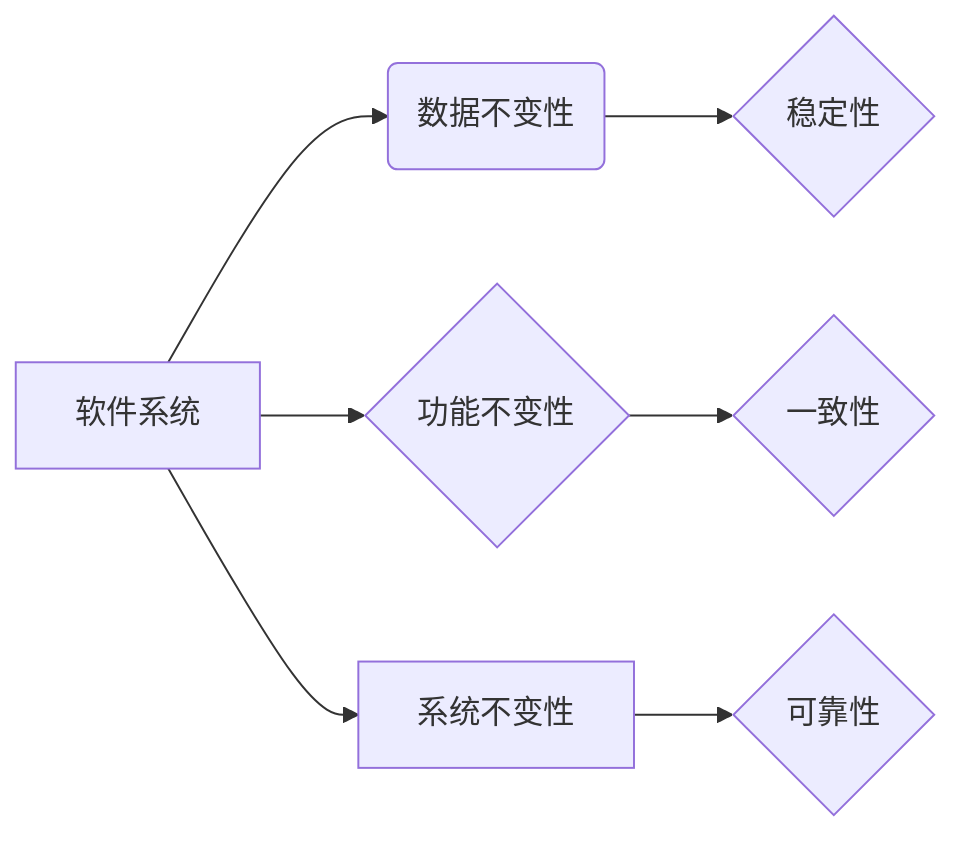

# 像数学家一样思考：不变性原理

> 关键词：不变性原理，数学思维，抽象，模型，算法，软件工程，软件架构，复杂性

## 1. 背景介绍

在数学的世界里，不变性原理是一个深奥而强大的概念。它揭示了事物在变化中的永恒规律，指导数学家们发现和理解自然界和人类社会的各种现象。在软件工程领域，不变性原理同样扮演着至关重要的角色。它帮助我们设计出更加稳定、可维护和可扩展的软件系统。本文将探讨不变性原理在软件工程中的应用，并展示如何像数学家一样思考，以构建更加优秀的软件架构。

### 1.1 问题的由来

随着软件系统的复杂性日益增加，软件工程师面临着巨大的挑战。如何设计出易于理解和维护的系统，如何在变化的需求面前保持系统的稳定性，成为了软件工程领域的重要问题。不变性原理提供了一种思考问题的视角，帮助我们从更高的维度审视软件系统，寻找隐藏在复杂性背后的简单规律。

### 1.2 研究现状

在软件工程领域，不变性原理的应用主要体现在以下几个方面：

- **设计模式**：许多经典的设计模式，如工厂模式、观察者模式等，都是基于不变性原理构建的。
- **软件架构**：软件架构的设计原则，如单一职责原则、开闭原则等，都蕴含着不变性原理的思想。
- **代码重构**：通过识别代码中的不变性，可以简化代码结构，提高代码的可读性和可维护性。

### 1.3 研究意义

研究不变性原理在软件工程中的应用，具有以下意义：

- **提升软件质量**：通过应用不变性原理，可以设计出更加稳定、可靠和可维护的软件系统。
- **降低开发成本**：不变性原理可以帮助我们快速发现和修复软件缺陷，从而降低开发成本。
- **提高开发效率**：通过识别和利用不变性，可以简化开发过程，提高开发效率。

### 1.4 本文结构

本文将按照以下结构展开：

- **第2章**：介绍不变性原理的核心概念及其在软件工程中的应用。
- **第3章**：探讨如何像数学家一样思考，运用不变性原理来构建软件系统。
- **第4章**：分析不变性原理在软件架构设计中的应用实例。
- **第5章**：通过代码实例展示如何在实际项目中应用不变性原理。
- **第6章**：讨论不变性原理在实际应用中的挑战和未来发展趋势。
- **第7章**：推荐相关的学习资源、开发工具和参考文献。
- **第8章**：总结全文，展望不变性原理在软件工程中的应用前景。

## 2. 核心概念与联系

### 2.1 不变性原理

不变性原理是数学中的一个基本概念，它指出，在某种变换或操作下，系统的某些性质保持不变。例如，在物理学中，质量、能量等物理量在经典力学中是守恒的。

### 2.2 不变性原理在软件工程中的应用

在软件工程中，不变性原理可以体现在以下几个方面：

- **数据不变性**：数据在系统运行过程中保持不变，例如，数据库中的数据一致性。
- **功能不变性**：系统在执行特定功能时，输出结果保持一致，例如，函数的等价性。
- **系统不变性**：系统在面临外部变化时，保持其整体行为的一致性。

### 2.3 Mermaid 流程图

以下是不变性原理在软件工程中应用的Mermaid流程图：



## 3. 核心算法原理 & 具体操作步骤

### 3.1 算法原理概述

像数学家一样思考，就是运用不变性原理来分析和解决问题。具体步骤如下：

1. **识别系统中的不变性**：分析系统，识别出其中的不变性，如数据不变性、功能不变性和系统不变性。
2. **利用不变性构建模型**：基于识别出的不变性，构建系统模型，简化系统复杂度。
3. **分析和优化模型**：对模型进行分析和优化，以提升系统的性能和可靠性。

### 3.2 算法步骤详解

1. **识别系统中的不变性**：通过观察和分析系统，找出系统中保持不变的性质。例如，在电商系统中，用户的购物车内容在用户未修改的情况下保持不变。
2. **利用不变性构建模型**：基于不变性，构建系统模型。例如，可以设计一个购物车模型，其中包含商品列表、总金额等属性。
3. **分析和优化模型**：对模型进行分析和优化，以提升系统的性能和可靠性。例如，可以通过缓存机制来提高购物车数据的访问速度。

### 3.3 算法优缺点

**优点**：

- **提高系统稳定性**：通过识别和利用不变性，可以降低系统复杂性，提高系统稳定性。
- **简化开发过程**：不变性原理可以帮助我们快速构建系统模型，简化开发过程。
- **提升代码可读性**：不变性原理可以使代码结构更加清晰，提升代码可读性。

**缺点**：

- **识别难度**：在复杂系统中识别不变性具有一定难度，需要丰富的经验和深入的分析。
- **模型构建复杂**：在某些情况下，基于不变性构建的模型可能比较复杂，需要一定的技术能力。

### 3.4 算法应用领域

不变性原理在以下领域具有广泛的应用：

- **软件架构设计**：通过识别系统中的不变性，可以构建更加稳定和可扩展的软件架构。
- **代码重构**：通过识别代码中的不变性，可以简化代码结构，提高代码的可读性和可维护性。
- **测试用例设计**：通过识别系统中的不变性，可以设计出更加有效的测试用例。

## 4. 数学模型和公式 & 详细讲解 & 举例说明

### 4.1 数学模型构建

在软件工程中，数学模型可以用来描述系统中的不变性。以下是一个简单的数学模型示例：

$$
\text{购物车} = (\text{商品列表}, \text{总金额}, \text{更新时间})
$$

其中，商品列表、总金额和更新时间是不变的，即在这些属性发生变化之前，购物车的状态不发生变化。

### 4.2 公式推导过程

在软件工程中，数学模型的推导过程通常包括以下步骤：

1. **定义系统变量**：确定系统中需要描述的变量。
2. **建立变量之间的关系**：根据系统特性，建立变量之间的关系。
3. **分析变量变化**：分析变量在系统运行过程中的变化规律。

### 4.3 案例分析与讲解

以下是一个基于不变性原理的代码重构案例：

**原始代码**：

```python
class Order:
    def __init__(self):
        self.items = []
        self.total = 0

    def add_item(self, item, price):
        self.items.append(item)
        self.total += price

    def remove_item(self, item):
        if item in self.items:
            self.total -= item.price
            self.items.remove(item)

    def calculate_total(self):
        self.total = sum(item.price for item in self.items)
```

**重构后的代码**：

```python
class Order:
    def __init__(self):
        self.items = []
        self.total = 0

    def add_item(self, item):
        self._update_total(item, add=True)

    def remove_item(self, item):
        self._update_total(item, add=False)

    def _update_total(self, item, add=True):
        delta = item.price if add else -item.price
        self.total += delta
```

在重构后的代码中，我们定义了一个私有方法 `_update_total`，用于更新订单的总金额。这个方法利用了总金额的不变性，简化了代码逻辑，并提高了代码的可维护性。

## 5. 项目实践：代码实例和详细解释说明

### 5.1 开发环境搭建

为了演示不变性原理在项目中的应用，我们将构建一个简单的待办事项列表(Todo List)应用。

开发环境要求：

- Python 3.x
- Flask Web框架
- SQLite数据库

### 5.2 源代码详细实现

以下是一个基于不变性原理的Todo List应用示例：

```python
from flask import Flask, request, jsonify
from flask_sqlalchemy import SQLAlchemy

app = Flask(__name__)
app.config['SQLALCHEMY_DATABASE_URI'] = 'sqlite:///todo.db'
db = SQLAlchemy(app)

class Todo(db.Model):
    id = db.Column(db.Integer, primary_key=True)
    description = db.Column(db.String(255), nullable=False)
    completed = db.Column(db.Boolean, default=False)

    def __init__(self, description):
        self.description = description

@app.route('/todo', methods=['POST'])
def add_todo():
    description = request.json['description']
    todo = Todo(description=description)
    db.session.add(todo)
    db.session.commit()
    return jsonify({'id': todo.id, 'description': todo.description})

@app.route('/todo/<int:todo_id>', methods=['PUT'])
def update_todo(todo_id):
    todo = Todo.query.get(todo_id)
    if not todo:
        return jsonify({'error': 'Todo not found'}), 404
    todo.completed = not todo.completed
    db.session.commit()
    return jsonify({'id': todo.id, 'description': todo.description, 'completed': todo.completed})

@app.route('/todo/<int:todo_id>', methods=['DELETE'])
def delete_todo(todo_id):
    todo = Todo.query.get(todo_id)
    if not todo:
        return jsonify({'error': 'Todo not found'}), 404
    db.session.delete(todo)
    db.session.commit()
    return jsonify({'id': todo_id})

if __name__ == '__main__':
    db.create_all()
    app.run(debug=True)
```

### 5.3 代码解读与分析

在这个Todo List应用中，我们使用了SQLAlchemy ORM来操作数据库。Todo模型表示待办事项，具有以下属性：

- id：唯一标识符
- description：待办事项的描述
- completed：待办事项是否完成

add_todo路由用于添加新的待办事项，update_todo路由用于更新待办事项的完成状态，delete_todo路由用于删除待办事项。

在这个应用中，我们利用了以下不变性原理：

- **数据不变性**：待办事项的描述和完成状态在创建后保持不变。
- **功能不变性**：添加、更新和删除待办事项的功能保持一致。

### 5.4 运行结果展示

运行上述代码后，可以使用浏览器或Postman等工具进行测试。以下是一个添加待办事项的示例：

```json
POST /todo
Content-Type: application/json

{
  "description": "Buy milk"
}
```

响应：

```json
{
  "id": 1,
  "description": "Buy milk"
}
```

## 6. 实际应用场景

### 6.1 软件架构设计

在软件架构设计中，不变性原理可以帮助我们识别系统中的关键组件，并构建出更加稳定和可扩展的架构。以下是一些应用不变性原理的架构设计案例：

- **分层架构**：将系统分为表示层、业务逻辑层和数据访问层，确保每一层的功能独立且不变。
- **微服务架构**：将系统拆分为多个独立的服务，每个服务负责特定的功能，保持服务之间的解耦。

### 6.2 代码重构

在代码重构过程中，不变性原理可以帮助我们识别出代码中的重复代码，并将其抽象为函数或类，从而提高代码的可读性和可维护性。

### 6.3 测试用例设计

在测试用例设计过程中，不变性原理可以帮助我们设计出更加全面和有效的测试用例，确保系统在各种情况下都能保持稳定运行。

## 7. 工具和资源推荐

### 7.1 学习资源推荐

- 《软件工程：实践者的研究方法》（作者：Peter Norton）
- 《设计模式：可复用面向对象软件的基础》（作者：Erich Gamma等）
- 《软件架构：实践者的研究方法》（作者：Mark Richards）

### 7.2 开发工具推荐

- **代码编辑器**：Visual Studio Code、Sublime Text
- **版本控制系统**：Git
- **持续集成工具**：Jenkins、Travis CI

### 7.3 相关论文推荐

- **《不变性原理在软件工程中的应用》**（作者：John N. Warfield）
- **《软件工程中的抽象》**（作者：David L. Parnas）
- **《软件架构设计原则》**（作者：Mark Richards）

## 8. 总结：未来发展趋势与挑战

### 8.1 研究成果总结

本文探讨了不变性原理在软件工程中的应用，并展示了如何像数学家一样思考，以构建更加优秀的软件系统。通过分析不变性原理的核心概念、算法原理和应用场景，我们得出以下结论：

- 不变性原理是软件工程中的一个重要概念，可以帮助我们设计出更加稳定、可靠和可维护的软件系统。
- 像数学家一样思考，可以帮助我们更好地理解和应用不变性原理。
- 不变性原理在软件架构设计、代码重构和测试用例设计等领域具有广泛的应用。

### 8.2 未来发展趋势

随着软件系统复杂性的不断增加，不变性原理在软件工程中的应用将越来越重要。以下是一些未来发展趋势：

- **不变性原理与人工智能的融合**：将不变性原理与机器学习、深度学习等技术相结合，构建更加智能的软件系统。
- **不变性原理在软件质量保证中的应用**：利用不变性原理进行软件质量保证，提高软件系统的可靠性和安全性。
- **不变性原理在软件工程教育中的应用**：将不变性原理纳入软件工程教育体系，培养更多具备数学思维和软件工程能力的专业人才。

### 8.3 面临的挑战

尽管不变性原理在软件工程中具有广泛的应用前景，但在实际应用中仍面临以下挑战：

- **识别不变性的难度**：在复杂系统中识别不变性具有一定难度，需要丰富的经验和深入的分析。
- **不变性原理的抽象能力**：不变性原理的抽象能力有限，可能无法涵盖所有软件系统的复杂性。
- **不变性原理的应用范围**：不变性原理的应用范围有限，可能无法满足所有软件工程需求。

### 8.4 研究展望

为了更好地应对挑战，未来的研究可以从以下几个方面进行：

- **开发更加智能的不变性识别工具**：利用人工智能技术，开发能够自动识别不变性的工具，提高识别效率。
- **探索不变性原理的抽象能力**：研究更加高级的抽象方法，以应对更加复杂的软件系统。
- **拓展不变性原理的应用范围**：将不变性原理应用于更多软件工程领域，提高软件工程的整体水平。

## 9. 附录：常见问题与解答

**Q1：不变性原理在软件工程中的具体应用有哪些？**

A：不变性原理在软件工程中的应用主要体现在软件架构设计、代码重构和测试用例设计等方面。

**Q2：如何识别系统中的不变性？**

A：识别系统中的不变性需要丰富的经验和深入的分析。可以采用以下方法：

- **观察和分析系统功能**：分析系统的功能，找出在功能变化时保持不变的部分。
- **分析系统数据**：分析系统数据，找出在数据变化时保持不变的部分。
- **参考相关理论和原则**：参考软件工程中的相关理论和原则，如单一职责原则、开闭原则等。

**Q3：不变性原理与设计模式有什么关系？**

A：设计模式是基于不变性原理构建的，设计模式中的许多模式都是基于不变性原理设计的，如工厂模式、观察者模式等。

**Q4：如何将不变性原理应用于代码重构？**

A：将不变性原理应用于代码重构，可以按照以下步骤进行：

1. 识别代码中的重复代码。
2. 将重复代码抽象为函数或类。
3. 使用不变性原理验证重构后的代码。

**Q5：不变性原理在软件工程中的重要性体现在哪些方面？**

A：不变性原理在软件工程中的重要性体现在以下几个方面：

- **提高软件质量**：通过应用不变性原理，可以设计出更加稳定、可靠和可维护的软件系统。
- **降低开发成本**：不变性原理可以帮助我们快速发现和修复软件缺陷，从而降低开发成本。
- **提高开发效率**：通过识别和利用不变性，可以简化开发过程，提高开发效率。

---

作者：禅与计算机程序设计艺术 / Zen and the Art of Computer Programming