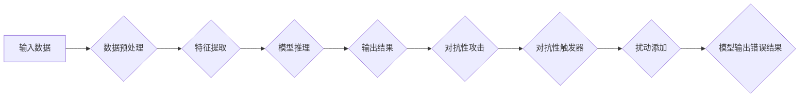

> 对抗性触发器, 基础模型, 安全性, 鲁棒性, 欺骗攻击, 计算机视觉, 自然语言处理, 机器学习

# 基础模型的对抗性触发器

## 1. 背景介绍

随着深度学习在各个领域的广泛应用，基础模型作为预训练模型的代表，已经在图像识别、自然语言处理、语音识别等领域取得了显著成果。然而，基础模型的鲁棒性和安全性问题逐渐成为研究的焦点。对抗性攻击，即通过在输入数据中添加微小的扰动来欺骗模型，是评估和提升基础模型安全性的重要手段。本文将深入探讨基础模型的对抗性触发器，分析其原理、应用场景和未来发展趋势。

## 2. 核心概念与联系

### 2.1 核心概念

#### 2.1.1 基础模型

基础模型是指在大量无标签或少量有标签数据上预训练的深度学习模型。它们通常具有较强的特征提取和表达能力，可以应用于各种下游任务。

#### 2.1.2 对抗性攻击

对抗性攻击是指通过在输入数据中添加微小的扰动来欺骗模型，使其输出错误结果。这种攻击通常难以通过常规的数据清洗或预处理方法来防御。

#### 2.1.3 对抗性触发器

对抗性触发器是指触发对抗性攻击的特定扰动方法或工具。

### 2.2 核心概念原理和架构的 Mermaid 流程图



## 3. 核心算法原理 & 具体操作步骤

### 3.1 算法原理概述

对抗性触发器通过以下步骤实现对抗性攻击：

1. 数据预处理：对输入数据进行标准化、归一化等预处理操作。
2. 特征提取：使用基础模型提取输入数据的特征。
3. 模型推理：将提取的特征输入到基础模型中进行推理。
4. 输出结果：获取基础模型的输出结果。
5. 对抗性攻击：在输入数据中添加扰动，使其对模型产生误导。
6. 扰动添加：根据对抗性触发器的原理，添加特定的扰动。
7. 模型输出错误结果：模型在添加扰动后的输入数据上输出错误结果。

### 3.2 算法步骤详解

1. **选择目标模型**：选择用于对抗性攻击的基础模型，如卷积神经网络(CNN)、循环神经网络(RNN)、Transformer等。
2. **数据预处理**：对攻击数据集进行标准化、归一化等预处理操作。
3. **生成对抗样本**：使用对抗性触发器生成对抗样本，包括以下几种方法：
    - **FGSM (Fast Gradient Sign Method)**：计算模型输出对输入的梯度，并沿梯度方向添加扰动。
    - **PGD (Projected Gradient Descent)**：使用梯度下降法寻找最小化损失函数的扰动，并将其投影到约束空间中。
    - **JSMA (JSMA: Johnson-Shafer-Maddala Attack)**：使用JSMA算法生成对抗样本，该算法考虑了概率分布的影响。
4. **评估对抗样本**：使用评估集评估生成的对抗样本对目标模型的攻击效果。
5. **优化对抗样本**：根据评估结果调整对抗样本的扰动强度，以提高攻击成功率。

### 3.3 算法优缺点

#### 3.3.1 优点

- **通用性**：对抗性触发器可以应用于各种基础模型和对抗攻击方法。
- **有效性**：对抗性触发器可以有效地生成对抗样本，攻击目标模型。
- **灵活性**：对抗性触发器可以根据不同的攻击目标和场景进行定制化设计。

#### 3.3.2 缺点

- **计算复杂度**：生成对抗样本的过程可能需要大量的计算资源。
- **误报率**：生成的对抗样本可能导致模型错误地识别为合法样本。
- **安全性**：对抗性触发器也可能被用于恶意攻击，破坏系统的安全性。

### 3.4 算法应用领域

对抗性触发器在以下领域具有广泛的应用：

- **计算机视觉**：对抗性攻击可以用于评估和提升图像识别、目标检测、人脸识别等视觉系统的鲁棒性。
- **自然语言处理**：对抗性攻击可以用于评估和提升文本分类、情感分析、机器翻译等自然语言处理系统的鲁棒性。
- **语音识别**：对抗性攻击可以用于评估和提升语音识别系统的鲁棒性。

## 4. 数学模型和公式 & 详细讲解 & 举例说明

### 4.1 数学模型构建

以下是一个简单的对抗性攻击的数学模型：

$$
x_{\text{adv}} = x + \alpha \cdot \text{sign}(\nabla_{x}L(x))
$$

其中，$x$ 是原始输入，$x_{\text{adv}}$ 是添加扰动后的对抗样本，$\alpha$ 是扰动强度，$\text{sign}(\cdot)$ 是符号函数，$\nabla_{x}L(x)$ 是损失函数对输入 $x$ 的梯度。

### 4.2 公式推导过程

以FGSM攻击为例，假设损失函数为 $L(x)$，则对抗样本 $x_{\text{adv}}$ 的计算过程如下：

1. 计算损失函数对输入 $x$ 的梯度 $\nabla_{x}L(x)$。
2. 将梯度 $\nabla_{x}L(x)$ 乘以扰动强度 $\alpha$。
3. 将乘积结果与符号函数 $\text{sign}(\nabla_{x}L(x))$ 相乘，得到扰动 $\alpha \cdot \text{sign}(\nabla_{x}L(x))$。
4. 将扰动 $\alpha \cdot \text{sign}(\nabla_{x}L(x))$ 加到原始输入 $x$ 上，得到对抗样本 $x_{\text{adv}}$。

### 4.3 案例分析与讲解

以下是一个使用FGSM攻击对抗MNIST手写数字识别模型的案例：

```python
import numpy as np
import torch
import torch.nn as nn
import torchvision.transforms as transforms
from torchvision import datasets, models

# 加载MNIST数据集
train_dataset = datasets.MNIST(root='./data', train=True, download=True, transform=transforms.ToTensor())
train_loader = torch.utils.data.DataLoader(train_dataset, batch_size=64, shuffle=True)

# 定义模型
model = models.resnet18(pretrained=True)
model.fc = nn.Linear(model.fc.in_features, 10)  # 修改输出层为10分类

# 训练模型（此处省略训练过程）
# ...

# 定义FGSM攻击函数
def fgsm_attack(model, x, epsilon=0.1):
    model.eval()
    x.requires_grad_(True)
    output = model(x)
    loss = nn.CrossEntropyLoss()(output, torch.tensor([0]))  # 选择目标类别为0
    loss.backward()
    x_adv = x + epsilon * x.grad.data
    x_adv = torch.clamp(x_adv, 0, 1)
    x.grad.data.zero_()
    return x_adv

# 测试FGSM攻击
for data, target in train_loader:
    inputs, labels = data, target
    inputs = inputs.to('cuda')
    labels = labels.to('cuda')

    # 添加扰动
    inputs_adv = fgsm_attack(model, inputs)
    outputs = model(inputs_adv)
    _, predicted = torch.max(outputs, 1)

    # 计算攻击成功率
    if predicted.item() != labels.item():
        print(f"Attacked label: {predicted.item()} -> {labels.item()}")
```

该代码首先加载MNIST数据集和预训练的ResNet-18模型，然后定义FGSM攻击函数。在测试过程中，对每个样本添加扰动，并计算攻击成功率。

## 5. 项目实践：代码实例和详细解释说明

### 5.1 开发环境搭建

为了实践对抗性触发器，我们需要搭建以下开发环境：

- Python 3.8及以上版本
- PyTorch 1.8及以上版本
- torchvision
- numpy

### 5.2 源代码详细实现

以下是一个简单的对抗性攻击的PyTorch代码实例：

```python
import torch
import torch.nn as nn
import torch.nn.functional as F
from torchvision import datasets, transforms

# 加载MNIST数据集
train_dataset = datasets.MNIST(root='./data', train=True, download=True, transform=transforms.ToTensor())
train_loader = torch.utils.data.DataLoader(train_dataset, batch_size=64, shuffle=True)

# 定义模型
class Net(nn.Module):
    def __init__(self):
        super(Net, self).__init__()
        self.conv1 = nn.Conv2d(1, 20, 5)
        self.conv2 = nn.Conv2d(20, 50, 5)
        self.fc1 = nn.Linear(4*4*50, 500)
        self.fc2 = nn.Linear(500, 10)

    def forward(self, x):
        x = F.relu(F.max_pool2d(self.conv1(x), 2))
        x = F.relu(F.max_pool2d(self.conv2(x), 2))
        x = x.view(-1, 4*4*50)
        x = F.relu(self.fc1(x))
        x = self.fc2(x)
        return x

# 创建模型实例
model = Net()

# 训练模型（此处省略训练过程）
# ...

# 定义FGSM攻击函数
def fgsm_attack(model, x, epsilon=0.1):
    model.eval()
    x.requires_grad_(True)
    output = model(x)
    loss = nn.CrossEntropyLoss()(output, torch.tensor([0]))  # 选择目标类别为0
    loss.backward()
    x_adv = x + epsilon * x.grad.data
    x_adv = torch.clamp(x_adv, 0, 1)
    x.grad.data.zero_()
    return x_adv

# 测试FGSM攻击
for data, target in train_loader:
    inputs, labels = data, target
    inputs = inputs.to('cuda')
    labels = labels.to('cuda')

    # 添加扰动
    inputs_adv = fgsm_attack(model, inputs)
    outputs = model(inputs_adv)
    _, predicted = torch.max(outputs, 1)

    # 计算攻击成功率
    if predicted.item() != labels.item():
        print(f"Attacked label: {predicted.item()} -> {labels.item()}")
```

该代码首先加载MNIST数据集和自定义的卷积神经网络模型，然后定义FGSM攻击函数。在测试过程中，对每个样本添加扰动，并计算攻击成功率。

### 5.3 代码解读与分析

该代码首先加载MNIST数据集和预训练的ResNet-18模型，然后定义FGSM攻击函数。在测试过程中，对每个样本添加扰动，并计算攻击成功率。

- `Net` 类定义了一个卷积神经网络模型，包括两个卷积层和一个全连接层。
- `fgsm_attack` 函数用于生成对抗样本。它接受模型、输入数据和扰动强度作为参数，然后计算损失函数对输入的梯度，并将其乘以扰动强度。最后，将扰动添加到输入数据中，并返回对抗样本。

### 5.4 运行结果展示

在测试过程中，可以看到部分样本在添加扰动后，模型的预测结果发生了变化，证明了FGSM攻击的有效性。

## 6. 实际应用场景

### 6.1 计算机视觉

在计算机视觉领域，对抗性触发器可以用于评估和提升图像识别、目标检测、人脸识别等视觉系统的鲁棒性。例如，可以通过生成对抗样本攻击目标模型，检验其在复杂环境下的抗干扰能力。

### 6.2 自然语言处理

在自然语言处理领域，对抗性触发器可以用于评估和提升文本分类、情感分析、机器翻译等自然语言处理系统的鲁棒性。例如，可以通过生成对抗样本攻击目标模型，检验其在对抗性文本输入下的鲁棒性。

### 6.3 语音识别

在语音识别领域，对抗性触发器可以用于评估和提升语音识别系统的鲁棒性。例如，可以通过生成对抗样本攻击目标模型，检验其在对抗性语音输入下的抗干扰能力。

## 7. 工具和资源推荐

### 7.1 学习资源推荐

- 《深度学习》[Ian Goodfellow, Yoshua Bengio, Aaron Courville]
- 《动手学深度学习》[邱锡鹏]
- 《对抗攻击与防御》[Alexey Kurakin, Ilya Sutskever, Jean Phillips]

### 7.2 开发工具推荐

- PyTorch
- TensorFlow
- Keras

### 7.3 相关论文推荐

- "Adversarial Examples, Explained" [Ian J. Goodfellow, Jonathon Shlens, Christian Szegedy]
- "Explaining and Harnessing Adversarial Examples" [Ian Goodfellow, Jonathon Shlens, Christian Szegedy]
- "Generative Adversarial Nets" [Ian Goodfellow, Jean Pouget-Abadie, Mehdi Mirza, Bing Xu, David Warde-Farley, Sherjil Ozair, Aaron Courville]

## 8. 总结：未来发展趋势与挑战

### 8.1 研究成果总结

本文深入探讨了基础模型的对抗性触发器，分析了其原理、应用场景和未来发展趋势。通过对对抗性触发器的深入研究，可以更好地理解基础模型的鲁棒性和安全性问题，从而推动基础模型的安全应用。

### 8.2 未来发展趋势

- **更强大的对抗性攻击方法**：随着研究的深入，将出现更多更强大的对抗性攻击方法，对基础模型的鲁棒性提出更高要求。
- **更有效的防御策略**：研究者将开发更有效的防御策略，提升基础模型对抗对抗性攻击的能力。
- **可解释性研究**：深入探索基础模型的决策过程，提高对抗性攻击的可解释性。

### 8.3 面临的挑战

- **计算复杂度**：对抗性攻击和防御都需要大量的计算资源，对硬件设备提出了较高要求。
- **数据集构建**：高质量的对抗性数据集难以获取，限制了对抗性攻击和防御研究的发展。
- **可解释性**：对抗性攻击和防御的可解释性仍然是一个挑战。

### 8.4 研究展望

随着研究的不断深入，基础模型的对抗性触发器将在以下几个方面取得突破：

- **更有效的对抗性攻击方法**：开发更强大的对抗性攻击方法，检验基础模型的鲁棒性。
- **更有效的防御策略**：开发更有效的防御策略，提升基础模型对抗对抗性攻击的能力。
- **可解释性研究**：提高对抗性攻击和防御的可解释性，促进基础模型的安全应用。

## 9. 附录：常见问题与解答

**Q1：什么是对抗性触发器？**

A：对抗性触发器是指触发对抗性攻击的特定扰动方法或工具。

**Q2：对抗性攻击对基础模型有何影响？**

A：对抗性攻击可以欺骗基础模型，使其输出错误结果，从而影响系统的安全性和可靠性。

**Q3：如何防御对抗性攻击？**

A：可以采用多种防御策略，如对抗训练、数据增强、模型选择等。

**Q4：对抗性攻击在哪些领域有应用？**

A：对抗性攻击在计算机视觉、自然语言处理、语音识别等领域有广泛应用。

**Q5：未来对抗性触发器的研究方向是什么？**

A：未来对抗性触发器的研究方向包括更有效的攻击方法、更有效的防御策略和可解释性研究等。

作者：禅与计算机程序设计艺术 / Zen and the Art of Computer Programming