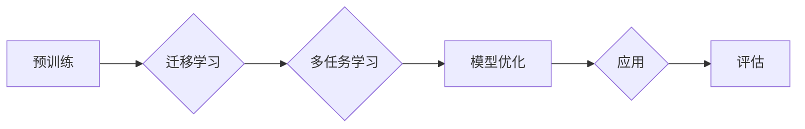

> 基础模型，技术创新，社会效益，人工智能，深度学习，预训练，迁移学习，应用场景

# 基础模型的技术创新与社会效益

基础模型作为人工智能领域的关键技术，已经从幕后走向台前，成为推动行业变革的重要力量。本文将从基础模型的技术创新出发，探讨其对社会的深远影响，并展望其未来发展趋势与挑战。

## 1. 背景介绍

### 1.1 问题的由来

随着深度学习的兴起，人工智能开始从“辅助智能”走向“通用智能”，其中基础模型扮演着核心角色。基础模型通过对海量数据进行预训练，学习到丰富的特征和知识，为下游任务提供强大的基础。

然而，在基础模型的早期发展阶段，其构建和优化面临着诸多挑战，如数据获取困难、计算资源受限、模型性能不稳定等。随着技术的不断进步，这些挑战逐渐得到克服，基础模型开始进入快速发展阶段。

### 1.2 研究现状

目前，基础模型主要分为以下几类：

- **自回归模型**：如GPT系列，通过预测下一个词来生成文本。
- **自编码模型**：如BERT、RoBERTa等，通过自监督学习来学习文本的内在表示。
- **Transformer模型**：如T5，通过编码器-解码器结构进行序列到序列的转换。

这些基础模型在自然语言处理、计算机视觉、语音识别等领域取得了显著的成果，为人工智能的发展提供了强大的动力。

### 1.3 研究意义

基础模型的研究具有重要的理论意义和应用价值：

- **理论意义**：基础模型为人工智能领域提供了新的研究范式，推动了深度学习理论的不断演进。
- **应用价值**：基础模型为各行各业提供了强大的技术支持，促进了人工智能技术的广泛应用。

### 1.4 本文结构

本文将围绕以下内容展开：

- 介绍基础模型的技术创新。
- 探讨基础模型的社会效益。
- 展望基础模型的未来发展趋势与挑战。

## 2. 核心概念与联系

### 2.1 核心概念

- **预训练**：在大量未标注数据上对模型进行训练，使模型学习到丰富的特征和知识。
- **迁移学习**：将预训练模型的知识迁移到新的任务上，降低模型训练成本。
- **多任务学习**：同时训练多个相关任务，提高模型的学习效率和泛化能力。

### 2.2 Mermaid 流程图



### 2.3 核心概念联系

预训练是基础模型的核心，通过预训练，模型可以学习到丰富的特征和知识。迁移学习和多任务学习则可以进一步提高模型的性能和泛化能力。模型优化和评估是基础模型研究的两个重要环节，通过不断优化和评估，可以进一步提高模型的性能和实用性。

## 3. 核心算法原理 & 具体操作步骤

### 3.1 算法原理概述

基础模型的算法原理主要包括以下几方面：

- **深度学习**：通过多层神经网络学习数据特征和模式。
- **优化算法**：如Adam、SGD等，用于优化模型参数。
- **损失函数**：如交叉熵、均方误差等，用于衡量模型预测结果与真实值之间的差异。

### 3.2 算法步骤详解

基础模型的算法步骤如下：

1. **数据收集**：收集大量未标注数据，用于预训练。
2. **预训练**：在未标注数据上对模型进行预训练，学习到丰富的特征和知识。
3. **迁移学习**：将预训练模型的知识迁移到新的任务上。
4. **多任务学习**：同时训练多个相关任务，提高模型的学习效率和泛化能力。
5. **模型优化**：使用优化算法优化模型参数。
6. **评估**：在测试集上评估模型的性能。

### 3.3 算法优缺点

**优点**：

- **性能优异**：基础模型在多个任务上取得了SOTA性能。
- **泛化能力强**：基础模型可以迁移到新的任务上，降低模型训练成本。
- **效率高**：预训练过程可以快速生成大量高质量特征。

**缺点**：

- **数据依赖性**：基础模型的性能很大程度上依赖于预训练数据的质量和数量。
- **计算资源消耗大**：预训练过程需要大量的计算资源。
- **模型复杂度高**：基础模型往往具有复杂的结构，难以理解和解释。

### 3.4 算法应用领域

基础模型在以下领域取得了显著的应用成果：

- **自然语言处理**：如文本分类、情感分析、机器翻译等。
- **计算机视觉**：如图像分类、目标检测、图像分割等。
- **语音识别**：如语音合成、语音识别、语音情感分析等。
- **推荐系统**：如商品推荐、电影推荐等。

## 4. 数学模型和公式 & 详细讲解 & 举例说明

### 4.1 数学模型构建

基础模型的数学模型主要基于深度学习理论，包括以下几方面：

- **神经网络**：通过多层神经元组成的网络学习数据特征和模式。
- **激活函数**：如ReLU、Sigmoid等，用于引入非线性关系。
- **优化算法**：如Adam、SGD等，用于优化模型参数。

### 4.2 公式推导过程

以下以神经网络为例，介绍其数学模型构建过程。

假设有一个包含 $L$ 层的神经网络，其第 $l$ 层的输入和输出关系如下：

$$
h^{(l)}_j = \sigma(W^{(l)}h^{(l-1)}_j + b^{(l)}) \quad (j=1,2,...,n_l)
$$

其中，$h^{(l)}_j$ 表示第 $l$ 层第 $j$ 个神经元的输出，$W^{(l)}$ 表示第 $l$ 层的权重矩阵，$b^{(l)}$ 表示第 $l$ 层的偏置向量，$\sigma$ 表示激活函数。

### 4.3 案例分析与讲解

以下以BERT模型为例，介绍其数学模型构建过程。

BERT模型采用Transformer结构，其第 $l$ 层的输入和输出关系如下：

$$
h^{(l)}_{(i,j)} = \mathrm{Attention}(h^{(l-1)}_{(i,j)}, h^{(l-1)}_{(i,\cdot)}, h^{(l-1)}_{(\cdot,j)}) \cdot \mathrm{FFN}(h^{(l-1)}_{(i,j)}) + h^{(l-1)}_{(i,j)}
$$

其中，$\mathrm{Attention}$ 表示注意力机制，$\mathrm{FFN}$ 表示前馈神经网络。

## 5. 项目实践：代码实例和详细解释说明

### 5.1 开发环境搭建

为了演示基础模型的应用，以下以Python为例，介绍开发环境的搭建。

1. 安装Anaconda：从官网下载并安装Anaconda，用于创建独立的Python环境。
2. 创建并激活虚拟环境：
   ```bash
   conda create -n base-model-env python=3.8
   conda activate base-model-env
   ```
3. 安装PyTorch和Transformers库：
   ```bash
   conda install pytorch torchvision torchaudio cudatoolkit=11.3 -c pytorch -c conda-forge
   pip install transformers
   ```

### 5.2 源代码详细实现

以下以BERT模型为例，介绍其源代码的详细实现。

```python
from transformers import BertModel, BertTokenizer

# 加载预训练模型和分词器
model = BertModel.from_pretrained('bert-base-uncased')
tokenizer = BertTokenizer.from_pretrained('bert-base-uncased')

# 定义文本输入
text = "Hello, world!"

# 将文本编码为模型输入
encoding = tokenizer(text, return_tensors='pt')

# 模型预测
outputs = model(**encoding)

# 获取模型输出
last_hidden_state = outputs.last_hidden_state
```

### 5.3 代码解读与分析

上述代码演示了如何加载BERT模型和分词器，以及如何将文本输入编码为模型输入。通过调用模型进行预测，我们可以得到模型的输出结果，包括最后一层的隐藏状态。

### 5.4 运行结果展示

运行上述代码，我们可以在控制台看到模型的输出结果，包括最后一层的隐藏状态。

## 6. 实际应用场景

### 6.1 自然语言处理

基础模型在自然语言处理领域取得了显著的成果，以下列举几个应用场景：

- **文本分类**：对文本进行情感分析、主题分类、意图识别等。
- **机器翻译**：将一种语言的文本翻译成另一种语言。
- **文本摘要**：将长文本压缩成简短摘要。
- **问答系统**：根据用户提出的问题给出答案。

### 6.2 计算机视觉

基础模型在计算机视觉领域也取得了显著的成果，以下列举几个应用场景：

- **图像分类**：对图像进行分类，如动物识别、物体检测等。
- **图像分割**：将图像分割成多个区域。
- **人脸识别**：识别图像中的人脸。

### 6.3 语音识别

基础模型在语音识别领域也取得了显著的成果，以下列举几个应用场景：

- **语音合成**：将文本合成语音。
- **语音识别**：将语音信号识别成文本。
- **语音情感分析**：分析语音的情感。

### 6.4 未来应用展望

随着基础模型的不断发展和完善，其在未来将会在更多领域得到应用，以下列举几个潜在的应用场景：

- **智能助手**：为用户提供个性化服务。
- **智能交通**：优化交通流量，提高道路通行效率。
- **智能医疗**：辅助医生进行诊断和治疗。
- **智能制造**：提高生产效率和产品质量。

## 7. 工具和资源推荐

### 7.1 学习资源推荐

- **书籍**：
  - 《深度学习》（Goodfellow等著）
  - 《动手学深度学习》（花书）
- **在线课程**：
  - fast.ai
  -Coursera
  - Udacity
- **技术社区**：
  - GitHub
  - Stack Overflow
  - Reddit

### 7.2 开发工具推荐

- **深度学习框架**：
  - PyTorch
  - TensorFlow
  - Keras
- **模型训练工具**：
  - Hugging Face Transformers
  - MLflow
- **模型部署工具**：
  - TensorFlow Serving
  - ONNX Runtime

### 7.3 相关论文推荐

- **自然语言处理**：
  - "Attention is All You Need"
  - "BERT: Pre-training of Deep Bidirectional Transformers for Language Understanding"
  - "Generative Language Models"
- **计算机视觉**：
  - "ImageNet Classification with Deep Convolutional Neural Networks"
  - "Region-based Convolutional Neural Networks"
  - "DeepLab: Semantic Image Segmentation with Deep Convolutional Nets, Atrous Convolution, and Fully Connected CRFs"

## 8. 总结：未来发展趋势与挑战

### 8.1 研究成果总结

本文从基础模型的技术创新出发，探讨了其对社会的深远影响，并展望了其未来发展趋势与挑战。基础模型作为一种强大的技术，已经在多个领域取得了显著的成果，为人工智能的发展提供了强大的动力。

### 8.2 未来发展趋势

未来，基础模型将呈现出以下发展趋势：

- **模型规模将进一步扩大**：随着计算资源的不断丰富，基础模型的规模将会越来越大，能够处理更加复杂的数据和任务。
- **模型结构将更加多样化**：为了适应不同的应用场景，基础模型的模型结构将会更加多样化，如多模态模型、时空模型等。
- **模型训练将更加高效**：随着算法和硬件的不断发展，基础模型的训练将会更加高效，降低训练成本。
- **模型应用将更加广泛**：基础模型的应用将会更加广泛，覆盖更多领域和场景。

### 8.3 面临的挑战

基础模型在发展过程中也面临着一些挑战：

- **数据隐私和安全**：基础模型需要处理大量的数据，如何保护用户隐私和数据安全成为一大挑战。
- **模型可解释性**：基础模型的决策过程难以解释，如何提高模型的可解释性成为一大挑战。
- **模型偏见和歧视**：基础模型可能会学习到数据中的偏见和歧视，如何消除模型的偏见和歧视成为一大挑战。

### 8.4 研究展望

为了应对上述挑战，未来需要在以下方面进行深入研究：

- **联邦学习**：联邦学习可以保护用户隐私，同时实现模型的训练。
- **可解释人工智能**：可解释人工智能可以解释模型的决策过程，提高模型的透明度和可信度。
- **公平和公正的人工智能**：公平和公正的人工智能可以消除模型偏见和歧视，提高模型的公平性和公正性。

## 9. 附录：常见问题与解答

**Q1：什么是基础模型？**

A：基础模型是指通过对海量数据进行预训练，学习到丰富的特征和知识，为下游任务提供强大的基础的人工智能模型。

**Q2：基础模型有哪些类型？**

A：基础模型主要分为自回归模型、自编码模型和Transformer模型等。

**Q3：基础模型有哪些应用场景？**

A：基础模型在自然语言处理、计算机视觉、语音识别等领域取得了显著的成果，应用场景广泛。

**Q4：基础模型有哪些挑战？**

A：基础模型在数据隐私和安全、模型可解释性、模型偏见和歧视等方面面临着一些挑战。

**Q5：未来基础模型将如何发展？**

A：未来，基础模型将呈现出模型规模扩大、结构多样化、训练高效、应用广泛等发展趋势，同时需要应对数据隐私和安全、模型可解释性、模型偏见和歧视等挑战。

作者：禅与计算机程序设计艺术 / Zen and the Art of Computer Programming