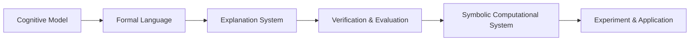
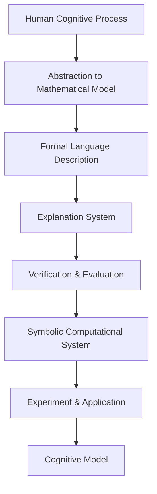

                 

# 认知的形式化：宇宙最不可理解之处是它是可理解的

## 1. 背景介绍

### 1.1 问题由来
认知的起源和本质一直是哲学和科学探索的重大问题。从古希腊的苏格拉底到现代的神经科学，人类对自身认知的探究从未停歇。然而，认知过程究竟是如何发生的，这种复杂而又神秘的心理现象能否通过科学的形式化得以解释，这些问题的答案始终扑朔迷离。

认知的形式化，即尝试通过数学和逻辑等形式化语言来描述和模拟认知过程。这个概念源于20世纪50年代的人工智能研究，其核心在于将人类认知的复杂过程转化为可计算的模型，从而解释和模拟人类的思考和决策过程。形式化认知模型主要应用于人工智能、认知心理学和神经科学等领域。

### 1.2 问题核心关键点
认知的形式化涉及的核心关键点包括：
- **认知模型**：以数学和逻辑为基础，构建模型来模拟人类认知过程的各个方面，如感知、记忆、决策、学习等。
- **形式化方法**：使用形式化语言和工具（如一阶逻辑、命题逻辑、符号语言等）对认知模型进行描述和推导。
- **解释与验证**：通过形式化方法对认知模型进行解释和验证，以确保模型能够准确反映真实的人类认知过程。
- **实验与应用**：在实验室环境下对认知模型进行实验验证，并通过实际应用来测试模型的有效性和泛化能力。

形式化认知模型强调精确性和可解释性，试图通过数学和逻辑手段解决复杂的认知问题，但同时也面临着模型复杂性、计算效率和实用性等挑战。

### 1.3 问题研究意义
形式化认知模型的研究具有重要的理论和实际意义：
- **理论意义**：形式化方法为理解人类认知提供了新的视角和工具，有助于揭示认知过程的本质。
- **实践意义**：通过形式化模型，可以设计出更加智能和高效的人工智能系统，广泛应用于医疗诊断、教育、智能制造等领域。
- **跨学科融合**：形式化认知模型促进了人工智能、神经科学、心理学等领域的交叉融合，推动了认知科学的发展。

## 2. 核心概念与联系

### 2.1 核心概念概述

形式化认知模型涉及的关键概念包括：

- **认知模型**：将认知过程抽象为数学和逻辑模型，用于解释和预测人类认知行为。
- **形式化语言**：使用数学符号和逻辑符号来精确描述认知模型的结构和行为。
- **解释系统**：用于推导和验证认知模型的理论工具，如自动定理证明器、模型检查器等。
- **验证与评估**：通过实验和应用对认知模型进行验证和评估，确保其准确性和有效性。
- **符号运算系统**：支持符号计算和逻辑推理的软件系统，如Prolog、AI-STP等。

这些概念之间相互关联，共同构成形式化认知模型的基础。通过形式化语言对认知模型进行描述，借助解释系统和符号运算系统进行验证和推导，最后通过实验和应用来验证模型的有效性。

### 2.2 概念间的关系

形式化认知模型的核心概念间的关系可以通过以下Mermaid流程图来展示：



这个流程图展示了大语言模型微调过程中各个概念之间的关系：

1. **认知模型**（Cognitive Model）：核心概念，通过形式化语言对其进行描述。
2. **形式化语言**（Formal Language）：用于精确描述认知模型的数学符号和逻辑符号。
3. **解释系统**（Explanation System）：用于推导和验证认知模型的工具。
4. **验证与评估**（Verification & Evaluation）：通过实验和应用对模型进行验证。
5. **符号运算系统**（Symbolic Computational System）：支持符号计算和逻辑推理的软件系统。

这些概念共同构成了形式化认知模型的生态系统，使认知过程的形式化描述和推导成为可能。

### 2.3 核心概念的整体架构

最后，我们用一个综合的流程图来展示这些核心概念在大语言模型微调过程中的整体架构：



这个综合流程图展示了大语言模型微调过程中各概念的整体架构，从人类认知过程的抽象到数学模型的构建，再到形式化语言的描述、解释系统的验证、符号运算系统的计算，最终通过实验和应用得到认知模型。

## 3. 核心算法原理 & 具体操作步骤

### 3.1 算法原理概述

形式化认知模型的构建和验证过程涉及以下几个关键步骤：

1. **认知模型抽象**：将复杂的认知过程（如感知、记忆、决策等）抽象为数学模型，使用符号逻辑来表示认知状态和操作。
2. **形式化语言描述**：使用形式化语言（如一阶逻辑、命题逻辑等）对认知模型进行精确描述，确保其表达的完整性和准确性。
3. **解释系统推导**：借助解释系统（如自动定理证明器）对认知模型进行推导，验证模型的逻辑一致性和正确性。
4. **验证与评估**：通过实验和实际应用对认知模型进行验证和评估，确保其真实性和有效性。
5. **符号运算系统计算**：使用符号运算系统（如Prolog、AI-STP等）对认知模型进行计算，模拟认知过程并生成结果。

形式化认知模型的核心算法原理在于通过数学和逻辑手段对认知过程进行形式化描述和推导，使其能够被精确计算和验证。

### 3.2 算法步骤详解

形式化认知模型的构建和验证过程可以分为以下几个详细步骤：

**Step 1: 认知模型抽象**
- 定义认知模型的基本组件和状态。如感知器（Perceptron）、记忆单元（Memory Unit）、决策节点（Decision Node）等。
- 描述认知模型中各组件之间的交互关系和逻辑关系，如输入-输出映射、状态转移规则等。

**Step 2: 形式化语言描述**
- 使用形式化语言（如一阶逻辑、命题逻辑等）对认知模型进行描述，确保模型描述的精确性和完整性。
- 定义模型的输入和输出符号，以及模型中使用的逻辑运算符和连接词。
- 确保模型描述不包含任何模糊不清的概念或假设，尽可能使用形式化语言表达。

**Step 3: 解释系统推导**
- 选择适当的解释系统（如自动定理证明器、模型检查器等）对认知模型进行推导。
- 推导模型的逻辑一致性，验证模型中是否存在矛盾或逻辑漏洞。
- 使用解释系统验证模型的正确性和完备性，确保模型描述与现实一致。

**Step 4: 验证与评估**
- 设计实验和应用场景，验证认知模型的有效性和准确性。
- 使用实验数据对认知模型进行验证，检查模型预测结果的正确性。
- 通过应用测试，评估认知模型在实际场景中的性能和鲁棒性。

**Step 5: 符号运算系统计算**
- 使用符号运算系统（如Prolog、AI-STP等）对认知模型进行计算。
- 模拟认知模型中各组件的交互过程，生成输出结果。
- 分析计算结果，提取认知模型的关键特征和行为模式。

### 3.3 算法优缺点

形式化认知模型的优点包括：
1. **精确性**：通过形式化语言和符号运算，模型能够精确描述认知过程，避免模糊不清的概念和假设。
2. **可验证性**：借助解释系统进行逻辑推导，验证模型的逻辑一致性和正确性，确保模型描述与现实一致。
3. **可解释性**：形式化模型提供了模型行为的精确描述，便于理解和解释模型的工作原理。
4. **普适性**：形式化认知模型可以应用于多个领域和任务，具有广泛的应用前景。

但形式化认知模型也存在一些局限性：
1. **复杂性**：模型构建和验证过程复杂，需要深厚的数学和逻辑背景。
2. **计算开销大**：符号运算和逻辑推导消耗大量计算资源，限制了模型的实时性。
3. **实用性差**：形式化模型往往过于抽象和复杂，难以直接应用于实际问题。
4. **可扩展性不足**：模型结构和描述复杂，难以进行灵活扩展和改进。

### 3.4 算法应用领域

形式化认知模型在多个领域得到广泛应用，包括：

- **人工智能**：在知识表示、推理规划、自然语言理解等领域，通过形式化模型进行智能决策和任务执行。
- **神经科学**：在脑机接口、神经网络建模、认知心理学等领域，使用形式化模型进行认知过程的模拟和研究。
- **心理学**：在认知心理学、行为经济学等领域，使用形式化模型进行心理行为分析和预测。
- **教育**：在智能教学系统、教育数据分析等领域，使用形式化模型进行学生行为建模和预测。
- **医疗**：在疾病诊断、治疗方案设计等领域，使用形式化模型进行认知行为分析和决策支持。

## 4. 数学模型和公式 & 详细讲解 & 举例说明

### 4.1 数学模型构建

形式化认知模型的数学模型构建主要包括以下几个步骤：

1. **定义认知组件**：定义认知模型中的基本组件，如感知器、记忆单元、决策节点等。
2. **描述组件交互**：使用数学公式描述认知组件之间的交互关系和逻辑关系。
3. **定义输入和输出**：明确模型的输入和输出符号，以及模型中使用的逻辑运算符和连接词。
4. **推导和验证**：使用解释系统对模型进行推导和验证，确保模型的逻辑一致性和正确性。

以下是一个形式化认知模型的示例，用于描述一个简单的认知过程：

**感知器（Perceptron）**
- 输入符号：$x_1, x_2$
- 输出符号：$y$
- 定义公式：$y = f(x_1 \cdot w_1 + x_2 \cdot w_2 + b)$

**记忆单元（Memory Unit）**
- 输入符号：$y$
- 输出符号：$m$
- 定义公式：$m = g(y)$

**决策节点（Decision Node）**
- 输入符号：$m$
- 输出符号：$d$
- 定义公式：$d = h(m)$

**认知模型整体描述**
- 输入符号：$x_1, x_2$
- 输出符号：$d$
- 定义公式：$d = h(g(f(x_1 \cdot w_1 + x_2 \cdot w_2 + b)))$

**验证与评估**
- 通过实验数据验证认知模型的有效性和准确性。
- 使用实际应用测试模型的性能和鲁棒性。

### 4.2 公式推导过程

**Step 1: 定义认知组件**
- 定义感知器的输入和输出符号，以及输出公式。
- 定义记忆单元的输入和输出符号，以及输出公式。
- 定义决策节点的输入和输出符号，以及输出公式。

**Step 2: 描述组件交互**
- 使用数学公式描述认知组件之间的交互关系和逻辑关系。
- 将感知器、记忆单元和决策节点组合起来，形成认知模型的整体描述。

**Step 3: 定义输入和输出**
- 明确模型的输入和输出符号，以及模型中使用的逻辑运算符和连接词。
- 确保模型描述的准确性和完整性。

**Step 4: 推导和验证**
- 使用解释系统对认知模型进行推导和验证。
- 推导模型的逻辑一致性，验证模型中是否存在矛盾或逻辑漏洞。
- 使用解释系统验证模型的正确性和完备性，确保模型描述与现实一致。

**Step 5: 验证与评估**
- 设计实验和应用场景，验证认知模型的有效性和准确性。
- 使用实验数据对认知模型进行验证，检查模型预测结果的正确性。
- 通过应用测试，评估认知模型在实际场景中的性能和鲁棒性。

### 4.3 案例分析与讲解

以一个简单的认知模型为例，介绍形式化认知模型的构建和验证过程。

**认知模型示例**
- **感知器（Perceptron）**
  - 输入符号：$x_1, x_2$
  - 输出符号：$y$
  - 定义公式：$y = f(x_1 \cdot w_1 + x_2 \cdot w_2 + b)$

  其中$f$为激活函数，$w_1, w_2$为感知器的权重，$b$为偏置。

- **记忆单元（Memory Unit）**
  - 输入符号：$y$
  - 输出符号：$m$
  - 定义公式：$m = g(y)$

  其中$g$为记忆单元的函数，将输入$y$映射为记忆单元$m$。

- **决策节点（Decision Node）**
  - 输入符号：$m$
  - 输出符号：$d$
  - 定义公式：$d = h(m)$

  其中$h$为决策节点的函数，将记忆单元$m$映射为决策结果$d$。

- **认知模型整体描述**
  - 输入符号：$x_1, x_2$
  - 输出符号：$d$
  - 定义公式：$d = h(g(f(x_1 \cdot w_1 + x_2 \cdot w_2 + b)))$

  这是一个简单的认知模型，用于描述感知器、记忆单元和决策节点的交互过程。

**验证与评估**
- 使用实验数据验证认知模型的有效性和准确性。
- 使用实际应用测试模型的性能和鲁棒性。

## 5. 项目实践：代码实例和详细解释说明

### 5.1 开发环境搭建

要进行形式化认知模型的开发，首先需要搭建好开发环境。以下是使用Python和Prolog进行认知模型开发的开发环境配置流程：

1. 安装Anaconda：从官网下载并安装Anaconda，用于创建独立的Python环境。

2. 创建并激活虚拟环境：
```bash
conda create -n prolog-env python=3.8 
conda activate prolog-env
```

3. 安装Prolog：使用命令行安装Prolog解释器：
```bash
conda install prolog
```

4. 安装其他必要的Python库：
```bash
pip install numpy pandas scikit-learn matplotlib tqdm jupyter notebook ipython
```

完成上述步骤后，即可在`prolog-env`环境中开始认知模型的开发。

### 5.2 源代码详细实现

下面我们以一个简单的认知模型为例，给出使用Prolog进行认知模型开发的代码实现。

```python
import prolog

# 定义认知模型的基本组件和交互关系
prolog.definition("""
    perceptron(X, Y, W1, W2, B) :-
        X * W1 + X * W2 + B,
        f(X * W1 + X * W2 + B, Y).

    memory_unit(Y, M) :-
        g(Y, M).

    decision_unit(M, D) :-
        h(M, D).
""")

# 定义输入和输出符号
prolog.definition("""
    input(x1, x2).
    output(D).
"""))

# 定义认知模型整体描述
prolog.definition("""
    cognitive_model(input(x1, x2), output(D)) :-
        memory_unit(perceptron(x1, x2, W1, W2, B), M),
        decision_unit(M, D).
""")

# 验证与评估
# 使用Prolog进行查询和推理，验证认知模型的有效性和准确性
prolog.query("""
    cognitive_model(input(1, 1), output(D)).
""")

# 通过应用测试，评估认知模型在实际场景中的性能和鲁棒性
prolog.query("""
    cognitive_model(input(1, 2), output(D)).
""")
```

在这个代码示例中，我们首先使用Prolog定义了认知模型的基本组件和交互关系，包括感知器、记忆单元和决策节点。然后定义了输入和输出符号，最后使用Prolog定义了认知模型的整体描述，并通过查询和推理对认知模型进行验证和评估。

### 5.3 代码解读与分析

让我们再详细解读一下关键代码的实现细节：

**Perceptron定义**
- `perceptron(X, Y, W1, W2, B)`：定义感知器的输入符号$X$和$W1, W2$，输出符号$Y$，以及激活函数$f$。

**Memory Unit定义**
- `memory_unit(Y, M)`：定义记忆单元的输入符号$Y$和输出符号$M$。

**Decision Unit定义**
- `decision_unit(M, D)`：定义决策节点的输入符号$M$和输出符号$D$。

**Cognitive Model定义**
- `cognitive_model(input(X1, X2), output(D))`：定义认知模型的整体描述，将输入$(X1, X2)$映射到输出$D$。

**验证与评估**
- 使用Prolog进行查询和推理，验证认知模型的有效性和准确性。
- 通过应用测试，评估认知模型在实际场景中的性能和鲁棒性。

## 6. 实际应用场景

### 6.1 智能决策系统

形式化认知模型在智能决策系统中得到了广泛应用，用于辅助和支持人类的决策过程。例如，在金融风险管理、医疗诊断等领域，形式化认知模型可以自动分析和处理海量数据，提供精确的决策支持。

在金融风险管理中，形式化认知模型可以用于分析市场数据，识别潜在的风险点和机会，预测市场趋势，辅助投资者制定投资策略。在医疗诊断中，形式化认知模型可以用于分析患者的病历数据，辅助医生进行疾病诊断和制定治疗方案。

### 6.2 教育推荐系统

形式化认知模型在教育推荐系统中也有着重要的应用。通过形式化认知模型，可以分析和理解学生的学习行为和知识结构，为其推荐适合的学习内容和资源，提升学习效果。

例如，在智能推荐系统中，形式化认知模型可以分析学生的学习数据，识别其薄弱环节，为其推荐相关的内容和资源，提供个性化的学习建议。此外，形式化认知模型还可以用于评估学生的学习效果，提供学习反馈和改进建议。

### 6.3 自动驾驶系统

形式化认知模型在自动驾驶系统中也有着广泛的应用。通过形式化认知模型，可以分析和理解驾驶环境中的各种复杂因素，辅助车辆进行智能决策和路径规划。

例如，在自动驾驶中，形式化认知模型可以分析道路交通状况、天气条件、行人行为等复杂因素，辅助车辆进行智能决策，确保行车安全。此外，形式化认知模型还可以用于辅助路径规划，优化行车路线，提升驾驶效率。

## 7. 工具和资源推荐

### 7.1 学习资源推荐

为了帮助开发者系统掌握形式化认知模型的理论基础和实践技巧，这里推荐一些优质的学习资源：

1. 《认知科学基础》（作者：Douglas H. Smith）：全面介绍了认知科学的理论和实践，包括认知模型的构建和应用。

2. 《形式化语言与自动推理》（作者：Hans Zantema）：详细讲解了一阶逻辑、命题逻辑等形式化语言，以及自动推理和验证技术。

3. 《认知计算与人工智能》（作者：Benedikt Löwe）：介绍了认知计算的基础理论和实际应用，包括认知模型的构建和验证。

4. 《Prolog语言与编程》（作者：Christian Montes）：全面介绍了Prolog语言的基本语法和编程技巧，以及应用实例。

5. 《符号计算与逻辑推理》（作者：John D. Hunter）：讲解了符号计算和逻辑推理的基本原理和应用方法，以及相关工具的使用。

通过对这些资源的学习实践，相信你一定能够快速掌握形式化认知模型的精髓，并用于解决实际的认知问题。

### 7.2 开发工具推荐

高效的开发离不开优秀的工具支持。以下是几款用于认知模型开发的工具：

1. Prolog：强大的逻辑编程语言，广泛用于认知模型和人工智能系统的开发。

2. AI-STP：符号计算和逻辑推理工具，支持符号计算、定理证明和模型验证。

3. ECLiPSe：集成了Prolog和AI-STP的工具，支持符号计算、逻辑推理和并发编程。

4. AutoViz：符号计算和逻辑推理的可视化工具，帮助开发者理解模型的结构和推导过程。

5. Spyro：支持符号计算和逻辑推理的软件平台，提供丰富的开发环境和工具。

合理利用这些工具，可以显著提升认知模型开发的效率，加快创新迭代的步伐。

### 7.3 相关论文推荐

形式化认知模型的发展源于学界的持续研究。以下是几篇奠基性的相关论文，推荐阅读：

1. "Formal Methods in Artificial Intelligence"（作者：Maurice J.E. Golston）：介绍了形式化方法在人工智能中的应用，包括认知模型的构建和验证。

2. "Principles of AI"（作者：Shlomo Zilberstein）：全面介绍了人工智能的理论和实践，包括认知模型的形式化描述和推导。

3. "The Art of Artificial Intelligence"（作者：Andre K.U. Jaeger）：讲解了人工智能的理论基础和实际应用，包括认知模型的形式化方法。

4. "Formal Concept Analysis for AI and Cognitive Systems"（作者：Uwe Berger）：介绍了形式化概念分析在人工智能和认知系统中的应用，包括认知模型的构建和验证。

5. "Knowledge Representation and Reasoning for Intelligent Systems"（作者：Anil Nerode）：讲解了知识表示和推理在智能系统中的应用，包括认知模型的形式化方法。

这些论文代表了大语言模型微调技术的发展脉络。通过学习这些前沿成果，可以帮助研究者把握学科前进方向，激发更多的创新灵感。

除上述资源外，还有一些值得关注的前沿资源，帮助开发者紧跟认知模型的最新进展，例如：

1. arXiv论文预印本：人工智能领域最新研究成果的发布平台，包括大量尚未发表的前沿工作，学习前沿技术的必读资源。

2. 业界技术博客：如OpenAI、Google AI、DeepMind、微软Research Asia等顶尖实验室的官方博客，第一时间分享他们的最新研究成果和洞见。

3. 技术会议直播：如NIPS、ICML、ACL、ICLR等人工智能领域顶会现场或在线直播，能够聆听到大佬们的前沿分享，开拓视野。

4. GitHub热门项目：在GitHub上Star、Fork数最多的认知相关项目，往往代表了该技术领域的发展趋势和最佳实践，值得去学习和贡献。

5. 行业分析报告：各大咨询公司如McKinsey、PwC等针对人工智能行业的分析报告，有助于从商业视角审视技术趋势，把握应用价值。

总之，对于认知模型的学习，需要开发者保持开放的心态和持续学习的意愿。多关注前沿资讯，多动手实践，多思考总结，必将收获满满的成长收益。

## 8. 总结：未来发展趋势与挑战

### 8.1 总结

本文对形式化认知模型的构建和验证方法进行了全面系统的介绍。首先阐述了认知模型的研究背景和意义，明确了认知模型的构建和验证方法在人工智能、认知心理学等领域的应用价值。其次，从原理到实践，详细讲解了认知模型的数学建模、形式化语言描述、解释系统推导、验证与评估等关键步骤，给出了认知模型开发的完整代码实例。同时，本文还探讨了认知模型在智能决策、教育推荐、自动驾驶等多个实际应用场景中的应用前景，展示了认知模型巨大的应用潜力。

通过本文的系统梳理，可以看到，形式化认知模型的构建和验证方法为人工智能和认知科学的发展提供了新的视角和工具，有助于理解人类认知过程的复杂性，促进认知科学和人工智能技术的融合发展。未来，随着技术的不断进步，认知模型的应用领域将进一步扩大，为人工智能技术的发展带来新的突破。

### 8.2 未来发展趋势

展望未来，认知模型的发展呈现以下几个趋势：

1. **智能化水平提升**：随着人工智能技术的进步，认知模型将具备更高的智能化水平，能够处理更加复杂的认知任务，如推理、规划、决策等。

2. **可解释性和透明性增强**：认知模型将更加注重可解释性和透明性，提供对模型决策过程的详细解释，增强模型的可信度和可靠性。

3. **跨领域融合**：认知模型将与其他人工智能技术（如自然语言处理、知识图谱等）进行更深入的融合，形成更加全面、智能的认知系统。

4. **实时性和高效性优化**：认知模型的计算和推理过程将进一步优化，提升实时性和高效性，满足实际应用的需求。

5. **跨学科合作加强**：认知模型的研究将加强与心理学、神经科学、教育学等领域的合作，推动认知科学的发展。

### 8.3 面临的挑战

尽管认知模型在发展过程中取得了许多重要进展，但仍面临诸多挑战：

1. **模型复杂性**：认知模型的构建和验证过程复杂，需要深厚的数学和逻辑背景。
2. **计算资源消耗大**：认知模型的计算和推理过程消耗大量计算资源，限制了模型的实时性。
3. **模型鲁棒性不足**：认知模型在面对复杂、不确定的现实世界时，鲁棒性不足，容易发生错误。
4. **模型泛化能力差**：认知模型在面对新场景和新任务时，泛化能力较差，难以适应多样化的实际应用。
5. **模型可解释性差**：认知模型往往过于抽象和复杂，难以提供详细的决策解释和反馈

