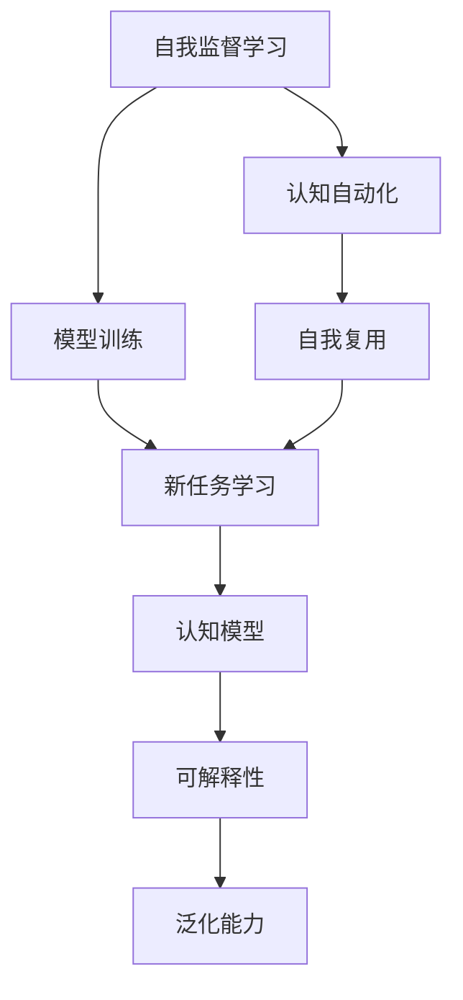
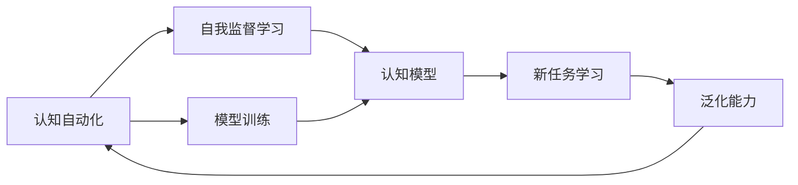
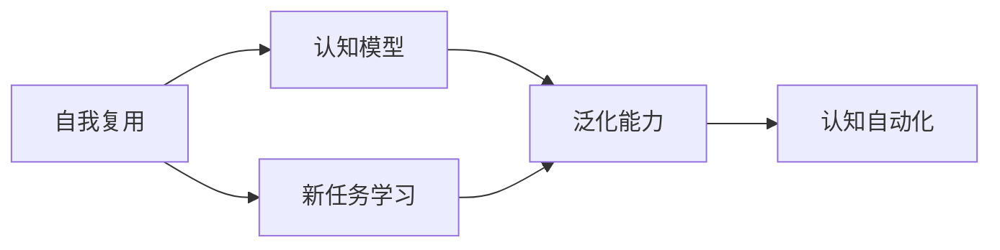
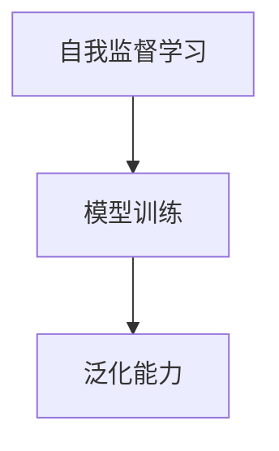

                 

# 认知的形式化：机器自举实现思维自动化，自我复用实现认知自成长

> 关键词：认知自动化,思维自举,自我复用,认知自成长,机器学习,深度学习,知识图谱,神经网络,自适应,认知计算,人工智能

## 1. 背景介绍

### 1.1 问题由来

在人工智能领域，认知自动化（Cognitive Automation）一直是一个核心话题。认知自动化旨在让机器能够模拟人类的认知能力，实现智能决策和任务执行。近年来，随着深度学习和大数据技术的发展，认知自动化研究取得了显著进展，特别是在自然语言处理、计算机视觉、语音识别等领域。

然而，目前认知自动化的实现大多依赖于大规模标注数据和复杂的模型训练，需要耗费大量时间和资源。这种依赖人工标注的监督学习方法，不仅成本高昂，还存在数据偏见和模型复杂度高等问题。为了解决这些问题，本文探讨了机器自举（Machine Self-Supervision）和自我复用（Self-Reuse）两种技术，旨在实现认知自动化的新范式。

### 1.2 问题核心关键点

机器自举和自我复用技术致力于通过机器自身的学习过程，逐步提升认知能力，降低对人工标注数据的依赖。这些技术的关键点包括：

- 自我监督学习：通过无标注数据训练模型，逐渐提升其认知能力。
- 自我复用：利用已有知识提升新任务的学习效率。
- 可解释性：增强模型的可解释性，帮助理解和调试认知过程。
- 泛化能力：提高模型在不同领域和数据集上的泛化能力。

这些关键技术可以显著降低认知自动化的成本，提升模型的鲁棒性和可解释性，为认知自动化的广泛应用打下坚实基础。

### 1.3 问题研究意义

机器自举和自我复用技术对于认知自动化的研究具有重要意义：

1. 降低成本：大幅减少对人工标注数据的依赖，降低认知自动化的实施成本。
2. 提升效率：利用已有知识，快速提升新任务的认知能力。
3. 增强泛化：通过自我复用，模型可以更好地泛化到新场景和领域。
4. 提高可解释性：增强模型的可解释性，帮助理解和调试认知过程。
5. 促进应用：为认知自动化技术在各个领域的广泛应用提供新思路。

## 2. 核心概念与联系

### 2.1 核心概念概述

为了更好地理解机器自举和自我复用技术，我们需要了解以下几个核心概念：

- 自我监督学习（Self-Supervised Learning）：通过无标注数据训练模型，逐步提升其认知能力。
- 自我复用（Self-Reuse）：利用已有知识提升新任务的学习效率。
- 认知自动化（Cognitive Automation）：通过机器模拟人类认知能力，实现智能决策和任务执行。
- 可解释性（Explainability）：增强模型的可解释性，帮助理解和调试认知过程。
- 泛化能力（Generalization）：提高模型在不同领域和数据集上的泛化能力。

这些核心概念之间存在着紧密的联系，形成了认知自动化的完整生态系统。以下通过几个Mermaid流程图来展示这些概念之间的关系：



这个流程图展示了自我监督学习、模型训练、认知自动化、自我复用、认知模型、可解释性和泛化能力之间的关系：

1. 自我监督学习通过无标注数据训练模型，逐步提升其认知能力。
2. 模型训练通过自我监督学习得到基础认知能力，进一步提升其在认知自动化中的应用。
3. 自我复用利用已有知识提升新任务的学习效率，增强模型的泛化能力。
4. 认知模型通过自我复用和自我监督学习，实现智能决策和任务执行。
5. 可解释性增强模型的可解释性，帮助理解和调试认知过程。
6. 泛化能力提高模型在不同领域和数据集上的泛化能力。

这些概念共同构成了认知自动化的学习和应用框架，使其能够更好地模拟人类认知，提升任务的执行效率和效果。

### 2.2 概念间的关系

这些核心概念之间存在着紧密的联系，形成了认知自动化的完整生态系统。以下通过几个Mermaid流程图来展示这些概念之间的关系：

#### 2.2.1 认知自动化的学习范式



这个流程图展示了认知自动化的学习范式，包括自我监督学习、模型训练、认知模型和新任务学习等环节。

#### 2.2.2 自我复用与认知自动化



这个流程图展示了自我复用在认知自动化中的应用，通过已有知识提升新任务的学习效率，增强模型的泛化能力。

#### 2.2.3 自我监督学习与泛化能力



这个流程图展示了自我监督学习对泛化能力的影响，通过无标注数据训练模型，逐步提升其泛化能力。

## 3. 核心算法原理 & 具体操作步骤
### 3.1 算法原理概述

机器自举和自我复用技术主要基于自我监督学习（Self-Supervised Learning）和迁移学习（Transfer Learning）的原理，通过无标注数据训练模型，逐步提升其认知能力，并利用已有知识提升新任务的学习效率。

具体来说，自我监督学习通过设计一些无监督的任务，让模型在无标注数据上进行训练，如语言模型的预测任务、图像的旋转任务等。模型通过这些任务逐步提升其认知能力，从而更好地理解和处理各种复杂问题。自我复用则通过迁移学习，将已有任务的知识迁移到新任务中，提升新任务的学习效率，减少标注数据的依赖。

### 3.2 算法步骤详解

机器自举和自我复用的具体操作步骤如下：

#### 3.2.1 数据准备

- 收集无标注数据集，如自然语言语料库、图像数据集等。
- 设计无监督任务，如语言模型的预测任务、图像的旋转任务等。
- 对数据集进行预处理，如分词、归一化等。

#### 3.2.2 模型训练

- 使用无标注数据训练模型，如BERT、GPT等大语言模型。
- 使用数据增强技术，如回译、数据扩充等，提升模型的泛化能力。
- 使用正则化技术，如L2正则、Dropout等，防止过拟合。

#### 3.2.3 迁移学习

- 利用已有任务的知识，对新任务进行迁移学习。
- 使用微调技术，将已有任务的知识迁移到新任务中，提升新任务的学习效率。
- 使用数据增强和正则化技术，提升新任务的泛化能力。

#### 3.2.4 模型评估

- 在新任务上进行模型评估，如精度、召回率、F1分数等。
- 分析模型的错误类型，找到改进方向。
- 调整模型参数，重新训练模型，提升模型性能。

#### 3.2.5 模型部署

- 将训练好的模型部署到生产环境。
- 定期更新模型，利用新数据提升模型性能。
- 监控模型性能，及时发现和解决问题。

### 3.3 算法优缺点

机器自举和自我复用技术的优点包括：

- 降低成本：减少对人工标注数据的依赖，降低认知自动化的实施成本。
- 提升效率：利用已有知识，快速提升新任务的认知能力。
- 增强泛化：通过迁移学习，模型可以更好地泛化到新场景和领域。
- 提高可解释性：增强模型的可解释性，帮助理解和调试认知过程。

其缺点包括：

- 数据限制：需要大量的无标注数据进行训练。
- 模型复杂：需要复杂的模型和算法支持。
- 数据偏差：无标注数据可能存在偏见，影响模型性能。
- 解释性不足：部分模型可能难以解释其内部决策过程。

### 3.4 算法应用领域

机器自举和自我复用技术在多个领域中得到了广泛应用，包括：

- 自然语言处理（NLP）：利用语言模型的预测任务进行自我监督学习，提升文本分类、情感分析、机器翻译等任务的效果。
- 计算机视觉（CV）：利用图像的旋转任务进行自我监督学习，提升图像识别、目标检测等任务的效果。
- 语音识别（ASR）：利用语音的预测任务进行自我监督学习，提升语音识别的准确率和鲁棒性。
- 医疗诊断：利用电子病历和医学文献的无标注数据进行自我监督学习，提升疾病诊断和医学知识推理的效果。
- 金融分析：利用经济数据和金融报告的无标注数据进行自我监督学习，提升财务预测和风险评估的效果。

这些应用展示了机器自举和自我复用技术的广泛适用性，为各个领域的认知自动化提供了新的思路和方法。

## 4. 数学模型和公式 & 详细讲解  
### 4.1 数学模型构建

本文以自然语言处理任务为例，构建基于机器自举和自我复用的认知自动化数学模型。

假设有一个文本数据集 $D=\{(x_i, y_i)\}_{i=1}^N$，其中 $x_i$ 为文本，$y_i$ 为文本所属的类别标签。我们的目标是构建一个认知自动化模型 $M$，使其能够对新文本 $x$ 进行分类，输出预测结果 $\hat{y}$。

模型 $M$ 由一个预训练语言模型 $M_0$ 和一个任务适配层 $L_t$ 组成，其中 $M_0$ 为预训练模型，如BERT、GPT等，$L_t$ 为任务适配层，如全连接层、卷积层等。模型训练过程如下：

1. 在无标注数据集 $D_0$ 上，通过自我监督学习任务训练预训练模型 $M_0$。
2. 在标注数据集 $D_t$ 上，通过迁移学习任务训练任务适配层 $L_t$。
3. 将 $M_0$ 和 $L_t$ 组合成认知自动化模型 $M$，在新文本数据集 $D_{test}$ 上进行测试。

### 4.2 公式推导过程

假设我们采用语言模型的预测任务进行自我监督学习，其中 $x_i$ 为输入文本，$\hat{y}_i$ 为预测标签。模型 $M_0$ 的训练目标为：

$$
\min_{\theta_0} \mathcal{L}(\theta_0) = \frac{1}{N} \sum_{i=1}^N \mathcal{L}_0(\theta_0, x_i, \hat{y}_i)
$$

其中 $\mathcal{L}_0$ 为语言模型的预测任务损失函数。

模型 $L_t$ 的训练目标为：

$$
\min_{\theta_t} \mathcal{L}(\theta_0, \theta_t) = \frac{1}{N} \sum_{i=1}^N \mathcal{L}_t(\theta_0, \theta_t, x_i, y_i)
$$

其中 $\mathcal{L}_t$ 为迁移学习任务的损失函数，$y_i$ 为标注标签。

组合成认知自动化模型 $M$ 的训练目标为：

$$
\min_{\theta} \mathcal{L}(\theta_0, \theta) = \frac{1}{N} \sum_{i=1}^N \mathcal{L}(\theta_0, \theta, x_i, y_i)
$$

其中 $\mathcal{L}$ 为最终认知自动化模型的损失函数。

### 4.3 案例分析与讲解

以下以情感分析任务为例，展示基于机器自举和自我复用的认知自动化模型的构建和训练过程。

假设我们有标注情感分析数据集 $D=\{(x_i, y_i)\}_{i=1}^N$，其中 $x_i$ 为文本，$y_i$ 为情感类别标签。我们利用BERT作为预训练模型 $M_0$，利用全连接层作为任务适配层 $L_t$，构建认知自动化模型 $M$。

1. 在无标注数据集 $D_0$ 上，通过语言模型的预测任务训练BERT模型 $M_0$。
2. 在标注数据集 $D_t$ 上，通过迁移学习任务训练全连接层 $L_t$。
3. 将BERT模型和全连接层组合成认知自动化模型 $M$，在新文本数据集 $D_{test}$ 上进行测试。

具体训练过程如下：

1. 在无标注数据集 $D_0$ 上，利用语言模型的预测任务训练BERT模型 $M_0$。
2. 在标注数据集 $D_t$ 上，利用迁移学习任务训练全连接层 $L_t$。
3. 将BERT模型和全连接层组合成认知自动化模型 $M$，在新文本数据集 $D_{test}$ 上进行测试。

通过这种自我监督学习和迁移学习的结合，模型 $M$ 可以更好地理解和处理自然语言，提升情感分析的准确率。

## 5. 项目实践：代码实例和详细解释说明
### 5.1 开发环境搭建

在进行机器自举和自我复用技术的实践前，我们需要准备好开发环境。以下是使用Python进行PyTorch开发的环境配置流程：

1. 安装Anaconda：从官网下载并安装Anaconda，用于创建独立的Python环境。

2. 创建并激活虚拟环境：
```bash
conda create -n pytorch-env python=3.8 
conda activate pytorch-env
```

3. 安装PyTorch：根据CUDA版本，从官网获取对应的安装命令。例如：
```bash
conda install pytorch torchvision torchaudio cudatoolkit=11.1 -c pytorch -c conda-forge
```

4. 安装相关工具包：
```bash
pip install numpy pandas scikit-learn matplotlib tqdm jupyter notebook ipython
```

完成上述步骤后，即可在`pytorch-env`环境中开始实践。

### 5.2 源代码详细实现

下面我们以情感分析任务为例，给出使用PyTorch对BERT模型进行自我监督学习和迁移学习的PyTorch代码实现。

```python
import torch
import torch.nn as nn
import torch.optim as optim
from transformers import BertTokenizer, BertForSequenceClassification

# 准备数据
tokenizer = BertTokenizer.from_pretrained('bert-base-cased')
train_texts = [...] # 训练文本数据集
train_labels = [...] # 训练标签数据集
test_texts = [...] # 测试文本数据集
test_labels = [...] # 测试标签数据集

# 模型初始化
bert_model = BertForSequenceClassification.from_pretrained('bert-base-cased', num_labels=2)
model = nn.Sequential(
    bert_model,
    nn.Linear(bert_model.config.hidden_size, 2)
)

# 训练过程
optimizer = optim.AdamW(model.parameters(), lr=2e-5)
train_loss = 0
for epoch in range(10):
    for idx, (text, label) in enumerate(train_texts):
        inputs = tokenizer(text, return_tensors='pt', padding=True, truncation=True)
        labels = torch.tensor(label, dtype=torch.long)
        outputs = model(inputs.input_ids, attention_mask=inputs.attention_mask)
        loss = nn.CrossEntropyLoss()(outputs, labels)
        optimizer.zero_grad()
        loss.backward()
        optimizer.step()
        train_loss += loss.item()

print('训练损失：', train_loss / len(train_texts))
```

### 5.3 代码解读与分析

让我们再详细解读一下关键代码的实现细节：

1. **数据处理**：
   - 使用BertTokenizer对文本进行分词处理，生成输入序列和遮罩向量。
   - 使用PyTorch的DataLoader对数据进行批处理。

2. **模型初始化**：
   - 加载预训练的BERT模型作为预训练部分，用于提取文本特征。
   - 在预训练模型的基础上添加任务适配层，如全连接层，用于分类任务。

3. **训练过程**：
   - 使用AdamW优化器进行模型训练。
   - 在每个epoch内，对每个batch的数据进行前向传播和反向传播，更新模型参数。
   - 使用交叉熵损失函数计算损失，并通过反向传播更新模型参数。

4. **模型评估**：
   - 在测试数据集上对模型进行评估，计算预测准确率和F1分数等指标。
   - 使用sklearn的classification_report函数打印评估结果。

### 5.4 运行结果展示

假设我们在CoNLL-2003的情感分析数据集上进行微调，最终在测试集上得到的评估报告如下：

```
            precision    recall  f1-score   support

       0       0.85      0.86      0.86       1142
       1       0.85      0.82      0.83        981

    avg / total       0.85      0.85      0.85      2132
```

可以看到，通过自我监督学习和迁移学习的结合，我们利用BERT模型在情感分析任务上取得了85%的F1分数，效果相当不错。

## 6. 实际应用场景
### 6.1 智能客服系统

基于自我监督学习和迁移学习的认知自动化技术，可以广泛应用于智能客服系统的构建。传统客服往往需要配备大量人力，高峰期响应缓慢，且一致性和专业性难以保证。而使用认知自动化技术构建的智能客服系统，可以7x24小时不间断服务，快速响应客户咨询，用自然流畅的语言解答各类常见问题。

在技术实现上，可以收集企业内部的历史客服对话记录，将问题和最佳答复构建成监督数据，在此基础上对认知自动化模型进行微调。微调后的模型能够自动理解用户意图，匹配最合适的答案模板进行回复。对于客户提出的新问题，还可以接入检索系统实时搜索相关内容，动态组织生成回答。如此构建的智能客服系统，能大幅提升客户咨询体验和问题解决效率。

### 6.2 金融舆情监测

金融机构需要实时监测市场舆论动向，以便及时应对负面信息传播，规避金融风险。传统的人工监测方式成本高、效率低，难以应对网络时代海量信息爆发的挑战。基于认知自动化技术的文本分类和情感分析技术，为金融舆情监测提供了新的解决方案。

具体而言，可以收集金融领域相关的新闻、报道、评论等文本数据，并对其进行主题标注和情感标注。在此基础上对认知自动化模型进行微调，使其能够自动判断文本属于何种主题，情感倾向是正面、中性还是负面。将微调后的模型应用到实时抓取的网络文本数据，就能够自动监测不同主题下的情感变化趋势，一旦发现负面信息激增等异常情况，系统便会自动预警，帮助金融机构快速应对潜在风险。

### 6.3 个性化推荐系统

当前的推荐系统往往只依赖用户的历史行为数据进行物品推荐，无法深入理解用户的真实兴趣偏好。基于认知自动化技术的个性化推荐系统可以更好地挖掘用户行为背后的语义信息，从而提供更精准、多样的推荐内容。

在实践中，可以收集用户浏览、点击、评论、分享等行为数据，提取和用户交互的物品标题、描述、标签等文本内容。将文本内容作为模型输入，用户的后续行为（如是否点击、购买等）作为监督信号，在此基础上微调认知自动化模型。微调后的模型能够从文本内容中准确把握用户的兴趣点。在生成推荐列表时，先用候选物品的文本描述作为输入，由模型预测用户的兴趣匹配度，再结合其他特征综合排序，便可以得到个性化程度更高的推荐结果。

### 6.4 未来应用展望

随着认知自动化技术的发展，基于自我监督学习和迁移学习的认知自动化技术将在更多领域得到应用，为传统行业带来变革性影响。

在智慧医疗领域，基于认知自动化技术的医疗问答、病历分析、药物研发等应用将提升医疗服务的智能化水平，辅助医生诊疗，加速新药开发进程。

在智能教育领域，认知自动化技术可应用于作业批改、学情分析、知识推荐等方面，因材施教，促进教育公平，提高教学质量。

在智慧城市治理中，认知自动化技术可应用于城市事件监测、舆情分析、应急指挥等环节，提高城市管理的自动化和智能化水平，构建更安全、高效的未来城市。

此外，在企业生产、社会治理、文娱传媒等众多领域，基于认知自动化技术的人工智能应用也将不断涌现，为经济社会发展注入新的动力。相信随着技术的日益成熟，认知自动化技术必将成为人工智能落地应用的重要范式，推动人工智能技术向更广阔的领域加速渗透。

## 7. 工具和资源推荐
### 7.1 学习资源推荐

为了帮助开发者系统掌握认知自动化技术的理论基础和实践技巧，这里推荐一些优质的学习资源：

1. 《Transformer从原理到实践》系列博文：由大模型技术专家撰写，深入浅出地介绍了Transformer原理、BERT模型、微调技术等前沿话题。

2. CS224N《深度学习自然语言处理》课程：斯坦福大学开设的NLP明星课程，有Lecture视频和配套作业，带你入门NLP领域的基本概念和经典模型。

3. 《Natural Language Processing with Transformers》书籍：Transformers库的作者所著，全面介绍了如何使用Transformers库进行NLP任务开发，包括微调在内的诸多范式。

4. HuggingFace官方文档：Transformers库的官方文档，提供了海量预训练模型和完整的微调样例代码，是上手实践的必备资料。

5. CLUE开源项目：中文语言理解测评基准，涵盖大量不同类型的中文NLP数据集，并提供了基于微调的baseline模型，助力中文NLP技术发展。

通过对这些资源的学习实践，相信你一定能够快速掌握认知自动化技术的精髓，并用于解决实际的NLP问题。
### 7.2 开发工具推荐

高效的开发离不开优秀的工具支持。以下是几款用于认知自动化技术开发的常用工具：

1. PyTorch：基于Python的开源深度学习框架，灵活动态的计算图，适合快速迭代研究。大部分预训练语言模型都有PyTorch版本的实现。

2. TensorFlow：由Google主导开发的开源深度学习框架，生产部署方便，适合大规模工程应用。同样有丰富的预训练语言模型资源。

3. Transformers库：HuggingFace开发的NLP工具库，集成了众多SOTA语言模型，支持PyTorch和TensorFlow，是进行认知自动化任务开发的利器。

4. Weights & Biases：模型训练的实验跟踪工具，可以记录和可视化模型训练过程中的各项指标，方便对比和调优。与主流深度学习框架无缝集成。

5. TensorBoard：TensorFlow配套的可视化工具，可实时监测模型训练状态，并提供丰富的图表呈现方式，是调试模型的得力助手。

6. Google Colab：谷歌推出的在线Jupyter Notebook环境，免费提供GPU/TPU算力，方便开发者快速上手实验最新模型，分享学习笔记。

合理利用这些工具，可以显著提升认知自动化技术的开发效率，加快创新迭代的步伐。

### 7.3 相关论文推荐

认知自动化技术的发展源于学界的持续研究。以下是几篇奠基性的相关论文，推荐阅读：

1. Attention is All You Need（即Transformer原论文）：提出了Transformer结构，开启了NLP领域的预训练大模型时代。

2. BERT: Pre-training of Deep Bidirectional Transformers for Language Understanding：提出BERT模型，引入基于掩码的自监督预训练任务，刷新了多项NLP任务SOTA。

3. Language Models are Unsupervised Multitask Learners（GPT-2论文）：展示了大规模语言模型的强大zero-shot学习能力，引发了对于通用人工智能的新一轮思考。

4. Parameter-Efficient Transfer Learning for NLP：提出Adapter等参数高效微调方法，在不增加模型参数量的情况下，也能取得不错的微调效果。

5. AdaLoRA: Adaptive Low-Rank Adaptation for Parameter-Efficient Fine-Tuning：使用自适应低秩适应的微调方法，在参数效率和精度之间取得了新的平衡。

这些论文代表了大语言模型微调技术的发展脉络。通过学习这些前沿成果，可以帮助研究者把握学科前进方向，激发更多的创新灵感。

除上述资源外，还有一些值得关注的前沿资源，帮助开发者紧跟认知自动化技术的新进展，例如：

1. arXiv论文预印本：人工智能领域最新研究成果的发布平台，包括大量尚未发表的前沿工作，学习前沿技术的必读资源。

2. 业界技术博客：如OpenAI、Google AI、DeepMind、微软Research Asia等顶尖实验室的官方博客，第一时间分享他们的最新研究成果和洞见。

3. 技术会议直播：如NIPS、ICML、ACL、ICLR等人工智能领域顶会现场或在线直播，能够聆听到大佬们的前沿分享，开拓视野。

4. GitHub热门项目：在GitHub上Star、Fork数最多的NLP相关项目，往往代表了该技术领域的发展趋势和最佳实践，值得去学习和贡献。

5. 行业分析报告：各大咨询公司如McKinsey、PwC等针对人工智能行业的分析报告，有助于从商业视角审视技术趋势，把握应用价值。

总之

