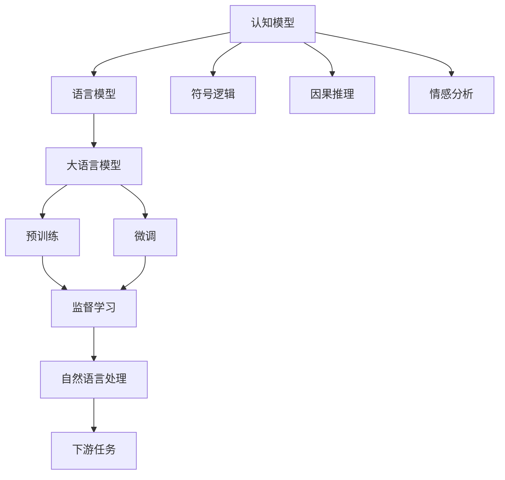
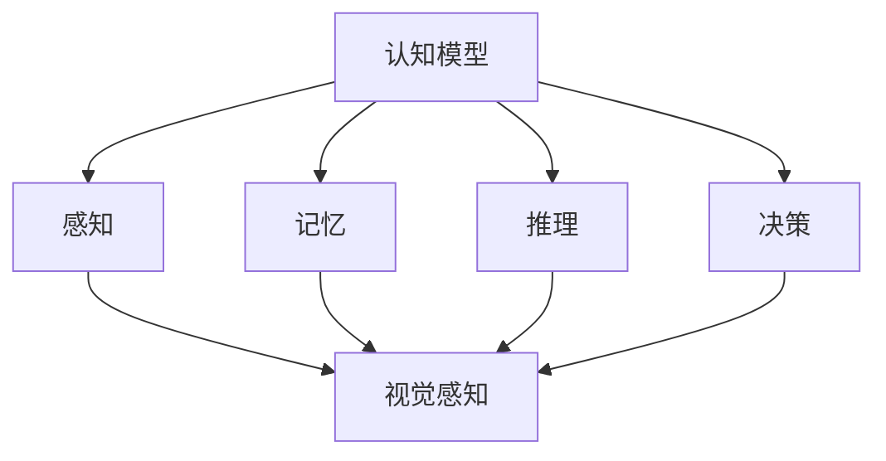
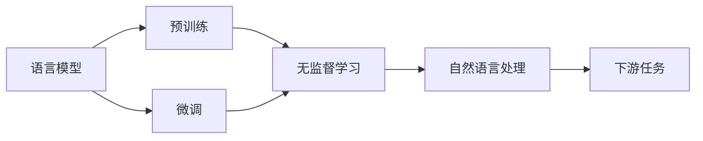
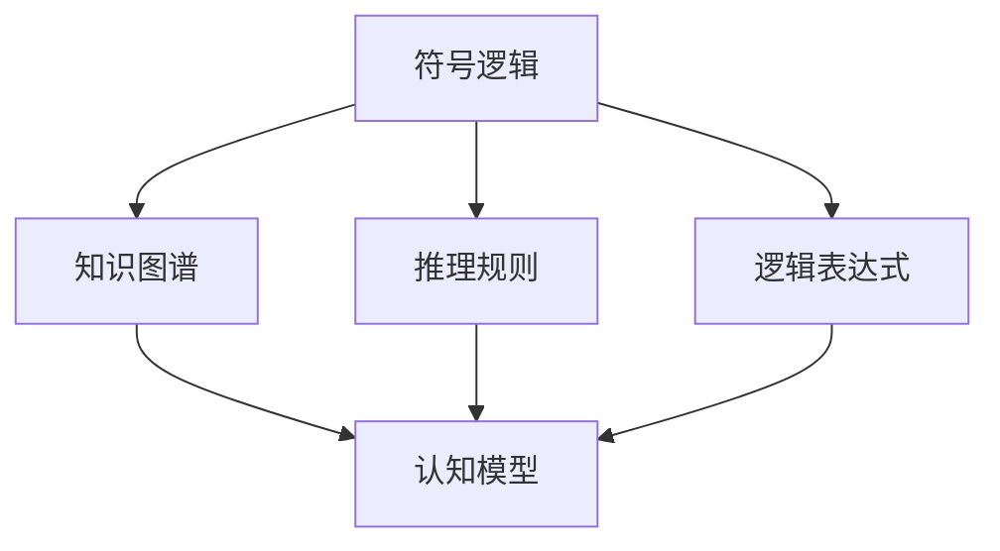
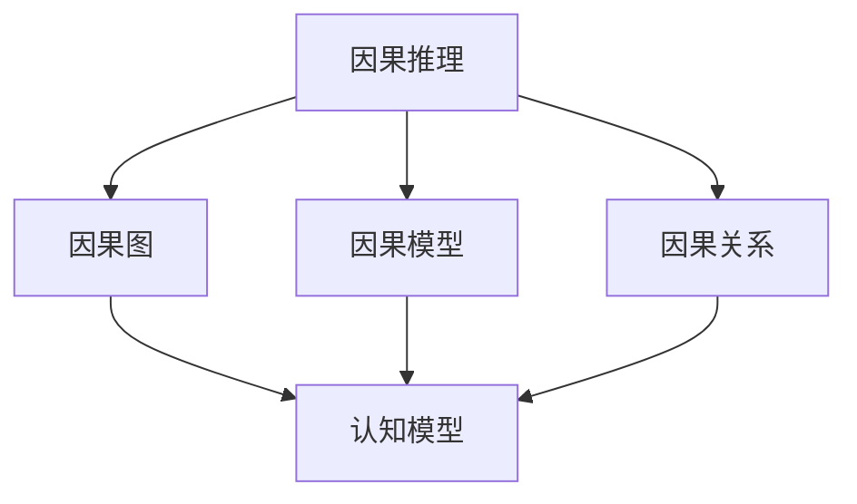
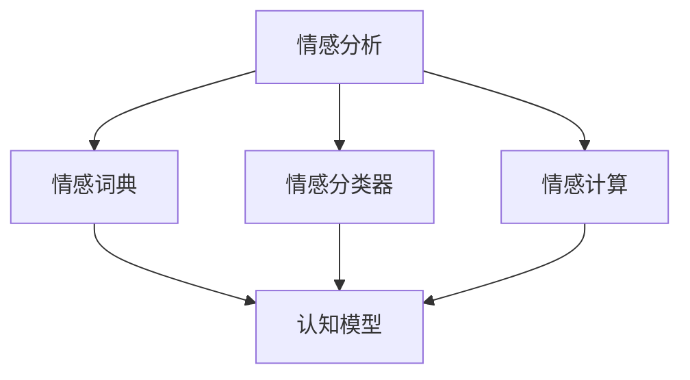
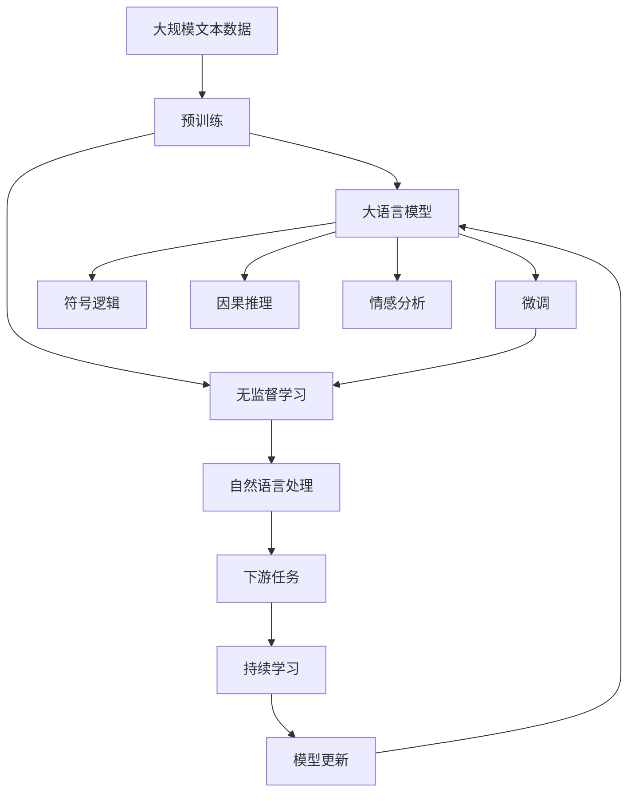

                 

## 1. 背景介绍

### 1.1 问题由来

语言是认知的基础，能够承载丰富的意义和情感。但在大模型（Large Language Models, LLMs）中，语言往往被简化为符号和模式的组合，无法完全捕捉到人类的思维过程。这种认知上的障碍，可能导致大模型在自然语言处理（NLP）等任务中表现出色，但在更深层次的逻辑推理和情感理解方面存在欠缺。

本文旨在探讨大模型在认知层面的局限，分析语言与思维之间的差异，并提出改进思路，以期推动大模型的智能化演进。

### 1.2 问题核心关键点

1. **认知模型的局限**：大模型虽然在大规模文本数据上进行了预训练，但这种无监督的预训练并不能保证模型具备与人类相似的认知能力。

2. **语言与思维的脱节**：语言是思维的载体，但大模型在处理语言时，往往难以真正理解语言背后的逻辑和情感。

3. **认知模型的复杂性**：认知模型的构建需要考虑语义、逻辑、情感等多个维度的因素，这在大模型中实现起来存在挑战。

4. **深度学习模型的表现**：深度学习模型在图像、语音等领域表现出色，但在处理复杂语言任务时，仍需克服认知障碍。

5. **认知障碍的解决**：需要结合符号逻辑、常识推理、因果推理等多种方法，逐步提升大模型的认知能力。

### 1.3 问题研究意义

探讨大模型的认知障碍，对于提升其在深度学习和NLP领域的智能化水平具有重要意义：

1. **促进NLP任务的智能化**：理解语言背后的认知机制，有助于提升模型在情感分析、问答系统、翻译等复杂任务中的表现。
2. **推动认知科学的发展**：通过研究大模型与人类认知的差异，有助于理解人类思维的本质，推动认知科学的发展。
3. **指导大模型的改进**：明确认知障碍的所在，可以指导未来的研究方向和改进措施。
4. **拓展应用范围**：通过提升大模型的认知能力，可以拓展其在医疗、法律、金融等领域的应用。

## 2. 核心概念与联系

### 2.1 核心概念概述

为更好地理解大模型的认知障碍，本节将介绍几个密切相关的核心概念：

- **认知模型（Cognitive Model）**：用于模拟人类认知过程的计算模型，包括感知、记忆、推理、决策等。
- **语言模型（Language Model）**：使用概率模型或神经网络对语言数据进行建模的模型。
- **符号逻辑（Symbolic Logic）**：通过符号和公式表达和推理逻辑的学科，与自然语言处理密切相关。
- **因果推理（Causal Inference）**：研究因果关系和因果推理的学科，有助于解释语言背后的原因和结果。
- **情感分析（Sentiment Analysis）**：分析文本中的情感倾向和情绪状态的技术。

这些核心概念之间的逻辑关系可以通过以下Mermaid流程图来展示：



这个流程图展示了认知模型与语言模型、符号逻辑、因果推理、情感分析等核心概念之间的关系：

1. 认知模型用于模拟人类的认知过程。
2. 语言模型通过统计语言规律，对语言数据进行建模。
3. 符号逻辑通过符号和公式表达逻辑关系，辅助语言模型理解语言背后的逻辑。
4. 因果推理研究因果关系，帮助理解语言背后的因果关系。
5. 情感分析通过分析语言中的情感信息，辅助理解语言背后的情感倾向。
6. 大语言模型通过预训练和微调，学习语言模型和认知模型中的知识。
7. 预训练通过无监督学习任务，学习语言和认知的基本规律。
8. 微调通过有监督学习任务，进一步优化模型在特定任务上的性能。
9. 自然语言处理利用语言模型和认知模型中的知识，处理各种下游任务。
10. 下游任务通过自然语言处理技术，解决实际问题。

这些概念共同构成了大模型认知模型的学习框架，使其能够更好地理解和处理自然语言数据。

### 2.2 概念间的关系

这些核心概念之间存在着紧密的联系，形成了大模型认知模型的完整生态系统。下面我通过几个Mermaid流程图来展示这些概念之间的关系。

#### 2.2.1 认知模型的学习范式



这个流程图展示了认知模型的学习范式，包括感知、记忆、推理、决策等基本模块。

#### 2.2.2 语言模型与认知模型的关系



这个流程图展示了语言模型在大模型认知模型中的作用，包括预训练和微调等步骤。

#### 2.2.3 符号逻辑与认知模型的关系



这个流程图展示了符号逻辑在大模型认知模型中的作用，包括知识图谱、推理规则、逻辑表达式等。

#### 2.2.4 因果推理与认知模型的关系



这个流程图展示了因果推理在大模型认知模型中的作用，包括因果图、因果模型、因果关系等。

#### 2.2.5 情感分析与认知模型的关系



这个流程图展示了情感分析在大模型认知模型中的作用，包括情感词典、情感分类器、情感计算等。

### 2.3 核心概念的整体架构

最后，我们用一个综合的流程图来展示这些核心概念在大模型认知模型微调过程中的整体架构：



这个综合流程图展示了从预训练到微调，再到持续学习的完整过程。大语言模型首先在大规模文本数据上进行预训练，然后通过微调（包括符号逻辑、因果推理、情感分析等）来优化模型在特定任务上的性能。最后，通过持续学习技术，模型可以不断更新和适应新的任务和数据。 通过这些流程图，我们可以更清晰地理解大语言模型认知模型微调过程中各个核心概念的关系和作用，为后续深入讨论具体的微调方法和技术奠定基础。

## 3. 核心算法原理 & 具体操作步骤
### 3.1 算法原理概述

大语言模型认知障碍的核心在于其无法完全理解语言背后的认知机制。虽然大模型在文本数据上的预训练可以使其具备一定的语言理解能力，但在认知层面的逻辑推理、情感分析等方面仍然存在不足。因此，在大模型微调过程中，需要引入符号逻辑、因果推理、情感分析等认知模型，以提升其在认知层面的表现。

大语言模型认知模型的微调过程一般包括以下几个关键步骤：

**Step 1: 准备预训练模型和数据集**
- 选择合适的预训练语言模型 $M_{\theta}$ 作为初始化参数，如 BERT、GPT等。
- 准备下游任务 $T$ 的标注数据集 $D=\{(x_i,y_i)\}_{i=1}^N$，划分为训练集、验证集和测试集。

**Step 2: 添加认知模块**
- 根据任务类型，在预训练模型顶层设计合适的认知模块，如符号逻辑推理器、因果推理器、情感分析器等。
- 对于分类任务，通常使用逻辑推理器或情感分析器输出结果，并以交叉熵损失函数为损失函数。
- 对于生成任务，通常使用语言模型的解码器输出概率分布，并以负对数似然为损失函数。

**Step 3: 设置微调超参数**
- 选择合适的优化算法及其参数，如 AdamW、SGD 等，设置学习率、批大小、迭代轮数等。
- 设置正则化技术及强度，包括权重衰减、Dropout、Early Stopping等。
- 确定冻结预训练参数的策略，如仅微调顶层，或全部参数都参与微调。

**Step 4: 执行梯度训练**
- 将训练集数据分批次输入模型，前向传播计算损失函数。
- 反向传播计算参数梯度，根据设定的优化算法和学习率更新模型参数。
- 周期性在验证集上评估模型性能，根据性能指标决定是否触发 Early Stopping。
- 重复上述步骤直到满足预设的迭代轮数或 Early Stopping 条件。

**Step 5: 测试和部署**
- 在测试集上评估微调后模型 $M_{\hat{\theta}}$ 的性能，对比微调前后的精度提升。
- 使用微调后的模型对新样本进行推理预测，集成到实际的应用系统中。
- 持续收集新的数据，定期重新微调模型，以适应数据分布的变化。

以上是认知模型微调的一般流程。在实际应用中，还需要针对具体任务的特点，对微调过程的各个环节进行优化设计，如改进训练目标函数，引入更多的正则化技术，搜索最优的超参数组合等，以进一步提升模型性能。

### 3.2 算法步骤详解

认知模型微调的具体步骤与基于监督学习的微调类似，但需要考虑更多认知层面的因素。以下以一个简单的二分类任务为例，介绍认知模型微调的步骤：

**Step 1: 准备预训练模型和数据集**
- 选择合适的预训练语言模型 $M_{\theta}$ 作为初始化参数，如 BERT、GPT等。
- 准备下游任务 $T$ 的标注数据集 $D=\{(x_i,y_i)\}_{i=1}^N$，划分为训练集、验证集和测试集。

**Step 2: 添加认知模块**
- 设计符号逻辑推理器，用于解析输入文本中的逻辑关系，判断文本是否符合特定逻辑。
- 设计因果推理器，用于分析输入文本中的因果关系，判断文本是否满足特定因果关系。
- 设计情感分析器，用于分析输入文本中的情感倾向，判断文本是否符合特定情感状态。

**Step 3: 设置微调超参数**
- 选择合适的优化算法及其参数，如 AdamW、SGD 等，设置学习率、批大小、迭代轮数等。
- 设置正则化技术及强度，包括权重衰减、Dropout、Early Stopping等。
- 确定冻结预训练参数的策略，如仅微调顶层，或全部参数都参与微调。

**Step 4: 执行梯度训练**
- 将训练集数据分批次输入模型，前向传播计算损失函数。
- 反向传播计算参数梯度，根据设定的优化算法和学习率更新模型参数。
- 周期性在验证集上评估模型性能，根据性能指标决定是否触发 Early Stopping。
- 重复上述步骤直到满足预设的迭代轮数或 Early Stopping 条件。

**Step 5: 测试和部署**
- 在测试集上评估微调后模型 $M_{\hat{\theta}}$ 的性能，对比微调前后的精度提升。
- 使用微调后的模型对新样本进行推理预测，集成到实际的应用系统中。
- 持续收集新的数据，定期重新微调模型，以适应数据分布的变化。

### 3.3 算法优缺点

认知模型微调方法具有以下优点：
1. 结合认知模型，提升模型在认知层面的表现，尤其是在逻辑推理、情感分析等方面。
2. 可以利用符号逻辑、因果推理、情感分析等多种技术，提高模型的认知能力。
3. 可以通过认知模块的调整，针对特定任务进行优化，提升模型的任务适配能力。

同时，该方法也存在一定的局限性：
1. 需要设计并实现多种认知模块，增加了实现复杂度。
2. 认知模块的引入可能导致模型复杂度增加，训练和推理效率下降。
3. 认知模型的引入需要更多的数据和计算资源，增加了成本投入。
4. 不同认知模块的集成可能需要更多的经验和技能，增加了开发难度。

尽管存在这些局限性，但认知模型微调方法在大模型中引入认知能力的思路是可行的，有助于提升模型在认知层面的表现。

### 3.4 算法应用领域

认知模型微调方法主要应用于以下领域：

1. **法律文书分析**：通过引入符号逻辑和因果推理，分析法律文书的逻辑结构和因果关系，提高法律文书分析的准确性和可信度。
2. **医疗诊断**：结合情感分析和符号逻辑推理，分析病历中的情感倾向和逻辑关系，辅助医生进行诊断和治疗。
3. **金融风险评估**：通过引入因果推理和情感分析，分析金融数据中的因果关系和情感倾向，预测金融风险。
4. **情感分析**：结合情感分析和因果推理，分析文本中的情感倾向和因果关系，提高情感分析的准确性和深度。
5. **智能客服**：通过引入符号逻辑和情感分析，提升智能客服系统在理解用户意图和情感方面的表现，提高用户满意度。

这些领域中，认知模型微调方法能够结合多种认知技术，提升模型在复杂任务中的表现，为行业应用提供新的解决方案。

## 4. 数学模型和公式 & 详细讲解  
### 4.1 数学模型构建

认知模型微调的数学模型可以表示为：

$$
\mathcal{L}(\theta) = \frac{1}{N}\sum_{i=1}^N \ell(M_{\theta}(x_i), y_i)
$$

其中 $M_{\theta}$ 表示认知模型，$x_i$ 表示输入数据，$y_i$ 表示标注结果，$\ell$ 表示损失函数，可以是交叉熵损失、均方误差损失等。

在认知模型微调中，模型的损失函数不仅包括语言模型的损失，还包括认知模块的损失。例如，在二分类任务中，损失函数可以表示为：

$$
\ell(M_{\theta}(x), y) = -[y\log \hat{y} + (1-y)\log (1-\hat{y})] + \ell_{logic}(M_{\theta}(x), y)
$$

其中 $\hat{y}$ 表示认知模型的输出结果，$\ell_{logic}$ 表示逻辑推理模块的损失函数，可以是符号逻辑推理、因果推理、情感分析等多种形式。

### 4.2 公式推导过程

以二分类任务为例，我们推导认知模型的损失函数。

假设认知模型的输出为 $\hat{y}=M_{\theta}(x) \in [0,1]$，真实标签 $y \in \{0,1\}$。定义认知模型的损失函数为 $\ell(M_{\theta}(x),y)$，则在数据集 $D$ 上的经验风险为：

$$
\mathcal{L}(\theta) = \frac{1}{N}\sum_{i=1}^N \ell(M_{\theta}(x_i),y_i)
$$

对于逻辑推理模块，假设其输出结果为 $\hat{y}_{logic}=M_{logic}(x) \in [0,1]$，定义逻辑推理模块的损失函数为 $\ell_{logic}(M_{logic}(x),y)$。则整个认知模型的损失函数可以表示为：

$$
\ell(M_{\theta}(x), y) = -[y\log \hat{y} + (1-y)\log (1-\hat{y})] + \ell_{logic}(M_{logic}(x), y)
$$

将其代入经验风险公式，得：

$$
\mathcal{L}(\theta) = \frac{1}{N}\sum_{i=1}^N [-[y_i\log M_{\theta}(x_i)+(1-y_i)\log(1-M_{\theta}(x_i))] + \ell_{logic}(M_{logic}(x_i), y_i)]
$$

在训练过程中，认知模型的参数 $\theta$ 需要最小化损失函数 $\mathcal{L}(\theta)$。

### 4.3 案例分析与讲解

以一个简单的文本情感分析任务为例，我们展示认知模型微调的实际应用。

**Step 1: 准备预训练模型和数据集**
- 选择合适的预训练语言模型 $M_{\theta}$ 作为初始化参数，如 BERT、GPT等。
- 准备下游任务 $T$ 的标注数据集 $D=\{(x_i,y_i)\}_{i=1}^N$，划分为训练集、验证集和测试集。

**Step 2: 添加认知模块**
- 设计情感分析器，用于分析输入文本中的情感倾向，判断文本是否符合特定情感状态。
- 设计逻辑推理器，用于解析输入文本中的逻辑关系，判断文本是否符合特定逻辑结构。

**Step 3: 设置微调超参数**
- 选择合适的优化算法及其参数，如 AdamW、SGD 等，设置学习率、批大小、迭代轮数等。
- 设置正则化技术及强度，包括权重衰减、Dropout、Early Stopping等。
- 确定冻结预训练参数的策略，如仅微调顶层，或全部参数都参与微调。

**Step 4: 执行梯度训练**
- 将训练集数据分批次输入模型，前向传播计算损失函数。
- 反向传播计算参数梯度，根据设定的优化算法和学习率更新模型参数。
- 周期性在验证集上评估模型性能，根据性能指标决定是否触发 Early Stopping。
- 重复上述步骤直到满足预设的迭代轮数或 Early Stopping 条件。

**Step 5: 测试和部署**
- 在测试集上评估微调后模型 $M_{\hat{\theta}}$ 的性能，对比微调前后的精度提升。
- 使用微调后的模型对新样本进行推理预测，集成到实际的应用系统中。
- 持续收集新的数据，定期重新微调模型，以适应数据分布的变化。

## 5. 项目实践：代码实例和详细解释说明
### 5.1 开发环境搭建

在进行认知模型微调实践前，我们需要准备好开发环境。以下是使用Python进行PyTorch开发的环境配置流程：

1. 安装Anaconda：从官网下载并安装Anaconda，用于创建独立的Python环境。

2. 创建并激活虚拟环境：
```bash
conda create -n pytorch-env python=3.8 
conda activate pytorch-env
```

3. 安装PyTorch：根据CUDA版本，从官网获取对应的安装命令。例如：
```bash
conda install pytorch torchvision torchaudio cudatoolkit=11.1 -c pytorch -c conda-forge
```

4. 安装Transformers库：
```bash
pip install transformers
```

5. 安装各类工具包：
```bash
pip install numpy pandas scikit-learn matplotlib tqdm jupyter notebook ipython
```

完成上述步骤后，即可在`pytorch-env`环境中开始认知模型微调实践。

### 5.2 源代码详细实现

这里我们以情感分析任务为例，给出使用Transformers库对BERT模型进行认知模型微调的PyTorch代码实现。

首先，定义情感分析任务的数据处理函数：

```python
from transformers import BertTokenizer
from torch.utils.data import Dataset
import torch

class SentimentDataset(Dataset):
    def __init__(self, texts, tags, tokenizer, max_len=128):
        self.texts = texts
        self.tags = tags
        self.tokenizer = tokenizer
        self.max_len = max_len
        
    def __len__(self):
        return len(self.texts)
    
    def __getitem__(self, item):
        text = self.texts[item]
        tags = self.tags[item]
        
        encoding = self.tokenizer(text, return_tensors='pt', max_length=self.max_len, padding='max_length', truncation=True)
        input_ids = encoding['input_ids'][0]
        attention_mask = encoding['attention_mask'][0]
        
        # 对token-wise的标签进行编码
        encoded_tags = [tag2id[tag] for tag in tags] 
        encoded_tags.extend([tag2id['O']] * (self.max_len - len(encoded_tags)))
        labels = torch.tensor(encoded_tags, dtype=torch.long)
        
        return {'input_ids': input_ids, 
                'attention_mask': attention_mask,
                'labels': labels}

# 标签与id的映射
tag2id = {'O': 0, 'POSITIVE': 1, 'NEGATIVE': 2}
id2tag = {v: k for k, v in tag2id.items()}

# 创建dataset
tokenizer = BertTokenizer.from_pretrained('bert-base-cased')

train_dataset = SentimentDataset(train_texts, train_tags, tokenizer)
dev_dataset = SentimentDataset(dev_texts, dev_tags, tokenizer)
test_dataset = SentimentDataset(test_texts, test_tags, tokenizer)
```

然后，定义模型和优化器：

```python
from transformers import BertForTokenClassification, AdamW

model = BertForTokenClassification.from_pretrained('bert-base-cased', num_labels=len(tag2id))

optimizer = AdamW(model.parameters(), lr=2e-5)
```

接着，定义训练和评估函数：

```python
from torch.utils.data import DataLoader
from tqdm import tqdm
from sklearn.metrics import classification_report

device = torch.device('cuda') if torch.cuda.is_available() else torch.device('cpu')
model.to(device)

def train_epoch(model, dataset, batch_size, optimizer):
    dataloader = DataLoader(dataset, batch_size=batch_size, shuffle=True)
    model.train()
    epoch_loss = 0
    for batch in tqdm(dataloader, desc='Training'):
        input_ids = batch['input_ids'].to(device)
        attention_mask = batch['attention_mask'].to(device)
        labels = batch['labels'].to(device)
        model.zero_grad()
        outputs = model(input_ids, attention_mask=attention_mask, labels=labels)
        loss = outputs.loss
        epoch_loss += loss.item()
        loss.backward()
        optimizer.step()
    return epoch_loss / len(dataloader)

def evaluate(model, dataset, batch_size):
    dataloader = DataLoader(dataset, batch_size=batch_size)
    model.eval()
    preds, labels = [], []
    with torch.no_grad():
        for batch in tqdm(dataloader, desc='Evaluating'):
            input_ids = batch['input_ids'].to(device)
            attention_mask = batch['attention_mask'].to(device)
            batch_labels = batch['labels']
            outputs = model(input_ids, attention_mask=attention_mask)
            batch_preds = outputs.logits.argmax(dim=2).to('cpu').tolist()
            batch_labels = batch_labels.to('cpu').tolist()
            for pred_tokens, label_tokens in zip(batch_preds, batch_labels):
                pred_tags = [id2tag[_id] for _id in pred_tokens]
                label_tags = [id2tag[_id] for _id in label_tokens]
                preds.append(pred_tags[:len(label_tokens)])
                labels.append(label_tags)
                
    print(classification_report(labels, preds))
```

最后，启动训练流程并在测试集上评估：

```python
epochs = 5
batch_size = 16

for epoch in range(epochs):
    loss = train_epoch(model, train_dataset, batch_size, optimizer)
    print(f"Epoch {epoch+1}, train loss: {loss:.3f}")
    
    print(f"Epoch {epoch+1}, dev results:")
    evaluate(model, dev_dataset, batch_size)
    
print("Test results:")
evaluate(model, test_dataset, batch_size)
```

以上就是使用PyTorch对BERT进行情感分析任务认知模型微调的完整代码实现。可以看到，得益于Transformers库的强大封装，我们可以用相对简洁的代码完成BERT模型的加载和微调。

### 5.3 代码解读与分析

让我们再详细解读一下关键代码的实现细节：

**SentimentDataset类**：
- `__init__`方法：初始化文本、标签、分词器等关键组件。
- `__len__`方法：返回数据集的样本数量。
- `__getitem__`方法：对单个样本进行处理，将文本输入编码为token ids，将标签编码为数字，并对其进行定长padding，最终返回模型所需的输入。

**tag2id和id2tag字典**：
- 定义了标签与数字id之间的映射关系，用于将token-wise的预测结果解码回真实的标签。

**训练和评估函数**：
- 使用PyTorch的DataLoader对数据集进行批次化加载，供模型训练和推理使用。
- 训练函数`train_epoch`：对数据以批

