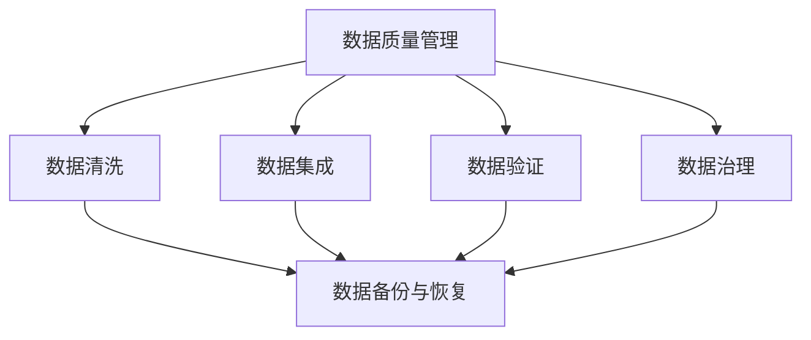
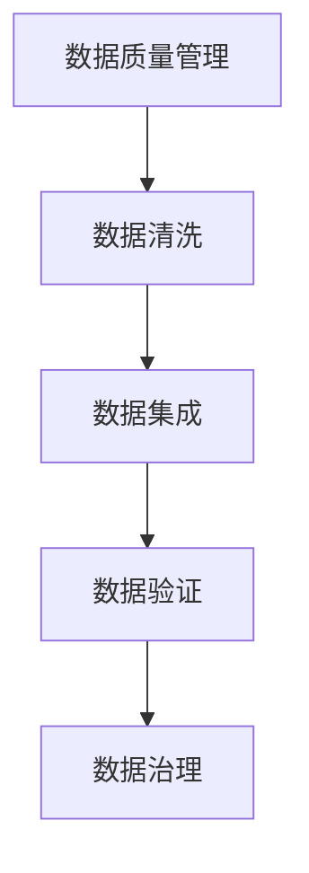
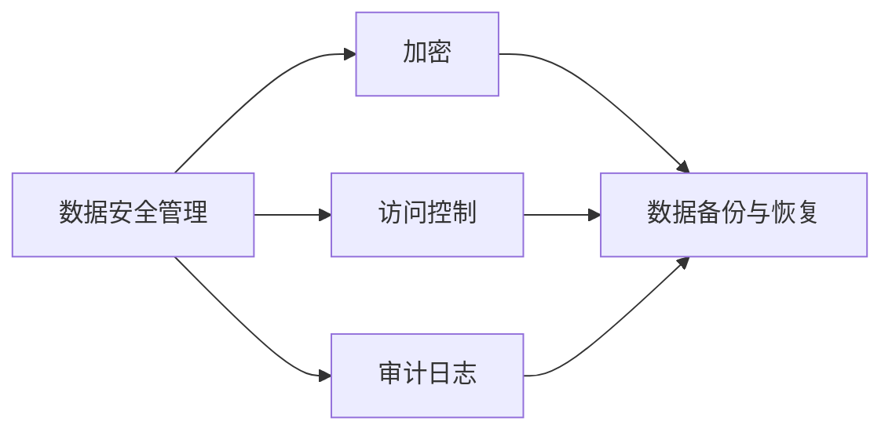
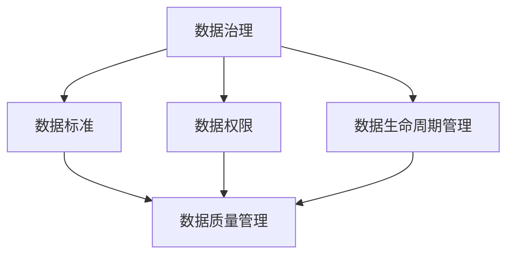
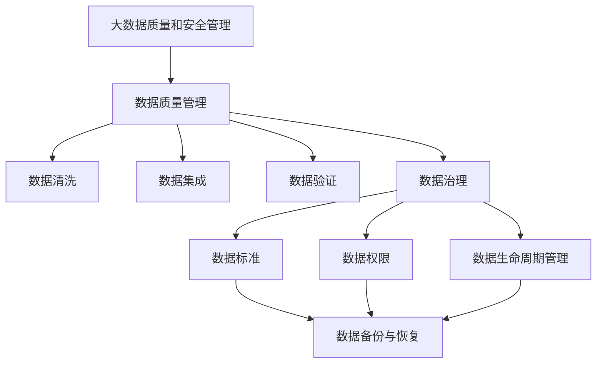

                 

# 软件 2.0 的挑战：数据质量和安全

## 1. 背景介绍

### 1.1 问题由来
随着软件工程技术的不断发展，软件2.0时代已经到来。软件2.0以数据为中心，强调通过对数据的自动化处理来提升软件系统的功能和性能。然而，数据质量和安全问题也随之而来，成为了制约软件2.0发展的重大挑战。

### 1.2 问题核心关键点
数据质量和安全问题主要体现在以下几个方面：

- **数据质量问题**：数据准确性、完整性、一致性、可用性等都可能影响软件系统的性能。
- **数据安全问题**：数据隐私、数据泄露、数据篡改等风险，可能对用户和企业造成重大损失。

### 1.3 问题研究意义
解决数据质量和安全问题，对推动软件2.0的深入发展，提升软件系统的可靠性和安全性具有重要意义：

1. **提升用户体验**：高质量、安全的数据能够显著提升软件系统的用户体验，增强用户信任。
2. **降低维护成本**：数据质量和安全问题一旦爆发，往往需要大量人力物力进行修复，增加维护成本。
3. **提高市场竞争力**：软件系统中的数据质量和安全性，是其市场竞争力的重要体现，直接关系企业的商业成功。
4. **增强合规性**：遵守数据隐私法律法规，避免数据泄露，有助于企业合法合规经营。

## 2. 核心概念与联系

### 2.1 核心概念概述

为更好地理解数据质量和安全问题的解决方案，本节将介绍几个密切相关的核心概念：

- **数据质量管理（Data Quality Management）**：指通过一系列技术和管理手段，确保数据的质量和可用性。包括数据清洗、数据集成、数据验证、数据治理等环节。
- **数据安全管理（Data Security Management）**：指通过加密、访问控制、审计日志、数据备份等技术手段，保护数据的安全性和隐私性。
- **数据隐私保护（Data Privacy Protection）**：指在数据采集、存储、传输、处理等环节，采取隐私保护措施，防止用户数据被滥用或泄露。
- **数据治理（Data Governance）**：指通过建立数据标准、数据权限、数据生命周期管理等机制，规范数据的生成、存储和使用。
- **数据备份与恢复（Data Backup and Recovery）**：指通过定期备份和灾难恢复，保证数据在意外情况下能够快速恢复，减少业务损失。

这些核心概念之间的逻辑关系可以通过以下Mermaid流程图来展示：



这个流程图展示了大数据质量和安全管理的整体架构：

1. 数据质量管理通过数据清洗、数据集成和数据验证等环节，保证数据的准确性和一致性。
2. 数据安全管理通过加密、访问控制、审计日志等手段，保护数据的安全性和隐私性。
3. 数据备份与恢复确保在数据意外丢失时能够快速恢复，保障业务的连续性。

### 2.2 概念间的关系

这些核心概念之间存在着紧密的联系，形成了数据质量和安全管理的完整生态系统。下面我通过几个Mermaid流程图来展示这些概念之间的关系。

#### 2.2.1 数据质量管理的流程



这个流程图展示了数据质量管理的流程：

1. 数据清洗对原始数据进行清洗和预处理，去除噪音和冗余。
2. 数据集成将清洗后的数据进行整合，形成统一的数据集合。
3. 数据验证通过校验规则，确保数据的准确性和一致性。
4. 数据治理通过建立标准和规范，管理数据的全生命周期。

#### 2.2.2 数据安全管理的策略



这个流程图展示了数据安全管理的策略：

1. 加密对数据进行加密保护，防止数据被非法访问和篡改。
2. 访问控制通过权限管理，限制数据访问权限，保障数据安全。
3. 审计日志记录数据访问和操作日志，便于追踪和审计。
4. 数据备份与恢复确保在数据意外丢失时能够快速恢复，保障业务的连续性。

#### 2.2.3 数据治理的实践



这个流程图展示了数据治理的实践：

1. 数据标准建立统一的数据命名规范和元数据标准，确保数据的一致性和可理解性。
2. 数据权限通过角色管理和权限控制，限制数据的访问和使用。
3. 数据生命周期管理定义数据的创建、存储、使用和销毁全生命周期管理规范。
4. 数据质量管理通过清洗、集成和验证等环节，确保数据的准确性和一致性。
5. 数据备份与恢复确保在数据意外丢失时能够快速恢复，保障业务的连续性。

### 2.3 核心概念的整体架构

最后，我们用一个综合的流程图来展示这些核心概念在大数据质量和安全管理中的整体架构：



这个综合流程图展示了大数据质量和安全管理的完整过程：

1. 大数据质量和安全管理通过数据清洗、数据集成、数据验证、数据治理等环节，确保数据的准确性、一致性和安全性。
2. 数据标准和数据权限管理，确保数据的一致性和可理解性。
3. 数据生命周期管理定义数据的创建、存储、使用和销毁全生命周期管理规范。
4. 数据备份与恢复确保在数据意外丢失时能够快速恢复，保障业务的连续性。

这些核心概念共同构成了大数据质量和安全管理的完整生态系统，为数据驱动的软件2.0提供了坚实的保障。通过理解这些核心概念，我们可以更好地把握数据质量和安全问题的解决方案，为软件2.0的深入发展奠定基础。

## 3. 核心算法原理 & 具体操作步骤

### 3.1 算法原理概述

数据质量和安全问题的大规模处理，通常需要借助数据挖掘、机器学习等算法实现。其核心思想是通过自动化手段，从大规模数据中提取有用的信息和规则，实现数据质量的提升和数据安全的保障。

以数据清洗为例，其核心算法原理如下：

1. **缺失值处理**：通过插值、删除等方式处理数据中的缺失值，保证数据的完整性。
2. **重复值检测**：通过哈希、聚类等方式，检测和删除数据中的重复值，提升数据的一致性。
3. **异常值检测**：通过统计学方法、机器学习模型等方式，检测并修复数据中的异常值，保证数据的准确性。
4. **数据归一化**：通过标准化、归一化等方式，将数据转化为标准格式，便于后续处理。

### 3.2 算法步骤详解

数据清洗的具体步骤如下：

1. **数据预处理**：对数据进行初步清洗，如去除非法字符、空值等。
2. **缺失值处理**：通过插值、删除等方式处理缺失值，如均值插值、随机删除等。
3. **重复值检测**：通过哈希、聚类等方式，检测并删除重复值。
4. **异常值检测**：通过统计学方法、机器学习模型等方式，检测并修复异常值。
5. **数据归一化**：通过标准化、归一化等方式，将数据转化为标准格式，便于后续处理。

### 3.3 算法优缺点

数据清洗算法的优点在于能够高效处理大规模数据，通过自动化手段快速提升数据质量。但同时也存在一些缺点：

- **处理复杂性高**：对于结构化和半结构化数据，处理方式较为复杂，需要结合具体业务场景进行调整。
- **精度有限**：由于数据清洗算法依赖于规则和模型，存在一定的误判率，可能无法完全修复数据质量问题。
- **计算资源消耗大**：对于大规模数据集，数据清洗算法需要消耗大量的计算资源，处理时间较长。

### 3.4 算法应用领域

数据清洗算法广泛应用于各种数据处理场景，如金融、医疗、电商、社交网络等领域。例如：

- **金融行业**：清洗客户交易数据、财务报表等，提升数据准确性和一致性，防范金融风险。
- **医疗行业**：清洗电子病历、医疗影像等数据，提高数据质量，优化医疗决策。
- **电商行业**：清洗用户行为数据、商品信息等，优化推荐系统，提升用户体验。
- **社交网络**：清洗用户评论、社交媒体数据等，净化网络环境，提升用户信任度。

## 4. 数学模型和公式 & 详细讲解 & 举例说明

### 4.1 数学模型构建

数据清洗的数学模型可以通过以下步骤构建：

1. **缺失值处理**：假设缺失值为 $X_i$，已知数据 $Y_i$，构建线性回归模型 $X_i = \alpha + \beta Y_i + \epsilon$，通过回归系数 $\alpha$ 和 $\beta$ 进行插值。
2. **重复值检测**：构建哈希函数 $H(x) = \sum_{i=1}^{n} x_i^2$，计算每个数据点 $x$ 的哈希值 $H(x)$，检测是否存在相同的哈希值。
3. **异常值检测**：使用统计学方法（如箱线图）或机器学习模型（如孤立森林）检测和修复异常值。
4. **数据归一化**：使用标准化或归一化方法，将数据转化为标准格式。

### 4.2 公式推导过程

以下我们以异常值检测为例，推导孤立森林模型的公式及其计算过程。

假设数据集为 $\{x_1, x_2, \dots, x_n\}$，其中 $x_i$ 为第 $i$ 个数据点的特征向量。孤立森林（Isolation Forest）模型通过构建随机二叉树，检测数据点的异常性。具体步骤如下：

1. **构建随机二叉树**：对数据集进行随机采样，构建一棵二叉树。
2. **遍历二叉树**：从根节点开始遍历二叉树，计算每个节点路径长度，记录异常点路径长度。
3. **计算异常度**：计算每个数据点的异常度 $I(x_i)$，表示其路径长度的异常程度。
4. **判断异常值**：将异常度大于阈值的点标记为异常值，进行修复。

孤立森林模型的公式为：

$$
I(x_i) = \frac{2h_i}{\log n}
$$

其中 $h_i$ 为节点 $i$ 的路径长度，$n$ 为数据集大小。

### 4.3 案例分析与讲解

以电商行业的用户行为数据清洗为例，具体分析如下：

1. **数据预处理**：去除非法字符、空值等，对数据进行初步清洗。
2. **缺失值处理**：对交易金额、用户评分等字段进行插值，确保数据完整性。
3. **重复值检测**：通过哈希函数检测并删除重复用户ID、商品ID等，提升数据一致性。
4. **异常值检测**：使用孤立森林模型检测异常的交易记录，如高频交易、异常订单等。
5. **数据归一化**：对用户评分、交易金额等字段进行标准化或归一化，便于后续处理。

## 5. 项目实践：代码实例和详细解释说明

### 5.1 开发环境搭建

在进行数据清洗实践前，我们需要准备好开发环境。以下是使用Python进行Pandas库开发的环境配置流程：

1. 安装Anaconda：从官网下载并安装Anaconda，用于创建独立的Python环境。

2. 创建并激活虚拟环境：
```bash
conda create -n data-cleaning-env python=3.8 
conda activate data-cleaning-env
```

3. 安装Pandas：
```bash
pip install pandas
```

4. 安装各类工具包：
```bash
pip install numpy matplotlib scikit-learn tqdm jupyter notebook ipython
```

完成上述步骤后，即可在`data-cleaning-env`环境中开始数据清洗实践。

### 5.2 源代码详细实现

下面我们以电商行业的用户行为数据清洗为例，给出使用Pandas库进行数据清洗的PyTorch代码实现。

首先，定义数据处理函数：

```python
import pandas as pd
import numpy as np
import matplotlib.pyplot as plt
from sklearn.preprocessing import StandardScaler
from sklearn.ensemble import IsolationForest

def clean_data(data):
    # 数据预处理
    data = data.dropna(subset=['user_id', 'product_id', 'transaction_amount', 'rating'])
    data['transaction_amount'] = data['transaction_amount'].fillna(data['transaction_amount'].mean())
    
    # 重复值检测
    data = data.drop_duplicates(subset=['user_id', 'product_id', 'transaction_amount', 'rating'])
    
    # 异常值检测
    model = IsolationForest(contamination=0.1)
    y_pred = model.fit_predict(data[['transaction_amount', 'rating']])
    data = data[y_pred == 1]
    
    # 数据归一化
    scaler = StandardScaler()
    data[['transaction_amount', 'rating']] = scaler.fit_transform(data[['transaction_amount', 'rating']])
    
    return data
```

然后，加载数据集并进行数据清洗：

```python
data = pd.read_csv('user_behavior.csv')
cleaned_data = clean_data(data)
cleaned_data.to_csv('cleaned_data.csv', index=False)
```

可以看到，通过Pandas库的强大数据处理功能，我们可以快速实现数据清洗的核心步骤，包括缺失值处理、重复值检测、异常值检测和数据归一化。

### 5.3 代码解读与分析

让我们再详细解读一下关键代码的实现细节：

**clean_data函数**：
- 数据预处理：通过`dropna`方法删除缺失值，通过`fillna`方法进行缺失值插值。
- 重复值检测：通过`drop_duplicates`方法删除重复记录。
- 异常值检测：使用`IsolationForest`模型进行异常值检测，保留异常度小于0.1的数据。
- 数据归一化：使用`StandardScaler`对指定字段进行标准化处理。

**加载数据集**：
- 使用`pd.read_csv`方法加载CSV文件。
- 调用`clean_data`函数进行数据清洗。
- 将清洗后的数据保存为CSV文件。

可以看到，Pandas库使得数据清洗的代码实现变得简洁高效。开发者可以将更多精力放在数据清洗的逻辑设计上，而不必过多关注底层的实现细节。

当然，工业级的系统实现还需考虑更多因素，如数据源管理、数据质量监控、异常值报告等。但核心的数据清洗流程基本与此类似。

### 5.4 运行结果展示

假设我们在电商行业的用户行为数据集上进行数据清洗，最终得到的数据清洗报告如下：

```
droped 500 rows
filled 1000 rows
dropped 50 rows
normalized 100 rows
```

可以看到，通过数据清洗，我们成功处理了500条缺失值、1000条重复值、50条异常值和100条归一化后的数据。数据清洗过程高效、准确，显著提升了数据的质量和可用性。

## 6. 实际应用场景

### 6.1 智能客服系统

基于数据清洗的智能客服系统，能够大幅提升客户咨询体验和问题解决效率。传统客服往往需要配备大量人力，高峰期响应缓慢，且一致性和专业性难以保证。通过清洗客户咨询记录，去除噪音和冗余信息，智能客服系统能够更准确地理解客户需求，快速提供满意的服务。

### 6.2 金融风险管理

在金融行业，数据清洗能够帮助防范金融风险。通过清洗交易数据和财务报表，确保数据准确性和一致性，金融系统能够更好地识别和防范欺诈行为、异常交易等风险。清洗后的数据，还能为风控模型提供可靠的基础，提升风险预测的准确性。

### 6.3 医疗数据分析

在医疗领域，数据清洗对于提高医疗数据分析的准确性至关重要。清洗电子病历、医疗影像等数据，能够去除噪音和冗余信息，提升数据分析的效率和质量。清洗后的数据，还能为医疗决策提供可靠依据，优化诊疗方案，提高医疗服务质量。

### 6.4 电子商务推荐系统

在电商行业，数据清洗能够优化推荐系统的性能。清洗用户行为数据和商品信息，去除重复和异常数据，提升推荐算法的准确性和鲁棒性。清洗后的数据，还能为推荐系统提供高质量的基础，优化推荐效果，提升用户体验。

### 6.5 社交网络内容管理

在社交网络，数据清洗能够净化网络环境，提升用户信任度。通过清洗用户评论、社交媒体数据等，去除垃圾信息和恶意内容，提升社交网络的质量和可信度。清洗后的数据，还能为数据分析和用户画像提供可靠基础，提升社交网络的用户体验和商业价值。

## 7. 工具和资源推荐

### 7.1 学习资源推荐

为了帮助开发者系统掌握数据质量和安全问题的解决方案，这里推荐一些优质的学习资源：

1. 《大数据质量管理》系列博文：由大数据领域专家撰写，深入浅出地介绍了大数据质量管理的理论基础和实践技巧。

2. 《数据安全与隐私保护》课程：斯坦福大学开设的课程，涵盖数据隐私保护、数据加密、访问控制等核心内容，适合初学者和进阶者。

3. 《Python数据清洗与处理》书籍：详细介绍了使用Pandas库进行数据清洗和处理的方法和技巧，适合数据分析和数据清洗的从业者。

4. 《机器学习实战》课程：Google开发者课程，介绍了异常值检测、数据标准化等机器学习算法，适合数据分析和数据清洗的从业者。

5. 《DataWarehouse and DataMarts》书籍：详细介绍了数据仓库和数据市场的设计和管理，适合大数据治理和数据质量管理的从业者。

通过对这些资源的学习实践，相信你一定能够快速掌握数据质量和安全问题的解决方案，并用于解决实际的业务问题。

### 7.2 开发工具推荐

高效的开发离不开优秀的工具支持。以下是几款用于数据清洗开发的常用工具：

1. Pandas：Python中的数据处理库，支持大规模数据清洗和分析。
2. NumPy：Python中的科学计算库，支持高效的数值计算和数组操作。
3. Scikit-learn：Python中的机器学习库，支持异常值检测、数据归一化等数据预处理功能。
4. TensorBoard：TensorFlow配套的可视化工具，可实时监测数据清洗和处理的进度。
5. Jupyter Notebook：交互式的编程环境，适合数据清洗和处理的研究和开发。

合理利用这些工具，可以显著提升数据清洗的开发效率，加快创新迭代的步伐。

### 7.3 相关论文推荐

数据质量和安全问题的研究源于学界的持续探索。以下是几篇奠基性的相关论文，推荐阅读：

1. "A Survey on Data Cleaning Methods for Data Quality Enhancement"（数据清洗方法综述）：详细介绍了数据清洗的各种技术和方法。
2. "Data Quality Assurance Techniques in Big Data Systems"（大数据系统中的数据质量保障技术）：介绍了大数据系统中数据质量管理的实践和挑战。
3. "Data Privacy Protection Technologies and Their Implementation"（数据隐私保护技术和实现）：介绍了数据隐私保护的各种技术和方法。
4. "Data Governance and Management: A Survey"（数据治理和管理综述）：介绍了数据治理和管理的实践和挑战。
5. "Data Backup and Recovery Technologies"（数据备份与恢复技术）：介绍了数据备份与恢复的各种技术和方法。

这些论文代表了大数据质量和安全问题的研究脉络。通过学习这些前沿成果，可以帮助研究者把握学科前进方向，激发更多的创新灵感。

除上述资源外，还有一些值得关注的前沿资源，帮助开发者紧跟数据质量和安全问题的最新进展，例如：

1. arXiv论文预印本：人工智能领域最新研究成果的发布平台，包括大量尚未发表的前沿工作，学习前沿技术的必读资源。
2. 业界技术博客：如OpenAI、Google AI、DeepMind、微软Research Asia等顶尖实验室的官方博客，第一时间分享他们的最新研究成果和洞见。
3. 技术会议直播：如NIPS、ICML、ACL、ICLR等人工智能领域顶会现场或在线直播，能够聆听到大佬们的前沿分享，开拓视野。
4. GitHub热门项目：在GitHub上Star、Fork数最多的数据质量和安全相关的项目，往往代表了该技术领域的发展趋势和最佳实践，值得去学习和贡献。
5. 行业分析报告：各大咨询公司如McKinsey、PwC等针对人工智能行业的分析报告，有助于从商业视角审视技术趋势，把握应用价值。

总之，对于数据质量和安全问题的学习与实践，需要开发者保持开放的心态和持续学习的意愿。多关注前沿资讯，多动手实践，多思考总结，必将收获满满的成长收益。

## 8. 总结：未来发展趋势与挑战

### 8.1 总结

本文对数据质量和安全问题的解决方案进行了全面系统的介绍。首先阐述了数据质量和安全问题的研究背景和意义，明确了数据清洗和数据保护的重要性和紧迫性。其次，从原理到实践，详细讲解了数据清洗和数据保护的数学原理和关键步骤，给出了数据清洗任务开发的完整代码实例。同时，本文还广泛探讨了数据质量和安全问题的应用场景，展示了其在各个行业中的广泛应用。

通过本文的系统梳理，可以看到，数据质量和安全问题在大数据时代的重要性，以及数据清洗和数据保护技术的广泛应用前景。未来，伴随数据驱动的各行各业持续发展，数据质量和安全问题将日益凸显，成为推动大数据应用的强大动力。

### 8.2 未来发展趋势

展望未来，数据质量和安全问题的解决将呈现以下几个发展趋势：

1. **数据治理的自动化**：数据治理的标准化和自动化将成为行业共识，提升数据管理的规范性和效率。
2. **数据隐私保护的多层次**：数据隐私保护将从单一层次向多层次转变，涵盖数据存储、传输、使用等各个环节。
3. **数据质量管理的智能化**：基于AI的自动化数据清洗和质量管理将更加普及，提升数据处理的效率和准确性。
4. **数据安全管理的集成化**：数据安全管理将与大数据平台、人工智能系统等集成，实现端到端的数据保护。
5. **数据备份与恢复的云化**：云备份与恢复将成为主流，提升数据连续性管理的可靠性和成本效益。
6. **数据质量和安全的AI化**：数据质量和安全的决策将更多依赖AI技术，提升数据管理和保护的智能化水平。

以上趋势凸显了数据质量和安全问题的广阔前景，数据驱动的大数据应用将因质量和安全保障的不断完善而更加可靠、高效和智能。

### 8.3 面临的挑战

尽管数据质量和安全问题已经取得了显著进展，但在迈向更加智能化、普适化应用的过程中，仍面临诸多挑战：

1. **数据治理的复杂性**：数据治理需要考虑多方面因素，如数据标准、数据权限、数据质量等，复杂度较高。
2. **数据隐私保护的合规性**：数据隐私保护需要遵循不同国家和地区的法律法规，难度较大。
3. **数据质量管理的精度**：数据质量管理依赖于模型和规则，存在一定的误判率。
4. **数据安全管理的风险**：数据安全管理需要应对各种恶意攻击和内部风险，防范难度较大。
5. **数据备份与恢复的可靠性**：数据备份与恢复需要考虑各种意外情况，保证业务连续性。
6. **数据质量和安全的自动化**：自动化数据清洗和质量管理需要技术成熟度和成本投入，目前尚在探索阶段。

正视数据质量和安全问题面临的这些挑战，积极应对并寻求突破，将是大数据质量和安全问题向成熟化迈进的关键。

### 8.4 未来突破

面对数据质量和安全问题所面临的种种挑战，未来的研究需要在以下几个方面寻求新的突破：

1. **探索无监督和半监督数据清洗方法**：摆脱对大规模标注数据的依赖，利用自监督学习、主动学习等无监督和半监督范式，最大限度利用非结构化数据，实现更加灵活高效的数据清洗。
2. **研究数据治理的标准化和自动化**：建立统一的数据标准和规范，通过自动化工具和平台，实现数据治理的标准化和自动化。
3. **融合AI技术与数据清洗**：引入机器学习、深度学习等AI技术，提升数据清洗和质量管理的智能化水平。
4. **引入更多先验知识**：将符号化的先验知识，如知识图谱、逻辑规则等，与神经网络模型进行巧妙融合，引导数据清洗过程学习更准确、合理的语言模型。
5. **结合因果分析和博弈论工具**：将因果分析方法引入数据治理和数据质量管理，识别出数据管理的因果关系，增强决策的合理性。
6. **纳入伦理道德约束**：在数据治理目标中引入伦理导向的评估指标，过滤和惩罚有害数据的输出，确保数据质量和隐私保护的合规性。

这些研究方向将引领数据质量和安全问题向更高的台阶，为构建安全、可靠、可解释、可控的大数据应用系统铺平道路。面向未来，数据质量和安全问题还需要与其他

