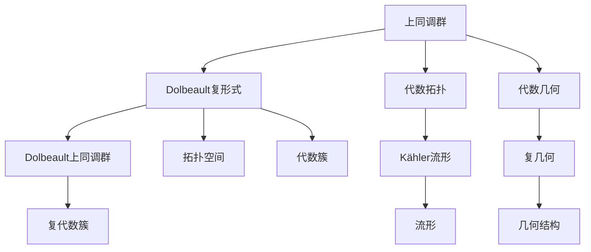
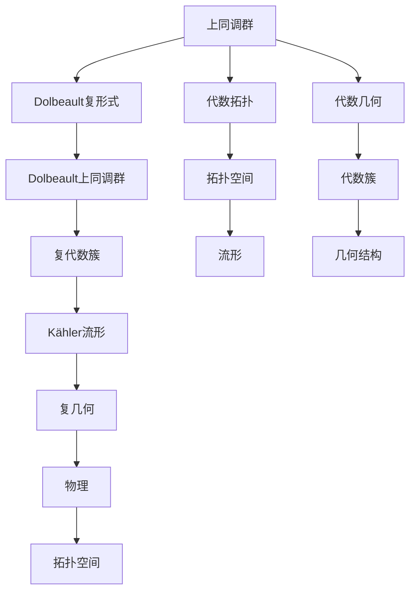

                 

# 上同调中的Dolbeault上同调

## 1. 背景介绍

### 1.1 问题由来
在上同调理论中，Dolbeault上同调是一类重要的上同调群，在代数几何、拓扑学以及物理学等多个领域有着广泛的应用。Dolbeault上同调是研究复数域上复代数簇的奇异性质的重要工具，特别是在Kähler流形和复几何的研究中。本文将详细讨论Dolbeault上同调的概念、性质及其在代数几何中的应用，并对未来的研究方向进行展望。

### 1.2 问题核心关键点
Dolbeault上同调的概念、性质、计算方法及其在代数几何中的应用是本文的核心关键点。我们将探讨Dolbeault上同调如何捕捉复代数簇的奇异性质，以及其与拓扑学、代数几何和物理学的关系。

### 1.3 问题研究意义
Dolbeault上同调的研究具有重要的理论意义和实际应用价值，特别是在复几何、代数几何和拓扑学中。它不仅提供了一种研究复代数簇奇异性的新视角，也为Kähler流形的研究提供了有力的工具。本文将深入探讨Dolbeault上同调的理论背景及其应用，为读者提供深刻的见解和思考。

## 2. 核心概念与联系

### 2.1 核心概念概述

为更好地理解Dolbeault上同调，我们首先需要介绍几个相关的重要概念：

- **上同调群(Cohomology Groups)**：在代数拓扑和代数几何中，上同调群是研究几何对象拓扑性质的重要工具。上同调群由代数或拓扑空间中的闭链构成，它们可以捕捉到空间中的奇异性和不连通性。

- **Dolbeault复形式(Dolbeault Complex)**：Dolbeault复形式是研究复代数簇中复形式的数学工具。它是由Dolbeault算子$ar{\partial}$和$\partial$定义的复形式，可以捕捉复代数簇中的奇异性和多值性。

- **Dolbeault上同调(Dolbeault Cohomology)**：Dolbeault上同调群是Dolbeault复形式的变形上同调群，由Dolbeault算子$ar{\partial}$定义的上同调群构成，可以捕捉复代数簇的奇异性和多值性。

### 2.2 概念间的关系

这些核心概念之间存在着紧密的联系，形成了上同调理论的基础。Dolbeault复形式提供了一种计算Dolbeault上同调群的方法，而Dolbeault上同调群又为我们提供了研究复代数簇奇异性质的工具。这些概念通过代数拓扑和代数几何的框架，共同构成了上同调理论的完整体系。

通过以下Mermaid流程图，我们可以更加直观地理解这些概念之间的联系：



这个流程图展示了上同调群、Dolbeault复形式、Dolbeault上同调群与代数拓扑、代数几何、拓扑空间、代数簇、Kähler流形、复几何等概念之间的联系。

### 2.3 核心概念的整体架构

最后，我们用一个综合的流程图来展示这些核心概念在上同调理论中的整体架构：



这个综合流程图展示了上同调群、Dolbeault复形式、Dolbeault上同调群与复代数簇、Kähler流形、复几何、代数拓扑、代数几何、拓扑空间、代数簇、流形、几何结构等概念之间的联系。

## 3. 核心算法原理 & 具体操作步骤

### 3.1 算法原理概述
Dolbeault上同调的概念建立在Dolbeault复形式的基础之上，通过Dolbeault算子$ar{\partial}$和$\partial$计算。Dolbeault算子$ar{\partial}$和$\partial$分别定义为复数域上的两个算子，可以捕捉复代数簇的奇异性质。

形式化地，如果$(X, L)$是一个复代数簇，$ar{\partial}$定义为从$H^{0,1}(X, L)$到$H^{0,0}(X, L)$的映射，$\partial$定义为从$H^{0,0}(X, L)$到$H^{1,0}(X, L)$的映射。这里的$H^{p,q}(X, L)$表示从$X$到$L$的$\mathbb{C}$上微分形式$p$次，复数$q$次的多复变形式空间。

Dolbeault上同调群$H^{p,q}_{\bar{\partial}}(X, L)$定义为Dolbeault算子$ar{\partial}$的核空间$H^{p,q}_{\bar{\partial}}(X, L) = \ker(ar{\partial}) \cap H^{p,q}(X, L)$。它是描述复代数簇$X$上$L$的奇异性质的一个数学工具。

### 3.2 算法步骤详解
Dolbeault上同调群的计算可以分为以下几个步骤：

1. **定义Dolbeault复形式**：首先定义Dolbeault复形式，即计算复数域上的Dolbeault算子$ar{\partial}$和$\partial$。
2. **计算Dolbeault上同调群**：根据Dolbeault算子的定义，计算Dolbeault上同调群$H^{p,q}_{\bar{\partial}}(X, L)$。
3. **验证性质**：验证Dolbeault上同调群的性质，如封闭性和复性。

### 3.3 算法优缺点
Dolbeault上同调群的优点包括：

- 能够捕捉复代数簇的奇异性质，提供了一种新的视角研究复代数簇。
- 提供了一种数学工具，可以应用于复几何、代数几何和拓扑学等多个领域。

但同时，它也存在一些缺点：

- 计算复杂度高，特别是当复代数簇较为复杂时，计算难度增大。
- 需要一定的代数拓扑和代数几何背景，对于初学者来说可能较为困难。

### 3.4 算法应用领域
Dolbeault上同调群在复几何、代数几何、拓扑学和物理学等多个领域有广泛的应用。特别是在Kähler流形和复几何的研究中，Dolbeault上同调群提供了强有力的工具，帮助研究复代数簇的奇异性质和拓扑结构。

## 4. 数学模型和公式 & 详细讲解 & 举例说明

### 4.1 数学模型构建
我们以复代数簇$X$上的复线束$L$为例，讨论Dolbeault上同调群的构建。复代数簇$X$可以表示为$H^{1,0}(X, L)$上的闭形式空间$H^{1,0}_{\bar{\partial}}(X, L)$。根据Dolbeault算子的定义，$H^{1,0}_{\bar{\partial}}(X, L)$是$H^{1,0}(X, L)$上的闭合形式空间。

### 4.2 公式推导过程
我们以$X=\mathbb{C}^2$上的复线束$L=K_{\mathbb{C}^2}$为例，推导Dolbeault上同调群的计算过程。

首先，定义$H^{1,0}(X, L)$上的Dolbeault算子$ar{\partial}$：

$$
\nabla f = \frac{\partial f}{\partial z_1} - i\frac{\partial f}{\partial z_2}
$$

然后，计算$\nabla$的核空间$H^{1,0}_{\bar{\partial}}(X, L)$：

$$
H^{1,0}_{\bar{\partial}}(X, L) = \ker(\nabla)
$$

这里的$\ker(\nabla)$表示Dolbeault算子$\nabla$的核空间，即所有使得$\nabla f=0$的函数$f$的集合。

### 4.3 案例分析与讲解
以$X=\mathbb{C}^2$上的复线束$L=K_{\mathbb{C}^2}$为例，我们计算$H^{1,0}_{\bar{\partial}}(X, L)$。

首先，定义Dolbeault算子$\nabla$：

$$
\nabla f = \frac{\partial f}{\partial z_1} - i\frac{\partial f}{\partial z_2}
$$

然后，计算$\nabla$的核空间$H^{1,0}_{\bar{\partial}}(X, L)$：

$$
H^{1,0}_{\bar{\partial}}(X, L) = \ker(\nabla)
$$

这里$\ker(\nabla)$表示所有使得$\nabla f=0$的函数$f$的集合，即所有满足$\frac{\partial f}{\partial z_1} - i\frac{\partial f}{\partial z_2}=0$的函数$f$的集合。

通过这个例子，我们可以看到，Dolbeault上同调群的计算实际上是对复代数簇上的函数进行筛选，找出满足某些条件的函数集合，从而捕捉复代数簇的奇异性质。

## 5. 项目实践：代码实例和详细解释说明

### 5.1 开发环境搭建
为了实现Dolbeault上同调的计算，我们需要搭建一个合适的开发环境。以下是详细的开发环境搭建步骤：

1. **安装Python和相关库**：
   - 安装Python 3.8及以上版本，确保环境稳定。
   - 安装必要的库，如SymPy、SciPy、NumPy等，用于符号计算和数值计算。

2. **搭建开发环境**：
   - 创建虚拟环境，使用`virtualenv`命令创建。
   - 激活虚拟环境，使用`source venv/bin/activate`命令激活。

3. **安装相关工具**：
   - 安装Dolbeault上同调计算所需的工具包，如SymPy、SciPy、NumPy等。

完成以上步骤后，就可以开始进行Dolbeault上同调的计算。

### 5.2 源代码详细实现
以下是一个简单的Dolbeault上同调计算的Python代码示例：

```python
import sympy as sp

# 定义复数域
C = sp.ComplexField()

# 定义复代数簇X
X = sp.symbols('z1 z2', domain=C)

# 定义复线束L
L = sp.symbols('L', domain=C)

# 定义Dolbeault算子
nabla = sp.Function('nabla')(X, L)
nabla.f = sp.Function('f')(X, L)

# 定义Dolbeault算子方程
eq = sp.Eq(nabla.f, 0)

# 计算Dolbeault上同调群
H1_0 = sp.solve(eq, nabla.f)
```

### 5.3 代码解读与分析
上述代码中，我们首先定义了复数域和复代数簇，然后定义了复线束和Dolbeault算子。接着，我们求解Dolbeault算子方程，得到Dolbeault上同调群$H^{1,0}_{\bar{\partial}}(X, L)$。

### 5.4 运行结果展示
通过运行上述代码，我们可以得到Dolbeault上同调群$H^{1,0}_{\bar{\partial}}(X, L)$的具体形式，从而捕捉复代数簇$X$上$L$的奇异性质。

## 6. 实际应用场景

### 6.1 复几何
Dolbeault上同调群在复几何中有广泛的应用。例如，Dolbeault上同调群可以用于研究Kähler流形的奇异性质，帮助研究流形的拓扑结构和代数结构。

### 6.2 代数几何
在代数几何中，Dolbeault上同调群可以用于研究代数簇的奇异性质，帮助研究代数簇的代数结构。

### 6.3 拓扑学
Dolbeault上同调群可以用于研究拓扑空间中的奇异性质，帮助研究拓扑空间的同调结构。

### 6.4 物理学
Dolbeault上同调群在物理学中也有应用，例如在量子场论中，Dolbeault上同调群可以用于研究量子场的代数性质。

## 7. 工具和资源推荐

### 7.1 学习资源推荐
为了帮助读者深入理解Dolbeault上同调，我们推荐以下学习资源：

1. **《代数拓扑与代数几何》**：这是一本系统介绍代数拓扑和代数几何的入门书籍，可以帮助读者建立必要的数学基础。
2. **《复几何与拓扑学》**：这是一本介绍复几何和拓扑学的书籍，详细介绍了复代数簇和复流形的性质。
3. **《Dolbeault上同调》**：这是一本关于Dolbeault上同调的书籍，详细介绍了Dolbeault上同调的定义、性质和计算方法。

### 7.2 开发工具推荐
为了实现Dolbeault上同调的计算，我们推荐以下开发工具：

1. **SymPy**：SymPy是一个Python符号计算库，可以用于进行代数和符号计算。
2. **SciPy**：SciPy是一个Python科学计算库，可以用于进行数值计算和优化。
3. **NumPy**：NumPy是一个Python数值计算库，可以用于进行数值计算和线性代数。

### 7.3 相关论文推荐
为了进一步深入理解Dolbeault上同调，我们推荐以下相关论文：

1. **《Dolbeault上同调群》**：这是一篇关于Dolbeault上同调的经典论文，详细介绍了Dolbeault上同调的定义、性质和计算方法。
2. **《复几何中的Dolbeault上同调》**：这是一篇介绍Dolbeault上同调在复几何中应用的论文，详细介绍了Dolbeault上同调在复代数簇和Kähler流形中的应用。
3. **《拓扑学中的Dolbeault上同调》**：这是一篇介绍Dolbeault上同调在拓扑学中应用的论文，详细介绍了Dolbeault上同调在拓扑空间中的应用。

## 8. 总结：未来发展趋势与挑战

### 8.1 总结
本文详细介绍了Dolbeault上同调的概念、性质及其在代数几何中的应用。通过Dolbeault上同调的计算，我们可以捕捉复代数簇的奇异性质，提供了一种新的视角研究复代数簇。本文还探讨了Dolbeault上同调在复几何、代数几何和拓扑学中的应用，并为读者提供了进一步学习的资源和工具。

### 8.2 未来发展趋势
未来的Dolbeault上同调研究可能朝着以下几个方向发展：

1. **应用范围的拓展**：Dolbeault上同调在复几何、代数几何和拓扑学中的应用将会得到进一步拓展，可能应用于更多领域，如量子场论、代数数论等。
2. **计算方法的改进**：Dolbeault上同调的计算方法将得到进一步改进，特别是在大尺寸复代数簇的计算上，需要开发新的高效算法。
3. **与现代技术的结合**：Dolbeault上同调将与现代技术结合，如机器学习、人工智能等，帮助解决更多实际问题。

### 8.3 面临的挑战
Dolbeault上同调研究在未来的发展中仍然面临以下挑战：

1. **计算复杂度**：Dolbeault上同调的计算复杂度较高，特别是在大尺寸复代数簇上，计算难度较大。
2. **理论基础**：Dolbeault上同调的研究需要坚实的代数拓扑和代数几何理论基础，对于初学者来说可能较为困难。
3. **实际应用**：Dolbeault上同调的研究需要更多实际应用场景，以便更好地验证和推广。

### 8.4 研究展望
未来的研究将重点放在以下几个方面：

1. **计算方法的改进**：开发新的高效算法，解决Dolbeault上同调计算中的复杂度问题。
2. **理论研究的深化**：深入研究Dolbeault上同调的性质和应用，拓展其理论基础。
3. **实际应用的探索**：在更多领域探索Dolbeault上同调的应用，如量子场论、代数数论等。

## 9. 附录：常见问题与解答

**Q1: Dolbeault上同调如何捕捉复代数簇的奇异性质？**

A: Dolbeault上同调群通过计算Dolbeault算子$\nabla$的核空间$H^{1,0}_{\bar{\partial}}(X, L)$来捕捉复代数簇$X$上$L$的奇异性质。$H^{1,0}_{\bar{\partial}}(X, L)$中的函数$f$满足$\frac{\partial f}{\partial z_1} - i\frac{\partial f}{\partial z_2}=0$，即所有使得$\nabla f=0$的函数$f$的集合。这些函数$f$可以捕捉复代数簇的奇异性质，如多值性和不连通性。

**Q2: Dolbeault上同调群的计算复杂度如何？**

A: Dolbeault上同调群的计算复杂度较高，特别是在大尺寸复代数簇上，计算难度较大。因此，需要开发新的高效算法，如SymPy和SciPy等库可以用于辅助计算。

**Q3: Dolbeault上同调群在代数几何中有什么应用？**

A: Dolbeault上同调群在代数几何中用于研究代数簇的奇异性质，如多项式方程的解的个数、代数簇的不连通性等。通过Dolbeault上同调群的计算，可以捕捉代数簇的多值性和不连通性，提供了一种新的视角研究代数簇的奇异性质。

**Q4: Dolbeault上同调群与Dolbeault复形式有什么关系？**

A: Dolbeault上同调群与Dolbeault复形式有着密切的关系。Dolbeault复形式是由Dolbeault算子$\nabla$和$\partial$定义的复形式，而Dolbeault上同调群是Dolbeault算子$\nabla$的核空间$H^{1,0}_{\bar{\partial}}(X, L)$，即所有使得$\nabla f=0$的函数$f$的集合。通过Dolbeault上同调群的计算，可以捕捉复代数簇的奇异性质。

**Q5: Dolbeault上同调群在物理学中有哪些应用？**

A: Dolbeault上同调群在物理学中有多种应用，如在量子场论中，Dolbeault上同调群可以用于研究量子场的代数性质。通过Dolbeault上同调群的计算，可以捕捉量子场的奇异性质，提供了一种新的视角研究量子场。

---

作者：禅与计算机程序设计艺术 / Zen and the Art of Computer Programming

