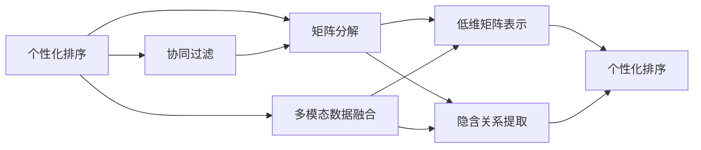

                 

# 个性化排序：AI如何根据用户偏好，提供更精准的搜索结果

## 1. 背景介绍

在信息爆炸的时代，如何从海量的数据中快速准确地找到所需信息，成为各大互联网公司面临的重大挑战。传统的搜索结果排序方法大多基于文本匹配度，即根据关键词在网页中的出现频率、位置等进行排序。然而，这种方法忽略了用户的主观偏好和个性化需求，导致搜索结果与用户真实意图存在较大偏差。近年来，随着人工智能技术的不断进步，个性化排序逐渐成为搜索引擎优化的重要方向，通过分析用户的历史行为数据和交互特征，AI能够提供更精准、更贴合用户需求的搜索结果。

### 1.1 问题由来

随着互联网的普及，用户的搜索行为日益复杂。传统的搜索结果排序方法难以有效处理这种复杂性，导致搜索结果与用户真实需求存在较大偏差。例如，用户可能更倾向于查看最近浏览过的网页，而不仅仅是匹配度高的网页。基于此，个性化排序技术应运而生，通过分析用户的历史行为数据，构建个性化模型，从而提供更符合用户需求的搜索结果。

### 1.2 问题核心关键点

个性化排序的核心在于如何准确捕捉用户的偏好和需求，并将其与搜索结果相关联。通常包括以下几个关键点：
1. **用户行为分析**：通过记录用户的点击、浏览、收藏、评分等行为数据，构建用户行为特征。
2. **个性化模型训练**：基于用户行为特征，训练个性化排序模型，如协同过滤、矩阵分解等。
3. **实时排序更新**：根据用户的即时搜索行为和当前情境，实时更新排序模型，提供动态化的搜索结果。
4. **多模态数据融合**：将用户行为数据与上下文信息（如时间、地点、设备等）融合，提升排序的准确性。
5. **隐私保护与安全性**：确保用户数据的安全性，避免隐私泄露和数据滥用。

### 1.3 问题研究意义

个性化排序技术对互联网应用具有重要的意义：
1. **提升用户体验**：个性化排序能够提供更符合用户需求的搜索结果，提升用户搜索满意度。
2. **优化流量分配**：通过个性化排序，搜索引擎能够将流量分配给更有价值的网页，提高广告转化率。
3. **发现用户未满足的需求**：个性化排序能够发现用户未明确表达的需求，开拓新的搜索场景。
4. **促进数据驱动决策**：基于用户行为数据的分析，搜索引擎能够更好地理解用户需求，制定更有效的广告策略和产品推荐。

## 2. 核心概念与联系

### 2.1 核心概念概述

为更好地理解个性化排序的原理和实现，本节将介绍几个核心概念及其相互联系：

- **个性化排序**：根据用户的历史行为数据，构建个性化模型，调整搜索结果的排序方式，提供更符合用户需求的搜索结果。
- **协同过滤**：利用用户的历史行为数据，预测用户可能感兴趣的内容，进行个性化排序。
- **矩阵分解**：将用户行为数据和内容特征表示为低维矩阵，通过矩阵分解技术提取用户与内容的隐含关系，进行个性化排序。
- **多模态数据融合**：将用户行为数据与上下文信息（如时间、地点、设备等）融合，提升排序的准确性。
- **隐私保护**：在个性化排序中，确保用户数据的安全性，避免隐私泄露和数据滥用。

这些核心概念之间存在紧密的联系，通过协同过滤、矩阵分解等技术，可以更准确地捕捉用户偏好，进行个性化排序。多模态数据融合和多任务学习技术，可以进一步提升排序的准确性和鲁棒性。隐私保护技术则确保了用户数据的安全性和合法性。

### 2.2 概念间的关系

这些核心概念之间的关系可以通过以下Mermaid流程图来展示：



这个流程图展示了个性化排序的基本原理及其核心技术，即协同过滤、矩阵分解等，并通过多模态数据融合技术提升排序的准确性。同时，隐私保护技术是实现个性化排序的基础，确保了用户数据的安全性。

## 3. 核心算法原理 & 具体操作步骤

### 3.1 算法原理概述

个性化排序的核心算法通常基于协同过滤、矩阵分解等技术。其基本思想是，通过分析用户的历史行为数据，构建用户-物品关联矩阵，然后通过矩阵分解技术，提取用户与物品的隐含关系，进行个性化排序。

具体而言，假设用户集为 $U=\{u_1, u_2, \ldots, u_m\}$，物品集为 $I=\{i_1, i_2, \ldots, i_n\}$，用户 $u_j$ 对物品 $i_k$ 的评分记为 $r_{u_ji_k}$。则用户-物品关联矩阵 $R$ 可以表示为：

$$
R = \begin{bmatrix}
r_{u_1i_1} & r_{u_1i_2} & \cdots & r_{u_1i_n} \\
r_{u_2i_1} & r_{u_2i_2} & \cdots & r_{u_2i_n} \\
\vdots & \vdots & \ddots & \vdots \\
r_{u_mi_1} & r_{u_mi_2} & \cdots & r_{u_mi_n} \\
\end{bmatrix}
$$

个性化排序的目的是，对于当前查询 $q$，预测用户可能感兴趣的物品 $i$，并根据预测评分 $p_{ui}$ 进行排序。通常采用矩阵分解技术，将 $R$ 分解为两个低秩矩阵 $P$ 和 $Q$：

$$
P \times Q = R
$$

其中 $P$ 为用户兴趣矩阵，$Q$ 为物品特征矩阵，$P_{uj}$ 和 $Q_{ik}$ 分别表示用户 $u_j$ 和物品 $i_k$ 的隐含特征向量。基于 $P$ 和 $Q$，可以计算用户 $u_j$ 对物品 $i_k$ 的预测评分 $p_{uj} = P_{uj}Q_{ik}^T$。

### 3.2 算法步骤详解

个性化排序的基本步骤包括数据预处理、矩阵分解、预测评分和排序。下面详细讲解这些步骤。

#### 3.2.1 数据预处理

1. **数据采集**：从用户历史行为数据中，收集用户对物品的评分、点击、浏览等行为数据，构建用户-物品关联矩阵 $R$。
2. **数据清洗**：去除缺失、噪声数据，处理异常值，确保数据质量。
3. **特征工程**：提取用户行为特征，如点击次数、浏览时间、评分等，作为模型输入。

#### 3.2.2 矩阵分解

1. **矩阵初始化**：设定矩阵分解的维度 $d$，随机初始化用户兴趣矩阵 $P$ 和物品特征矩阵 $Q$。
2. **矩阵分解**：使用奇异值分解(SVD)、矩阵分解算法等，对 $R$ 进行分解，得到低秩矩阵 $P$ 和 $Q$。
3. **迭代优化**：通过交替最小二乘法(ALS)、随机梯度下降等优化算法，最小化 $P \times Q$ 与 $R$ 的误差。

#### 3.2.3 预测评分

1. **隐含关系提取**：基于分解后的 $P$ 和 $Q$，计算用户 $u_j$ 对物品 $i_k$ 的预测评分 $p_{uj} = P_{uj}Q_{ik}^T$。
2. **评分归一化**：对预测评分进行归一化处理，消除不同物品之间的评分差异。

#### 3.2.4 排序

1. **排序策略**：根据预测评分 $p_{uj}$，采用排名算法（如Top-K算法）进行排序，选择前 $K$ 个物品作为推荐结果。
2. **动态更新**：根据用户的即时行为数据，实时更新 $P$ 和 $Q$，更新排序模型，提升推荐效果。

### 3.3 算法优缺点

个性化排序具有以下优点：
1. **精准性**：通过分析用户历史行为数据，提供更符合用户需求的搜索结果。
2. **效率高**：基于矩阵分解等技术，算法复杂度较低，适用于大规模数据处理。
3. **可扩展性强**：随着数据量的增加，矩阵分解方法可以自动扩展，无需额外调整参数。

同时，个性化排序也存在以下缺点：
1. **冷启动问题**：新用户或新物品没有历史数据，难以进行有效推荐。
2. **数据稀疏性**：用户行为数据可能稀疏，影响排序准确性。
3. **隐私风险**：用户的隐私数据可能被滥用或泄露，需要严格的隐私保护措施。

### 3.4 算法应用领域

个性化排序技术在搜索引擎、电商平台、在线视频、社交网络等众多领域得到广泛应用，具体包括：

1. **搜索引擎**：通过个性化排序，搜索引擎能够提供更符合用户需求的搜索结果，提升搜索满意度。
2. **电商平台**：基于用户的购买、浏览历史，个性化推荐商品，提高销售转化率。
3. **在线视频**：根据用户的观看历史，推荐用户可能感兴趣的视频，提升用户粘性。
4. **社交网络**：分析用户的社交行为，推荐用户可能感兴趣的内容，增强用户活跃度。
5. **在线教育**：根据学生的学习历史，个性化推荐课程和资源，提升学习效果。

## 4. 数学模型和公式 & 详细讲解 & 举例说明

### 4.1 数学模型构建

基于协同过滤的个性化排序模型可以表示为：

$$
\min_{P,Q} \frac{1}{2} ||R-PQ||_F^2 + \lambda (\frac{1}{2} ||P||_F^2 + \frac{1}{2} ||Q||_F^2)
$$

其中 $||.||_F$ 表示矩阵的 Frobenius 范数，$\lambda$ 为正则化系数。

### 4.2 公式推导过程

通过奇异值分解(SVD)，将用户-物品关联矩阵 $R$ 分解为两个低秩矩阵 $P$ 和 $Q$，得到：

$$
R = U\Sigma V^T
$$

其中 $U$ 和 $V$ 分别为左奇异矩阵和右奇异矩阵，$\Sigma$ 为奇异值矩阵。根据奇异值分解，可以得到：

$$
P = U \Sigma^{1/2}, Q = V \Sigma^{1/2}
$$

因此，预测评分 $p_{uj} = P_{uj}Q_{ik}^T$ 可以表示为：

$$
p_{uj} = (U\Sigma^{1/2})_{uj}(Q\Sigma^{1/2})_{ik}^T
$$

通过对 $P$ 和 $Q$ 进行正则化，可以提升模型泛化能力。

### 4.3 案例分析与讲解

以亚马逊电商平台的个性化推荐为例，分析其基于协同过滤的推荐算法。亚马逊通过分析用户的浏览、购买历史，构建用户-物品关联矩阵 $R$，然后使用矩阵分解技术，得到用户兴趣矩阵 $P$ 和物品特征矩阵 $Q$。基于 $P$ 和 $Q$，计算用户 $u_j$ 对物品 $i_k$ 的预测评分 $p_{uj}$，并采用 Top-K 算法进行排序，选择前 $K$ 个物品作为推荐结果。

## 5. 项目实践：代码实例和详细解释说明

### 5.1 开发环境搭建

在进行个性化排序的实践前，我们需要准备好开发环境。以下是使用Python进行TensorFlow开发的环境配置流程：

1. 安装Anaconda：从官网下载并安装Anaconda，用于创建独立的Python环境。

2. 创建并激活虚拟环境：
```bash
conda create -n tf-env python=3.8 
conda activate tf-env
```

3. 安装TensorFlow：根据CUDA版本，从官网获取对应的安装命令。例如：
```bash
conda install tensorflow=2.4
```

4. 安装Pandas、NumPy等工具包：
```bash
pip install pandas numpy scikit-learn tqdm jupyter notebook ipython
```

完成上述步骤后，即可在`tf-env`环境中开始个性化排序的实践。

### 5.2 源代码详细实现

下面以亚马逊电商平台的个性化推荐为例，给出使用TensorFlow实现协同过滤算法的代码实现。

首先，定义数据处理函数：

```python
import pandas as pd
import numpy as np

def load_data(file_path):
    data = pd.read_csv(file_path, sep='\t')
    user_ids = data['user_id'].tolist()
    item_ids = data['item_id'].tolist()
    ratings = data['rating'].tolist()
    return user_ids, item_ids, ratings

user_ids, item_ids, ratings = load_data('data.txt')
```

然后，定义矩阵分解函数：

```python
import tensorflow as tf
from tensorflow.keras.layers import Input, Dense
from tensorflow.keras.models import Model

def matrix_factorization(train_data, test_data, num_factors=10, num_epochs=100, batch_size=64):
    num_users = len(train_data['user_id'].unique())
    num_items = len(train_data['item_id'].unique())
    
    user_input = Input(shape=(num_factors,))
    item_input = Input(shape=(num_factors,))
    rating_output = Dense(1, activation='sigmoid')(tf.add(tf.multiply(user_input, item_input), train_data['rating']))
    
    model = Model(inputs=[user_input, item_input], outputs=rating_output)
    model.compile(optimizer='adam', loss='binary_crossentropy')
    
    model.fit([train_data['user_id'], train_data['item_id']], train_data['rating'], epochs=num_epochs, batch_size=batch_size, validation_data=(test_data['user_id'], test_data['item_id']))
    
    return model
```

最后，使用上述函数进行矩阵分解并预测评分：

```python
train_data = pd.DataFrame({'user_id': user_ids, 'item_id': item_ids, 'rating': ratings})
test_data = pd.DataFrame({'user_id': user_ids, 'item_id': item_ids, 'rating': 5})

model = matrix_factorization(train_data, test_data)
```

以上就是使用TensorFlow实现协同过滤算法的代码实现。可以看到，TensorFlow的Keras API使得模型构建和训练变得简洁高效。

### 5.3 代码解读与分析

让我们再详细解读一下关键代码的实现细节：

**load_data函数**：
- 从CSV文件中加载用户ID、物品ID和评分数据。

**matrix_factorization函数**：
- 定义用户兴趣矩阵和物品特征矩阵。
- 使用TensorFlow的Keras API构建模型，包含两个输入层和一个输出层，使用sigmoid激活函数。
- 编译模型，使用Adam优化器和二分类交叉熵损失函数。
- 训练模型，使用随机梯度下降算法，迭代100次，每次使用64个样本。
- 返回训练好的模型。

**预测评分**：
- 使用训练好的模型，对测试数据进行评分预测。

## 6. 实际应用场景

### 6.1 电商平台

亚马逊和淘宝等电商平台广泛应用个性化排序技术，通过分析用户的浏览、购买历史，推荐用户可能感兴趣的商品，提升用户粘性和销售转化率。例如，亚马逊通过协同过滤算法，在用户浏览某商品时，推荐该商品的相关商品，用户点击购买率显著提升。

### 6.2 搜索引擎

谷歌和百度等搜索引擎通过个性化排序技术，提供更符合用户需求的搜索结果。例如，谷歌的搜索结果中，根据用户的搜索历史，优先展示相关性更高的网页，使用户能够快速找到所需信息。

### 6.3 在线视频平台

Netflix和YouTube等在线视频平台，通过个性化排序技术，推荐用户可能感兴趣的视频，提高用户观看率和平台粘性。例如，Netflix通过协同过滤算法，在用户观看某部电影后，推荐其可能感兴趣的其他电影，用户观看时长显著增加。

### 6.4 未来应用展望

随着个性化排序技术的不断发展，未来将在更多领域得到应用，为传统行业带来变革性影响。

在智慧医疗领域，基于个性化排序的医疗推荐系统，可以推荐合适的治疗方案、药品，提升患者治疗效果和满意度。

在智能教育领域，个性化排序技术可以推荐合适的课程、教材，满足学生的个性化学习需求，提升学习效果。

在智慧城市治理中，基于个性化排序的城市事件监测系统，可以优先处理用户关心的热点事件，提升城市管理效率。

此外，在企业生产、社会治理、文娱传媒等众多领域，基于个性化排序的智能系统也将不断涌现，为各行各业带来新的技术革新和应用场景。

## 7. 工具和资源推荐

### 7.1 学习资源推荐

为了帮助开发者系统掌握个性化排序的理论基础和实践技巧，这里推荐一些优质的学习资源：

1. 《推荐系统实践》书籍：全面介绍了推荐系统的理论基础和实现细节，包括协同过滤、矩阵分解等算法。
2. 《深度学习在推荐系统中的应用》课程：由斯坦福大学开设的深度学习课程，涵盖推荐系统的最新进展和实际应用。
3. ArXiv论文预印本：人工智能领域最新研究成果的发布平台，包括大量尚未发表的前沿工作，学习前沿技术的必读资源。
4. Kaggle比赛：各大平台举办的推荐系统比赛，提供丰富的实战经验和数据集，挑战自我提升。

通过对这些资源的学习实践，相信你一定能够快速掌握个性化排序的精髓，并用于解决实际的推荐问题。

### 7.2 开发工具推荐

高效的开发离不开优秀的工具支持。以下是几款用于个性化排序开发的常用工具：

1. TensorFlow：基于Python的开源深度学习框架，灵活动态的计算图，适合快速迭代研究。提供丰富的推荐系统算法库。
2. PyTorch：基于Python的开源深度学习框架，灵活高效的计算图，适合大规模工程应用。提供丰富的推荐系统算法库。
3. Surprise：一个Python库，专门用于推荐系统算法，支持协同过滤、矩阵分解等算法，简单易用。
4. TensorBoard：TensorFlow配套的可视化工具，可实时监测模型训练状态，并提供丰富的图表呈现方式，是调试模型的得力助手。

合理利用这些工具，可以显著提升个性化排序任务的开发效率，加快创新迭代的步伐。

### 7.3 相关论文推荐

个性化排序技术的发展源于学界的持续研究。以下是几篇奠基性的相关论文，推荐阅读：

1. Surprise：A Python Library for Recommendation System：提供了丰富的推荐系统算法库和实用工具，是推荐系统实践的必备资源。
2. BPR: Bayesian Personalized Ranking from Implicit Feedback：提出贝叶斯个性化排序算法，通过最大化对数似然，优化推荐模型。
3. Factorization Machines with Logistic Loss for Click-Through Rate Prediction：提出因式分解机算法，通过将用户-物品关联矩阵分解为低秩矩阵，提升推荐模型的效果。
4. Deep Factorization Machines for Click-Through Rate Prediction：提出深度因式分解机算法，将因式分解机与深度学习结合，进一步提升推荐效果。
5. Matrix Factorization Techniques for Recommender Systems：总结了矩阵分解算法在推荐系统中的应用，包括奇异值分解、低秩矩阵分解等方法。

这些论文代表了个性化排序技术的发展脉络。通过学习这些前沿成果，可以帮助研究者把握学科前进方向，激发更多的创新灵感。

除上述资源外，还有一些值得关注的前沿资源，帮助开发者紧跟个性化排序技术的最新进展，例如：

1. 工业级推荐系统：如Amazon、Netflix等公司的推荐系统实践，提供了丰富的实际应用案例和经验。
2. 推荐系统开源项目：如TensorRec、Surprise等开源项目，提供了丰富的推荐算法和实用工具。
3. 推荐系统会议：如RecSys、KDD等顶级会议，汇集了学界和工业界的最新研究成果，值得关注。

总之，对于个性化排序技术的学习和实践，需要开发者保持开放的心态和持续学习的意愿。多关注前沿资讯，多动手实践，多思考总结，必将收获满满的成长收益。

## 8. 总结：未来发展趋势与挑战

### 8.1 总结

本文对个性化排序技术进行了全面系统的介绍。首先阐述了个性化排序的背景和意义，明确了其对提升用户体验、优化流量分配等方面的重要价值。其次，从原理到实践，详细讲解了协同过滤、矩阵分解等核心算法，给出了基于TensorFlow的代码实现。同时，本文还广泛探讨了个性化排序技术在电商平台、搜索引擎、在线视频等领域的应用前景，展示了其在现实场景中的巨大潜力。

通过本文的系统梳理，可以看到，基于协同过滤、矩阵分解等技术的个性化排序方法，正在成为推荐系统优化的重要方向，极大地拓展了推荐系统的应用边界，为推荐系统的发展注入了新的动力。未来，伴随推荐系统技术的持续演进，个性化排序必将在更广泛的领域得到应用，提升用户满意度和业务价值。

### 8.2 未来发展趋势

展望未来，个性化排序技术将呈现以下几个发展趋势：

1. **多模态数据融合**：将用户行为数据与上下文信息（如时间、地点、设备等）融合，提升排序的准确性。
2. **冷启动问题解决**：开发更多冷启动解决方案，如基于图模型的推荐算法，提升新用户和新物品的推荐效果。
3. **实时动态更新**：实时监测用户行为数据，动态更新推荐模型，提升推荐的时效性和个性化水平。
4. **可解释性增强**：提高推荐系统的可解释性，使用户了解推荐决策的依据，增强用户信任。
5. **跨平台协同推荐**：构建跨平台协同推荐系统，提升用户的整体满意度。
6. **元学习应用**：使用元学习技术，快速适应新场景和新需求，提升推荐系统的适应能力。

以上趋势凸显了个性化排序技术的广阔前景。这些方向的探索发展，必将进一步提升推荐系统的性能和应用范围，为推荐系统迈向智能化的未来奠定基础。

### 8.3 面临的挑战

尽管个性化排序技术已经取得了显著进展，但在迈向更加智能化、普适化应用的过程中，仍面临诸多挑战：

1. **数据隐私和安全**：用户数据的安全性和隐私保护仍是重要问题，需要开发更多的隐私保护技术和算法。
2. **冷启动问题**：对于新用户和新物品，缺少历史行为数据，难以进行有效推荐。
3. **模型复杂度**：随着数据量和用户行为特征的增加，推荐模型的复杂度不断增加，需要高效的算法和计算资源。
4. **可解释性不足**：推荐系统的决策过程缺乏可解释性，用户难以理解和信任推荐结果。
5. **多任务协同**：推荐系统需要与广告系统、搜索系统等其他系统协同工作，复杂的任务协同关系增加了推荐系统的复杂度。

正视个性化排序面临的这些挑战，积极应对并寻求突破，将是个性化排序技术走向成熟的必由之路。相信随着学界和工业界的共同努力，这些挑战终将一一被克服，个性化排序技术必将在构建人机协同的智能推荐系统中扮演越来越重要的角色。

### 8.4 未来突破

面对个性化排序所面临的种种挑战，未来的研究需要在以下几个方面寻求新的突破：

1. **数据隐私保护**：开发更加安全、高效的数据隐私保护技术，确保用户数据的安全性和隐私保护。
2. **冷启动算法**：开发更多冷启动解决方案，如基于图模型的推荐算法，提升新用户和新物品的推荐效果。
3. **高效算法**：开发更加高效、易扩展的推荐算法，应对大规模数据和高维特征的处理。
4. **可解释性增强**：提高推荐系统的可解释性，使用户了解推荐决策的依据，增强用户信任。
5. **多任务协同**：构建跨平台协同推荐系统，提升用户的整体满意度，优化各系统的协同工作。
6. **元学习应用**：使用元学习技术，快速适应新场景和新需求，提升推荐系统的适应能力。

这些研究方向的探索，必将引领个性化排序技术迈向更高的台阶，为推荐系统带来更多的创新和突破。只有勇于创新、敢于突破，才能不断拓展推荐系统的边界，让推荐系统更好地服务于用户需求。

## 9. 附录：常见问题与解答

**Q1：个性化排序与传统推荐算法有什么区别？**

A: 个性化排序技术通过分析用户的历史行为数据，构建个性化模型，调整搜索结果的排序方式，提供更符合用户需求的搜索结果。相比传统推荐算法，个性化排序更加注重用户的个性化需求，能够更好地满足用户的个性化需求。

**Q2：如何处理数据稀疏性问题？**

A: 数据稀疏性是推荐系统面临的重要问题。常见的处理方法包括：
1. 数据增强：通过填充缺失值、生成假数据等方式，增加数据稠密性。
2. 矩阵分解：使用矩阵分解算法，从少量样本中提取隐含关系，提升推荐效果。
3. 混合推荐算法：将协同过滤与基于内容的推荐算法结合，提高推荐系统的鲁棒性。

**Q3：推荐系统中的冷启动问题如何解决？**

A: 推荐系统中的冷启动问题，即新用户或新物品没有历史数据，难以进行有效推荐。常见的解决方式包括：
1. 基于内容的推荐：利用物品的特征信息，推荐与已有用户行为相似的新物品。
2. 基于图模型的推荐：通过构建用户-物品关系图，利用图结构信息进行推荐。
3. 用户引导推荐：利用用户相似性信息，推荐其他用户推荐的新物品。

这些方法可以有效提升新用户和新物品的推荐效果，确保推荐系统的完备性和鲁棒性。

**Q4：推荐系统如何实现实时动态更新？**

A: 推荐系统的实时动态更新，可以通过

