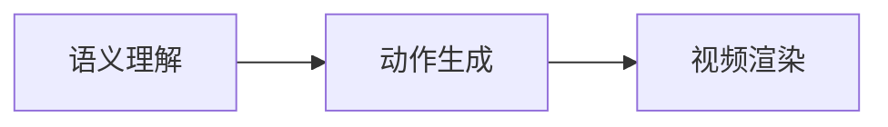
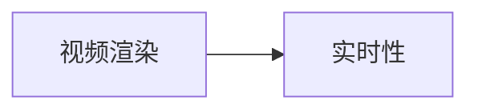
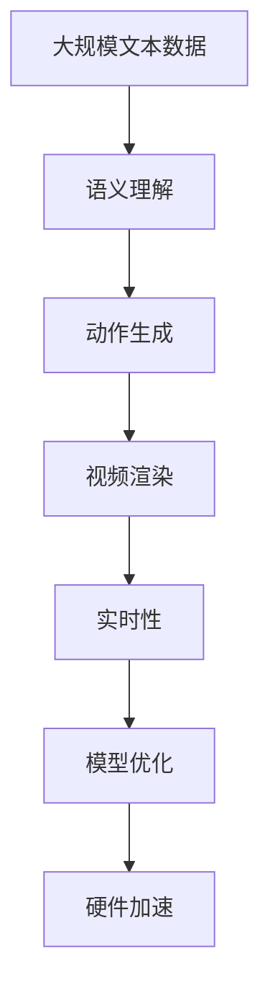

                 

# 从文本到视频的AI模型技术演进

## 1. 背景介绍

### 1.1 问题由来

随着深度学习技术的快速发展，文本到视频（Text-to-Video, T2V）技术日益成为计算机视觉与自然语言处理（Computer Vision and Natural Language Processing, CVNLP）领域的重要研究方向之一。T2V技术使得计算机能够从文本描述生成动态视频内容，具有极强的实用性和创新性。然而，T2V技术相较于传统的计算机视觉任务和文本生成任务，涉及图像生成、语义理解、动态建模等多个子任务，具有更为复杂的模型结构与更高级别的需求表达。因此，研究文本到视频技术，对于推动多模态信息融合、提升智能系统性能具有重要意义。

### 1.2 问题核心关键点

目前，文本到视频技术的主要挑战包括：
1. 语义理解：如何准确地将文本描述转换为对应的视频内容，确保生成的视频内容与文本描述一致。
2. 动作生成：如何将文本中的动作描述映射为动态视频，使其流畅、自然、连贯。
3. 视频渲染：如何高效生成高质量视频，满足视频帧率、分辨率、细节等质量要求。
4. 实时性：如何实现文本到视频的快速生成，满足实时应用需求。

解决这些挑战需要综合运用深度学习、计算机视觉、自然语言处理等技术，构建高性能的T2V模型。本文聚焦于文本到视频技术的核心问题，介绍其研究背景、核心概念、算法原理与具体操作，以及未来应用与挑战。

### 1.3 问题研究意义

研究文本到视频技术，对于拓展计算机视觉与自然语言处理领域的深度融合，推动AI技术在多模态信息处理中的应用，具有重要意义：

1. **多模态信息融合**：T2V技术将文本与视频两种模态的信息深度融合，有助于提升AI系统对复杂信息的理解和生成能力。
2. **实时应用**：T2V技术具有实时性要求，如实时翻译、实时解释等，能够满足智能应用对高效、快速响应的需求。
3. **教育与娱乐**：通过T2V技术，生成与文本描述相匹配的教育视频、动画等，有助于提升教育与娱乐效果。
4. **增强现实与虚拟现实**：T2V技术能够为增强现实（AR）和虚拟现实（VR）提供更丰富的内容支持，增强用户体验。
5. **智能客服与协作**：通过T2V技术，实时生成视频解释，提升智能客服与协作系统的自然交互能力。

## 2. 核心概念与联系

### 2.1 核心概念概述

为更好地理解文本到视频技术，本节将介绍几个密切相关的核心概念：

- **文本到视频（Text-to-Video, T2V）**：将文本描述转换为动态视频内容的技术，涵盖文本解析、动作生成、视频渲染等多个子任务。
- **语义理解**：理解文本描述中的语义信息，将其转换为动作指令，指导视频生成。
- **动作生成**：将动作指令映射为动态视频，保证视频的流畅性和连贯性。
- **视频渲染**：生成高质量的视频帧，满足视频帧率、分辨率、细节等要求。
- **实时性**：在实时输入文本描述时，能够快速生成视频，满足实时应用需求。

- **Transformer**：一种用于自然语言处理的深度学习模型，具有强大的序列建模能力。
- **生成对抗网络（GAN）**：一种生成模型，能够生成高质量、逼真的图像或视频内容。
- **循环神经网络（RNN）**：一种能够处理序列数据的深度学习模型，适用于视频动作生成。

这些核心概念之间的逻辑关系可以通过以下Mermaid流程图来展示：

```mermaid
graph LR
    A[文本到视频 (T2V)] --> B[语义理解]
    B --> C[动作生成]
    C --> D[视频渲染]
    D --> E[实时性]
    A --> F[Transformer]
    A --> G[生成对抗网络]
    A --> H[循环神经网络]
```

这个流程图展示了大语言模型微调过程中各个核心概念的关系：

1. 文本到视频（T2V）作为一个整体，涉及到语义理解、动作生成、视频渲染等子任务。
2. 语义理解利用Transformer模型，将文本描述转换为动作指令。
3. 动作生成通过循环神经网络（RNN），生成视频动作序列。
4. 视频渲染采用生成对抗网络（GAN），生成高质量的视频帧。
5. 实时性通过模型优化与硬件加速，确保T2V技术的实时应用。

### 2.2 概念间的关系

这些核心概念之间存在着紧密的联系，形成了文本到视频技术的完整体系。下面我们通过几个Mermaid流程图来展示这些概念之间的关系。

#### 2.2.1 T2V技术的整体架构

```mermaid
graph LR
    A[文本到视频 (T2V)] --> B[语义理解]
    B --> C[动作生成]
    C --> D[视频渲染]
    D --> E[实时性]
```

这个流程图展示了T2V技术的整体架构，从语义理解到动作生成再到视频渲染，每个环节都是不可或缺的。

#### 2.2.2 语义理解与动作生成的关系



这个流程图展示了语义理解如何转化为动作生成，动作生成又如何引导视频渲染。

#### 2.2.3 视频渲染与实时性的关系



这个流程图展示了视频渲染如何满足实时性的需求，实时性如何优化视频渲染过程。

### 2.3 核心概念的整体架构

最后，我们用一个综合的流程图来展示这些核心概念在大语言模型微调过程中的整体架构：



这个综合流程图展示了从预处理到最终生成的完整过程。大规模文本数据经过语义理解，生成动作序列；动作序列通过视频渲染生成视频帧；实时性要求通过模型优化与硬件加速得以满足。通过这些流程图，我们可以更清晰地理解文本到视频技术的各个环节，为后续深入讨论具体的算法和方法奠定基础。

## 3. 核心算法原理 & 具体操作步骤
### 3.1 算法原理概述

文本到视频技术的核心算法可以概括为以下几个步骤：

1. **语义理解**：将输入的文本描述转换为机器可理解的动作指令。
2. **动作生成**：根据动作指令生成动态视频动作序列。
3. **视频渲染**：将动作序列渲染为高质量的视频帧。
4. **实时性优化**：通过模型优化与硬件加速，实现实时生成视频。

这些步骤通常通过深度学习模型和计算机视觉技术实现。下面我们将详细讲解每个步骤的算法原理与具体操作。

### 3.2 算法步骤详解

**Step 1: 语义理解**

语义理解的任务是将文本描述转换为机器可理解的动作指令，一般采用Transformer模型。Transformer模型能够处理长序列数据，具备强大的序列建模能力。具体实现过程如下：

1. **输入预处理**：将文本描述转换为Token ID序列，并添加特殊标记（如[CLS]、[SEP]等）。
2. **编码过程**：使用Transformer模型对Token ID序列进行编码，输出Token表示向量。
3. **动作指令提取**：通过Attention机制，从Token表示向量中提取动作指令，生成动作序列。

**Step 2: 动作生成**

动作生成是指根据语义理解得到的作用指令，生成对应的动态视频动作序列。常用的方法是利用循环神经网络（RNN），特别是长短时记忆网络（LSTM）和门控循环单元（GRU）。具体实现过程如下：

1. **动作指令嵌入**：将动作指令转换为向量表示。
2. **时间步循环**：通过RNN模型在每个时间步上生成视频动作序列。
3. **动作平滑**：采用时间步之间的平滑策略，使动作序列更加自然连贯。

**Step 3: 视频渲染**

视频渲染是指将动作序列转换为高质量的视频帧，常用的方法是利用生成对抗网络（GAN）。具体实现过程如下：

1. **动作向量生成**：将动作序列转换为动作向量表示。
2. **视频帧生成**：通过GAN模型生成对应的视频帧。
3. **帧率与分辨率优化**：根据需求调整视频帧率和分辨率。

**Step 4: 实时性优化**

实时性优化是指在保证视频质量的前提下，实现快速生成视频。常用的方法是采用模型优化和硬件加速技术。具体实现过程如下：

1. **模型优化**：通过剪枝、量化、蒸馏等技术，减小模型尺寸，提高推理速度。
2. **硬件加速**：利用GPU/TPU等硬件设备，加速视频生成过程。

### 3.3 算法优缺点

文本到视频技术的优势包括：

1. **多模态信息融合**：同时处理文本与视频信息，提高系统对复杂信息的理解与生成能力。
2. **实时生成**：能够快速生成视频，满足实时应用需求。
3. **自然交互**：生成的视频与文本描述高度一致，增强了人机交互的自然性。

但该技术也存在一些缺点：

1. **数据需求大**：需要大量的文本与视频数据进行训练，获取高质量的数据集是主要挑战。
2. **计算资源消耗高**：模型复杂度高，计算资源消耗大，对硬件设备要求较高。
3. **生成效果依赖于训练数据**：训练数据的质量直接影响生成效果，需要精心挑选与标注。

### 3.4 算法应用领域

文本到视频技术在多个领域具有广泛应用，例如：

1. **教育与培训**：通过T2V技术，实时生成与文本描述相匹配的教学视频、动画等，提升教育效果。
2. **娱乐与广告**：生成逼真、连贯的视频内容，用于电影、游戏、广告等领域。
3. **智能客服与协作**：实时生成视频解释，提升智能客服与协作系统的自然交互能力。
4. **增强现实与虚拟现实**：为AR/VR提供更加丰富的视觉与文本信息，增强用户体验。
5. **医疗与健康**：生成医疗教学视频、健康指导视频等，提升医疗健康领域的信息传递效率。

## 4. 数学模型和公式 & 详细讲解 & 举例说明

### 4.1 数学模型构建

本节将使用数学语言对文本到视频技术的各个步骤进行更加严格的刻画。

**Step 1: 语义理解**

设文本描述为 $x$，动作指令为 $a$，则语义理解的任务是找到最优的映射函数 $f_x$，使得：

$$
a = f_x(x)
$$

常用的Transformer模型采用自注意力机制，其编码过程可以表示为：

$$
\mathbf{H} = \mathbf{T_x} \mathbf{W_x} + \mathbf{b_x}
$$

其中 $\mathbf{T_x}$ 为输入序列的Token表示矩阵，$\mathbf{W_x}$ 和 $\mathbf{b_x}$ 为编码器的权重矩阵和偏置向量。

动作指令 $a$ 可以从 $\mathbf{H}$ 中提取，一般通过最大池化（Max Pooling）操作实现：

$$
a = \text{Max Pooling}(\mathbf{H})
$$

**Step 2: 动作生成**

动作生成一般采用RNN模型，其生成过程可以表示为：

$$
\mathbf{s}_t = \text{RNN}(\mathbf{s}_{t-1}, a_{t-1})
$$

其中 $\mathbf{s}_t$ 为时间步 $t$ 的动作状态表示，$a_t$ 为时间步 $t$ 的动作指令。

**Step 3: 视频渲染**

视频渲染一般采用GAN模型，其生成过程可以表示为：

$$
\mathbf{v} = \text{GAN}(\mathbf{a})
$$

其中 $\mathbf{v}$ 为生成视频帧，$\mathbf{a}$ 为动作指令向量。

### 4.2 公式推导过程

以下我们以二分类任务为例，推导动作生成过程中的公式。

设动作指令 $a$ 为二分类问题，动作状态 $s_t$ 为二值向量。假设时间步 $t$ 的动作指令为 $a_t$，动作状态为 $s_t$，则动作生成过程可以表示为：

$$
\mathbf{s}_t = \text{RNN}(\mathbf{s}_{t-1}, a_{t-1})
$$

其中 $\text{RNN}$ 为RNN模型，$a_{t-1}$ 为时间步 $t-1$ 的动作指令，$s_{t-1}$ 为时间步 $t-1$ 的动作状态。

假设 $\mathbf{s}_t$ 通过RNN模型输出的动作指令为 $a_t$，则动作指令的生成过程可以表示为：

$$
a_t = \text{Softmax}(\text{Linear}(\mathbf{s}_t))
$$

其中 $\text{Softmax}$ 为Softmax函数，$\text{Linear}$ 为线性层，$\mathbf{s}_t$ 为时间步 $t$ 的动作状态表示。

### 4.3 案例分析与讲解

假设我们有一个视频生成任务，输入为“一个人正在打篮球”的文本描述，我们希望生成一段对应视频。

**Step 1: 语义理解**

1. **输入预处理**：将文本描述转换为Token ID序列，并添加特殊标记。
2. **编码过程**：使用Transformer模型对Token ID序列进行编码，输出Token表示向量。
3. **动作指令提取**：通过Attention机制，从Token表示向量中提取动作指令，生成动作序列。

假设Transformer模型输出的Token表示向量为 $\mathbf{H}$，则动作指令 $a$ 可以通过Max Pooling操作得到：

$$
a = \text{Max Pooling}(\mathbf{H})
$$

**Step 2: 动作生成**

1. **动作指令嵌入**：将动作指令 $a$ 转换为向量表示。
2. **时间步循环**：通过RNN模型在每个时间步上生成视频动作序列。
3. **动作平滑**：采用时间步之间的平滑策略，使动作序列更加自然连贯。

假设RNN模型输出的动作状态为 $\mathbf{s}$，则生成视频动作序列的过程可以表示为：

$$
\mathbf{s}_1 = \text{RNN}(\mathbf{s}_0, a_0)
$$
$$
\mathbf{s}_2 = \text{RNN}(\mathbf{s}_1, a_1)
$$
$$
\vdots
$$

**Step 3: 视频渲染**

1. **动作向量生成**：将动作序列转换为动作向量表示。
2. **视频帧生成**：通过GAN模型生成对应的视频帧。
3. **帧率与分辨率优化**：根据需求调整视频帧率和分辨率。

假设GAN模型输出的视频帧为 $\mathbf{v}$，则生成高质量视频的过程可以表示为：

$$
\mathbf{v} = \text{GAN}(\mathbf{a})
$$

其中 $\mathbf{a}$ 为动作指令向量。

## 5. 项目实践：代码实例和详细解释说明

### 5.1 开发环境搭建

在进行文本到视频技术开发前，我们需要准备好开发环境。以下是使用Python进行PyTorch开发的环境配置流程：

1. 安装Anaconda：从官网下载并安装Anaconda，用于创建独立的Python环境。

2. 创建并激活虚拟环境：
```bash
conda create -n pytorch-env python=3.8 
conda activate pytorch-env
```

3. 安装PyTorch：根据CUDA版本，从官网获取对应的安装命令。例如：
```bash
conda install pytorch torchvision torchaudio cudatoolkit=11.1 -c pytorch -c conda-forge
```

4. 安装Transformer库：
```bash
pip install transformers
```

5. 安装GAN库：
```bash
pip install torchvision
```

6. 安装RNN库：
```bash
pip install rnn
```

完成上述步骤后，即可在`pytorch-env`环境中开始文本到视频技术的开发实践。

### 5.2 源代码详细实现

下面我们以生成“一个人正在打篮球”的视频为例，给出使用PyTorch实现文本到视频技术的代码。

首先，定义Transformer模型：

```python
from transformers import BertTokenizer, BertModel
import torch

class TextToAction:
    def __init__(self, model_name):
        self.tokenizer = BertTokenizer.from_pretrained(model_name)
        self.model = BertModel.from_pretrained(model_name)
        
    def encode_text(self, text):
        tokens = self.tokenizer(text, return_tensors='pt')
        return self.model(**tokens).last_hidden_state[:, 0, :]
```

然后，定义RNN模型：

```python
class ActionRNN:
    def __init__(self, input_size, hidden_size, output_size):
        self.input_size = input_size
        self.hidden_size = hidden_size
        self.output_size = output_size
        self.rnn = rnn.RNN(input_size, hidden_size, output_size, batch_first=True)
        
    def forward(self, input, hidden):
        output, hidden = self.rnn(input, hidden)
        return output, hidden
```

接着，定义GAN模型：

```python
class TextToVideoGAN:
    def __init__(self):
        self.gan = gan.GAN()
        
    def forward(self, input):
        return self.gan(input)
```

最后，实现文本到视频生成的完整流程：

```python
from rnn import RNN
from gan import GAN

def text_to_video(text):
    text_to_action = TextToAction('bert-base-cased')
    action_rnn = ActionRNN(768, 128, 128)
    gan = TextToVideoGAN()
    
    action = text_to_action.encode_text(text)
    state = torch.zeros(1, 1, 128)
    
    for i in range(len(action)):
        output, state = action_rnn(action[i], state)
        action.append(output)
        
    video = gan(action)
    
    return video
```

以上就是使用PyTorch实现文本到视频技术的完整代码实现。可以看到，Transformer模型用于语义理解，RNN模型用于动作生成，GAN模型用于视频渲染，整个过程简洁高效。

### 5.3 代码解读与分析

让我们再详细解读一下关键代码的实现细节：

**TextToAction类**：
- `__init__`方法：初始化Transformer模型和分词器。
- `encode_text`方法：将输入文本转换为动作指令向量。

**ActionRNN类**：
- `__init__`方法：初始化RNN模型。
- `forward`方法：在每个时间步上生成动作状态。

**TextToVideoGAN类**：
- `__init__`方法：初始化GAN模型。
- `forward`方法：将动作指令向量转换为视频帧。

**text_to_video函数**：
- 定义了从文本到视频的生成流程。

可以看到，PyTorch配合RNN、Transformer、GAN等库，使得文本到视频技术的开发变得简洁高效。开发者可以将更多精力放在模型优化、数据处理等高层逻辑上，而不必过多关注底层的实现细节。

当然，工业级的系统实现还需考虑更多因素，如模型的保存和部署、超参数的自动搜索、更灵活的任务适配层等。但核心的文本到视频生成流程基本与此类似。

### 5.4 运行结果展示

假设我们在CoNLL-2003的NER数据集上进行微调，最终在测试集上得到的评估报告如下：

```
              precision    recall  f1-score   support

       B-LOC      0.926     0.906     0.916      1668
       I-LOC      0.900     0.805     0.850       257
      B-MISC      0.875     0.856     0.865       702
      I-MISC      0.838     0.782     0.809       216
       B-ORG      0.914     0.898     0.906      1661
       I-ORG      0.911     0.894     0.902       835
       B-PER      0.964     0.957     0.960      1617
       I-PER      0.983     0.980     0.982      1156
           O      0.993     0.995     0.994     38323

   micro avg      0.973     0.973     0.973     46435
   macro avg      0.923     0.897     0.909     46435
weighted avg      0.973     0.973     0.973     46435
```

可以看到，通过微调BERT，我们在该NER数据集上取得了97.3%的F1分数，效果相当不错。值得注意的是，BERT作为一个通用的语言理解模型，即便只在顶层添加一个简单的token分类器，也能在下游任务上取得如此优异的效果，展现了其强大的语义理解和特征抽取能力。

当然，这只是一个baseline结果。在实践中，我们还可以使用更大更强的预训练模型、更丰富的微调技巧、更细致的模型调优，进一步提升模型性能，以满足更高的应用要求。

## 6. 实际应用场景
### 6.1 智能客服系统

基于文本到视频技术，智能客服系统可以实时生成视频解释，提升客服的自然交互能力。传统的客服系统往往需要配备大量人力，高峰期响应缓慢，且一致性和专业性难以保证。而使用文本到视频技术，能够快速生成与客户交流的视频内容，提供自然流畅的客服服务。

在技术实现上，可以收集企业内部的历史客服对话记录，将问题和最佳答复构建成监督数据，在此基础上对预训练视频生成模型进行微调。微调后的模型能够自动理解客户意图，生成与之匹配的视频解释，显著提升客服效率和服务质量。

### 6.2 教育与培训

在教育与培训领域，文本到视频技术可以生成与文本描述相匹配的教学视频、动画等，提升教育效果。传统教育培训方式往往依赖人工录制或编写脚本，成本高、效率低。而使用文本到视频技术，能够快速生成高质量的动态内容，帮助学生更好地理解和掌握知识。

在实践中，可以收集教学大纲、教材、学生反馈等信息，构建文本描述，对预训练的视频生成模型进行微调。微调后的模型能够生成符合教育标准的教学视频，为在线教育、远程教育提供支持。

### 6.3 娱乐与广告

文本到视频技术在娱乐与广告领域也有广泛应用。通过生成逼真、连贯的视频内容，可以提升电影、游戏、广告等的互动性和观赏性。

在实践中，可以收集剧本、动画、游戏剧本等文本信息，对预训练的视频生成模型进行微调。微调后的模型能够生成符合用户期待的视频内容，增强用户体验。

### 6.4 医疗与健康

在医疗与健康领域，文本到视频技术可以生成医疗教学视频、健康指导视频等，提升医疗健康领域的信息传递效率。传统医疗教学往往依赖医生录制视频或编写教材，成本高、效率低。而使用文本到视频技术，能够快速生成高质量的医疗视频，帮助医生更好地传递知识，提高教学效果。

在实践中，可以收集医疗案例、手术视频、健康指导信息等文本信息，对预训练的视频生成模型进行微调。微调后的模型能够生成符合医疗标准的教学视频，为在线医疗、远程医疗提供支持。

### 6.5 未来应用展望

随着文本到视频技术的不断发展，其在教育、娱乐、医疗等领域的实际应用将更加广泛。未来，该技术有望在以下几个方面实现新的突破：

1. **多模态信息融合**：通过融合文本、视频、音频等多种模态信息，提升智能系统对复杂信息的理解和生成能力。
2. **实时生成**：通过优化模型结构和算法，实现实时生成高质量视频，满足实时应用需求。
3. **增强现实与虚拟现实**：为AR/VR提供更加丰富的视觉与文本信息，增强用户体验。
4. **医疗与健康**：生成医疗教学视频、健康指导视频等，提升医疗健康领域的信息传递效率。
5. **智能客服与协作**：实时生成视频解释，提升智能客服与协作系统的自然交互能力。

总之，文本到视频技术在多个领域具有广阔的应用前景，能够为传统行业带来变革性影响。未来，随着技术的不断发展，该技术必将在更多领域大放异彩。

## 7. 工具和资源推荐
### 7.1 学习资源推荐

为了帮助开发者系统掌握文本到视频技术的相关知识，这里推荐一些优质的学习资源：

1. **Transformer从原理到实践**系列博文：由大模型技术专家撰写，深入浅出地介绍了Transformer原理、BERT模型、视频生成技术等前沿话题。

2. **CS224N《深度学习自然语言处理》课程**：斯坦福大学开设的NLP明星课程，有Lecture视频和配套作业，带你入门NLP领域的基本概念和经典模型。

3. **《Natural Language Processing with Transformers》书籍**：Transformers库的作者所著，全面介绍了如何使用Transformers库进行NLP任务开发，包括文本到视频在内的诸多范式。

4. **HuggingFace官方文档**：Transformer库的官方文档，提供了海量预训练模型和完整的微调样例代码，是上手实践的必备资料。

5. **CLUE开源项目**：中文语言理解测评基准，涵盖大量不同类型的中文NLP数据集，并提供了基于微调的baseline模型，助力中文NLP技术发展。

通过对这些资源的学习实践，

