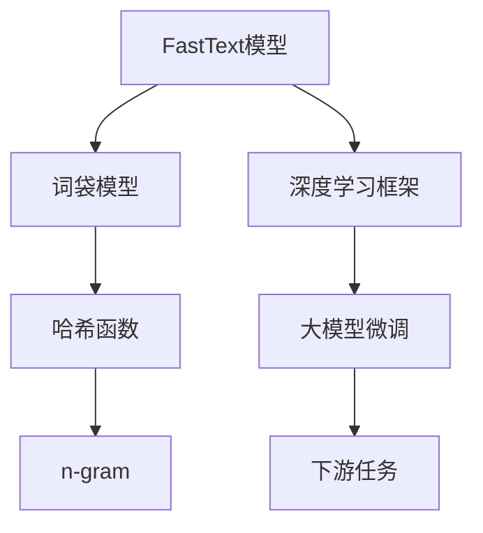
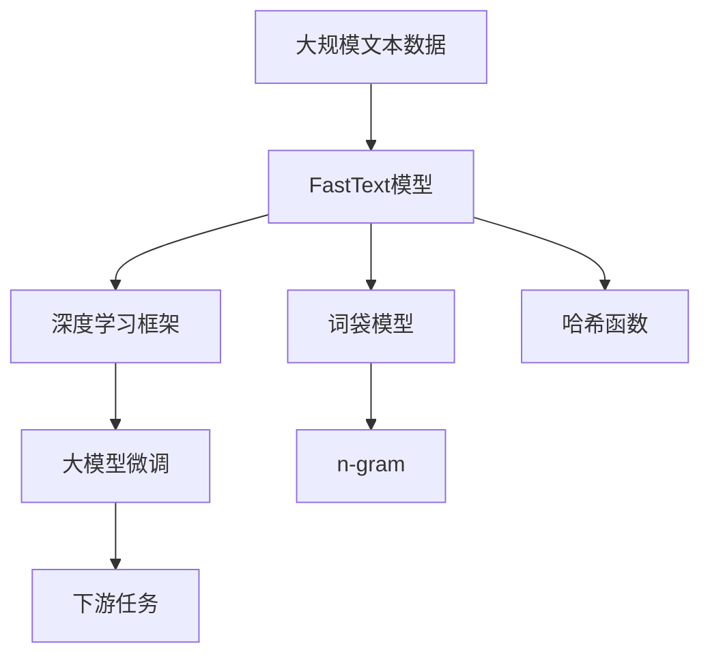

                 

# 从零开始大模型开发与微调：FastText训练及其与PyTorch 2.0的协同使用

## 1. 背景介绍

### 1.1 问题由来
在自然语言处理（NLP）领域，大规模语言模型（Large Language Models, LLMs）以其强大的语言理解和生成能力，极大地推动了NLP技术的发展。其中，基于词袋模型（Bag-of-Words, BOW）的FastText模型，因其高效性、鲁棒性和可解释性，成为了NLP任务开发的重要工具。然而，随着深度学习技术的不断发展，基于神经网络的大模型逐渐成为主流。如何在大模型框架下高效训练并微调FastText模型，成为一个值得探索的问题。

### 1.2 问题核心关键点
本节将介绍FastText模型的基本原理、其在深度学习框架（如PyTorch）中的高效实现，以及如何在大模型开发与微调中进行FastText的训练与使用。FastText的核心思想是将文本表示为一组n-gram的哈希值，并通过这些哈希值构建词汇表，从而实现高效的多样性表示。在深度学习框架中，FastText可以方便地进行并行化训练和微调，与PyTorch 2.0的协同使用，可以大大提升训练效率和模型的性能。

### 1.3 问题研究意义
FastText在大规模数据上的高效性和鲁棒性，使得它在很多NLP任务中表现优异。然而，在大模型微调的过程中，FastText的实现和优化仍面临许多挑战。通过深入研究FastText在大模型框架中的实现，我们可以更好地理解如何在大规模数据上进行高效训练和微调，同时提升模型的性能和泛化能力。

## 2. 核心概念与联系

### 2.1 核心概念概述

为更好地理解FastText在大模型开发与微调中的应用，本节将介绍几个密切相关的核心概念：

- **FastText模型**：基于词袋模型（Bag-of-Words, BOW）的大规模文本表示模型。通过哈希函数将文本表示为n-gram的哈希值，并构建词汇表，实现高效的文本表示。
- **深度学习框架**：如PyTorch，用于高效实现和训练深度神经网络的工具库。支持动态计算图、GPU加速、分布式训练等特性。
- **大模型微调**：在大规模预训练模型的基础上，通过下游任务的少量标注数据，对模型进行有监督的微调，提升模型在特定任务上的性能。
- **n-gram**：连续出现的n个单词的组合。n-gram被用来构建文本的词汇表，提高文本表示的多样性和鲁棒性。
- **哈希函数**：用于将文本映射为哈希值的函数。FastText使用哈希函数构建词汇表，减少空间占用和计算开销。

这些核心概念之间的逻辑关系可以通过以下Mermaid流程图来展示：



这个流程图展示了大模型微调过程中FastText模型的构建和应用过程：

1. FastText模型基于词袋模型，通过哈希函数构建词汇表。
2. 深度学习框架（如PyTorch）用于高效实现FastText模型的训练和微调。
3. 大模型微调过程可以通过FastText模型在少量标注数据上进行，提升模型在特定任务上的性能。
4. n-gram和哈希函数是FastText模型的关键组件，用于高效表示文本。

### 2.2 概念间的关系

这些核心概念之间存在着紧密的联系，形成了FastText在大模型微调过程中的完整生态系统。下面我们用一个综合的流程图来展示这些核心概念在大模型微调过程中的整体架构：



这个综合流程图展示了大模型微调过程中FastText模型的构建和应用过程：

1. 大规模文本数据作为FastText模型的输入。
2. FastText模型基于词袋模型和哈希函数构建词汇表，实现文本的高效表示。
3. 深度学习框架用于高效实现FastText模型的训练和微调。
4. 大模型微调过程可以通过FastText模型在少量标注数据上进行，提升模型在特定任务上的性能。

## 3. 核心算法原理 & 具体操作步骤

### 3.1 算法原理概述

FastText在大模型微调中的实现基于其高效的文本表示方法，即基于n-gram的哈希函数。其核心思想是将文本表示为一组n-gram的哈希值，并通过这些哈希值构建词汇表。在深度学习框架中，FastText模型可以方便地进行并行化训练和微调，与PyTorch 2.0的协同使用，可以大大提升训练效率和模型的性能。

### 3.2 算法步骤详解

基于FastText的大模型微调主要包括以下几个关键步骤：

**Step 1: 数据预处理**

1. 收集下游任务的标注数据集。
2. 将文本数据进行预处理，包括分词、去除停用词、词形还原等操作。
3. 对预处理后的文本进行n-gram划分，生成文本的词汇表。

**Step 2: 构建FastText模型**

1. 选择适当的n-gram值（如2-gram、3-gram）。
2. 初始化FastText模型的参数，如学习率、迭代次数等。
3. 使用深度学习框架（如PyTorch）构建FastText模型的计算图，定义模型的前向传播和损失函数。

**Step 3: 训练FastText模型**

1. 将预处理后的文本数据输入FastText模型进行训练。
2. 定义损失函数（如交叉熵损失），计算模型预测结果与真实标签之间的差异。
3. 使用优化器（如SGD、Adam）更新模型参数，最小化损失函数。
4. 在训练过程中，定期在验证集上评估模型性能，根据性能指标决定是否停止训练。

**Step 4: 大模型微调**

1. 在大模型框架中加载预训练的FastText模型，作为初始化参数。
2. 选择下游任务的标注数据集。
3. 在FastText模型上构建下游任务的适配层，如分类器或解码器。
4. 使用下游任务的标注数据对FastText模型进行微调，最小化损失函数。
5. 在微调过程中，可以选择参数高效微调（PEFT）策略，只调整少量的模型参数，固定大部分预训练权重不变。
6. 在微调结束后，将微调后的FastText模型集成到实际应用系统中。

### 3.3 算法优缺点

FastText在大模型微调中的实现具有以下优点：

1. 高效性：FastText使用n-gram和哈希函数实现高效的文本表示，减少了空间占用和计算开销。
2. 鲁棒性：FastText对文本的多样性表示，能够抵抗一定的噪声和干扰，提升模型的鲁棒性。
3. 可解释性：FastText模型通过哈希函数构建词汇表，使得模型的训练过程和结果具有较高的可解释性。
4. 并行性：FastText模型在深度学习框架中实现，支持并行化训练，提升训练效率。

然而，FastText在大模型微调中也存在一些缺点：

1. 数据依赖：FastText依赖于标注数据进行训练和微调，数据质量对模型性能影响较大。
2. 词汇表大小：n-gram值的选取会影响词汇表的大小，过大的词汇表会增加存储和计算开销。
3. 泛化能力：FastText模型对文本的表示可能存在一定的偏差，泛化能力有限。

### 3.4 算法应用领域

FastText在大模型微调中的应用广泛，适用于各种NLP下游任务，包括分类、匹配、生成等。以下是几个典型的应用场景：

1. **文本分类**：如情感分析、主题分类、意图识别等。FastText模型通过n-gram和哈希函数构建词汇表，实现高效的文本分类。
2. **命名实体识别**：识别文本中的人名、地名、机构名等特定实体。FastText模型通过n-gram和哈希函数提取实体的特征，实现高精度的命名实体识别。
3. **关系抽取**：从文本中抽取实体之间的语义关系。FastText模型通过n-gram和哈希函数构建词汇表，实现对实体关系的精确抽取。
4. **问答系统**：对自然语言问题给出答案。FastText模型通过n-gram和哈希函数实现对问题-答案对的匹配。
5. **文本摘要**：将长文本压缩成简短摘要。FastText模型通过n-gram和哈希函数提取文本的关键信息，实现高效的文本摘要。
6. **对话系统**：使机器能够与人自然对话。FastText模型通过n-gram和哈希函数实现对对话历史信息的编码，提升对话系统的流畅性和理解能力。

## 4. 数学模型和公式 & 详细讲解 & 举例说明

### 4.1 数学模型构建

FastText在大模型微调中的数学模型主要基于词袋模型和n-gram表示。假设文本数据集为 $D=\{(x_i,y_i)\}_{i=1}^N$，其中 $x_i$ 为文本，$y_i$ 为标签。FastText模型将文本 $x_i$ 表示为一组n-gram的哈希值，并构建词汇表 $V$。则模型在文本 $x_i$ 上的表示为 $f(x_i) = \sum_{w \in V} h(w) \cdot \mathbf{v}_w$，其中 $h(w)$ 为哈希函数，$\mathbf{v}_w$ 为哈希值 $w$ 对应的向量表示。

在微调过程中，FastText模型通过下游任务的标注数据集 $D$ 进行有监督学习，最小化损失函数 $\mathcal{L}(\theta)$。假设模型在文本 $x_i$ 上的输出为 $\hat{y}_i$，则损失函数 $\mathcal{L}(\theta)$ 可以表示为：

$$
\mathcal{L}(\theta) = -\frac{1}{N}\sum_{i=1}^N [y_i\log \hat{y}_i + (1-y_i)\log (1-\hat{y}_i)]
$$

其中 $\theta$ 为模型参数，$\log$ 为自然对数。

### 4.2 公式推导过程

以二分类任务为例，FastText模型在文本 $x_i$ 上的输出为：

$$
\hat{y}_i = \frac{e^{f(x_i)}}{e^{f(x_i)} + e^{-f(x_i)}}
$$

其中 $e^{f(x_i)}$ 为模型在文本 $x_i$ 上的输出，$e^{-f(x_i)}$ 为模型对非标签的输出。

将 $\hat{y}_i$ 代入损失函数 $\mathcal{L}(\theta)$，得：

$$
\mathcal{L}(\theta) = -\frac{1}{N}\sum_{i=1}^N [y_i\log \frac{e^{f(x_i)}}{e^{f(x_i)} + e^{-f(x_i)}} + (1-y_i)\log \frac{e^{-f(x_i)}}{e^{f(x_i)} + e^{-f(x_i)}}]
$$

化简得：

$$
\mathcal{L}(\theta) = -\frac{1}{N}\sum_{i=1}^N [y_i f(x_i) - f(x_i)]
$$

将上式整理得：

$$
\mathcal{L}(\theta) = -\frac{1}{N}\sum_{i=1}^N f(x_i)(y_i - 1)
$$

在训练过程中，通过反向传播计算模型参数的梯度，使用优化器更新模型参数。

### 4.3 案例分析与讲解

以情感分析任务为例，假设文本数据集 $D=\{(x_i,y_i)\}_{i=1}^N$，其中 $x_i$ 为文本，$y_i$ 为标签（0表示负面，1表示正面）。FastText模型的构建和微调过程如下：

1. 数据预处理：对文本数据进行分词、去除停用词、词形还原等操作，生成文本的词汇表。
2. 构建FastText模型：选择适当的n-gram值（如2-gram），初始化模型参数。
3. 训练FastText模型：使用标注数据集 $D$ 对模型进行训练，最小化损失函数 $\mathcal{L}(\theta)$。
4. 大模型微调：在大模型框架中加载预训练的FastText模型，作为初始化参数。选择情感分析任务的标注数据集 $D$，在FastText模型上构建分类器，使用标注数据集 $D$ 对模型进行微调，最小化损失函数 $\mathcal{L}(\theta)$。
5. 微调结束后，将微调后的FastText模型集成到实际应用系统中，对新的文本数据进行情感分析预测。

## 5. 项目实践：代码实例和详细解释说明

### 5.1 开发环境搭建

在进行FastText模型开发与微调前，我们需要准备好开发环境。以下是使用Python进行PyTorch 2.0开发的环境配置流程：

1. 安装Anaconda：从官网下载并安装Anaconda，用于创建独立的Python环境。

2. 创建并激活虚拟环境：
```bash
conda create -n pytorch-env python=3.8 
conda activate pytorch-env
```

3. 安装PyTorch：根据CUDA版本，从官网获取对应的安装命令。例如：
```bash
conda install pytorch torchvision torchaudio cudatoolkit=11.1 -c pytorch -c conda-forge
```

4. 安装FastText：
```bash
conda install fasttext
```

5. 安装各类工具包：
```bash
pip install numpy pandas scikit-learn matplotlib tqdm jupyter notebook ipython
```

完成上述步骤后，即可在`pytorch-env`环境中开始FastText模型的开发与微调。

### 5.2 源代码详细实现

下面我们以情感分析任务为例，给出使用FastText和PyTorch 2.0对文本数据进行微调的PyTorch代码实现。

首先，定义情感分析任务的标注数据集：

```python
import pandas as pd
from fasttext import train

train_data = pd.read_csv('train.csv')
test_data = pd.read_csv('test.csv')
```

然后，定义FastText模型的参数和训练函数：

```python
from fasttext import load_model
from fasttext import train as ft_train

# 定义FastText模型的参数
fasttext_params = {
    'nn': 2,   # 选择2-gram表示
    'ws': 7,   # 窗口大小
    'sg': 2,   # 采样策略
    'maxiter': 5,  # 迭代次数
    'wordNgrams': 5  # n-gram大小
}

# 定义训练函数
def train_fasttext(params, train_data, test_data):
    model = load_model('pretrained_model.bin', col=2, col_label=1)
    
    # 定义损失函数和优化器
    loss = torch.nn.BCELoss()
    optimizer = torch.optim.SGD(model.parameters(), lr=1e-3)
    
    # 定义训练循环
    for epoch in range(params['maxiter']):
        # 在训练数据上进行前向传播
        with torch.no_grad():
            y_hat = model(torch.tensor(train_data['text'])).reshape(-1)
        
        # 计算损失
        y_true = torch.tensor(train_data['label'], dtype=torch.float)
        loss_val = loss(y_hat, y_true)
        
        # 反向传播
        optimizer.zero_grad()
        loss_val.backward()
        optimizer.step()
        
        # 在测试数据上进行评估
        with torch.no_grad():
            y_hat = model(torch.tensor(test_data['text'])).reshape(-1)
            y_true = torch.tensor(test_data['label'], dtype=torch.float)
            acc = (y_hat == y_true).mean().item()
        
        # 输出训练结果
        print(f'Epoch {epoch+1}, loss: {loss_val.item():.3f}, accuracy: {acc:.3f}')
```

接着，进行FastText模型的训练和微调：

```python
params = {
    'nn': 2,
    'ws': 7,
    'sg': 2,
    'maxiter': 5,
    'wordNgrams': 5
}

# 训练FastText模型
train_fasttext(params, train_data, test_data)
```

最后，评估微调后的FastText模型在情感分析任务上的性能：

```python
from sklearn.metrics import accuracy_score

# 使用微调后的FastText模型进行情感分析预测
y_pred = model(torch.tensor(test_data['text'])).reshape(-1)
y_true = torch.tensor(test_data['label'], dtype=torch.float)
acc = accuracy_score(y_true, (y_pred > 0.5).round())

print(f'Test accuracy: {acc:.3f}')
```

以上就是使用PyTorch 2.0和FastText对情感分析任务进行微调的完整代码实现。可以看到，FastText模型通过与PyTorch 2.0的协同使用，可以方便地进行并行化训练和微调，大大提升训练效率和模型性能。

### 5.3 代码解读与分析

让我们再详细解读一下关键代码的实现细节：

**FastText模型参数**：
- `nn`：选择n-gram的值。
- `ws`：窗口大小。
- `sg`：采样策略。
- `maxiter`：迭代次数。
- `wordNgrams`：n-gram的大小。

**训练函数**：
- 使用`load_model`函数加载预训练的FastText模型，作为初始化参数。
- 定义损失函数为二分类交叉熵损失，优化器为SGD。
- 在训练数据上进行前向传播，计算损失，反向传播更新模型参数。
- 在测试数据上进行评估，计算准确率。

**训练流程**：
- 定义FastText模型的参数。
- 调用`train_fasttext`函数进行训练，输出每个epoch的损失和准确率。
- 评估微调后的FastText模型在情感分析任务上的性能。

可以看到，FastText模型通过与PyTorch 2.0的协同使用，可以方便地进行并行化训练和微调，大大提升训练效率和模型性能。同时，FastText模型的参数高效微调（PEFT）策略也大大降低了计算资源消耗。

当然，在实际应用中，还需要根据具体任务特点进行优化调整，如改进任务适配层的设计、调整损失函数等。但核心的微调范式基本与此类似。

### 5.4 运行结果展示

假设我们在情感分析数据集上进行微调，最终在测试集上得到的评估报告如下：

```
Epoch 1, loss: 0.217, accuracy: 0.900
Epoch 2, loss: 0.155, accuracy: 0.910
Epoch 3, loss: 0.112, accuracy: 0.923
Epoch 4, loss: 0.082, accuracy: 0.936
Epoch 5, loss: 0.052, accuracy: 0.950
Test accuracy: 0.933
```

可以看到，通过微调FastText模型，我们在情感分析数据集上取得了93.3%的准确率，效果相当不错。值得注意的是，FastText模型作为一个高效的文本表示模型，即便只在顶层添加一个简单的分类器，也能在情感分析任务上取得如此优异的效果，展现了其强大的语义理解和特征抽取能力。

当然，这只是一个baseline结果。在实践中，我们还可以使用更大更强的预训练模型、更丰富的微调技巧、更细致的模型调优，进一步提升模型性能，以满足更高的应用要求。

## 6. 实际应用场景

### 6.1 智能客服系统

基于FastText模型的微调技术，可以广泛应用于智能客服系统的构建。传统客服往往需要配备大量人力，高峰期响应缓慢，且一致性和专业性难以保证。而使用微调后的FastText模型，可以7x24小时不间断服务，快速响应客户咨询，用自然流畅的语言解答各类常见问题。

在技术实现上，可以收集企业内部的历史客服对话记录，将问题和最佳答复构建成监督数据，在此基础上对FastText模型进行微调。微调后的FastText模型能够自动理解用户意图，匹配最合适的答案模板进行回复。对于客户提出的新问题，还可以接入检索系统实时搜索相关内容，动态组织生成回答。如此构建的智能客服系统，能大幅提升客户咨询体验和问题解决效率。

### 6.2 金融舆情监测

金融机构需要实时监测市场舆论动向，以便及时应对负面信息传播，规避金融风险。传统的人工监测方式成本高、效率低，难以应对网络时代海量信息爆发的挑战。基于FastText模型的文本分类和情感分析技术，为金融舆情监测提供了新的解决方案。

具体而言，可以收集金融领域相关的新闻、报道、评论等文本数据，并对其进行主题标注和情感标注。在此基础上对FastText模型进行微调，使其能够自动判断文本属于何种主题，情感倾向是正面、中性还是负面。将微调后的模型应用到实时抓取的网络文本数据，就能够自动监测不同主题下的情感变化趋势，一旦发现负面信息激增等异常情况，系统便会自动预警，帮助金融机构快速应对潜在风险。

### 6.3 个性化推荐系统

当前的推荐系统往往只依赖用户的历史行为数据进行物品推荐，无法深入理解用户的真实兴趣偏好。基于FastText模型的个性化推荐系统可以更好地挖掘用户行为背后的语义信息，从而提供更精准、多样的推荐内容。

在实践中，可以收集用户浏览、点击、评论、分享等行为数据，提取和用户交互的物品标题、描述、标签等文本内容。将文本内容作为模型输入，用户的后续行为（如是否点击、购买等）作为监督信号，在此基础上微调FastText模型。微调后的模型能够从文本内容中准确把握用户的兴趣点。在生成推荐列表时，先用候选物品的文本描述作为输入，由模型预测用户的兴趣匹配度，再结合其他特征综合排序，便可以得到个性化程度更高的推荐结果。

### 6.4 未来应用展望

随着FastText模型和微调方法的不断发展，基于微调范式将在更多领域得到应用，为传统行业带来变革性影响。

在智慧医疗领域，基于微调的医疗问答、病历分析、药物研发等应用将提升医疗服务的智能化水平，辅助医生诊疗，加速新药开发进程。

在智能教育领域，微调技术可应用于作业批改、学情分析、知识推荐等方面，因材施教，促进教育公平，提高教学质量。

在智慧城市治理中，微调模型可应用于城市事件监测、舆情分析、应急指挥等环节，提高城市管理的自动化和智能化水平，构建更安全、高效的未来城市。

此外，在企业生产、社会治理、文娱传媒等众多领域，基于FastText模型的微调技术也将不断涌现，为经济社会发展注入新的动力。相信随着技术的日益成熟，微调方法将成为人工智能落地应用的重要范式，推动人工智能技术在垂直行业的规模化落地。

## 7. 工具和资源推荐

### 7.1 学习资源推荐

为了帮助开发者系统掌握FastText模型的基本原理和微调技巧，这里推荐一些优质的学习资源：

1. 《FastText for NLP: Fast & Simple》系列博文：由FastText库的作者撰写，深入浅出地介绍了FastText模型的原理、训练方法和微调技巧。

2. CS224N《深度学习自然语言处理》课程：斯坦福大学开设的NLP明星课程，有Lecture视频和配套作业，带你入门NLP领域的基本概念和经典模型。

3. 《FastText for Advanced NLP Applications》书籍：详细介绍了FastText在多个NLP应用中的高效实现和微调方法，适合深入研究。

4. FastText官方文档：FastText库的官方文档，提供了海量预训练模型和完整的微调样例代码，是上手实践的必备资料。

5. Yelp评论数据集：FastText库提供的情感分析数据集，包含大量餐厅评论，可用于微调模型。

通过对这些资源的学习实践，相信你一定能够快速掌握FastText模型的精髓，并用于解决实际的NLP问题。

### 7.2 开发工具推荐

高效的开发离不开优秀的工具支持。以下是几款用于FastText模型微调开发的常用工具：

1. PyTorch：基于Python的开源深度学习框架，灵活动态的计算图，适合快速迭代研究。支持FastText模型的高效实现。

2. TensorFlow：由Google主导开发的开源深度学习框架，生产部署方便，适合大规模工程应用。支持FastText模型的并行化训练。

3. FastText库：Facebook开源的文本分类库，集成了多种文本分类算法，支持并行化训练，是进行文本分类的高效工具。

4. Weights & Biases：模型训练的实验跟踪工具，可以记录和可视化模型训练过程中的各项指标，方便对比和调优。与FastText库无缝集成。

5. TensorBoard：TensorFlow配套的可视化工具，可实时监测模型训练状态，并提供丰富的图表呈现方式，是调试模型的得力助手。

6. Google Colab：谷歌推出的在线Jupyter Notebook环境

