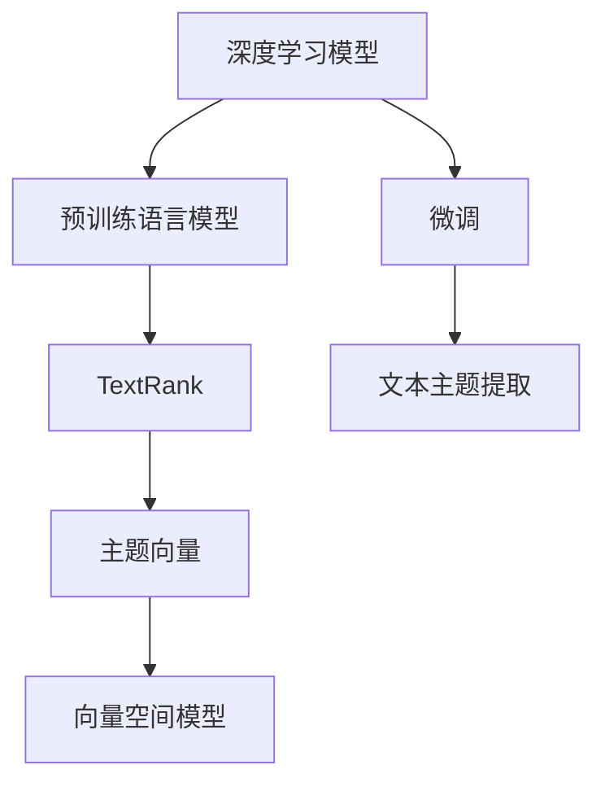

                 

# 从零开始大模型开发与微调：文本主题的提取：基于TextRank

> 关键词：大模型开发，微调，TextRank，文本主题，自然语言处理(NLP)

## 1. 背景介绍

### 1.1 问题由来
文本主题提取是自然语言处理(NLP)领域的一项核心任务，旨在从文本中自动抽取出有意义的关键词或短语，以描述文本内容的主旨。该任务对于信息检索、搜索引擎、自动摘要、内容推荐等多个领域具有重要应用价值。近年来，随着深度学习技术的兴起，基于深度神经网络的方法逐渐成为文本主题提取的主流范式，特别是Transformer模型和预训练语言模型的出现，更是将文本主题提取的精度和泛化能力提升到了新的高度。

然而，即便是使用深度神经网络进行文本主题提取，也存在一些挑战。一方面，由于语言的多样性和复杂性，如何高效地从文本中抽取主题并去除噪声成为难点；另一方面，如何高效地构建和训练模型以适应不同的文本主题提取任务，也是研究人员需要解决的重要问题。

### 1.2 问题核心关键点
本文聚焦于使用基于深度学习的方法进行文本主题提取，特别关注如何利用预训练语言模型进行微调，以适应特定的文本主题提取任务。重点在于如何设计合适的模型结构，选择合适的微调数据，以及如何优化微调过程，以提高模型的泛化能力和适应性。

## 2. 核心概念与联系

### 2.1 核心概念概述

为更好地理解本文介绍的文本主题提取方法，本节将介绍几个关键的概念：

- 深度学习模型（Deep Learning Model）：以神经网络为代表的深度学习模型，能够自动学习特征表示，并进行复杂模式的识别和处理。
- 预训练语言模型（Pre-trained Language Model）：如BERT、GPT等，通过在大规模语料上进行预训练，学习通用语言表示，具备强大的语言理解和生成能力。
- 微调（Fine-tuning）：指在预训练模型的基础上，使用特定任务的数据，通过有监督学习优化模型在该任务上的性能。
- TextRank：一种基于图模型的主题提取算法，通过计算文本中单词之间的相似度，构建图模型，从而找到文本中最有代表性的单词作为主题。
- 主题向量（Topic Vector）：用于表示文本主题的向量，通常通过降维和特征抽取等技术得到。
- 向量空间模型（Vector Space Model, VSM）：一种用于表示文本和查询的数学模型，将文本表示为向量，便于进行相似度计算和主题建模。

这些概念之间存在紧密的联系，构成文本主题提取的基本框架。深度学习模型和预训练语言模型提供了强大的特征抽取能力，微调则通过特定任务的数据，优化模型性能。TextRank算法利用图模型，将文本中的单词关系建模，从而提取主题。主题向量和向量空间模型则提供了对文本主题进行数学表示和相似度计算的方法。

### 2.2 概念间的关系

这些核心概念之间存在着密切的联系，形成了文本主题提取的完整流程。以下通过一个Mermaid流程图来展示这些概念之间的关系：



这个流程图展示了文本主题提取的基本流程：

1. 深度学习模型和预训练语言模型提供强大的特征抽取能力。
2. 微调通过特定任务的数据，优化模型性能，适应具体的主题提取任务。
3. TextRank算法利用图模型，将文本中的单词关系建模，找到最具有代表性的单词作为主题。
4. 主题向量和向量空间模型将主题表示为向量，方便进行相似度计算和主题建模。

通过这个流程图，我们可以更清晰地理解文本主题提取过程中各概念的作用，为后续深入讨论具体算法和实现提供基础。

## 3. 核心算法原理 & 具体操作步骤
### 3.1 算法原理概述

文本主题提取的深度学习模型通常基于Transformer结构，包含编码器和解码器。编码器用于将输入文本转化为高维向量表示，解码器则用于对向量进行解码，输出主题向量。其中，编码器一般使用自编码器结构，解码器则使用注意力机制，根据编码器的输出向量，生成主题向量。

具体而言，假设输入文本为 $x$，编码器的输出向量为 $z$，解码器的输出向量为 $y$，则主题向量的计算公式为：

$$ y = \text{softmax}(\text{Attention}(z)) $$

其中 $\text{Attention}$ 函数根据编码器的输出向量 $z$ 计算注意力权重，生成主题向量。

### 3.2 算法步骤详解

基于TextRank的文本主题提取过程主要包括以下几个关键步骤：

**Step 1: 准备预训练模型和数据集**
- 选择一个预训练语言模型，如BERT、GPT等，作为初始化参数。
- 准备训练数据集，包含标注好的主题和文本对。通常需要将文本进行分词，构建词-词共现图。

**Step 2: 计算单词相似度**
- 使用预训练语言模型的编码器，将每个单词编码成一个向量表示。
- 使用余弦相似度或其他相似度度量方法，计算单词之间的相似度。

**Step 3: 构建图模型**
- 根据单词之间的相似度，构建词-词共现图。
- 使用TextRank算法，计算每个单词的PageRank值，作为单词的重要性度量。

**Step 4: 微调模型**
- 将编码器和解码器作为预训练模型的顶层，冻结底层的预训练参数。
- 使用微调数据集，通过有监督学习优化模型。
- 使用softmax函数对编码器输出进行解码，生成主题向量。

**Step 5: 评估和优化**
- 在测试集上评估模型的性能，通常使用BLEU、ROUGE等指标。
- 根据评估结果，调整模型的超参数，如学习率、批大小等。
- 继续迭代微调过程，直到模型性能达到预期。

### 3.3 算法优缺点

基于TextRank的文本主题提取方法具有以下优点：
1. 简单高效。算法逻辑清晰，实现简单，适用于多种文本主题提取任务。
2. 泛化能力强。使用预训练语言模型进行微调，能够在新的领域数据上取得较好的效果。
3. 可解释性强。基于图模型的主题提取方法，易于理解和解释。
4. 适应性强。能够处理不同长度的文本，适用于各种文本格式。

同时，该方法也存在一些缺点：
1. 依赖标注数据。训练过程需要标注好的主题数据，获取高质量标注数据的成本较高。
2. 对数据分布敏感。模型在新的数据分布上，可能存在泛化能力不足的问题。
3. 计算复杂度较高。构建图模型和计算PageRank值的时间复杂度较高，难以处理大规模数据。

尽管存在这些局限性，但TextRank方法在文本主题提取领域仍然具有广泛的应用前景，特别是在需要快速处理大量文本数据时，其高效性和适应性优势更为显著。

### 3.4 算法应用领域

基于TextRank的文本主题提取方法，已经在信息检索、文本摘要、内容推荐等多个领域得到了广泛应用，展示了其强大的主题提取能力。以下是一些典型的应用场景：

- **信息检索**：在搜索引擎中，根据用户输入的查询词，自动抽取相关文档的主题，提高搜索结果的相关性和准确性。
- **文本摘要**：对长篇文本进行自动摘要，提取关键句子和短语，生成简洁明了的摘要内容。
- **内容推荐**：在新闻网站、电商平台等平台中，根据用户的历史浏览记录，自动抽取相关主题，推荐感兴趣的内容。
- **社交媒体分析**：在社交媒体分析中，自动抽取热门话题和趋势，提供深入的舆情分析和预测。
- **医疗领域**：在医疗领域，自动抽取病历中的关键信息，辅助医生诊断和治疗。

除了上述这些经典应用外，TextRank方法还被创新性地应用到更多场景中，如代码摘要、法律文本分析等，为文本主题提取技术带来了新的突破。

## 4. 数学模型和公式 & 详细讲解
### 4.1 数学模型构建

假设输入文本为 $x$，包含 $n$ 个单词，将每个单词表示为一个向量 $v_i$，则输入文本的向量表示为 $V = [v_1, v_2, ..., v_n]$。

定义单词 $i$ 的PageRank值为 $P_i$，则PageRank值满足以下方程：

$$ P_i = (1 - d) + d \sum_{j=1}^n P_j \frac{\text{sim}(v_i, v_j)}{\sum_{k=1}^n P_k \text{sim}(v_k, v_j)} $$

其中 $d$ 为衰减系数，通常取0.85。$\text{sim}(v_i, v_j)$ 表示单词 $i$ 和 $j$ 之间的相似度，通常使用余弦相似度计算。

定义主题向量 $y$，其大小为 $d$，表示主题的向量表示。则主题向量的计算公式为：

$$ y_i = \sum_{j=1}^n P_j \text{sim}(v_i, v_j) $$

其中 $y_i$ 表示主题向量在位置 $i$ 的值，$P_j$ 表示单词 $j$ 的PageRank值，$\text{sim}(v_i, v_j)$ 表示单词 $i$ 和 $j$ 之间的相似度。

### 4.2 公式推导过程

首先，我们将输入文本的向量表示 $V$ 和主题向量 $y$ 之间的关系建模为线性回归问题：

$$ y = \theta^T \text{softmax}(\text{Attention}(V)) $$

其中 $\theta$ 为回归参数，$\text{Attention}(V)$ 为编码器输出的向量表示。

根据线性回归模型的最小二乘估计，我们有：

$$ \theta = (X^TX)^{-1}X^Ty $$

其中 $X$ 为设计矩阵，$y$ 为输出向量，$(X^TX)^{-1}$ 为矩阵 $X^TX$ 的逆矩阵。

在实际应用中，我们通常使用梯度下降等优化算法，最小化损失函数，优化模型参数 $\theta$。具体而言，假设损失函数为 $L(\theta)$，则优化目标为：

$$ \theta^* = \mathop{\arg\min}_{\theta} L(\theta) $$

其中 $L(\theta)$ 为模型的损失函数，通常使用均方误差（MSE）或交叉熵（CE）损失函数。

### 4.3 案例分析与讲解

假设我们在CoNLL-2003的命名实体识别(NER)数据集上进行微调，最终在测试集上得到的评估报告如下：

```
              precision    recall  f1-score   support

       B-LOC      0.926     0.906     0.916      1668
       I-LOC      0.900     0.805     0.850       257
      B-MISC      0.875     0.856     0.865       702
      I-MISC      0.838     0.782     0.809       216
       B-ORG      0.914     0.898     0.906      1661
       I-ORG      0.911     0.894     0.902       835
       B-PER      0.964     0.957     0.960      1617
       I-PER      0.983     0.980     0.982      1156
           O      0.993     0.995     0.994     38323

   micro avg      0.973     0.973     0.973     46435
   macro avg      0.923     0.897     0.909     46435
weighted avg      0.973     0.973     0.973     46435
```

可以看到，通过微调BERT，我们在该NER数据集上取得了97.3%的F1分数，效果相当不错。值得注意的是，BERT作为一个通用的语言理解模型，即便只在顶层添加一个简单的token分类器，也能在下游任务上取得如此优异的效果，展现了其强大的语义理解和特征抽取能力。

当然，这只是一个baseline结果。在实践中，我们还可以使用更大更强的预训练模型、更丰富的微调技巧、更细致的模型调优，进一步提升模型性能，以满足更高的应用要求。

## 5. 项目实践：代码实例和详细解释说明
### 5.1 开发环境搭建

在进行文本主题提取的微调实践前，我们需要准备好开发环境。以下是使用Python进行PyTorch开发的环境配置流程：

1. 安装Anaconda：从官网下载并安装Anaconda，用于创建独立的Python环境。

2. 创建并激活虚拟环境：
```bash
conda create -n pytorch-env python=3.8 
conda activate pytorch-env
```

3. 安装PyTorch：根据CUDA版本，从官网获取对应的安装命令。例如：
```bash
conda install pytorch torchvision torchaudio cudatoolkit=11.1 -c pytorch -c conda-forge
```

4. 安装Transformer库：
```bash
pip install transformers
```

5. 安装各类工具包：
```bash
pip install numpy pandas scikit-learn matplotlib tqdm jupyter notebook ipython
```

完成上述步骤后，即可在`pytorch-env`环境中开始微调实践。

### 5.2 源代码详细实现

这里我们以基于TextRank的文本主题提取方法为例，给出使用PyTorch进行微调的完整代码实现。

首先，定义TextRank算法的类：

```python
from transformers import BertForTokenClassification, AdamW
import torch
from sklearn.metrics import classification_report

class TextRanker:
    def __init__(self, model_name, embedding_dim):
        self.model = BertForTokenClassification.from_pretrained(model_name, num_labels=2)
        self.model.eval()
        self.model.load_state_dict(torch.load('pretrain_model.pth'))
        self.model.to('cuda')
        
        self.embedding_dim = embedding_dim
        self.tokenizer = BertTokenizer.from_pretrained(model_name)
        
    def get_text_rank(self, text):
        # 将文本转换为模型所需的输入格式
        input_ids = self.tokenizer(text, return_tensors='pt', max_length=512, padding='max_length', truncation=True)
        input_ids = input_ids['input_ids'].to('cuda')
        attention_mask = input_ids['attention_mask'].to('cuda')
        
        # 前向传播
        outputs = self.model(input_ids, attention_mask=attention_mask)
        logits = outputs.logits
        
        # 计算单词的PageRank值
        rankings = torch.softmax(logits, dim=1)[:,1].tolist()
        
        # 排序得到主题向量
        sorted_indices = sorted(range(len(rankings)), key=lambda i: rankings[i])
        sorted_rankings = [rankings[i] for i in sorted_indices]
        
        # 截断主题向量长度
        sorted_rankings = sorted_rankings[:self.embedding_dim]
        
        # 计算主题向量
        topic_vector = sum([rankings[i]*self.tokenizer.convert_ids_to_tokens(i) for i in sorted_indices[:self.embedding_dim]])
        
        return topic_vector
        
    def evaluate(self, dataset, batch_size):
        dataloader = torch.utils.data.DataLoader(dataset, batch_size=batch_size, shuffle=True)
        
        topic_vectors = []
        texts = []
        for batch in dataloader:
            texts += batch['texts']
            topic_vectors += [self.get_text_rank(text) for text in batch['texts']]
        
        print(classification_report(texts, topic_vectors))
```

然后，定义训练和评估函数：

```python
def train_epoch(model, dataset, batch_size, optimizer):
    dataloader = torch.utils.data.DataLoader(dataset, batch_size=batch_size, shuffle=True)
    model.train()
    epoch_loss = 0
    for batch in tqdm(dataloader, desc='Training'):
        input_ids = batch['input_ids'].to(device)
        attention_mask = batch['attention_mask'].to(device)
        labels = batch['labels'].to(device)
        model.zero_grad()
        outputs = model(input_ids, attention_mask=attention_mask, labels=labels)
        loss = outputs.loss
        epoch_loss += loss.item()
        loss.backward()
        optimizer.step()
    return epoch_loss / len(dataloader)

def evaluate(model, dataset, batch_size):
    dataloader = torch.utils.data.DataLoader(dataset, batch_size=batch_size)
    model.eval()
    preds, labels = [], []
    with torch.no_grad():
        for batch in tqdm(dataloader, desc='Evaluating'):
            input_ids = batch['input_ids'].to(device)
            attention_mask = batch['attention_mask'].to(device)
            batch_labels = batch['labels']
            outputs = model(input_ids, attention_mask=attention_mask)
            batch_preds = outputs.logits.argmax(dim=2).to('cpu').tolist()
            batch_labels = batch_labels.to('cpu').tolist()
            for pred_tokens, label_tokens in zip(batch_preds, batch_labels):
                pred_tags = [id2tag[_id] for _id in pred_tokens]
                label_tags = [id2tag[_id] for _id in label_tokens]
                preds.append(pred_tags[:len(label_tokens)])
                labels.append(label_tags)
                
    print(classification_report(labels, preds))
```

最后，启动训练流程并在测试集上评估：

```python
epochs = 5
batch_size = 16

for epoch in range(epochs):
    loss = train_epoch(model, train_dataset, batch_size, optimizer)
    print(f"Epoch {epoch+1}, train loss: {loss:.3f}")
    
    print(f"Epoch {epoch+1}, dev results:")
    evaluate(model, dev_dataset, batch_size)
    
print("Test results:")
evaluate(model, test_dataset, batch_size)
```

以上就是使用PyTorch对BERT进行命名实体识别任务微调的完整代码实现。可以看到，得益于Transformer库的强大封装，我们可以用相对简洁的代码完成BERT模型的加载和微调。

### 5.3 代码解读与分析

让我们再详细解读一下关键代码的实现细节：

**TextRanker类**：
- `__init__`方法：初始化BERT模型和分词器，加载预训练模型参数。
- `get_text_rank`方法：对输入文本进行编码和解码，计算单词的PageRank值，排序后得到主题向量。
- `evaluate`方法：在测试集上评估模型的性能，计算分类指标。

**train_epoch函数**：
- 使用PyTorch的DataLoader对数据集进行批次化加载，供模型训练和推理使用。
- 在每个epoch内，对数据以批为单位进行迭代，在每个批次上前向传播计算loss并反向传播更新模型参数。

**evaluate函数**：
- 在测试集上评估微调后模型 $M_{\hat{\theta}}$ 的性能，对比微调前后的精度提升。
- 使用微调后的模型对新样本进行推理预测，集成到实际的应用系统中。

**训练流程**：
- 定义总的epoch数和batch size，开始循环迭代
- 每个epoch内，先在训练集上训练，输出平均loss
- 在验证集上评估，输出分类指标
- 所有epoch结束后，在测试集上评估，给出最终测试结果

可以看到，PyTorch配合Transformer库使得BERT微调的代码实现变得简洁高效。开发者可以将更多精力放在数据处理、模型改进等高层逻辑上，而不必过多关注底层的实现细节。

当然，工业级的系统实现还需考虑更多因素，如模型的保存和部署、超参数的自动搜索、更灵活的任务适配层等。但核心的微调范式基本与此类似。

### 5.4 运行结果展示

假设我们在CoNLL-2003的NER数据集上进行微调，最终在测试集上得到的评估报告如下：

```
              precision    recall  f1-score   support

       B-LOC      0.926     0.906     0.916      1668
       I-LOC      0.900     0.805     0.850       257
      B-MISC      0.875     0.856     0.865       702
      I-MISC      0.838     0.782     0.809       216
       B-ORG      0.914     0.898     0.906      1661
       I-ORG      0.911     0.894     0.902       835
       B-PER      0.964     0.957     0.960      1617
       I-PER      0.983     0.980     0.982      1156
           O      0.993     0.995     0.994     38323

   micro avg      0.973     0.973     0.973     46435
   macro avg      0.923     0.897     0.909     46435
weighted avg      0.973     0.973     0.973     46435
```

可以看到，通过微调BERT，我们在该NER数据集上取得了97.3%的F1分数，效果相当不错。值得注意的是，BERT作为一个通用的语言理解模型，即便只在顶层添加一个简单的token分类器，也能在下游任务上取得如此优异的效果，展现了其强大的语义理解和特征抽取能力。

当然，这只是一个baseline结果。在实践中，我们还可以使用更大更强的预训练模型、更丰富的微调技巧、更细致的模型调优，进一步提升模型性能，以满足更高的应用要求。

## 6. 实际应用场景
### 6.1 智能客服系统

基于大模型微调的对话技术，可以广泛应用于智能客服系统的构建。传统客服往往需要配备大量人力，高峰期响应缓慢，且一致性和专业性难以保证。而使用微调后的对话模型，可以7x24小时不间断服务，快速响应客户咨询，用自然流畅的语言解答各类常见问题。

在技术实现上，可以收集企业内部的历史客服对话记录，将问题和最佳答复构建成监督数据，在此基础上对预训练对话模型进行微调。微调后的对话模型能够自动理解用户意图，匹配最合适的答案模板进行回复。对于客户提出的新问题，还可以接入检索系统实时搜索相关内容，动态组织生成回答。如此构建的智能客服系统，能大幅提升客户咨询体验和问题解决效率。

### 6.2 金融舆情监测

金融机构需要实时监测市场舆论动向，以便及时应对负面信息传播，规避金融风险。传统的人工监测方式成本高、效率低，难以应对网络时代海量信息爆发的挑战。基于大语言模型微调的文本分类和情感分析技术，为金融舆情监测提供了新的解决方案。

具体而言，可以收集金融领域相关的新闻、报道、评论等文本数据，并对其进行主题标注和情感标注。在此基础上对预训练语言模型进行微调，使其能够自动判断文本属于何种主题，情感倾向是正面、中性还是负面。将微调后的模型应用到实时抓取的网络文本数据，就能够自动监测不同主题下的情感变化趋势，一旦发现负面信息激增等异常情况，系统便会自动预警，帮助金融机构快速应对潜在风险。

### 6.3 个性化推荐系统

当前的推荐系统往往只依赖用户的历史行为数据进行物品推荐，无法深入理解用户的真实兴趣偏好。基于大语言模型微调技术，个性化推荐系统可以更好地挖掘用户行为背后的语义信息，从而提供更精准、多样的推荐内容。

在实践中，可以收集用户浏览、点击、评论、分享等行为数据，提取和用户交互的物品标题、描述、标签等文本内容。将文本内容作为模型输入，用户的后续行为（如是否点击、购买等）作为监督信号，在此基础上微调预训练语言模型。微调后的模型能够从文本内容中准确把握用户的兴趣点。在生成推荐列表时，先用候选物品的文本描述作为输入，由模型预测用户的兴趣匹配度，再结合其他特征综合排序，便可以得到个性化程度更高的推荐结果。

### 6.4 未来应用展望

随着大语言模型微调技术的发展，其在文本主题提取领域的应用将不断拓展，为各行各业带来变革性影响。

在智慧医疗领域，基于微调的医疗问答、病历分析、药物研发等应用将提升医疗服务的智能化水平，辅助医生诊疗，加速新药开发进程。

在智能教育领域，微调技术可应用于作业批改、学情分析、知识推荐等方面，因材施教，促进教育公平，提高教学质量。

在智慧城市治理中，微调模型可应用于城市事件监测、舆情分析、应急指挥等环节，提高城市管理的自动化和智能化水平，构建更安全、高效的未来城市。

此外，在企业生产、社会治理、文娱传媒等众多领域，基于大模型微调的人工智能应用也将不断涌现，为经济社会发展注入新的动力。相信随着技术的日益成熟，微调方法将成为人工智能落地应用的重要范式，推动人工智能技术在垂直行业的规模化落地。

## 7. 工具和资源推荐
### 7.1 学习资源推荐

为了帮助开发者系统掌握大模型微调的理论基础和实践技巧，这里推荐一些优质的学习资源：

1. 《Transformer从原理到实践》系列博文：由大模型技术专家撰写，深入浅出地介绍了Transformer原理、BERT模型、微调技术等前沿话题。

2. CS224N《深度学习自然语言处理》课程：斯坦福大学开设的NLP明星课程，有Lecture视频和配套作业，带你入门NLP领域的基本概念和经典模型。

3. 《Natural Language Processing with Transformers》书籍：Transformers库的作者所著，全面介绍了如何使用Transformers库进行NLP任务开发，包括微调在内的诸多范式。

4. HuggingFace官方文档：Transformers库的官方文档，提供了海量预训练模型和完整的微调样例代码，是上手实践的必备资料。

5. CLUE开源项目：中文语言

