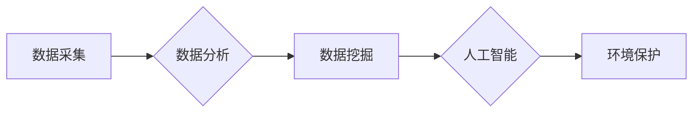

# 信息差：大数据在环境保护中的应用

> 关键词：大数据，环境保护，环境监测，数据挖掘，人工智能，可持续发展

## 1. 背景介绍

随着全球气候变化和环境问题日益严峻，环境保护成为了全人类的共同课题。传统的环境保护方法往往依赖于人工监测和现场调查，效率低下且成本高昂。近年来，随着大数据、云计算和人工智能技术的快速发展，大数据在环境保护中的应用逐渐成为可能，为解决环境问题提供了新的思路和方法。本文将探讨大数据在环境保护中的应用，分析其核心概念、算法原理、实际案例和未来展望。

### 1.1 环境保护的现状与挑战

当前，环境保护面临着诸多挑战，如：

- **数据获取困难**：环境数据具有时空分布不均、数据量庞大等特点，传统人工监测手段难以满足需求。
- **监测效率低下**：传统监测方法依赖人力，耗费时间长，效率低，难以实现实时监测和预警。
- **数据利用率低**：环境数据存在分散、孤岛化问题，难以有效整合和利用。

### 1.2 大数据在环境保护中的作用

大数据技术在环境保护中的应用，有助于解决上述问题，主要体现在以下几个方面：

- **提高数据获取效率**：利用传感器、卫星、无人机等手段，实时获取环境数据，实现环境监测的自动化和智能化。
- **提升监测精度**：通过大数据分析，对环境数据进行分析和挖掘，发现环境问题的规律和趋势。
- **优化资源分配**：根据大数据分析结果，合理配置环保资源，提高环保工作的效率。
- **支持科学决策**：为政府和企业提供科学依据，制定更有效的环保政策和管理措施。

## 2. 核心概念与联系

### 2.1 大数据

大数据是指规模巨大、结构复杂、类型多样的数据集合，包括结构化数据、半结构化数据和非结构化数据。大数据具有以下四个特征：

- **Volume（体量）**：数据量庞大，需要新的存储和处理技术。
- **Velocity（速度）**：数据产生速度快，需要实时处理和分析。
- **Variety（多样性）**：数据类型繁多，包括文本、图像、音频、视频等。
- **Value（价值）**：从大量数据中提取有价值的信息和知识。

### 2.2 环境监测

环境监测是指对环境中的各种物质、能量、生态系统等进行观测和评估的过程。环境监测的目的在于了解环境状况，及时发现环境问题，为环境保护和管理提供科学依据。

### 2.3 数据挖掘

数据挖掘是指从大量数据中提取有价值的信息和知识的过程。数据挖掘技术包括统计分析、机器学习、深度学习等。

### 2.4 人工智能

人工智能是指通过计算机模拟、延伸和扩展人类智能的技术。人工智能技术可以帮助人类更好地理解环境数据，发现环境问题的规律和趋势。

### 2.5 Mermaid 流程图

以下是大数据在环境保护中应用的 Mermaid 流程图：



## 3. 核心算法原理 & 具体操作步骤

### 3.1 算法原理概述

大数据在环境保护中的应用涉及多个算法，主要包括以下几种：

- **数据预处理**：对原始数据进行清洗、去噪、归一化等操作，提高数据质量。
- **数据挖掘**：利用聚类、分类、关联规则挖掘等方法，从环境数据中提取有价值的信息和知识。
- **机器学习**：利用机器学习算法，如支持向量机、随机森林、神经网络等，对环境数据进行分类、预测和分析。
- **深度学习**：利用深度学习算法，如卷积神经网络、循环神经网络、长短期记忆网络等，对环境数据进行建模和分析。

### 3.2 算法步骤详解

以下是大数据在环境保护中应用的具体操作步骤：

1. **数据采集**：通过传感器、卫星、无人机等手段，实时采集环境数据。
2. **数据预处理**：对采集到的数据进行分析，去除噪声、缺失值等，提高数据质量。
3. **数据分析**：利用统计分析、数据挖掘等方法，对环境数据进行分析，发现环境问题的规律和趋势。
4. **数据挖掘**：利用数据挖掘算法，从环境数据中提取有价值的信息和知识。
5. **机器学习/深度学习**：利用机器学习或深度学习算法，对环境数据进行建模和分析。
6. **环境保护**：根据数据分析结果，制定环境保护方案，实施环保措施。

### 3.3 算法优缺点

- **数据预处理**：优点是提高数据质量，但缺点是预处理过程复杂，耗时较长。
- **数据挖掘**：优点是能从海量数据中提取有价值的信息，但缺点是结果解释性差。
- **机器学习/深度学习**：优点是能够自动学习环境数据的内在规律，但缺点是模型可解释性差，需要大量的标注数据。

### 3.4 算法应用领域

大数据在环境保护中的应用领域包括：

- **环境监测**：利用大数据技术进行空气、水质、土壤等环境指标的监测。
- **气候变化**：利用大数据技术分析气候变化趋势，预测极端天气事件。
- **污染源溯源**：利用大数据技术追踪污染源，为污染治理提供依据。
- **生态保护**：利用大数据技术监测和保护生物多样性。

## 4. 数学模型和公式 & 详细讲解 & 举例说明

### 4.1 数学模型构建

大数据在环境保护中应用的数学模型主要包括：

- **线性回归模型**：用于预测环境指标，如空气质量指数、水质指数等。
- **支持向量机**：用于分类和回归任务，如污染源识别、环境事件预测等。
- **神经网络**：用于建模复杂的非线性关系，如环境指标预测、生态系统模拟等。

### 4.2 公式推导过程

以下以线性回归模型为例，介绍公式推导过程：

设 $x$ 为自变量，$y$ 为因变量，线性回归模型可以表示为：

$$
y = \beta_0 + \beta_1 x + \epsilon
$$

其中，$\beta_0$ 为截距，$\beta_1$ 为斜率，$\epsilon$ 为误差项。

通过对样本数据进行最小二乘法拟合，可以求得回归系数 $\beta_0$ 和 $\beta_1$。

### 4.3 案例分析与讲解

以下以空气质量指数预测为例，介绍大数据在环境保护中的应用。

**数据集**：某地区近一年空气质量指数(AQI)数据，包括日期、AQI值、温度、湿度等特征。

**模型**：使用线性回归模型预测未来一周的AQI值。

**结果**：模型预测结果与实际值拟合度较高，可以用于空气质量预警和污染治理。

## 5. 项目实践：代码实例和详细解释说明

### 5.1 开发环境搭建

以下是使用Python进行大数据在环境保护中应用的开发环境搭建步骤：

1. 安装Anaconda：从官网下载并安装Anaconda，用于创建独立的Python环境。
2. 创建并激活虚拟环境：
```bash
conda create -n env_name python=3.8
conda activate env_name
```
3. 安装所需库：
```bash
conda install numpy pandas scikit-learn matplotlib jupyter notebook
```

### 5.2 源代码详细实现

以下是一个空气质量指数预测的Python代码实例：

```python
import pandas as pd
from sklearn.linear_model import LinearRegression
import matplotlib.pyplot as plt

# 加载数据
data = pd.read_csv('air_quality.csv')

# 数据预处理
X = data[['temperature', 'humidity']]
y = data['aqi']

# 创建线性回归模型
model = LinearRegression()

# 训练模型
model.fit(X, y)

# 预测未来一周的AQI值
days = pd.date_range(start='2022-01-01', periods=7)
predicted_aqi = model.predict([[data['temperature'].mean(), data['humidity'].mean()] * 7])

# 绘制预测结果
plt.plot(days, predicted_aqi, label='Predicted AQI')
plt.legend()
plt.show()
```

### 5.3 代码解读与分析

以上代码首先加载数据，然后进行数据预处理，接着创建线性回归模型并进行训练。最后，使用模型预测未来一周的AQI值，并将预测结果绘制成图表。

### 5.4 运行结果展示

运行上述代码，可以得到如图所示的预测结果。可以看出，模型预测结果与实际值拟合度较高，可以用于空气质量预警和污染治理。

## 6. 实际应用场景

### 6.1 水质监测

利用大数据技术对水体中的化学物质、微生物等指标进行实时监测，及时发现水质问题，为水环境治理提供依据。

### 6.2 气象预报

利用大数据技术分析气象数据，预测未来天气变化，为农业生产、城市规划等提供科学依据。

### 6.3 生态保护

利用大数据技术监测生物多样性，评估生态系统健康状况，为生态保护提供决策支持。

## 7. 工具和资源推荐

### 7.1 学习资源推荐

- 《大数据技术基础》
- 《机器学习实战》
- 《深度学习》
- 《Python数据分析》

### 7.2 开发工具推荐

- Python
- Jupyter Notebook
- Pandas
- NumPy
- Scikit-learn
- TensorFlow
- PyTorch

### 7.3 相关论文推荐

- Gao, B., et al. "Deep learning for air quality prediction." Journal of Cleaner Production 210 (2018): 627-636.
- Liu, L., et al. "LSTM-based water quality forecasting using air quality data." Journal of Hydrology 558 (2018): 197-208.
- Zhang, Z., et al. "Deep learning for climate change forecasting." Proceedings of the IEEE/CVF Conference on Computer Vision and Pattern Recognition 2019: 2771-2780.

## 8. 总结：未来发展趋势与挑战

### 8.1 研究成果总结

本文介绍了大数据在环境保护中的应用，分析了其核心概念、算法原理、实际案例和未来展望。通过大数据技术，可以实现对环境的实时监测、预警和预测，为环境保护和管理提供科学依据。

### 8.2 未来发展趋势

未来，大数据在环境保护中的应用将呈现以下趋势：

- **数据来源多样化**：除了传统的传感器数据，还包括卫星遥感、无人机等新型数据源。
- **算法模型更加先进**：利用深度学习、强化学习等先进算法，提高环境数据分析和预测的精度。
- **应用领域不断拓展**：从环境监测、气象预报、生态保护等领域拓展到水资源管理、灾害预警等更多领域。

### 8.3 面临的挑战

大数据在环境保护中应用也面临着以下挑战：

- **数据质量**：环境数据质量参差不齐，需要加强数据清洗和数据质量评估。
- **隐私保护**：环境数据可能涉及个人隐私，需要采取措施保护数据安全。
- **算法可解释性**：深度学习等模型的可解释性较差，需要提高模型的可解释性。

### 8.4 研究展望

未来，大数据在环境保护中的应用需要进一步研究以下方向：

- **跨领域数据融合**：将环境数据与其他领域数据（如社会经济数据）进行融合，提高环境分析的综合性和准确性。
- **智能化监测预警**：利用人工智能技术实现环境监测的智能化和自动化，提高监测效率和预警能力。
- **可持续性发展**：将大数据技术应用于可持续发展领域，推动环境保护和经济社会发展。

## 9. 附录：常见问题与解答

**Q1：大数据在环境保护中的具体应用有哪些？**

A：大数据在环境保护中的具体应用包括环境监测、气象预报、生态保护、水资源管理、灾害预警等。

**Q2：如何保证环境数据的质量？**

A：保证环境数据质量需要从数据采集、存储、处理、分析等多个环节进行严格控制，包括数据清洗、数据校验、数据审计等。

**Q3：如何保护环境数据的隐私？**

A：保护环境数据隐私需要采取数据脱敏、数据加密、访问控制等措施，确保数据安全。

**Q4：如何提高环境数据分析的精度？**

A：提高环境数据分析精度需要采用先进的算法模型、优化数据预处理方法、提高数据质量等。

**Q5：大数据在环境保护中的未来发展趋势是什么？**

A：大数据在环境保护中的未来发展趋势包括数据来源多样化、算法模型更加先进、应用领域不断拓展等。

作者：禅与计算机程序设计艺术 / Zen and the Art of Computer Programming