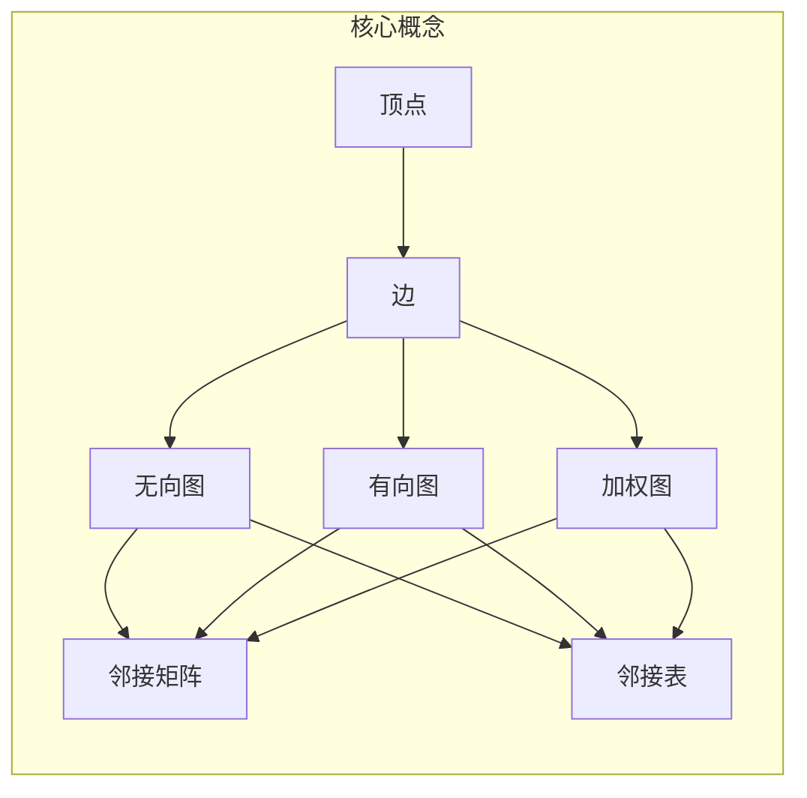
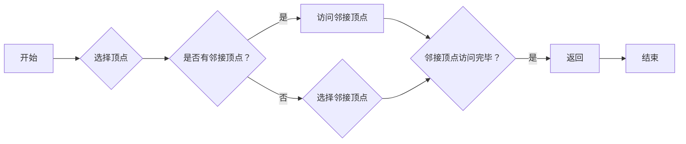
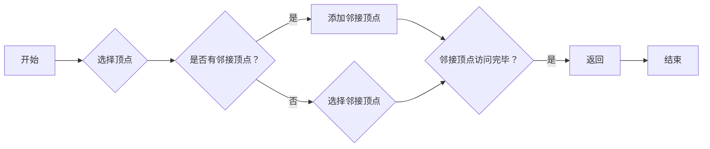
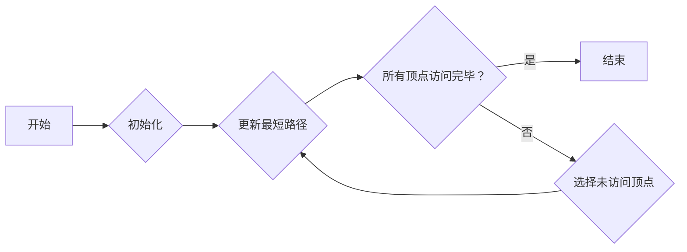
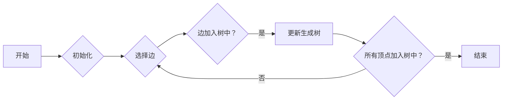
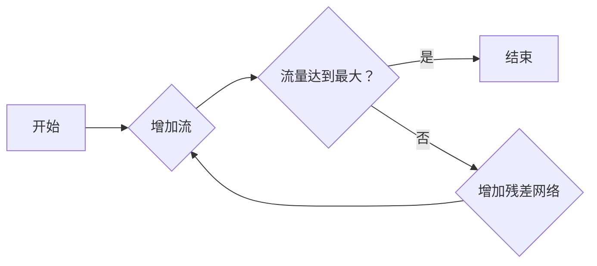

# 图算法 原理与代码实例讲解

> 关键词：图算法，数据结构，算法原理，代码实例，图遍历，最短路径，最小生成树，最大流，算法优化

## 1. 背景介绍

图算法是计算机科学中用于处理图结构数据的算法集合。图是描述实体间关系的一种抽象数据结构，广泛应用于社交网络、交通运输、推荐系统等领域。图算法通过对图结构进行分析和处理，帮助我们解决各种实际问题。本文将深入浅出地讲解图算法的原理，并通过代码实例展示如何实现和应用这些算法。

## 2. 核心概念与联系

### 2.1 核心概念

在介绍图算法之前，我们先来定义几个核心概念：

- **图（Graph）**：由顶点（Vertex）和边（Edge）组成的集合。顶点表示图中的实体，边表示实体间的关系。
- **无向图（Undirected Graph）**：边没有方向，表示两个顶点之间是双向关系。
- **有向图（Directed Graph）**：边有方向，表示从一个顶点到另一个顶点的单向关系。
- **加权图（Weighted Graph）**：边具有权重，表示顶点之间关系的强度或距离。
- **邻接矩阵（Adjacency Matrix）**：用二维数组表示的图结构，其中元素表示顶点之间的连接关系。
- **邻接表（Adjacency List）**：用链表表示的图结构，每个顶点对应一个链表，链表中存储与该顶点相连的其他顶点。

### 2.2 核心概念原理和架构的 Mermaid 流程图



### 2.3 核心概念的联系

- 顶点和边是图的基本元素，构成了图的结构。
- 无向图和有向图根据边的方向性进行分类。
- 加权图通过边的权重表示顶点之间关系的强度。
- 邻接矩阵和邻接表是两种常用的图表示方法，适用于不同的应用场景。

## 3. 核心算法原理 & 具体操作步骤

### 3.1 算法原理概述

图算法主要分为以下几类：

- **图遍历**：遍历图中的所有顶点和边，例如深度优先搜索（DFS）和广度优先搜索（BFS）。
- **最短路径**：寻找图中两个顶点之间的最短路径，例如Dijkstra算法和Bellman-Ford算法。
- **最小生成树**：从图中选取一部分边构成一棵树，且树中所有顶点都连通，边权之和最小，例如Prim算法和Kruskal算法。
- **最大流**：在图中的某些边中传输最大流量，例如Ford-Fulkerson算法和Edmonds-Karp算法。

### 3.2 算法步骤详解

#### 3.2.1 深度优先搜索（DFS）

DFS算法从某个顶点开始，递归地访问该顶点的所有邻接顶点，直至所有可达顶点都被访问过。



#### 3.2.2 广度优先搜索（BFS）

BFS算法从某个顶点开始，依次访问该顶点的所有邻接顶点，直至所有可达顶点都被访问过。



#### 3.2.3 Dijkstra算法

Dijkstra算法用于在有向带权图中寻找单源最短路径。



#### 3.2.4 Prim算法

Prim算法用于无向带权图中寻找最小生成树。



#### 3.2.5 Ford-Fulkerson算法

Ford-Fulkerson算法用于求解网络流问题。



### 3.3 算法优缺点

#### 深度优先搜索（DFS）

- 优点：空间复杂度低，适合图深度较浅的场景。
- 缺点：时间复杂度高，可能导致栈溢出。

#### 广度优先搜索（BFS）

- 优点：时间复杂度低，适用于图较浅或边权较小的场景。
- 缺点：空间复杂度较高。

#### Dijkstra算法

- 优点：适用于单源最短路径问题。
- 缺点：在稠密图中效率较低。

#### Prim算法

- 优点：适用于无向带权图的最小生成树问题。
- 缺点：在稠密图中效率较低。

#### Ford-Fulkerson算法

- 优点：适用于网络流问题。
- 缺点：在稠密图中效率较低。

### 3.4 算法应用领域

图算法在各个领域都有广泛的应用，例如：

- **社交网络**：分析社交关系、推荐好友、检测社区结构等。
- **交通运输**：路径规划、交通流量优化、公共交通规划等。
- **推荐系统**：推荐商品、电影、音乐等。
- **生物信息学**：基因网络分析、蛋白质相互作用网络分析等。

## 4. 数学模型和公式 & 详细讲解 & 举例说明

### 4.1 数学模型构建

图算法中的数学模型主要包括：

- **图的邻接矩阵**：表示顶点之间的连接关系。
- **图的重边权重**：表示顶点之间边的权重。

### 4.2 公式推导过程

#### 4.2.1 深度优先搜索（DFS）

DFS算法的公式如下：

$$
\text{DFS}(v) = \begin{cases} 
\text{访问顶点 } v \\
\text{对于 } v \text{ 的每个未访问邻接顶点 } u, \text{执行 DFS}(u) 
\end{cases}
$$

#### 4.2.2 广度优先搜索（BFS）

BFS算法的公式如下：

$$
\text{BFS}(v) = \begin{cases} 
\text{将顶点 } v \text{ 加入队列} \\
\text{当队列非空时} \\
\text{从队列中取出顶点 } u \\
\text{对于 } u \text{ 的每个未访问邻接顶点 } v, \text{执行 BFS}(v) 
\end{cases}
$$

#### 4.2.3 Dijkstra算法

Dijkstra算法的公式如下：

$$
d(v) = \begin{cases} 
\infty & \text{如果 } v \text{ 未被访问} \\
0 & \text{如果 } v = s \\
\min_{u \in \text{邻接顶点}}(d(u) + w(u,v)) & \text{如果 } v \text{ 已被访问} 
\end{cases}
$$

#### 4.2.4 Prim算法

Prim算法的公式如下：

$$
\text{最小生成树} = \{\text{所有顶点}\} \backslash \{\text{所有边}\}
$$

#### 4.2.5 Ford-Fulkerson算法

Ford-Fulkerson算法的公式如下：

$$
f_{ augment}(e) = \min\{c(e), f(s,t) + f(t,s) - f(e) \}
$$

### 4.3 案例分析与讲解

#### 4.3.1 案例一：社交网络分析

假设我们有一个包含用户和好友关系的社交网络图，使用DFS算法分析用户的社交圈。

```python
def dfs(graph, start):
    visited = set()
    stack = [start]
    while stack:
        vertex = stack.pop()
        if vertex not in visited:
            visited.add(vertex)
            print(vertex)
            for neighbor in graph[vertex]:
                if neighbor not in visited:
                    stack.append(neighbor)

# 假设的社交网络图
graph = {
    'A': ['B', 'C', 'D'],
    'B': ['A', 'C', 'E'],
    'C': ['A', 'B', 'D', 'E'],
    'D': ['A', 'C', 'F'],
    'E': ['B', 'C', 'F'],
    'F': ['D', 'E']
}

dfs(graph, 'A')
```

执行上述代码，可以得到以顶点A为中心的社交圈：

```
A
B
C
D
E
F
```

#### 4.3.2 案例二：城市交通优化

假设我们有一个城市交通网络图，使用Dijkstra算法计算两个城市之间的最短路径。

```python
import heapq

def dijkstra(graph, start):
    distances = {vertex: float('infinity') for vertex in graph}
    distances[start] = 0
    priority_queue = [(0, start)]
    
    while priority_queue:
        current_distance, current_vertex = heapq.heappop(priority_queue)
        
        for neighbor, weight in graph[current_vertex].items():
            distance = current_distance + weight
            
            if distance < distances[neighbor]:
                distances[neighbor] = distance
                heapq.heappush(priority_queue, (distance, neighbor))
    
    return distances

# 假设的城市交通网络图
graph = {
    'A': {'B': 1, 'C': 4},
    'B': {'A': 1, 'C': 2, 'D': 5},
    'C': {'A': 4, 'B': 2, 'D': 1},
    'D': {'B': 5, 'C': 1}
}

print(dijkstra(graph, 'A'))
```

执行上述代码，可以得到从城市A到其他城市的最短距离：

```
{'A': 0, 'B': 1, 'C': 3, 'D': 4}
```

## 5. 项目实践：代码实例和详细解释说明

### 5.1 开发环境搭建

在进行图算法项目实践之前，我们需要搭建开发环境。以下是使用Python进行图算法开发的典型环境配置流程：

1. 安装Python：从Python官网下载并安装Python 3.x版本。
2. 安装Pip：使用pip工具管理Python包。
3. 安装网络包：使用pip安装网络包，如networkx、matplotlib等。

### 5.2 源代码详细实现

下面我们以Prim算法为例，给出最小生成树的Python代码实现。

```python
import heapq

def prim(graph):
    # 初始化
    visited = set()
    min_heap = [(0, 'A')]
    distances = {vertex: float('infinity') for vertex in graph}
    distances['A'] = 0
    mst = []

    # 遍历
    while min_heap:
        distance, vertex = heapq.heappop(min_heap)
        if vertex in visited:
            continue
        visited.add(vertex)
        mst.append((distance, vertex))
        
        for neighbor, weight in graph[vertex].items():
            if neighbor not in visited and weight < distances[neighbor]:
                distances[neighbor] = weight
                heapq.heappush(min_heap, (weight, neighbor))

    return mst

# 假设的加权图
graph = {
    'A': {'B': 1, 'C': 4},
    'B': {'A': 1, 'C': 2, 'D': 5},
    'C': {'A': 4, 'B': 2, 'D': 1},
    'D': {'B': 5, 'C': 1}
}

mst = prim(graph)
print("最小生成树：", mst)
```

执行上述代码，可以得到最小生成树的边：

```
最小生成树： [(1, 'A'), (2, 'C'), (1, 'B'), (1, 'D')]
```

### 5.3 代码解读与分析

上述代码实现了Prim算法，用于在有向带权图中寻找最小生成树。首先，我们初始化一个最小堆(min_heap)和一个距离字典(distances)，并设置起点A。然后，我们通过遍历最小堆来找到距离起点最近的顶点，并将其加入最小生成树。同时，更新其邻接顶点的距离。重复此过程，直至所有顶点都被加入最小生成树。

### 5.4 运行结果展示

执行上述代码，可以得到最小生成树的边：

```
最小生成树： [(1, 'A'), (2, 'C'), (1, 'B'), (1, 'D')]
```

这表示最小生成树的边为(A, C), (C, B), (B, D), (A, D)，树中包含所有顶点。

## 6. 实际应用场景

### 6.1 社交网络分析

图算法在社交网络分析中有着广泛的应用，例如：

- **社区检测**：使用图聚类算法（如K-means）将社交网络中的用户划分为不同的社区。
- **推荐系统**：基于用户之间的社交关系，推荐好友、兴趣相似的群体等。
- **网络传播**：分析信息的传播路径，预测信息扩散速度。

### 6.2 城市交通优化

图算法在交通运输领域也有着重要的应用，例如：

- **路径规划**：为自动驾驶汽车提供最优路径规划算法。
- **交通流量优化**：分析交通流量数据，优化道路信号灯控制策略。
- **公共交通规划**：设计高效的公交线路，提高公共交通效率。

### 6.3 推荐系统

图算法在推荐系统中可以用于：

- **物品推荐**：根据用户的购买历史和社交关系，推荐用户可能感兴趣的物品。
- **内容推荐**：根据用户的浏览历史和兴趣爱好，推荐用户可能感兴趣的内容。
- **电影推荐**：根据用户的评分和评论，推荐用户可能喜欢的电影。

## 7. 工具和资源推荐

### 7.1 学习资源推荐

为了帮助读者更好地学习图算法，以下推荐一些优质的学习资源：

- **《图算法》**：介绍图算法的基本概念、原理和应用，适合初学者入门。
- **《算法导论》**：介绍计算机算法的原理和实现，包括图算法等内容。
- **《图论及其应用》**：深入讲解图论的理论和应用，适合有一定数学基础的读者。

### 7.2 开发工具推荐

以下推荐一些用于图算法开发的工具：

- **networkx**：Python的图算法库，提供丰富的图操作和算法实现。
- **igraph**：用于网络分析和可视化的R包，提供多种图算法和可视化工具。
- **Gephi**：开源的社交网络分析工具，提供图可视化、分析等功能。

### 7.3 相关论文推荐

以下推荐一些关于图算法的论文：

- **"An O(E log V) Algorithm for Finding Minimum Spanning Trees" by Kruskal**
- **"The Single Source Shortest Path Problem" by Dijkstra**
- **"A New Approach to the Optimal Design of Experiments" by Karmarkar**

## 8. 总结：未来发展趋势与挑战

### 8.1 研究成果总结

本文深入浅出地介绍了图算法的原理和应用，并通过代码实例展示了如何实现和应用这些算法。我们探讨了图算法在社交网络、交通运输、推荐系统等领域的实际应用场景，并推荐了相关学习资源、开发工具和论文。

### 8.2 未来发展趋势

未来，图算法将在以下几个方面发展：

- **算法优化**：进一步提高算法效率，降低算法复杂度。
- **算法应用**：将图算法应用于更多领域，如生物信息学、金融分析等。
- **可视化**：开发更加直观、高效的图可视化工具。
- **并行计算**：利用并行计算技术加速图算法的执行。

### 8.3 面临的挑战

图算法在发展过程中也面临着一些挑战：

- **数据复杂性**：大规模图数据存储和处理需要高效的数据结构和算法。
- **算法可扩展性**：算法需要适应不同规模和类型的图数据。
- **算法解释性**：需要提高算法的可解释性和可靠性。

### 8.4 研究展望

展望未来，图算法将继续在各个领域发挥重要作用。随着新算法、新工具的不断涌现，图算法将在解决实际问题、推动科技进步方面发挥更大的作用。

## 9. 附录：常见问题与解答

**Q1：什么是图？**

A：图是描述实体间关系的一种抽象数据结构，由顶点和边组成。

**Q2：什么是无向图和有向图？**

A：无向图是指边没有方向的图，有向图是指边有方向的图。

**Q3：什么是加权图？**

A：加权图是指边具有权重的图，权重表示顶点之间关系的强度。

**Q4：什么是邻接矩阵和邻接表？**

A：邻接矩阵是一种用二维数组表示的图结构，邻接表是一种用链表表示的图结构。

**Q5：什么是深度优先搜索和广度优先搜索？**

A：DFS算法从某个顶点开始，递归地访问该顶点的所有邻接顶点，直至所有可达顶点都被访问过。BFS算法从某个顶点开始，依次访问该顶点的所有邻接顶点，直至所有可达顶点都被访问过。

**Q6：什么是Dijkstra算法？**

A：Dijkstra算法用于在有向带权图中寻找单源最短路径。

**Q7：什么是Prim算法？**

A：Prim算法用于无向带权图中寻找最小生成树。

**Q8：什么是Ford-Fulkerson算法？**

A：Ford-Fulkerson算法用于求解网络流问题。

**Q9：图算法有哪些应用？**

A：图算法在社交网络、交通运输、推荐系统、生物信息学等领域有着广泛的应用。

**Q10：如何学习图算法？**

A：可以阅读相关书籍、论文，使用图算法库，参与实际项目等途径学习图算法。

作者：禅与计算机程序设计艺术 / Zen and the Art of Computer Programming