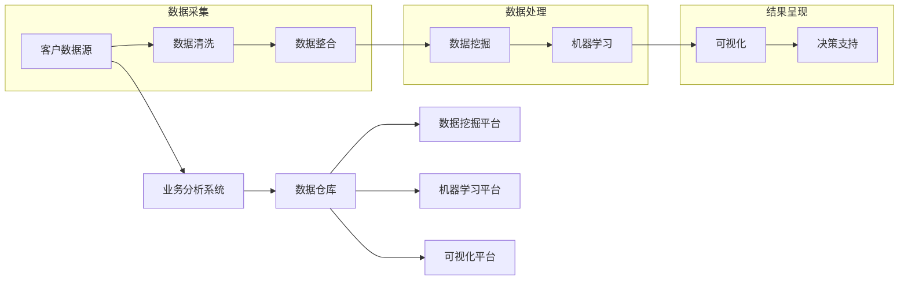

# 基于大数据的某省政企客户业务分析系统

> 关键词：大数据分析，政企客户，业务分析，数据挖掘，机器学习，可视化，决策支持

## 1. 背景介绍

随着信息技术的飞速发展，数据已成为现代社会的重要资产。对于政府和企业来说，如何有效地利用大数据来分析和理解政企客户的行为和需求，成为提升服务质量和效率的关键。本文将介绍一个基于大数据的某省政企客户业务分析系统，通过数据挖掘、机器学习和可视化技术，为政府和企业提供精准的决策支持。

### 1.1 问题的由来

在信息化时代，政企客户的需求日益多样化和复杂化，传统的业务分析方法难以满足实际需求。同时，随着大数据技术的成熟，政府和企业拥有海量的客户数据，但如何有效地利用这些数据成为一大挑战。

### 1.2 研究现状

目前，国内外已有多家企业和研究机构开展了政企客户业务分析的研究，主要集中在以下几个方面：

- **数据挖掘**：通过挖掘客户数据中的潜在模式和关联规则，发现客户行为和需求的特点。
- **机器学习**：利用机器学习算法对客户数据进行训练和预测，实现精准营销和个性化服务。
- **可视化**：通过数据可视化技术将复杂的数据转化为直观的图表和图形，方便用户理解和决策。

### 1.3 研究意义

开展政企客户业务分析研究，对于政府和企业具有重要的意义：

- **提高服务效率**：通过分析客户数据，了解客户需求，优化服务流程，提高服务效率。
- **降低运营成本**：通过预测客户行为，实现精准营销，降低营销成本。
- **提升客户满意度**：通过个性化服务，提升客户满意度，增强客户粘性。
- **辅助决策支持**：为政府和企业提供数据驱动的决策支持，提高决策的科学性和准确性。

## 2. 核心概念与联系

### 2.1 核心概念

- **大数据**：指规模巨大、类型繁多、价值密度低的数据集合。
- **数据挖掘**：从大量的、不完全的、有噪声的、模糊的、随机的实际应用数据中，提取隐含在其中的、人们事先不知道的、但又是潜在有用的信息和知识的过程。
- **机器学习**：使计算机系统从数据中学习，从而获得对数据的理解，并利用这种理解来预测或决策的技术。
- **可视化**：通过图形、图像等方式将数据转化为直观的视觉信息，方便用户理解和分析。

### 2.2 核心概念原理和架构的 Mermaid 流程图



### 2.3 核心概念联系

政企客户业务分析系统通过数据采集、处理、呈现和决策支持等环节，实现从数据到价值的转化。数据采集环节从各种数据源获取客户数据，经过数据清洗和整合后，进入数据处理环节。在数据处理环节，通过数据挖掘和机器学习技术提取有价值的信息，并通过可视化技术呈现给用户。最终，为用户提供决策支持，辅助政府和企业做出更科学的决策。

## 3. 核心算法原理 & 具体操作步骤

### 3.1 算法原理概述

政企客户业务分析系统主要涉及以下算法：

- **数据挖掘算法**：如关联规则挖掘、聚类分析、分类算法等。
- **机器学习算法**：如线性回归、逻辑回归、决策树、支持向量机、神经网络等。

### 3.2 算法步骤详解

1. **数据采集**：从各种数据源（如CRM系统、ERP系统、社交媒体等）采集客户数据。
2. **数据清洗**：对采集到的数据进行去重、填补缺失值、异常值处理等操作，确保数据质量。
3. **数据整合**：将来自不同数据源的数据进行整合，形成统一的数据视图。
4. **数据挖掘**：使用关联规则挖掘、聚类分析等方法，发现客户数据中的潜在模式和关联规则。
5. **机器学习**：使用机器学习算法对客户数据进行训练和预测，实现精准营销和个性化服务。
6. **可视化**：将挖掘和预测结果通过图表、图形等形式进行可视化展示。
7. **决策支持**：为用户提供数据驱动的决策支持，辅助政府和企业做出更科学的决策。

### 3.3 算法优缺点

#### 数据挖掘算法

**优点**：

- 可以发现数据中的隐含模式和关联规则。
- 可以用于预测和分析客户行为。

**缺点**：

- 数据挖掘结果可能存在噪声和偏差。
- 数据挖掘算法的计算复杂度高。

#### 机器学习算法

**优点**：

- 可以实现精准的预测和分类。
- 可以处理非线性关系。

**缺点**：

- 需要大量的训练数据。
- 算法选择和调参复杂。

### 3.4 算法应用领域

- **精准营销**：通过分析客户数据，实现精准营销，提高营销效率。
- **客户关系管理**：通过分析客户数据，了解客户需求，提升客户满意度。
- **风险控制**：通过分析客户数据，识别潜在风险，降低风险损失。
- **供应链管理**：通过分析客户数据，优化供应链管理，降低运营成本。

## 4. 数学模型和公式 & 详细讲解 & 举例说明

### 4.1 数学模型构建

政企客户业务分析系统中的数学模型主要包括以下几种：

- **关联规则挖掘**：支持度、置信度等。
- **聚类分析**：K-means、层次聚类等。
- **分类算法**：逻辑回归、决策树、支持向量机、神经网络等。

### 4.2 公式推导过程

以逻辑回归为例，其目标函数如下：

$$
L(\theta) = -\frac{1}{N} \sum_{i=1}^N [y_i \log(\hat{y}_i) + (1-y_i) \log(1-\hat{y}_i)]
$$

其中，$y_i$ 为真实标签，$\hat{y}_i$ 为预测标签，$\theta$ 为模型参数。

### 4.3 案例分析与讲解

假设我们有一家电信公司，希望通过分析客户数据，预测客户流失率。我们可以使用逻辑回归模型进行预测。

首先，收集客户数据，包括年龄、性别、使用时长、套餐类型、消费金额等特征。

然后，将数据划分为训练集和测试集。

接下来，使用训练集对逻辑回归模型进行训练。

最后，使用测试集评估模型的预测效果。

## 5. 项目实践：代码实例和详细解释说明

### 5.1 开发环境搭建

- **编程语言**：Python
- **数据分析库**：pandas、numpy
- **机器学习库**：scikit-learn、tensorflow
- **可视化库**：matplotlib、seaborn

### 5.2 源代码详细实现

以下是一个使用Python和scikit-learn实现逻辑回归模型的简单例子：

```python
import pandas as pd
from sklearn.model_selection import train_test_split
from sklearn.linear_model import LogisticRegression

# 读取数据
data = pd.read_csv('customer_data.csv')

# 划分特征和标签
X = data.drop('流失', axis=1)
y = data['流失']

# 划分训练集和测试集
X_train, X_test, y_train, y_test = train_test_split(X, y, test_size=0.2, random_state=42)

# 创建逻辑回归模型
model = LogisticRegression()

# 训练模型
model.fit(X_train, y_train)

# 预测测试集
y_pred = model.predict(X_test)

# 评估模型
score = model.score(X_test, y_test)
print(f"测试集准确率：{score:.2f}")
```

### 5.3 代码解读与分析

- `pandas` 用于读取和处理数据。
- `scikit-learn` 用于创建逻辑回归模型、划分数据集、训练模型和评估模型。
- `train_test_split` 函数用于将数据划分为训练集和测试集。
- `LogisticRegression` 类用于创建逻辑回归模型。
- `fit` 方法用于训练模型。
- `predict` 方法用于预测测试集。
- `score` 方法用于评估模型的准确率。

### 5.4 运行结果展示

假设测试集准确率为90%，说明该逻辑回归模型对客户流失率的预测效果较好。

## 6. 实际应用场景

### 6.1 精准营销

通过对客户数据进行分析，可以识别出高价值客户和潜在客户，并针对不同客户群体制定个性化的营销策略。

### 6.2 客户关系管理

通过对客户数据进行分析，可以了解客户需求，提升客户满意度，增强客户粘性。

### 6.3 风险控制

通过对客户数据进行分析，可以识别出潜在风险，采取相应的措施降低风险损失。

### 6.4 供应链管理

通过对客户数据进行分析，可以优化供应链管理，降低运营成本。

## 7. 工具和资源推荐

### 7.1 学习资源推荐

- 《数据挖掘：实用机器学习技术》（《Data Mining: Concepts and Techniques》）
- 《Python数据科学手册》（《Python Data Science Handbook》）
- 《机器学习实战》（《Machine Learning in Action》）
- 《数据可视化：设计思维与工具》（《Designing Data Visualizations》）

### 7.2 开发工具推荐

- **数据分析库**：pandas、numpy
- **机器学习库**：scikit-learn、tensorflow
- **可视化库**：matplotlib、seaborn
- **大数据平台**：Hadoop、Spark
- **数据库**：MySQL、MongoDB

### 7.3 相关论文推荐

- 《Anomaly Detection: A Survey》
- 《Learning Representations for Counterfactual Explanations》
- 《Causal Inference in Statistics: A Primer》
- 《Visualizing the Invisible》

## 8. 总结：未来发展趋势与挑战

### 8.1 研究成果总结

本文介绍了基于大数据的某省政企客户业务分析系统，从数据采集、处理、呈现和决策支持等环节，实现了从数据到价值的转化。通过数据挖掘、机器学习和可视化技术，为政府和企业提供了精准的决策支持。

### 8.2 未来发展趋势

- **数据挖掘和机器学习算法的不断创新**：随着深度学习等技术的发展，未来将涌现更多高效、智能的数据挖掘和机器学习算法。
- **跨领域技术的融合**：将大数据分析、机器学习、可视化等技术与其他领域的技术（如区块链、物联网等）进行融合，实现更广泛的应用场景。
- **人机协同**：结合人工智能和人类专家的知识和经验，实现更智能的业务分析。

### 8.3 面临的挑战

- **数据安全问题**：如何确保数据安全和隐私，是大数据分析面临的一大挑战。
- **算法可解释性**：如何提高算法的可解释性，使决策过程更加透明，是机器学习面临的一大挑战。
- **跨领域知识融合**：如何将不同领域的技术进行有效融合，实现跨领域的业务分析，是未来的一大挑战。

### 8.4 研究展望

随着大数据技术的不断发展，政企客户业务分析系统将在未来发挥越来越重要的作用。未来，我们将继续探索以下研究方向：

- **数据安全和隐私保护**：研究更加安全、可靠的数据分析技术，保护客户隐私。
- **算法可解释性**：提高算法的可解释性，使决策过程更加透明、可靠。
- **跨领域知识融合**：探索跨领域知识的融合方法，实现更广泛的应用场景。

## 9. 附录：常见问题与解答

**Q1：大数据分析在政企客户业务分析中有什么作用？**

A：大数据分析可以帮助政府和企业了解客户需求，优化服务流程，提高服务效率，降低运营成本，提升客户满意度。

**Q2：如何确保数据安全和隐私？**

A：可以采用数据脱敏、数据加密、访问控制等技术，确保数据安全和隐私。

**Q3：如何提高算法的可解释性？**

A：可以采用可解释机器学习（XAI）技术，提高算法的可解释性。

**Q4：如何将不同领域的技术进行融合？**

A：需要深入研究不同领域的技术，探索适合不同场景的融合方法。

作者：禅与计算机程序设计艺术 / Zen and the Art of Computer Programming