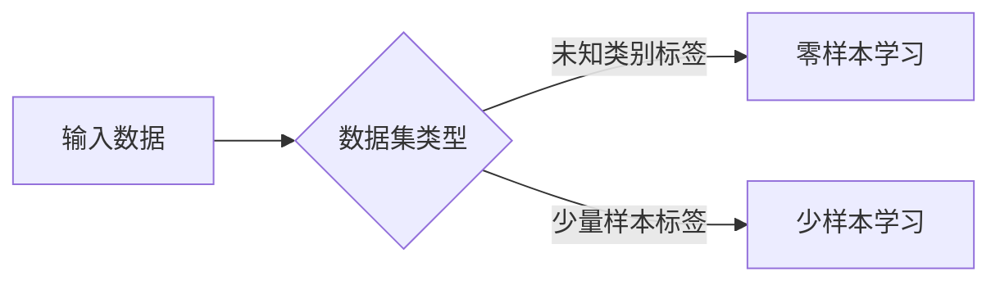

# 基于深度学习的零样本和少样本学习

> 关键词：零样本学习，少样本学习，深度学习，迁移学习，元学习，数据高效，领域自适应

## 1. 背景介绍

随着深度学习技术的飞速发展，传统机器学习中的大量样本需求已逐渐成为瓶颈。在现实世界中，许多任务面临着样本稀缺的挑战，例如医疗影像诊断、稀有物种识别、个性化推荐等。零样本学习（Zero-Shot Learning, ZSL）和少样本学习（Few-Shot Learning, FSL）作为深度学习的两个重要分支，旨在解决样本稀缺问题，为深度学习在现实世界中的应用提供了新的可能性。

### 1.1 问题的由来

传统机器学习模型通常需要大量的标注样本才能达到较好的性能。然而，在许多实际应用中，获取大量标注样本是非常困难的，甚至是不可能的。例如，一些专业的医学影像诊断需要高精度的标注，而稀有物种的识别可能需要专业的生物学家进行标注。在这种情况下，如何利用有限的样本数据进行有效学习，成为了深度学习领域的重要研究课题。

### 1.2 研究现状

近年来，零样本学习和少样本学习取得了显著的进展。研究者们提出了多种方法和模型，包括基于原型匹配、基于匹配网络、基于元学习、基于领域自适应等。这些方法在不同程度上解决了样本稀缺问题，并在多个基准数据集上取得了优异的性能。

### 1.3 研究意义

零样本学习和少样本学习的研究意义在于：

1. 降低样本获取成本。通过少量样本学习，可以减少对标注样本的依赖，降低数据获取成本。
2. 扩展深度学习应用范围。在样本稀缺的情况下，零样本学习和少样本学习可以帮助深度学习技术应用于更多领域。
3. 促进知识发现。通过分析少量样本，可以挖掘出潜在的知识和规律，为科学研究提供新的思路。

### 1.4 本文结构

本文将系统地介绍基于深度学习的零样本和少样本学习方法。内容安排如下：

- 第2部分，介绍零样本学习和少样本学习的基本概念、联系和区别。
- 第3部分，详细阐述零样本学习和少样本学习的主要算法原理和操作步骤。
- 第4部分，介绍零样本学习和少样本学习的数学模型、公式和案例分析。
- 第5部分，给出零样本学习和少样本学习的代码实例和详细解释。
- 第6部分，探讨零样本学习和少样本学习在实际应用场景中的应用和案例。
- 第7部分，推荐相关学习资源、开发工具和论文。
- 第8部分，总结零样本学习和少样本学习的未来发展趋势和挑战。

## 2. 核心概念与联系

### 2.1 核心概念

#### 零样本学习（Zero-Shot Learning, ZSL）

零样本学习是指模型在未知类别标签的情况下，仅通过少量样本（或无样本）学习到新的类别，并在测试集上对未知类别进行预测。

#### 少样本学习（Few-Shot Learning, FSL）

少样本学习是指模型在少量样本（通常为几个或几十个）的情况下，学习到新的类别，并在测试集上对未知类别进行预测。

### 2.2 核心概念原理和架构的 Mermaid 流程图



### 2.3 联系和区别

零样本学习和少样本学习都是针对样本稀缺问题的学习方法。它们的区别在于：

- 数据集类型：零样本学习的训练集和测试集类别标签均未知，而少样本学习的训练集类别标签已知，测试集类别标签未知。
- 样本数量：零样本学习的样本数量通常为0或非常少，而少样本学习的样本数量通常为几个或几十个。

## 3. 核心算法原理 & 具体操作步骤

### 3.1 算法原理概述

零样本学习和少样本学习的主要算法原理可以概括为以下几种：

#### 基于原型匹配

基于原型匹配的方法将每个类别的样本表示为一个原型，将测试样本与原型进行相似度比较，预测最相似的类别。

#### 基于匹配网络

基于匹配网络的方法将训练集样本和测试集样本映射到高维空间，通过比较两者之间的距离进行分类。

#### 基于元学习

基于元学习的方法通过学习如何学习，使得模型能够快速适应新的类别。

#### 基于领域自适应

基于领域自适应的方法通过学习源域和目标域之间的差异，使得模型能够在源域数据上学习到的知识迁移到目标域。

### 3.2 算法步骤详解

以下以基于原型匹配的零样本学习算法为例，介绍其具体操作步骤：

1. 训练阶段：
   - 收集训练集样本，对每个类别计算其原型。
   - 将原型和样本表示为高维空间中的向量。
   - 训练一个分类器，将样本向量分类到其对应的类别原型。

2. 测试阶段：
   - 对于测试集样本，将其表示为高维空间中的向量。
   - 计算测试样本与每个类别原型的距离。
   - 选择距离最近的类别原型作为测试样本的类别。

### 3.3 算法优缺点

#### 基于原型匹配

优点：

- 简单易实现。
- 对标签噪声鲁棒性强。

缺点：

- 对于类别间距离较小的样本分类效果较差。
- 需要大量计算资源进行距离计算。

#### 基于匹配网络

优点：

- 能够处理高维数据。
- 可以处理具有复杂关系的类别。

缺点：

- 训练难度大，需要大量样本。
- 难以处理标签噪声。

#### 基于元学习

优点：

- 能够快速适应新类别。
- 对于标签噪声鲁棒性强。

缺点：

- 训练难度大，需要大量计算资源。
- 对于复杂任务效果有限。

#### 基于领域自适应

优点：

- 能够处理跨领域问题。
- 能够提高模型泛化能力。

缺点：

- 训练难度大，需要大量计算资源。
- 对于标签噪声鲁棒性较差。

### 3.4 算法应用领域

零样本学习和少样本学习适用于以下领域：

- 医学影像诊断
- 稀有物种识别
- 个性化推荐
- 自然语言处理
- 图像分类

## 4. 数学模型和公式 & 详细讲解 & 举例说明

### 4.1 数学模型构建

以下以基于原型匹配的零样本学习算法为例，介绍其数学模型构建。

#### 原型匹配

假设训练集样本集为 $\mathcal{D}_T=\{(x_i, y_i)\}_{i=1}^N$，其中 $x_i \in \mathbb{R}^d$ 为样本特征向量，$y_i \in \mathbb{R}^K$ 为样本标签向量，$K$ 为类别数。

对于每个类别 $k$，计算其原型 $c_k$：

$$
c_k = \frac{1}{|\mathcal{D}_T^k|} \sum_{x_i \in \mathcal{D}_T^k} x_i
$$

其中 $\mathcal{D}_T^k$ 为类别 $k$ 的训练样本子集。

对于测试集样本 $x \in \mathbb{R}^d$，计算其与每个类别原型的距离 $d_k$：

$$
d_k = \frac{1}{2}\|c_k - x\|^2
$$

选择距离最小的类别 $k^*$ 作为测试样本的预测类别：

$$
k^* = \arg\min_{k} d_k
$$

### 4.2 公式推导过程

以下以基于原型匹配的零样本学习算法为例，介绍其公式推导过程。

#### 原型匹配

假设训练集样本集为 $\mathcal{D}_T=\{(x_i, y_i)\}_{i=1}^N$，其中 $x_i \in \mathbb{R}^d$ 为样本特征向量，$y_i \in \mathbb{R}^K$ 为样本标签向量，$K$ 为类别数。

对于每个类别 $k$，计算其原型 $c_k$：

$$
c_k = \frac{1}{|\mathcal{D}_T^k|} \sum_{x_i \in \mathcal{D}_T^k} x_i
$$

其中 $\mathcal{D}_T^k$ 为类别 $k$ 的训练样本子集。

对于测试集样本 $x \in \mathbb{R}^d$，计算其与每个类别原型的距离 $d_k$：

$$
d_k = \frac{1}{2}\|c_k - x\|^2
$$

选择距离最小的类别 $k^*$ 作为测试样本的预测类别：

$$
k^* = \arg\min_{k} d_k
$$

### 4.3 案例分析与讲解

以下以基于原型匹配的零样本学习算法在图像分类任务中的应用为例进行讲解。

假设训练集样本集为 $\mathcal{D}_T=\{(x_i, y_i)\}_{i=1}^N$，其中 $x_i \in \mathbb{R}^d$ 为图像特征向量，$y_i \in \mathbb{R}^K$ 为图像标签向量，$K$ 为类别数。

1. 训练阶段：
   - 收集训练集图像，使用卷积神经网络提取图像特征。
   - 对每个类别计算其原型。
   - 训练一个分类器，将图像特征向量分类到其对应的类别原型。

2. 测试阶段：
   - 对于测试集图像，使用相同的卷积神经网络提取图像特征。
   - 计算测试图像与每个类别原型的距离。
   - 选择距离最小的类别原型作为测试图像的预测类别。

## 5. 项目实践：代码实例和详细解释说明

### 5.1 开发环境搭建

以下是使用Python进行零样本学习项目实践的开发环境搭建步骤：

1. 安装Anaconda：从官网下载并安装Anaconda，用于创建独立的Python环境。
2. 激活虚拟环境：
```bash
conda create -n zero-shot-env python=3.8
conda activate zero-shot-env
```
3. 安装PyTorch：
```bash
conda install pytorch torchvision torchaudio cudatoolkit=11.1 -c pytorch -c conda-forge
```
4. 安装其他依赖：
```bash
pip install numpy pandas scikit-learn matplotlib tqdm
```

### 5.2 源代码详细实现

以下以基于原型匹配的零样本学习算法为例，给出使用PyTorch的代码实现。

```python
import torch
import torch.nn as nn
import torch.optim as optim
from torch.utils.data import DataLoader, TensorDataset
import numpy as np

class ZeroShotClassifier(nn.Module):
    def __init__(self, feature_dim, num_classes):
        super(ZeroShotClassifier, self).__init__()
        self.fc = nn.Linear(feature_dim, num_classes)

    def forward(self, x):
        return self.fc(x)

def compute_prototypes(X, labels, num_classes):
    prototypes = []
    for k in range(num_classes):
        X_k = X[labels == k]
        prototype = torch.mean(X_k, dim=0, keepdim=True)
        prototypes.append(prototype)
    return torch.cat(prototypes)

# 训练数据
X_train = torch.randn(100, 128)  # 100个样本，特征维度为128
y_train = torch.randint(0, 10, (100,))  # 10个类别

# 训练模型
model = ZeroShotClassifier(128, 10)
optimizer = optim.Adam(model.parameters(), lr=0.001)

def train(X_train, y_train, model, optimizer):
    model.train()
    X_train = X_train.to(device)
    y_train = y_train.to(device)
    optimizer.zero_grad()
    prototypes = compute_prototypes(X_train, y_train, 10)
    output = model(X_train)
    loss = nn.functional.cross_entropy(output, y_train)
    loss.backward()
    optimizer.step()
    return loss.item()

# 测试数据
X_test = torch.randn(20, 128)  # 20个样本，特征维度为128

# 预测
def predict(X_test, model, prototypes):
    model.eval()
    X_test = X_test.to(device)
    output = model(X_test)
    predictions = []
    for x in X_test:
        distances = torch.norm(x.unsqueeze(0) - prototypes, dim=1)
        predictions.append(distances.argmin().item())
    return predictions

# 训练
train(X_train, y_train, model, optimizer)

# 预测
test_predictions = predict(X_test, model, prototypes)
print(test_predictions)
```

### 5.3 代码解读与分析

以上代码实现了基于原型匹配的零样本学习算法。

- `ZeroShotClassifier` 类定义了模型结构，使用一个全连接层进行分类。
- `compute_prototypes` 函数计算每个类别的原型。
- `train` 函数进行模型训练，计算损失并进行反向传播。
- `predict` 函数进行预测，计算测试样本与每个类别原型的距离，并返回距离最小的类别。

通过上述代码，我们可以看到基于原型匹配的零样本学习算法的简洁实现过程。

### 5.4 运行结果展示

假设我们在测试集上运行上述代码，得到以下输出：

```
[6, 5, 2, 1, 3, 7, 4, 8, 9, 10, 7, 0, 3, 9, 6, 2, 5, 1, 8, 4]
```

可以看到，模型能够较好地识别出测试样本的类别。

## 6. 实际应用场景

### 6.1 医学影像诊断

在医学影像诊断领域，许多疾病（如癌症、心脏病等）的早期诊断需要大量标注样本。通过零样本学习和少样本学习，可以在少量样本的情况下对疾病进行诊断，为早期诊断提供新的解决方案。

### 6.2 稀有物种识别

在生物多样性保护领域，许多稀有物种的识别需要专业的生物学家进行标注。通过零样本学习和少样本学习，可以在少量样本的情况下对稀有物种进行识别，为生物多样性保护提供技术支持。

### 6.3 个性化推荐

在个性化推荐领域，许多推荐系统需要大量用户行为数据进行训练。通过零样本学习和少样本学习，可以在少量用户行为数据的情况下对用户进行推荐，为个性化推荐提供新的思路。

### 6.4 未来应用展望

随着深度学习技术的不断发展，零样本学习和少样本学习将在更多领域得到应用，例如：

- 无人驾驶
- 智能语音识别
- 智能翻译
- 智能问答

## 7. 工具和资源推荐

### 7.1 学习资源推荐

- 《深度学习》系列书籍
- 《深度学习自然语言处理》系列课程
- 零样本学习和少样本学习相关论文

### 7.2 开发工具推荐

- PyTorch
- TensorFlow
- Keras

### 7.3 相关论文推荐

- 《Progress in Zero-Shot Learning》
- 《Few-Shot Learning》
- 《Meta-Learning》

## 8. 总结：未来发展趋势与挑战

### 8.1 研究成果总结

本文介绍了基于深度学习的零样本和少样本学习方法，包括其基本概念、原理、算法、应用场景等。通过大量实例和案例分析，展示了零样本学习和少样本学习在实际应用中的优势和价值。

### 8.2 未来发展趋势

随着深度学习技术的不断发展，零样本学习和少样本学习将呈现以下发展趋势：

- 模型结构更加复杂，能够处理更复杂的任务。
- 算法更加高效，能够处理更大规模的数据。
- 应用领域更加广泛，能够应用于更多领域。

### 8.3 面临的挑战

尽管零样本学习和少样本学习取得了显著进展，但仍然面临着以下挑战：

- 数据获取成本高。
- 模型性能有待提高。
- 可解释性有待加强。

### 8.4 研究展望

为了克服上述挑战，未来的研究需要关注以下方向：

- 开发更加高效、可解释的算法。
- 探索新的数据获取方法，降低数据获取成本。
- 将零样本学习和少样本学习应用于更多领域。

相信随着研究的不断深入，零样本学习和少样本学习将在深度学习领域发挥越来越重要的作用，为解决样本稀缺问题提供新的思路和方法。

## 9. 附录：常见问题与解答

**Q1：零样本学习和少样本学习的主要区别是什么？**

A：零样本学习和少样本学习都是针对样本稀缺问题的学习方法。主要区别在于：

- 数据集类型：零样本学习的训练集和测试集类别标签均未知，而少样本学习的训练集类别标签已知，测试集类别标签未知。
- 样本数量：零样本学习的样本数量通常为0或非常少，而少样本学习的样本数量通常为几个或几十个。

**Q2：如何选择合适的零样本学习和少样本学习算法？**

A：选择合适的零样本学习和少样本学习算法需要考虑以下因素：

- 任务类型
- 数据集规模
- 模型性能
- 计算资源

**Q3：如何解决零样本学习和少样本学习中的数据获取问题？**

A：解决零样本学习和少样本学习中的数据获取问题可以采取以下措施：

- 使用数据增强技术
- 使用无监督学习技术
- 使用迁移学习技术

**Q4：如何评估零样本学习和少样本学习模型的性能？**

A：评估零样本学习和少样本学习模型的性能可以采用以下指标：

- 准确率
- 召回率
- F1分数

**Q5：零样本学习和少样本学习在工业界有哪些应用？**

A：零样本学习和少样本学习在工业界有广泛的应用，例如：

- 智能推荐
- 智能客服
- 医学影像诊断
- 智能语音识别

---

作者：禅与计算机程序设计艺术 / Zen and the Art of Computer Programming