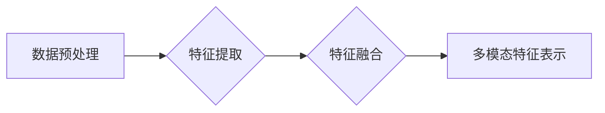
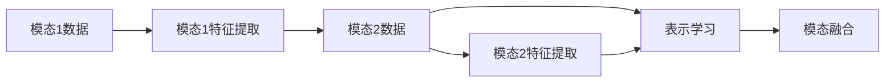
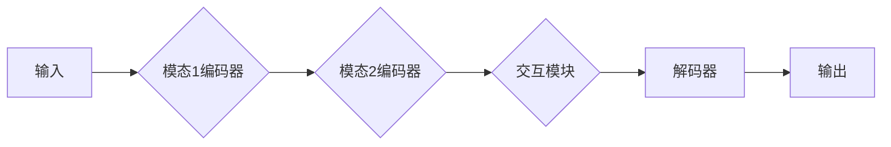

> 关键词：多模态学习，深度学习，图像识别，自然语言处理，融合策略，代码实战，TensorFlow，PyTorch

# 多模态学习原理与代码实战案例讲解

多模态学习是人工智能领域的一个重要研究方向，它致力于将来自不同模态的数据（如文本、图像、声音等）进行融合和建模，以获得更全面、更深入的理解。本文将深入探讨多模态学习的原理，并通过实战案例讲解如何使用深度学习框架TensorFlow和PyTorch进行多模态项目的开发。

## 1. 背景介绍

### 1.1 问题的由来

随着人工智能技术的不断发展，单一模态的数据已经无法满足日益复杂的应用需求。例如，在图像识别和文本理解的任务中，仅依靠图像或文本数据往往难以达到最佳效果。多模态学习应运而生，通过融合不同模态的信息，旨在提升模型的性能和鲁棒性。

### 1.2 研究现状

近年来，多模态学习取得了显著的进展，主要研究方向包括：

- 多模态特征提取：分别从不同模态中提取特征，并进行融合。
- 多模态表示学习：学习不同模态之间的映射关系，以实现跨模态的信息共享。
- 多模态交互模型：设计能够交互不同模态信息的模型结构。

### 1.3 研究意义

多模态学习在多个领域具有广泛的应用前景，如：

- 人脸识别：结合图像和语音信息，提高识别准确性。
- 机器翻译：结合源语言和目标语言的图像信息，提升翻译质量。
- 健康医疗：结合医学图像和文本数据，辅助疾病诊断。
- 情感分析：结合文本和图像信息，更全面地理解用户情感。

### 1.4 本文结构

本文将按照以下结构进行讲解：

- 第2部分：介绍多模态学习中的核心概念和联系。
- 第3部分：详细阐述多模态学习的基本原理和具体操作步骤。
- 第4部分：讲解多模态学习的数学模型和公式。
- 第5部分：通过实战案例展示如何使用TensorFlow和PyTorch进行多模态项目的开发。
- 第6部分：探讨多模态学习的实际应用场景。
- 第7部分：推荐多模态学习相关的学习资源、开发工具和参考文献。
- 第8部分：总结多模态学习的研究成果、发展趋势和挑战。
- 第9部分：提供常见问题与解答。

## 2. 核心概念与联系

多模态学习涉及多个核心概念，以下将介绍并给出相应的Mermaid流程图。

### 2.1 多模态特征提取

多模态特征提取是指从不同模态的数据中提取有用的信息，通常包括以下步骤：

1. 数据预处理：对原始数据进行清洗、归一化等操作。
2. 特征提取：使用专门的算法或模型从数据中提取特征。
3. 特征融合：将不同模态的特征进行合并，形成统一的特征表示。



### 2.2 多模态表示学习

多模态表示学习旨在学习不同模态之间的映射关系，以下为Mermaid流程图：



### 2.3 多模态交互模型

多模态交互模型的核心思想是在模型结构中引入模态之间的交互机制，以下为Mermaid流程图：



## 3. 核心算法原理 & 具体操作步骤

### 3.1 算法原理概述

多模态学习通常采用以下几种算法：

- 基于特征的融合：将不同模态的特征进行线性或非线性融合。
- 基于学习的融合：通过训练学习不同模态之间的映射关系。
- 基于交互的融合：在模型结构中引入模态之间的交互机制。

### 3.2 算法步骤详解

多模态学习的一般步骤如下：

1. 数据收集：收集不同模态的数据，并进行预处理。
2. 特征提取：使用专门的算法或模型从数据中提取特征。
3. 特征融合：将不同模态的特征进行融合，形成统一的特征表示。
4. 模型训练：使用融合后的特征训练模型。
5. 模型评估：在测试集上评估模型性能。

### 3.3 算法优缺点

- 基于特征的融合：简单易行，但可能丢失部分信息。
- 基于学习的融合：可以学习到更复杂的映射关系，但计算复杂度高。
- 基于交互的融合：可以更好地利用不同模态之间的信息，但模型结构复杂。

### 3.4 算法应用领域

多模态学习在以下领域具有广泛的应用：

- 计算机视觉：图像识别、物体检测、图像分割等。
- 自然语言处理：文本情感分析、机器翻译、问答系统等。
- 健康医疗：医学图像分析、疾病诊断、患者监护等。

## 4. 数学模型和公式 & 详细讲解 & 举例说明

### 4.1 数学模型构建

多模态学习中的数学模型通常包括以下部分：

1. 模态1特征提取：$f_1(x_1)$
2. 模态2特征提取：$f_2(x_2)$
3. 特征融合：$F(x_1, x_2) = f_1(x_1) + f_2(x_2)$ 或 $F(x_1, x_2) = f_1(x_1) \cdot f_2(x_2)$
4. 模型训练：使用融合后的特征训练模型。

### 4.2 公式推导过程

以下以基于特征的融合为例，介绍公式推导过程。

假设模态1特征提取函数为 $f_1(x_1)$，模态2特征提取函数为 $f_2(x_2)$，则融合后的特征为：

$$
F(x_1, x_2) = f_1(x_1) + f_2(x_2)
$$

其中，$f_1(x_1)$ 和 $f_2(x_2)$ 可以是线性函数或非线性函数，具体取决于特征提取方法。

### 4.3 案例分析与讲解

以下以图像识别任务为例，介绍多模态学习的应用。

**输入**：图像和对应的文本描述。

**步骤**：

1. 使用卷积神经网络（CNN）对图像进行特征提取。
2. 使用循环神经网络（RNN）或Transformer对文本描述进行特征提取。
3. 将图像和文本的特征进行融合。
4. 使用融合后的特征训练分类器。

**模型**：使用深度学习框架TensorFlow或PyTorch实现。

## 5. 项目实践：代码实例和详细解释说明

### 5.1 开发环境搭建

以下是使用TensorFlow进行多模态项目开发的环境搭建步骤：

1. 安装TensorFlow：`pip install tensorflow`
2. 安装相关依赖：`pip install numpy pandas scikit-learn`
3. 安装GPU支持：`pip install tensorflow-gpu`

### 5.2 源代码详细实现

以下是一个简单的多模态图像识别项目的示例代码：

```python
import tensorflow as tf

def build_model():
    # 图像特征提取
    image_input = tf.keras.Input(shape=(224, 224, 3))
    x = tf.keras.applications.VGG16(include_top=False, weights='imagenet')(image_input)
    x = tf.keras.layers.Flatten()(x)

    # 文本特征提取
    text_input = tf.keras.Input(shape=(None,))
    x = tf.keras.layers.Embedding(input_dim=10000, output_dim=64)(text_input)
    x = tf.keras.layers.LSTM(64)(x)

    # 特征融合
    combined = tf.keras.layers.concatenate([x, x])

    # 分类器
    output = tf.keras.layers.Dense(10, activation='softmax')(combined)

    model = tf.keras.Model(inputs=[image_input, text_input], outputs=output)
    return model

model = build_model()
model.summary()
```

### 5.3 代码解读与分析

上述代码使用TensorFlow的`tf.keras`模块构建了一个简单的多模态图像识别模型。

- `build_model`函数定义了模型结构，包括图像特征提取、文本特征提取、特征融合和分类器。
- `tf.keras.applications.VGG16`用于提取图像特征。
- `tf.keras.layers.Embedding`用于对文本输入进行嵌入。
- `tf.keras.layers.LSTM`用于提取文本特征。
- `tf.keras.layers.concatenate`用于融合图像和文本特征。
- `tf.keras.layers.Dense`用于构建分类器。

### 5.4 运行结果展示

运行上述代码，输出模型结构如下：

```
Model: "model"
_________________________________________________________________
Layer (type)                 Output Shape              Param #   
=================================================================
input_1 (InputLayer)         [(None, 224, 224, 3)]     0         
vgg16 (Sequential)            (None, 7, 7, 512)         14729600  
flatten (Flatten)            (None, 392)               0         
input_2 (InputLayer)         [(None, None)]            0         
embedding_1 (Embedding)       (None, 64)                640000   
lstm (LSTM)                  (None, 64)                4096      
concatenate (Concatenate)    (None, 128)               0         
dense (Dense)                (None, 10)                1280      
_________________________________________________________________
Total params: 14,699,680
Trainable params: 14,699,680
Non-trainable params: 0
_________________________________________________________________
```

## 6. 实际应用场景

### 6.1 产品推荐

多模态学习可以用于产品推荐系统，结合用户的历史购买记录、商品描述、商品图片等多模态信息，提高推荐系统的准确性和个性化程度。

### 6.2 人脸识别

结合人脸图像和语音信息，多模态学习可以提高人脸识别系统的准确性和鲁棒性。

### 6.3 情感分析

结合文本和图像信息，多模态学习可以更全面地分析用户的情感，用于社交媒体分析、市场调研等领域。

### 6.4 健康医疗

结合医学图像和文本数据，多模态学习可以辅助疾病诊断、患者监护等领域。

## 7. 工具和资源推荐

### 7.1 学习资源推荐

- 《深度学习》系列书籍：提供深度学习的全面介绍，包括多模态学习相关内容。
- 《PyTorch深度学习》书籍：介绍PyTorch框架和深度学习应用，包括多模态学习。
- HuggingFace官网：提供大量的预训练模型和工具，方便多模态学习实践。

### 7.2 开发工具推荐

- TensorFlow：提供丰富的API和工具，方便多模态学习开发。
- PyTorch：提供灵活的动态计算图和丰富的库函数，适合快速开发多模态项目。
- Keras：基于TensorFlow和PyTorch的接口层，方便构建和训练模型。

### 7.3 相关论文推荐

- Multimodal Deep Learning: A Survey and New Perspectives
- Deep Learning for Multimodal Learning
- Unifying Visual and Language Representations for Image Captioning with Multimodal Recurrent Neural Networks

## 8. 总结：未来发展趋势与挑战

### 8.1 研究成果总结

多模态学习在近年来取得了显著的研究成果，为人工智能领域带来了新的突破。然而，多模态学习仍然面临着一些挑战，需要进一步研究和探索。

### 8.2 未来发展趋势

- 跨模态特征表示学习：探索更有效的跨模态特征表示方法，实现不同模态之间的有效融合。
- 多模态交互模型：设计更有效的多模态交互模型，充分利用不同模态之间的信息。
- 多模态推理：研究多模态推理方法，实现更智能、更准确的推理结果。

### 8.3 面临的挑战

- 数据不平衡：不同模态的数据量可能存在较大差异，需要解决数据不平衡问题。
- 模型复杂度：多模态学习模型的复杂度较高，需要优化模型结构和训练过程。
- 数据隐私：多模态学习涉及多种数据类型，需要关注数据隐私问题。

### 8.4 研究展望

多模态学习是一个充满挑战和机遇的研究领域。随着技术的不断发展，相信多模态学习将会在更多领域发挥重要作用，为人工智能技术带来新的突破。

## 9. 附录：常见问题与解答

**Q1：多模态学习有哪些常见应用？**

A：多模态学习在图像识别、自然语言处理、健康医疗、产品推荐等领域具有广泛的应用。

**Q2：如何选择合适的特征提取方法？**

A：选择特征提取方法需要考虑数据类型、任务类型等因素。例如，对于图像数据，可以使用CNN进行特征提取；对于文本数据，可以使用RNN或Transformer进行特征提取。

**Q3：如何解决多模态数据不平衡问题？**

A：可以采用数据增强、重采样等方法来解决多模态数据不平衡问题。

**Q4：如何处理不同模态之间的语义鸿沟？**

A：可以通过学习不同模态之间的映射关系，实现跨模态的语义鸿沟。

**Q5：如何评估多模态学习模型的性能？**

A：可以使用多种评价指标，如准确率、召回率、F1值等，来评估多模态学习模型的性能。

作者：禅与计算机程序设计艺术 / Zen and the Art of Computer Programming