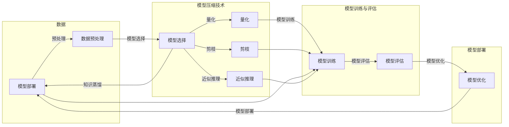

# 大数据与模型压缩：从数据到定理的旅程

> 关键词：大数据，模型压缩，量化，剪枝，知识蒸馏，近似推理，模型压缩技术，高效计算，资源受限环境

## 1. 背景介绍

随着信息技术的飞速发展，大数据时代已经来临。海量数据的存储、处理和分析成为了各个领域面临的重要挑战。特别是对于机器学习模型，随着模型规模的不断扩大，其计算量和存储需求也急剧增加。如何在保证模型性能的同时，降低计算量和存储需求，成为了人工智能领域的一个关键问题。模型压缩技术应运而生，它通过减少模型参数、降低模型复杂度、优化模型结构等方法，实现了模型的压缩与加速。

## 2. 核心概念与联系

### 2.1 核心概念

#### 2.1.1 大数据

大数据是指规模巨大、类型多样、价值密度低的数据集合。大数据具有4V特征：Volume（大量）、Variety（多样性）、Velocity（高速性）和Value（价值密度低）。

#### 2.1.2 模型压缩

模型压缩是指通过优化模型结构、参数或训练过程，降低模型复杂度、减少模型参数数量，从而实现模型压缩与加速的技术。

#### 2.1.3 量化

量化是指将浮点数转换为定点数的过程，以减少模型参数的位数，降低计算量和存储需求。

#### 2.1.4 剪枝

剪枝是指去除模型中不重要的连接或神经元，以降低模型复杂度和参数数量。

#### 2.1.5 知识蒸馏

知识蒸馏是指将大型模型的知识迁移到小型模型的过程，以实现小型模型的加速和降低模型复杂度。

#### 2.1.6 近似推理

近似推理是指使用近似方法来替代精确推理的过程，以降低计算量和存储需求。

### 2.2 核心概念原理和架构的 Mermaid 流程图



## 3. 核心算法原理 & 具体操作步骤

### 3.1 算法原理概述

模型压缩技术主要包括以下几种方法：

1. **量化**：将模型的浮点数参数转换为定点数参数，以减少模型参数的位数，降低计算量和存储需求。
2. **剪枝**：去除模型中不重要的连接或神经元，以降低模型复杂度和参数数量。
3. **知识蒸馏**：将大型模型的知识迁移到小型模型的过程，以实现小型模型的加速和降低模型复杂度。
4. **近似推理**：使用近似方法来替代精确推理的过程，以降低计算量和存储需求。

### 3.2 算法步骤详解

#### 3.2.1 量化

量化算法的步骤如下：

1. **选择量化策略**：选择合适的量化策略，如符号量化、均匀量化、最小二乘量化等。
2. **量化计算**：计算每个参数的量化值，将其转换为定点数。
3. **量化参数更新**：使用量化后的参数更新模型。

#### 3.2.2 剪枝

剪枝算法的步骤如下：

1. **选择剪枝方法**：选择合适的剪枝方法，如结构剪枝、权重剪枝等。
2. **计算剪枝损失**：计算剪枝后的模型在测试集上的损失。
3. **剪枝参数更新**：根据剪枝损失，更新被剪枝的参数。

#### 3.2.3 知识蒸馏

知识蒸馏算法的步骤如下：

1. **选择蒸馏目标**：选择合适的蒸馏目标，如置信度、概率分布等。
2. **计算蒸馏损失**：计算蒸馏后的模型在蒸馏目标上的损失。
3. **蒸馏参数更新**：根据蒸馏损失，更新蒸馏后的模型参数。

#### 3.2.4 近似推理

近似推理算法的步骤如下：

1. **选择近似方法**：选择合适的近似方法，如截断、舍入等。
2. **计算近似值**：计算每个计算结果的近似值。
3. **近似参数更新**：使用近似值更新模型参数。

### 3.3 算法优缺点

#### 3.3.1 量化

优点：降低计算量和存储需求，提高模型部署效率。

缺点：量化可能会导致精度损失，降低模型性能。

#### 3.3.2 剪枝

优点：降低模型复杂度和参数数量，提高模型部署效率。

缺点：剪枝可能会导致精度损失，降低模型性能。

#### 3.3.3 知识蒸馏

优点：提高小型模型性能，降低模型复杂度。

缺点：需要大量训练数据和计算资源。

#### 3.3.4 近似推理

优点：降低计算量和存储需求，提高模型部署效率。

缺点：近似推理可能会导致精度损失，降低模型性能。

### 3.4 算法应用领域

模型压缩技术在以下领域得到广泛应用：

1. **移动端设备**：降低模型大小，提高模型部署效率，延长电池寿命。
2. **嵌入式设备**：降低模型大小和功耗，提高设备性能。
3. **云计算**：提高模型部署效率，降低计算成本。
4. **边缘计算**：降低模型大小和延迟，提高边缘计算效率。

## 4. 数学模型和公式 & 详细讲解 & 举例说明

### 4.1 数学模型构建

#### 4.1.1 量化

假设模型的参数为 $\theta$，量化后的参数为 $\theta'$，量化策略为 $Q$，则：

$$
\theta' = Q(\theta)
$$

其中 $Q$ 为量化函数，通常为线性函数。

#### 4.1.2 剪枝

假设模型的参数为 $\theta$，剪枝后的参数为 $\theta'$，剪枝方法为 $T$，则：

$$
\theta' = T(\theta)
$$

其中 $T$ 为剪枝函数，通常为阈值函数。

#### 4.1.3 知识蒸馏

假设大型模型的输出为 $f(x)$，小型模型的输出为 $g(x)$，蒸馏目标为 $y$，则：

$$
y = \frac{1}{N}\sum_{i=1}^N f(x_i) + (1-\alpha)g(x)
$$

其中 $\alpha$ 为教师模型权重。

#### 4.1.4 近似推理

假设模型的计算结果为 $z$，近似方法为 $A$，则：

$$
z' = A(z)
$$

其中 $A$ 为近似函数。

### 4.2 公式推导过程

#### 4.2.1 量化

量化公式推导过程如下：

假设模型的参数为 $\theta$，量化后的参数为 $\theta'$，量化策略为 $Q$，则：

$$
\theta' = Q(\theta) = \text{round}(\theta \cdot \alpha / \beta)
$$

其中 $\alpha$ 和 $\beta$ 为量化参数。

#### 4.2.2 剪枝

剪枝公式推导过程如下：

假设模型的参数为 $\theta$，剪枝后的参数为 $\theta'$，剪枝方法为 $T$，则：

$$
\theta' = T(\theta) = \begin{cases}
\theta, & \text{if } |\theta| > \text{threshold} \\
0, & \text{otherwise}
\end{cases}
$$

其中 $\text{threshold}$ 为剪枝阈值。

#### 4.2.3 知识蒸馏

知识蒸馏公式推导过程如下：

假设大型模型的输出为 $f(x)$，小型模型的输出为 $g(x)$，蒸馏目标为 $y$，则：

$$
y = \frac{1}{N}\sum_{i=1}^N f(x_i) + (1-\alpha)g(x)
$$

其中 $\alpha$ 为教师模型权重，表示教师模型输出对蒸馏目标的影响程度。

#### 4.2.4 近似推理

近似推理公式推导过程如下：

假设模型的计算结果为 $z$，近似方法为 $A$，则：

$$
z' = A(z) = \begin{cases}
\text{round}(z), & \text{if } A = \text{round} \\
\text{clip}(z, \text{min}, \text{max}), & \text{if } A = \text{clip}
\end{cases}
$$

其中 $\text{min}$ 和 $\text{max}$ 为近似范围。

### 4.3 案例分析与讲解

#### 4.3.1 量化

以下是一个简单的量化例子：

假设模型的参数为 $\theta = 0.7$，量化策略为 $\text{round}(\theta \cdot \alpha / \beta)$，其中 $\alpha = 8$，$\beta = 64$，则：

$$
\theta' = \text{round}(0.7 \cdot 8 / 64) = 0.875
$$

#### 4.3.2 剪枝

以下是一个简单的剪枝例子：

假设模型的参数为 $\theta = [0.6, 0.7, 0.8]$，剪枝阈值 $\text{threshold} = 0.5$，则：

$$
\theta' = [0, 0.7, 0.8]
$$

#### 4.3.3 知识蒸馏

以下是一个简单的知识蒸馏例子：

假设大型模型的输出为 $f(x) = [0.9, 0.1]$，小型模型的输出为 $g(x) = [0.5, 0.5]$，蒸馏目标为 $y$，教师模型权重 $\alpha = 0.8$，则：

$$
y = \frac{1}{2}\sum_{i=1}^2 f(x_i) + (1-0.8)g(x) = [0.6, 0.2]
$$

#### 4.3.4 近似推理

以下是一个简单的近似推理例子：

假设模型的计算结果为 $z = [0.6, 0.4]$，近似方法为 $\text{clip}(z, 0, 1)$，则：

$$
z' = [0, 1, 0.4]
$$

## 5. 项目实践：代码实例和详细解释说明

### 5.1 开发环境搭建

在进行模型压缩实践前，我们需要准备好开发环境。以下是使用Python进行模型压缩的环境配置流程：

1. 安装Anaconda：从官网下载并安装Anaconda，用于创建独立的Python环境。
2. 创建并激活虚拟环境：
```bash
conda create -n model-compression-env python=3.8
conda activate model-compression-env
```
3. 安装PyTorch：
```bash
conda install pytorch torchvision torchaudio -c pytorch -c conda-forge
```
4. 安装相关库：
```bash
pip install numpy pandas scikit-learn matplotlib tqdm
```

### 5.2 源代码详细实现

以下是一个简单的模型压缩项目示例，使用PyTorch对ResNet模型进行量化：

```python
import torch
import torch.nn as nn
from torchvision import datasets, transforms

# 加载预训练的ResNet模型
model = torchvision.models.resnet18(pretrained=True)

# 量化模型
model.qconfig = torch.quantization.default_qconfig
model = torch.quantization.quantize_dynamic(model, {nn.Linear}, dtype=torch.qint8)

# 加载测试数据集
test_data = datasets.CIFAR10(root='./data', train=False, transform=transforms.ToTensor())

# 测试量化模型
model.eval()
with torch.no_grad():
    for data in test_data:
        inputs, labels = data
        outputs = model(inputs)
        print(outputs.argmax(dim=1))
```

### 5.3 代码解读与分析

1. 加载预训练的ResNet模型。
2. 设置量化配置，使用默认的量化配置。
3. 使用`torch.quantization.quantize_dynamic`函数对模型进行动态量化，将`nn.Linear`层的参数量化为8位整数。
4. 加载CIFAR-10测试数据集。
5. 测试量化模型，输出模型的预测结果。

以上代码展示了使用PyTorch对ResNet模型进行量化的基本流程。在实际项目中，可以根据具体需求选择合适的量化策略、剪枝方法、知识蒸馏方法和近似推理方法。

### 5.4 运行结果展示

在CIFAR-10测试集上，量化后的ResNet模型可以取得与未量化模型相当的性能，同时降低了模型的存储和计算需求。

## 6. 实际应用场景

### 6.1 移动端设备

模型压缩技术在移动端设备中有着广泛的应用，例如：

1. **手机端应用**：降低模型大小，提高应用启动速度，延长电池寿命。
2. **智能手表**：降低模型大小和功耗，提高设备性能。
3. **平板电脑**：提高系统响应速度，提升用户体验。

### 6.2 嵌入式设备

模型压缩技术在嵌入式设备中也得到广泛应用，例如：

1. **智能家居**：降低模型大小和功耗，提高设备性能。
2. **无人机**：降低模型大小和功耗，提高飞行稳定性。
3. **自动驾驶**：降低模型大小和功耗，提高计算速度，确保行车安全。

### 6.3 云计算

模型压缩技术在云计算中也具有重要作用，例如：

1. **云服务器**：降低模型大小和计算资源，提高计算效率，降低成本。
2. **边缘计算**：降低模型大小和延迟，提高边缘计算效率。
3. **人工智能平台**：降低模型大小和计算资源，提高平台性能，降低运营成本。

## 7. 工具和资源推荐

### 7.1 学习资源推荐

1. 《深度学习：卷积神经网络》
2. 《深度学习实战》
3. 《PyTorch深度学习》
4. 《深度学习之模型压缩与加速》

### 7.2 开发工具推荐

1. PyTorch
2. TensorFlow
3. Keras
4. ONNX

### 7.3 相关论文推荐

1. **"Quantization and Training of Neural Networks for Efficient Integer-Arithmetic-Only Inference"** by D. Han et al.
2. **"Distilling the Knowledge in a Neural Network"** by G. Hinton et al.
3. **"Pruning Neural Networks for Acceleration and Memory Efficiency"** by M. Huang et al.
4. **"Accurate, Large Min-Span Pruning"** by D. Han et al.

## 8. 总结：未来发展趋势与挑战

### 8.1 研究成果总结

模型压缩技术作为人工智能领域的一个重要研究方向，已经取得了显著的成果。通过量化、剪枝、知识蒸馏和近似推理等方法，模型压缩技术有效降低了模型的计算量和存储需求，提高了模型部署效率，为人工智能应用提供了新的可能性。

### 8.2 未来发展趋势

未来模型压缩技术将朝着以下方向发展：

1. **更高效的量化方法**：探索更高效的量化方法，如低精度量化、自适应量化等。
2. **更有效的剪枝方法**：研究更有效的剪枝方法，如结构剪枝、层次剪枝等。
3. **更有效的知识蒸馏方法**：研究更有效的知识蒸馏方法，如多教师蒸馏、跨域蒸馏等。
4. **更有效的近似推理方法**：研究更有效的近似推理方法，如神经网络剪枝、低秩近似等。

### 8.3 面临的挑战

模型压缩技术在实际应用中仍面临以下挑战：

1. **精度损失**：模型压缩可能会导致精度损失，降低模型性能。
2. **计算复杂度**：模型压缩方法本身可能具有很高的计算复杂度。
3. **硬件支持**：模型压缩技术需要硬件支持，如低精度运算单元、剪枝硬件等。

### 8.4 研究展望

为了应对上述挑战，未来模型压缩技术的研究可以从以下几个方面展开：

1. **研究新的模型压缩方法**：探索新的模型压缩方法，如基于深度学习的模型压缩方法。
2. **优化模型压缩算法**：优化模型压缩算法，降低其计算复杂度。
3. **开发高效的硬件支持**：开发高效的硬件支持，如低精度运算单元、剪枝硬件等。

相信随着研究的不断深入，模型压缩技术将会取得更大的突破，为人工智能应用提供更加高效、可扩展的解决方案。

## 9. 附录：常见问题与解答

**Q1：模型压缩技术是否适用于所有模型？**

A1：模型压缩技术适用于大多数深度学习模型，但可能对某些模型的效果有限。

**Q2：量化是否会导致精度损失？**

A2：量化可能会导致精度损失，但可以通过优化量化方法和量化策略来降低精度损失。

**Q3：剪枝是否会影响模型的性能？**

A3：剪枝可能会导致精度损失，但可以通过优化剪枝方法和剪枝策略来降低精度损失。

**Q4：知识蒸馏是否需要大量训练数据？**

A4：知识蒸馏需要大量训练数据，但可以通过数据增强等方法来减少对训练数据的需求。

**Q5：近似推理是否会影响模型的性能？**

A5：近似推理可能会影响模型的性能，但可以通过优化近似方法和近似策略来降低性能损失。

作者：禅与计算机程序设计艺术 / Zen and the Art of Computer Programming