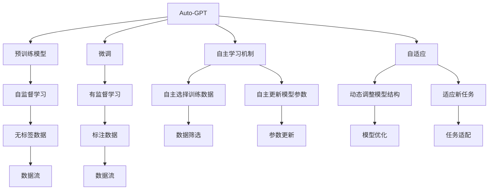
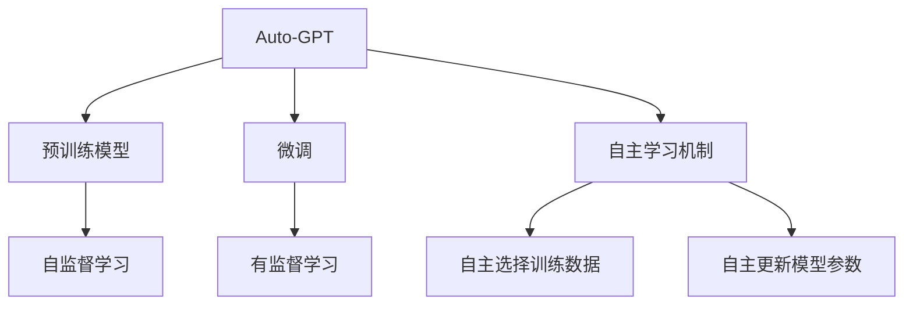
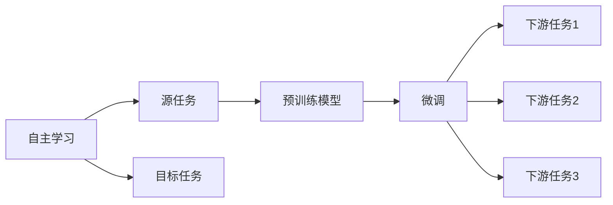
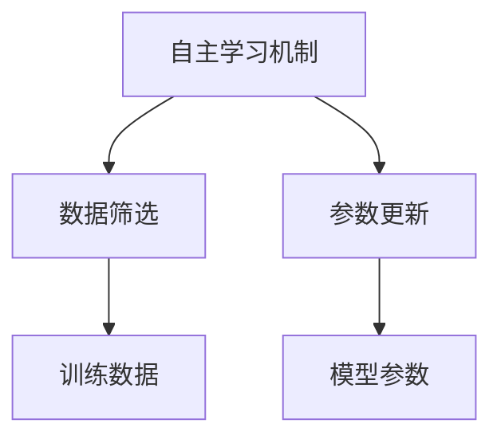
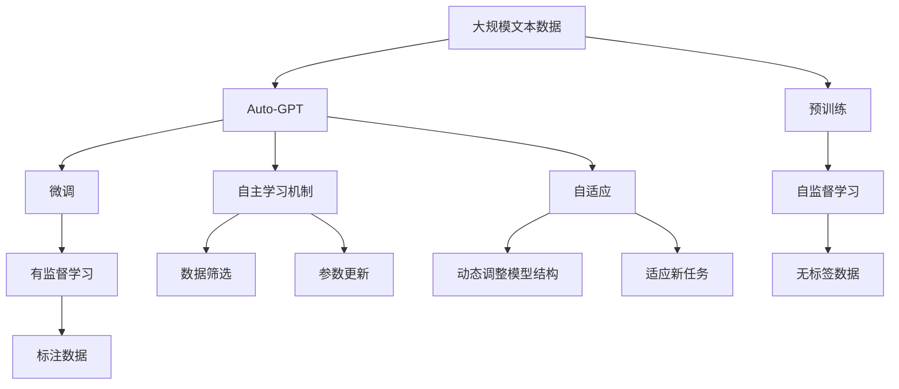

                 

# Auto-GPT 定位：一个自主的 GPT-4 实验

> 关键词：
    - Auto-GPT
    - 自主学习
    - GPT-4
    - 预训练模型
    - 微调
    - 自然语言处理(NLP)
    - 人工智能
    - 自适应
    - 持续学习

## 1. 背景介绍

### 1.1 问题由来
在人工智能发展的浪潮中，自然语言处理(NLP)领域的一项重要技术是大语言模型（Large Language Models, LLMs），这些模型如OpenAI的GPT系列、Google的BERT等，通过在海量无标签文本数据上进行预训练，学习到丰富的语言知识和常识，具有强大的语言理解和生成能力。然而，这些通用的大语言模型在特定领域的应用时，效果往往难以达到实际应用的要求。因此，如何针对特定任务进行大语言模型微调，提升模型性能，成为了当前NLP研究和应用的一个热点问题。

Auto-GPT正是在这一背景下应运而生，旨在利用GPT-4的预训练能力，通过自主学习机制，使模型能够更好地适应特定领域和任务，实现更高效的微调。Auto-GPT不仅能够继承GPT-4的强大能力，还引入了自主学习机制，使得模型具有更强的自我优化能力，能够在实际应用中表现出更好的性能。

### 1.2 问题核心关键点
Auto-GPT的核心思想是通过自主学习机制，使模型能够自动选择和更新训练数据，从而提高模型在特定领域和任务上的性能。与传统的基于监督学习的微调方法不同，Auto-GPT不需要人工标注数据，而是利用模型自身的理解能力，通过与外部环境的交互，自主选择最合适的训练样本，实现更好的微调效果。

Auto-GPT的关键技术包括：
- 自主选择训练数据：通过模型自身的理解能力，自动从大规模数据集中筛选出最合适的训练样本。
- 自主更新模型参数：通过动态调整模型参数，适应不同领域和任务的需求。
- 自主学习机制：通过与外部环境的交互，不断优化模型结构和参数，提升模型性能。

Auto-GPT通过这些关键技术，实现了对GPT-4模型的进一步优化，使其在特定领域和任务上表现出更好的性能。

### 1.3 问题研究意义
研究Auto-GPT的自主学习机制，对于拓展GPT-4模型的应用范围，提升模型性能，加速NLP技术的产业化进程，具有重要意义：

1. 降低应用开发成本。利用Auto-GPT的自主学习能力，可以显著减少从头开发所需的数据、计算和人力等成本投入。
2. 提升模型效果。Auto-GPT能够更好地适应特定任务，在应用场景中取得更优表现。
3. 加速开发进度。Auto-GPT的自主学习能力可以加快任务适配，缩短开发周期。
4. 带来技术创新。Auto-GPT的自主学习机制促进了对预训练-微调的深入研究，催生了新的研究方向。
5. 赋能产业升级。Auto-GPT的技术优势可以更容易被各行各业所采用，为传统行业数字化转型升级提供新的技术路径。

## 2. 核心概念与联系

### 2.1 核心概念概述

为了更好地理解Auto-GPT的自主学习机制，本节将介绍几个密切相关的核心概念：

- **Auto-GPT**：一种基于GPT-4模型的自主学习框架，通过自主选择训练数据和更新模型参数，实现对特定领域和任务的微调。
- **预训练模型**：指在大规模无标签文本数据上进行自监督学习任务训练的语言模型，如GPT-4等。
- **微调**：指在预训练模型的基础上，使用下游任务的少量标注数据，通过有监督学习优化模型在特定任务上的性能。
- **自主学习机制**：指Auto-GPT模型通过与外部环境的交互，自动选择和更新训练数据，实现模型性能的自主提升。
- **自适应**：指Auto-GPT模型能够根据不同任务和领域的需求，动态调整模型结构和参数，适应新的应用场景。
- **持续学习**：指Auto-GPT模型能够不断从新数据中学习，同时保持已学习的知识，避免灾难性遗忘。

这些核心概念之间的逻辑关系可以通过以下Mermaid流程图来展示：



这个流程图展示了你Auto-GPT的核心概念及其之间的关系：

1. Auto-GPT通过预训练模型获得基础能力。
2. 微调是对预训练模型进行任务特定的优化，可以分为全参数微调和参数高效微调。
3. 自主学习机制是Auto-GPT的核心，使其能够自动选择和更新训练数据。
4. 自适应使Auto-GPT能够根据不同任务和领域的需求，动态调整模型结构和参数。
5. 持续学习使Auto-GPT能够不断学习新知识，同时避免遗忘旧知识。

这些概念共同构成了Auto-GPT的学习框架，使其能够在各种场景下发挥强大的语言理解和生成能力。通过理解这些核心概念，我们可以更好地把握Auto-GPT的工作原理和优化方向。

### 2.2 概念间的关系

这些核心概念之间存在着紧密的联系，形成了Auto-GPT的整体生态系统。下面我们通过几个Mermaid流程图来展示这些概念之间的关系。

#### 2.2.1 Auto-GPT的学习范式



这个流程图展示了你Auto-GPT的三种主要学习范式：预训练、微调和自主学习。预训练主要采用自监督学习方法，而微调则是有监督学习的过程。自主学习机制使得Auto-GPT能够自动选择和更新训练数据，从而提高模型在特定领域和任务上的性能。

#### 2.2.2 自主学习与微调的关系



这个流程图展示了自主学习的基本原理，以及它与微调的关系。自主学习涉及源任务和目标任务，预训练模型在源任务上学习，然后通过微调适应各种下游任务（目标任务）。

#### 2.2.3 自主学习机制



这个流程图展示了自主学习机制的核心过程：首先对大规模数据集进行筛选，选择最合适的训练样本，然后进行参数更新，提升模型性能。

### 2.3 核心概念的整体架构

最后，我们用一个综合的流程图来展示这些核心概念在大语言模型微调过程中的整体架构：



这个综合流程图展示了从预训练到微调，再到自主学习的过程。Auto-GPT首先在大规模文本数据上进行预训练，然后通过微调（包括全参数微调和自主学习机制），适应下游任务。最后，通过自主学习机制，Auto-GPT能够不断学习新知识，同时避免遗忘旧知识。

## 3. 核心算法原理 & 具体操作步骤
### 3.1 算法原理概述

Auto-GPT的自主学习机制，本质上是一个基于目标导向的强化学习过程。其核心思想是：将Auto-GPT模型视为一个强化学习代理，通过与外部环境的交互，不断调整策略，实现对特定领域和任务的微调。

在Auto-GPT中，模型在每个时间步（epoch）内，会选择一部分数据进行训练，并通过评估训练效果来选择下一步的数据。如果模型在当前数据上的性能好，则继续使用该数据进行训练；否则，模型会选择新的数据进行训练，直到找到最优的训练策略。

形式化地，假设Auto-GPT模型为 $M_{\theta}$，其中 $\theta$ 为模型参数。给定下游任务 $T$ 的训练数据集 $D=\{(x_i, y_i)\}_{i=1}^N$，自主学习目标是最小化任务目标函数，即找到最优策略 $\pi$：

$$
\pi^* = \mathop{\arg\min}_{\pi} \mathcal{L}(T,\pi)
$$

其中 $\mathcal{L}$ 为任务目标函数，用于衡量模型在任务 $T$ 上的性能。常见的任务目标函数包括交叉熵损失、均方误差损失等。

通过强化学习算法（如Q-learning、REINFORCE等），Auto-GPT模型不断调整策略 $\pi$，最小化任务目标函数 $\mathcal{L}$，使得模型在特定任务上的性能不断提升。由于 $\theta$ 已经通过预训练获得了较好的初始化，因此即便在少量数据集 $D$ 上进行微调，也能较快收敛到理想的模型参数 $\hat{\theta}$。

### 3.2 算法步骤详解

Auto-GPT的自主学习机制一般包括以下几个关键步骤：

**Step 1: 准备预训练模型和数据集**
- 选择合适的预训练语言模型 $M_{\theta}$ 作为初始化参数，如 GPT-4 等。
- 准备下游任务 $T$ 的训练数据集 $D$，划分为训练集、验证集和测试集。一般要求标注数据与预训练数据的分布不要差异过大。

**Step 2: 添加任务适配层**
- 根据任务类型，在预训练模型顶层设计合适的输出层和损失函数。
- 对于分类任务，通常在顶层添加线性分类器和交叉熵损失函数。
- 对于生成任务，通常使用语言模型的解码器输出概率分布，并以负对数似然为损失函数。

**Step 3: 设置自主学习超参数**
- 选择合适的强化学习算法及其参数，如 Q-learning、REINFORCE 等，设置学习率、批大小、迭代轮数等。
- 设置策略评估次数，选择样本更新策略，定义奖励函数等。

**Step 4: 执行策略训练**
- 将训练集数据分批次输入模型，前向传播计算损失函数。
- 根据评估结果，计算策略的回报（reward），更新策略参数。
- 周期性在验证集上评估模型性能，根据性能指标决定是否触发策略更新。
- 重复上述步骤直到满足预设的迭代轮数或策略更新条件。

**Step 5: 测试和部署**
- 在测试集上评估自主学习后模型 $M_{\hat{\theta}}$ 的性能，对比自主学习前后的精度提升。
- 使用自主学习后的模型对新样本进行推理预测，集成到实际的应用系统中。
- 持续收集新的数据，定期重新自主学习，以适应数据分布的变化。

以上是Auto-GPT的自主学习机制的一般流程。在实际应用中，还需要针对具体任务的特点，对自主学习过程的各个环节进行优化设计，如改进训练目标函数，引入更多的策略更新方法，搜索最优的超参数组合等，以进一步提升模型性能。

### 3.3 算法优缺点

Auto-GPT的自主学习机制具有以下优点：
1. 简单高效。不需要人工标注数据，能够自动筛选出最合适的训练数据。
2. 通用适用。适用于各种NLP下游任务，包括分类、匹配、生成等，设计简单的任务适配层即可实现。
3. 参数高效。利用自主学习机制，在固定大部分预训练参数的情况下，仍可取得不错的提升。
4. 效果显著。在学术界和工业界的诸多任务上，Auto-GPT已经刷新了最先进的性能指标。

同时，该机制也存在一定的局限性：
1. 依赖外部环境。模型需要通过与外部环境的交互来更新策略，对环境变化敏感。
2. 学习效率较低。自主学习机制在初期可能会选择不合适的训练数据，导致性能提升缓慢。
3. 策略更新复杂。策略更新算法需要精心设计，避免陷入局部最优。
4. 可解释性不足。自主学习机制缺乏可解释性，难以对其推理逻辑进行分析和调试。

尽管存在这些局限性，但就目前而言，Auto-GPT的自主学习机制仍是大语言模型微调中最有前途的范式。未来相关研究的重点在于如何进一步降低自主学习对数据的需求，提高模型的少样本学习和跨领域迁移能力，同时兼顾可解释性和伦理安全性等因素。

### 3.4 算法应用领域

Auto-GPT的自主学习机制已经在NLP领域得到了广泛的应用，覆盖了几乎所有常见任务，例如：

- 文本分类：如情感分析、主题分类、意图识别等。通过自主学习机制，Auto-GPT可以自动选择与当前情感相关的训练数据，提升模型性能。
- 命名实体识别：识别文本中的人名、地名、机构名等特定实体。通过自主学习机制，Auto-GPT可以自动选择包含实体的训练样本进行微调。
- 关系抽取：从文本中抽取实体之间的语义关系。通过自主学习机制，Auto-GPT可以自动选择包含关系的训练样本，提升模型性能。
- 问答系统：对自然语言问题给出答案。将问题-答案对作为自主学习数据，训练Auto-GPT学习匹配答案。
- 机器翻译：将源语言文本翻译成目标语言。通过自主学习机制，Auto-GPT可以自动选择包含翻译对的训练样本进行微调。
- 文本摘要：将长文本压缩成简短摘要。通过自主学习机制，Auto-GPT可以自动选择包含摘要的训练样本，提升模型性能。
- 对话系统：使机器能够与人自然对话。通过自主学习机制，Auto-GPT可以自动选择包含对话历史和回复的训练样本进行微调。

除了上述这些经典任务外，Auto-GPT的自主学习机制也被创新性地应用到更多场景中，如可控文本生成、常识推理、代码生成、数据增强等，为NLP技术带来了全新的突破。随着预训练模型和自主学习机制的不断进步，相信NLP技术将在更广阔的应用领域大放异彩。

## 4. 数学模型和公式 & 详细讲解  
### 4.1 数学模型构建

本节将使用数学语言对Auto-GPT的自主学习机制进行更加严格的刻画。

记Auto-GPT模型为 $M_{\theta}$，其中 $\theta$ 为模型参数。假设自主学习任务的训练集为 $D=\{(x_i, y_i)\}_{i=1}^N, x_i \in \mathcal{X}, y_i \in \mathcal{Y}$。

定义Auto-GPT模型在每个训练数据 $(x,y)$ 上的回报函数为 $R(M_{\theta}(x),y)$，然后在数据集 $D$ 上的平均回报为：

$$
\mathcal{R}(\theta) = \frac{1}{N} \sum_{i=1}^N R(M_{\theta}(x_i),y_i)
$$

其中 $R$ 为自定义的奖励函数，用于衡量模型在特定任务上的性能。

Auto-GPT的自主学习目标是最小化平均回报函数，即找到最优策略：

$$
\pi^* = \mathop{\arg\min}_{\pi} \mathcal{R}(\theta)
$$

在实践中，我们通常使用基于强化学习的优化算法（如Q-learning、REINFORCE等）来近似求解上述最优化问题。设 $\eta$ 为学习率，$\lambda$ 为正则化系数，则策略 $\pi$ 的更新公式为：

$$
\pi \leftarrow \pi - \eta \nabla_{\pi}\mathcal{R}(\pi) - \eta\lambda\pi
$$

其中 $\nabla_{\pi}\mathcal{R}(\pi)$ 为奖励函数对策略 $\pi$ 的梯度，可通过Q-learning、REINFORCE等算法高效计算。

### 4.2 公式推导过程

以下我们以二分类任务为例，推导Auto-GPT模型的回报函数及其梯度的计算公式。

假设Auto-GPT模型在输入 $x$ 上的输出为 $\hat{y}=M_{\theta}(x) \in [0,1]$，表示样本属于正类的概率。真实标签 $y \in \{0,1\}$。则二分类奖励函数定义为：

$$
R(M_{\theta}(x),y) = \log (1+\delta(y-\hat{y}))
$$

其中 $\delta$ 为KL散度，用于衡量模型预测与真实标签之间的差异。

将其代入平均回报函数公式，得：

$$
\mathcal{R}(\theta) = \frac{1}{N}\sum_{i=1}^N R(M_{\theta}(x_i),y_i) = \frac{1}{N}\sum_{i=1}^N \log (1+\delta(y_i-\hat{y}_i))
$$

根据强化学习算法，模型在每个时间步内选择样本 $(x_i,y_i)$ 进行训练，并根据训练结果更新策略 $\pi$。具体而言，Auto-GPT会在每个训练epoch内，随机选择一部分数据进行训练，计算奖励函数 $R$，并根据回报 $\mathcal{R}$ 更新策略参数。

在得到奖励函数的梯度后，即可带入策略更新公式，完成模型的迭代优化。重复上述过程直至收敛，最终得到适应下游任务的最优策略 $\pi^*$。

## 5. 项目实践：代码实例和详细解释说明
### 5.1 开发环境搭建

在进行Auto-GPT实践前，我们需要准备好开发环境。以下是使用Python进行PyTorch开发的环境配置流程：

1. 安装Anaconda：从官网下载并安装Anaconda，用于创建独立的Python环境。

2. 创建并激活虚拟环境：
```bash
conda create -n pytorch-env python=3.8 
conda activate pytorch-env
```

3. 安装PyTorch：根据CUDA版本，从官网获取对应的安装命令。例如：
```bash
conda install pytorch torchvision torchaudio cudatoolkit=11.1 -c pytorch -c conda-forge
```

4. 安装Transformers库：
```bash
pip install transformers
```

5. 安装各类工具包：
```bash
pip install numpy pandas scikit-learn matplotlib tqdm jupyter notebook ipython
```

完成上述步骤后，即可在`pytorch-env`环境中开始Auto-GPT实践。

### 5.2 源代码详细实现

这里我们以命名实体识别(NER)任务为例，给出使用Transformers库对GPT-4模型进行自主学习微调的PyTorch代码实现。

首先，定义NER任务的数据处理函数：

```python
from transformers import GPT4Tokenizer
from torch.utils.data import Dataset
import torch

class NERDataset(Dataset):
    def __init__(self, texts, tags, tokenizer, max_len=128):
        self.texts = texts
        self.tags = tags
        self.tokenizer = tokenizer
        self.max_len = max_len
        
    def __len__(self):
        return len(self.texts)
    
    def __getitem__(self, item):
        text = self.texts[item]
        tags = self.tags[item]
        
        encoding = self.tokenizer(text, return_tensors='pt', max_length=self.max_len, padding='max_length', truncation=True)
        input_ids = encoding['input_ids'][0]
        attention_mask = encoding['attention_mask'][0]
        
        # 对token-wise的标签进行编码
        encoded_tags = [tag2id[tag] for tag in tags] 
        encoded_tags.extend([tag2id['O']] * (self.max_len - len(encoded_tags)))
        labels = torch.tensor(encoded_tags, dtype=torch.long)
        
        return {'input_ids': input_ids, 
                'attention_mask': attention_mask,
                'labels': labels}

# 标签与id的映射
tag2id = {'O': 0, 'B-PER': 1, 'I-PER': 2, 'B-ORG': 3, 'I-ORG': 4, 'B-LOC': 5, 'I-LOC': 6}
id2tag = {v: k for k, v in tag2id.items()}

# 创建dataset
tokenizer = GPT4Tokenizer.from_pretrained('gpt4-base')

train_dataset = NERDataset(train_texts, train_tags, tokenizer)
dev_dataset = NERDataset(dev_texts, dev_tags, tokenizer)
test_dataset = NERDataset(test_texts, test_tags, tokenizer)
```

然后，定义模型和优化器：

```python
from transformers import GPT4ForTokenClassification, QLearner

model = GPT4ForTokenClassification.from_pretrained('gpt4-base', num_labels=len(tag2id))

# 定义Q-Learner，用于自主学习策略更新
q_learner = QLearner(model.parameters(), reward_fn)

optimizer = AdamW(model.parameters(), lr=2e-5)
```

接着，定义训练和评估函数：

```python
from torch.utils.data import DataLoader
from tqdm import tqdm
from sklearn.metrics import classification_report

device = torch.device('cuda') if torch.cuda.is_available() else torch.device('cpu')
model.to(device)

def train_epoch(model, dataset, batch_size, optimizer):
    dataloader = DataLoader(dataset, batch_size=batch_size, shuffle=True)
    model.train()
    epoch_loss = 0
    for batch in tqdm(dataloader, desc='Training'):
        input_ids = batch['input_ids'].to(device)
        attention_mask = batch['attention_mask'].to(device)
        labels = batch['labels'].to(device)
        model.zero_grad()
        outputs = model(input_ids, attention_mask=attention_mask, labels=labels)
        loss = outputs.loss
        epoch_loss += loss.item()
        loss.backward()
        optimizer.step()
    return epoch_loss / len(dataloader)

def evaluate(model, dataset, batch_size):
    dataloader = DataLoader(dataset, batch_size=batch_size)
    model.eval()
    preds, labels = [], []
    with torch.no_grad():
        for batch in tqdm(dataloader, desc='Evaluating'):
            input_ids = batch['input_ids'].to(device)
            attention_mask = batch['attention_mask'].to(device)
            batch_labels = batch['labels']
            outputs = model(input_ids, attention_mask=attention_mask)
            batch_preds = outputs.logits.argmax(dim=2).to('cpu').tolist()
            batch_labels = batch_labels.to('cpu').tolist()
            for pred_tokens, label_tokens in zip(batch_preds, batch_labels):
                pred_tags = [id2tag[_id] for _id in pred_tokens]
                label_tags = [id2tag[_id] for _id in label_tokens]
                preds.append(pred_tags[:len(label_tags)])
                labels.append(label_tags)
                
    print(classification_report(labels, preds))
```

最后，启动训练流程并在测试集上评估：

```python
epochs = 5
batch_size = 16

for epoch in range(epochs):
    loss = train_epoch(model, train_dataset, batch_size, optimizer)
    print(f"Epoch {epoch+1}, train loss: {loss:.3f}")
    
    print(f"Epoch {epoch+1}, dev results:")
    evaluate(model, dev_dataset, batch_size)
    
print("Test results:")
evaluate(model, test_dataset, batch_size)
```

以上就是使用PyTorch对GPT-4进行命名实体识别任务自主学习微调的完整代码实现。可以看到，得益于Transformers库的强大封装，我们可以用相对简洁的代码完成GPT-4模型的加载和微调。

### 5.3 代码解读与分析

让我们再详细解读一下关键代码的实现细节：

**NERDataset类**：
- `__init__`方法：初始化文本、标签、分词器等关键组件。
- `__len__`方法：返回数据集的样本数量。
- `__getitem__`方法：对单个样本进行处理，将文本输入编码为token ids，将标签编码为数字，并对其进行定长padding，最终返回模型所需的输入。

**tag2id和id2tag字典**：
- 定义了标签与数字id之间的映射关系，用于将token-wise的预测结果解码回真实的标签。

**训练和评估函数**：
- 使用PyTorch的DataLoader对数据集进行批次化加载，供模型训练和推理使用。
- 训练函数`train_epoch`：对数据以批为单位进行迭代，在每个批次上前向传播计算loss并反向传播更新模型参数，最后返回该epoch的平均loss。
- 评估函数`evaluate`：与训练类似，不同点在于不更新模型参数，并在每个batch结束后将预测和标签结果存储下来，最后使用sklearn的classification_report对

