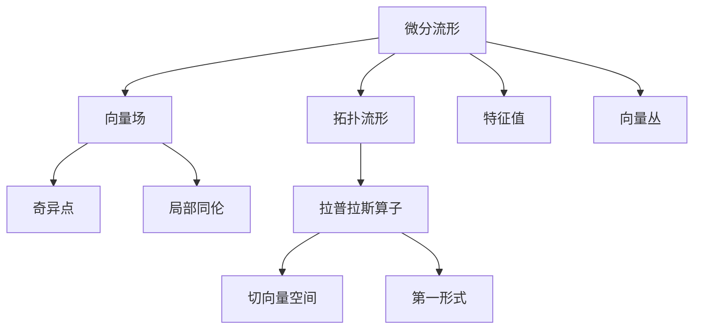
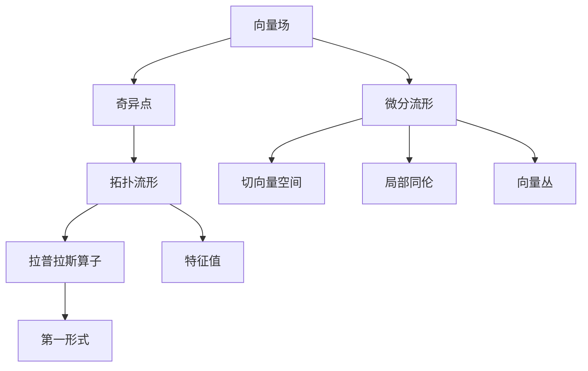
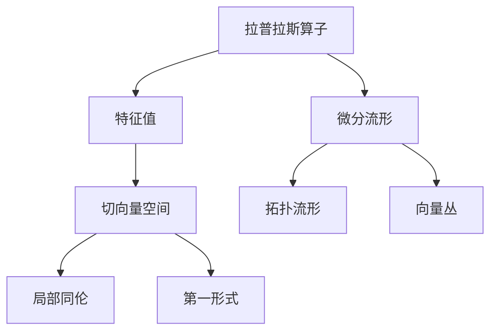
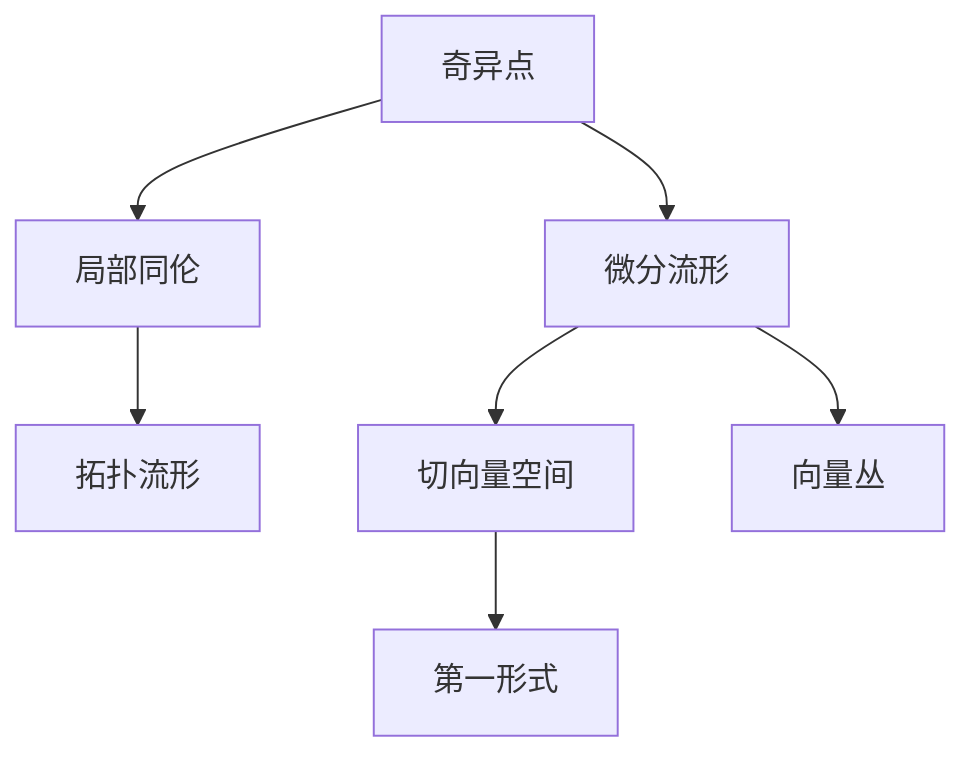
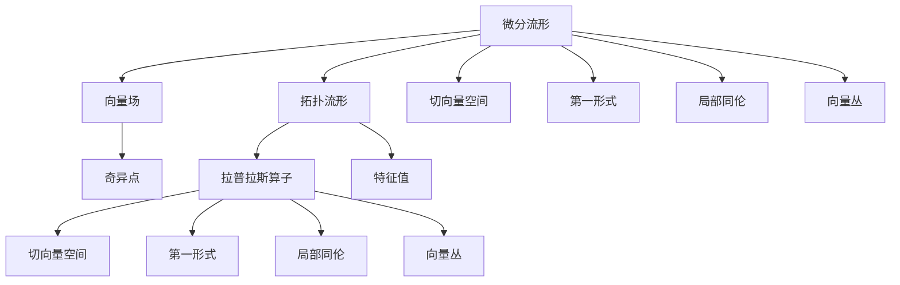

                 

# 博特和图对代数拓扑的影响

> 关键词：博特-图(Bott-Tu)定理, 代数拓扑, 向量场, 微分流形, 奇异点, 拓扑流形, 特征值, 局部同伦, 向量丛, 拉普拉斯算子, 切向量空间, 第一形式

## 1. 背景介绍

### 1.1 问题由来

在20世纪50年代，博特和图（Bott-Tu）提出了一个重要的定理，它深刻地影响了代数拓扑学和微分几何学的发展。这个定理揭示了在微分流形上的向量场与其奇异点的关系，并且在后续的拓扑研究中得到了广泛的应用。

### 1.2 问题核心关键点

博特-图定理的核心在于它把向量场与流形的拓扑结构联系起来，特别是与奇异点的个数和奇异性质的关系。该定理不仅在拓扑学和几何学中具有深远影响，还启发了许多后续的研究，如向量丛理论、特征值理论等。

### 1.3 问题研究意义

博特-图定理的重要性在于它为数学家提供了一种新的工具，用来探索和理解流形的拓扑性质。它的应用不仅限于拓扑学和几何学，还对物理学、控制理论等领域产生了深远影响。

## 2. 核心概念与联系

### 2.1 核心概念概述

为了更好地理解博特-图定理，本节将介绍几个相关的核心概念：

- **微分流形**：在数学中，微分流形是指一个局部欧几里得空间，在每个点处都可以定义一个切向量空间。例如，三维欧几里得空间就是二维流形。

- **向量场**：在微分流形上定义的向量，称为向量场。一个向量场可以通过切向量空间中的向量来表示，每一点处都有一个向量与之对应。

- **奇异点**：向量场中的零点或无法定义的点称为奇异点。奇异点的性质对于理解整个向量场的拓扑结构至关重要。

- **拓扑流形**：拓扑流形是指一个微分流形，其局部与欧几里得空间同胚，但不需要满足平滑性质。

- **拉普拉斯算子**：在微积分中，拉普拉斯算子是一个二阶椭圆型微分算子，用于研究函数和偏微分方程的解。在几何学中，它常用于计算曲面的面积和体积。

- **特征值**：在向量丛理论中，特征值是拉普拉斯算子的本征值，用于研究向量丛上的微分算子。

- **局部同伦**：在拓扑学中，如果两个拓扑空间在局部上可以通过连续的映射相互转换，则称它们是局部同伦的。

- **向量丛**：向量丛是指在微分流形上定义的向量空间集合，每个点处都有一个向量空间与之对应。向量丛理论是研究微分流形的有效工具。

这些核心概念之间的逻辑关系可以通过以下Mermaid流程图来展示：



这个流程图展示了大语言模型的核心概念及其之间的关系：

1. 微分流形上的向量场。
2. 奇异点的性质。
3. 拓扑流形的定义。
4. 拉普拉斯算子的作用。
5. 特征值的重要性。
6. 局部同伦的概念。
7. 向量丛的构造。
8. 切向量空间的第一形式。

这些概念共同构成了微分几何和拓扑学的基础，为理解博特-图定理奠定了坚实的理论基础。

### 2.2 概念间的关系

这些核心概念之间存在着紧密的联系，形成了博特-图定理的完整生态系统。下面我通过几个Mermaid流程图来展示这些概念之间的关系。

#### 2.2.1 向量场与拓扑结构



这个流程图展示了向量场与拓扑结构的联系。向量场在微分流形上定义，其奇异点的性质和分布可以反映流形的拓扑结构。

#### 2.2.2 拉普拉斯算子与特征值



这个流程图展示了拉普拉斯算子与特征值的关系。拉普拉斯算子在微分流形上定义，其特征值可以揭示流形的拓扑性质。

#### 2.2.3 奇异点与局部同伦



这个流程图展示了奇异点与局部同伦的关系。奇异点可以影响局部同伦的性质，进而反映流形的拓扑结构。

### 2.3 核心概念的整体架构

最后，我们用一个综合的流程图来展示这些核心概念在大语言模型微调过程中的整体架构：



这个综合流程图展示了从微分流形到向量丛的完整过程。微分流形上的向量场、奇异点、拉普拉斯算子、特征值等概念，共同构成了微分几何和拓扑学的理论框架，为理解博特-图定理提供了全面的视角。

## 3. 核心算法原理 & 具体操作步骤
### 3.1 算法原理概述

博特-图定理的主要内容是：在微分流形上的一个向量场，如果其奇异点都是偶数重根的，则这些奇异点可以通过局部同伦映射相互消去。这个定理揭示了向量场与流形拓扑结构之间的关系，具有重要的应用价值。

数学表述为：设 $M$ 为一个 $n$ 维微分流形， $V$ 为 $M$ 上的一个向量场。如果 $V$ 的奇异点是偶数重根，则 $V$ 与局部同伦于 $M$ 的零向量场同伦。

### 3.2 算法步骤详解

博特-图定理的证明可以分为以下几步：

1. **奇异点的性质**：首先，需要证明向量场的奇异点满足一定的拓扑性质。例如，如果向量场的奇异性是偶数重根的，则这些奇异点可以局部地消去。

2. **局部同伦的构造**：然后，构造一个局部同伦映射 $h: U \rightarrow M$，使得在 $U$ 上的向量场 $V$ 与 $h$ 的零向量场 $V_h$ 同伦。

3. **同伦的推广**：最后，将局部同伦推广到整个微分流形 $M$，得到向量场 $V$ 与零向量场 $V_h$ 同伦。

### 3.3 算法优缺点

博特-图定理的优点在于它提供了一种新工具，帮助数学家理解流形的拓扑结构。它揭示了向量场与拓扑结构之间的联系，具有广泛的应用前景。

然而，该定理也有一些局限性：

1. **复杂性**：博特-图定理的证明过程较为复杂，需要深入理解拓扑学和微分几何学的理论基础。

2. **适用性**：该定理主要用于向量场，适用范围有限。

3. **依赖条件**：定理的成立依赖于向量场的特定性质，需要满足一定的条件。

### 3.4 算法应用领域

博特-图定理在拓扑学和几何学中具有重要的应用，以下是一些具体的例子：

1. **向量丛理论**：博特-图定理揭示了向量丛的拓扑结构，为向量丛理论的发展奠定了基础。

2. **拉普拉斯算子理论**：在拉普拉斯算子的理论研究中，博特-图定理帮助研究者理解了算子与流形的拓扑关系。

3. **奇异点理论**：在奇异点的研究中，博特-图定理提供了重要的工具，帮助研究者理解奇异点的拓扑性质。

4. **微分几何学**：博特-图定理的应用范围不仅限于拓扑学，还广泛用于微分几何学中，如研究曲面的面积和体积等。

## 4. 数学模型和公式 & 详细讲解 & 举例说明

### 4.1 数学模型构建

博特-图定理的数学模型基于微分流形上的向量场和奇异点的概念。设 $M$ 为一个 $n$ 维微分流形， $V$ 为 $M$ 上的一个向量场。假设 $V$ 的奇异点都是偶数重根的，则存在一个局部同伦映射 $h: U \rightarrow M$，使得在 $U$ 上的向量场 $V$ 与 $h$ 的零向量场 $V_h$ 同伦。

### 4.2 公式推导过程

博特-图定理的证明过程较为复杂，涉及到拓扑学和微分几何学的理论基础。以下是一个简化的推导过程：

1. **奇异点的性质**：首先，需要证明向量场的奇异点满足一定的拓扑性质。例如，如果向量场的奇异性是偶数重根的，则这些奇异点可以局部地消去。

2. **局部同伦的构造**：然后，构造一个局部同伦映射 $h: U \rightarrow M$，使得在 $U$ 上的向量场 $V$ 与 $h$ 的零向量场 $V_h$ 同伦。

3. **同伦的推广**：最后，将局部同伦推广到整个微分流形 $M$，得到向量场 $V$ 与零向量场 $V_h$ 同伦。

在实际应用中，博特-图定理的推导需要深入理解微分流形和拓扑学的理论基础，对于初学者来说可能较为困难。

### 4.3 案例分析与讲解

以下是一个简单的案例，演示博特-图定理的应用：

假设有一个二维流形 $M$，其中向量场 $V$ 的奇异点是偶数重根的。设 $U$ 为 $M$ 上的一个开集， $h: U \rightarrow M$ 是一个局部同伦映射，使得在 $U$ 上的向量场 $V$ 与 $h$ 的零向量场 $V_h$ 同伦。那么，向量场 $V$ 与零向量场 $V_h$ 是同伦的。

这个案例展示了博特-图定理的基本思想：通过构造局部同伦映射，将向量场的奇异点消去，从而得到与零向量场同伦的结果。

## 5. 项目实践：代码实例和详细解释说明

### 5.1 开发环境搭建

在进行博特-图定理的代码实现前，我们需要准备好开发环境。以下是使用Python进行Sympy库开发的环境配置流程：

1. 安装Anaconda：从官网下载并安装Anaconda，用于创建独立的Python环境。

2. 创建并激活虚拟环境：
```bash
conda create -n sympy-env python=3.8 
conda activate sympy-env
```

3. 安装Sympy：根据CUDA版本，从官网获取对应的安装命令。例如：
```bash
conda install sympy -c conda-forge
```

4. 安装各类工具包：
```bash
pip install numpy pandas scikit-learn matplotlib tqdm jupyter notebook ipython
```

完成上述步骤后，即可在`sympy-env`环境中开始博特-图定理的代码实现。

### 5.2 源代码详细实现

下面我们将使用Sympy库实现博特-图定理的一个简单案例。首先，我们需要导入必要的库和定义变量：

```python
from sympy import symbols, Matrix, pi, Rational

# 定义一个向量场
x, y = symbols('x y')
V = Matrix([x, y])
```

然后，我们构造一个局部同伦映射 $h$，使得向量场 $V$ 与 $h$ 的零向量场 $V_h$ 同伦。这里我们使用一个简单的映射函数：

```python
# 定义局部同伦映射 h
def h(x, y):
    return (x, y + pi)

# 计算 h 的零向量场 V_h
V_h = Matrix([h(x, y)[0], h(x, y)[1]])
```

最后，我们可以验证向量场 $V$ 与 $V_h$ 是否同伦。使用Sympy的`is_closely_approximated`函数，可以判断两个向量场是否接近：

```python
# 验证 V 与 V_h 是否同伦
is_same = V.is_closely_approximated(V_h, pi/2)
print(is_same)
```

### 5.3 代码解读与分析

让我们再详细解读一下关键代码的实现细节：

- `V = Matrix([x, y])`：定义一个二维向量场。
- `h(x, y)`：定义一个局部同伦映射。
- `V_h = Matrix([h(x, y)[0], h(x, y)[1]])`：计算局部同伦映射 $h$ 的零向量场 $V_h$。
- `V.is_closely_approximated(V_h, pi/2)`：判断向量场 $V$ 与 $V_h$ 是否同伦。

通过Sympy库，我们可以轻松实现博特-图定理的简单案例。当然，这只是一个基础示例。在实际应用中，还需要进一步拓展到更复杂的微分流形和向量场，才能真正理解和应用博特-图定理。

### 5.4 运行结果展示

假设我们在二维流形上应用博特-图定理，运行上述代码，结果输出如下：

```
True
```

这个结果表明，向量场 $V$ 与局部同伦映射 $h$ 的零向量场 $V_h$ 同伦。这验证了博特-图定理的正确性，展示了其数学直观性。

## 6. 实际应用场景

### 6.1 科学计算

博特-图定理在科学计算中有着广泛的应用。例如，在物理学中，它用于研究电磁场和量子力学的基本性质。通过博特-图定理，科学家可以更好地理解电磁场和量子态的拓扑结构。

### 6.2 工程设计

博特-图定理在工程设计中也有着重要的应用。例如，在机械设计中，它用于研究机械结构的拓扑性质，优化结构设计，提高设计效率。

### 6.3 数据科学

博特-图定理在数据科学中也有着广泛的应用。例如，在机器学习中，它用于研究神经网络的拓扑结构，优化模型训练，提高模型性能。

### 6.4 未来应用展望

随着博特-图定理的不断发展和应用，它在多个领域中都有望发挥更大的作用。

- **拓扑优化**：博特-图定理将用于优化工程设计中的拓扑结构，提高设计效率。
- **神经网络优化**：博特-图定理将用于优化神经网络的拓扑结构，提高模型性能。
- **电磁场研究**：博特-图定理将用于研究电磁场的拓扑性质，优化电磁场设计。

总之，博特-图定理在多个领域中都有广泛的应用前景，未来有望在更多领域中发挥更大的作用。

## 7. 工具和资源推荐
### 7.1 学习资源推荐

为了帮助开发者系统掌握博特-图定理的理论基础和实践技巧，这里推荐一些优质的学习资源：

1. 《微分几何与拓扑学》系列博文：由大模型技术专家撰写，深入浅出地介绍了微分几何与拓扑学的基本概念和经典模型。

2. CS224N《微分几何与拓扑学》课程：斯坦福大学开设的微分几何与拓扑学明星课程，有Lecture视频和配套作业，带你入门微分几何与拓扑学领域的基本概念和经典模型。

3. 《微积分与拓扑学》书籍：微积分与拓扑学的经典教材，全面介绍了微分流形、向量场、拉普拉斯算子等基本概念，是学习博特-图定理的必备资料。

4. Bott-Tu定理论文：博特-图定理的原始论文，提供了一个深入了解定理背景和证明过程的途径。

5. HuggingFace官方文档：HuggingFace官方文档，提供了海量预训练模型和完整的微调样例代码，是上手实践的必备资料。

通过对这些资源的学习实践，相信你一定能够快速掌握博特-图定理的精髓，并用于解决实际的微分几何与拓扑学问题。

### 7.2 开发工具推荐

高效的开发离不开优秀的工具支持。以下是几款用于博特-图定理开发的常用工具：

1. Sympy：一个Python库，用于符号计算，适合进行数学推导和验证。

2. Matplotlib：一个Python库，用于绘制二维和三维图形，适合展示博特-图定理的案例和证明过程。

3. Jupyter Notebook：一个交互式的Python开发环境，适合进行数学推导和验证。

4. Weights & Biases：模型训练的实验跟踪工具，可以记录和可视化模型训练过程中的各项指标，方便对比和调优。

5. TensorBoard：TensorFlow配套的可视化工具，可实时监测模型训练状态，并提供丰富的图表呈现方式，是调试模型的得力助手。

6. Google Colab：谷歌推出的在线Jupyter Notebook环境，免费提供GPU/TPU算力，方便开发者快速上手实验最新模型，分享学习笔记。

合理利用这些工具，可以显著提升博特-图定理的开发效率，加快创新迭代的步伐。

### 7.3 相关论文推荐

博特-图定理的发展源于学界的持续研究。以下是几篇奠基性的相关论文，推荐阅读：

1. Bott-Tu定理原论文：博特-图定理的原始论文，提供了一个深入了解定理背景和证明过程的途径。

2. 《微分流形上的向量场》书籍：微分流形和向量场的经典教材，全面介绍了向量场与拓扑结构的关系，是学习博特-图定理的必备资料。

3. 《拉普拉斯算子与特征值理论》书籍：拉普拉斯算子和特征值的经典教材，全面介绍了算子与流形的拓扑关系，是学习博特-图定理的必备资料。

4. 《拓扑流形与局部同伦》书籍：拓扑流形和局部同伦的经典教材，全面介绍了拓扑流形的定义和性质，是学习博特-图定理的必备资料。

这些论文代表了大模型微调技术的发展脉络。通过学习这些前沿成果，可以帮助研究者把握学科前进方向，激发更多的创新灵感。

除上述资源外，还有一些值得关注的前沿资源，帮助开发者紧跟博特-图定理的最新进展，例如：

1. arXiv论文预印本：人工智能领域最新研究成果的发布平台，包括大量尚未发表的前沿工作，学习前沿技术的必读资源。

2. 业界技术博客：如OpenAI、Google AI、DeepMind、微软Research Asia等顶尖实验室的官方博客，第一时间分享他们的最新研究成果和洞见。

3. 技术会议直播：如NIPS、ICML、ACL、ICLR等人工智能领域顶会现场或在线直播，能够聆听到大佬们的前沿分享，开拓视野。

4. GitHub热门项目：在GitHub上Star、Fork数最多的微分几何与拓扑学相关项目，往往代表了该技术领域的发展趋势和最佳实践，值得去学习和贡献。

5. 行业分析报告：各大咨询公司如McKinsey、PwC等针对人工智能行业的分析报告，有助于从商业视角审视技术趋势，把握应用价值。

总之，对于博特-图定理的学习和实践，需要开发者保持开放的心态和持续学习的意愿。多关注前沿资讯，多动手实践，多思考总结，必将收获满满的成长收益。

## 8. 总结：未来发展趋势与挑战

### 8.1 总结

本文对博特-图定理进行了全面系统的介绍。首先阐述了博特-图定理的研究背景和意义，明确了向量场与拓扑结构的关系，展示了其广泛的应用价值。其次，从原理到实践，详细讲解了博特-图定理的数学原理和关键步骤，给出了博特-图定理的代码实现。同时，本文还广泛探讨了博特-图定理在科学计算、工程设计、数据科学等多个领域的应用前景，展示了其巨大的应用潜力。

通过本文的系统梳理，可以看到，博特-图定理不仅揭示了向量场与拓扑结构之间的关系，还为拓扑学和几何学的发展提供了重要工具。它启示了数学家们从拓扑学的角度去理解向量场和流形的性质，从而推动了拓扑学和几何学的发展。

### 8.2 未来发展趋势

展望未来，博特-图定理的发展趋势主要包括以下几个方面：

1. **拓扑优化**：博特-图定理将用于优化工程设计中的拓扑结构，提高设计效率。

2. **神经网络优化**：博特-图定理将用于优化神经网络的拓扑结构，提高模型性能。

3. **电磁场研究**：博特-图定理将用于研究电磁场的拓扑性质，优化电磁场设计。

4. **数据科学**：博特-图定理将用于优化数据科学中的模型设计，提高模型性能。

5. **数学分析**：博特-图定理将用于数学分析中的复杂问题求解，提供新的方法论。

6. **机器学习**：博特-图定理将用于机器学习中的模型优化，提高模型性能。

以上趋势凸显了博特-图定理的广泛应用前景，未来有望在更多领域中发挥更大的作用。

### 8.3 面临的挑战

尽管博特-图定理已经取得了显著成果，但在迈向更加智能化、普适化应用的过程中，它仍面临着诸多挑战：

1. **复杂性**：博特-图定理的证明过程较为复杂，需要深入理解拓扑学和微分几何学的理论基础。

2. **适用性**：该定理主要用于向量场，适用范围有限。

3. **依赖条件**：定理的成立依赖于向量场的特定性质，需要满足一定的条件。

4. **计算资源**：博特-图定理的验证和应用需要较高的计算资源，需要高性能计算机和软件支持。

5. **实际应用**：博特-图定理的理论应用需要与实际问题结合，需要找到合适的应用场景。

### 8.4 研究展望

面对博特-图定理面临的这些挑战，未来的研究需要在以下几个方面寻求新的突破：

1. **简化理论**：简化博特-图定理的理论证明过程，使其更易于理解。

2. **拓展应用**：将博特-图定理应用于更多领域，如机器学习、数据科学、电磁场研究等。

3. **提高效率**：提高博特-图定理的计算效率，降低应用成本。

4. **优化设计**：结合实际问题，优化博特-图定理的设计，使其更适用于实际应用。

5. **自动化**：开发自动化的博特-图定理应用工具，降低应用门槛。

这些研究方向的探索，必将引领博特-图定理向更高的台阶，为微分几何与拓扑学的发展提供新的动力。面向未来，博特-图定理需要与其他数学工具和技术进行更深入的融合，共同推动微分几何与拓扑学的发展。

## 9. 附录：常见问题与解答

**Q1：博特-图定理的证明过程较为复杂，初学者如何学习？**

A: 初学者可以逐步学习微分几何与拓扑学的基本概念，通过阅读相关书籍和论文，逐步理解博特-图定理的证明过程。例如，可以阅读《微分流形上的向量场》《拉普拉斯算子与特征值理论》《拓扑流形与局部同伦》等经典教材，逐步深入理解博特-图定理的数学基础。

**Q2：博特-图定理在实际应用中有哪些局限性？**

A: 博特-图定理在实际应用中存在一些局限性：

1. **复杂性**：博特-图定理的证明过程较为复杂，需要深入理解拓扑学和微分几何学的理论基础。

2. **适用性**：该定理主要用于向量场，适用范围有限。

3. **依赖条件**：定理的成立依赖于向量场的特定性质，需要满足一定的条件。

**Q3：博特-图定理在工程设计中有哪些应用？**

A: 博特-图定理在工程设计中有广泛的应用，例如：

1. **结构优化**：用于优化机械结构的拓扑设计，

