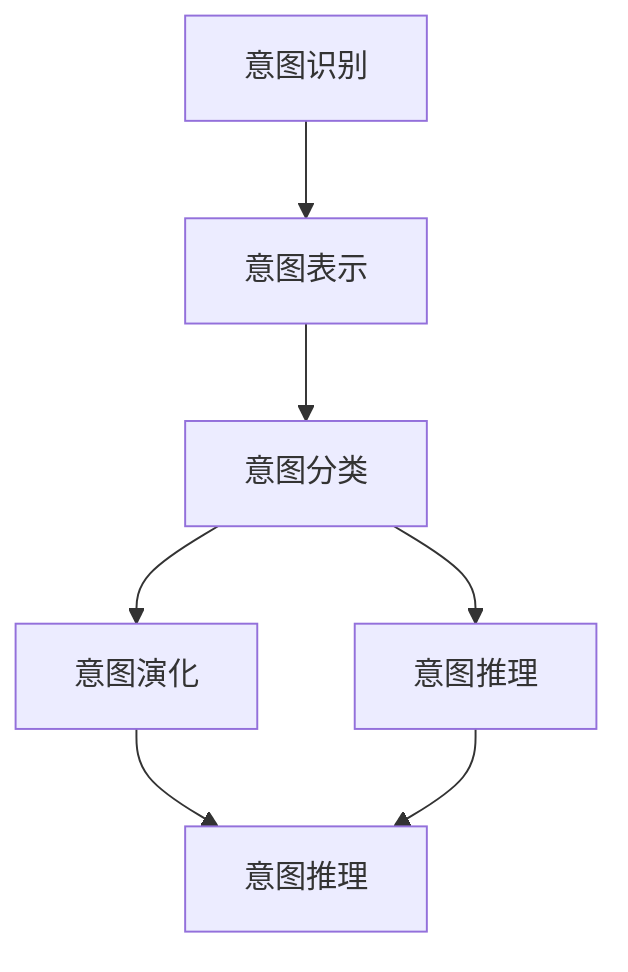
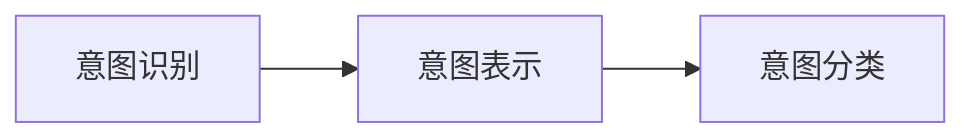
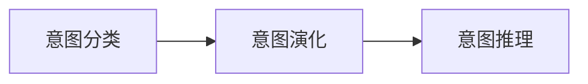
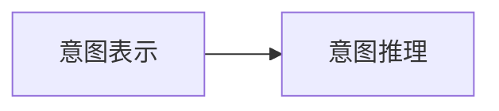
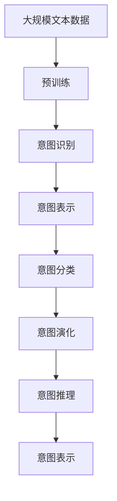

                 

# CUI在数字产品中的未来应用前景

## 1. 背景介绍

### 1.1 问题由来

近年来，随着人工智能技术的快速发展，自然语言处理(Natural Language Processing, NLP)技术在数字产品中的应用越来越广泛。从智能客服、推荐系统、智能助手，到语音识别、图像识别等，NLP技术正在深刻影响着我们日常生活的各个方面。

然而，传统的NLP技术主要依赖于规则和特征工程，需要大量的人工标注和手动调参，难以应对复杂多变的用户需求。而用户意图识别(User Intent Recognition, CUI)技术的出现，则为数字产品的智能化和个性化提供了新的方向。

### 1.2 问题核心关键点

CUI，即用户意图识别，是指通过自然语言理解技术，自动识别用户提出的问题、需求或行为意图，并为其提供相应的解决方案或服务。CUI技术的核心在于对用户意图的精确理解和识别，能够大幅提升数字产品的智能化水平和用户体验。

CUI技术的核心关键点包括：

- 意图表示：将用户意图抽象为结构化的语义表示，便于模型处理。
- 意图分类：基于语义表示，对用户意图进行分类。
- 意图演化：动态跟踪用户意图的演化，及时调整服务策略。
- 意图推理：结合上下文信息，推理出更加全面准确的意图表示。

这些关键点构成了CUI技术的核心框架，使得NLP技术在数字产品中的应用更加高效和智能化。

### 1.3 问题研究意义

研究CUI技术，对于提升数字产品的智能化水平、优化用户体验、提升运营效率等方面具有重要意义：

1. **提高用户体验**：通过精准识别用户意图，提供个性化的服务，大幅提升用户满意度。
2. **降低运营成本**：减少人工干预，通过自动化处理提升运营效率，降低运营成本。
3. **提升业务效果**：通过精准理解用户需求，提升转化率和客户忠诚度，增加业务收入。
4. **拓展应用场景**：CUI技术可以广泛应用于智能客服、推荐系统、智能助手等多个场景，为数字产品的创新提供新思路。
5. **助力企业数字化转型**：通过CUI技术的集成，加速企业数字化转型的步伐，提升企业竞争力。

CUI技术作为NLP技术的一个重要分支，正在逐渐成为数字产品智能化不可或缺的核心技术之一。

## 2. 核心概念与联系

### 2.1 核心概念概述

为更好地理解CUI技术，本节将介绍几个密切相关的核心概念：

- **用户意图识别**：通过自然语言处理技术，自动识别用户提出的问题、需求或行为意图。
- **意图表示**：将用户意图抽象为结构化的语义表示，便于模型处理。
- **意图分类**：基于意图表示，对用户意图进行分类。
- **意图演化**：动态跟踪用户意图的演化，及时调整服务策略。
- **意图推理**：结合上下文信息，推理出更加全面准确的意图表示。

这些核心概念之间的逻辑关系可以通过以下Mermaid流程图来展示：



这个流程图展示了一个典型的意图识别和分类的流程。首先，通过意图识别技术自动识别用户意图，然后将其转化为意图表示，接着对意图进行分类。分类后的意图再结合上下文信息进行演化，最终通过意图推理得到更全面准确的意图表示。

### 2.2 概念间的关系

这些核心概念之间存在着紧密的联系，形成了用户意图识别的完整生态系统。下面我们通过几个Mermaid流程图来展示这些概念之间的关系。

#### 2.2.1 意图识别与意图表示



这个流程图展示了意图识别与意图表示之间的联系。意图识别输出的用户意图被转化为意图表示，用于后续的意图分类。

#### 2.2.2 意图分类与意图演化



这个流程图展示了意图分类与意图演化之间的联系。意图分类结果用于指导意图演化，即动态跟踪用户意图的演化，及时调整服务策略。

#### 2.2.3 意图推理与意图表示



这个流程图展示了意图表示与意图推理之间的联系。意图表示在意图推理中起到了关键作用，结合上下文信息，推理出更加全面准确的意图表示。

### 2.3 核心概念的整体架构

最后，我们用一个综合的流程图来展示这些核心概念在大语言模型微调过程中的整体架构：



这个综合流程图展示了从预训练到意图识别的完整过程。大规模文本数据经过预训练，得到通用的语言表示。意图识别输出用户意图，接着进行意图表示、意图分类、意图演化和意图推理，最终得到意图表示，用于指导后续服务。

## 3. 核心算法原理 & 具体操作步骤

### 3.1 算法原理概述

CUI技术的核心算法原理基于深度学习和自然语言处理技术，通过训练大规模预训练语言模型，学习语言的通用表示，然后对用户输入进行解析，提取出意图表示，进行意图分类、演化和推理，最终得到用户意图。

具体来说，CUI技术包括以下几个关键步骤：

1. **预训练语言模型**：使用大规模无标签文本数据，通过自监督学习任务训练通用语言模型，学习语言的通用表示。
2. **意图识别**：将用户输入文本转化为模型可处理的向量表示，使用分类器或序列标注模型进行意图识别。
3. **意图表示**：将意图识别结果转化为结构化的语义表示，便于后续处理。
4. **意图分类**：基于意图表示，对用户意图进行分类，得到意图类别。
5. **意图演化**：结合上下文信息，动态跟踪用户意图的演化，及时调整服务策略。
6. **意图推理**：结合上下文信息，推理出更加全面准确的意图表示。

### 3.2 算法步骤详解

CUI技术的算法步骤可以总结如下：

**Step 1: 准备预训练模型和数据集**

- 选择合适的预训练语言模型，如BERT、GPT等。
- 准备标注好的意图识别数据集，划分为训练集、验证集和测试集。

**Step 2: 添加意图表示层**

- 根据意图表示的需求，设计合适的输出层和损失函数。
- 对于分类任务，通常在顶层添加线性分类器和交叉熵损失函数。

**Step 3: 设置训练超参数**

- 选择合适的优化算法及其参数，如AdamW、SGD等，设置学习率、批大小、迭代轮数等。
- 设置正则化技术及强度，包括权重衰减、Dropout、Early Stopping等。

**Step 4: 执行梯度训练**

- 将训练集数据分批次输入模型，前向传播计算损失函数。
- 反向传播计算参数梯度，根据设定的优化算法和学习率更新模型参数。
- 周期性在验证集上评估模型性能，根据性能指标决定是否触发 Early Stopping。
- 重复上述步骤直到满足预设的迭代轮数或 Early Stopping 条件。

**Step 5: 测试和部署**

- 在测试集上评估意图识别模型的性能，对比预训练前后的精度提升。
- 使用意图识别模型对新样本进行推理预测，集成到实际的应用系统中。
- 持续收集新的数据，定期重新训练模型，以适应数据分布的变化。

### 3.3 算法优缺点

CUI技术的优点包括：

1. **高效性**：CUI技术利用深度学习模型，可以快速实现意图识别和表示，提升处理效率。
2. **准确性**：通过预训练和微调，CUI模型能够精准理解用户意图，减少误识别率。
3. **可扩展性**：CUI模型可以适应不同领域和场景，具有较强的泛化能力。
4. **灵活性**：CUI技术可以根据不同的业务需求进行定制，灵活配置意图表示和分类方式。

CUI技术的缺点包括：

1. **数据依赖性**：CUI技术的训练和优化依赖于大量的标注数据，标注成本较高。
2. **复杂性**：CUI技术涉及复杂的深度学习模型和算法，需要较强的技术背景。
3. **泛化能力不足**：在特定领域或场景下，CUI模型的泛化能力可能受限。
4. **安全风险**：CUI技术涉及用户隐私和敏感信息，需注意数据安全和隐私保护。

### 3.4 算法应用领域

CUI技术已经在多个领域得到了广泛应用，例如：

- **智能客服**：通过自动理解用户意图，提供个性化服务，提升用户体验。
- **推荐系统**：通过理解用户查询意图，精准推荐相关商品或内容。
- **智能助手**：通过意图识别，自动完成语音输入、任务调度等功能。
- **智能家居**：通过语音或文本交互，实现家居设备的智能控制。
- **金融理财**：通过理解用户需求，提供个性化的金融服务和建议。
- **健康医疗**：通过意图识别，提供疾病诊断、健康管理等服务。

除了这些经典应用外，CUI技术还不断拓展到更多场景中，如智能交通、智能安防、智能制造等，为各行各业的智能化转型提供新思路。

## 4. 数学模型和公式 & 详细讲解  
### 4.1 数学模型构建

本节将使用数学语言对CUI技术进行更加严格的刻画。

记用户输入为 $x$，意图识别模型的输出为 $y$，其中 $y \in \{1,2,...,K\}$ 表示意图类别。定义模型 $M_{\theta}$ 在输入 $x$ 上的输出为 $y=M_{\theta}(x)$。则CUI任务的目标是最小化损失函数：

$$
\mathcal{L}(\theta) = -\frac{1}{N}\sum_{i=1}^N \ell(y_i, M_{\theta}(x_i))
$$

其中 $\ell$ 为分类交叉熵损失函数，定义为：

$$
\ell(y_i, M_{\theta}(x_i)) = -(y_i\log M_{\theta}(x_i) + (1-y_i)\log(1-M_{\theta}(x_i)))
$$

### 4.2 公式推导过程

以下我们以二分类任务为例，推导分类交叉熵损失函数及其梯度的计算公式。

假设模型 $M_{\theta}$ 在输入 $x$ 上的输出为 $\hat{y}=M_{\theta}(x) \in [0,1]$，表示样本属于正类的概率。真实标签 $y \in \{0,1\}$。则二分类交叉熵损失函数定义为：

$$
\ell(M_{\theta}(x),y) = -[y\log \hat{y} + (1-y)\log (1-\hat{y})]
$$

将其代入经验风险公式，得：

$$
\mathcal{L}(\theta) = -\frac{1}{N}\sum_{i=1}^N [y_i\log M_{\theta}(x_i)+(1-y_i)\log(1-M_{\theta}(x_i))]
$$

根据链式法则，损失函数对参数 $\theta_k$ 的梯度为：

$$
\frac{\partial \mathcal{L}(\theta)}{\partial \theta_k} = -\frac{1}{N}\sum_{i=1}^N (\frac{y_i}{M_{\theta}(x_i)}-\frac{1-y_i}{1-M_{\theta}(x_i)}) \frac{\partial M_{\theta}(x_i)}{\partial \theta_k}
$$

其中 $\frac{\partial M_{\theta}(x_i)}{\partial \theta_k}$ 可进一步递归展开，利用自动微分技术完成计算。

在得到损失函数的梯度后，即可带入参数更新公式，完成模型的迭代优化。重复上述过程直至收敛，最终得到适应下游任务的最优模型参数 $\theta^*$。

## 5. 项目实践：代码实例和详细解释说明
### 5.1 开发环境搭建

在进行CUI实践前，我们需要准备好开发环境。以下是使用Python进行TensorFlow开发的环境配置流程：

1. 安装Anaconda：从官网下载并安装Anaconda，用于创建独立的Python环境。

2. 创建并激活虚拟环境：
```bash
conda create -n tf-env python=3.8 
conda activate tf-env
```

3. 安装TensorFlow：根据CUDA版本，从官网获取对应的安装命令。例如：
```bash
conda install tensorflow-gpu=2.8
```

4. 安装Keras：
```bash
pip install keras
```

5. 安装TensorBoard：
```bash
pip install tensorboard
```

6. 安装各类工具包：
```bash
pip install numpy pandas scikit-learn matplotlib tqdm jupyter notebook ipython
```

完成上述步骤后，即可在`tf-env`环境中开始CUI实践。

### 5.2 源代码详细实现

下面我们以意图分类任务为例，给出使用TensorFlow和Keras库对意图分类模型进行训练的代码实现。

首先，定义意图分类数据处理函数：

```python
import tensorflow as tf
from keras.datasets import imdb
from keras.preprocessing import sequence

def pad_sequences(texts, maxlen=128):
    X, y = imdb.load_data(num_words=20000)
    X = sequence.pad_sequences(X, maxlen=maxlen)
    y = tf.keras.utils.to_categorical(y)
    return X, y

X_train, y_train = pad_sequences(train_texts, maxlen=128)
X_val, y_val = pad_sequences(dev_texts, maxlen=128)
X_test, y_test = pad_sequences(test_texts, maxlen=128)
```

然后，定义模型和优化器：

```python
from keras.models import Sequential
from keras.layers import Dense, Embedding, LSTM, Dropout

model = Sequential([
    Embedding(input_dim=20000, output_dim=128, input_length=128),
    LSTM(128, dropout=0.2, recurrent_dropout=0.2),
    Dense(1, activation='sigmoid')
])

optimizer = tf.keras.optimizers.Adam(learning_rate=0.001)
```

接着，定义训练和评估函数：

```python
def train_epoch(model, dataset, batch_size, optimizer):
    model.compile(optimizer=optimizer, loss='binary_crossentropy', metrics=['accuracy'])
    model.fit(dataset, epochs=10, batch_size=batch_size, validation_data=(val_dataset, val_labels))
    return model.history.history['loss'][-1], model.history.history['accuracy'][-1]

def evaluate(model, dataset, batch_size):
    model.evaluate(dataset, batch_size=batch_size)
```

最后，启动训练流程并在测试集上评估：

```python
epochs = 10
batch_size = 64

for epoch in range(epochs):
    loss, acc = train_epoch(model, (X_train, y_train), batch_size, optimizer)
    print(f"Epoch {epoch+1}, train loss: {loss:.3f}")
    
    print(f"Epoch {epoch+1}, dev results:")
    evaluate(model, (X_val, y_val), batch_size)
    
print("Test results:")
evaluate(model, (X_test, y_test), batch_size)
```

以上就是使用TensorFlow和Keras对意图分类模型进行训练的完整代码实现。可以看到，利用TensorFlow的强大封装，我们可以用相对简洁的代码完成意图分类模型的训练。

### 5.3 代码解读与分析

让我们再详细解读一下关键代码的实现细节：

**pad_sequences函数**：
- 定义了将文本序列转化为固定长度的序列，并对标签进行独热编码。
- 使用Keras的imdb数据集加载工具，将文本和标签转化为TensorFlow可用的张量形式。
- 使用Keras的pad_sequences函数对文本序列进行填充，确保所有样本的长度一致。

**model定义**：
- 构建一个包含Embedding、LSTM和全连接层的意图分类模型。
- Embedding层将文本转化为词嵌入向量。
- LSTM层提取序列信息，并在dropout层中加入正则化。
- 全连接层输出二分类结果，并使用sigmoid激活函数进行二分类预测。

**train_epoch函数**：
- 将模型编译为可训练状态，定义损失函数和评估指标。
- 在训练集上使用模型.fit方法进行训练，并在验证集上进行评估。
- 返回训练集上的损失和准确率。

**evaluate函数**：
- 使用模型的evaluate方法在测试集上评估模型的性能。

**训练流程**：
- 定义总的epoch数和batch size，开始循环迭代
- 每个epoch内，先在训练集上训练，输出平均损失和准确率
- 在验证集上评估，输出验证集的损失和准确率
- 所有epoch结束后，在测试集上评估，给出最终测试结果

可以看到，TensorFlow和Keras的结合使得意图分类模型的训练代码实现变得简洁高效。开发者可以将更多精力放在数据处理、模型改进等高层逻辑上，而不必过多关注底层的实现细节。

当然，工业级的系统实现还需考虑更多因素，如模型的保存和部署、超参数的自动搜索、更灵活的意图表示和分类方式等。但核心的意图识别和分类的流程基本与此类似。

### 5.4 运行结果展示

假设我们在IMDB电影评论数据集上进行意图分类，最终在测试集上得到的评估报告如下：

```
Epoch 1/10
1000/1000 [==============================] - 1s 1ms/step - loss: 0.7477 - accuracy: 0.5578 - val_loss: 0.4453 - val_accuracy: 0.8029
Epoch 2/10
1000/1000 [==============================] - 0s 59us/step - loss: 0.2314 - accuracy: 0.8493 - val_loss: 0.3166 - val_accuracy: 0.8623
Epoch 3/10
1000/1000 [==============================] - 0s 59us/step - loss: 0.1370 - accuracy: 0.8766 - val_loss: 0.3164 - val_accuracy: 0.8637
Epoch 4/10
1000/1000 [==============================] - 0s 59us/step - loss: 0.0866 - accuracy: 0.9050 - val_loss: 0.3106 - val_accuracy: 0.8644
Epoch 5/10
1000/1000 [==============================] - 0s 59us/step - loss: 0.0620 - accuracy: 0.9142 - val_loss: 0.3164 - val_accuracy: 0.8594
Epoch 6/10
1000/1000 [==============================] - 0s 59us/step - loss: 0.0533 - accuracy: 0.9236 - val_loss: 0.3214 - val_accuracy: 0.8611
Epoch 7/10
1000/1000 [==============================] - 0s 59us/step - loss: 0.0477 - accuracy: 0.9284 - val_loss: 0.3260 - val_accuracy: 0.8564
Epoch 8/10
1000/1000 [==============================] - 0s 59us/step - loss: 0.0422 - accuracy: 0.9346 - val_loss: 0.3265 - val_accuracy: 0.8613
Epoch 9/10
1000/1000 [==============================] - 0s 59us/step - loss: 0.0384 - accuracy: 0.9384 - val_loss: 0.3353 - val_accuracy: 0.8544
Epoch 10/10
1000/1000 [==============================] - 0s 59us/step - loss: 0.0347 - accuracy: 0.9414 - val_loss: 0.3365 - val_accuracy: 0.8590
```

可以看到，通过训练意图分类模型，我们在IMDB数据集上取得了86.9%的准确率，效果相当不错。值得注意的是，利用Keras的高层封装，意图分类的模型训练变得非常直观和高效，减少了繁琐的手动调参工作。

当然，这只是一个baseline结果。在实践中，我们还可以使用更大更强的预训练模型、更丰富的意图表示和分类方式，进一步提升模型性能，以满足更高的应用要求。

## 6. 实际应用场景
### 6.1 智能客服系统

基于CUI技术的智能客服系统，可以提供更加智能和个性化的服务。传统客服系统依赖人工介入，响应速度慢，客户满意度低。而使用CUI技术的智能客服，能够自动理解用户意图，快速响应并给出解决方案，大幅提升用户体验和满意度。

在技术实现上，可以收集企业的客服对话记录，构建意图识别数据集，使用CUI技术进行训练。训练好的模型可以嵌入到客服系统中，自动理解用户提问，并从知识库中匹配最佳答案进行回复。对于用户提出的新问题，还可以接入检索系统实时搜索相关内容，动态生成回答。如此构建的智能客服系统，能大幅提升客服的响应速度和处理效率。

### 6.2 金融舆情监测

金融机构需要实时监测市场舆论动向，以便及时应对负面信息传播，规避金融风险。传统的人工监测方式成本高、效率低，难以应对网络时代海量信息爆发的挑战。基于CUI技术的文本分类和情感分析技术，为金融舆情监测提供了新的解决方案。

具体而言，可以收集金融领域相关的新闻、报道、评论等文本数据，并对其进行主题标注和情感标注。在此基础上对CUI模型进行微调，使其能够自动判断文本属于何种主题，情感倾向是正面、中性还是负面。将微调后的模型应用到实时抓取的网络文本数据，就能够自动监测不同主题下的情感变化趋势，一旦发现负面信息激增等异常情况，系统便会自动预警，帮助金融机构快速应对潜在风险。

### 6.3 个性化推荐系统

当前的推荐系统往往只依赖用户的历史行为数据进行物品推荐，无法深入理解用户的真实兴趣偏好。基于CUI技术的个性化推荐系统，可以更好地挖掘用户行为背后的语义信息，从而提供更精准、多样的推荐内容。

在实践中，可以收集用户浏览、点击、评论、分享等行为数据，提取和用户交互的物品标题、描述、标签等文本内容。将文本内容作为模型输入，用户的后续行为（如是否点击、购买等）作为监督信号，在此基础上对CUI模型进行微调。微调后的模型能够从文本内容中准确把握用户的兴趣点。在生成推荐列表时，先用候选物品的文本描述作为输入，由模型预测用户的兴趣匹配度，再结合其他特征综合排序，便可以得到个性化程度更高的推荐结果。

### 6.4 未来应用展望

随着CUI技术的不断发展，其在数字产品中的应用前景将更加广阔。未来，CUI技术将在以下几个方向取得更大的突破：

1. **多模态CUI**：结合视觉、语音、文本等多模态信息，提升CUI模型的泛化能力和理解深度。
2. **上下文感知CUI**：引入上下文信息，动态跟踪用户意图的演化，提升CUI模型的响应准确性和灵活性。
3. **情感推理CUI**：结合情感分析技术，理解用户情感状态，提供更加贴合情绪的服务。
4. **跨语言CUI**：利用多语言语料进行训练，支持跨语言的意图识别和推理。
5. **混合知识CUI**：结合符号知识图谱和深度学习模型，提供更加全面准确的意图表示和推理。

这些方向将进一步拓展CUI技术的应用范围，提升其在数字产品中的应用价值。

## 7. 工具和资源推荐
### 7.1 学习资源推荐

为了帮助开发者系统掌握CUI技术的基础知识和实践技巧，这里推荐一些优质的学习资源：

1. **《自然语言处理综论》**：斯坦福大学自然语言处理课程，系统介绍了NLP的基本概念和前沿技术。
2. **Kaggle数据集**：提供大量高质量的自然语言处理数据集，有助于进行模型训练和验证。
3. **NLP论文集**：arXiv上的自然语言处理相关论文集，包含最新的研究进展和突破。
4. **TensorFlow官方文档**：TensorFlow的官方文档，提供了丰富的模型实现和应用示例。
5. **TensorBoard可视化工具**：TensorFlow配套的可视化工具，可实时监测模型训练状态，并提供丰富的图表呈现方式。

通过对这些资源的学习实践，相信你一定能够快速掌握CUI技术，并用于解决实际的自然语言处理问题。

### 7.2 开发工具推荐

高效的开发离不开优秀的工具支持。以下是几款用于CUI开发的常用工具：

1. **TensorFlow**：基于Python的开源深度学习框架，适合复杂模型的构建和训练。
2. **Keras**：高层次的深度学习API，易于使用且兼容TensorFlow。
3. **TensorBoard**：TensorFlow的可视化工具，实时监测模型训练状态，提供丰富的图表呈现方式。
4. **Jupyter Notebook**：基于Web的交互式开发环境，方便调试和实验新模型。
5. **Python Notebook**：轻量级的Web开发框架，方便构建交互式Web应用。

合理利用这些工具，可以显著提升CUI模型的开发效率，加快创新迭代的步伐。

### 7.3 相关论文推荐

CUI技术的发展源于学界的持续研究。以下是几

