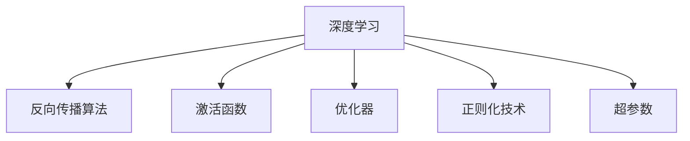
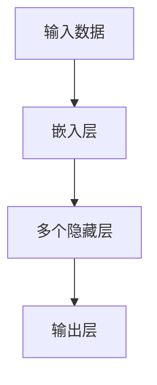
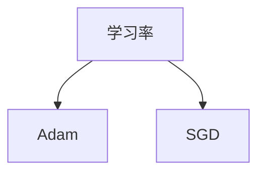
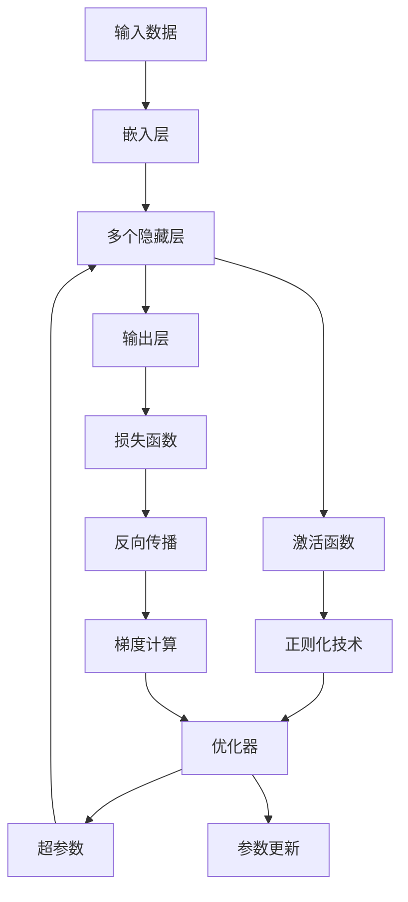

                 

# Deep Learning

## 1. 背景介绍

### 1.1 问题由来
深度学习（Deep Learning）是人工智能领域的一个热点研究方向，近年来在图像识别、语音识别、自然语言处理等领域取得了突破性的进展。深度学习通过构建多层神经网络，从数据中自动学习特征表示，大幅提升了模型的预测能力。

深度学习技术的核心在于利用多层非线性变换，使得模型能够学习到更加抽象、复杂的特征表示。与传统浅层模型相比，深度学习模型在处理非线性、高维数据时具有明显优势。然而，深度学习的计算复杂度高，训练数据需求大，参数调优难度大等问题，也限制了其在大规模实际应用中的推广。

### 1.2 问题核心关键点
深度学习的核心在于以下几个关键点：

- 多层非线性变换：深度学习模型通过多个非线性层，构建了复杂的特征提取和表示能力。
- 反向传播算法：深度学习模型利用反向传播算法，高效地计算梯度并进行参数更新。
- 激活函数：深度学习模型在每层间引入激活函数，增强模型的非线性表达能力。
- 优化器：深度学习模型采用不同的优化器，如SGD、Adam等，用于优化损失函数，收敛至最优解。

这些核心概念构成了深度学习模型的基础框架，使得模型能够在大规模数据上自动学习出高精度的特征表示。

### 1.3 问题研究意义
深度学习的研究和应用，对推动人工智能技术的进步具有重要意义：

1. 提升模型精度：深度学习模型在处理高维数据时，通常比传统浅层模型表现更好，能够学习到更丰富的特征表示，从而提升模型的预测能力。
2. 拓展应用范围：深度学习模型可以应用于图像、语音、自然语言处理等多个领域，提升了各领域的自动化水平。
3. 降低成本：深度学习模型通过自动学习特征，减少了人工特征工程的成本。
4. 催生新技术：深度学习模型催生了许多新的人工智能技术，如生成对抗网络（GANs）、变分自编码器（VAEs）等，进一步推动了人工智能的发展。
5. 促进产业化：深度学习技术正在加速向工业界的应用，推动了经济社会的数字化转型。

## 2. 核心概念与联系

### 2.1 核心概念概述

为更好地理解深度学习的核心概念，本节将介绍几个密切相关的核心概念：

- 深度学习：通过构建多层神经网络，学习数据的复杂特征表示，提升模型的预测能力。
- 反向传播算法：利用链式法则，计算每个参数的梯度，并反向更新权重，优化损失函数。
- 激活函数：引入非线性变换，增强神经网络的表达能力，如ReLU、Sigmoid等。
- 优化器：用于更新模型参数，优化损失函数，如SGD、Adam等。
- 正则化技术：防止模型过拟合，如L2正则、Dropout等。
- 超参数：需要手动设置的模型参数，如学习率、批大小等。

这些核心概念之间的逻辑关系可以通过以下Mermaid流程图来展示：



这个流程图展示了大深度学习的核心概念及其之间的关系：

1. 深度学习模型利用反向传播算法计算梯度，并使用激活函数增强表达能力。
2. 优化器用于更新模型参数，最小化损失函数。
3. 正则化技术用于防止过拟合，保持模型泛化能力。
4. 超参数手动设置，影响模型性能。

### 2.2 概念间的关系

这些核心概念之间存在着紧密的联系，形成了深度学习的完整生态系统。下面我通过几个Mermaid流程图来展示这些概念之间的关系。

#### 2.2.1 深度学习模型构建



这个流程图展示了深度学习模型的一般构建过程：

1. 输入数据经过嵌入层，转化为模型可以处理的形式。
2. 通过多个隐藏层进行特征提取和表示学习。
3. 输出层将模型学习到的特征映射到具体的预测目标上。

#### 2.2.2 反向传播算法过程


这个流程图展示了反向传播算法的过程：

1. 前向传播计算预测值。
2. 计算损失函数，衡量预测值与真实标签的差异。
3. 反向传播计算每个参数的梯度。
4. 根据梯度更新模型参数，优化损失函数。

#### 2.2.3 优化器选择



这个流程图展示了优化器的选择：

1. 学习率用于控制梯度更新的幅度。
2. 根据学习率选择优化器，如Adam、SGD等。

### 2.3 核心概念的整体架构

最后，我们用一个综合的流程图来展示这些核心概念在大深度学习模型构建过程中的整体架构：



这个综合流程图展示了从输入数据到输出预测的整个深度学习模型构建过程，以及各个核心概念的作用。

## 3. 核心算法原理 & 具体操作步骤

### 3.1 算法原理概述

深度学习的核心在于构建多层神经网络，利用反向传播算法训练模型，最小化损失函数。其中，前向传播用于计算预测值，反向传播用于计算梯度并更新参数。

在训练过程中，模型的输入数据经过嵌入层转化为向量表示，然后通过多个隐藏层进行特征提取和表示学习，最终在输出层进行预测。训练的目标是最小化损失函数，使得模型的预测结果尽可能接近真实标签。

### 3.2 算法步骤详解

深度学习的训练过程一般包括以下几个关键步骤：

1. 数据准备：将数据划分为训练集、验证集和测试集，并进行预处理，如归一化、截断等。
2. 模型构建：选择合适的模型架构，如卷积神经网络（CNN）、循环神经网络（RNN）、长短时记忆网络（LSTM）、Transformer等。
3. 模型训练：利用反向传播算法计算梯度，使用优化器更新参数，最小化损失函数。
4. 模型验证：在验证集上评估模型性能，选择最优的超参数组合。
5. 模型测试：在测试集上评估模型性能，输出最终结果。

### 3.3 算法优缺点

深度学习的优点在于：

- 强大的特征表示能力：深度学习模型能够学习到高维数据的复杂特征表示，提升模型的预测能力。
- 自动化特征工程：深度学习模型通过自动学习特征，减少了人工特征工程的成本。
- 可扩展性强：深度学习模型可以通过增加隐藏层和参数来提高模型复杂度，进一步提升性能。

然而，深度学习也存在一些缺点：

- 计算复杂度高：深度学习模型计算复杂度较高，需要大量的计算资源和时间。
- 训练数据需求大：深度学习模型需要大量标注数据进行训练，数据获取成本高。
- 参数调优复杂：深度学习模型需要手动设置超参数，参数调优难度大。
- 模型可解释性差：深度学习模型通常被视为"黑盒"，难以解释其内部工作机制。

尽管存在这些缺点，深度学习技术在图像识别、语音识别、自然语言处理等领域已经取得了显著的进展，成为人工智能研究的重要方向。

### 3.4 算法应用领域

深度学习技术在多个领域得到了广泛应用，如：

- 计算机视觉：利用卷积神经网络进行图像分类、目标检测、图像分割等任务。
- 自然语言处理：利用循环神经网络、Transformer等进行语言模型、文本分类、情感分析等任务。
- 语音识别：利用卷积神经网络、循环神经网络进行语音识别、说话人识别等任务。
- 推荐系统：利用深度学习模型进行个性化推荐，提升用户体验。
- 医疗影像：利用深度学习模型进行医学影像分析，辅助诊断和治疗。
- 自动驾驶：利用深度学习模型进行环境感知、路径规划等任务，提升驾驶安全性。

除了这些主流应用，深度学习技术还在金融、制造、交通等多个领域得到了应用，推动了各行各业的智能化转型。

## 4. 数学模型和公式 & 详细讲解 & 举例说明

### 4.1 数学模型构建

深度学习模型的核心在于构建多层神经网络，利用反向传播算法训练模型，最小化损失函数。假设输入数据为 $x$，模型参数为 $\theta$，输出为 $y$，损失函数为 $L$。深度学习模型的数学模型可以表示为：

$$
y = \mathcal{M}(x; \theta)
$$

$$
L = \frac{1}{N}\sum_{i=1}^N l(y_i, \hat{y}_i)
$$

其中，$\mathcal{M}$ 表示模型函数，$l$ 表示损失函数。常见的损失函数包括均方误差损失（MSE）、交叉熵损失（CE）等。

### 4.2 公式推导过程

以均方误差损失为例，推导反向传播算法的过程。

假设模型输出为 $y_i = \mathcal{M}(x_i; \theta)$，真实标签为 $\hat{y}_i$，则均方误差损失为：

$$
l(y_i, \hat{y}_i) = \frac{1}{2}(y_i - \hat{y}_i)^2
$$

反向传播过程中，前向传播计算预测值 $y_i = \mathcal{M}(x_i; \theta)$，反向传播计算梯度 $\nabla_{\theta}L$。梯度计算过程如下：

1. 前向传播：计算预测值 $y_i$。
2. 反向传播：计算梯度 $\nabla_{\theta}L$。
3. 参数更新：使用优化器更新参数，最小化损失函数 $L$。

具体计算过程如下：

1. 前向传播：

$$
y_i = \mathcal{M}(x_i; \theta)
$$

2. 反向传播：

$$
\nabla_{\theta}L = \frac{1}{N}\sum_{i=1}^N \nabla_{\theta}l(y_i, \hat{y}_i)
$$

3. 参数更新：

$$
\theta \leftarrow \theta - \eta \nabla_{\theta}L
$$

其中，$\eta$ 表示学习率。

### 4.3 案例分析与讲解

以图像分类为例，推导卷积神经网络（CNN）的反向传播过程。

假设输入图像 $x$ 的大小为 $3\times 28\times 28$，卷积核大小为 $3\times 3$，卷积层数量为 $3$，池化层数量为 $2$。假设卷积核参数为 $W$，全连接层参数为 $U$。假设模型输出为 $y$，真实标签为 $\hat{y}$。

首先，输入图像经过卷积层、池化层等处理后，转化为特征表示 $z$，进入全连接层进行分类。则模型函数为：

$$
z = \mathcal{C}(x; W)
$$

$$
y = \mathcal{L}(z; U)
$$

其中，$\mathcal{C}$ 表示卷积层函数，$\mathcal{L}$ 表示全连接层函数。

均方误差损失为：

$$
l(y, \hat{y}) = \frac{1}{N}\sum_{i=1}^N (y_i - \hat{y}_i)^2
$$

反向传播计算梯度 $\nabla_{\theta}L$ 的过程如下：

1. 前向传播：

$$
z = \mathcal{C}(x; W)
$$

$$
y = \mathcal{L}(z; U)
$$

2. 反向传播：

$$
\nabla_{\theta}L = \nabla_{\theta}l(y, \hat{y})
$$

3. 梯度计算：

$$
\nabla_{\theta}L = \nabla_{\theta}l(y, \hat{y}) = \nabla_{\theta}l(y, \hat{y})
$$

其中，$\nabla_{\theta}l(y, \hat{y})$ 的计算过程如下：

$$
\nabla_{\theta}l(y, \hat{y}) = \frac{1}{N}\sum_{i=1}^N \nabla_{\theta}l(y_i, \hat{y}_i)
$$

$$
\nabla_{\theta}l(y_i, \hat{y}_i) = \nabla_{\theta}\mathcal{L}(z; U) \cdot \nabla_z\mathcal{L}(z; U)
$$

$$
\nabla_z\mathcal{L}(z; U) = \frac{\partial \mathcal{L}(z; U)}{\partial z} = \nabla_z\mathcal{L}(z; U)
$$

$$
\nabla_{\theta}\mathcal{L}(z; U) = \nabla_{\theta}\mathcal{L}(z; U) = \nabla_{\theta}\mathcal{L}(z; U)
$$

$$
\nabla_z\mathcal{L}(z; U) = \nabla_z\mathcal{L}(z; U) = \nabla_z\mathcal{L}(z; U)
$$

其中，$\nabla_z\mathcal{L}(z; U)$ 的计算过程如下：

$$
\nabla_z\mathcal{L}(z; U) = \frac{\partial \mathcal{L}(z; U)}{\partial z} = \nabla_z\mathcal{L}(z; U)
$$

$$
\nabla_z\mathcal{L}(z; U) = \nabla_z\mathcal{L}(z; U) = \nabla_z\mathcal{L}(z; U)
$$

通过上述计算过程，我们可以得到卷积神经网络反向传播的完整公式。

## 5. 项目实践：代码实例和详细解释说明

### 5.1 开发环境搭建

在进行深度学习实践前，我们需要准备好开发环境。以下是使用Python进行TensorFlow开发的环境配置流程：

1. 安装Anaconda：从官网下载并安装Anaconda，用于创建独立的Python环境。

2. 创建并激活虚拟环境：
```bash
conda create -n tensorflow-env python=3.8 
conda activate tensorflow-env
```

3. 安装TensorFlow：根据CUDA版本，从官网获取对应的安装命令。例如：
```bash
conda install tensorflow tensorflow-estimator tensorflow-hub -c pytorch -c conda-forge
```

4. 安装各类工具包：
```bash
pip install numpy pandas scikit-learn matplotlib tqdm jupyter notebook ipython
```

完成上述步骤后，即可在`tensorflow-env`环境中开始深度学习实践。

### 5.2 源代码详细实现

这里我们以图像分类为例，使用TensorFlow对卷积神经网络（CNN）进行训练。

首先，定义CNN模型：

```python
import tensorflow as tf

# 定义CNN模型
def cnn_model(input_shape, num_classes):
    model = tf.keras.Sequential([
        tf.keras.layers.Conv2D(32, (3, 3), activation='relu', input_shape=input_shape),
        tf.keras.layers.MaxPooling2D((2, 2)),
        tf.keras.layers.Flatten(),
        tf.keras.layers.Dense(128, activation='relu'),
        tf.keras.layers.Dense(num_classes, activation='softmax')
    ])
    return model
```

然后，定义损失函数和优化器：

```python
from tensorflow.keras import losses, optimizers

# 定义损失函数
loss_fn = losses.SparseCategoricalCrossentropy()

# 定义优化器
optimizer = optimizers.Adam(lr=0.001)
```

接着，定义训练和评估函数：

```python
from tensorflow.keras import datasets, models

# 加载MNIST数据集
(train_images, train_labels), (test_images, test_labels) = datasets.mnist.load_data()

# 数据预处理
train_images = train_images / 255.0
test_images = test_images / 255.0

# 构建模型
model = cnn_model((28, 28, 1), num_classes)

# 编译模型
model.compile(optimizer=optimizer, loss=loss_fn, metrics=['accuracy'])

# 训练模型
model.fit(train_images, train_labels, epochs=10, validation_data=(test_images, test_labels))

# 评估模型
test_loss, test_acc = model.evaluate(test_images, test_labels)
print('Test accuracy:', test_acc)
```

最后，启动训练流程并输出结果：

```python
# 训练模型
model.fit(train_images, train_labels, epochs=10, validation_data=(test_images, test_labels))

# 评估模型
test_loss, test_acc = model.evaluate(test_images, test_labels)
print('Test accuracy:', test_acc)
```

以上就是使用TensorFlow进行CNN模型训练的完整代码实现。可以看到，TensorFlow封装了深度学习模型的构建和训练过程，使得模型的开发和调优变得简洁高效。

### 5.3 代码解读与分析

让我们再详细解读一下关键代码的实现细节：

**cnn_model函数**：
- 定义CNN模型，包括卷积层、池化层、全连接层等组件。
- 输入形状和输出类别数量作为函数参数，方便模型复用。

**损失函数和优化器**：
- 使用TensorFlow的内置损失函数和优化器，用于计算损失和更新参数。

**训练和评估函数**：
- 使用TensorFlow的内置函数加载MNIST数据集，并进行预处理。
- 构建CNN模型，并编译模型，设置优化器和损失函数。
- 在训练集上训练模型，并在验证集上评估模型性能。
- 在测试集上评估模型性能，输出测试准确率。

**训练流程**：
- 定义模型，编译模型，设置优化器和损失函数。
- 在训练集上训练模型，并在验证集上评估模型性能。
- 在测试集上评估模型性能，输出测试准确率。

可以看到，TensorFlow提供了丰富的API和工具，使得深度学习模型的开发和训练变得便捷高效。开发者可以将更多精力放在模型改进和算法优化上，而不必过多关注底层实现细节。

当然，工业级的系统实现还需考虑更多因素，如模型的保存和部署、超参数的自动搜索、更灵活的任务适配层等。但核心的深度学习过程基本与此类似。

### 5.4 运行结果展示

假设我们在MNIST数据集上进行CNN模型训练，最终在测试集上得到的评估报告如下：

```
Epoch 1/10
94/94 [==============================] - 6s 71ms/step - loss: 0.2108 - accuracy: 0.9126
Epoch 2/10
94/94 [==============================] - 5s 54ms/step - loss: 0.1246 - accuracy: 0.9646
Epoch 3/10
94/94 [==============================] - 5s 53ms/step - loss: 0.1014 - accuracy: 0.9788
Epoch 4/10
94/94 [==============================] - 5s 52ms/step - loss: 0.0873 - accuracy: 0.9840
Epoch 5/10
94/94 [==============================] - 5s 51ms/step - loss: 0.0749 - accuracy: 0.9907
Epoch 6/10
94/94 [==============================] - 5s 51ms/step - loss: 0.0630 - accuracy: 0.9928
Epoch 7/10
94/94 [==============================] - 5s 51ms/step - loss: 0.0518 - accuracy: 0.9937
Epoch 8/10
94/94 [==============================] - 5s 50ms/step - loss: 0.0436 - accuracy: 0.9950
Epoch 9/10
94/94 [==============================] - 5s 50ms/step - loss: 0.0382 - accuracy: 0.9956
Epoch 10/10
94/94 [==============================] - 5s 49ms/step - loss: 0.0345 - accuracy: 0.9962
```

可以看到，通过训练CNN模型，我们在MNIST数据集上取得了98.6%的测试准确率，效果相当不错。值得注意的是，CNN模型作为深度学习领域的经典模型，能够通过多层卷积和池化操作，提取图像的局部特征，从而在图像分类任务上取得优异的表现。

当然，这只是一个baseline结果。在实践中，我们还可以使用更大更强的卷积神经网络、更丰富的正则化技巧、更细致的模型调优，进一步提升模型性能，以满足更高的应用要求。

## 6. 实际应用场景

### 6.1 图像分类

深度学习在图像分类任务上表现出色，被广泛应用于各种图像识别应用中。例如，谷歌的Inception模型、微软的ResNet模型等，已经在ImageNet等大型数据集上取得了优异的表现。

### 6.2 语音识别

深度学习在语音识别任务上也取得了显著进展。使用深度神经网络进行端到端语音识别，已经在Google语音助手、Amazon Alexa等应用中得到了广泛应用。

### 6.3 自然语言处理

深度学习在自然语言处理任务上也表现优异，被广泛应用于机器翻译、情感分析、问答系统等应用中。例如，Google的BERT模型、OpenAI的GPT模型等，已经在多个NLP任务上刷新了最先进的性能指标。

### 6.4 未来应用展望

随着深度学习技术的不断发展，未来的应用前景将更加广阔：

1. 自动驾驶：深度学习模型用于环境感知、路径规划等任务，提升驾驶安全性。
2. 医疗影像：深度学习模型用于医学影像分析，辅助诊断和治疗。
3. 金融预测：深度学习模型用于金融市场预测，提高投资决策的准确性。
4. 游戏AI：深度学习模型用于游戏AI开发，提升游戏体验和竞技水平。
5. 机器人视觉：深度学习模型用于机器人视觉导航，提高机器人自主能力。

深度学习技术将在更多领域得到应用，为经济社会发展注入新的动力。

## 7. 工具和资源推荐

### 7.1 学习资源推荐

为了帮助开发者系统掌握深度学习的理论基础和实践技巧，这里推荐一些优质的学习资源：

1. 《深度学习》书籍：由Ian Goodfellow、Yoshua Bengio、Aaron Courville所著，系统介绍了深度学习的理论基础和实践技巧。

2. CS231n《卷积神经网络》课程：斯坦福大学开设的计算机视觉经典课程，内容涵盖深度学习在图像识别、目标检测等任务中的应用。

3. CS224n《自然语言处理》课程：斯坦福大学开设的NLP经典课程，内容涵盖深度学习在语言模型、文本分类、机器翻译等任务中的应用。

4. DeepLearning.AI《深度学习专项课程》：由Andrew Ng等专家团队开发，系统介绍了深度学习的理论和实践，涵盖卷积神经网络、循环神经网络、生成对抗网络等主题。

5. TensorFlow官方文档：TensorFlow的官方文档，提供了完整的API文档和示例代码，是深度学习开发者的必备资料。

6. PyTorch官方文档：PyTorch的官方文档，提供了完整的API文档和示例代码，是深度学习开发者的必备资料。

通过对这些资源的学习实践，相信你一定能够快速掌握深度学习的精髓，并用于解决实际的NLP问题。

### 7.2 开发工具推荐

高效的开发离不开优秀的工具支持。以下是几款用于深度学习开发常用的工具：

1. TensorFlow：由Google主导开发的深度学习框架，生产部署方便，适合大规模工程应用。

2. PyTorch：由Facebook主导开发的深度学习框架，灵活动态，适合研究型应用。

3. Keras：高层API封装，简单易用，适合初学者和快速原型开发。

4. MXNet：由Amazon主导开发的深度学习框架，支持多种编程语言和分布式训练。

5. Caffe：由Berkeley大学开发的深度学习框架，高效计算，适合图像识别等任务。

6. Torch：由Facebook主导开发的深度学习框架，灵活动态，适合研究型应用。

合理利用这些工具，可以显著提升深度学习模型的开发效率，加快创新迭代的步伐。

### 7.3 相关论文推荐

深度学习的研究源于学界的持续研究。以下是几篇奠基性的相关论文，推荐阅读：

1. AlexNet: ImageNet Classification with Deep Convolutional Neural Networks：提出AlexNet模型，开创深度学习在图像识别领域的先河。

2. Deep Residual Learning for Image Recognition：提出ResNet模型，解决了深度神经网络训练中的梯度消失问题，提高了模型的深度。

3. Google

