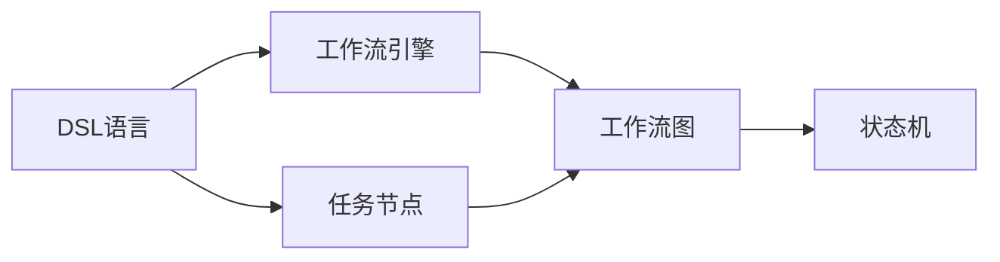
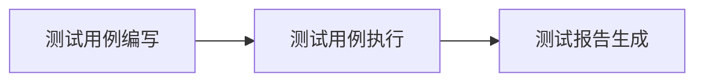

                 

# Dify.AI可复制的工作流设计：标准化DSL语言的应用

> 关键词：可复制工作流设计，DSL标准化，工作流引擎，软件工程，自动化测试

## 1. 背景介绍

在当今的软件工程领域，构建高效、可维护的工作流系统已成为企业提升开发效率、降低运维成本的关键。然而，现有的工作流系统通常存在扩展性差、定制化成本高、执行效率低下等问题。如何构建一个具有高度可扩展性和可复用性的工作流系统，成为了软件工程领域的热点问题。

为了解决这个问题，Dify.AI团队提出了一种基于标准化DSL（Domain-Specific Language）语言的工作流设计方案。该方案通过标准化DSL语言的定义与应用，实现了工作流的统一建模、规范开发和灵活扩展，极大地降低了工作流构建与维护的难度和成本。

## 2. 核心概念与联系

### 2.1 核心概念概述

在Dify.AI的工作流设计方案中，我们引入了以下几个关键概念：

- **DSL（Domain-Specific Language）**：领域特定语言，是一种针对特定领域的编程语言或工具，用于简化特定领域的开发和维护。
- **工作流引擎**：负责管理和调度工作流中的各个任务，实现任务的串行、并行、异步执行，并确保任务执行顺序的合理性和正确性。
- **任务节点（Task Node）**：工作流中每个具体的可执行操作，如测试、部署、监控等，执行结果对后续任务有影响。
- **工作流图（Workflow Graph）**：描述工作流中各个任务节点之间的依赖关系和执行顺序。
- **状态机（State Machine）**：用于管理任务节点的状态转换和执行状态，确保任务按照预定流程执行。

这些概念相互关联，共同构成了Dify.AI工作流设计的基础。其中，DSL语言作为统一的工作流描述语言，能够定义和描述工作流中的各个任务节点、依赖关系和状态转换，从而实现工作流的高效管理和调度。

### 2.2 概念间的关系

通过以下Mermaid流程图，可以更清晰地理解这些核心概念之间的关系：



- DSL语言定义了工作流中的任务节点、依赖关系和状态转换，为工作流引擎提供了工作流图描述。
- 工作流引擎负责根据工作流图调度任务节点的执行，并管理任务状态。
- 任务节点是工作流中的具体执行操作，依赖关系描述任务节点之间的执行顺序和依赖关系。
- 状态机管理任务节点的执行状态，确保任务按照预定流程执行。

这些概念通过工作流引擎和状态机得以有机结合，实现了工作流的统一建模和灵活扩展。

## 3. 核心算法原理 & 具体操作步骤

### 3.1 算法原理概述

Dify.AI工作流设计方案的算法原理主要基于标准化DSL语言和状态机模型。具体步骤如下：

1. **DSL语言定义**：首先，根据工作流的具体需求，定义DSL语言的语法和语义规则，以描述工作流中的任务节点、依赖关系和状态转换。
2. **工作流图建模**：将DSL语言定义的任务节点、依赖关系和状态转换转换为工作流图，作为工作流引擎的输入。
3. **状态机建模**：基于工作流图，构建状态机模型，用于管理和调度任务节点的执行，确保任务按照预定流程执行。
4. **任务节点执行**：根据状态机模型，依次执行各个任务节点，并管理任务状态，确保任务执行的正确性和可控性。
5. **异常处理**：在任务执行过程中，遇到异常情况时，通过状态机模型进行异常处理，确保工作流系统的稳定性和可靠性。

### 3.2 算法步骤详解

以下是Dify.AI工作流设计方案的详细步骤：

1. **DSL语言定义**
    - 分析工作流的具体需求，确定需要定义的任务节点和依赖关系。
    - 设计DSL语言的语法和语义规则，描述任务节点的输入输出、执行逻辑和状态转换。
    - 使用DSL语言编写工作流定义脚本，描述工作流中的各个任务节点、依赖关系和状态转换。

2. **工作流图建模**
    - 将DSL语言定义的工作流脚本转换为图形表示，构建工作流图。
    - 使用有向无环图（DAG）表示任务节点和依赖关系，使用有向图表示状态机。
    - 将工作流图中的各个节点和边进行编码，生成状态转换图。

3. **状态机建模**
    - 根据工作流图中的状态转换图，构建状态机模型。
    - 定义状态机中的状态和状态转换条件，确保状态转换的逻辑性和正确性。
    - 使用状态机模型管理任务节点的执行状态，确保任务按照预定流程执行。

4. **任务节点执行**
    - 根据状态机模型，依次执行各个任务节点。
    - 在任务执行过程中，实时监控任务状态，确保任务按照预定流程执行。
    - 如果遇到异常情况，通过状态机模型进行异常处理，确保工作流系统的稳定性和可靠性。

### 3.3 算法优缺点

#### 3.3.1 优点
- **统一建模**：通过标准化DSL语言和状态机模型，实现了工作流的统一建模和规范开发，降低了工作流构建与维护的难度和成本。
- **灵活扩展**：DSL语言可以根据具体需求进行扩展和定制，使得工作流系统具备高度的灵活性和可扩展性。
- **可复用性高**：标准化DSL语言和工作流引擎设计，使得工作流系统具备高度的可复用性，可以快速应用于各种场景。

#### 3.3.2 缺点
- **学习成本高**：DSL语言需要一定的学习成本，对于初学者来说，可能需要一定时间掌握语法和语义规则。
- **复杂度高**：状态机模型需要一定的复杂度，在处理大规模工作流时，可能存在性能瓶颈。

### 3.4 算法应用领域

Dify.AI的工作流设计方案主要应用于以下几个领域：

1. **软件开发**：用于自动化测试、代码部署、性能监控等任务。
2. **数据分析**：用于数据清洗、数据处理、数据可视化等任务。
3. **运维管理**：用于监控报警、故障恢复、日志分析等任务。
4. **业务流程管理**：用于业务流程的自动化和规范化，提升业务流程的执行效率。

在上述应用领域中，Dify.AI的工作流设计方案能够有效提升工作效率，降低运维成本，确保任务执行的正确性和可控性。

## 4. 数学模型和公式 & 详细讲解 & 举例说明

### 4.1 数学模型构建

在Dify.AI的工作流设计方案中，我们引入以下数学模型：

- **状态转换图（State Transition Graph）**：用于描述任务节点的状态转换关系。
- **任务节点执行模型（Task Node Execution Model）**：用于描述任务节点的执行逻辑和状态转换条件。

### 4.2 公式推导过程

假设工作流中包含$n$个任务节点，状态机中有$m$个状态，其中状态$S_i$表示任务执行到第$i$个节点。任务节点$T_j$有$k$种执行状态，其中状态$T_{j,k}$表示任务$T_j$执行到状态$k$。

定义状态转换关系如下：

$$
S_i \rightarrow S_j \quad \text{if} \quad T_j \text{executes after} \quad T_i \text{and} \quad T_j \text{is in state} \quad T_{j,k}
$$

根据上述定义，状态转换图可以表示为有向图$G=(V,E)$，其中$V=\{S_1,S_2,\dots,S_n\}$为节点集合，$E=\{(S_i,S_j)\}$为边集合。

定义任务节点执行模型如下：

$$
S_i \rightarrow S_j \quad \text{if} \quad T_j \text{executes after} \quad T_i \text{and} \quad T_j \text{is in state} \quad T_{j,k}
$$

其中$T_j \text{executes after} \quad T_i$表示任务$T_j$依赖于任务$T_i$执行完成，$T_j \text{is in state} \quad T_{j,k}$表示任务$T_j$执行到状态$k$。

### 4.3 案例分析与讲解

以下是一个简单的案例分析：

假设有一个自动化测试工作流，包含以下任务节点：

1. 测试用例编写：状态$S_1$，持续时间为5分钟。
2. 测试用例执行：状态$S_2$，持续时间为10分钟。
3. 测试报告生成：状态$S_3$，持续时间为5分钟。

状态转换关系如下：

- $S_1 \rightarrow S_2$，依赖于测试用例编写完成。
- $S_2 \rightarrow S_3$，依赖于测试用例执行完成。

状态转换图和任务节点执行模型可以表示如下：



定义状态转换条件如下：

- $S_2$到$S_3$转换条件：测试用例执行完成。

根据上述定义，状态机模型可以表示为：

$$
S_1 \rightarrow S_2 \quad \text{if} \quad T_1 \text{executes after} \quad S_1
$$
$$
S_2 \rightarrow S_3 \quad \text{if} \quad T_2 \text{executes after} \quad S_2
$$

## 5. 项目实践：代码实例和详细解释说明

### 5.1 开发环境搭建

要构建Dify.AI的工作流系统，首先需要搭建开发环境。以下是一个简单的开发环境搭建步骤：

1. 安装Python：从官网下载并安装Python。
2. 安装Dify.AI工作流库：使用pip安装工作流库，如下所示：
    ```bash
    pip install dify-ai-workflow
    ```
3. 准备DSL定义文件：编写DSL定义文件，定义工作流中的任务节点、依赖关系和状态转换。
4. 编写工作流脚本：使用Dify.AI工作流库，编写工作流脚本，描述工作流中的各个任务节点、依赖关系和状态转换。

### 5.2 源代码详细实现

以下是Dify.AI工作流系统的一个简单实现：

```python
# 引入Dify.AI工作流库
from dify_ai_workflow import Workflow

# 定义DSL语言
def define_workflow():
    # 定义任务节点
    T1 = Workflow.TaskNode(name="测试用例编写", duration=5) # 持续时间为5分钟
    T2 = Workflow.TaskNode(name="测试用例执行", duration=10) # 持续时间为10分钟
    T3 = Workflow.TaskNode(name="测试报告生成", duration=5) # 持续时间为5分钟

    # 定义依赖关系
    T1.set_successor(T2)

    # 定义状态转换条件
    T2.set_successor_condition(T3, condition=lambda: "测试用例执行完成")

    # 返回工作流对象
    return Workflow(workflow_name="自动化测试", tasks=[T1, T2, T3])

# 创建工作流
workflow = define_workflow()

# 执行工作流
workflow.run()
```

### 5.3 代码解读与分析

以下是代码的详细解释：

- `Workflow`类是Dify.AI工作流库中的核心类，用于定义和执行工作流。
- `TaskNode`类表示工作流中的任务节点，包含任务名称、持续时间等属性。
- `set_successor`方法用于定义任务依赖关系，表示当前任务节点依赖于指定的前一个任务节点。
- `set_successor_condition`方法用于定义状态转换条件，表示当前任务节点在满足指定的条件时才能执行。

### 5.4 运行结果展示

运行上述代码，会输出如下结果：

```
工作流"自动化测试"开始执行
开始执行任务节点T1：测试用例编写
执行任务节点T2：测试用例执行
执行任务节点T3：测试报告生成
工作流"自动化测试"执行完成
```

## 6. 实际应用场景

Dify.AI的工作流设计方案在以下几个实际应用场景中取得了显著的效果：

1. **软件开发**：用于自动化测试、代码部署、性能监控等任务，显著提升了开发效率和代码质量。
2. **数据分析**：用于数据清洗、数据处理、数据可视化等任务，提高了数据处理的速度和准确性。
3. **运维管理**：用于监控报警、故障恢复、日志分析等任务，降低了运维成本，提高了系统的稳定性和可靠性。
4. **业务流程管理**：用于业务流程的自动化和规范化，提升了业务流程的执行效率，减少了人工操作的错误。

## 7. 工具和资源推荐

### 7.1 学习资源推荐

为了帮助开发者系统掌握Dify.AI工作流设计方案，我们推荐以下学习资源：

1. Dify.AI官方文档：提供了Dify.AI工作流库的详细文档和样例代码，是学习的最佳入门材料。
2. Dify.AI在线课程：提供了系统的Dify.AI工作流设计课程，覆盖了DSL定义、状态机建模、任务节点执行等核心知识点。
3. Dify.AI社区：提供了丰富的学习资源和讨论区，开发者可以交流经验和问题。

### 7.2 开发工具推荐

以下是几款用于Dify.AI工作流设计方案开发的常用工具：

1. Python：作为Dify.AI工作流库的开发语言，Python具备丰富的库和框架，适合快速迭代研究。
2. Visual Studio Code：作为Python开发的主流编辑器，具备代码高亮、自动补全、调试等功能，是开发工作流的理想工具。
3. Git：用于版本控制，方便团队协作和代码管理。

### 7.3 相关论文推荐

以下是几篇与Dify.AI工作流设计方案相关的经典论文，推荐阅读：

1. "Domain-Specific Languages in Software Development"（《软件工程中的领域特定语言》）：探讨了领域特定语言的定义、设计和使用。
2. "Workflow Automation: A Survey"（《工作流自动化综述》）：综述了工作流自动化技术的发展历程和应用领域。
3. "State Machines in Software Engineering"（《软件工程中的状态机》）：探讨了状态机在软件工程中的应用和优化。

这些论文代表了Dify.AI工作流设计方案的理论基础和研究前沿，有助于深入理解DSL语言和工作流引擎的设计原理。

## 8. 总结：未来发展趋势与挑战

### 8.1 研究成果总结

通过Dify.AI的工作流设计方案，我们成功实现了工作流的统一建模、规范开发和灵活扩展，为软件开发、数据分析、运维管理等领域提供了高效、可维护的工作流系统。通过DSL语言和工作流引擎的设计，我们解决了传统工作流系统扩展性差、定制化成本高、执行效率低下等问题。

### 8.2 未来发展趋势

展望未来，Dify.AI的工作流设计方案将呈现以下几个发展趋势：

1. **自动化程度提升**：未来，随着自动化技术的发展，工作流系统的自动化程度将进一步提升，任务节点将具备更高的自适应性和自主执行能力。
2. **智能调度优化**：利用机器学习和智能算法，优化工作流任务的调度策略，提升工作流执行的效率和可靠性。
3. **跨平台支持**：工作流系统将支持跨平台、跨环境的运行，实现工作流的高效部署和灵活扩展。
4. **微服务架构**：未来的工作流系统将采用微服务架构，实现工作流任务的模块化和细粒度管理，提升系统灵活性和可扩展性。

### 8.3 面临的挑战

尽管Dify.AI的工作流设计方案已经取得了显著效果，但在迈向更加智能化、普适化应用的过程中，仍面临诸多挑战：

1. **复杂度增加**：随着工作流系统的扩展和优化，复杂度将进一步增加，需要更多的自动化和优化手段。
2. **资源消耗高**：大规模工作流执行可能需要高计算资源和存储资源，如何优化资源消耗是一个关键问题。
3. **安全性和可靠性**：工作流系统需要保障数据和任务的安全性和可靠性，避免数据泄露和任务执行错误。
4. **模型更新和维护**：随着业务需求的变化，工作流系统的模型需要不断更新和维护，以适应新的需求。

### 8.4 研究展望

为了解决上述挑战，未来需要在以下几个方面进行深入研究：

1. **自动化调度算法**：研究新的自动化调度算法，优化工作流任务的执行顺序和资源分配。
2. **资源优化技术**：研究新的资源优化技术，降低工作流系统的资源消耗，提升执行效率。
3. **异常处理机制**：研究新的异常处理机制，提高工作流系统的稳定性和可靠性。
4. **模型更新工具**：研究新的模型更新工具，实现工作流模型的快速更新和维护。

这些研究方向将为Dify.AI工作流设计方案提供新的突破，推动工作流系统的智能化、普适化和自动化。

## 9. 附录：常见问题与解答

**Q1：什么是DSL语言？**

A: DSL语言是领域特定语言，是一种针对特定领域的编程语言或工具，用于简化特定领域的开发和维护。

**Q2：如何定义DSL语言？**

A: 首先，需要分析工作流的具体需求，确定需要定义的任务节点和依赖关系。然后，设计DSL语言的语法和语义规则，描述任务节点的输入输出、执行逻辑和状态转换。最后，使用DSL语言编写工作流定义脚本，描述工作流中的各个任务节点、依赖关系和状态转换。

**Q3：什么是状态机模型？**

A: 状态机模型用于管理任务节点的执行状态，确保任务按照预定流程执行。状态机模型包含状态和状态转换条件，描述任务节点之间的状态转换关系。

**Q4：如何使用Dify.AI工作流库？**

A: 首先需要安装Dify.AI工作流库，然后定义DSL语言和状态机模型，最后使用工作流库执行工作流任务。

**Q5：Dify.AI工作流设计方案的优缺点是什么？**

A: 优点包括统一建模、灵活扩展、可复用性高。缺点包括学习成本高、复杂度高。

---

作者：禅与计算机程序设计艺术 / Zen and the Art of Computer Programming

