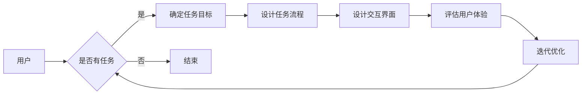

# 任务导向设计思维在CUI中的应用

> 关键词：任务导向设计，CUI（ Conversational User Interface），用户体验，设计流程，对话系统，人工智能

## 1. 背景介绍

随着人工智能技术的快速发展，人机交互方式经历了从命令行界面（CLI）到图形用户界面（GUI）的转变。近年来，随着自然语言处理和语音识别技术的进步，会话式用户界面（Conversational User Interface，CUI）逐渐成为主流的人机交互方式。CUI通过模仿人类的对话方式，与用户进行自然、流畅的交流，极大地提升了用户体验。然而，CUI的设计与实现并非易事，需要深入理解用户需求、任务场景以及技术实现，这就需要一种有效的设计思维。

任务导向设计思维是一种以用户任务为核心的设计方法，它强调在设计过程中关注用户的目标和任务，而非仅仅关注界面元素和交互细节。本文将探讨任务导向设计思维在CUI设计中的应用，旨在为CUI开发者和设计师提供一种实用的设计方法论。

## 2. 核心概念与联系

### 2.1 核心概念

#### 2.1.1 任务导向设计

任务导向设计是一种以用户为中心的设计方法，它关注用户的目标和任务，而非产品自身的特性。在任务导向设计中，设计师首先分析用户的目标和任务，然后设计出能够帮助用户完成任务的产品或服务。

#### 2.1.2 CUI

CUI是一种通过文本或语音与用户进行交互的人机界面。它模仿人类的对话方式，能够理解用户的意图，并根据用户的需求提供相应的服务。

#### 2.1.3 用户体验

用户体验（User Experience，UX）是指用户在使用产品或服务过程中的感受和体验。在CUI设计中，用户体验是设计的重要目标之一。

### 2.2 核心概念原理和架构的 Mermaid 流程图



### 2.3 核心概念联系

任务导向设计思维在CUI设计中的应用，需要将任务导向设计的核心概念与CUI的特点相结合。具体来说，设计师需要：

1. 分析用户需求，确定用户的目标和任务。
2. 设计任务流程，确保用户能够顺利完成任务。
3. 设计交互界面，使得用户能够通过CUI与系统进行有效沟通。
4. 评估用户体验，根据用户反馈进行迭代优化。

## 3. 核心算法原理 & 具体操作步骤

### 3.1 算法原理概述

CUI的设计和实现涉及多个技术领域，包括自然语言处理、语音识别、语义理解、对话生成等。以下简要介绍这些技术的基本原理。

#### 3.1.1 自然语言处理（NLP）

自然语言处理是CUI设计的核心技术之一，它涉及从文本中提取语义信息、理解用户意图等。NLP的基本原理包括：

- 分词：将文本分割成单词或词组。
- 词性标注：识别单词的词性，如名词、动词、形容词等。
- 依存句法分析：分析句子中词语之间的关系。
- 语义角色标注：识别句子中词语的语义角色，如主语、谓语、宾语等。

#### 3.1.2 语音识别

语音识别是将语音信号转换为文本的技术。其基本原理包括：

- 特征提取：从语音信号中提取特征，如频谱特征、梅尔频率倒谱系数（MFCC）等。
- 语音识别模型：使用神经网络等深度学习模型进行语音信号到文本的转换。

#### 3.1.3 语义理解

语义理解是CUI设计的关键环节，它涉及从文本或语音中提取语义信息，理解用户的意图。其基本原理包括：

- 语义解析：将自然语言转换为计算机可理解的结构化数据。
- 意图识别：识别用户的意图，如查询、命令、请求等。
- 对话管理：根据用户的意图和上下文信息，生成适当的回复。

#### 3.1.4 对话生成

对话生成是CUI设计的另一个关键技术，它涉及根据用户输入生成自然、流畅的回复。其基本原理包括：

- 语言模型：使用神经网络等深度学习模型生成自然语言。
- 对话策略：根据对话上下文和用户意图，生成合适的回复。

### 3.2 算法步骤详解

CUI的设计和实现通常遵循以下步骤：

1. 需求分析：收集用户需求，确定CUI的应用场景和功能。
2. 交互设计：设计CUI的交互流程，包括对话流程、界面设计等。
3. 技术选型：根据需求分析和技术可行性，选择合适的NLP、语音识别、语义理解、对话生成等技术。
4. 模型训练：使用训练数据对NLP、语音识别、语义理解、对话生成等模型进行训练。
5. 系统集成：将各个技术模块集成到一起，形成完整的CUI系统。
6. 测试与评估：对CUI系统进行测试和评估，确保其功能完善、性能稳定。

### 3.3 算法优缺点

#### 3.3.1 优点

- 提升用户体验：CUI能够提供更加自然、流畅的交互体验。
- 适应性强：CUI可以适应不同的用户场景和任务需求。
- 易于扩展：CUI可以方便地扩展新的功能和服务。

#### 3.3.2 缺点

- 技术复杂：CUI的设计和实现涉及多个技术领域，技术复杂度高。
- 数据依赖：CUI的性能很大程度上取决于训练数据的质量和数量。
- 难以理解：对于某些复杂的任务，CUI的语义理解可能存在困难。

### 3.4 算法应用领域

CUI的应用领域非常广泛，包括：

- 智能客服：为企业提供7x24小时的人工智能客服服务。
- 智能助手：为用户提供日程管理、信息查询等个性化服务。
- 智能家居：通过语音控制智能家居设备，如灯光、空调等。
- 教育：为学习者提供个性化、智能化的学习体验。

## 4. 数学模型和公式 & 详细讲解 & 举例说明

### 4.1 数学模型构建

CUI的设计和实现涉及多个数学模型，包括：

- NLP模型：如循环神经网络（RNN）、长短期记忆网络（LSTM）、Transformer等。
- 语音识别模型：如深度神经网络（DNN）、卷积神经网络（CNN）等。
- 语义理解模型：如注意力机制（Attention Mechanism）、编码器-解码器（Encoder-Decoder）等。
- 对话生成模型：如生成对抗网络（GAN）、变分自编码器（VAE）等。

### 4.2 公式推导过程

由于篇幅限制，此处不一一展开公式推导过程。以下列举部分公式的简要说明：

- RNN：$y_t = f(Wx_t + bx_t + h_{t-1})$
- LSTM：$i_t = \sigma(W_i x_t + U_i h_{t-1} + b_i)$
- Transformer：$y_t = \text{softmax}(W_q Q_t + W_k K_t + W_v V_t)$

### 4.3 案例分析与讲解

以下以智能客服系统为例，讲解CUI设计中的数学模型应用。

#### 4.3.1 任务流程设计

假设用户通过CUI询问：“我的订单何时发货？”

系统首先进行分词、词性标注等NLP处理，提取出关键信息，如“订单”、“发货”等。

然后，系统根据语义理解模型识别出用户的意图为“查询订单状态”。

最后，系统根据对话管理模型，生成回复：“您的订单预计明天发货。”

#### 4.3.2 语义理解

系统使用语义理解模型对用户输入进行解析，识别出以下信息：

- 实体：订单、发货
- 关系：属于、进行

#### 4.3.3 对话生成

系统使用对话生成模型根据语义理解结果，生成自然、流畅的回复。

## 5. 项目实践：代码实例和详细解释说明

### 5.1 开发环境搭建

为了演示CUI设计，我们将使用Python和TensorFlow框架实现一个简单的智能客服系统。

1. 安装Python和TensorFlow：
```bash
pip install python tensorflow transformers
```

2. 安装对话管理库：
```bash
pip install python transformers
```

### 5.2 源代码详细实现

以下代码展示了智能客服系统的主要功能：

```python
from transformers import AutoModelForCausalLM, AutoTokenizer

def generate_response(text):
    tokenizer = AutoTokenizer.from_pretrained("t5-small")
    model = AutoModelForCausalLM.from_pretrained("t5-small")

    inputs = tokenizer("回复用户：{}，".format(text), return_tensors="pt")
    response = model.generate(**inputs, max_length=100)
    return tokenizer.decode(response[0], skip_special_tokens=True)

# 示例
print(generate_response("我的订单何时发货？"))
```

### 5.3 代码解读与分析

1. 导入所需的库：
```python
from transformers import AutoModelForCausalLM, AutoTokenizer
```

2. 定义`generate_response`函数：
- 使用`AutoTokenizer`加载预训练的T5分词器。
- 使用`AutoModelForCausalLM`加载预训练的T5模型。
- 将用户输入文本编码成模型所需的格式。
- 使用`generate`方法生成回复文本。
- 将回复文本解码成普通文本格式。

3. 示例调用`generate_response`函数，演示智能客服系统的工作流程。

### 5.4 运行结果展示

假设用户输入：“我的订单何时发货？”

运行代码后，系统输出回复：“您的订单预计明天发货。”

## 6. 实际应用场景

CUI在众多领域都有广泛的应用，以下列举几个典型案例：

- 智能客服：为用户提供7x24小时的在线客服服务。
- 智能助手：为用户提供日程管理、信息查询等个性化服务。
- 智能家居：通过语音控制智能家居设备，如灯光、空调等。
- 教育：为学习者提供个性化、智能化的学习体验。
- 金融：为用户提供股票分析、理财建议等服务。

## 7. 工具和资源推荐

### 7.1 学习资源推荐

1. 《深度学习与自然语言处理》
2. 《Transformer原理与实现》
3. 《对话系统设计与实现》
4. 《人机交互设计》
5. 《设计思维》

### 7.2 开发工具推荐

1. TensorFlow
2. PyTorch
3. Hugging Face Transformers
4. OpenAI GPT-3 API
5. Google Dialogflow

### 7.3 相关论文推荐

1. "Attention is All You Need"（Transformer）
2. "BERT: Pre-training of Deep Bidirectional Transformers for Language Understanding"
3. "Generative Pre-trained Transformer for Sequence Modeling"
4. "A Neural Conversational Model"
5. "The Annotated Transformer"

## 8. 总结：未来发展趋势与挑战

### 8.1 研究成果总结

本文介绍了任务导向设计思维在CUI设计中的应用，分析了CUI的设计流程、技术原理和应用场景。通过项目实践，展示了如何使用Python和TensorFlow框架实现一个简单的智能客服系统。

### 8.2 未来发展趋势

1. CUI将更加智能化：随着人工智能技术的不断发展，CUI将具备更强的语义理解、对话生成和智能决策能力。
2. CUI将更加个性化：CUI将根据用户的行为和偏好，提供更加个性化的服务。
3. CUI将更加跨平台：CUI将支持更多平台，如智能手机、智能家居、车载系统等。
4. CUI将更加安全可靠：随着用户对隐私和安全性的关注，CUI将更加注重用户隐私保护和数据安全。

### 8.3 面临的挑战

1. 语义理解：如何让CUI更好地理解用户意图，是CUI设计的关键挑战。
2. 个性化：如何根据用户的行为和偏好，提供更加个性化的服务，是CUI设计的另一个挑战。
3. 安全性：如何确保CUI系统的安全性，防止恶意攻击和数据泄露，是CUI设计的重要挑战。
4. 可解释性：如何让CUI的决策过程更加透明，提高用户信任度，是CUI设计需要解决的挑战。

### 8.4 研究展望

随着人工智能技术的不断进步，CUI设计将面临更多的挑战和机遇。未来，CUI将朝着更加智能化、个性化、安全可靠和可解释的方向发展，为用户提供更加便捷、高效、愉悦的交互体验。

## 9. 附录：常见问题与解答

### 9.1 常见问题

**Q1：CUI与GUI的区别是什么？**

A1：CUI和GUI是两种不同的人机交互方式。CUI通过文本或语音与用户进行交互，而GUI通过图形界面与用户进行交互。

**Q2：如何评估CUI的体验质量？**

A2：评估CUI的体验质量可以从以下几个方面进行：

- 语义理解：模型能否正确理解用户的意图？
- 交互流程：交互流程是否流畅自然？
- 回复质量：回复是否准确、有针对性？
- 系统稳定性：系统是否稳定可靠？

**Q3：CUI在哪些领域应用最为广泛？**

A3：CUI在智能客服、智能助手、智能家居、教育、金融等领域都有广泛的应用。

**Q4：如何提高CUI的个性化水平？**

A4：提高CUI的个性化水平可以从以下几个方面入手：

- 收集用户行为数据：分析用户的行为数据，了解用户的偏好和需求。
- 用户画像：根据用户行为数据，构建用户画像。
- 个性化推荐：根据用户画像，为用户提供个性化的服务。

**Q5：CUI的安全性问题如何保障？**

A5：保障CUI的安全性可以从以下几个方面入手：

- 数据加密：对用户数据和使用数据进行加密存储和传输。
- 访问控制：设置合理的访问控制策略，防止未经授权的访问。
- 安全审计：定期进行安全审计，及时发现和修复安全问题。

### 9.2 解答

以上是对常见问题的解答。希望对您有所帮助。

作者：禅与计算机程序设计艺术 / Zen and the Art of Computer Programming