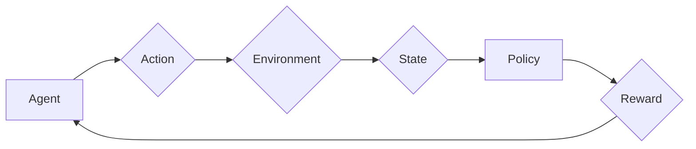

# 增强学习 原理与代码实例讲解

> 关键词：增强学习，Q学习，策略梯度，深度强化学习，蒙特卡洛方法，动态规划，强化学习框架

## 1. 背景介绍

增强学习（Reinforcement Learning, RL）是机器学习的一个分支，它通过智能体与环境的交互来学习如何实现某种目标。与监督学习和无监督学习不同，增强学习中的智能体不是直接学习输入和输出的映射，而是通过探索和试错来学习策略，以实现长期的最大化奖励。

增强学习的核心概念包括智能体（Agent）、环境（Environment）、状态（State）、动作（Action）、奖励（Reward）和策略（Policy）。智能体通过选择动作，从环境中获取状态和奖励，并根据这些信息调整其策略，以实现目标。

### 1.1 问题的由来

增强学习起源于20世纪50年代，最初用于解决自动化导航和控制问题。随着计算机科学和人工智能的发展，增强学习逐渐成为人工智能研究的热点领域，并在游戏、机器人控制、推荐系统等领域取得了显著成果。

### 1.2 研究现状

近年来，深度学习技术的进步极大地推动了增强学习的发展。深度强化学习（Deep Reinforcement Learning, DRL）结合了深度学习模型和增强学习算法，使得增强学习能够解决更加复杂的问题。

### 1.3 研究意义

增强学习在解决复杂决策问题方面具有独特的优势，它可以自动学习复杂的决策策略，无需人工设计特征或模型结构。因此，增强学习在自动化控制、智能机器人、自动驾驶、游戏AI等领域具有重要的应用价值。

### 1.4 本文结构

本文将围绕增强学习展开，首先介绍其核心概念和联系，然后深入探讨增强学习算法的原理和步骤，接着通过数学模型和公式进行详细讲解，并给出代码实例和实际应用场景。最后，本文将总结增强学习的发展趋势与挑战。

## 2. 核心概念与联系

以下是增强学习的核心概念原理和架构的 Mermaid 流程图：



### 2.1 智能体（Agent）

智能体是增强学习中的主体，它可以是机器人、软件程序或其他任何能够与环境交互的实体。智能体的目标是学习一个策略，以最大化其从环境中获得的累积奖励。

### 2.2 环境（Environment）

环境是智能体所处的环境，它可以是真实世界或虚拟环境。环境根据智能体的动作产生新的状态，并返回相应的奖励。

### 2.3 状态（State）

状态是智能体在某一时刻所处的环境描述。状态可以是离散的，也可以是连续的。

### 2.4 动作（Action）

动作是智能体可以执行的操作。动作可以是离散的，也可以是连续的。

### 2.5 奖励（Reward）

奖励是环境对智能体动作的响应。奖励可以是正的，也可以是负的，其目的是引导智能体学习到最佳策略。

### 2.6 策略（Policy）

策略是智能体根据当前状态选择动作的规则。策略可以是确定性的，也可以是概率性的。

## 3. 核心算法原理 & 具体操作步骤

### 3.1 算法原理概述

增强学习算法的核心是学习一个策略，该策略能够使智能体在给定的环境中最大化累积奖励。

### 3.2 算法步骤详解

增强学习算法通常包括以下步骤：

1. 初始化智能体、环境和策略。
2. 智能体根据策略选择动作。
3. 环境根据动作产生新的状态和奖励。
4. 智能体更新策略，以最大化累积奖励。
5. 重复步骤2-4，直到达到终止条件。

### 3.3 算法优缺点

增强学习算法的优点包括：

- 能够自动学习复杂的决策策略，无需人工设计特征或模型结构。
- 能够应用于各种复杂环境，包括动态环境和部分可观察环境。

增强学习算法的缺点包括：

- 学习过程可能需要很长时间，尤其是对于复杂环境。
- 策略的优化可能面临维数灾难问题。

### 3.4 算法应用领域

增强学习算法在以下领域有着广泛的应用：

- 游戏AI
- 自动驾驶
- 机器人控制
- 推荐系统
- 金融服务

## 4. 数学模型和公式 & 详细讲解 & 举例说明

### 4.1 数学模型构建

增强学习的数学模型可以用以下公式表示：

$$
Q(s,a) = \sum_{s',a'} Q(s',a')P(s'|s,a)\max_a' Q(s',a')
$$

其中，$Q(s,a)$ 表示在状态 $s$ 下执行动作 $a$ 的预期回报，$P(s'|s,a)$ 表示在状态 $s$ 下执行动作 $a$ 后转移到状态 $s'$ 的概率，$\max_a' Q(s',a')$ 表示在状态 $s'$ 下选择动作 $a'$ 的最大预期回报。

### 4.2 公式推导过程

增强学习中的核心问题是求解状态-动作值函数 $Q(s,a)$。值函数表示在给定状态和动作下，智能体能够获得的累积奖励。

### 4.3 案例分析与讲解

以下是一个简单的Q学习（Q-Learning）算法的案例：

1. 初始化Q值表 $Q(s,a)$ 和学习率 $\alpha$。
2. 选择初始状态 $s_0$。
3. 选择动作 $a_t$，并执行动作。
4. 接收奖励 $r_t$ 和新状态 $s_{t+1}$。
5. 更新Q值：$Q(s_t,a_t) \leftarrow Q(s_t,a_t) + \alpha [r_t + \gamma \max_{a'} Q(s_{t+1},a') - Q(s_t,a_t)]$
6. 设置 $s_t = s_{t+1}$，重复步骤3-5，直到达到终止条件。

## 5. 项目实践：代码实例和详细解释说明

### 5.1 开发环境搭建

为了进行增强学习项目的实践，你需要安装以下软件和库：

- Python 3.x
- NumPy
- Matplotlib
- Gym

### 5.2 源代码详细实现

以下是一个简单的Q学习算法的实现示例：

```python
import numpy as np

# 初始化参数
epsilon = 0.1
alpha = 0.8
gamma = 0.9
actions = [0, 1, 2]
states = [0, 1, 2, 3]
q_table = np.zeros((len(states), len(actions)))

# 环境模拟
def env(state, action):
    if action == 0:
        new_state = state - 1
    elif action == 1:
        new_state = state
    else:
        new_state = state + 1
    reward = -1
    if new_state < 0 or new_state > 2:
        reward = -100
    return new_state, reward

# Q学习算法
for episode in range(1000):
    state = np.random.randint(0, len(states))
    done = False
    while not done:
        if np.random.random() < epsilon:
            action = np.random.randint(0, len(actions))
        else:
            action = np.argmax(q_table[state])

        new_state, reward = env(state, action)
        q_table[state, action] = q_table[state, action] + alpha * (reward + gamma * np.max(q_table[new_state]) - q_table[state, action])
        state = new_state
        if state == len(states) - 1:
            done = True

# 绘制Q值表
import matplotlib.pyplot as plt

fig, ax = plt.subplots()
cax = ax.matshow(q_table, cmap=plt.cm.Blues)
fig.colorbar(cax)
plt.show()
```

### 5.3 代码解读与分析

上述代码实现了一个简单的Q学习算法。我们定义了一个环境，其中智能体可以选择三个动作：向左移动、保持位置、向右移动。智能体的目标是尽可能长时间地保持在状态2。我们使用一个二维数组 `q_table` 来存储每个状态和动作的Q值。在每次迭代中，智能体根据策略选择动作，并更新Q值。

### 5.4 运行结果展示

运行上述代码后，你可以看到Q值表的变化。随着训练的进行，Q值表中的值会逐渐收敛到一个稳定的值，表示了在给定状态和动作下智能体能够获得的累积奖励。

## 6. 实际应用场景

增强学习在以下实际应用场景中有着广泛的应用：

- 游戏AI：如AlphaGo、DeepMind Chess等。
- 自动驾驶：如Waymo、Tesla等公司的自动驾驶技术。
- 机器人控制：如Boston Dynamics的Spot机器人。
- 推荐系统：如Netflix、Amazon等公司的个性化推荐。
- 金融服务：如高频交易、风险管理等。

## 7. 工具和资源推荐

### 7.1 学习资源推荐

- 《Reinforcement Learning: An Introduction》
- 《Artificial Intelligence: A Modern Approach》
- 《Deep Reinforcement Learning》
- 《Algorithms for Reinforcement Learning》

### 7.2 开发工具推荐

- OpenAI Gym：一个开源的强化学习环境。
- Stable Baselines：一个基于PyTorch和TensorFlow的强化学习库。
- Ray：一个分布式强化学习框架。

### 7.3 相关论文推荐

- "Reinforcement Learning: An Introduction" by Richard S. Sutton and Andrew G. Barto
- "Deep Reinforcement Learning" by David Silver, et al.
- "Algorithms for Reinforcement Learning" by Csaba Szepesvári

## 8. 总结：未来发展趋势与挑战

### 8.1 研究成果总结

增强学习是一个充满活力的研究领域，近年来取得了显著的进展。深度强化学习技术的进步使得增强学习能够解决更加复杂的问题，并在游戏AI、自动驾驶、机器人控制等领域取得了显著成果。

### 8.2 未来发展趋势

未来，增强学习的发展趋势包括：

- 深度强化学习模型的发展，如基于Transformer和图神经网络的模型。
- 多智能体增强学习的发展，如多智能体强化学习和多智能体深度强化学习。
- 增强学习与其他人工智能技术的融合，如强化学习与优化、强化学习与知识表示等。

### 8.3 面临的挑战

增强学习在以下方面面临着挑战：

- 学习效率：如何提高增强学习算法的学习效率，使其能够在有限的时间内学习到有效的策略。
- 可解释性：如何提高增强学习算法的可解释性，使其决策过程更加透明。
- 安全性：如何确保增强学习算法的决策过程是安全的，避免不良后果。

### 8.4 研究展望

未来，增强学习的研究将致力于解决上述挑战，并推动其在更多领域中的应用。

## 9. 附录：常见问题与解答

**Q1：增强学习与其他机器学习方法的区别是什么？**

A: 与监督学习和无监督学习不同，增强学习中的智能体通过与环境交互来学习。在监督学习中，智能体直接从输入和输出数据中学习映射关系；在无监督学习中，智能体从未标记的数据中学习特征或模式。

**Q2：增强学习在哪些领域有着广泛的应用？**

A: 增强学习在游戏AI、自动驾驶、机器人控制、推荐系统、金融服务等领域有着广泛的应用。

**Q3：如何提高增强学习算法的学习效率？**

A: 提高增强学习算法的学习效率可以通过以下方法实现：

- 使用更有效的算法，如深度Q网络（DQN）、策略梯度方法等。
- 使用强化学习算法的变体，如异步策略梯度（ASGD）、分布式强化学习等。
- 使用更有效的数据结构，如深度神经网络、图神经网络等。

**Q4：如何提高增强学习算法的可解释性？**

A: 提高增强学习算法的可解释性可以通过以下方法实现：

- 使用可解释的强化学习算法，如基于规则的强化学习、基于模拟的强化学习等。
- 分析算法的内部机制，如神经网络的结构、参数等。
- 使用可视化工具，如t-SNE、t-Distributed Stochastic Neighbor Embedding（t-SNE）等。

**Q5：增强学习在哪些方面面临着挑战？**

A: 增强学习在以下方面面临着挑战：

- 学习效率：如何提高增强学习算法的学习效率，使其能够在有限的时间内学习到有效的策略。
- 可解释性：如何提高增强学习算法的可解释性，使其决策过程更加透明。
- 安全性：如何确保增强学习算法的决策过程是安全的，避免不良后果。

---

作者：禅与计算机程序设计艺术 / Zen and the Art of Computer Programming