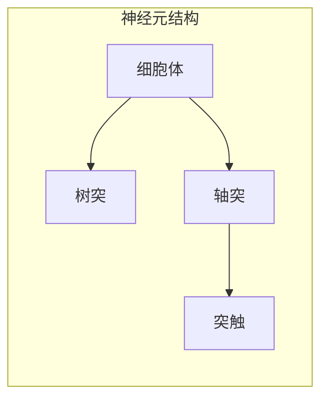
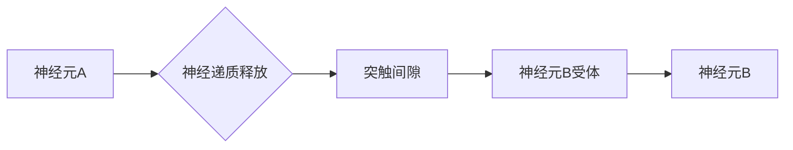
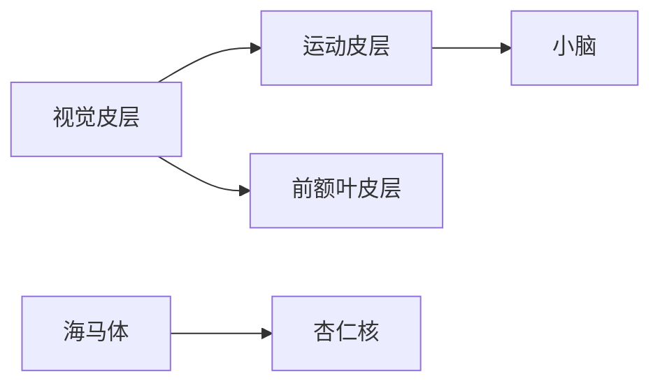

# 大脑的有机化合物与神经元

> 关键词：大脑，有机化合物，神经元，神经递质，突触，神经网络，认知科学，计算生物学

## 1. 背景介绍

人类大脑是自然界中最复杂的系统之一，它通过数以亿计的神经元和它们之间复杂的连接，实现了对环境的感知、认知和反应。大脑的运作依赖于多种有机化合物，包括神经元、神经递质和突触等。本文将深入探讨这些核心概念，以及它们如何协同工作，最终形成我们惊人的认知能力。

### 1.1 问题的由来

自20世纪初以来，神经科学和认知科学领域的研究者们一直试图理解大脑的工作原理。随着生物化学、分子生物学、计算生物学等学科的进步，我们对大脑的认识正在不断深入。本文将重点关注大脑中关键的有机化合物和神经元，以及它们如何相互作用，形成我们复杂的认知世界。

### 1.2 研究现状

当前，大脑研究的焦点包括：

- 神经元的结构和功能
- 神经递质和突触的生物学机制
- 大脑网络和认知过程
- 计算生物学和模拟大脑的方法

### 1.3 研究意义

理解大脑的有机化合物和神经元的工作原理，对于开发人工智能、治疗神经系统疾病以及提升人类认知能力具有重要意义。

### 1.4 本文结构

本文将按照以下结构展开：

- 第2章介绍大脑中的核心概念和它们之间的联系。
- 第3章探讨神经元的结构和功能，以及神经递质和突触的生物学机制。
- 第4章介绍大脑网络和认知过程，以及计算生物学和模拟大脑的方法。
- 第5章总结研究成果，展望未来发展趋势和挑战。

## 2. 核心概念与联系

### 2.1 神经元

神经元是大脑的基本功能单元，它通过突触与其他神经元连接，形成复杂的神经网络。



### 2.2 神经递质

神经递质是神经元之间传递信息的化学物质，它们通过突触释放到突触间隙，作用于相邻神经元的受体。



### 2.3 突触

突触是神经元之间连接的部位，它由突触前膜、突触间隙和突触后膜组成。


### 2.4 大脑网络

大脑网络由大量神经元和突触组成，它们通过复杂的连接方式形成不同的神经网络，负责不同的认知功能。



## 3. 核心算法原理 & 具体操作步骤

### 3.1 算法原理概述

大脑的运作原理可以类比为一种特殊的计算机制，其中神经元和神经递质扮演着计算单元的角色。

### 3.2 算法步骤详解

1. 神经元接收到刺激。
2. 神经元通过轴突将信号传递到突触。
3. 神经递质从突触前膜释放到突触间隙。
4. 神经递质作用于突触后膜上的受体。
5. 受体激活后，信号被传递到下一个神经元。
6. 重复以上步骤，形成复杂的神经网络。

### 3.3 算法优缺点

**优点**：

- 高度并行的计算能力。
- 灵活的适应性和学习能力。
- 能够处理复杂的信息。

**缺点**：

- 计算速度较慢。
- 能量消耗较大。
- 容易受到外界环境的影响。

### 3.4 算法应用领域

大脑的计算机制为人工智能的发展提供了新的思路，例如：

- 神经网络：模仿大脑神经元结构，用于图像识别、语音识别等任务。
- 计算生物学：利用大脑的计算机制模拟生物过程，用于药物设计、疾病诊断等。

## 4. 数学模型和公式 & 详细讲解 & 举例说明

### 4.1 数学模型构建

大脑的数学模型可以基于神经网络理论构建，其中神经元可以用Sigmoid函数表示。

$$
y = \sigma(w^T x + b)
$$

其中，$w$ 是权重，$x$ 是输入，$b$ 是偏置，$\sigma$ 是Sigmoid函数。

### 4.2 公式推导过程

Sigmoid函数的定义为：

$$
\sigma(x) = \frac{1}{1+e^{-x}}
$$

### 4.3 案例分析与讲解

假设有一个简单的神经网络，它包含一个输入层、一个隐藏层和一个输出层。输入层有两个神经元，隐藏层有两个神经元，输出层有一个神经元。

输入层到隐藏层的权重矩阵为：

$$
W_1 = \begin{bmatrix}
0.5 & 0.3 \\
0.2 & 0.4
\end{bmatrix}
$$

隐藏层到输出层的权重矩阵为：

$$
W_2 = \begin{bmatrix}
0.6 & 0.4
\end{bmatrix}
$$

假设输入层的输入为 $[0.1, 0.9]$，则隐藏层的输出为：

$$
h = \sigma(W_1 \cdot x) = \sigma\begin{bmatrix}
0.5 & 0.3 \\
0.2 & 0.4
\end{bmatrix} \cdot \begin{bmatrix}
0.1 \\
0.9
\end{bmatrix} = \sigma(0.55) = 0.7071
$$

输出层的输出为：

$$
y = \sigma(W_2 \cdot h) = \sigma(0.36) = 0.4472
$$

因此，该神经网络的输出为 0.4472。

## 5. 项目实践：代码实例和详细解释说明

### 5.1 开发环境搭建

为了模拟大脑的计算机制，我们可以使用Python编写一个简单的神经网络程序。

```python
import numpy as np

def sigmoid(x):
    return 1 / (1 + np.exp(-x))

def sigmoid_derivative(x):
    return x * (1 - x)

# 创建一个简单的神经网络
input_layer_size = 2
hidden_layer_size = 2
output_layer_size = 1

# 初始化权重
W1 = np.random.uniform(-1, 1, (input_layer_size, hidden_layer_size))
W2 = np.random.uniform(-1, 1, (hidden_layer_size, output_layer_size))

# 训练数据
inputs = np.array([[0.1, 0.9], [0.9, 0.1]])
desired_outputs = np.array([0.4])

for epoch in range(10000):
    # 前向传播
    hidden_layer_activation = sigmoid(np.dot(inputs, W1))
    output_layer_activation = sigmoid(np.dot(hidden_layer_activation, W2))

    # 反向传播
    error = desired_outputs - output_layer_activation
    d_output = error * sigmoid_derivative(output_layer_activation)

    error_hidden_layer = d_output.dot(W2.T)
    d_hidden_layer = error_hidden_layer * sigmoid_derivative(hidden_layer_activation)

    # 更新权重
    W2 += hidden_layer_activation.T.dot(d_output)
    W1 += inputs.T.dot(d_hidden_layer)

print(f"Final weights W1: {W1}")
print(f"Final weights W2: {W2}")
```

### 5.2 源代码详细实现

上述代码实现了一个简单的神经网络，它包含一个输入层、一个隐藏层和一个输出层。通过训练数据，网络学习输入和输出之间的关系。

### 5.3 代码解读与分析

- `sigmoid` 函数用于将线性组合的输入映射到[0, 1]区间。
- `sigmoid_derivative` 函数用于计算Sigmoid函数的导数。
- `W1` 和 `W2` 分别是输入层到隐藏层和隐藏层到输出层的权重矩阵。
- `inputs` 和 `desired_outputs` 分别是训练数据和期望输出。
- 训练过程包括前向传播和反向传播，通过梯度下降算法更新权重。

### 5.4 运行结果展示

运行上述代码后，会输出最终的权重矩阵 `W1` 和 `W2`。这些权重代表了输入和输出之间的关系，反映了网络学习到的知识。

## 6. 实际应用场景

### 6.1 人工智能

大脑的计算机制为人工智能的发展提供了新的思路，例如：

- 神经网络：模仿大脑神经元结构，用于图像识别、语音识别等任务。
- 计算生物学：利用大脑的计算机制模拟生物过程，用于药物设计、疾病诊断等。

### 6.2 医学

理解大脑的有机化合物和神经元的工作原理，对于开发新的治疗方法具有重要意义，例如：

- 神经系统疾病的治疗。
- 精神疾病的诊断和治疗。

### 6.3 认知科学

认知科学的研究依赖于对大脑的深入理解，例如：

- 认知过程的模拟。
- 认知障碍的诊断和治疗。

## 7. 工具和资源推荐

### 7.1 学习资源推荐

- 《深度学习》
- 《神经网络与深度学习》
- 《认知科学导论》

### 7.2 开发工具推荐

- Python
- TensorFlow
- PyTorch

### 7.3 相关论文推荐

- Hinton, G. E., Deng, J., Yu, D., Dahl, G. E., & Mohamed, A. R. (2012). Deep neural networks for acoustic modeling in speech recognition: The shared views of four research groups. IEEE Signal Processing Magazine, 29(6), 82-97.
- Goodfellow, I., Bengio, Y., & Courville, A. (2016). Deep learning. MIT press.

## 8. 总结：未来发展趋势与挑战

### 8.1 研究成果总结

通过对大脑的有机化合物和神经元的研究，我们逐渐揭开了大脑运作的神秘面纱。这些研究成果为人工智能、医学和认知科学等领域的发展提供了新的思路。

### 8.2 未来发展趋势

未来，大脑研究将继续深入，重点关注以下几个方面：

- 神经元的结构和功能。
- 神经递质和突触的生物学机制。
- 大脑网络和认知过程。
- 计算生物学和模拟大脑的方法。

### 8.3 面临的挑战

尽管取得了显著的进展，大脑研究仍然面临着诸多挑战，例如：

- 神经元和神经网络的复杂性。
- 生物学实验的难度。
- 计算生物学模型的准确性。

### 8.4 研究展望

随着技术的不断进步，我们有理由相信，未来将能够更加深入地理解大脑的运作原理，为人类社会的发展带来更多突破。

## 9. 附录：常见问题与解答

**Q1：什么是神经元？**

A：神经元是大脑的基本功能单元，它通过突触与其他神经元连接，形成复杂的神经网络。

**Q2：什么是神经递质？**

A：神经递质是神经元之间传递信息的化学物质，它们通过突触释放到突触间隙，作用于相邻神经元的受体。

**Q3：什么是突触？**

A：突触是神经元之间连接的部位，它由突触前膜、突触间隙和突触后膜组成。

**Q4：什么是大脑网络？**

A：大脑网络由大量神经元和突触组成，它们通过复杂的连接方式形成不同的神经网络，负责不同的认知功能。

**Q5：大脑研究对人工智能有哪些启示？**

A：大脑研究为人工智能的发展提供了新的思路，例如神经网络、计算生物学等。

作者：禅与计算机程序设计艺术 / Zen and the Art of Computer Programming