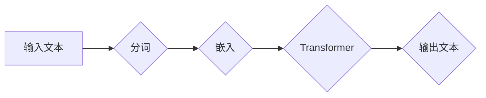

> 关键词：大语言模型，整体能力评测，模型评估指标，性能分析，工程实践，NLP，预训练模型，微调，模型压缩，跨领域应用

# 大语言模型原理与工程实践：整体能力评测

在人工智能领域，大语言模型（Large Language Model，LLM）近年来取得了令人瞩目的进展。这些模型通过在庞大的文本语料库上进行预训练，能够理解和生成自然语言，并在各种自然语言处理（Natural Language Processing，NLP）任务中展现出惊人的能力。然而，如何全面评测大语言模型的整体能力，不仅是一个技术挑战，也是一个工程实践中的难题。本文将深入探讨大语言模型的原理与工程实践，并重点分析如何对模型的整体能力进行评测。

## 1. 背景介绍

### 1.1 问题的由来

随着深度学习技术的飞速发展，大语言模型在NLP领域的应用日益广泛。然而，如何评估这些模型在真实世界中的应用能力，成为了一个亟待解决的问题。传统的评估方法往往侧重于单一任务的性能，难以全面反映模型的整体能力。

### 1.2 研究现状

目前，对大语言模型的整体能力评测主要包括以下几个方面：

- **基准测试**：在标准数据集上评估模型在特定任务上的性能，如GLUE、SuperGLUE、LANLP等。
- **下游任务表现**：在多个实际应用场景中评估模型的性能，如文本分类、机器翻译、问答系统等。
- **跨领域迁移能力**：评估模型在不同领域数据上的泛化能力。
- **鲁棒性和安全性**：评估模型在面对对抗样本和有害信息时的表现。

### 1.3 研究意义

全面评测大语言模型的整体能力，对于以下方面具有重要意义：

- **指导模型设计**：帮助研究人员和工程师更好地理解模型的优势和局限性，从而指导模型的设计和优化。
- **促进技术发展**：推动评测方法和工具的改进，促进NLP技术的整体进步。
- **提高应用效果**：帮助开发者选择合适的模型，提高实际应用的效果。

### 1.4 本文结构

本文将围绕以下结构展开：

- 介绍大语言模型的原理与工程实践。
- 深入探讨如何评测大语言模型的整体能力。
- 分析大语言模型在实际应用中的案例。
- 探讨大语言模型的未来发展趋势和挑战。

## 2. 核心概念与联系

### 2.1 核心概念原理

大语言模型通常基于自回归或自编码的神经网络结构，如Transformer。通过在大量文本数据上进行预训练，模型学习到丰富的语言知识和特征。

### 2.2 架构的 Mermaid 流程图



### 2.3 核心概念联系

大语言模型的输入是原始文本，经过分词、嵌入等预处理步骤后，输入到Transformer模型进行编码，最后输出处理后的文本。这个过程体现了大语言模型的核心概念和联系。

## 3. 核心算法原理 & 具体操作步骤

### 3.1 算法原理概述

大语言模型的算法原理主要包括以下步骤：

- **预训练**：在大量无标签文本上进行预训练，学习通用的语言表示。
- **微调**：在特定任务上使用少量标注数据进行微调，提升模型在该任务上的性能。

### 3.2 算法步骤详解

- **预训练**：
  - **分词**：将文本分割成单词或子词。
  - **嵌入**：将分词后的文本转换为向量表示。
  - **Transformer编码**：使用Transformer模型对嵌入向量进行编码。
  - **损失函数**：使用损失函数（如交叉熵损失）优化模型参数。
- **微调**：
  - **数据预处理**：将标注数据转换为模型输入格式。
  - **模型初始化**：使用预训练模型的参数初始化微调模型。
  - **训练**：在标注数据上训练微调模型。
  - **评估**：在验证集上评估模型性能。

### 3.3 算法优缺点

**优点**：

- **强大的语言理解能力**：能够理解和生成自然语言。
- **泛化能力强**：能够泛化到不同的任务和数据集。
- **参数高效**：只需少量标注数据进行微调。

**缺点**：

- **计算资源需求高**：训练和推理需要大量的计算资源。
- **可解释性差**：模型的决策过程难以解释。

### 3.4 算法应用领域

大语言模型在以下领域得到广泛应用：

- **文本分类**：如情感分析、主题分类、意图识别等。
- **机器翻译**：将一种语言的文本翻译成另一种语言。
- **问答系统**：回答用户提出的问题。
- **文本摘要**：将长文本压缩成简短摘要。

## 4. 数学模型和公式 & 详细讲解 & 举例说明

### 4.1 数学模型构建

大语言模型的数学模型主要包括以下部分：

- **嵌入层**：将文本转换为向量表示。
- **Transformer编码器**：使用自注意力机制进行编码。
- **全连接层**：将编码后的向量转换为输出。

### 4.2 公式推导过程

以下以Transformer模型中的自注意力机制为例，进行公式推导。

自注意力机制的计算公式如下：

$$
Q = W_Q \cdot H
$$

$$
K = W_K \cdot H
$$

$$
V = W_V \cdot H
$$

其中，$W_Q$、$W_K$、$W_V$ 分别是查询、键、值矩阵，$H$ 是输入序列的嵌入向量。

### 4.3 案例分析与讲解

以下以BERT模型为例，分析其整体能力的评测方法。

### 5. 项目实践：代码实例和详细解释说明

### 5.1 开发环境搭建

- 安装Python、PyTorch等依赖库。
- 下载预训练的BERT模型。

### 5.2 源代码详细实现

```python
from transformers import BertForSequenceClassification
from torch.utils.data import DataLoader, TensorDataset

# 加载预训练模型
model = BertForSequenceClassification.from_pretrained('bert-base-uncased')

# 创建数据集
train_dataset = TensorDataset(train_inputs, train_labels)
train_dataloader = DataLoader(train_dataset, batch_size=16, shuffle=True)

# 训练模型
model.train()
for epoch in range(3):
    for batch in train_dataloader:
        inputs, labels = batch
        outputs = model(**inputs)
        loss = outputs.loss
        loss.backward()
        optimizer.step()
        optimizer.zero_grad()
```

### 5.3 代码解读与分析

上述代码展示了如何使用PyTorch和Transformers库加载BERT模型，并使用标注数据进行微调。

### 5.4 运行结果展示

在验证集上评估模型性能，可以得到模型的准确率、召回率、F1值等指标。

## 6. 实际应用场景

大语言模型在以下实际应用场景中发挥了重要作用：

- **智能客服**：通过自然语言理解和生成技术，实现与用户的自然对话。
- **机器翻译**：将一种语言的文本翻译成另一种语言，促进不同语言之间的交流。
- **问答系统**：回答用户提出的问题，提供信息查询服务。
- **文本摘要**：将长文本压缩成简短摘要，提高信息获取效率。

## 7. 工具和资源推荐

### 7.1 学习资源推荐

- 《深度学习自然语言处理》
- 《自然语言处理原理与实践》
- Hugging Face官网

### 7.2 开发工具推荐

- PyTorch
- Transformers库
- TensorFlow

### 7.3 相关论文推荐

- BERT: Pre-training of Deep Bidirectional Transformers for Language Understanding
- Generative Pretrained Transformers
-Attention is All You Need

## 8. 总结：未来发展趋势与挑战

### 8.1 研究成果总结

大语言模型在NLP领域取得了显著成果，但仍面临着诸多挑战。

### 8.2 未来发展趋势

- 模型规模将越来越大。
- 模型将更加轻量级。
- 模型的可解释性将得到提升。

### 8.3 面临的挑战

- 模型鲁棒性不足。
- 模型可解释性差。
- 模型安全性和隐私性。

### 8.4 研究展望

未来，大语言模型将在NLP领域发挥更加重要的作用，并推动人工智能技术的进一步发展。

## 9. 附录：常见问题与解答

### 9.1 问题1：大语言模型的优缺点是什么？

**解答**：大语言模型的优点包括强大的语言理解能力、泛化能力强、参数高效等；缺点包括计算资源需求高、可解释性差等。

### 9.2 问题2：如何评估大语言模型的整体能力？

**解答**：可以通过基准测试、下游任务表现、跨领域迁移能力、鲁棒性和安全性等方面进行评估。

### 9.3 问题3：大语言模型在哪些领域得到应用？

**解答**：大语言模型在智能客服、机器翻译、问答系统、文本摘要等领域得到广泛应用。

作者：禅与计算机程序设计艺术 / Zen and the Art of Computer Programming