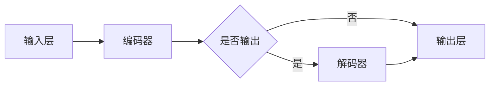

# 大语言模型原理与工程实践：预训练语言模型

> 关键词：预训练语言模型，BERT，GPT，Transformer，NLP，迁移学习，自然语言理解，语言生成

## 1. 背景介绍

随着人工智能技术的飞速发展，自然语言处理（Natural Language Processing，NLP）领域取得了显著的进展。特别是近年来，预训练语言模型（Pre-trained Language Model，PLM）的兴起，为NLP任务带来了革命性的变化。预训练语言模型通过对海量文本进行预训练，学习到丰富的语言知识，能够有效地解决各种NLP任务，如文本分类、命名实体识别、机器翻译等。

## 2. 核心概念与联系

### 2.1 预训练语言模型的概念

预训练语言模型是指在大规模文本语料库上预先训练的语言模型，它能够学习到语言的基本规则、语法结构、语义关系等知识。预训练语言模型的核心思想是“通用语言表示”，即通过预训练学习到一种能够表示所有语言知识的通用语言表征。

### 2.2 预训练语言模型的架构

预训练语言模型的架构通常包含以下几个部分：

- **输入层**：接收文本数据，进行预处理。
- **编码器**：将输入文本转换为向量表示。
- **解码器**：根据编码器的输出，生成文本或其他形式的内容。

以下是预训练语言模型的Mermaid流程图：



### 2.3 预训练语言模型与相关概念的联系

- **迁移学习**：预训练语言模型是迁移学习的一种典型应用，它将预训练的知识迁移到下游任务中。
- **自然语言理解**：预训练语言模型能够理解和处理自然语言，是自然语言理解的基础。
- **语言生成**：预训练语言模型能够根据输入生成文本或其他形式的内容，是语言生成的基础。

## 3. 核心算法原理 & 具体操作步骤

### 3.1 算法原理概述

预训练语言模型的算法原理主要基于深度学习，具体包括以下步骤：

1. **预训练**：在大规模文本语料库上，通过自监督学习或无监督学习等方法，学习语言的基本规则、语法结构、语义关系等知识。
2. **微调**：在下游任务上，通过有监督学习等方法，对预训练模型进行微调，使其能够更好地适应特定任务。
3. **推理**：将预训练模型应用到实际任务中，进行预测或生成。

### 3.2 算法步骤详解

1. **预训练**：
    - **自监督学习**：例如，BERT模型使用掩码语言模型（Masked Language Model，MLM）进行预训练，随机掩码输入文本中的部分单词，并预测这些掩码单词的正确单词。
    - **无监督学习**：例如，GPT模型使用语言模型（Language Model，LM）进行预训练，预测下一个单词。
2. **微调**：在下游任务上，通过以下步骤对预训练模型进行微调：
    - **数据准备**：收集和标注数据，构建训练集、验证集和测试集。
    - **模型调整**：调整预训练模型的参数，以适应特定任务。
    - **训练**：使用训练集对模型进行训练。
    - **验证和测试**：使用验证集和测试集评估模型性能。
3. **推理**：将微调后的模型应用到实际任务中，进行预测或生成。

### 3.3 算法优缺点

**优点**：

- **通用性强**：预训练语言模型能够学习到丰富的语言知识，适用于各种NLP任务。
- **迁移能力强**：预训练语言模型能够将预训练的知识迁移到下游任务中，提高模型性能。
- **泛化能力强**：预训练语言模型能够处理未见过的文本数据，提高模型泛化能力。

**缺点**：

- **计算资源消耗大**：预训练语言模型需要大量的计算资源。
- **训练时间长**：预训练语言模型的训练时间较长。
- **模型复杂度高**：预训练语言模型的模型复杂度高，难以解释。

### 3.4 算法应用领域

预训练语言模型在以下NLP任务中得到了广泛应用：

- **文本分类**：例如，情感分析、主题分类、分类任务等。
- **命名实体识别**：例如，人名识别、地名识别、组织机构识别等。
- **机器翻译**：例如，英译中、中译英等。
- **问答系统**：例如，基于事实的问答、基于知识的问答等。
- **文本摘要**：例如，提取摘要、生成摘要等。

## 4. 数学模型和公式 & 详细讲解 & 举例说明

### 4.1 数学模型构建

预训练语言模型的数学模型主要基于深度学习，具体包括以下部分：

- **编码器**：通常采用Transformer模型，将输入文本转换为向量表示。
- **解码器**：通常采用Transformer模型，根据编码器的输出，生成文本或其他形式的内容。

以下是预训练语言模型的数学模型：

```latex
\begin{align*}
\text{编码器}:
E(x) &= \text{Transformer}(x) \\
\text{解码器}:
D(y) &= \text{Transformer}(E(x), y)
\end{align*}
```

其中，$x$ 表示输入文本，$y$ 表示目标文本，$E$ 和 $D$ 分别表示编码器和解码器。

### 4.2 公式推导过程

预训练语言模型的公式推导过程主要基于深度学习的公式推导方法，具体包括以下步骤：

1. **编码器**：
    - **输入层**：将输入文本转换为词向量表示。
    - **Transformer层**：将词向量表示转换为向量表示。
2. **解码器**：
    - **输入层**：将解码器的输入转换为词向量表示。
    - **Transformer层**：将词向量表示转换为向量表示。

### 4.3 案例分析与讲解

以BERT模型为例，讲解预训练语言模型的数学模型和公式推导过程。

BERT模型使用Transformer模型作为编码器和解码器，其数学模型如下：

```latex
\begin{align*}
\text{编码器}:
E(x) &= \text{Transformer}(x) \\
\text{解码器}:
D(y) &= \text{Transformer}(E(x), y)
\end{align*}
```

其中，$x$ 表示输入文本，$y$ 表示目标文本，$E$ 和 $D$ 分别表示编码器和解码器。

BERT模型的Transformer层由多个自注意力层（Self-Attention）和前馈神经网络（Feedforward Neural Network）组成，其数学模型如下：

```latex
\begin{align*}
\text{自注意力层}:
\text{Attention}(Q, K, V) &= \text{Softmax}(\frac{QK^T}{\sqrt{d_k}})V \\
\text{前馈神经网络}:
F(x) &= \text{ReLU}(W_f \cdot (x \cdot W_k) + b_f)
\end{align*}
```

其中，$Q$、$K$、$V$ 分别表示查询向量、键向量、值向量，$d_k$ 表示键向量的维度，$W_f$、$b_f$ 分别表示前馈神经网络的权重和偏置。

## 5. 项目实践：代码实例和详细解释说明

### 5.1 开发环境搭建

为了实践预训练语言模型，需要搭建以下开发环境：

- 操作系统：Windows/Linux/MacOS
- 编程语言：Python
- 深度学习框架：TensorFlow/PyTorch
- 预训练语言模型库：Hugging Face Transformers

### 5.2 源代码详细实现

以下是一个简单的BERT模型微调示例，使用Hugging Face Transformers库进行实现。

```python
from transformers import BertTokenizer, BertForSequenceClassification, Trainer, TrainingArguments

# 加载预训练语言模型和分词器
tokenizer = BertTokenizer.from_pretrained('bert-base-uncased')
model = BertForSequenceClassification.from_pretrained('bert-base-uncased')

# 准备数据集
train_encodings = tokenizer(train_texts, truncation=True, padding=True)
val_encodings = tokenizer(val_texts, truncation=True, padding=True)

# 定义训练参数
training_args = TrainingArguments(
    output_dir='./results',
    num_train_epochs=3,
    per_device_train_batch_size=16,
    per_device_eval_batch_size=64,
    warmup_steps=500,
    weight_decay=0.01,
    logging_dir='./logs',
    logging_steps=10,
)

# 训练模型
trainer = Trainer(
    model=model,
    args=training_args,
    train_dataset=train_encodings,
    eval_dataset=val_encodings
)

trainer.train()
```

### 5.3 代码解读与分析

以上代码展示了使用Hugging Face Transformers库对BERT模型进行微调的完整流程。

- 首先，加载预训练语言模型和分词器。
- 然后，准备数据集，将文本数据转换为模型所需的格式。
- 接着，定义训练参数，如输出目录、训练轮数、批大小等。
- 最后，使用Trainer类训练模型。

### 5.4 运行结果展示

在完成以上步骤后，可以使用以下代码评估模型性能：

```python
# 评估模型
trainer.evaluate()
```

评估结果将展示模型在验证集上的准确率、精确率、召回率和F1分数等指标。

## 6. 实际应用场景

预训练语言模型在以下实际应用场景中得到了广泛应用：

- **智能客服**：通过预训练语言模型，实现智能客服机器人，能够自动回答用户的问题。
- **机器翻译**：通过预训练语言模型，实现高精度的机器翻译系统。
- **文本摘要**：通过预训练语言模型，实现自动文本摘要功能。
- **问答系统**：通过预训练语言模型，实现基于知识的问答系统。

## 7. 工具和资源推荐

### 7.1 学习资源推荐

- 《Natural Language Processing with Transformers》
- 《Deep Learning for Natural Language Processing》
- 《Understanding Transformers》

### 7.2 开发工具推荐

- Hugging Face Transformers
- TensorFlow
- PyTorch

### 7.3 相关论文推荐

- `Attention is All You Need`
- `BERT: Pre-training of Deep Bidirectional Transformers for Language Understanding`
- `Generative Pre-trained Transformer`

## 8. 总结：未来发展趋势与挑战

### 8.1 研究成果总结

预训练语言模型在NLP领域取得了显著的成果，为各种NLP任务提供了强大的支持。

### 8.2 未来发展趋势

- **模型规模增大**：随着计算资源的增加，预训练语言模型的规模将不断增大，学习到更丰富的语言知识。
- **多模态融合**：预训练语言模型将与图像、视频、音频等多模态信息进行融合，实现跨模态理解。
- **低资源学习**：针对低资源语言，研究低资源学习技术，提高预训练语言模型在低资源语言上的性能。

### 8.3 面临的挑战

- **计算资源消耗**：预训练语言模型需要大量的计算资源，限制了其应用范围。
- **数据隐私**：预训练语言模型使用的数据可能涉及隐私问题，需要采取有效的隐私保护措施。
- **模型可解释性**：预训练语言模型的决策过程难以解释，需要提高模型的可解释性。

### 8.4 研究展望

预训练语言模型将在NLP领域发挥越来越重要的作用，推动NLP技术的进一步发展。

## 9. 附录：常见问题与解答

**Q1：什么是预训练语言模型？**

A：预训练语言模型是指在大量文本语料库上预先训练的语言模型，它能够学习到丰富的语言知识，适用于各种NLP任务。

**Q2：预训练语言模型有哪些类型？**

A：常见的预训练语言模型包括BERT、GPT、RoBERTa等。

**Q3：预训练语言模型如何工作？**

A：预训练语言模型通过对海量文本进行预训练，学习到丰富的语言知识，能够有效地解决各种NLP任务。

**Q4：预训练语言模型有哪些应用？**

A：预训练语言模型在文本分类、命名实体识别、机器翻译、问答系统、文本摘要等多种NLP任务中得到广泛应用。

**Q5：如何使用预训练语言模型？**

A：可以使用Hugging Face Transformers等工具库，快速加载预训练语言模型并进行微调。

---

作者：禅与计算机程序设计艺术 / Zen and the Art of Computer Programming