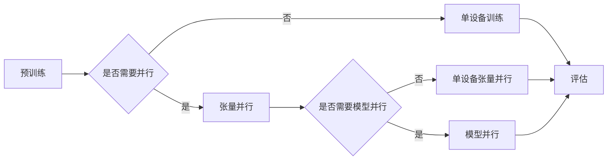

# 大语言模型原理基础与前沿 张量/模型并行

> 关键词：大语言模型，张量并行，模型并行，分布式训练，TensorFlow，PyTorch，深度学习，高效训练

## 1. 背景介绍

随着深度学习技术的飞速发展，大语言模型（Large Language Models, LLMs）如BERT、GPT等在自然语言处理（Natural Language Processing, NLP）领域取得了突破性的成果。这些模型通过在海量文本数据上进行预训练，学习到了丰富的语言知识，并在各种下游任务中表现出色。然而，随着模型规模的不断扩大，单个GPU或TPU的算力已无法满足训练需求，因此，张量并行（Tensor Parallelism）和模型并行（Model Parallelism）技术应运而生。

本文将深入探讨大语言模型原理基础，重点介绍张量并行和模型并行的概念、原理、应用，并给出相应的代码实例和解释说明。

## 2. 核心概念与联系

### 2.1 大语言模型

大语言模型是一种基于深度学习的自然语言处理模型，通过在大量文本数据上进行预训练，学习到丰富的语言知识和语言规律。大语言模型通常采用自回归（如GPT）或自编码（如BERT）的结构，并使用数以亿计的参数进行训练。

### 2.2 张量并行

张量并行是一种将模型中的张量（Tensor）分布到多个计算设备（如GPU）上的并行计算技术。通过将计算量较大的张量分解为多个子张量，并在多个计算设备上同时计算，可以有效提高计算效率。

### 2.3 模型并行

模型并行是一种将模型的不同部分分布到多个计算设备上的并行计算技术。根据模型的结构，可以将模型分为不同层次的子模型，并将这些子模型分布到多个计算设备上进行并行计算。

### 2.4 Mermaid 流程图

以下是大语言模型原理与张量/模型并行的Mermaid流程图：



## 3. 核心算法原理 & 具体操作步骤

### 3.1 算法原理概述

张量并行和模型并行是提高大语言模型训练效率的重要技术。以下是两种并行技术的原理概述：

#### 3.1.1 张量并行

张量并行通过将计算量较大的张量分解为多个子张量，并在多个计算设备上同时计算，从而实现并行计算。这种并行方式主要适用于计算量大的操作，如矩阵乘法。

#### 3.1.2 模型并行

模型并行将模型的不同部分分布到多个计算设备上进行并行计算。根据模型的结构，可以将模型分为不同层次的子模型，并将这些子模型分布到多个计算设备上进行并行计算。

### 3.2 算法步骤详解

#### 3.2.1 张量并行

1. 确定并行维度：选择要并行化的张量及其对应的计算操作。
2. 分割张量：将张量分解为多个子张量，每个子张量将被分配到不同的计算设备。
3. 数据传输：将子张量传输到对应的计算设备。
4. 并行计算：在计算设备上并行计算子张量。
5. 数据汇总：将计算结果汇总并输出。

#### 3.2.2 模型并行

1. 确定并行层次：根据模型结构，将模型分为不同层次的子模型。
2. 分配计算设备：将子模型分配到不同的计算设备。
3. 数据传输：将子模型输入数据传输到对应的计算设备。
4. 并行计算：在计算设备上并行计算子模型。
5. 数据汇总：将计算结果汇总并输出。

### 3.3 算法优缺点

#### 3.3.1 张量并行

优点：
- 提高计算效率，减少计算时间。
- 降低单个设备的负载，延长设备寿命。

缺点：
- 增加数据传输开销，影响模型性能。
- 需要考虑数据分割和传输策略，增加开发难度。

#### 3.3.2 模型并行

优点：
- 提高模型并行度，进一步降低计算时间。
- 可以根据不同计算设备的性能分配计算任务。

缺点：
- 需要考虑模型结构和计算设备，增加开发难度。
- 可能导致部分计算设备的负载不均衡。

### 3.4 算法应用领域

张量并行和模型并行技术在深度学习领域应用广泛，以下是一些典型应用场景：

- 大语言模型训练。
- 计算机视觉模型训练。
- 强化学习训练。
- 语音识别模型训练。

## 4. 数学模型和公式 & 详细讲解 & 举例说明

### 4.1 数学模型构建

以下是大语言模型训练过程中涉及的一些数学模型和公式：

#### 4.1.1 损失函数

损失函数用于衡量模型预测值与真实值之间的差距。常见的损失函数有：

- 交叉熵损失函数：$$ L = -\sum_{i=1}^{N}[y_i\log \hat{y}_i + (1-y_i)\log (1-\hat{y}_i)] $$
- 均方误差损失函数：$$ L = \frac{1}{N}\sum_{i=1}^{N}(y_i - \hat{y}_i)^2 $$

#### 4.1.2 梯度下降法

梯度下降法是一种用于求解优化问题的算法。其基本思想是沿着损失函数梯度的反方向更新模型参数，从而最小化损失函数。

梯度下降法的公式为：$$ \theta_{new} = \theta_{old} - \eta \nabla_{\theta}L $$

其中，$\theta_{new}$ 表示更新后的参数，$\theta_{old}$ 表示更新前的参数，$\eta$ 表示学习率，$\nabla_{\theta}L$ 表示损失函数对参数 $\theta$ 的梯度。

### 4.2 公式推导过程

以下以交叉熵损失函数为例，介绍其推导过程：

假设模型预测输出为 $\hat{y}$，真实标签为 $y$，则交叉熵损失函数为：

$$ L = -\sum_{i=1}^{N}[y_i\log \hat{y}_i + (1-y_i)\log (1-\hat{y}_i)] $$

对 $L$ 求偏导数，得到损失函数对预测输出 $\hat{y}_i$ 的梯度：

$$ \frac{\partial L}{\partial \hat{y}_i} = -\frac{y_i}{\hat{y}_i} - \frac{1-y_i}{1-\hat{y}_i} $$

### 4.3 案例分析与讲解

以下以BERT模型为例，介绍其在张量并行和模型并行下的训练过程。

BERT模型是一种基于Transformer结构的大语言模型，其训练过程中涉及大量矩阵乘法运算。因此，采用张量并行可以有效提高训练效率。

#### 4.3.1 张量并行

将BERT模型中的掩码语言模型（Masked Language Model, MLM）层的输入张量分解为多个子张量，并在多个GPU上并行计算。

```python
# TensorFlow代码示例
strategy = tf.distribute.MirroredStrategy()

with strategy.scope():
    model = build_transformer_model()
    optimizer = tf.keras.optimizers.Adam(learning_rate=5e-5)

    for epoch in range(num_epochs):
        for batch in dataset:
            with tf.GradientTape() as tape:
                predictions = model(batch['input_ids'], training=True)
                loss = compute_loss(predictions, batch['labels'])
            gradients = tape.gradient(loss, model.trainable_variables)
            optimizer.apply_gradients(zip(gradients, model.trainable_variables))
```

#### 4.3.2 模型并行

将BERT模型分解为多个子模型，并将这些子模型分别部署到不同的GPU上。

```python
# PyTorch代码示例
strategy = torch.nn.DataParallel(model)

for epoch in range(num_epochs):
    for batch in dataloader:
        inputs, labels = batch
        optimizer.zero_grad()
        outputs = strategy(model(inputs))
        loss = criterion(outputs, labels)
        loss.backward()
        optimizer.step()
```

## 5. 项目实践：代码实例和详细解释说明

### 5.1 开发环境搭建

以下是使用TensorFlow和PyTorch进行张量并行和模型并行开发所需的开发环境搭建步骤：

#### 5.1.1 TensorFlow

1. 安装TensorFlow：
```bash
pip install tensorflow
```

2. 创建TensorFlow分布式策略：
```python
import tensorflow as tf

strategy = tf.distribute.MirroredStrategy()
```

#### 5.1.2 PyTorch

1. 安装PyTorch：
```bash
pip install torch torchvision torchaudio
```

2. 创建PyTorch分布式策略：
```python
import torch
import torch.distributed as dist

dist.init_process_group("nccl", rank=0, world_size=2)
```

### 5.2 源代码详细实现

以下分别给出使用TensorFlow和PyTorch进行张量并行和模型并行的代码示例：

#### 5.2.1 TensorFlow张量并行

```python
# TensorFlow代码示例
strategy = tf.distribute.MirroredStrategy()

with strategy.scope():
    model = build_transformer_model()
    optimizer = tf.keras.optimizers.Adam(learning_rate=5e-5)

    for epoch in range(num_epochs):
        for batch in dataset:
            with tf.GradientTape() as tape:
                predictions = model(batch['input_ids'], training=True)
                loss = compute_loss(predictions, batch['labels'])
            gradients = tape.gradient(loss, model.trainable_variables)
            optimizer.apply_gradients(zip(gradients, model.trainable_variables))
```

#### 5.2.2 PyTorch模型并行

```python
# PyTorch代码示例
strategy = torch.nn.DataParallel(model)

for epoch in range(num_epochs):
    for batch in dataloader:
        inputs, labels = batch
        optimizer.zero_grad()
        outputs = strategy(model(inputs))
        loss = criterion(outputs, labels)
        loss.backward()
        optimizer.step()
```

### 5.3 代码解读与分析

以上代码示例展示了如何使用TensorFlow和PyTorch进行张量并行和模型并行。在TensorFlow中，可以使用`tf.distribute.MirroredStrategy`创建分布式策略，并在策略的范围内构建和训练模型。在PyTorch中，可以使用`torch.nn.DataParallel`将模型包装为模型并行，并在训练过程中使用分布式数据加载器进行数据加载。

通过使用张量并行和模型并行，可以有效提高大语言模型的训练效率，加速模型训练过程。

### 5.4 运行结果展示

运行上述代码，可以使用TensorBoard或PyTorch的`torch.save`和`torch.load`函数查看训练过程中的损失函数值和模型参数变化。

## 6. 实际应用场景

张量并行和模型并行技术在深度学习领域应用广泛，以下是一些典型应用场景：

- 大语言模型训练。
- 计算机视觉模型训练。
- 强化学习训练。
- 语音识别模型训练。

## 7. 工具和资源推荐

### 7.1 学习资源推荐

1. 《深度学习》系列书籍：全面介绍了深度学习的基本概念、算法和原理。
2. TensorFlow官方文档：提供了TensorFlow的详细文档和教程。
3. PyTorch官方文档：提供了PyTorch的详细文档和教程。
4. GitHub：可以找到大量深度学习相关的开源项目和代码。

### 7.2 开发工具推荐

1. TensorFlow：一个基于Python的开源深度学习框架。
2. PyTorch：一个基于Python的开源深度学习框架。
3. Jupyter Notebook：一个流行的交互式计算环境，适合进行数据分析和实验。
4. TensorBoard：TensorFlow的可视化工具，可以用于查看训练过程中的指标和图表。

### 7.3 相关论文推荐

1. "Efficient Training of Deep Neural Networks with Computationally Limited Devices" (NVIDIA)
2. "Distributed Deep Learning: Overcoming Large Model Sizes with Parallel Computing" (Google)
3. "Parallel Distributed Training of Large Neural Networks" (Facebook AI Research)

## 8. 总结：未来发展趋势与挑战

### 8.1 研究成果总结

本文深入探讨了张量并行和模型并行技术在大语言模型训练中的应用。通过分析其原理、算法和代码实现，展示了如何提高大语言模型的训练效率。同时，介绍了TensorFlow和PyTorch等开发工具，为开发者提供了实践指导。

### 8.2 未来发展趋势

随着深度学习技术的不断发展，张量并行和模型并行技术将朝着以下方向发展：

1. 更高效的并行计算架构。
2. 更灵活的并行策略。
3. 更广泛的并行应用领域。

### 8.3 面临的挑战

尽管张量并行和模型并行技术在提高大语言模型训练效率方面取得了显著成果，但仍面临以下挑战：

1. 数据传输开销。
2. 并行策略的选择。
3. 模型并行下的梯度更新。

### 8.4 研究展望

为了解决上述挑战，未来的研究可以从以下方向展开：

1. 开发更高效的并行计算架构，降低数据传输开销。
2. 研究更灵活的并行策略，适应不同类型的模型和任务。
3. 研究模型并行下的梯度更新方法，提高并行效率。

通过不断的技术创新和突破，相信张量并行和模型并行技术将在大语言模型训练领域发挥更加重要的作用。

## 9. 附录：常见问题与解答

**Q1：张量并行和模型并行的区别是什么？**

A：张量并行是将计算量较大的张量分解为多个子张量，并在多个计算设备上并行计算。模型并行是将模型的不同部分分布到多个计算设备上进行并行计算。简单来说，张量并行是数据层面的并行，模型并行是模型层面的并行。

**Q2：如何选择合适的并行策略？**

A：选择合适的并行策略需要考虑以下因素：

1. 模型结构：不同结构的模型适合不同的并行策略。
2. 计算设备：不同类型的计算设备对并行策略的选择也有影响。
3. 训练数据量：大规模训练数据可能需要更复杂的并行策略。

**Q3：如何解决模型并行下的梯度更新问题？**

A：模型并行下的梯度更新问题可以通过以下方法解决：

1. 使用反向传播算法的分布式版本。
2. 使用参数服务器架构。
3. 使用混合精度训练。

**Q4：张量并行和模型并行对模型性能有何影响？**

A：张量并行和模型并行可以提高模型训练效率，缩短训练时间，但可能增加数据传输开销，降低模型性能。因此，需要根据具体情况进行权衡。

**Q5：如何优化张量并行和模型并行的性能？**

A：优化张量并行和模型并行的性能可以从以下方面入手：

1. 选择合适的并行维度。
2. 优化数据传输策略。
3. 使用高效的并行计算架构。

通过不断优化和改进，张量并行和模型并行技术将为深度学习领域的应用带来更多可能性。