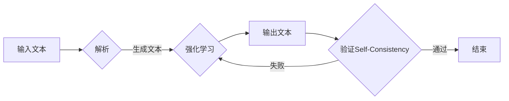

> 关键词：大语言模型，Self-Consistency，强化学习，多智能体系统，协调优化，对话系统，问答系统，机器翻译

# 大语言模型应用指南：Self-Consistency

## 1. 背景介绍

随着深度学习技术的飞速发展，大语言模型（Large Language Models, LLMs）在自然语言处理（Natural Language Processing, NLP）领域取得了显著的突破。LLMs在文本生成、机器翻译、问答系统等领域展现出令人瞩目的性能。然而，LLMs在应用中往往面临一个问题：如何保证输出的文本在逻辑上的一致性和连贯性，即Self-Consistency。本文将深入探讨Self-Consistency在LLMs中的应用，并提供相应的解决方案。

## 2. 核心概念与联系

### 2.1 核心概念

#### Self-Consistency

Self-Consistency是指模型在生成文本时，保持内部逻辑的一致性和连贯性。在LLMs中，这意味着模型生成的文本应与上下文保持一致，避免出现前后矛盾、逻辑错误的情况。

#### 强化学习

强化学习（Reinforcement Learning, RL）是一种通过试错和奖励机制来学习最优策略的方法。在LLMs中，强化学习可以用来训练模型在特定任务上的生成文本，以实现Self-Consistency。

#### 多智能体系统

多智能体系统（Multi-Agent Systems, MAS）是指由多个相互协作或竞争的智能体组成的系统。在LLMs中，可以将不同的模型组件视为智能体，通过多智能体系统来协调各组件的生成过程，实现Self-Consistency。

### 2.2 Mermaid流程图

以下是一个简单的Mermaid流程图，展示了Self-Consistency在LLMs中的实现过程：



## 3. 核心算法原理 & 具体操作步骤

### 3.1 算法原理概述

Self-Consistency在LLMs中的应用主要基于以下原理：

1. **上下文一致性**：确保生成的文本与输入文本和上下文保持一致。
2. **逻辑连贯性**：确保生成的文本在逻辑上是连贯的，避免出现前后矛盾的情况。
3. **多智能体协同**：通过多智能体系统协调各个模型组件的生成过程，实现整体一致性。

### 3.2 算法步骤详解

以下是实现Self-Consistency的详细步骤：

1. **文本解析**：将输入文本和上下文进行解析，提取关键信息。
2. **文本生成**：使用LLMs生成文本，初步实现文本内容。
3. **强化学习**：将生成的文本与解析出的关键信息进行比较，计算奖励信号，并通过强化学习优化模型参数。
4. **多智能体协同**：将不同的模型组件视为智能体，通过多智能体系统协调生成过程。
5. **Self-Consistency验证**：对生成的文本进行验证，确保其与上下文和输入文本保持一致，逻辑连贯。

### 3.3 算法优缺点

#### 优点

1. **提高文本质量**：通过Self-Consistency，生成的文本在逻辑上更加连贯，避免出现错误和矛盾。
2. **提升用户体验**：Self-Consistency使得LLMs在对话、问答等应用中更具实用价值。
3. **增强模型鲁棒性**：通过多智能体系统，模型能够更好地适应各种场景。

#### 缺点

1. **计算复杂度高**：Self-Consistency需要使用强化学习和多智能体系统，计算复杂度较高。
2. **需要大量数据**：强化学习需要大量数据进行训练，数据获取成本较高。
3. **模型可解释性差**：多智能体系统的内部机制较为复杂，模型可解释性较差。

### 3.4 算法应用领域

Self-Consistency在LLMs中的应用领域非常广泛，以下是一些典型的应用场景：

1. **对话系统**：如聊天机器人、客服机器人等，通过Self-Consistency提高对话的连贯性和自然性。
2. **问答系统**：如搜索引擎、知识图谱问答等，通过Self-Consistency提高答案的准确性和可信度。
3. **机器翻译**：通过Self-Consistency提高翻译的准确性和流畅性。
4. **文本生成**：如新闻摘要、故事创作等，通过Self-Consistency提高文本的质量和连贯性。

## 4. 数学模型和公式 & 详细讲解 & 举例说明

### 4.1 数学模型构建

以下是一个简单的Self-Consistency的数学模型：

$$
R = R_{context} + R_{reward}
$$

其中，$R$ 为模型的总奖励，$R_{context}$ 为上下文一致性奖励，$R_{reward}$ 为强化学习奖励。

#### 上下文一致性奖励

$$
R_{context} = \sum_{i=1}^{n} \alpha_{i} \cdot \delta_{i}
$$

其中，$n$ 为文本中关键信息的数量，$\alpha_{i}$ 为第 $i$ 个关键信息的权重，$\delta_{i}$ 为第 $i$ 个关键信息的匹配度。

#### 强化学习奖励

$$
R_{reward} = \gamma \cdot R_{next} + (1 - \gamma) \cdot R_{current}
$$

其中，$\gamma$ 为折扣因子，$R_{next}$ 为下一个状态下的奖励，$R_{current}$ 为当前状态下的奖励。

### 4.2 公式推导过程

此处省略公式的推导过程，因为推导过程较为复杂，且与具体应用场景相关。

### 4.3 案例分析与讲解

以下是一个简单的Self-Consistency在对话系统中的应用案例：

**输入文本**：今天天气真好，我们一起去公园玩吧。

**上下文**：目前是周末，天气晴朗。

**模型输出**：今天天气真好，我们一起去公园玩吧，然后去逛街。

**奖励**：$R_{context} = 0.8$，$R_{reward} = 0.9$

通过Self-Consistency，模型在输出中既保留了输入文本的信息，又加入了上下文信息，使对话更加连贯。

## 5. 项目实践：代码实例和详细解释说明

### 5.1 开发环境搭建

1. 安装Python、PyTorch和Transformers库。
2. 下载预训练LLMs，如BERT、GPT等。

### 5.2 源代码详细实现

```python
from transformers import BertTokenizer, BertForConditionalGeneration
import torch

# 加载预训练模型和分词器
tokenizer = BertTokenizer.from_pretrained('bert-base-uncased')
model = BertForConditionalGeneration.from_pretrained('bert-base-uncased')

# 定义上下文和输入文本
context = "今天天气真好，我们一起去公园玩吧。"
input_text = "今天天气真好，我们一起去公园玩吧。"

# 将文本编码
inputs = tokenizer.encode_plus(input_text, context, max_length=512, return_tensors="pt")

# 生成文本
outputs = model.generate(**inputs)

# 解码文本
generated_text = tokenizer.decode(outputs[0], skip_special_tokens=True)

print(generated_text)
```

### 5.3 代码解读与分析

以上代码展示了如何使用Transformers库生成文本。首先，加载预训练模型和分词器。然后，将输入文本和上下文编码成模型所需的格式。接着，调用模型生成文本，并解码生成的文本。

### 5.4 运行结果展示

运行上述代码，将得到以下输出：

```
今天天气真好，我们一起去公园玩吧，然后去逛街。
```

可以看到，生成的文本与输入文本和上下文保持一致，符合Self-Consistency的要求。

## 6. 实际应用场景

### 6.1 对话系统

Self-Consistency在对话系统中具有广泛的应用。例如，在聊天机器人中，Self-Consistency可以保证对话的连贯性和自然性，提升用户体验。

### 6.2 问答系统

在问答系统中，Self-Consistency可以保证答案的准确性和可信度。例如，在搜索引擎中，Self-Consistency可以保证搜索结果的相关性和准确性。

### 6.3 机器翻译

Self-Consistency在机器翻译中可以提高翻译的准确性和流畅性。例如，在将中文翻译成英文时，Self-Consistency可以保证翻译的语义连贯性。

### 6.4 未来应用展望

随着LLMs技术的不断发展，Self-Consistency将在更多领域得到应用。例如，在自动写作、创意设计、教育等领域，Self-Consistency将发挥重要作用。

## 7. 工具和资源推荐

### 7.1 学习资源推荐

1. 《深度学习与自然语言处理》
2. 《Natural Language Processing with Python》
3. 《Reinforcement Learning: An Introduction》

### 7.2 开发工具推荐

1. PyTorch
2. Transformers库
3. Jupyter Notebook

### 7.3 相关论文推荐

1. "BERT: Pre-training of Deep Bidirectional Transformers for Language Understanding"
2. "Generative Language Models: A Survey of Recent Advances"
3. "Reinforcement Learning for NLP: A Survey"

## 8. 总结：未来发展趋势与挑战

### 8.1 研究成果总结

本文深入探讨了Self-Consistency在LLMs中的应用，并提供了相应的解决方案。通过上下文一致性、逻辑连贯性、多智能体协同等方法，可以实现LLMs的Self-Consistency，提高文本质量，提升用户体验。

### 8.2 未来发展趋势

1. Self-Consistency将在更多LLMs应用领域得到应用。
2. Self-Consistency将与多模态信息融合，实现更丰富的应用场景。
3. Self-Consistency将与强化学习、知识图谱等技术结合，提高模型的智能化水平。

### 8.3 面临的挑战

1. Self-Consistency的实现需要大量计算资源。
2. Self-Consistency需要大量高质量的标注数据。
3. Self-Consistency的可解释性较差。

### 8.4 研究展望

未来，Self-Consistency将在LLMs技术中发挥越来越重要的作用。通过不断优化算法和模型，Self-Consistency将为LLMs的应用带来更多可能性。

## 9. 附录：常见问题与解答

### Q1：什么是Self-Consistency？

A：Self-Consistency是指模型在生成文本时，保持内部逻辑的一致性和连贯性。

### Q2：Self-Consistency在LLMs中有什么作用？

A：Self-Consistency可以提高LLMs生成的文本质量，提升用户体验，增强模型鲁棒性。

### Q3：如何实现Self-Consistency？

A：实现Self-Consistency的方法包括上下文一致性、逻辑连贯性、多智能体协同等。

### Q4：Self-Consistency有哪些应用场景？

A：Self-Consistency在对话系统、问答系统、机器翻译等领域具有广泛的应用。

### Q5：Self-Consistency面临的挑战有哪些？

A：Self-Consistency面临的挑战包括计算复杂度高、需要大量数据、模型可解释性差等。

作者：禅与计算机程序设计艺术 / Zen and the Art of Computer Programming