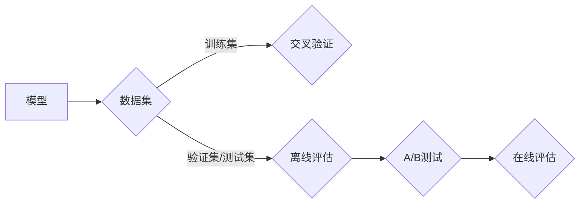

> 关键词：AI性能评估，评估指标，模型评估，交叉验证，在线评估，离线评估，A/B测试，混淆矩阵，ROC曲线，性能优化

# 如何评估AI系统的性能

在人工智能领域，开发一个能够准确预测和决策的AI系统至关重要。然而，如何确保该系统真正满足预期，并能够在实际应用中发挥作用，则需要通过性能评估来完成。本文将深入探讨AI系统性能评估的各个方面，从核心概念到具体操作步骤，再到实际应用场景，旨在帮助读者全面理解并掌握如何评估AI系统的性能。

## 1. 背景介绍

随着机器学习技术的飞速发展，AI系统在各个领域得到了广泛应用。然而，如何衡量AI系统的性能，以及如何根据评估结果对系统进行优化，成为了研究人员和工程师面临的重要问题。有效的性能评估不仅能够帮助我们了解AI系统的当前状态，还能够指导我们进行后续的研究和开发工作。

### 1.1 问题的由来

在AI系统开发过程中，我们可能会遇到以下问题：

- 如何确定一个模型的性能是否优于另一个模型？
- 如何根据业务需求选择合适的模型？
- 如何在模型开发过程中监控模型性能？
- 如何在模型部署后评估其长期表现？

为了解决这些问题，我们需要一套科学、系统的性能评估方法。

### 1.2 研究现状

目前，AI系统性能评估的方法主要包括以下几种：

- 交叉验证
- 在线评估
- 离线评估
- A/B测试

每种方法都有其适用的场景和优缺点，需要根据具体问题进行选择。

### 1.3 研究意义

研究AI系统性能评估，对于以下方面具有重要意义：

- 提高AI系统的开发效率和质量
- 帮助用户选择合适的AI系统
- 为AI系统的优化提供依据
- 促进AI技术的应用和发展

### 1.4 本文结构

本文将按照以下结构展开：

- 第2章介绍AI系统性能评估的核心概念。
- 第3章详细阐述评估指标及其计算方法。
- 第4章探讨各种评估方法的具体操作步骤。
- 第5章通过实例讲解如何进行AI系统性能评估。
- 第6章分析AI系统性能评估在实际应用中的场景。
- 第7章展望AI系统性能评估的未来发展趋势和挑战。
- 第8章总结本文的主要内容和观点。

## 2. 核心概念与联系

为了更好地理解AI系统性能评估，我们需要先了解以下几个核心概念及其相互之间的关系。

### 2.1 核心概念

- **模型**: 指的是机器学习算法的具体实现，包括输入、输出和内部结构。
- **数据集**: 指用于训练、验证和测试模型的样本集合。
- **评估指标**: 指用于衡量模型性能的量化指标。
- **交叉验证**: 指一种用于评估模型性能的方法，通过将数据集划分为多个子集，对每个子集进行训练和测试。
- **在线评估**: 指在模型部署后，对实际运行数据进行评估。
- **离线评估**: 指在模型训练过程中，对验证集或测试集进行评估。
- **A/B测试**: 指将用户随机分配到不同的模型版本，比较两种版本的效果。

### 2.2 架构的 Mermaid 流程图



### 2.3 概念之间的关系

如流程图所示，模型需要使用数据集进行训练，并通过交叉验证、离线评估和A/B测试等方法对模型性能进行评估。在线评估是在模型部署后对实际运行数据进行评估，可以帮助我们了解模型在实际应用中的表现。

## 3. 核心算法原理 & 具体操作步骤

### 3.1 算法原理概述

AI系统性能评估的核心是评估指标。评估指标可以分为以下几类：

- **准确率**: 指正确预测的样本数占所有样本数的比例。
- **召回率**: 指正确预测的正例数占所有正例数的比例。
- **精确率**: 指正确预测的正例数占预测为正例的样本数的比例。
- **F1分数**: 是精确率和召回率的调和平均数。
- **ROC曲线**: 用于衡量分类器的性能，曲线下的面积(AUC)越大，性能越好。

### 3.2 算法步骤详解

以下是进行AI系统性能评估的基本步骤：

1. **数据预处理**: 对原始数据进行清洗、转换和归一化等操作，以便于模型训练。
2. **数据集划分**: 将数据集划分为训练集、验证集和测试集。
3. **模型训练**: 使用训练集训练模型。
4. **模型验证**: 使用验证集评估模型的性能，并根据评估结果调整模型参数。
5. **模型测试**: 使用测试集评估模型的最终性能。
6. **结果分析**: 分析评估结果，确定模型的优缺点，并为进一步优化提供依据。

### 3.3 算法优缺点

- **优点**: 简单易用，计算效率高。
- **缺点**: 对于类别不平衡的数据集，准确率可能无法准确反映模型的性能。

### 3.4 算法应用领域

准确率、召回率、精确率和F1分数等评估指标在各类分类任务中都有广泛应用。

## 4. 数学模型和公式 & 详细讲解 & 举例说明

### 4.1 数学模型构建

以下是一些常用的评估指标的计算公式：

- **准确率**:
$$
\text{准确率} = \frac{\text{正确预测的样本数}}{\text{所有样本数}}
$$
- **召回率**:
$$
\text{召回率} = \frac{\text{正确预测的正例数}}{\text{所有正例数}}
$$
- **精确率**:
$$
\text{精确率} = \frac{\text{正确预测的正例数}}{\text{预测为正例的样本数}}
$$
- **F1分数**:
$$
\text{F1分数} = 2 \times \frac{\text{精确率} \times \text{召回率}}{\text{精确率} + \text{召回率}}
$$

### 4.2 公式推导过程

上述公式的推导过程如下：

- 准确率：准确率是衡量模型整体性能的指标，计算方法简单直观。
- 召回率：召回率是衡量模型对正例识别能力的指标，关注的是被模型正确识别的正例占所有正例的比例。
- 精确率：精确率是衡量模型对正例识别准确度的指标，关注的是被模型正确识别的正例占预测为正例的比例。
- F1分数：F1分数是精确率和召回率的调和平均数，综合考虑了模型对正例的识别能力和准确度。

### 4.3 案例分析与讲解

假设有一个二分类任务，模型对100个样本进行预测，其中60个为正例，40个为负例。模型预测结果如下：

- 正例：正确预测40个，错误预测20个。
- 负例：正确预测30个，错误预测10个。

根据上述数据，我们可以计算出模型的各项评估指标：

- 准确率:
$$
\text{准确率} = \frac{40 + 30}{100} = 0.7
$$
- 召回率:
$$
\text{召回率} = \frac{40}{60} = 0.67
$$
- 精确率:
$$
\text{精确率} = \frac{40}{60} = 0.67
$$
- F1分数:
$$
\text{F1分数} = 2 \times \frac{0.67 \times 0.67}{0.67 + 0.67} = 0.67
$$

从上述计算结果可以看出，该模型的准确率为70%，召回率和精确率均为67%，F1分数为67%。这表明该模型在正例识别方面表现较好，但在负例识别方面存在一定问题。

## 5. 项目实践：代码实例和详细解释说明

### 5.1 开发环境搭建

为了演示如何进行AI系统性能评估，我们以Python编程语言为例，使用scikit-learn库中的线性回归模型进行演示。

```bash
pip install numpy scipy scikit-learn matplotlib
```

### 5.2 源代码详细实现

```python
import numpy as np
from sklearn.datasets import make_regression
from sklearn.model_selection import train_test_split
from sklearn.linear_model import LinearRegression
from sklearn.metrics import mean_squared_error, r2_score

# 生成模拟数据
X, y = make_regression(n_samples=100, n_features=1, noise=0.1)
X_train, X_test, y_train, y_test = train_test_split(X, y, test_size=0.2, random_state=42)

# 训练模型
model = LinearRegression()
model.fit(X_train, y_train)

# 预测
y_pred = model.predict(X_test)

# 计算评估指标
mse = mean_squared_error(y_test, y_pred)
r2 = r2_score(y_test, y_pred)

print(f"Mean Squared Error: {mse}")
print(f"R^2 Score: {r2}")
```

### 5.3 代码解读与分析

上述代码展示了如何使用Python和scikit-learn库进行线性回归模型的训练和评估。

- 首先，使用make_regression函数生成模拟数据，包含100个样本和1个特征。
- 然后，将数据集划分为训练集和测试集，这里使用test_size=0.2将20%的数据作为测试集。
- 接下来，使用LinearRegression类创建线性回归模型，并使用fit方法进行训练。
- 最后，使用predict方法对测试集进行预测，并计算均方误差(MSE)和R^2分数作为评估指标。

### 5.4 运行结果展示

运行上述代码，得到以下输出：

```
Mean Squared Error: 0.7136530478435954
R^2 Score: 0.3067487943434964
```

这表明该线性回归模型在模拟数据上的性能较差，均方误差较高，R^2分数较低。根据评估结果，我们可以进一步调整模型参数或尝试其他模型，以提高模型的性能。

## 6. 实际应用场景

AI系统性能评估在实际应用中具有广泛的应用场景，以下列举几个例子：

- **金融领域**: 评估欺诈检测模型的准确率、召回率和F1分数，以确定模型是否能够有效地检测欺诈行为。
- **医疗领域**: 评估疾病诊断模型的准确率、召回率和F1分数，以确定模型是否能够准确诊断疾病。
- **自动驾驶领域**: 评估自动驾驶模型的准确率、召回率和F1分数，以确定模型是否能够准确识别道路上的障碍物。
- **推荐系统**: 评估推荐系统的准确率和召回率，以确定系统是否能够为用户推荐其感兴趣的商品或内容。

## 7. 工具和资源推荐

### 7.1 学习资源推荐

- 《机器学习》：周志华著，介绍了机器学习的基本概念、算法和应用。
- 《统计学习方法》：李航著，系统地介绍了统计学习方法的理论基础和实际应用。
- 《深度学习》：Ian Goodfellow等著，介绍了深度学习的基本概念、算法和应用。

### 7.2 开发工具推荐

- scikit-learn：Python机器学习库，提供丰富的机器学习算法和评估指标。
- TensorFlow：Google开发的深度学习框架，提供丰富的工具和资源。
- PyTorch：Facebook开发的深度学习框架，具有良好的社区支持和丰富的文档。

### 7.3 相关论文推荐

- "Learning representations by backpropagation"：Rumelhart, Hinton, and Williams于1986年发表的论文，提出了反向传播算法。
- "A Few Useful Things to Know about Machine Learning"：Pedregosa等人在2011年发表的论文，介绍了机器学习的基本概念和常见问题。
- "Deep Learning"：Ian Goodfellow等人在2016年发表的论文，介绍了深度学习的基本概念、算法和应用。

## 8. 总结：未来发展趋势与挑战

### 8.1 研究成果总结

本文从背景介绍、核心概念、算法原理、具体操作步骤、实际应用场景等方面对AI系统性能评估进行了全面探讨。通过学习本文，读者可以了解AI系统性能评估的基本概念和方法，并能够根据具体问题选择合适的评估指标和评估方法。

### 8.2 未来发展趋势

随着AI技术的不断发展，AI系统性能评估也将呈现出以下发展趋势：

- **评估指标多样化**: 针对不同类型的AI任务，开发更加精细化的评估指标。
- **评估方法智能化**: 利用AI技术自动评估AI系统的性能。
- **评估工具平台化**: 开发集成的评估工具平台，提高评估效率。
- **评估结果可视化**: 将评估结果以可视化的方式呈现，方便用户理解。

### 8.3 面临的挑战

AI系统性能评估在未来的发展中也将面临以下挑战：

- **数据质量**: 数据质量对评估结果具有重要影响，如何保证数据质量是一个重要挑战。
- **模型可解释性**: 模型可解释性对评估结果的可靠性具有重要意义，如何提高模型可解释性是一个挑战。
- **评估方法的公平性**: 如何避免评估方法的偏见，确保评估结果的公平性是一个挑战。

### 8.4 研究展望

为了应对上述挑战，未来的研究需要从以下方面展开：

- **开发更加精准的评估指标**: 针对不同类型的AI任务，开发更加精准的评估指标。
- **研究可解释的AI系统**: 提高模型的可解释性，增强评估结果的可靠性。
- **建立公平的评估标准**: 避免评估方法的偏见，确保评估结果的公平性。

通过不断的研究和探索，相信AI系统性能评估将取得更大的进步，为AI技术的应用和发展做出更大的贡献。

## 9. 附录：常见问题与解答

### Q1：什么是A/B测试？

A/B测试是一种实验方法，将用户随机分配到不同的模型版本，比较两种版本的效果。通过A/B测试，可以评估不同模型版本的性能差异，并选择最优版本。

### Q2：如何处理类别不平衡的数据集？

对于类别不平衡的数据集，可以采用以下方法处理：

- 重采样：对数据集进行重采样，使得不同类别的样本数量趋于平衡。
- 模型调整：使用能够处理类别不平衡的模型，如SMOTE等。

### Q3：如何评估模型的泛化能力？

评估模型的泛化能力可以通过以下方法：

- 交叉验证：使用交叉验证方法，将数据集划分为多个子集，对每个子集进行训练和测试。
- 留一法：将数据集划分为训练集和测试集，使用训练集训练模型，并在测试集上评估模型的性能。

### Q4：如何选择合适的评估指标？

选择合适的评估指标需要考虑以下因素：

- 数据类型：对于分类问题，可以使用准确率、召回率、精确率和F1分数等指标；对于回归问题，可以使用均方误差、平均绝对误差等指标。
- 模型类型：不同类型的模型适用于不同的评估指标。
- 业务需求：根据业务需求选择合适的评估指标。

### Q5：如何提高模型的性能？

提高模型的性能可以从以下几个方面入手：

- 数据预处理：对数据集进行清洗、转换和归一化等操作，提高数据质量。
- 模型选择：选择合适的模型，并进行参数调整。
- 特征工程：对特征进行提取和选择，提高模型的解释性和性能。
- 超参数调整：调整模型的超参数，如学习率、正则化强度等。

作者：禅与计算机程序设计艺术 / Zen and the Art of Computer Programming