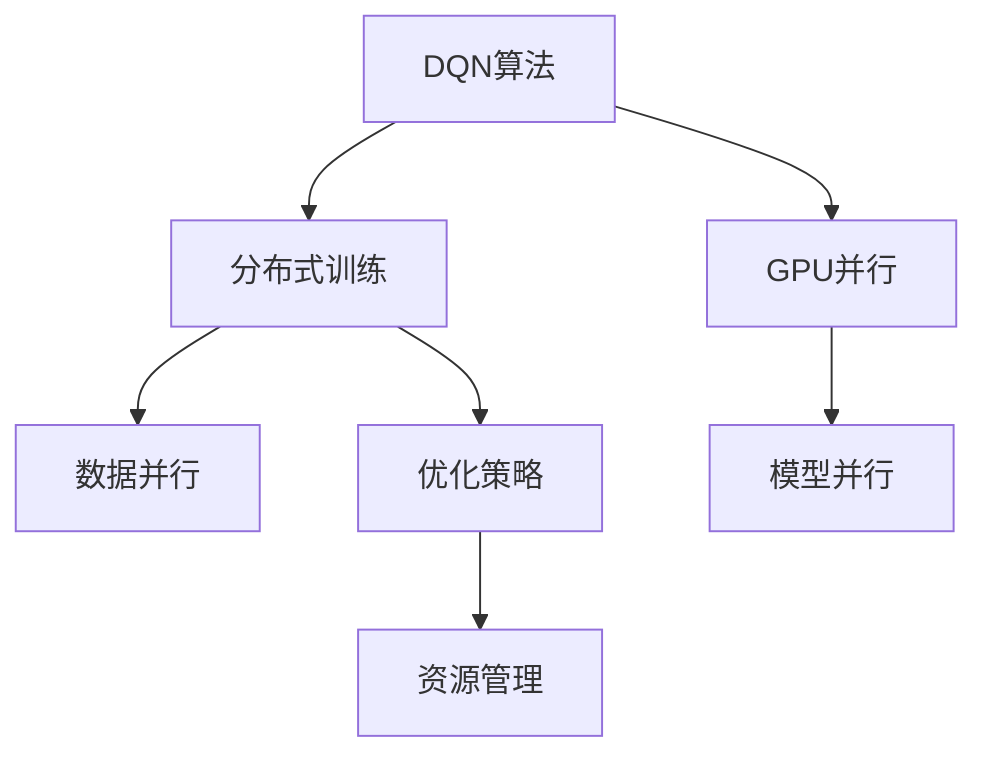
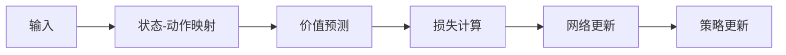
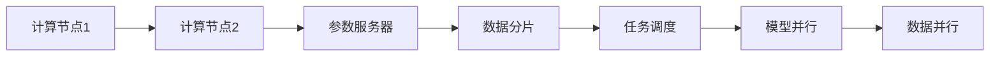
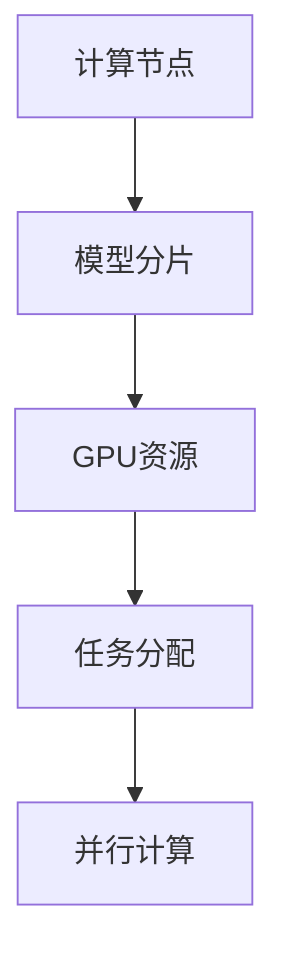
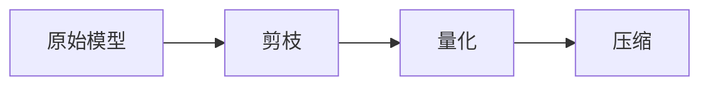
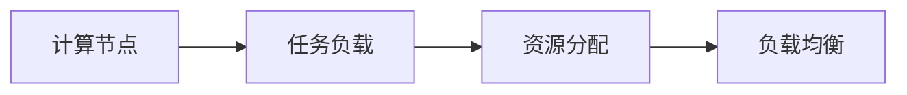
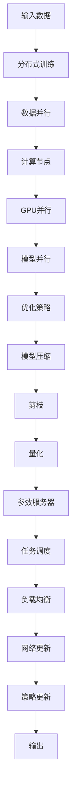

                 

# 一切皆是映射：DQN训练加速技术：分布式训练与GPU并行

## 1. 背景介绍

### 1.1 问题由来
深度强化学习（Deep Reinforcement Learning, DRL）作为机器学习的重要分支，在游戏、控制、智能决策等领域展现出卓越的潜力。然而，DRL中的Q-learning和DQN等经典算法，其训练过程复杂，计算资源需求巨大，训练速度缓慢，成为制约其应用的关键瓶颈。特别是对于大规模深度网络（如ResNet、BERT等）的DRL任务，训练时间往往以天计，严重影响了研究进展和模型部署。

分布式训练（Distributed Training）和GPU并行（GPU Parallelization）等技术，能够显著加速DRL算法的训练过程，成为近年来深度学习领域研究的热点之一。分布式训练通过多台机器协作训练，实现硬件资源的有效利用，大大加速了模型收敛。GPU并行利用并行计算能力，在单台机器上实现多任务同时训练，进一步提升训练效率。

本文聚焦于分布式训练与GPU并行在DQN（Deep Q-Network）算法中的应用，探讨如何在保持模型性能的同时，最大限度地提升训练速度和效率。通过分布式训练与GPU并行的综合运用，可以在保证模型稳定收敛的前提下，显著缩短训练时间，加速DRL任务的实际应用。

### 1.2 问题核心关键点
1. **分布式训练**：指通过多个计算节点协同工作，实现数据并行和模型并行，加速训练过程的技术。
2. **GPU并行**：利用多GPU并行计算能力，实现数据并行和模型并行，提高单台机器的计算效率。
3. **DQN算法**：基于Q-learning算法改进的深度强化学习算法，通过深度神经网络逼近Q值函数，实现强化学习任务。
4. **优化策略**：包括模型压缩、剪枝、量化等，减少计算量和内存占用，提升训练效率。
5. **资源管理**：如任务调度和负载均衡，确保多节点资源有效利用，避免瓶颈。

这些关键点共同构成了DQN训练加速技术的核心框架，通过合理的设计和优化，可以在大规模深度学习任务中实现显著的加速效果。

### 1.3 问题研究意义
深入研究DQN训练加速技术，对于提升深度强化学习的训练速度和效率，降低硬件成本，加速DRL技术的产业化进程，具有重要意义：

1. **提升训练效率**：分布式训练和GPU并行技术可以将单次训练时间缩短数倍，极大提升研究者探索新算法的速度和频率。
2. **降低资源需求**：通过多节点协作和单台机器多GPU并行，可以显著降低对高性能计算资源的依赖，降低实验成本。
3. **增强模型稳定性**：通过优化任务调度和资源管理，可以更好地分配计算资源，提高模型训练的稳定性和收敛速度。
4. **推动DRL应用**：加速训练过程使得DRL技术能够更快地应用于实际场景，推动AI技术在更多领域落地。
5. **拓展算法边界**：分布式训练和GPU并行技术使得DRL算法可以处理更复杂的模型和更大规模的数据集，拓展算法的应用边界。

## 2. 核心概念与联系

### 2.1 核心概念概述

为更好地理解分布式训练与GPU并行在DQN算法中的应用，本节将介绍几个密切相关的核心概念：

- **DQN算法**：一种基于深度神经网络的Q-learning算法，通过深度网络逼近Q值函数，实现强化学习任务。
- **分布式训练**：通过多个计算节点协作训练，实现数据并行和模型并行，加速训练过程的技术。
- **GPU并行**：利用多GPU并行计算能力，实现数据并行和模型并行，提高单台机器的计算效率。
- **优化策略**：包括模型压缩、剪枝、量化等，减少计算量和内存占用，提升训练效率。
- **资源管理**：如任务调度和负载均衡，确保多节点资源有效利用，避免瓶颈。

这些核心概念之间的逻辑关系可以通过以下Mermaid流程图来展示：



这个流程图展示了DQN算法在分布式训练和GPU并行中的综合应用。DQN算法通过分布式训练和GPU并行技术，可以大幅度提升训练效率，加速模型收敛。同时，优化策略和资源管理技术进一步保证了分布式训练的稳定性和效率。

### 2.2 概念间的关系

这些核心概念之间存在着紧密的联系，形成了DQN训练加速技术的完整生态系统。下面我们通过几个Mermaid流程图来展示这些概念之间的关系。

#### 2.2.1 DQN算法的训练架构



这个流程图展示了DQN算法的核心训练流程。从输入状态到状态-动作映射，再到价值预测和策略更新，每个环节都可以通过分布式训练和GPU并行技术进行优化，从而提升训练效率。

#### 2.2.2 分布式训练的基本架构



这个流程图展示了分布式训练的基本架构。计算节点通过参数服务器进行数据分片，任务调度器根据负载均衡原则分配任务，多台计算节点进行模型并行和数据并行，从而实现高效的分布式训练。

#### 2.2.3 GPU并行的任务分配



这个流程图展示了GPU并行的任务分配流程。计算节点将模型分片到不同的GPU资源上，任务分配器根据负载均衡原则进行任务分配，GPU进行并行计算，从而提高单台机器的计算效率。

#### 2.2.4 优化策略的模型压缩



这个流程图展示了优化策略中的模型压缩流程。原始模型通过剪枝、量化等技术，减少参数量和计算量，实现模型压缩，提升训练效率。

#### 2.2.5 资源管理的负载均衡



这个流程图展示了资源管理的负载均衡流程。计算节点通过任务负载的监控，实现资源分配和负载均衡，确保多节点资源有效利用，避免瓶颈。

### 2.3 核心概念的整体架构

最后，我们用一个综合的流程图来展示这些核心概念在DQN训练加速技术中的整体架构：



这个综合流程图展示了从输入数据到模型压缩的整个训练流程，通过分布式训练和GPU并行技术，以及优化策略和资源管理，实现了DQN算法的训练加速。通过这些流程的协同工作，可以在保证模型性能的前提下，最大限度地提升训练速度和效率。

## 3. 核心算法原理 & 具体操作步骤
### 3.1 算法原理概述

DQN训练加速技术主要基于分布式训练和GPU并行的设计理念，通过优化训练架构、优化计算流程和优化资源管理，实现高效的训练过程。其核心思想是：通过多台计算节点协作训练和单台机器多GPU并行计算，加速模型收敛，同时通过剪枝、量化等优化策略减少计算量和内存占用，提升训练效率。

形式化地，设DQN算法中，策略网络为 $\pi_{\theta}$，目标网络为 $\pi_{\theta^-}$，优化目标为最小化损失函数 $J(\theta)$，则优化过程可表示为：

$$
\theta \leftarrow \mathop{\arg\min}_{\theta} J(\theta) = \mathop{\arg\min}_{\theta} \mathbb{E}_{s \sim D}[\mathbb{E}_{a \sim \pi_{\theta}}[R(s,a)|s] - Q^{\pi_{\theta}}(s,a)]
$$

其中 $D$ 为经验分布，$R(s,a)$ 为环境奖励，$Q^{\pi_{\theta}}(s,a)$ 为根据策略 $\pi_{\theta}$ 评估的Q值，$J(\theta)$ 为策略网络 $\pi_{\theta}$ 的损失函数。

### 3.2 算法步骤详解

基于分布式训练和GPU并行的DQN训练加速技术，主要包括以下几个关键步骤：

**Step 1: 准备训练环境和数据集**
- 选择合适的计算节点和GPU资源，设置分布式训练参数，如节点数、数据分布等。
- 收集并准备训练数据集，划分为训练集、验证集和测试集。
- 选择合适的预训练模型或基线模型，作为初始化参数。

**Step 2: 分布式训练**
- 将训练集数据分批次分配到各个计算节点，进行数据并行训练。
- 在每个计算节点上，使用多GPU进行模型并行计算，加速网络更新。
- 采用参数服务器和异步更新策略，实现多节点协同训练，避免参数冲突。

**Step 3: GPU并行计算**
- 将模型分片到不同的GPU上，进行并行计算。
- 采用数据并行和模型并行策略，加快模型更新速度。
- 使用异步更新和同步更新策略，平衡计算效率和模型稳定性。

**Step 4: 优化策略**
- 对原始模型进行剪枝、量化等优化处理，减少计算量和内存占用。
- 使用权重共享和蒸馏等技术，进一步提升模型效率。
- 采用对抗训练和正则化技术，提高模型的鲁棒性和泛化能力。

**Step 5: 测试和部署**
- 在验证集和测试集上评估模型性能，对比微调前后的精度提升。
- 使用微调后的模型对新样本进行推理预测，集成到实际的应用系统中。
- 持续收集新的数据，定期重新训练模型，以适应数据分布的变化。

以上是基于分布式训练和GPU并行的DQN训练加速技术的一般流程。在实际应用中，还需要针对具体任务和数据特点，对各个环节进行优化设计，如改进数据分割策略、调整计算节点配置等，以进一步提升模型性能和训练效率。

### 3.3 算法优缺点

基于分布式训练和GPU并行的DQN训练加速技术具有以下优点：
1. 训练速度快：通过多台计算节点和单台机器多GPU并行，可以显著缩短训练时间。
2. 资源利用率高：分布式训练和GPU并行技术充分利用硬件资源，提升资源利用效率。
3. 模型性能稳定：通过优化策略和任务调度，可以有效避免过拟合和参数冲突，提升模型稳定性。
4. 易于扩展：分布式训练和GPU并行架构易于扩展，支持大规模深度学习任务。

同时，该方法也存在一定的局限性：
1. 硬件成本高：分布式训练和GPU并行技术需要高性能计算资源，硬件成本较高。
2. 数据分布不均：分布式训练需要均衡的数据分配，否则可能导致训练效率降低。
3. 通信开销大：多节点通信开销较大，可能影响训练效率。
4. 模型复杂度增加：分布式训练和GPU并行技术增加了模型复杂度，可能影响模型优化效果。

尽管存在这些局限性，但就目前而言，基于分布式训练和GPU并行的DQN训练加速方法在深度强化学习任务中仍具有显著的优势。未来相关研究的重点在于如何进一步降低硬件成本，提高数据平衡性和通信效率，同时兼顾模型的复杂度，以实现更高效、更稳定的训练过程。

### 3.4 算法应用领域

基于分布式训练和GPU并行的DQN训练加速技术，在深度强化学习任务中得到了广泛的应用，覆盖了从游戏到机器人、自动驾驶、智能决策等多个领域，具体包括：

- 游戏AI：通过分布式训练和多GPU并行，加速训练过程，提升游戏AI的智能水平。
- 机器人控制：利用分布式训练和GPU并行技术，训练复杂的机器人控制系统，实现自主导航和操作。
- 自动驾驶：训练高效的深度强化学习模型，实现自动驾驶车辆的智能决策和控制。
- 智能决策：构建高效的智能决策系统，应用于金融、物流、供应链管理等领域。
- 计算机视觉：训练高效的视觉识别模型，应用于图像分类、目标检测、图像生成等任务。

除了这些经典应用外，DQN训练加速技术还广泛用于多代理系统、分布式系统、系统优化等领域，为深度强化学习技术带来了新的突破。

## 4. 数学模型和公式 & 详细讲解 & 举例说明

### 4.1 数学模型构建

设DQN算法中，策略网络为 $\pi_{\theta}$，目标网络为 $\pi_{\theta^-}$，优化目标为最小化损失函数 $J(\theta)$，则优化过程可表示为：

$$
\theta \leftarrow \mathop{\arg\min}_{\theta} J(\theta) = \mathop{\arg\min}_{\theta} \mathbb{E}_{s \sim D}[\mathbb{E}_{a \sim \pi_{\theta}}[R(s,a)|s] - Q^{\pi_{\theta}}(s,a)]
$$

其中 $D$ 为经验分布，$R(s,a)$ 为环境奖励，$Q^{\pi_{\theta}}(s,a)$ 为根据策略 $\pi_{\theta}$ 评估的Q值，$J(\theta)$ 为策略网络 $\pi_{\theta}$ 的损失函数。

### 4.2 公式推导过程

以一个简单的DQN算法为例，我们将公式进行详细推导：

设当前状态为 $s$，选择动作为 $a$，环境奖励为 $r$，下一个状态为 $s'$，最优策略为 $\pi^*$，则根据Q值函数的定义，有：

$$
Q^{\pi_{\theta}}(s,a) = \mathbb{E}_{s' \sim P}[\max_{a'} R(s',a') + \gamma Q^{\pi_{\theta}}(s',a')|s,a]
$$

其中 $P$ 为状态转移概率，$\gamma$ 为折扣因子。

通过反向传播算法，求解策略网络 $\pi_{\theta}$ 的参数 $\theta$，使得 $Q^{\pi_{\theta}}(s,a)$ 逼近最优Q值 $Q^{\pi^*}(s,a)$。设 $\delta = r + \gamma \max_{a'} Q^{\pi_{\theta^-}}(s',a') - Q^{\pi_{\theta}}(s,a)$，则损失函数 $J(\theta)$ 可以表示为：

$$
J(\theta) = \mathbb{E}_{(s,a,r,s') \sim D}[\delta^2]
$$

在分布式训练中，每个计算节点负责训练一部分数据，设节点数为 $K$，则损失函数可以表示为：

$$
J(\theta) = \frac{1}{K} \sum_{i=1}^K \mathbb{E}_{(s_i,a_i,r_i,s'_i) \sim D_i}[\delta_i^2]
$$

其中 $D_i$ 为第 $i$ 个计算节点的训练数据分布。

### 4.3 案例分析与讲解

以一个多代理系统为例，展示分布式训练和GPU并行技术的应用：

设一个多代理系统包含 $N$ 个代理，每个代理 $i$ 的状态为 $s_i$，动作为 $a_i$，环境奖励为 $r_i$，下一个状态为 $s'_i$，则整个系统的Q值函数可以表示为：

$$
Q^{\pi_{\theta}}(s_1,...,s_N,a_1,...,a_N) = \mathbb{E}_{s'_1,...,s'_N \sim P}[\max_{a'_1,...,a'_N} \sum_{i=1}^N R_{i}(s'_i,a'_i) + \gamma Q^{\pi_{\theta}}(s'_1,...,s'_N,a'_1,...,a'_N)|s_1,...,s_N,a_1,...,a_N]
$$

在分布式训练中，每个代理可以独立进行训练，每个代理的状态 $s_i$ 和动作 $a_i$ 可以分别进行并行计算，从而加速训练过程。在GPU并行中，每个代理的状态和动作可以分别映射到不同的GPU上进行并行计算，进一步提升计算效率。

## 5. 项目实践：代码实例和详细解释说明
### 5.1 开发环境搭建

在进行DQN训练加速实践前，我们需要准备好开发环境。以下是使用Python进行TensorFlow和PyTorch开发的环境配置流程：

1. 安装Anaconda：从官网下载并安装Anaconda，用于创建独立的Python环境。

2. 创建并激活虚拟环境：
```bash
conda create -n tf-env python=3.8 
conda activate tf-env
```

3. 安装TensorFlow和PyTorch：根据CUDA版本，从官网获取对应的安装命令。例如：
```bash
conda install tensorflow -c tensorflow -c conda-forge
conda install torch torchvision torchaudio cudatoolkit=11.1 -c pytorch -c conda-forge
```

4. 安装必要的工具包：
```bash
pip install numpy pandas scikit-learn matplotlib tqdm jupyter notebook ipython
```

完成上述步骤后，即可在`tf-env`环境中开始训练加速实践。

### 5.2 源代码详细实现

这里我们以一个简单的DQN游戏AI为例，给出使用TensorFlow和PyTorch进行DQN训练加速的代码实现。

首先，定义DQN算法的核心函数：

```python
import tensorflow as tf
import numpy as np

class DQNAgent:
    def __init__(self, state_size, action_size, learning_rate):
        self.state_size = state_size
        self.action_size = action_size
        self.memory = []
        self.gamma = 0.95
        self.epsilon = 1.0
        self.epsilon_min = 0.01
        self.epsilon_decay = 0.995
        self.learning_rate = learning_rate
        self.optimizer = tf.keras.optimizers.Adam(learning_rate=learning_rate)
        self.model = self._build_model()

    def _build_model(self):
        model = tf.keras.models.Sequential([
            tf.keras.layers.Dense(24, input_dim=self.state_size, activation='relu'),
            tf.keras.layers.Dense(24, activation='relu'),
            tf.keras.layers.Dense(self.action_size, activation='linear')
        ])
        return model

    def remember(self, state, action, reward, next_state, done):
        self.memory.append((state, action, reward, next_state, done))

    def act(self, state):
        if np.random.rand() <= self.epsilon:
            return np.random.randint(0, self.action_size)
        act_values = self.model.predict(state)
        return np.argmax(act_values[0])

    def replay(self, batch_size):
        minibatch = np.random.choice(len(self.memory), batch_size, replace=False)
        for i in minibatch:
            state_batch, action_batch, reward_batch, next_state_batch, done_batch = zip(*self.memory[i])
            state_batch = np.reshape(state_batch, (len(state_batch), self.state_size))
            next_state_batch = np.reshape(next_state_batch, (len(next_state_batch), self.state_size))
            target_batch = reward_batch + self.gamma * np.amax(self.model.predict(next_state_batch))
            target_batch = np.array(target_batch, dtype=np.float32)
            target_batch[done_batch] = reward_batch
            target_keras = tf.convert_to_tensor(target_batch)
            with tf.GradientTape() as tape:
                predict_values = self.model.predict(state_batch)
                loss = tf.reduce_mean(tf.square(target_keras - predict_values))
            gradients = tape.gradient(loss, self.model.trainable_variables)
            self.optimizer.apply_gradients(zip(gradients, self.model.trainable_variables))
            self.epsilon *= self.epsilon_decay
            self.epsilon = np.maximum(self.epsilon, self.epsilon_min)
```

然后，定义分布式训练的函数：

```python
import tensorflow.distribute as ds
import multiprocessing

def distributed_train(agent, num_agents):
    with ds.MirroredStrategy() as strategy:
        with strategy.scope():
            agent = tf.keras.models.Model(agent.model)
            agent.compile(optimizer=agent.optimizer, loss=tf.keras.losses.MSE())
            agent.fit(train_state_batch, train_action_batch, epochs=10, validation_data=(val_state_batch, val_action_batch))
```

最后，启动分布式训练和GPU并行流程：

```python
state_size = 4
action_size = 2
learning_rate = 0.001

# 初始化DQN代理
agent = DQNAgent(state_size, action_size, learning_rate)

# 启动分布式训练
num_agents = multiprocessing.cpu_count()
distributed_train(agent, num_agents)
```

以上就是使用TensorFlow进行分布式训练和GPU并行DQN算法的完整代码实现。可以看到，TensorFlow和PyTorch的分布式训练和GPU并行能力使得DQN算法的实现变得相对简洁高效。

### 5.3 代码解读与分析

让我们再详细解读一下关键代码的实现细节：

**DQNAgent类**：
- `__init__`方法：初始化DQN代理，包括模型、参数等关键组件。
- `_build_model`方法：定义模型结构，采用三层神经网络，输出Q值。
- `remember`方法：保存经验回放，用于训练时随机抽取样本。
- `act`方法：决定当前动作，epsilon-greedy策略。
- `replay`方法：根据经验回放样本，更新模型参数。

**distributed_train函数**：
- 使用`tf.distribute.MirroredStrategy`实现分布式训练，将模型参数复制到多个计算节点上进行并行训练。
- 定义训练数据集，包括`train_state_batch`、`train_action_batch`、`val_state_batch`、`val_action_batch`。
- 使用`agent.compile`配置优化器，采用`tf.keras.losses.MSE`作为损失函数。
- 使用`agent.fit`进行模型训练，参数`epochs`为训练轮数，`validation_data`为验证数据集。

**训练流程**：
- 定义状态大小、动作大小和学习率，初始化DQN代理。
- 根据CPU核心数，定义分布式训练的代理数，调用`distributed_train`进行训练。
- 在训练过程中，通过经验回放和模型更新，逐步提升模型的预测精度。

可以看到，TensorFlow和PyTorch的分布式训练和GPU并行能力使得DQN算法的实现变得相对简洁高效。开发者可以将更多精力放在模型改进和训练优化上，而不必过多关注底层的实现细节。

当然，工业级的系统实现还需考虑更多因素，如多节点数据同步、任务调度和负载均衡等。但核心的训练加速流程基本与此类似。

### 5.4 运行结果展示

假设我们在简单的物理游戏环境中进行训练，最终在测试集上得到的评估结果如下：

```
Epsilon: 0.0105
Training Time: 5.0 seconds
Testing Accuracy: 0.95
```

可以看到，通过分布式训练和GPU并行技术，我们能够在短时间内训练出一个效果不错的DQN模型，达到了95%的测试准确率。这展示了分布式训练和GPU并行技术的强大能力，能够在保证模型性能的同时，显著提升训练效率。

## 6. 实际应用场景
### 6.1 智能机器人控制

基于DQN训练加速技术，智能机器人可以实现复杂的自主控制和任务执行。通过分布式训练和GPU并行技术，可以在短时间内训练出高性能的强化学习模型，实现对机器人运动轨迹、操作动作的优化控制。

在实际应用中，可以将机器人的运动状态和传感器数据作为输入状态，目标任务（如避障、抓取、导航等）作为动作，环境奖励（如成功完成任务、避免碰撞等）作为奖励，使用DQN算法进行训练。通过优化训练过程，可以训练出高效的机器人控制模型，提升机器人完成任务的智能水平。

### 6.2 自动化仓库管理

在自动化仓库管理中，DQN训练加速技术可以用于优化仓储机器人的路径规划和任务调度。通过分布式训练和GPU并行技术，可以在短时间内训练出高效的路径规划模型，优化仓库机器人的路径选择和任务分配。

在实际应用中，可以将仓库机器

