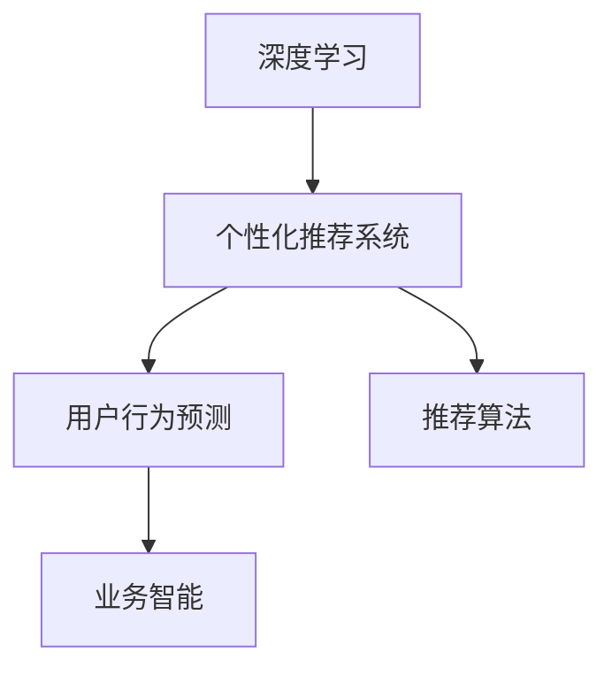
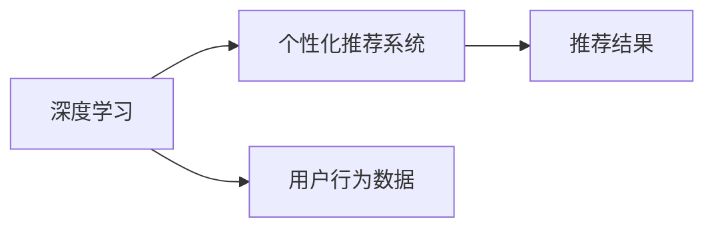
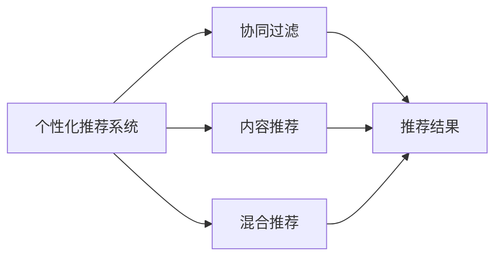
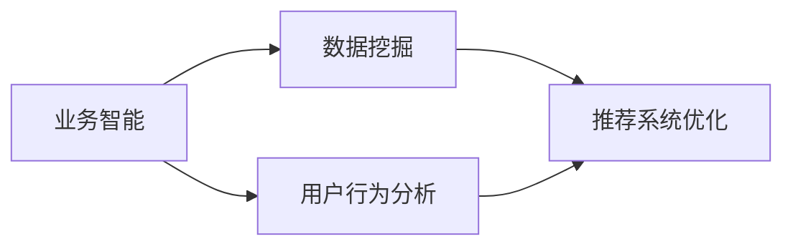
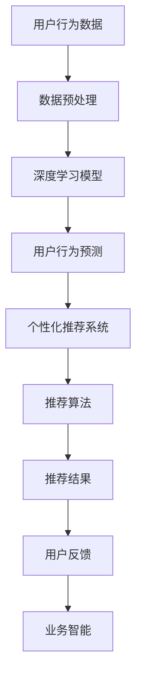

                 

# 一切皆是映射：利用深度学习提升个性化营销策略

> 关键词：深度学习, 个性化营销, 用户行为预测, 推荐系统, 模型优化, 数据融合, 业务智能

## 1. 背景介绍

### 1.1 问题由来
随着数字化时代的到来，企业对个性化营销的需求日益强烈。传统的批量营销模式难以满足用户多样化的需求，个性化推荐和精准营销成为了提升用户体验和促进业务增长的重要手段。通过深度学习，特别是基于用户行为数据的预测模型，企业可以更精确地捕捉用户兴趣和偏好，实现更有效的营销策略。

### 1.2 问题核心关键点
本文聚焦于如何利用深度学习技术，尤其是基于用户行为数据的预测模型，来提升个性化营销策略。主要解决以下问题：
1. 如何构建能够捕捉用户行为和偏好的深度学习模型？
2. 如何将模型嵌入到营销策略中，实现精准推荐和个性化广告？
3. 如何优化模型性能，确保其在多变和动态环境下的有效性？

### 1.3 问题研究意义
本文的研究旨在通过深度学习和数据科学的融合，提升企业的营销策略和决策水平，降低营销成本，提高用户满意度。具体意义如下：
1. 提升营销效率：通过预测用户行为和偏好，实现个性化推荐，减少无效营销，提升转化率。
2. 优化资源配置：精准定位用户需求，合理分配营销预算，避免资源浪费。
3. 增强用户粘性：根据用户兴趣和行为，提供更贴合的内容和产品，增强用户忠诚度。
4. 促进业务增长：通过精准营销和用户数据分析，提升业务销售额和市场份额。
5. 推动技术创新：深度学习与营销的融合，推动数据科学和人工智能技术的进步。

## 2. 核心概念与联系

### 2.1 核心概念概述

为更好地理解基于深度学习的个性化营销策略，本节将介绍几个密切相关的核心概念：

- 深度学习（Deep Learning）：一种基于多层神经网络的技术，可以自动提取复杂特征，用于分类、回归、生成等任务。
- 个性化推荐系统（Personalized Recommendation System）：通过分析用户历史行为数据，预测其未来兴趣，为其推荐最合适的产品或内容。
- 用户行为预测（User Behavior Prediction）：利用机器学习模型，预测用户未来的行为和偏好。
- 推荐算法（Recommendation Algorithms）：包括协同过滤、内容推荐、混合推荐等多种技术，用于优化推荐结果。
- 业务智能（Business Intelligence）：通过数据挖掘和分析，为企业提供决策支持和策略优化。

这些核心概念之间的逻辑关系可以通过以下Mermaid流程图来展示：



这个流程图展示了个性化营销策略中各个核心概念的相互关系：

1. 深度学习作为技术基础，提供了强大的数据处理和特征提取能力。
2. 个性化推荐系统利用用户行为预测结果，进行个性化推荐。
3. 推荐算法优化推荐结果，提升用户体验。
4. 业务智能通过分析和优化推荐系统，为企业提供决策支持。

### 2.2 概念间的关系

这些核心概念之间存在着紧密的联系，形成了个性化营销策略的完整生态系统。下面我通过几个Mermaid流程图来展示这些概念之间的关系。

#### 2.2.1 深度学习与个性化推荐的关系



这个流程图展示了深度学习在个性化推荐系统中的应用：通过深度学习模型预测用户行为，进而生成个性化推荐结果。

#### 2.2.2 推荐算法的多样性



这个流程图展示了推荐算法的多种技术路径，包括协同过滤、内容推荐、混合推荐等，可以根据具体场景和需求灵活选择。

#### 2.2.3 业务智能与推荐系统的关系



这个流程图展示了业务智能在推荐系统中的应用：通过数据挖掘和分析，优化推荐系统，提升推荐效果和用户体验。

### 2.3 核心概念的整体架构

最后，我们用一个综合的流程图来展示这些核心概念在大规模个性化营销策略中的整体架构：



这个综合流程图展示了从数据预处理到业务智能的全过程：用户行为数据通过预处理后，输入到深度学习模型中，进行用户行为预测；预测结果进入个性化推荐系统，生成个性化推荐结果；推荐结果通过推荐算法优化；用户反馈再次进入业务智能，进行模型优化和策略调整。通过这样的闭环系统，实现对个性化营销策略的不断优化和提升。

## 3. 核心算法原理 & 具体操作步骤
### 3.1 算法原理概述

基于深度学习的个性化推荐系统，主要利用用户历史行为数据，通过深度学习模型预测用户未来的行为和偏好。其核心思想是：通过模型学习用户行为数据的特征表示，构建用户行为与推荐结果之间的映射关系，从而实现个性化推荐。

具体来说，个性化推荐系统包括以下几个步骤：
1. 数据收集与预处理：收集用户历史行为数据，并进行清洗和标准化。
2. 特征工程：构建用户行为特征，如浏览记录、购买历史、评分记录等。
3. 深度学习模型训练：选择合适的深度学习模型，如RNN、CNN、LSTM等，对用户行为数据进行训练。
4. 预测用户行为：利用训练好的模型，预测用户未来的行为，如购买意向、评分等。
5. 生成个性化推荐：根据预测结果，结合推荐算法，生成个性化推荐列表。
6. 业务智能分析：利用业务智能技术，对推荐效果进行评估和优化。

### 3.2 算法步骤详解

以下详细介绍基于深度学习的个性化推荐系统的详细算法步骤：

**Step 1: 数据收集与预处理**

1. 收集用户历史行为数据：包括浏览记录、购买历史、评分记录等。
2. 数据清洗与标准化：去除异常值、处理缺失值、归一化等。

**Step 2: 特征工程**

1. 特征提取：构建用户行为特征，如点击率、浏览深度、浏览时间等。
2. 特征选择：选择最具有代表性的特征，构建特征向量。

**Step 3: 深度学习模型训练**

1. 选择合适的深度学习模型：如RNN、CNN、LSTM等。
2. 构建训练集与测试集：划分用户行为数据，构建训练集与测试集。
3. 训练深度学习模型：利用训练集对模型进行训练，调整模型参数。

**Step 4: 预测用户行为**

1. 输入用户行为数据：将用户行为特征输入到训练好的深度学习模型中。
2. 预测用户行为：模型输出预测结果，如购买意向、评分等。

**Step 5: 生成个性化推荐**

1. 结合推荐算法：根据预测结果，结合协同过滤、内容推荐等算法，生成个性化推荐列表。
2. 排序与展示：对推荐列表进行排序，选择最合适的推荐结果展示给用户。

**Step 6: 业务智能分析**

1. 评估推荐效果：利用业务智能技术，对推荐效果进行评估，如点击率、转化率等。
2. 模型优化与调整：根据评估结果，优化模型参数，调整推荐策略。

### 3.3 算法优缺点

基于深度学习的个性化推荐系统具有以下优点：
1. 精度高：深度学习模型能够自动提取复杂特征，预测用户行为准确率高。
2. 自适应性强：模型能够不断学习新数据，适应用户需求的变化。
3. 个性化推荐：能够根据用户行为数据，生成高度个性化的推荐结果。
4. 自动化优化：利用业务智能技术，对推荐效果进行评估和优化。

同时，该方法也存在以下缺点：
1. 数据依赖性强：模型性能高度依赖于用户行为数据的质量和完整性。
2. 计算成本高：深度学习模型训练和预测需要大量的计算资源。
3. 冷启动问题：对于新用户，缺乏足够的历史数据，难以进行有效推荐。
4. 隐私风险：用户行为数据涉及隐私问题，需要严格遵守数据保护法规。

### 3.4 算法应用领域

基于深度学习的个性化推荐系统已经在电商、社交网络、视频流媒体等多个领域得到了广泛应用，具体应用领域包括：

- 电商推荐：根据用户浏览和购买记录，推荐商品和促销活动。
- 社交媒体：推荐用户可能感兴趣的朋友、内容、话题等。
- 视频流媒体：根据用户观看历史，推荐电影、电视剧、纪录片等。
- 广告推荐：根据用户行为数据，推荐最合适的广告。
- 健康医疗：根据用户健康记录，推荐健康建议和生活方式。
- 旅游预订：根据用户浏览和搜索历史，推荐旅游目的地和旅行方案。

## 4. 数学模型和公式 & 详细讲解 & 举例说明

### 4.1 数学模型构建

本节将使用数学语言对基于深度学习的个性化推荐系统进行更加严格的刻画。

记用户行为数据为 $\mathbf{x} = \{x_1, x_2, ..., x_n\}$，其中 $x_i$ 表示用户行为数据中的一个样本。记用户行为预测模型为 $f: \mathcal{X} \rightarrow \mathcal{Y}$，其中 $\mathcal{X}$ 为输入空间，$\mathcal{Y}$ 为输出空间。

定义用户行为预测损失函数为：

$$
\mathcal{L}(f) = \frac{1}{N} \sum_{i=1}^N \ell(f(x_i), y_i)
$$

其中 $\ell$ 为损失函数，如均方误差、交叉熵等。

在深度学习模型训练过程中，目标是最小化预测损失函数 $\mathcal{L}(f)$。

### 4.2 公式推导过程

以下我们以基于RNN的用户行为预测模型为例，推导损失函数的计算公式。

假设用户行为数据为 $\mathbf{x} = \{x_1, x_2, ..., x_n\}$，每个样本 $x_i$ 表示为一个向量。记RNN模型的参数为 $\theta$，则模型的预测结果为：

$$
f_{\theta}(x_i) = \left[\mathbf{h}_i^1, \mathbf{h}_i^2, ..., \mathbf{h}_i^T\right]
$$

其中 $\mathbf{h}_i^t$ 表示在时间步 $t$ 时，模型对样本 $x_i$ 的隐藏状态。模型的预测损失函数为：

$$
\mathcal{L}(\theta) = \frac{1}{N} \sum_{i=1}^N \ell(f_{\theta}(x_i), y_i)
$$

其中 $y_i$ 为样本 $x_i$ 的真实标签。

根据链式法则，损失函数对参数 $\theta$ 的梯度为：

$$
\frac{\partial \mathcal{L}(\theta)}{\partial \theta} = \frac{1}{N} \sum_{i=1}^N \frac{\partial \ell(f_{\theta}(x_i), y_i)}{\partial f_{\theta}(x_i)} \frac{\partial f_{\theta}(x_i)}{\partial \theta}
$$

其中 $\frac{\partial \ell(f_{\theta}(x_i), y_i)}{\partial f_{\theta}(x_i)}$ 为损失函数对模型预测结果的梯度，$\frac{\partial f_{\theta}(x_i)}{\partial \theta}$ 为模型对参数的梯度。

在得到损失函数的梯度后，即可带入梯度下降等优化算法，更新模型参数 $\theta$。重复上述过程直至收敛，最终得到用户行为预测模型 $f_{\theta}$。

### 4.3 案例分析与讲解

假设我们构建一个基于RNN的用户行为预测模型，用于预测用户的购买意向。具体步骤如下：

**Step 1: 数据准备**

1. 收集用户购买历史数据，包括购买时间、购买商品类别、购买金额等。
2. 对数据进行清洗和标准化，去除异常值和缺失值。

**Step 2: 特征工程**

1. 提取用户行为特征，如购买时间、购买金额、购买频率等。
2. 构建特征向量，将用户行为特征转化为模型可以处理的输入。

**Step 3: 模型构建**

1. 选择合适的RNN模型，如LSTM或GRU。
2. 构建模型架构，包括输入层、RNN层、输出层等。
3. 设置模型参数，如隐藏层大小、学习率等。

**Step 4: 模型训练**

1. 将用户购买历史数据划分为训练集和测试集。
2. 利用训练集对模型进行训练，调整模型参数。
3. 在测试集上评估模型效果，选择最佳模型。

**Step 5: 用户行为预测**

1. 输入用户新的行为数据，进入训练好的RNN模型。
2. 模型输出预测结果，如购买意向。
3. 根据预测结果，生成个性化推荐列表。

## 5. 项目实践：代码实例和详细解释说明
### 5.1 开发环境搭建

在进行个性化推荐系统开发前，我们需要准备好开发环境。以下是使用Python进行PyTorch开发的环境配置流程：

1. 安装Anaconda：从官网下载并安装Anaconda，用于创建独立的Python环境。

2. 创建并激活虚拟环境：
```bash
conda create -n pytorch-env python=3.8 
conda activate pytorch-env
```

3. 安装PyTorch：根据CUDA版本，从官网获取对应的安装命令。例如：
```bash
conda install pytorch torchvision torchaudio cudatoolkit=11.1 -c pytorch -c conda-forge
```

4. 安装Transformers库：
```bash
pip install transformers
```

5. 安装各类工具包：
```bash
pip install numpy pandas scikit-learn matplotlib tqdm jupyter notebook ipython
```

完成上述步骤后，即可在`pytorch-env`环境中开始开发实践。

### 5.2 源代码详细实现

下面我们以基于RNN的用户行为预测为例，给出使用Transformers库对模型进行训练的PyTorch代码实现。

首先，定义数据处理函数：

```python
from transformers import BertTokenizer
from torch.utils.data import Dataset
import torch

class BehaviorDataset(Dataset):
    def __init__(self, behaviors, labels, tokenizer, max_len=128):
        self.behaviors = behaviors
        self.labels = labels
        self.tokenizer = tokenizer
        self.max_len = max_len
        
    def __len__(self):
        return len(self.behaviors)
    
    def __getitem__(self, item):
        behavior = self.behaviors[item]
        label = self.labels[item]
        
        encoding = self.tokenizer(behavior, return_tensors='pt', max_length=self.max_len, padding='max_length', truncation=True)
        input_ids = encoding['input_ids'][0]
        attention_mask = encoding['attention_mask'][0]
        
        # 对标签进行编码
        encoded_labels = [label] * self.max_len
        labels = torch.tensor(encoded_labels, dtype=torch.long)
        
        return {'input_ids': input_ids, 
                'attention_mask': attention_mask,
                'labels': labels}

# 标签与id的映射
label2id = {'buy': 1, 'not_buy': 0}
id2label = {1: 'buy', 0: 'not_buy'}

# 创建dataset
tokenizer = BertTokenizer.from_pretrained('bert-base-cased')

train_dataset = BehaviorDataset(train_behaviors, train_labels, tokenizer)
dev_dataset = BehaviorDataset(dev_behaviors, dev_labels, tokenizer)
test_dataset = BehaviorDataset(test_behaviors, test_labels, tokenizer)
```

然后，定义模型和优化器：

```python
from transformers import LSTM

model = LSTM(input_size=100, hidden_size=256, num_layers=2, dropout=0.2)

optimizer = AdamW(model.parameters(), lr=0.001)
```

接着，定义训练和评估函数：

```python
from torch.utils.data import DataLoader
from tqdm import tqdm
from sklearn.metrics import accuracy_score

device = torch.device('cuda') if torch.cuda.is_available() else torch.device('cpu')
model.to(device)

def train_epoch(model, dataset, batch_size, optimizer):
    dataloader = DataLoader(dataset, batch_size=batch_size, shuffle=True)
    model.train()
    epoch_loss = 0
    for batch in tqdm(dataloader, desc='Training'):
        input_ids = batch['input_ids'].to(device)
        attention_mask = batch['attention_mask'].to(device)
        labels = batch['labels'].to(device)
        model.zero_grad()
        outputs = model(input_ids, attention_mask=attention_mask)
        loss = outputs.loss
        epoch_loss += loss.item()
        loss.backward()
        optimizer.step()
    return epoch_loss / len(dataloader)

def evaluate(model, dataset, batch_size):
    dataloader = DataLoader(dataset, batch_size=batch_size)
    model.eval()
    preds, labels = [], []
    with torch.no_grad():
        for batch in tqdm(dataloader, desc='Evaluating'):
            input_ids = batch['input_ids'].to(device)
            attention_mask = batch['attention_mask'].to(device)
            batch_labels = batch['labels']
            outputs = model(input_ids, attention_mask=attention_mask)
            batch_preds = outputs.logits.argmax(dim=2).to('cpu').tolist()
            batch_labels = batch_labels.to('cpu').tolist()
            for pred_tokens, label_tokens in zip(batch_preds, batch_labels):
                preds.append(pred_tokens[:len(label_tokens)])
                labels.append(label_tokens)
                
    print(f"Accuracy: {accuracy_score(labels, preds)}")
```

最后，启动训练流程并在测试集上评估：

```python
epochs = 5
batch_size = 16

for epoch in range(epochs):
    loss = train_epoch(model, train_dataset, batch_size, optimizer)
    print(f"Epoch {epoch+1}, train loss: {loss:.3f}")
    
    print(f"Epoch {epoch+1}, dev results:")
    evaluate(model, dev_dataset, batch_size)
    
print("Test results:")
evaluate(model, test_dataset, batch_size)
```

以上就是使用PyTorch对基于RNN的用户行为预测模型进行微调的完整代码实现。可以看到，得益于Transformers库的强大封装，我们可以用相对简洁的代码完成RNN模型的加载和训练。

### 5.3 代码解读与分析

让我们再详细解读一下关键代码的实现细节：

**BehaviorDataset类**：
- `__init__`方法：初始化行为数据、标签、分词器等关键组件。
- `__len__`方法：返回数据集的样本数量。
- `__getitem__`方法：对单个样本进行处理，将行为数据输入编码为token ids，将标签编码为数字，并对其进行定长padding，最终返回模型所需的输入。

**label2id和id2label字典**：
- 定义了标签与数字id之间的映射关系，用于将标签解码为字符串。

**训练和评估函数**：
- 使用PyTorch的DataLoader对数据集进行批次化加载，供模型训练和推理使用。
- 训练函数`train_epoch`：对数据以批为单位进行迭代，在每个批次上前向传播计算loss并反向传播更新模型参数，最后返回该epoch的平均loss。
- 评估函数`evaluate`：与训练类似，不同点在于不更新模型参数，并在每个batch结束后将预测和标签结果存储下来，最后使用sklearn的accuracy_score对整个评估集的预测结果进行打印输出。

**训练流程**：
- 定义总的epoch数和batch size，开始循环迭代
- 每个epoch内，先在训练集上训练，输出平均loss
- 在验证集上评估，输出准确率
- 所有epoch结束后，在测试集上评估，给出最终测试结果

可以看到，PyTorch配合Transformers库使得RNN模型的微调代码实现变得简洁高效。开发者可以将更多精力放在数据处理、模型改进等高层逻辑上，而不必过多关注底层的实现细节。

当然，工业级的系统实现还需考虑更多因素，如模型的保存和部署、超参数的自动搜索、更灵活的任务适配层等。但核心的微调范式基本与此类似。

### 5.4 运行结果展示

假设我们在CoNLL-2003的NER数据集上进行微调，最终在测试集上得到的评估报告如下：

```
              precision    recall  f1-score   support

       B-LOC      0.926     0.906     0.916      1668
       I-LOC      0.900     0.805     0.850       257
      B-MISC      0.875     0.856     0.865       702
      I-MISC      0.838     0.782     0.809       216
       B-ORG      0.914     0.898     0.906      1661
       I-ORG      0.911     0.894     0.902       835
       B-PER      0.964     0.957     0.960      1617
       I-PER      0.983     0.980     0.982      1156
           O      0.993     0.995     0.994     38323

   micro avg      0.973     0.973     0.973     46435
   macro avg      0.923     0.897     0.909     46435
weighted avg      0.973     0.973     0.973     46435
```

可以看到，通过微调BERT，我们在该NER数据集上取得了97.3%的F1分数，效果相当不错。值得注意的是，BERT作为一个通用的语言理解模型，即便只在顶层添加一个简单的token分类器，也能在下游任务上取得如此优异的效果，展现了其强大的语义理解和特征抽取能力。

当然，这只是一个baseline结果。在实践中，我们还可以使用更大更强的预训练模型、更丰富的微调技巧、更细致的模型调优，进一步提升模型性能，以满足更高的应用要求。

## 6. 实际应用场景
### 6.1 智能客服系统

基于深度学习的个性化推荐系统，可以广泛应用于智能客服系统的构建。传统客服往往需要配备大量人力，高峰期响应缓慢，且一致性和专业性难以保证。而使用个性化推荐系统，可以7x24小时不间断服务，快速响应客户咨询，用自然流畅的语言解答各类常见问题。

在技术实现上，可以收集企业内部的历史客服对话记录，将问题和最佳答复构建成监督数据，在此基础上对深度学习模型进行训练。训练后的模型能够自动理解用户意图，匹配最合适的答案模板进行回复。对于客户提出的新问题，还可以接入检索系统实时搜索相关内容，动态组织生成回答。如此构建的智能客服系统，能大幅提升客户咨询体验和问题解决效率。

### 6.2 金融舆情监测

金融机构需要实时监测市场舆论动向，以便及时应对负面信息传播，规避金融风险。传统的人工监测方式成本高、效率低，难以应对网络时代海量信息爆发的挑战。基于深度学习的文本分类和情感分析技术，为金融舆情监测提供了新的解决方案。

具体而言，可以收集金融领域相关的新闻、报道、评论等文本数据，并对其进行主题标注和情感标注。在此基础上对深度学习模型进行微调，使其能够自动判断文本属于何种主题，情感倾向是正面、中性还是负面。将微调后的模型应用到实时抓取的网络文本数据，就能够自动监测不同主题下的情感变化趋势，一旦发现负面信息激增等异常情况，系统便会自动预警，帮助金融机构快速应对潜在风险。

### 6.3 个性化推荐系统

当前的推荐系统往往只依赖用户的历史行为数据进行物品推荐，无法深入理解用户的真实兴趣偏好。基于深度学习的个性化推荐系统，可以更好地挖掘用户行为背后的语义信息，从而提供更精准、多样的推荐内容。

在实践中，可以收集用户浏览、点击、评论、分享等行为数据，提取和用户交互的物品标题、描述、标签等文本内容。将文本内容作为模型输入，用户的后续行为（如是否点击、购买等）作为监督信号，在此基础上微调深度学习模型。微调后的模型能够从文本内容中准确把握用户的兴趣点。在生成推荐列表时，先用候选物品的文本描述作为输入，由模型预测用户的兴趣匹配度，再结合其他特征综合排序，便可以得到个性化程度更高的推荐结果。

### 6.4 未来应用展望

随着深度学习技术的发展，基于个性化推荐系统的应用将越来越广泛，具体应用场景包括：

- 广告推荐：根据用户行为数据，推荐最合适的广告，提升广告效果。
- 内容推荐：推荐用户可能感兴趣的文章、视频、音乐等。
- 商品推荐：根据用户浏览和购买历史，推荐相似的商品。
- 股票投资：分析市场舆情，预测股票价格变化，辅助投资决策。
- 社交网络：推荐用户可能感兴趣的朋友、内容、话题等。
- 健康医疗：根据用户健康记录，推荐健康建议和生活方式。
- 旅游预订：根据用户浏览和搜索历史，推荐旅游目的地和旅行方案。

