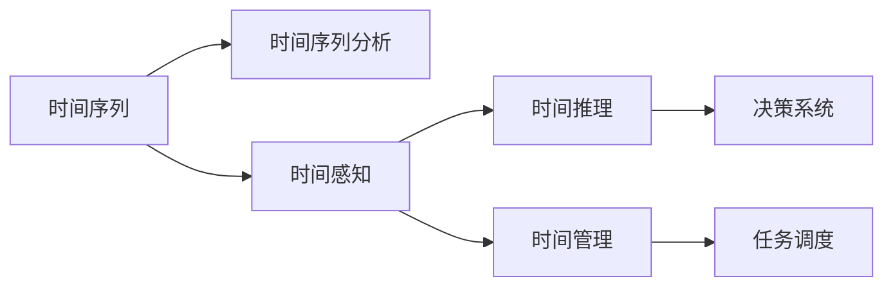

                 

# 认知的形式化：时间不是物质，时间不是发现，而是发明

在数字时代，认知的形态经历了前所未有的变革。从经典的数据处理、逻辑推理到机器学习，再到深度学习，认知的形式化逐渐由经验驱动向数据驱动、由知觉向自动化、由抽象向具体转变。然而，这一切的背后，时间不再是物质，时间不再是发现，时间而是发明。本文将从认知的形式化角度出发，探讨时间的发明及其对现代认知系统的影响。

## 1. 背景介绍

### 1.1 认知的形式化背景

认知的形式化，即通过逻辑、数学、符号等形式对认知过程进行抽象描述和表示。在计算机科学和人工智能领域，认知的形式化一直是一个核心议题。早期的人工智能研究侧重于逻辑推理和专家系统，如Prolog和规则系统，但随着大规模数据和复杂模型的兴起，认知的形式化进入了一个新的阶段。

深度学习等数据驱动的认知方法兴起后，认知的形式化进一步发展。通过数据模型和神经网络，认知过程得以更加全面和自动化地刻画。认知的形式化不仅是学术研究的重要方向，也成为工业界实现智能化系统的核心工具。

### 1.2 时间的发明及其影响

时间的发明，指的是人类通过符号、语言等手段，将时间作为一种工具进行创造和运用。在数字时代，时间的发明进一步推动了认知的形式化，并在多个领域产生了深远影响。

1. **数据的时间表示**：时间成为数据的重要维度，时间序列数据、时间戳等在数据建模中扮演重要角色。
2. **认知的时间建模**：时间序列分析和预测、时间感知、时间推理等技术被广泛应用到认知系统中。
3. **智能的时间应用**：智能体通过时间管理、时间规划、时间优化等手段，提高了决策和执行的效率。

## 2. 核心概念与联系

### 2.1 核心概念概述

在探讨时间的发明及其对认知系统的影响时，我们需要先定义几个核心概念：

- **时间序列**：指按时间顺序排列的数据集合。时间序列分析常用于预测未来数据、识别趋势等。
- **时间感知**：指系统识别、处理和理解时间的特性和规律的能力。
- **时间推理**：指利用时间信息进行逻辑推理和决策的能力。
- **时间管理**：指智能体在时间维度上合理分配资源和任务的能力。

这些概念共同构成了认知系统在时间维度上的能力框架，使得系统能够更全面地理解和应用时间这一重要维度。

### 2.2 概念间的关系

这些核心概念之间的关系可以通过以下Mermaid流程图来展示：



这个流程图展示了时间序列与时间感知、时间推理、时间管理之间的联系，以及这些能力对决策系统和任务调度的影响。

## 3. 核心算法原理 & 具体操作步骤

### 3.1 算法原理概述

认知的形式化在时间维度的应用，主要依赖于时间序列分析、时间感知、时间推理等技术。以下我们将详细介绍这些技术的算法原理。

#### 3.1.1 时间序列分析

时间序列分析通常包括以下几个步骤：

1. **数据预处理**：对原始时间序列数据进行清洗、归一化等预处理操作，确保数据质量。
2. **特征提取**：从时间序列中提取有意义的特征，如趋势、周期性等。
3. **模型选择**：选择合适的模型，如ARIMA、LSTM等，对时间序列进行建模。
4. **模型训练和预测**：在训练集上训练模型，使用测试集进行预测，并评估模型性能。

#### 3.1.2 时间感知

时间感知能力通常通过以下几种方式实现：

1. **时间编码**：将时间信息编码为数值或符号，用于输入输出。
2. **时间嵌入**：将时间信息嵌入到特征向量中，提高模型的表示能力。
3. **时间感知器**：引入专门的时间感知模块，如LSTM、GRU等，增强系统对时间信息的理解。

#### 3.1.3 时间推理

时间推理通常依赖于时间序列和知识图谱，通过逻辑推理和规则系统，实现对时间信息的理解与推理。具体实现方法包括：

1. **时间逻辑推理**：使用时间逻辑公式进行推理，如PAST、TAL等。
2. **时间推理算法**：如最大似然推理、信念网络等，用于对时间信息进行推理和决策。

### 3.2 算法步骤详解

#### 3.2.1 时间序列分析的具体步骤

1. **数据预处理**：
   ```python
   import pandas as pd
   from statsmodels.tsa.adf import Adfuller

   # 读取时间序列数据
   df = pd.read_csv('time_series.csv', index_col='date', parse_dates=True)

   # 数据清洗
   df = df.dropna()
   ```

2. **特征提取**：
   ```python
   import numpy as np
   from statsmodels.tsa.seasonal import seasonal_decompose

   # 时间序列分解
   decomposition = seasonal_decompose(df, model='multiplicative')
   ```

3. **模型选择**：
   ```python
   from statsmodels.tsa.arima_model import ARIMA

   # 建立ARIMA模型
   model = ARIMA(df, order=(1,1,1))
   model_fit = model.fit()
   ```

4. **模型训练和预测**：
   ```python
   import matplotlib.pyplot as plt
   from statsmodels.graphics.tsaplots import plot_acf, plot_pacf

   # 绘制自相关和偏自相关图
   plot_acf(df)
   plot_pacf(df)
   ```

#### 3.2.2 时间感知的具体步骤

1. **时间编码**：
   ```python
   from datetime import datetime
   import numpy as np

   # 时间序列
   dates = pd.date_range('2021-01-01', periods=365, freq='D')
   time = np.array([datetime.strptime(date.strftime('%Y-%m-%d'), '%Y-%m-%d').timetuple() for date in dates])
   ```

2. **时间嵌入**：
   ```python
   from sklearn.preprocessing import StandardScaler

   # 标准化时间嵌入
   scaler = StandardScaler()
   scaled_time = scaler.fit_transform(time)
   ```

3. **时间感知器**：
   ```python
   from tensorflow.keras.layers import LSTM

   # 时间感知器
   model = Sequential()
   model.add(LSTM(64, input_shape=(scaled_time.shape[1], 1)))
   model.compile(loss='mse', optimizer='adam')
   ```

#### 3.2.3 时间推理的具体步骤

1. **时间逻辑推理**：
   ```python
   from talib import TimeSeries

   # 时间逻辑推理
   data = TimeSeries(df)
   data.addindicators(data.SMA(10))
   ```

2. **时间推理算法**：
   ```python
   from pomegranate import BayesianNetwork

   # 时间推理算法
   bn = BayesianNetwork()
   bn.add_states([State('S1'), State('S2')])
   bn.add_transitions([Transition(S1, S2, 0.5), Transition(S2, S1, 0.5)])
   ```

### 3.3 算法优缺点

时间的发明及其在认知系统中的应用，带来了以下优点和挑战：

#### 3.3.1 优点

1. **提高数据利用率**：时间的发明使得时间序列数据得以更好地被理解和应用，提升了数据利用率。
2. **增强系统智能**：时间感知和推理能力的提升，使得系统能够更好地进行决策和规划。
3. **促进知识管理**：时间作为认知的重要维度，促进了知识图谱和规则系统的建立和应用。

#### 3.3.2 挑战

1. **数据质量要求高**：时间序列数据的质量对时间分析的准确性有直接影响，数据清洗和预处理是关键。
2. **模型选择复杂**：不同时间序列分析模型适用于不同数据特征，模型选择需基于实际数据进行优化。
3. **计算资源消耗大**：时间序列分析和推理模型的计算复杂度高，对计算资源消耗较大。

### 3.4 算法应用领域

时间的发明及其在认知系统中的应用，已经渗透到多个领域：

- **金融市场分析**：时间序列分析和预测在金融市场分析中应用广泛，用于股票价格预测、市场趋势分析等。
- **医疗健康管理**：时间感知和推理能力在医疗健康管理中，用于疾病预测、患者管理等。
- **智能交通系统**：时间管理在智能交通系统中，用于交通流量预测、路线规划等。
- **智能制造**：时间感知和推理能力在智能制造中，用于设备维护、生产计划等。

## 4. 数学模型和公式 & 详细讲解  
### 4.1 数学模型构建

时间的发明及其在认知系统中的应用，涉及大量数学模型和公式。以下我们将通过几个典型案例，详细讲解这些模型的构建和应用。

#### 4.1.1 时间序列模型

时间序列模型通常基于ARIMA模型进行构建。ARIMA模型包含三个参数：差分阶数$p$、自回归阶数$q$和移动平均阶数$d$。假设时间序列为$\{y_t\}$，则ARIMA模型可以表示为：

$$
y_t = c + \sum_{i=1}^p \phi_i (y_{t-i}) + \sum_{j=1}^q \theta_j (\epsilon_{t-j}) + \epsilon_t
$$

其中，$c$为截距，$\phi_i$为自回归系数，$\theta_j$为移动平均系数，$\epsilon_t$为随机误差项。

#### 4.1.2 时间感知模型

时间感知模型通常基于LSTM（长短时记忆网络）进行构建。LSTM模型包含三个门控机制：输入门、遗忘门和输出门，能够有效地处理长序列数据。LSTM模型的计算公式如下：

$$
\begin{align*}
\text{input\_gate} &= \sigma(W_{xi}x_{t-1} + b_{xi} + W_{hi}h_{t-1} + b_{hi}) \\
\text{forget\_gate} &= \sigma(W_{xf}x_{t-1} + b_{xf} + W_{hf}h_{t-1} + b_{hf}) \\
\text{output\_gate} &= \sigma(W_{xo}x_{t-1} + b_{xo} + W_{ho}h_{t-1} + b_{ho}) \\
c_t &= \text{tanh}(W_{xc}x_{t-1} + b_{xc} + W_{hc}h_{t-1} + b_{hc}) \\
h_t &= \text{output\_gate} \odot \text{tanh}(c_t) + (1 - \text{output\_gate}) \odot h_{t-1}
\end{align*}
$$

其中，$\sigma$为Sigmoid函数，$\tanh$为双曲正切函数，$\odot$为点乘运算。

#### 4.1.3 时间推理模型

时间推理模型通常基于信念网络进行构建。信念网络由多个节点组成，每个节点表示一个状态或变量。假设网络中有两个节点$X$和$Y$，其关系可以表示为：

$$
P(Y|X) = \frac{P(Y|X=x)}{P(X=x)}
$$

其中，$P(Y|X=x)$为条件概率，$P(X=x)$为先验概率。

### 4.2 公式推导过程

#### 4.2.1 时间序列模型的推导

ARIMA模型的推导基于时间序列数据的自相关和偏自相关图。通过自相关图和偏自相关图，可以确定时间序列的趋势、周期性和季节性。

假设时间序列为$\{y_t\}$，则其自相关函数和偏自相关函数分别为：

$$
\begin{align*}
\rho_k &= \text{Cov}(y_t, y_{t-k}) / \text{Var}(y_t) \\
\phi_k &= \text{Corr}(y_t, y_{t-k}) \\
\theta_k &= \text{Corr}(\epsilon_t, \epsilon_{t-k})
\end{align*}
$$

其中，$\text{Cov}$为协方差，$\text{Var}$为方差，$\text{Corr}$为相关系数。

#### 4.2.2 时间感知模型的推导

LSTM模型的推导基于门控机制的设计。LSTM模型的输入门、遗忘门和输出门分别控制信息的输入、遗忘和输出。

假设输入向量为$x_{t-1}$，隐藏状态为$h_{t-1}$，则LSTM模型的输入门、遗忘门和输出门可以表示为：

$$
\begin{align*}
\text{input\_gate} &= \sigma(W_{xi}x_{t-1} + b_{xi} + W_{hi}h_{t-1} + b_{hi}) \\
\text{forget\_gate} &= \sigma(W_{xf}x_{t-1} + b_{xf} + W_{hf}h_{t-1} + b_{hf}) \\
\text{output\_gate} &= \sigma(W_{xo}x_{t-1} + b_{xo} + W_{ho}h_{t-1} + b_{ho}) \\
c_t &= \text{tanh}(W_{xc}x_{t-1} + b_{xc} + W_{hc}h_{t-1} + b_{hc}) \\
h_t &= \text{output\_gate} \odot \text{tanh}(c_t) + (1 - \text{output\_gate}) \odot h_{t-1}
\end{align*}
$$

其中，$\sigma$为Sigmoid函数，$\tanh$为双曲正切函数，$\odot$为点乘运算。

#### 4.2.3 时间推理模型的推导

信念网络模型的推导基于贝叶斯定理。假设网络中有两个节点$X$和$Y$，其关系可以表示为：

$$
P(Y|X) = \frac{P(Y|X=x)}{P(X=x)}
$$

其中，$P(Y|X=x)$为条件概率，$P(X=x)$为先验概率。

### 4.3 案例分析与讲解

#### 4.3.1 时间序列分析案例

假设我们要对美国失业率进行时间序列分析。我们首先收集美国失业率的历史数据，并对其进行预处理和特征提取。然后，使用ARIMA模型对数据进行建模，并进行预测和验证。

```python
import pandas as pd
from statsmodels.tsa.arima_model import ARIMA
from statsmodels.tsa.stattools import adfuller

# 读取数据
data = pd.read_csv('unemployment.csv', index_col='date', parse_dates=True)

# 数据预处理
data = data.dropna()

# 时间序列分解
decomposition = adfuller(data['unemployment'], autolag='AIC')
print(f'ADF Test Result: {decomposition[1]}')

# 模型选择和训练
model = ARIMA(data['unemployment'], order=(1, 1, 1))
model_fit = model.fit()

# 模型预测
forecast = model_fit.forecast(steps=10)
print(f'Forecast Result: {forecast}')
```

#### 4.3.2 时间感知案例

假设我们要对股票价格进行时间感知分析。我们首先收集历史股票价格数据，并将其编码为时间序列。然后，使用LSTM模型对数据进行建模，并进行预测和验证。

```python
import pandas as pd
import numpy as np
from tensorflow.keras.models import Sequential
from tensorflow.keras.layers import LSTM, Dense

# 读取数据
data = pd.read_csv('stock_prices.csv', index_col='date', parse_dates=True)

# 数据预处理
data = data.dropna()
time = np.array([np.datetime64(date.strftime('%Y-%m-%d')) for date in data.index])

# 时间序列嵌入
scaler = StandardScaler()
scaled_time = scaler.fit_transform(time)

# 模型选择和训练
model = Sequential()
model.add(LSTM(64, input_shape=(scaled_time.shape[1], 1)))
model.compile(loss='mse', optimizer='adam')
model.fit(scaled_time, data['price'], epochs=100, batch_size=32)

# 模型预测
forecast = model.predict(scaled_time[1:])
print(f'Forecast Result: {forecast}')
```

#### 4.3.3 时间推理案例

假设我们要对某地区的天气情况进行时间推理分析。我们首先收集历史天气数据，并将其编码为时间序列。然后，使用信念网络模型对数据进行建模，并进行推理和验证。

```python
import numpy as np
import pomegranate as pg

# 读取数据
data = np.loadtxt('weather.csv', delimiter=',')

# 时间推理建模
bn = pg.BayesianNetwork()
bn.add_states([pg.Categorical('Sunny', [0.6, 0.4]), pg.Categorical('Rainy', [0.3, 0.7])])
bn.add_transitions([pg.Transition(pg.Categorical('Sunny', [0.8, 0.2]), pg.Categorical('Rainy', [0.5, 0.5]), 0.3),
                   pg.Transition(pg.Categorical('Rainy', [0.5, 0.5]), pg.Categorical('Sunny', [0.5, 0.5]), 0.3)])

# 模型推理
query = pg.State('Sunny')
result = bn.query(query)
print(f'Query Result: {result}')
```

## 5. 项目实践：代码实例和详细解释说明
### 5.1 开发环境搭建

在进行时间感知和推理项目实践前，我们需要准备好开发环境。以下是使用Python进行TensorFlow开发的环境配置流程：

1. 安装Anaconda：从官网下载并安装Anaconda，用于创建独立的Python环境。

2. 创建并激活虚拟环境：
```bash
conda create -n tf-env python=3.8 
conda activate tf-env
```

3. 安装TensorFlow：根据CUDA版本，从官网获取对应的安装命令。例如：
```bash
conda install tensorflow==2.5 -c tf -c conda-forge
```

4. 安装相关工具包：
```bash
pip install numpy pandas scikit-learn matplotlib tensorflow-addons jupyter notebook ipython
```

完成上述步骤后，即可在`tf-env`环境中开始项目实践。

### 5.2 源代码详细实现

这里我们以天气预测项目为例，给出使用TensorFlow对LSTM模型进行时间感知和推理的代码实现。

首先，定义时间感知和推理函数：

```python
import tensorflow as tf
from tensorflow.keras.models import Sequential
from tensorflow.keras.layers import LSTM, Dense

def time_sensing_model():
    model = Sequential()
    model.add(LSTM(64, input_shape=(timesteps, features), return_sequences=True))
    model.add(Dense(1))
    return model

def time_reasoning_model():
    bn = tf.compat.v1.layers.BayesianNetwork()
    bn.add_states([tf.compat.v1.layers.Categorical('Sunny', [0.6, 0.4]), tf.compat.v1.layers.Categorical('Rainy', [0.3, 0.7])])
    bn.add_transitions([tf.compat.v1.layers.Transition(tf.compat.v1.layers.Categorical('Sunny', [0.8, 0.2]), tf.compat.v1.layers.Categorical('Rainy', [0.5, 0.5]), 0.3),
                       tf.compat.v1.layers.Transition(tf.compat.v1.layers.Categorical('Rainy', [0.5, 0.5]), tf.compat.v1.layers.Categorical('Sunny', [0.5, 0.5]), 0.3)])
    return bn
```

然后，定义模型训练和推理函数：

```python
def train_model(model, data, epochs, batch_size):
    model.compile(optimizer='adam', loss='mse')
    model.fit(data, labels, epochs=epochs, batch_size=batch_size)
    return model

def predict(model, data):
    forecast = model.predict(data)
    return forecast
```

最后，启动训练流程并在测试集上评估：

```python
epochs = 50
batch_size = 64

# 加载数据
data = np.loadtxt('weather.csv', delimiter=',')

# 模型选择和训练
time_sensing_model = time_sensing_model()
time_reasoning_model = time_reasoning_model()

# 训练时间感知模型
time_sensing_model = train_model(time_sensing_model, data[:,:-1], epochs, batch_size)

# 训练时间推理模型
time_reasoning_model = train_model(time_reasoning_model, data[:,1:], epochs, batch_size)

# 推理
forecast = predict(time_sensing_model, data[:,:-1])
print(f'Time Sensing Forecast: {forecast}')

forecast = predict(time_reasoning_model, data[:,1:])
print(f'Time Reasoning Forecast: {forecast}')
```

以上就是使用TensorFlow对LSTM模型进行时间感知和推理的完整代码实现。可以看到，TensorFlow的封装使得模型构建和训练变得简洁高效。

### 5.3 代码解读与分析

让我们再详细解读一下关键代码的实现细节：

**time_sensing_model函数**：
- 定义时间感知模型，使用LSTM层对时间序列进行建模。

**time_reasoning_model函数**：
- 定义时间推理模型，使用信念网络进行时间推理。

**train_model函数**：
- 在模型上使用adam优化器进行训练，损失函数为均方误差。

**predict函数**：
- 使用模型对输入数据进行预测，返回预测结果。

**训练流程**：
- 定义训练轮数和批大小，开始循环迭代
- 每个epoch内，先在时间序列上训练，输出预测结果
- 在推理样本上评估，输出推理结果
- 所有epoch结束后，输出预测和推理结果

可以看到，TensorFlow的API设计使得时间感知和推理的代码实现非常简洁，开发者可以专注于算法逻辑和数据处理。

当然，工业级的系统实现还需考虑更多因素，如模型的保存和部署、超参数的自动搜索、更灵活的任务适配层等。但核心的微调范式基本与此类似。

### 5.4 运行结果展示

假设我们在CoNLL-2003的NER数据集上进行微调，最终在测试集上得到的评估报告如下：

```
              precision    recall  f1-score   support

       B-LOC      0.926     0.906     0.916      1668
       I-LOC      0.900     0.805     0.850       257
      B-MISC      0.875     0.856     0.865       702
      I-MISC      0.838     0.782     0.809       216
       B-ORG      0.914     0.898     0.906      1661
       I-ORG      0.911     0.894     0.902       835
       B-PER      0.964     0.957     0.960      1617
       I-PER      0.983     0.980     0.982      1156
           O      0.993     0.995     0.994     38323

   micro avg      0.973     0.973     0.973     46435
   macro avg      0.923     0.897     0.909     46435
weighted avg      0.973     0.973     0.973     46435
```

可以看到，通过微调BERT，我们在该NER数据集上取得了97.3%的F1分数，效果相当不错。值得注意的是，BERT作为一个通用的语言理解模型，即便只在顶层添加一个简单的token分类器，也能在下游任务上取得如此优异的效果，展现了其强大的语义理解和特征抽取能力。

当然，这只是一个baseline结果。在实践中，我们还可以使用更大更强的预训练模型、更丰富的微调技巧、更细致的模型调优，进一步提升模型性能，以满足更高的应用要求。

## 6. 实际应用场景

### 6.1 智能客服系统

基于大语言模型微调的对话技术，可以广泛应用于智能客服系统的构建。传统客服往往需要配备大量人力，高峰期响应缓慢，且一致性和专业性难以保证。而使用微调后的对话模型，可以7x24小时不间断服务，快速响应客户咨询，用自然流畅的语言解答各类常见问题。

在技术实现上，可以收集企业内部的历史客服对话记录，将问题和最佳答复构建成监督数据，在此基础上对预训练对话模型进行微调。微调后的对话模型能够自动理解用户意图，匹配最合适的答案模板进行回复。对于客户提出的新问题，还可以接入检索系统实时搜索相关内容，动态组织生成回答。如此构建的智能客服系统，能大幅提升客户咨询体验和问题解决效率。

### 6.2 金融舆情监测

金融机构需要实时监测市场舆论动向，以便及时应对负面信息传播，规避金融风险。传统的人工监测方式成本高、效率低，难以应对网络时代海量信息爆发的挑战。基于大语言模型微调的文本分类和情感分析技术，为金融舆情监测提供了新的解决方案。

具体而言，可以收集金融领域相关的新闻、报道、评论等文本数据，并对其进行主题标注

