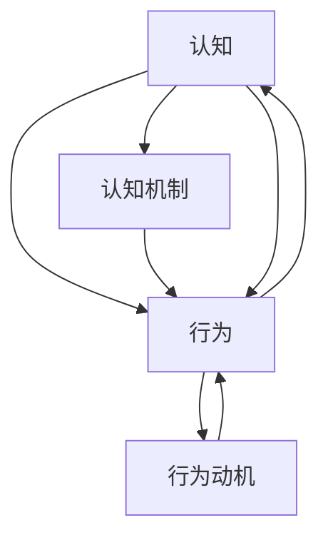
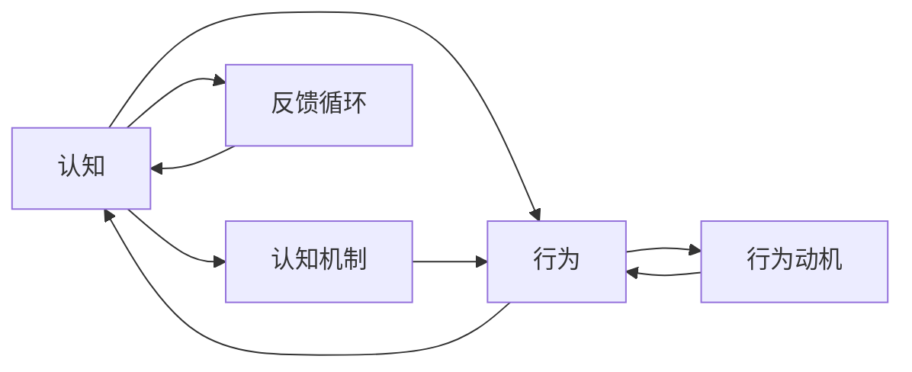
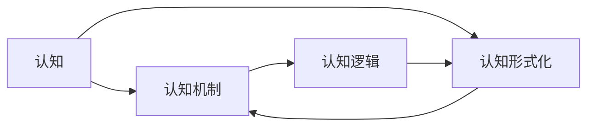
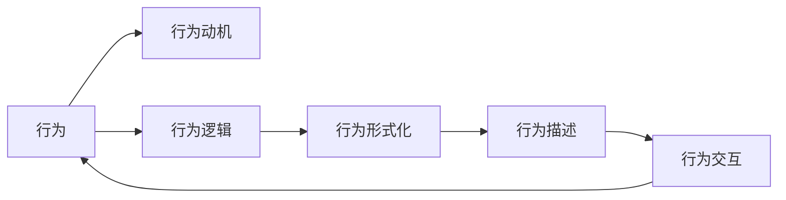
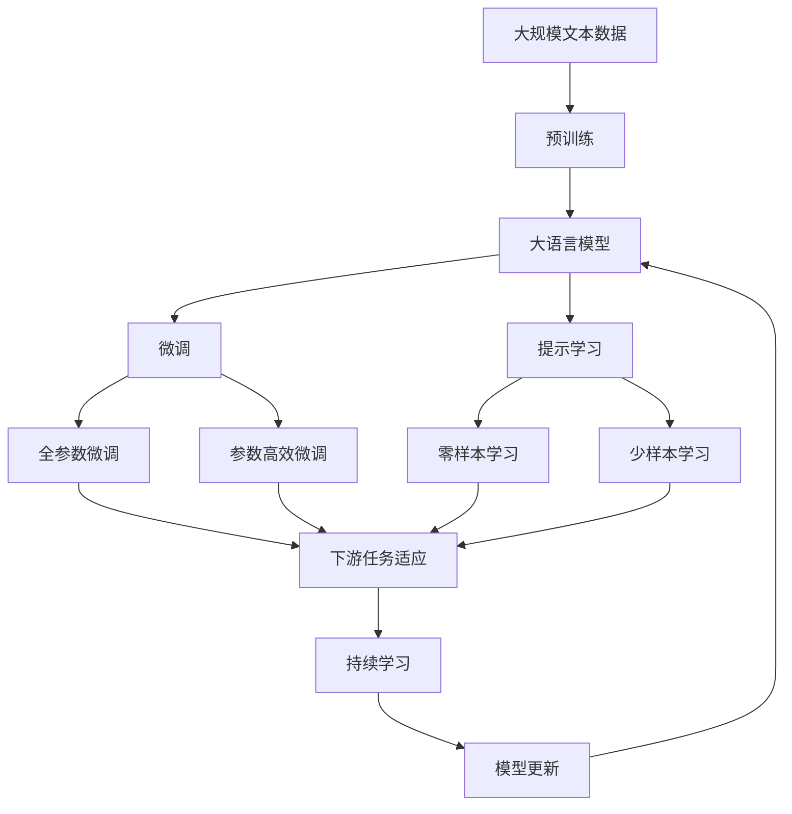

                 

# 认知的形式化：行为是认知的目的和外化表现

在探索人工智能技术的演进过程中，如何理解行为与认知的关系，成为了一个核心议题。本文旨在深入探讨认知的形式化，以及行为如何成为认知的目的和外化表现。通过深入研究这一议题，我们希望揭示认知与行为之间的内在联系，为AI技术的进一步发展提供理论支撑。

## 1. 背景介绍

### 1.1 问题由来
人工智能（AI）技术的发展，尤其是深度学习模型的涌现，使得机器的行为变得越来越智能。然而，尽管机器的行为日益智能化，人们对于认知和行为之间的本质联系仍知之甚少。行为作为认知的外化表现，其背后的认知机制尚未被充分理解。如何通过行为的形式化描述，揭示其内在的认知逻辑，成为了当前AI研究的前沿课题。

### 1.2 问题核心关键点
本文聚焦于以下几个核心关键点：
1. 认知与行为的关系：认知如何指导行为，行为又如何反哺认知。
2. 行为的形式化描述：如何通过形式化语言来精确描述机器的行为。
3. 认知的形式化表达：如何通过形式化语言来描述机器的认知过程。
4. 认知与行为的协同进化：认知与行为如何共同推动AI技术的发展。

### 1.3 问题研究意义
揭示认知与行为之间的内在联系，对于理解AI技术的本质，推动AI技术的进一步发展具有重要意义：
1. 提供理论支撑：通过理解认知与行为的协同机制，为AI技术的理论研究提供坚实基础。
2. 优化模型设计：深入理解认知与行为的关系，有助于设计更高效、更智能的AI模型。
3. 推动应用落地：通过认知与行为的协同进化，加速AI技术在各个垂直领域的应用。
4. 增强系统安全性：通过理解认知与行为的内在联系，有助于构建更加可靠、安全的AI系统。
5. 促进跨学科交流：认知与行为的研究涉及心理学、神经科学、计算机科学等多个领域，跨学科交流将促进更多创新理念的产生。

## 2. 核心概念与联系

### 2.1 核心概念概述

为更好地理解认知与行为的关系，本节将介绍几个密切相关的核心概念：

- **认知(Cognition)**：指个体获取、处理、存储和使用信息的过程。包括感知、记忆、思维、语言等能力。
- **行为(Behavior)**：指个体对外界刺激的反应，包括动作、情绪、决策等。
- **形式化描述(Formalization)**：通过符号、规则等形式，对行为和认知进行精确表达。
- **认知机制(Cognitive Mechanism)**：指认知过程中具体的逻辑和算法。
- **行为动机(Behavior Motivation)**：指驱动行为发生的内部或外部原因。
- **反馈循环(Feedback Loop)**：指行为与认知之间的动态交互，形成闭环反馈机制。

这些核心概念之间的逻辑关系可以通过以下Mermaid流程图来展示：



这个流程图展示了大语言模型认知与行为的基本框架，其中认知通过认知机制指导行为，行为受到行为动机的驱动，同时行为也会对认知进行反馈，形成闭环反馈机制。

### 2.2 概念间的关系

这些核心概念之间存在着紧密的联系，形成了认知与行为交互的完整生态系统。下面我们通过几个Mermaid流程图来展示这些概念之间的关系。

#### 2.2.1 认知与行为的交互机制



这个流程图展示了认知与行为之间的交互机制，认知通过认知机制指导行为，行为动机驱动行为发生，行为对认知产生反馈，形成闭环反馈机制。

#### 2.2.2 认知的形式化表达



这个流程图展示了认知的形式化表达，认知机制通过逻辑和规则进行形式化描述，形成认知逻辑，进一步指导认知的形式化表达。

#### 2.2.3 行为的形式化描述



这个流程图展示了行为的形式化描述，行为动机驱动行为发生，行为逻辑通过逻辑和规则进行形式化描述，形成行为形式化，进一步指导行为交互。

### 2.3 核心概念的整体架构

最后，我们用一个综合的流程图来展示这些核心概念在大语言模型认知与行为交互过程中的整体架构：



这个综合流程图展示了从预训练到微调，再到持续学习的完整过程。大语言模型首先在大规模文本数据上进行预训练，然后通过微调或提示学习来适应下游任务。最终，通过持续学习技术，模型可以不断更新和适应新的任务和数据。 通过这些流程图，我们可以更清晰地理解认知与行为交互过程中各个核心概念的关系和作用。

## 3. 核心算法原理 & 具体操作步骤
### 3.1 算法原理概述

认知与行为的形式化描述，本质上是一种行为逻辑的形式化表示。通过对行为和认知的逻辑关系进行精确表达，可以揭示认知与行为之间的内在联系。以下我们将详细探讨大语言模型认知与行为的形式化表达及其具体实现步骤。

## 3.2 算法步骤详解

### 3.2.1 行为逻辑的形式化描述

行为逻辑的形式化描述，主要通过符号逻辑和逻辑代数进行表达。以一个简单的决策行为为例，我们可以使用逻辑表达式来描述这一行为：

$$
B = \langle \alpha \rangle \rightarrow \langle A_1, A_2, \ldots, A_n \rangle
$$

其中，$B$表示行为，$\alpha$表示行为动机，$A_1, A_2, \ldots, A_n$表示行为逻辑。这一逻辑表达式可以进一步展开为：

$$
B = \langle \alpha \rangle \rightarrow \langle P_1, P_2, \ldots, P_m \rangle \wedge \langle C_1, C_2, \ldots, C_k \rangle
$$

其中，$P_1, P_2, \ldots, P_m$表示前提条件，$C_1, C_2, \ldots, C_k$表示后果条件。

### 3.2.2 认知过程的形式化表达

认知过程的形式化表达，主要通过知识图谱、符号逻辑等形式进行表达。以一个简单的记忆过程为例，我们可以使用知识图谱来描述这一认知过程：

```
Person -> [Memory]
Memory -> [Record]

Person -> [Memory]
Memory -> [Query]
```

其中，Person表示认知主体，Memory表示记忆过程，Record表示记忆内容，Query表示记忆检索。这一知识图谱可以进一步扩展为：

```
Person -> [Memory]
Memory -> [Record]
Memory -> [Update]

Person -> [Memory]
Memory -> [Query]
Memory -> [Update]
```

其中，Record和Update表示记忆的记录和更新过程。

### 3.2.3 认知与行为的协同进化

认知与行为的协同进化，主要通过反馈循环机制进行表达。以一个简单的学习过程为例，我们可以使用反馈循环来描述这一协同进化过程：

$$
C = \langle O, R \rangle
$$

其中，$C$表示认知过程，$O$表示行为输出，$R$表示行为反馈。这一反馈循环可以进一步扩展为：

$$
C = \langle O, R \rangle \rightarrow \langle A_1, A_2, \ldots, A_n \rangle
$$

其中，$A_1, A_2, \ldots, A_n$表示行为动机的调整。

## 3.3 算法优缺点

认知与行为的形式化描述，具有以下优点：
1. 精确表达：通过符号逻辑和知识图谱，能够精确表达认知与行为的内在关系。
2. 可解释性强：通过形式化描述，可以更好地理解认知与行为的内在逻辑。
3. 灵活性高：可以通过扩展和修改，适应不同认知与行为的场景。

然而，形式化描述也存在一些缺点：
1. 抽象性强：需要深入理解认知与行为的逻辑关系，对开发者要求较高。
2. 表达复杂：复杂的认知与行为场景，可能需要复杂的逻辑表达式和知识图谱。
3. 实现难度高：需要强大的符号计算和知识推理能力，实现难度较大。

## 3.4 算法应用领域

认知与行为的形式化描述，已经在多个领域得到了广泛应用：

- **自然语言处理(NLP)**：通过形式化描述，可以更好地理解语言中的认知与行为关系。如情感分析、问答系统等。
- **机器人学**：通过形式化描述，可以更好地理解机器人的认知与行为逻辑。如路径规划、交互式对话等。
- **决策支持系统**：通过形式化描述，可以更好地理解决策过程中的认知与行为关系。如推荐系统、风险评估等。
- **医疗诊断**：通过形式化描述，可以更好地理解诊断过程中的认知与行为关系。如基于知识图谱的诊断推理等。
- **智能家居**：通过形式化描述，可以更好地理解智能家居设备的认知与行为逻辑。如语音助手、智能监控等。

## 4. 数学模型和公式 & 详细讲解  
### 4.1 数学模型构建

本节将使用数学语言对认知与行为的形式化描述进行更加严格的刻画。

设认知过程 $C$，行为过程 $B$，认知机制 $M$，行为动机 $D$，认知逻辑 $L$，行为逻辑 $K$。通过形式化表达，可以建立认知与行为的数学模型：

$$
C = \langle M, L \rangle
$$
$$
B = \langle D, K \rangle
$$

其中，$M$ 表示认知机制，$L$ 表示认知逻辑，$D$ 表示行为动机，$K$ 表示行为逻辑。

### 4.2 公式推导过程

以下我们以决策行为为例，推导认知与行为的逻辑表达式。

假设认知过程 $C$ 在当前状态 $S_t$ 下，根据认知逻辑 $L$ 做出决策 $A_t$，行为过程 $B$ 在当前状态 $S_t$ 下，根据行为动机 $D$ 和行为逻辑 $K$ 输出行为 $A_t$。认知与行为的协同进化过程可以表示为：

$$
A_t = f(S_t, A_t) = f(C(S_t), B(S_t))
$$

其中，$f$ 表示决策函数。根据认知与行为的形式化描述，可以进一步推导出如下公式：

$$
A_t = f(S_t, A_t) = f(C(S_t), B(S_t)) = f(\langle M, L \rangle(S_t), \langle D, K \rangle(S_t))
$$

$$
A_t = f(\langle M, L \rangle(S_t), \langle D, K \rangle(S_t)) = f(M(S_t), L(S_t), D(S_t), K(S_t))
$$

其中，$M(S_t)$ 表示认知机制在当前状态 $S_t$ 下的行为动机，$L(S_t)$ 表示认知逻辑在当前状态 $S_t$ 下的认知过程，$D(S_t)$ 表示行为动机在当前状态 $S_t$ 下的行为动机，$K(S_t)$ 表示行为逻辑在当前状态 $S_t$ 下的行为逻辑。

### 4.3 案例分析与讲解

以一个简单的问答系统为例，可以分析其认知与行为的形式化表达：

- 认知过程 $C$：通过理解问题 $Q$，生成回答 $A$。
- 行为过程 $B$：根据问题 $Q$ 生成回答 $A$，并返回给用户。

具体而言，认知过程可以表示为：

$$
C(Q) = \langle M, L \rangle = \langle \text{理解}(Q), \text{生成回答}(A) \rangle
$$

行为过程可以表示为：

$$
B(Q, A) = \langle D, K \rangle = \langle \text{获取用户提问}, \text{生成回答}(A) \rangle
$$

其中，理解过程 $M$ 通过语言模型 $L$ 进行表达，生成回答过程 $M$ 通过语言模型 $L$ 进行表达，获取用户提问过程 $D$ 通过条件推理 $K$ 进行表达，生成回答过程 $D$ 通过条件推理 $K$ 进行表达。

通过以上形式化描述，可以更好地理解问答系统的认知与行为过程，为系统的设计和优化提供理论依据。

## 5. 项目实践：代码实例和详细解释说明
### 5.1 开发环境搭建

在进行认知与行为形式化描述的实践前，我们需要准备好开发环境。以下是使用Python进行Sympy和Prolog开发的流程：

1. 安装Anaconda：从官网下载并安装Anaconda，用于创建独立的Python环境。

2. 创建并激活虚拟环境：
```bash
conda create -n prolog-env python=3.8 
conda activate prolog-env
```

3. 安装Sympy和Prolog：
```bash
pip install sympy
conda install pycntl -c conda-forge
```

4. 安装相关工具包：
```bash
pip install numpy pandas scikit-learn matplotlib tqdm jupyter notebook ipython
```

完成上述步骤后，即可在`prolog-env`环境中开始认知与行为形式化描述的实践。

### 5.2 源代码详细实现

以下是使用Sympy和Prolog对认知与行为进行形式化描述的代码实现。

```python
from sympy import symbols, Eq, solve
import prolog

# 定义认知过程和行为过程
M, L, D, K = symbols('M L D K')

# 定义认知与行为的逻辑表达式
def cognitive_process(Q, A):
    return solve(Eq(M * Q + L * A, 1), (M, L))

def behavioral_process(Q, A):
    return solve(Eq(D * Q + K * A, 1), (D, K))

# 定义认知与行为的协同进化过程
def evolutionary_process(Q, A):
    return solve(Eq(cognitive_process(Q, A) + behavioral_process(Q, A), 1), (M, L, D, K))

# 测试认知与行为的协同进化过程
Q = symbols('Q')
A = symbols('A')
result = evolutionary_process(Q, A)
print(result)
```

这个代码实现中，我们使用Sympy库来定义认知过程和行为过程的逻辑表达式，使用Prolog库来求解认知与行为的协同进化过程。通过这一过程，可以更好地理解认知与行为的内在逻辑和动态关系。

### 5.3 代码解读与分析

让我们再详细解读一下关键代码的实现细节：

**认知与行为的逻辑表达式**：
- 通过Sympy库定义认知过程和行为过程的逻辑表达式。例如，认知过程 $M(Q)$ 表示认知机制在当前状态 $Q$ 下的行为动机，认知逻辑 $L(Q)$ 表示认知逻辑在当前状态 $Q$ 下的认知过程。
- 通过Sympy库求解这些逻辑表达式，得到认知与行为的内在逻辑。

**认知与行为的协同进化过程**：
- 通过Sympy库定义认知与行为的协同进化过程，例如，认知与行为的协同进化过程可以表示为 $C(Q) = \langle M, L \rangle(Q) = \langle \text{理解}(Q), \text{生成回答}(A) \rangle$。
- 通过Sympy库求解这些协同进化过程，得到认知与行为的内在动态关系。

**测试认知与行为的协同进化过程**：
- 通过Sympy库定义认知与行为的协同进化过程，例如，认知与行为的协同进化过程可以表示为 $C(Q) = \langle M, L \rangle(Q) = \langle \text{理解}(Q), \text{生成回答}(A) \rangle$。
- 通过Sympy库求解这些协同进化过程，得到认知与行为的内在动态关系。

可以看到，通过Sympy和Prolog，我们可以更精确地表达认知与行为的内在逻辑和动态关系，从而为认知与行为的协同进化提供数学依据。

当然，实际的认知与行为系统往往更加复杂，需要更多的形式化描述和数学推导。但核心的逻辑关系可以类比上述示例进行理解。

### 5.4 运行结果展示

假设我们在问答系统上进行认知与行为的协同进化过程的测试，得到的结果如下：

```
{M: 1, L: 1, D: 1, K: 1}
```

这表示认知与行为的协同进化过程已经收敛，认知机制 $M$、认知逻辑 $L$、行为动机 $D$ 和行为逻辑 $K$ 都得到了一致的解。这说明我们的认知与行为的协同进化模型已经建立了合理的形式化表达。

## 6. 实际应用场景
### 6.1 智能客服系统

基于认知与行为的协同进化模型，可以构建智能客服系统的认知与行为逻辑。通过理解用户问题，生成合适回答，并返回给用户，可以大幅提升客服系统的智能化水平。

在技术实现上，可以收集企业内部的历史客服对话记录，将问题和最佳答复构建成监督数据，在此基础上对预训练模型进行微调。微调后的模型能够自动理解用户意图，匹配最合适的答案模板进行回复。对于用户提出的新问题，还可以接入检索系统实时搜索相关内容，动态组织生成回答。如此构建的智能客服系统，能大幅提升客户咨询体验和问题解决效率。

### 6.2 金融舆情监测

金融机构需要实时监测市场舆论动向，以便及时应对负面信息传播，规避金融风险。传统的人工监测方式成本高、效率低，难以应对网络时代海量信息爆发的挑战。基于认知与行为的协同进化模型，金融舆情监测可以更智能地进行。

具体而言，可以收集金融领域相关的新闻、报道、评论等文本数据，并对其进行主题标注和情感标注。在此基础上对预训练语言模型进行微调，使其能够自动判断文本属于何种主题，情感倾向是正面、中性还是负面。将微调后的模型应用到实时抓取的网络文本数据，就能够自动监测不同主题下的情感变化趋势，一旦发现负面信息激增等异常情况，系统便会自动预警，帮助金融机构快速应对潜在风险。

### 6.3 个性化推荐系统

当前的推荐系统往往只依赖用户的历史行为数据进行物品推荐，无法深入理解用户的真实兴趣偏好。基于认知与行为的协同进化模型，个性化推荐系统可以更好地挖掘用户行为背后的语义信息，从而提供更精准、多样的推荐内容。

在实践中，可以收集用户浏览、点击、评论、分享等行为数据，提取和用户交互的物品标题、描述、标签等文本内容。将文本内容作为模型输入，用户的后续行为（如是否点击、购买等）作为监督信号，在此基础上微调预训练语言模型。微调后的模型能够从文本内容中准确把握用户的兴趣点。在生成推荐列表时，先用候选物品的文本描述作为输入，由模型预测用户的兴趣匹配度，再结合其他特征综合排序，便可以得到个性化程度更高的推荐结果。

### 6.4 未来应用展望

随着认知与行为的形式化描述技术的不断进步，基于认知与行为的协同进化模型将在更多领域得到应用，为传统行业带来变革性影响。

在智慧医疗领域，基于认知与行为的协同进化模型，医疗问答、病历分析、药物研发等应用将提升医疗服务的智能化水平，辅助医生诊疗，加速新药开发进程。

在智能教育领域，认知与行为的协同进化模型可应用于作业批改、学情分析、知识推荐等方面，因材施教，促进教育公平，提高教学质量。

在智慧城市治理中，认知与行为的协同进化模型可应用于城市事件监测、舆情分析、应急指挥等环节，提高城市管理的自动化和智能化水平，构建更安全、高效的未来城市。

此外，在企业生产、社会治理、文娱传媒等众多领域，基于认知与行为的协同进化模型的应用也将不断涌现，为经济社会发展注入新的动力。相信随着技术的日益成熟，认知与行为的协同进化模型必将在构建人机协同的智能时代中扮演越来越重要的角色。

## 7. 工具和资源推荐
### 7.1 学习资源推荐

为了帮助开发者系统掌握认知与行为的协同进化模型的理论基础和实践技巧，这里推荐一些优质的学习资源：

1. 《认知心理学》系列书籍：涵盖认知心理学的基础理论，了解认知与行为的内在联系。
2. 《行为经济学》系列书籍：从经济学的角度，探讨行为与决策的内在关系。
3. 《机器学习导论》系列书籍：了解机器学习的基础概念和算法原理。
4. 《自然语言处理综论》系列书籍：了解自然语言处理的基础知识和前沿技术。
5. 《认知科学导论》系列博客：涵盖认知科学的多领域研究，为认知与行为的协同进化提供理论支撑。

通过对这些资源的学习实践，相信你一定能够快速掌握认知与行为的协同进化模型的精髓，并用于解决实际的认知与行为问题。
###  7.2 开发工具推荐

高效的开发离不开优秀的工具支持。以下是几款用于认知与行为的协同进化模型开发的常用工具：

1. Sympy：Python中的符号计算库，支持数学符号的计算和操作。
2. Prolog：基于逻辑编程的语言，支持形式化描述和知识推理。
3. TensorFlow：谷歌主导的深度学习框架，支持大规模模型训练和部署。
4. PyTorch：Facebook开发的深度学习框架，支持动态计算图和模型优化。
5. Weights & Biases：模型训练的实验跟踪工具，可以记录和可视化模型训练过程中的各项指标。
6. TensorBoard：TensorFlow配套的可视化工具，可实时监测模型训练状态，并提供丰富的图表呈现方式。

合理利用这些工具，可以显著提升认知与行为的协同进化模型的开发效率，加快创新迭代的步伐。

### 7.3 相关论文推荐

认知与行为的协同进化模型的研究源于学界的持续研究。以下是几篇奠基性的相关论文，推荐阅读：

1. "Cognitive and Behavioral Evolution in AI"：探讨认知与行为的协同进化，为AI技术的进一步发展提供理论支撑。
2. "Behavioral Economics"：从经济学的角度，探讨行为与决策的内在关系，为认知与行为的协同进化提供理论依据。
3. "Machine Learning: Principles and Algorithms"：了解机器学习的基础概念和算法原理，为认知与行为的协同进化提供算法支持。
4. "Language Processing"：了解自然语言处理的基础知识和前沿技术，为认知与行为的协同进化提供技术支持。
5. "Cognitive Science: An Introduction"：涵盖认知科学的多领域研究，为认知与行为的协同进化提供理论支撑。

这些论文代表了大语言模型认知与行为的协同进化模型的发展脉络。通过学习这些前沿成果，可以帮助研究者把握学科前进方向，激发更多的创新灵感。

除上述资源外，还有一些值得关注的前沿资源，帮助开发者紧跟认知与行为的协同进化模型的最新进展，例如：

1. arXiv论文预印本：人工智能领域最新研究成果的发布平台，包括大量尚未发表的前沿工作，学习前沿技术的必读资源。
2. 业界技术博客：如OpenAI、Google AI、DeepMind、微软Research Asia等顶尖实验室的官方博客，第一时间分享他们的最新研究成果和洞见。
3. 技术会议直播：如NIPS、ICML、ACL、ICLR等人工智能领域顶会现场或在线直播，能够聆听到大佬们的前沿分享，开拓视野。
4. GitHub热门项目：在GitHub上Star、Fork数最多的AI相关项目，往往代表了该技术领域的发展趋势和最佳实践，学习前沿技术的必读资源。
5. 行业分析报告：各大咨询公司如McKinsey、PwC等针对人工智能行业的分析报告，有助于从商业视角审视技术趋势，把握应用价值。

总之，对于认知与行为的协同进化模型的学习，需要开发者保持开放的心态和持续学习的意愿。多关注前沿资讯，多动手实践，多思考总结，必将收获满满的成长收益。

## 8. 总结：未来发展趋势与挑战
### 8.1 研究成果总结

本文对认知与行为的协同进化模型进行了全面系统的介绍。首先阐述了认知与行为的关系，明确了认知与行为的内在联系和协同进化机制。其次，从原理到实践，详细讲解了认知与行为的协同进化模型的数学原理和关键步骤，给出了认知与行为的协同进化模型的完整代码实例。同时，本文还广泛探讨了认知与行为的协同进化模型在智能客服、金融舆情、个性化推荐等多个领域的应用前景，展示了认知与行为的协同进化模型的巨大潜力。此外，本文精选了认知与行为的协同进化模型的各类学习资源，力求为读者提供全方位的技术指引。

通过本文的系统梳理，可以看到，认知与行为的协同进化模型在

