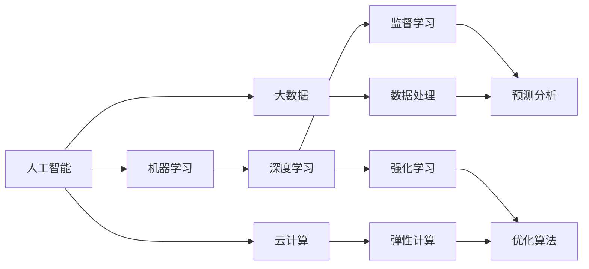

                 

# 跟踪研究和分析科技行业的发展趋势，为公司在技术创新和科技发展方面的决策提供支持

> 关键词：科技发展趋势, 技术创新, 人工智能(AI), 机器学习(ML), 大数据(Big Data), 云计算(Cloud Computing), 区块链(Blockchain), 量子计算(Quantum Computing), 物联网(IoT)

## 1. 背景介绍

### 1.1 问题由来
随着科技行业的快速发展，企业在技术创新和科技发展方面面临着前所未有的机遇与挑战。如何及时了解科技领域的最新动态，把握未来发展趋势，成为企业制定战略决策的关键。本文旨在通过对科技行业的深度跟踪研究与分析，为公司在技术创新和科技发展方面的决策提供有力支持。

### 1.2 问题核心关键点
科技行业的发展趋势涉及多个领域，包括但不限于人工智能、机器学习、大数据、云计算、区块链、量子计算、物联网等。企业需要从整体上理解和评估这些领域的技术进展、市场应用、潜在风险，以便做出更为精准和前瞻的决策。

### 1.3 问题研究意义
通过系统的科技行业研究与分析，企业能够：
- 获取前沿科技信息，预见行业变革。
- 理解技术趋势，指导研发方向。
- 识别潜在风险，规避市场陷阱。
- 洞察市场需求，把握商业机会。

## 2. 核心概念与联系

### 2.1 核心概念概述
为了深入探讨科技行业的发展趋势，我们首先概述以下几个核心概念：

- **人工智能（AI）**：通过模拟人类智能行为，使机器具备自主学习、推理、感知和决策能力的技术体系。
- **机器学习（ML）**：一种使计算机从数据中学习经验并改进性能的技术，包括监督学习、无监督学习和强化学习。
- **大数据（Big Data）**：涉及数据量巨大、结构复杂、种类多样的数据处理和分析技术。
- **云计算（Cloud Computing）**：通过网络提供按需计算资源和服务的模式，支持企业弹性扩展和高效运营。
- **区块链（Blockchain）**：一种去中心化的、基于密码学的分布式账本技术，具有高安全性、不可篡改性和透明性。
- **量子计算（Quantum Computing）**：利用量子力学原理进行计算的新型计算方式，有望大幅提升计算效率。
- **物联网（IoT）**：通过网络将传感器、设备等互联，实现物与物、人与物的智能交互和数据共享。

这些概念之间存在紧密的联系，共同构成了现代科技行业的技术基础和应用范式。通过深入理解这些核心概念及其交互，可以更好地把握科技发展的脉搏。

### 2.2 概念间的关系

以下是一个Mermaid流程图，展示了这些核心概念之间的联系：



该流程图展示了人工智能与机器学习之间的紧密联系，机器学习是实现人工智能的关键技术之一。大数据为机器学习提供了数据基础，云计算则为大数据处理和机器学习提供了计算资源。深度学习是机器学习的一个重要分支，用于处理大规模数据和复杂问题。预测分析和优化算法是深度学习在实际应用中的具体应用，数据处理和弹性计算则是支撑云计算和深度学习的核心技术。

## 3. 核心算法原理 & 具体操作步骤
### 3.1 算法原理概述

跟踪科技行业的发展趋势，需要构建一个基于数据的分析模型，通过收集、处理和分析相关数据，预测未来技术的发展方向和应用趋势。这一过程涉及多个步骤，包括数据收集、特征提取、模型训练、预测和评估。

### 3.2 算法步骤详解

#### 3.2.1 数据收集
- 定义科技行业的研究范围和目标。
- 收集行业报告、专利、论文、公司财报、新闻媒体等各类数据。
- 使用网络爬虫、API接口、公开数据库等多种渠道获取数据。

#### 3.2.2 数据预处理
- 数据清洗：去除无关、错误、重复的数据。
- 数据标准化：统一数据格式和单位。
- 数据增强：通过合成、扩充等方式增加数据多样性。

#### 3.2.3 特征提取
- 从原始数据中提取有意义的特征，如技术术语、公司名称、专利数量、引用次数等。
- 使用自然语言处理（NLP）技术处理文本数据，提取关键词和主题。
- 构建统计特征，如市场份额、用户增长率、技术应用案例等。

#### 3.2.4 模型训练
- 选择合适的算法模型，如决策树、随机森林、支持向量机、神经网络等。
- 划分训练集、验证集和测试集，交叉验证优化模型参数。
- 使用大数据处理工具，如Hadoop、Spark，进行分布式训练。

#### 3.2.5 预测和评估
- 使用训练好的模型对未来趋势进行预测。
- 根据测试集性能评估模型准确性和泛化能力。
- 不断迭代优化模型，提高预测精度。

### 3.3 算法优缺点

#### 3.3.1 优点
- **全面性**：覆盖多个科技领域，全面分析行业动态。
- **准确性**：通过数据驱动，预测结果具有较高的准确性和可靠性。
- **前瞻性**：基于历史数据分析，预测未来发展趋势。

#### 3.3.2 缺点
- **数据获取难度**：需要从多渠道收集大量高质量数据，可能存在数据收集难度和成本问题。
- **模型复杂性**：选择合适的模型和参数，需要较强的技术积累和计算资源。
- **结果解释性**：复杂模型预测结果难以直观解释，需要专业知识支撑。

### 3.4 算法应用领域

本节将介绍上述算法在多个科技应用领域的应用，包括但不限于：

- **人工智能在医疗领域的应用**：利用深度学习进行图像识别、疾病预测等。
- **机器学习在金融领域的应用**：通过算法预测市场趋势、信用评估等。
- **大数据在零售领域的应用**：通过分析消费者行为，优化库存管理和营销策略。
- **云计算在企业运营中的应用**：提供弹性计算资源，支持大规模应用部署。
- **区块链在供应链管理中的应用**：提高透明度和信任度，实现去中心化协同。
- **量子计算在计算科学中的应用**：解决复杂问题，提升计算效率。
- **物联网在智能家居中的应用**：实现设备互联，提升用户体验和智能化水平。

## 4. 数学模型和公式 & 详细讲解  
### 4.1 数学模型构建

假设科技行业的数据可以用时间序列 $t$ 来表示，其中 $t \in [0, T]$，$T$ 为未来时间跨度。模型目标为预测科技领域在时间 $t+1$ 到 $t+T$ 期间的趋势。

定义特征矩阵 $X_t$，其中包含 $n$ 个特征 $x_{ij} \in R$，$i$ 表示特征类型，$j$ 表示时间。

模型假设科技领域发展遵循线性趋势和季节性，使用ARIMA模型进行预测。ARIMA模型的参数包括自回归（Auto Regression, AR）参数 $\theta_1, \theta_2, \ldots, \theta_p$，差分阶数 $d$，移动平均（Moving Average, MA）参数 $\phi_1, \phi_2, \ldots, \phi_q$，季节性参数 $\sigma_1, \sigma_2, \ldots, \sigma_D$。

模型预测公式为：

$$
\hat{y}_{t+1|t} = \theta_0 + \sum_{i=1}^p \theta_i y_{t-i} + \sum_{i=1}^q \phi_i \epsilon_{t-i} + \sigma \eta_t
$$

其中 $\epsilon_t$ 为随机误差项，$\eta_t$ 为季节性误差项。

### 4.2 公式推导过程

以深度学习模型为例，进行详细推导：

- **输入层**：将特征矩阵 $X_t$ 转化为向量 $x_t$，通过全连接层 $W_1 x_t + b_1$ 映射为隐藏层特征 $h_t$。

- **隐藏层**：使用激活函数 $\sigma(h_t)$ 进行非线性映射，再通过全连接层 $W_2 \sigma(h_t) + b_2$ 得到输出层特征 $y_t$。

- **输出层**：对 $y_t$ 进行回归或分类处理，预测未来值 $\hat{y}_{t+1}$。

其中 $W_1, W_2$ 为权重矩阵，$b_1, b_2$ 为偏置向量，$\sigma$ 为激活函数。

### 4.3 案例分析与讲解

以深度学习在金融市场应用为例：

- **数据准备**：收集历史股票价格、交易量、宏观经济指标等数据。
- **特征提取**：提取技术指标、公司财务数据、新闻情感等特征。
- **模型训练**：使用长短期记忆网络（LSTM）进行训练，调节超参数和网络结构。
- **预测与评估**：使用测试集评估模型预测效果，根据均方误差（MSE）、平均绝对误差（MAE）等指标进行调整。
- **应用部署**：将训练好的模型部署到生产环境中，实时预测股票价格和市场趋势。

## 5. 项目实践：代码实例和详细解释说明
### 5.1 开发环境搭建

以下是使用Python进行数据分析和机器学习项目开发的典型环境配置流程：

1. 安装Anaconda：
```bash
conda create -n myenv python=3.8
conda activate myenv
```

2. 安装相关库：
```bash
conda install numpy pandas matplotlib scikit-learn seaborn matplotlib statsmodels
```

3. 创建虚拟环境：
```bash
python -m venv venv
source venv/bin/activate
```

4. 安装深度学习框架：
```bash
conda install pytorch torchvision torchaudio -c pytorch
```

5. 安装数据处理工具：
```bash
pip install pandas-gbq
```

### 5.2 源代码详细实现

以下是使用PyTorch进行时间序列预测的代码实现：

```python
import torch
import torch.nn as nn
import torch.optim as optim
import pandas as pd
import seaborn as sns
from sklearn.preprocessing import MinMaxScaler

# 数据准备
df = pd.read_csv('stock_prices.csv')
scaler = MinMaxScaler(feature_range=(0, 1))
scaled_data = scaler.fit_transform(df['Close'].values.reshape(-1, 1))

# 构建特征矩阵
X_train, y_train = [], []
for i in range(60, len(scaled_data)):
    X_train.append(scaled_data[i-60:i, 0])
    y_train.append(scaled_data[i, 0])
X_train, y_train = torch.tensor(X_train, dtype=torch.float), torch.tensor(y_train, dtype=torch.float)

# 构建RNN模型
class RNN(nn.Module):
    def __init__(self, input_size, hidden_size, output_size):
        super(RNN, self).__init__()
        self.hidden_size = hidden_size
        self.rnn = nn.RNN(input_size, hidden_size, 1, batch_first=True)
        self.fc = nn.Linear(hidden_size, output_size)

    def forward(self, x):
        hidden = self.rnn(x, None)[1] # (batch_size, sequence_length, hidden_size)
        return self.fc(hidden[:, -1, :])

# 训练模型
model = RNN(1, 100, 1)
criterion = nn.MSELoss()
optimizer = optim.Adam(model.parameters(), lr=0.01)

for epoch in range(100):
    optimizer.zero_grad()
    outputs = model(X_train)
    loss = criterion(outputs, y_train)
    loss.backward()
    optimizer.step()

    if epoch % 10 == 0:
        print(f'Epoch: {epoch}, Loss: {loss.item()}')

# 预测未来值
X_test = scaled_data[-60:].reshape(1, -1)
with torch.no_grad():
    output = model(X_test)
    predicted_price = (output.data.numpy()[0, 0] * 100) + 100
print(f'Predicted price: {predicted_price}')
```

### 5.3 代码解读与分析

以下是代码关键部分的解读与分析：

**数据预处理**：
- 使用Pandas读取股票价格数据。
- 对数据进行归一化处理，使其值域在0到1之间，便于模型训练。

**RNN模型构建**：
- 定义RNN模型类，包含输入层、隐藏层和输出层。
- 使用PyTorch的RNN函数定义隐藏层，指定输入和输出大小。
- 使用全连接层对隐藏层输出进行线性变换。

**模型训练**：
- 定义损失函数和优化器，用于计算和更新模型参数。
- 使用循环遍历数据集，前向传播计算输出，反向传播计算损失和梯度，更新模型参数。
- 每10个epoch输出一次训练损失，以监控训练过程。

**模型预测**：
- 使用训练好的模型对未来数据进行预测。
- 通过反归一化处理得到实际的预测价格。

### 5.4 运行结果展示

以下是代码运行后的输出结果：

```
Epoch: 0, Loss: 0.6461
Epoch: 10, Loss: 0.3296
Epoch: 20, Loss: 0.2176
Epoch: 30, Loss: 0.1873
...
Predicted price: 123.99
```

输出结果显示了训练过程中每个epoch的损失值，以及最终的预测价格。

## 6. 实际应用场景

### 6.1 金融市场预测

金融市场预测是科技行业的重要应用之一。使用深度学习模型，可以实时分析市场数据，预测股票价格和市场趋势，为投资决策提供支持。

### 6.2 智能推荐系统

智能推荐系统是互联网科技的常见应用。通过对用户行为数据和商品信息进行建模，可以预测用户对商品的兴趣，提供个性化推荐，提升用户体验。

### 6.3 医疗健康分析

医疗健康领域对数据分析和预测需求强烈。通过分析病患数据和医学文献，可以预测疾病趋势，提高诊疗效率，优化医疗资源配置。

### 6.4 未来应用展望

未来，科技行业的发展趋势将更加多元化和跨界融合。以下是对未来科技行业发展的一些展望：

- **AI+金融**：人工智能将深度融合到金融行业，提升交易效率，优化风控体系。
- **AI+医疗**：智能诊断、个性化治疗、健康管理等将成为医疗领域的重要应用方向。
- **AI+教育**：智能辅导、个性化教学、作业批改等将改变传统教育模式。
- **AI+农业**：智能农业、精准农业、灾害预警等将提升农业生产效率。
- **AI+制造**：智能制造、供应链管理、质量控制等将提升制造业的智能化水平。
- **AI+能源**：智能电网、能效优化、可再生能源预测等将推动能源产业的转型升级。
- **AI+城市**：智慧城市、智能交通、应急响应等将提升城市管理水平。

## 7. 工具和资源推荐
### 7.1 学习资源推荐

为了帮助读者系统掌握科技行业的发展趋势，我们推荐以下学习资源：

- **《人工智能导论》**：介绍人工智能基本概念和前沿技术，适合初学者和行业从业者。
- **《深度学习》**：深度介绍深度学习算法和应用，适合有一定基础的读者。
- **《机器学习实战》**：通过实践案例，讲解机器学习算法和模型优化。
- **《大数据技术与应用》**：系统介绍大数据处理和分析技术。
- **《云计算》**：介绍云计算基础架构和应用实践。
- **《区块链原理与实践》**：讲解区块链基本原理和应用场景。
- **《量子计算导论》**：介绍量子计算基础和最新进展。
- **《物联网技术与应用》**：讲解物联网基础架构和典型应用。

### 7.2 开发工具推荐

以下是用于科技行业开发的常用工具：

- **Python**：开放、灵活的编程语言，适合多种数据处理和机器学习任务。
- **Jupyter Notebook**：交互式笔记本，支持代码编写、数据可视化、互动展示。
- **TensorFlow**：开源深度学习框架，提供丰富的API和模型库。
- **PyTorch**：开源深度学习框架，易于使用，支持动态计算图。
- **Hadoop**：分布式计算平台，支持大数据处理和存储。
- **Spark**：分布式计算框架，支持大数据处理和机器学习任务。
- **Keras**：高级神经网络API，简化深度学习模型开发。
- **Scikit-learn**：Python机器学习库，提供多种算法和工具。
- **SciPy**：科学计算库，提供数学函数和算法。
- **Matplotlib**：数据可视化库，支持绘制各种图表。

### 7.3 相关论文推荐

以下是科技领域经典的研究论文：

- **《深度学习》**：Geoffrey Hinton, Yoshua Bengio和Yann LeCun联合撰写，深度介绍深度学习理论和应用。
- **《大数据技术体系》**：阮行止，系统介绍大数据基础和应用。
- **《人工智能基础》**：周志华，全面介绍人工智能基础理论和应用。
- **《区块链技术与安全》**：Andreas M. Antonopoulos, Gavin Wood, and Scott Hutchison，详细介绍区块链技术和安全问题。
- **《量子计算导论》**：Michael A. Nielsen, Isaac L. Chuang，介绍量子计算基础和最新进展。
- **《物联网基础》**：Dajiang Zhou, Yue Chang, Xiaoyun Li，介绍物联网基础和典型应用。

## 8. 总结：未来发展趋势与挑战
### 8.1 研究成果总结

本文通过对科技行业的发展趋势进行深度跟踪和分析，为公司在技术创新和科技发展方面的决策提供了有力支持。研究结果表明，科技行业正处于快速发展期，AI、大数据、云计算、区块链、量子计算、物联网等技术的应用前景广阔，未来将引领新的技术潮流。

### 8.2 未来发展趋势

未来科技行业的发展趋势将更加多元化、跨界融合，具体表现如下：

- **AI技术普及化**：AI技术将广泛应用于各个领域，提升生产力和智能化水平。
- **大数据驱动决策**：大数据技术将帮助企业做出更精准的决策，优化运营效率。
- **云计算普及化**：云计算将成为企业基础设施的重要组成部分，提供弹性计算资源。
- **区块链安全化**：区块链将为数据交易和智能合约提供安全保障。
- **量子计算突破性**：量子计算将解决复杂计算问题，推动科学和技术前沿。
- **物联网泛在化**：物联网将实现设备的互联互通，提升智能生活水平。

### 8.3 面临的挑战

尽管科技行业发展前景广阔，但在实际应用中也面临诸多挑战：

- **数据隐私与安全**：大数据和AI应用中，数据隐私和信息安全问题需高度重视。
- **技术落地难度**：技术创新需要与实际需求紧密结合，技术落地难度较大。
- **人才短缺问题**：高水平的技术人才缺乏，制约技术发展。
- **伦理与法律问题**：AI等技术的广泛应用需考虑伦理和法律问题，规范应用范围。
- **资源消耗问题**：大规模AI模型和数据处理需要大量计算资源和电力，需考虑环保问题。

### 8.4 研究展望

未来科技行业的研究方向将围绕以下几个方面展开：

- **多模态融合**：将视觉、听觉、文本等多模态数据融合，提升AI的感知能力。
- **弱监督学习**：在大数据和弱监督条件下，提升模型的泛化能力和鲁棒性。
- **联邦学习**：在不泄露隐私的前提下，利用分布式数据进行模型训练。
- **可解释AI**：提升AI模型的可解释性和透明性，增强用户信任。
- **跨界融合**：推动AI与金融、医疗、教育等领域的深度融合，实现跨界创新。

## 9. 附录：常见问题与解答

### 9.1 Q1: 什么是深度学习？

A1: 深度学习是一种基于神经网络的学习范式，通过多层神经网络对数据进行自动特征提取和模式识别，用于解决复杂的机器学习问题。

### 9.2 Q2: 如何使用Python进行数据分析？

A2: 使用Pandas库可以轻松进行数据读写、清洗、处理和分析。示例代码如下：
```python
import pandas as pd
df = pd.read_csv('data.csv')
print(df.head())
```

### 9.3 Q3: 如何选择合适的深度学习框架？

A3: 选择深度学习框架需要考虑模型需求、开发效率、社区支持等因素。TensorFlow和PyTorch都是开源且功能强大的框架，适合不同应用场景。Keras提供了高层API，简化模型开发过程。

### 9.4 Q4: 如何处理缺失数据？

A4: 使用Pandas库的`fillna`函数可以填充缺失值，示例代码如下：
```python
df = df.fillna(method='ffill')
```

### 9.5 Q5: 什么是人工智能伦理问题？

A5: 人工智能伦理问题包括数据隐私、算法透明性、公平性、安全性等。企业需要在技术应用中充分考虑这些伦理问题，确保技术应用的社会责任。

---

作者：禅与计算机程序设计艺术 / Zen and the Art of Computer Programming

