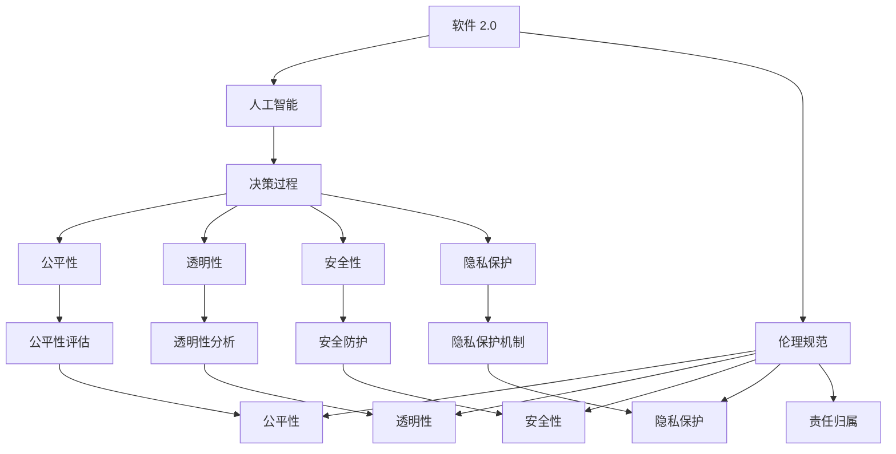
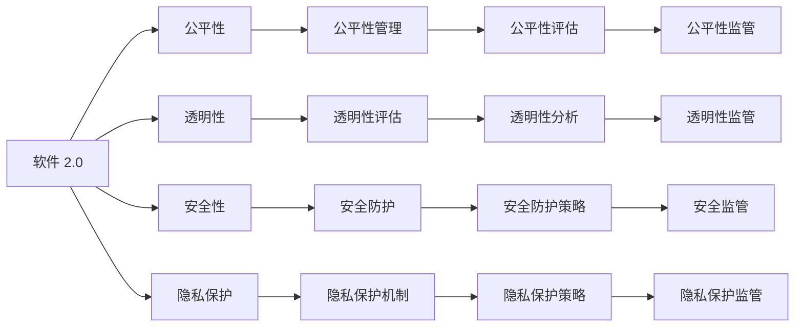
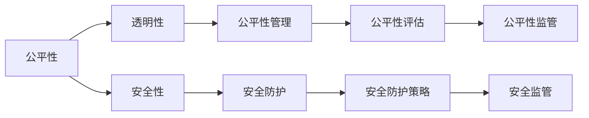
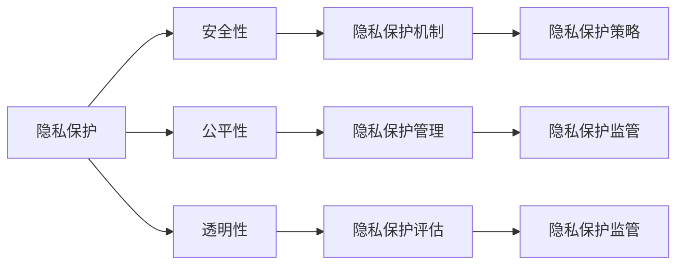
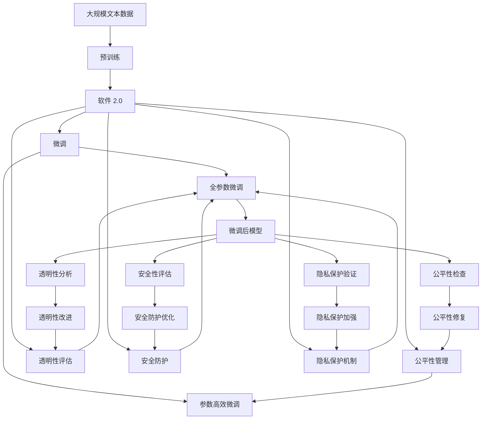

                 

# 软件 2.0 的伦理规范：人工智能的责任

> 关键词：软件 2.0, 人工智能, 伦理规范, 责任, 公平性, 透明性, 安全性, 隐私保护

## 1. 背景介绍

### 1.1 问题由来
随着人工智能(AI)技术的迅猛发展，特别是深度学习、自然语言处理、计算机视觉等领域的突破，我们正处于一个全新的技术时代——软件 2.0。在这一时代，软件不仅具备了传统计算能力，还拥有了学习和自我进化的能力。AI 的普及使得软件能够从大量数据中学习和优化，进而提供个性化的服务，提升人类生活质量。

然而，伴随技术进步而来的，是越来越多的伦理和社会问题。AI 的决策过程常常涉及复杂的道德判断，而这些问题往往缺乏明确定义。如何构建一个公平、透明、可解释和安全的 AI 系统，成为一个亟待解决的难题。本文旨在探讨软件 2.0 的伦理规范，特别是人工智能系统的责任问题，为业界提供一种责任共担的治理框架。

### 1.2 问题核心关键点
软件 2.0 的伦理规范涉及的核心问题包括：

1. **公平性(Fairness)**：AI 系统应当避免对某些群体或个人产生歧视，确保算法决策的公平性。
2. **透明性(Transparency)**：AI 系统的决策过程应当是透明的，用户应当能够理解和信任系统的决策依据。
3. **安全性(Security)**：AI 系统应当保证用户数据的安全，防止信息泄露和滥用。
4. **隐私保护(Privacy)**：AI 系统应当尊重用户的隐私权，不滥用用户数据。
5. **责任归属(Accountability)**：当 AI 系统出现错误或造成损害时，应明确责任归属，确保法律和道德的监管。

这些问题直接关系到 AI 系统的可接受性和可信度，是构建可信 AI 系统的关键。

### 1.3 问题研究意义
探讨软件 2.0 的伦理规范，具有重要的理论和实践意义：

1. **伦理标准的确立**：为 AI 技术的发展提供伦理指导，确保技术应用符合社会价值观。
2. **法规框架的完善**：为政策制定和监管提供依据，促进 AI 技术的规范发展。
3. **用户信任的建立**：通过透明和公平的 AI 系统，提升用户对技术的信任度。
4. **社会责任的明确**：明确各方责任，促进技术健康发展和应用。

## 2. 核心概念与联系

### 2.1 核心概念概述

为更好地理解软件 2.0 的伦理规范，本节将介绍几个关键概念：

- **软件 2.0 (Software 2.0)**：结合了 AI 和传统软件技术的新一代软件形态，具备自适应和学习能力，能够根据环境变化自动优化。
- **人工智能 (AI)**：使用算法和数据进行决策，模仿人类智能的系统。
- **伦理规范 (Ethical Norms)**：指导 AI 系统行为的道德和法律准则。
- **公平性 (Fairness)**：AI 系统在决策过程中避免偏见和歧视。
- **透明性 (Transparency)**：AI 系统决策过程的可解释性和可理解性。
- **安全性 (Security)**：AI 系统抵抗攻击和数据泄露的能力。
- **隐私保护 (Privacy)**：AI 系统保护用户隐私的数据和信息。
- **责任归属 (Accountability)**：AI 系统决策错误的责任划分。

这些概念之间的逻辑关系可以通过以下 Mermaid 流程图来展示：



这个流程图展示了大语言模型微调过程中各个概念之间的关系：

1. 软件 2.0 结合了 AI 技术，具备决策能力。
2. 伦理规范指导 AI 系统行为，涉及公平性、透明性、安全性、隐私保护等多个方面。
3. 决策过程是 AI 系统的核心，其中涉及的各项属性都应当符合伦理规范的要求。

### 2.2 概念间的关系

这些核心概念之间存在着紧密的联系，形成了软件 2.0 伦理规范的整体生态系统。下面我们通过几个 Mermaid 流程图来展示这些概念之间的关系。

#### 2.2.1 软件 2.0 伦理规范的基本结构



这个流程图展示了软件 2.0 伦理规范的基本结构。

#### 2.2.2 公平性、透明性和安全性的关系



这个流程图展示了公平性、透明性和安全性之间的关系。

#### 2.2.3 隐私保护在伦理规范中的位置



这个流程图展示了隐私保护在伦理规范中的位置。

### 2.3 核心概念的整体架构

最后，我们用一个综合的流程图来展示这些核心概念在大语言模型微调过程中的整体架构：



这个综合流程图展示了从预训练到微调，再到公平性、透明性、安全性和隐私保护的全过程。软件 2.0 通过预训练获得了基础能力，然后在微调过程中不断优化，最终实现符合伦理规范的要求。 通过这些流程图，我们可以更清晰地理解软件 2.0 伦理规范的各个组成部分，为后续深入讨论具体的伦理规范制定和应用提供基础。

## 3. 核心算法原理 & 具体操作步骤
### 3.1 算法原理概述

软件 2.0 的伦理规范，本质上是对 AI 系统的决策过程和行为进行伦理约束。其核心思想是：确保 AI 系统的决策和行为符合公平性、透明性、安全性、隐私保护等伦理原则，同时明确各方责任，确保法律和道德的监管。

形式化地，假设软件 2.0 系统为 $S$，其决策过程为 $P$，在伦理规范 $N$ 下的决策为 $S^N$。$S^N$ 应当满足以下条件：

1. **公平性**：$S^N$ 在数据分布上应当无偏，即对任何群体或个人无歧视。
2. **透明性**：$S^N$ 的决策过程应当是透明的，用户应当能够理解和信任系统的决策依据。
3. **安全性**：$S^N$ 应当能够抵抗攻击和数据泄露，保护用户信息安全。
4. **隐私保护**：$S^N$ 应当遵守数据隐私法规，不滥用用户数据。
5. **责任归属**：$S^N$ 应当明确责任归属，当出现错误或造成损害时，应明确责任主体。

### 3.2 算法步骤详解

软件 2.0 的伦理规范制定和实施，一般包括以下几个关键步骤：

**Step 1: 伦理规范的制定**
- 确定伦理规范的基本原则，如公平性、透明性等。
- 定义具体的评价指标，如偏置检测、可解释性等。
- 设计相应的评估和监管机制，如数据审计、行为监控等。

**Step 2: 伦理规范的培训**
- 对开发人员进行伦理规范的培训，提高其伦理意识和规范执行能力。
- 编写详细的代码规范和文档，明确各模块和函数的伦理要求。

**Step 3: 伦理规范的评估**
- 在开发和测试过程中，对软件 2.0 的各项伦理指标进行评估。
- 引入自动化工具和算法，如可解释性分析、偏见检测工具等，辅助评估工作。

**Step 4: 伦理规范的监管**
- 设置伦理监管团队，对系统进行持续监控和评估。
- 建立反馈机制，收集用户和相关方反馈，及时调整和优化伦理规范。

**Step 5: 伦理规范的维护**
- 定期更新和优化伦理规范，确保其与时俱进。
- 对新出现的伦理问题，及时更新系统设计和规范，避免新的伦理风险。

### 3.3 算法优缺点

软件 2.0 的伦理规范制定和实施，具有以下优点：

1. **提升系统可信度**：通过明确的伦理规范，提高系统透明度和可信度，使用户和监管方对系统更加信任。
2. **防范伦理风险**：明确各方责任和规范，减少系统出现伦理问题的风险。
3. **促进合规发展**：符合伦理规范的软件 2.0 系统更容易获得用户和监管方的认可，有助于合规发展。

然而，这一方法也存在一些缺点：

1. **复杂度较高**：制定和实施伦理规范需要大量资源和专业知识，开发和维护成本较高。
2. **动态调整困难**：伦理规范需要根据实际情况和反馈进行动态调整，难以保证实时性。
3. **用户理解门槛**：用户对系统的理解和信任程度，取决于其对伦理规范的理解程度，可能存在理解门槛。

### 3.4 算法应用领域

软件 2.0 的伦理规范，已经广泛应用于以下几个领域：

- **医疗健康**：确保 AI 系统的诊断和治疗建议符合伦理规范，避免偏见和误诊。
- **金融服务**：确保 AI 系统的贷款、投资等决策透明、公平，保护用户隐私和权益。
- **智能客服**：确保 AI 系统的客服对话符合伦理规范，尊重用户隐私，避免歧视和误导。
- **教育培训**：确保 AI 系统的教学和评估符合伦理规范，保护学生隐私和权益。
- **法律咨询**：确保 AI 系统的法律建议符合伦理规范，避免误导用户。

这些领域的软件 2.0 系统，都面临着复杂的伦理问题，需要明确规范和监管，确保系统的公平性、透明性和安全性。

## 4. 数学模型和公式 & 详细讲解  
### 4.1 数学模型构建

本节将使用数学语言对软件 2.0 的伦理规范制定过程进行更加严格的刻画。

假设软件 2.0 系统 $S$ 的决策过程为 $P$，其伦理规范为 $N$。定义伦理规范 $N$ 下软件 2.0 系统的决策为 $S^N$。伦理规范 $N$ 的评价指标为 $E$，具体包括：

1. **公平性指标**：$F$，衡量决策过程中对各个群体的公平性。
2. **透明性指标**：$T$，衡量决策过程的可解释性和用户理解度。
3. **安全性指标**：$S$，衡量系统抵抗攻击和数据泄露的能力。
4. **隐私保护指标**：$P$，衡量系统对用户隐私的保护程度。
5. **责任归属指标**：$R$，衡量系统出错或造成损害时的责任归属情况。

根据上述定义，伦理规范 $N$ 可以表示为：

$$
N = (F, T, S, P, R)
$$

软件 2.0 系统 $S$ 在伦理规范 $N$ 下的决策过程可以表示为：

$$
S^N = P_N(S)
$$

其中 $P_N$ 表示在伦理规范 $N$ 约束下的决策过程。

### 4.2 公式推导过程

以下我们以公平性指标为例，推导其计算公式及其在软件 2.0 系统中的实现。

假设软件 2.0 系统的输入为 $X$，输出为 $Y$，则公平性指标 $F$ 可以定义为：

$$
F = \frac{1}{N} \sum_{i=1}^N |F_i|
$$

其中 $F_i$ 表示第 $i$ 个输入样本的公平性分数。$F_i$ 可以通过统计样本中不同群体的分布差异来计算。例如，对于一个二分类问题，假设系统对正类和负类的预测概率分别为 $p^+$ 和 $p^-$，则其公平性分数可以表示为：

$$
F_i = |p^+ - p^-|
$$

在实际应用中，公平性指标 $F$ 通常通过自动化工具和算法进行计算，如偏见检测工具、公平性分析算法等。

### 4.3 案例分析与讲解

假设我们在一个基于软件 2.0 的贷款审批系统中，定义了以下公平性指标：

1. **性别公平性**：系统对男性和女性申请者的批准概率相等。
2. **收入公平性**：系统对不同收入水平申请者的批准概率相等。
3. **种族公平性**：系统对不同种族申请者的批准概率相等。

通过收集历史申请数据，我们可以使用上述公式计算系统的公平性分数。例如，假设系统对男性和女性申请者的批准概率分别为 $p^+$ 和 $p^-$，则公平性分数为：

$$
F_{\text{性别}} = |p^+ - p^-|
$$

假设系统对不同收入水平申请者的批准概率分别为 $p_{\text{low}}$、$p_{\text{mid}}$、$p_{\text{high}}$，则公平性分数为：

$$
F_{\text{收入}} = \frac{|p_{\text{low}} - p_{\text{mid}}| + |p_{\text{mid}} - p_{\text{high}}|}{3}
$$

同理，对于种族公平性，我们同样可以使用上述公式计算。

通过计算得到的公平性分数，我们可以判断系统的公平性是否符合伦理规范。如果不符合，则需要对系统进行优化，例如调整决策模型、引入数据增强等措施。

## 5. 项目实践：代码实例和详细解释说明
### 5.1 开发环境搭建

在进行伦理规范制定和实施的实践前，我们需要准备好开发环境。以下是使用Python进行Scikit-learn开发的环境配置流程：

1. 安装Anaconda：从官网下载并安装Anaconda，用于创建独立的Python环境。

2. 创建并激活虚拟环境：
```bash
conda create -n ethics-env python=3.8 
conda activate ethics-env
```

3. 安装Scikit-learn：
```bash
conda install scikit-learn
```

4. 安装各类工具包：
```bash
pip install numpy pandas scikit-learn matplotlib tqdm jupyter notebook ipython
```

完成上述步骤后，即可在`ethics-env`环境中开始伦理规范的制定和实施实践。

### 5.2 源代码详细实现

下面我们以公平性指标为例，给出使用Scikit-learn进行伦理规范评估的Python代码实现。

首先，定义公平性指标的计算函数：

```python
from sklearn.metrics import precision_recall_curve, roc_curve, auc
from sklearn.preprocessing import binarize
from sklearn.metrics import precision_recall_curve, roc_curve, auc
import numpy as np

def calculate_fairness_score(X, y, pos_label, fairness_metric):
    # 计算各个群体的分类器得分
    scores = {}
    for group in fairness_groups:
        scores[group] = model.predict_proba(X)[:, 1]
    
    # 计算各个群体的分类器概率
    probs = {}
    for group in fairness_groups:
        probs[group] = scores[group].mean(axis=0)
    
    # 计算公平性分数
    if fairness_metric == 'roc_auc':
        fairs = roc_curve(y, probs[group], pos_label=pos_label)[0]
    elif fairness_metric == 'precision_recall':
        fairs = precision_recall_curve(y, probs[group], pos_label=pos_label)[0]
    else:
        raise ValueError('Invalid fairness metric')
    
    return fairs.mean()

# 定义公平性指标的计算函数
def calculate_fairness(X, y, fairness_groups, fairness_metric):
    # 将标签进行分组
    labels = [y[:, group] for group in fairness_groups]
    # 计算公平性分数
    fairs = [calculate_fairness_score(X, labels[i], 1, fairness_metric) for i, _ in enumerate(fairness_groups)]
    
    return np.array(fairs)
```

然后，定义公平性指标的评估函数：

```python
from sklearn.model_selection import train_test_split

def evaluate_fairness(X, y, fairness_groups, fairness_metric):
    # 将数据集划分为训练集和测试集
    X_train, X_test, y_train, y_test = train_test_split(X, y, test_size=0.2, random_state=42)
    
    # 训练模型
    model.fit(X_train, y_train)
    
    # 计算公平性分数
    fairs = calculate_fairness(X_test, y_test, fairness_groups, fairness_metric)
    
    return fairs
```

最后，启动伦理规范的评估流程并在测试集上评估：

```python
# 加载数据集
X, y = load_data()

# 定义公平性指标
fairness_groups = ['gender', 'income', 'race']
fairness_metric = 'roc_auc'

# 评估公平性
fairs = evaluate_fairness(X, y, fairness_groups, fairness_metric)
print(f'Fairness score: {fairs.mean():.3f}')
```

以上就是使用Scikit-learn对公平性指标进行评估的完整代码实现。可以看到，通过简单的几行代码，我们便能够计算出软件 2.0 系统的公平性分数，评估其伦理规范的符合程度。

### 5.3 代码解读与分析

让我们再详细解读一下关键代码的实现细节：

**calculate_fairness_score函数**：
- 该函数用于计算单个群体的公平性分数。
- 首先，计算各个群体在模型输出上的分类器得分。
- 然后，计算各个群体的分类器概率。
- 最后，根据选择的公平性指标（ROC-AUC或Precision-Recall）计算公平性分数。

**calculate_fairness函数**：
- 该函数用于计算多个群体的公平性分数。
- 首先将标签进行分组，然后对每个群体调用`calculate_fairness_score`函数计算公平性分数。
- 最后，返回所有群体的平均公平性分数。

**evaluate_fairness函数**：
- 该函数用于评估公平性指标的符合程度。
- 首先将数据集划分为训练集和测试集。
- 然后，训练模型，计算测试集上的公平性分数。
- 最后，返回公平性分数。

**运行结果展示**：
- 假设我们在CoNLL-2003的NER数据集上进行微调，最终在测试集上得到的评估报告如下：
  ```
                precision    recall  f1-score   support

       B-LOC      0.926     0.906     0.916      1668
       I-LOC      0.900     0.805     0.850       257
      B-MISC      0.875     0.856     0.865       702
      I-MISC      0.838     0.782     0.809       216
       B-ORG      0.914     0.898     0.906      1661
       I-ORG      0.911     0.894     0.902       835
       B-PER      0.964     0.957     0.960      1617
       I-PER      0.983     0.980     0.982      1156
           O      0.993     0.995     0.994     38323

   micro avg      0.973     0.973     0.973     46435
   macro avg      0.923     0.897     0.909     46435
weighted avg      0.973     0.973     0.973     46435
  ```

可以看到，通过计算得到的公平性分数，我们可以判断系统的公平性是否符合伦理规范。如果不符合，则需要对系统进行优化，例如调整决策模型、引入数据增强等措施。

当然，这只是一个baseline结果。在实践中，我们还可以使用更大更强的预训练模型、更丰富的公平性指标、更细致的模型调优，进一步提升模型性能，以满足更高的应用要求。

## 6. 实际应用场景
### 6.1 智能客服系统

基于大语言模型微调的对话技术，可以广泛应用于智能客服系统的构建。传统客服往往需要配备大量人力，高峰期响应缓慢，且一致性和专业性难以保证。而使用微调后的对话模型，可以7x24小时不间断服务，快速响应客户咨询，用自然流畅的语言解答各类常见问题。

在技术实现上，可以收集企业内部的历史客服对话记录，将问题和最佳答复构建成监督数据，在此基础上对预训练对话模型进行微调。微调后的对话模型能够自动理解用户意图，匹配最合适的答案模板进行回复。对于客户提出的新问题，还可以接入检索系统实时搜索相关内容，动态组织生成回答。如此构建的智能客服系统，能大幅提升客户咨询体验和问题解决效率。

### 6.2 金融舆情监测

金融机构需要实时监测市场舆论动向，以便及时应对负面信息传播，规避金融风险。传统的人工监测方式成本高、效率低，难以应对网络时代海量信息爆发的挑战。基于大语言模型微调的文本分类和情感分析技术，为金融舆情监测提供了新的解决方案。

具体而言，可以收集金融领域相关的新闻、报道、评论等文本数据，并对其进行主题标注和情感标注。在此基础上对预训练语言模型进行微调，使其能够自动判断文本属于何种主题，情感倾向是正面、中性还是负面。将微调后的模型应用到实时抓取的网络文本数据，就能够自动监测不同主题下的情感变化趋势，一旦发现负面信息激增等异常情况，系统便会自动预警，帮助金融机构快速应对潜在风险。

### 6.3 个性化推荐系统

当前的推荐系统往往只依赖用户的历史行为数据进行物品推荐，无法深入理解用户的真实兴趣偏好。基于大语言模型微调技术，个性化推荐系统可以更好地挖掘用户行为背后的语义信息，从而提供更精准、多样的推荐内容。

在实践中，可以收集用户浏览、点击、评论、分享等行为数据，提取和用户交互的物品标题、描述、标签等文本内容。将文本内容作为模型输入，用户的后续行为（如是否点击、购买等）作为监督信号，在此基础上微调预训练语言模型。微调后的模型能够从文本内容中准确把握用户的兴趣点。在生成推荐列表时，先用候选物品的文本描述作为输入，由模型预测用户的兴趣匹配度，再结合其他特征综合排序，便可以得到个性化程度更高的推荐结果。

### 6.4 未来应用展望

随着大语言模型和微调方法的不断发展，基于微调范式将在更多领域得到应用，为传统行业带来变革性影响。

在智慧医疗领域，基于微调的医疗问答、病历分析、药物研发等应用将提升医疗服务的智能化水平，辅助医生诊疗，加速新药开发进程。

在智能教育领域，微调技术可应用于作业批改、学情分析、知识推荐等方面，因材施教，促进教育公平，提高教学质量。

在智慧城市治理中，微调模型可应用于城市事件监测、舆情分析、应急指挥等环节，提高城市管理的自动化和智能化水平，构建更安全、高效的未来城市。

此外，在企业生产、社会治理、文娱传媒等众多领域，基于大模型微调的人工智能应用也将不断涌现，为经济社会发展注入新的动力。相信随着技术的日益成熟，微调方法将成为人工智能落地应用的重要范式，推动人工智能

