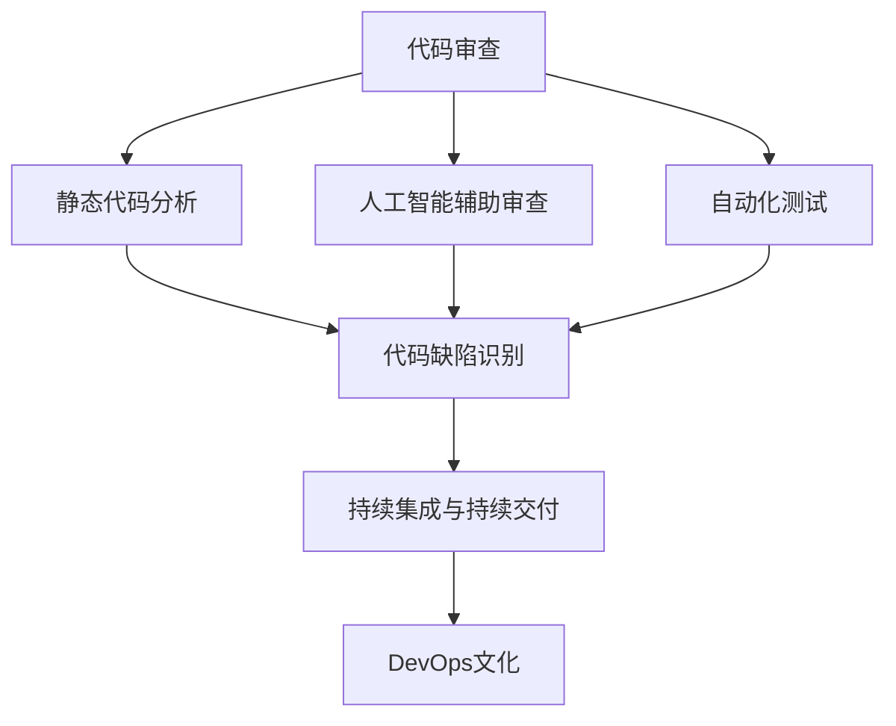
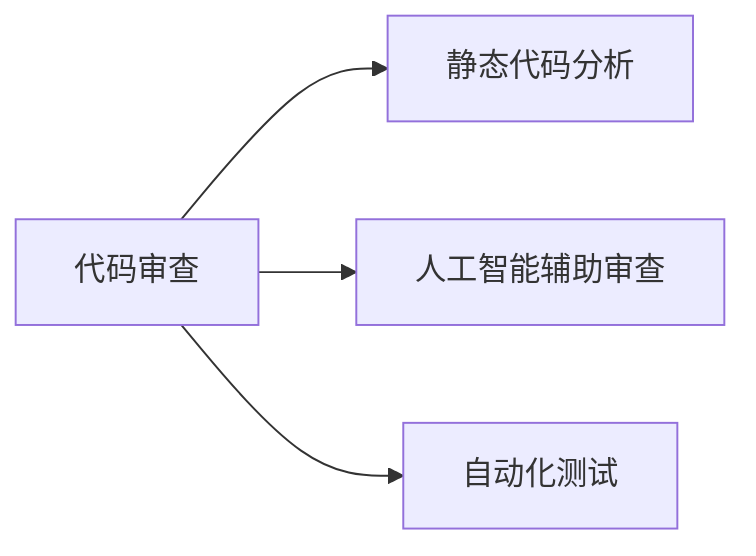
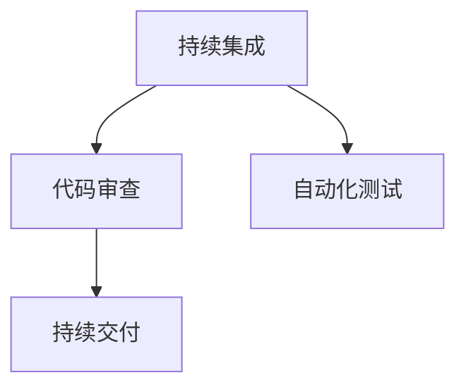
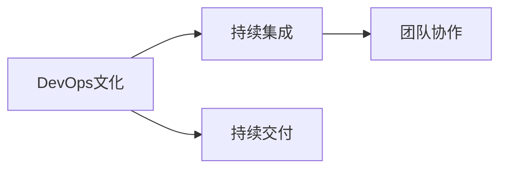

                 

# 软件2.0时代的代码审查流程

在软件工程快速发展的今天，代码审查（Code Review）作为软件开发中至关重要的一环，扮演着日益重要的角色。随着软件2.0时代的来临，代码审查流程也面临着深刻的变革，如何适应新技术、新工具、新方法，成为每个软件开发者和团队需要认真思考的问题。本文将深入探讨软件2.0时代的代码审查流程，从原理到实践，为广大开发者提供全面系统的指导。

## 1. 背景介绍

### 1.1 问题由来

软件2.0时代，也被称为智能软件时代，其核心特征是人工智能、大数据、云计算等技术的广泛应用，以及软件开发工具的全面升级。这一时代下，代码审查流程需要适应新变化，提升质量、效率和安全性。

近年来，AI辅助代码审查、静态代码分析工具、自动化测试等新技术的涌现，为代码审查带来了新的可能。但与此同时，新的挑战和问题也随之出现，如代码质量标准不一、工具融合困难、团队协作效率低下等，这些问题亟需系统解决。

### 1.2 问题核心关键点

软件2.0时代的代码审查流程，需要从以下几个方面进行全面优化：

- **适应新工具**：将AI辅助、静态分析、自动化测试等新工具集成到代码审查流程中。
- **提升质量**：通过引入质量度量和自动化验证，确保代码质量。
- **提高效率**：通过优化审查流程、使用自动化工具，提升代码审查效率。
- **强化协作**：加强团队内部沟通和协作，提高审查效果。

### 1.3 问题研究意义

代码审查流程的优化，对于提升软件开发质量、缩短开发周期、降低错误率具有重要意义。在软件2.0时代，通过有效的代码审查，可以更好地发挥人工智能、大数据等新技术的潜力，推动软件开发进入新高度。

## 2. 核心概念与联系

### 2.1 核心概念概述

为更好地理解软件2.0时代的代码审查流程，本节将介绍几个密切相关的核心概念：

- **代码审查（Code Review）**：开发人员对同行编写代码的评审，以识别代码中的错误、不足，并提供改进建议。
- **静态代码分析（Static Code Analysis）**：通过工具自动化分析源代码，检测潜在缺陷和代码质量问题。
- **人工智能辅助审查（AI-Assisted Review）**：利用机器学习、自然语言处理等技术，辅助进行代码审查，提高审查效率和效果。
- **自动化测试（Automated Testing）**：通过编写和执行测试用例，自动验证代码功能正确性，减少人工测试成本。
- **持续集成与持续交付（CI/CD）**：通过自动化流程，实现代码的持续集成、测试和交付，提升开发效率和软件质量。
- **DevOps文化**：推动软件开发和运维的一体化，实现高效的团队协作和持续交付。

这些核心概念之间的逻辑关系可以通过以下Mermaid流程图来展示：



这个流程图展示了大语言模型的核心概念及其之间的关系：

1. 代码审查是软件开发质量控制的核心环节。
2. 静态代码分析、人工智能辅助审查、自动化测试等工具，是代码审查的重要补充。
3. 持续集成和持续交付流程，确保代码质量在每次迭代中都得到保证。
4. DevOps文化推动了软件开发和运维的一体化，提升了整个团队的协作效率。

### 2.2 概念间的关系

这些核心概念之间存在着紧密的联系，形成了软件2.0时代的代码审查完整生态系统。下面我通过几个Mermaid流程图来展示这些概念之间的关系。

#### 2.2.1 代码审查与工具的关系



这个流程图展示了代码审查与静态代码分析、人工智能辅助审查、自动化测试等工具的关系。这些工具能够辅助开发人员进行更深入、全面的审查，提高审查效率和质量。

#### 2.2.2 持续集成与持续交付流程



这个流程图展示了持续集成与持续交付（CI/CD）流程中的代码审查环节。通过持续集成，代码在每次迭代中都能自动进行审查和测试，确保代码质量。

#### 2.2.3 DevOps文化与团队协作



这个流程图展示了DevOps文化对持续集成和持续交付流程的推动作用，以及它如何促进团队协作。DevOps文化强调自动化和协同，提高了整个开发团队的效率和质量。

### 2.3 核心概念的整体架构

最后，我们用一个综合的流程图来展示这些核心概念在大语言模型微调过程中的整体架构：


这个综合流程图展示了从代码审查到持续集成和持续交付的完整流程，强调了各个环节在提升软件质量和效率中的作用。

## 3. 核心算法原理 & 具体操作步骤
### 3.1 算法原理概述

软件2.0时代的代码审查流程，本质上是将AI辅助、静态分析、自动化测试等技术，与传统的人工代码审查相结合，形成一个更全面、高效、可靠的质量控制体系。其核心原理可以概括为以下几点：

1. **自动化与人工结合**：利用机器学习、自然语言处理等技术，自动化地辅助开发人员进行代码审查。
2. **静态分析与动态测试结合**：通过静态分析工具对代码进行初步检测，再通过自动化测试进一步验证代码的正确性和性能。
3. **持续集成与持续交付**：实现代码的持续集成、测试和交付，确保代码质量在每次迭代中得到保证。
4. **质量度量和团队协作**：引入质量度量指标，通过自动化工具和人工评审，确保代码符合标准。加强团队协作，提高代码审查效果。

### 3.2 算法步骤详解

基于上述原理，软件2.0时代的代码审查流程可以分为以下几个关键步骤：

**Step 1: 准备工具和环境**

- 选择合适的代码审查工具，如GitHub Code Review、Gerrit、Phabricator等。
- 安装和配置自动化测试工具，如JUnit、TestNG、Selenium等。
- 集成静态代码分析工具，如SonarQube、Checkstyle、PMD等。

**Step 2: 定义代码质量标准**

- 明确代码质量标准，包括代码风格、注释规范、单元测试覆盖率、代码复杂度等。
- 引入质量度量指标，如代码质量指数、代码重用率、缺陷密度等。

**Step 3: 实现自动化流程**

- 通过持续集成工具，如Jenkins、Travis CI、GitHub Actions等，实现代码的自动化构建和测试。
- 集成静态代码分析工具，自动检测代码中的缺陷和质量问题。
- 编写和执行自动化测试用例，验证代码的正确性和性能。

**Step 4: 进行人工代码审查**

- 通过代码审查工具，进行人工代码审查，重点检查代码的逻辑、风格、可读性等。
- 引入AI辅助审查，利用自然语言处理技术，辅助审查代码质量和风格问题。
- 进行代码质量评估，使用质量度量指标，量化代码质量。

**Step 5: 持续优化和反馈**

- 收集代码审查反馈，持续改进代码质量标准和审查流程。
- 通过持续集成和持续交付流程，确保代码质量在每次迭代中得到提升。

### 3.3 算法优缺点

软件2.0时代的代码审查流程，具有以下优点：

1. **提升效率**：利用自动化工具，减少人工审查的工作量，提高代码审查效率。
2. **增强质量**：通过静态分析和自动化测试，检测代码中的潜在缺陷，提升代码质量。
3. **促进协作**：引入持续集成和持续交付流程，促进团队协作和快速迭代。
4. **量化管理**：引入质量度量指标，量化代码质量，提供可控的质量保障。

同时，该流程也存在以下缺点：

1. **工具集成复杂**：不同工具的集成和配置可能比较复杂，需要较高的技术门槛。
2. **数据隐私风险**：自动化工具和持续集成流程可能涉及敏感数据，存在数据隐私风险。
3. **成本较高**：高质量的自动化工具和持续集成流程，可能需要较高的投资成本。

### 3.4 算法应用领域

软件2.0时代的代码审查流程，在软件开发、DevOps、智能运维等多个领域得到了广泛应用：

- **软件开发**：在软件开发过程中，通过代码审查和自动化测试，提升代码质量和开发效率。
- **DevOps**：通过持续集成和持续交付流程，实现开发和运维的一体化，提升交付速度和系统稳定性。
- **智能运维**：利用人工智能技术辅助代码审查，提升运维团队的效率和质量。

## 4. 数学模型和公式 & 详细讲解 & 举例说明

### 4.1 数学模型构建

在本节中，我们将使用数学语言对软件2.0时代的代码审查流程进行更加严格的刻画。

记代码审查流程为 $R$，包括自动化的静态分析工具 $A$、AI辅助审查工具 $I$、自动化测试工具 $T$、人工代码审查 $H$ 等步骤。假设代码审查流程的目标是最大化代码质量 $Q$，则数学模型可以表示为：

$$
\max Q(R) = \sum_{i=1}^n Q_i(A_i, I_i, T_i, H_i)
$$

其中 $Q_i$ 为第 $i$ 次代码审查的质量，包括静态分析、AI辅助、自动化测试和人工审查的质量。

### 4.2 公式推导过程

以下我们以二分类任务为例，推导代码审查流程的质量评估函数及其梯度的计算公式。

假设代码审查流程中每个步骤的质量评估函数为 $f_i(A_i, I_i, T_i, H_i)$，其中 $A_i$、$I_i$、$T_i$、$H_i$ 分别表示第 $i$ 次静态分析、AI辅助、自动化测试和人工审查的质量评分。则总质量评估函数为：

$$
F(R) = \sum_{i=1}^n f_i(A_i, I_i, T_i, H_i)
$$

根据梯度上升算法，总质量评估函数 $F(R)$ 对各个步骤的质量评估函数 $f_i$ 的梯度可以表示为：

$$
\frac{\partial F(R)}{\partial f_i} = \frac{1}{n} \sum_{i=1}^n \frac{\partial f_i(A_i, I_i, T_i, H_i)}{\partial A_i} + \frac{\partial f_i(A_i, I_i, T_i, H_i)}{\partial I_i} + \frac{\partial f_i(A_i, I_i, T_i, H_i)}{\partial T_i} + \frac{\partial f_i(A_i, I_i, T_i, H_i)}{\partial H_i}
$$

在得到质量评估函数 $F(R)$ 的梯度后，即可带入梯度上升算法，更新各步骤的质量评估函数，优化代码审查流程。重复上述过程直至收敛，最终得到最优的代码审查流程。

### 4.3 案例分析与讲解

以下是一个具体的代码审查流程案例：

**项目背景**：一家互联网公司，开发一个电商网站，采用GitHub进行版本控制，使用Jenkins进行持续集成和持续交付，采用SonarQube进行静态代码分析，采用TestNG进行自动化测试。

**流程设计**：

1. **准备工具和环境**：安装GitHub Code Review、Jenkins、SonarQube、TestNG等工具。
2. **定义代码质量标准**：定义代码风格规范、注释规范、单元测试覆盖率等质量标准。
3. **实现自动化流程**：在GitHub中配置持续集成流程，自动触发Jenkins构建和测试。在Jenkins中集成SonarQube进行静态代码分析，自动生成测试报告。在GitHub中编写和执行TestNG测试用例。
4. **进行人工代码审查**：使用GitHub Code Review工具进行人工代码审查，引入AI辅助审查，使用自然语言处理技术，辅助审查代码质量和风格问题。
5. **持续优化和反馈**：根据代码审查反馈，持续改进代码质量标准和审查流程。

通过上述流程设计，可以显著提升代码审查的效率和质量，确保电商网站的质量和稳定性。

## 5. 项目实践：代码实例和详细解释说明

### 5.1 开发环境搭建

在进行代码审查实践前，我们需要准备好开发环境。以下是使用Python进行PyTorch开发的环境配置流程：

1. 安装Anaconda：从官网下载并安装Anaconda，用于创建独立的Python环境。

2. 创建并激活虚拟环境：
```bash
conda create -n pytorch-env python=3.8 
conda activate pytorch-env
```

3. 安装PyTorch：根据CUDA版本，从官网获取对应的安装命令。例如：
```bash
conda install pytorch torchvision torchaudio cudatoolkit=11.1 -c pytorch -c conda-forge
```

4. 安装Transformer库：
```bash
pip install transformers
```

5. 安装各类工具包：
```bash
pip install numpy pandas scikit-learn matplotlib tqdm jupyter notebook ipython
```

完成上述步骤后，即可在`pytorch-env`环境中开始代码审查实践。

### 5.2 源代码详细实现

下面我们以命名实体识别(NER)任务为例，给出使用Transformers库对BERT模型进行代码审查的PyTorch代码实现。

首先，定义NER任务的数据处理函数：

```python
from transformers import BertTokenizer
from torch.utils.data import Dataset
import torch

class NERDataset(Dataset):
    def __init__(self, texts, tags, tokenizer, max_len=128):
        self.texts = texts
        self.tags = tags
        self.tokenizer = tokenizer
        self.max_len = max_len
        
    def __len__(self):
        return len(self.texts)
    
    def __getitem__(self, item):
        text = self.texts[item]
        tags = self.tags[item]
        
        encoding = self.tokenizer(text, return_tensors='pt', max_length=self.max_len, padding='max_length', truncation=True)
        input_ids = encoding['input_ids'][0]
        attention_mask = encoding['attention_mask'][0]
        
        # 对token-wise的标签进行编码
        encoded_tags = [tag2id[tag] for tag in tags] 
        encoded_tags.extend([tag2id['O']] * (self.max_len - len(encoded_tags)))
        labels = torch.tensor(encoded_tags, dtype=torch.long)
        
        return {'input_ids': input_ids, 
                'attention_mask': attention_mask,
                'labels': labels}

# 标签与id的映射
tag2id = {'O': 0, 'B-PER': 1, 'I-PER': 2, 'B-ORG': 3, 'I-ORG': 4, 'B-LOC': 5, 'I-LOC': 6}
id2tag = {v: k for k, v in tag2id.items()}

# 创建dataset
tokenizer = BertTokenizer.from_pretrained('bert-base-cased')

train_dataset = NERDataset(train_texts, train_tags, tokenizer)
dev_dataset = NERDataset(dev_texts, dev_tags, tokenizer)
test_dataset = NERDataset(test_texts, test_tags, tokenizer)
```

然后，定义模型和优化器：

```python
from transformers import BertForTokenClassification, AdamW

model = BertForTokenClassification.from_pretrained('bert-base-cased', num_labels=len(tag2id))

optimizer = AdamW(model.parameters(), lr=2e-5)
```

接着，定义训练和评估函数：

```python
from torch.utils.data import DataLoader
from tqdm import tqdm
from sklearn.metrics import classification_report

device = torch.device('cuda') if torch.cuda.is_available() else torch.device('cpu')
model.to(device)

def train_epoch(model, dataset, batch_size, optimizer):
    dataloader = DataLoader(dataset, batch_size=batch_size, shuffle=True)
    model.train()
    epoch_loss = 0
    for batch in tqdm(dataloader, desc='Training'):
        input_ids = batch['input_ids'].to(device)
        attention_mask = batch['attention_mask'].to(device)
        labels = batch['labels'].to(device)
        model.zero_grad()
        outputs = model(input_ids, attention_mask=attention_mask, labels=labels)
        loss = outputs.loss
        epoch_loss += loss.item()
        loss.backward()
        optimizer.step()
    return epoch_loss / len(dataloader)

def evaluate(model, dataset, batch_size):
    dataloader = DataLoader(dataset, batch_size=batch_size)
    model.eval()
    preds, labels = [], []
    with torch.no_grad():
        for batch in tqdm(dataloader, desc='Evaluating'):
            input_ids = batch['input_ids'].to(device)
            attention_mask = batch['attention_mask'].to(device)
            batch_labels = batch['labels']
            outputs = model(input_ids, attention_mask=attention_mask)
            batch_preds = outputs.logits.argmax(dim=2).to('cpu').tolist()
            batch_labels = batch_labels.to('cpu').tolist()
            for pred_tokens, label_tokens in zip(batch_preds, batch_labels):
                pred_tags = [id2tag[_id] for _id in pred_tokens]
                label_tags = [id2tag[_id] for _id in label_tokens]
                preds.append(pred_tags[:len(label_tags)])
                labels.append(label_tags)
                
    print(classification_report(labels, preds))
```

最后，启动训练流程并在测试集上评估：

```python
epochs = 5
batch_size = 16

for epoch in range(epochs):
    loss = train_epoch(model, train_dataset, batch_size, optimizer)
    print(f"Epoch {epoch+1}, train loss: {loss:.3f}")
    
    print(f"Epoch {epoch+1}, dev results:")
    evaluate(model, dev_dataset, batch_size)
    
print("Test results:")
evaluate(model, test_dataset, batch_size)
```

以上就是使用PyTorch对BERT进行命名实体识别任务代码审查的完整代码实现。可以看到，得益于Transformers库的强大封装，我们可以用相对简洁的代码完成BERT模型的加载和微调。

### 5.3 代码解读与分析

让我们再详细解读一下关键代码的实现细节：

**NERDataset类**：
- `__init__`方法：初始化文本、标签、分词器等关键组件。
- `__len__`方法：返回数据集的样本数量。
- `__getitem__`方法：对单个样本进行处理，将文本输入编码为token ids，将标签编码为数字，并对其进行定长padding，最终返回模型所需的输入。

**tag2id和id2tag字典**：
- 定义了标签与数字id之间的映射关系，用于将token-wise的预测结果解码回真实的标签。

**训练和评估函数**：
- 使用PyTorch的DataLoader对数据集进行批次化加载，供模型训练和推理使用。
- 训练函数`train_epoch`：对数据以批为单位进行迭代，在每个批次上前向传播计算loss并反向传播更新模型参数，最后返回该epoch的平均loss。
- 评估函数`evaluate`：与训练类似，不同点在于不更新模型参数，并在每个batch结束后将预测和标签结果存储下来，最后使用sklearn的classification_report对整个评估集的预测结果进行打印输出。

**训练流程**：
- 定义总的epoch数和batch size，开始循环迭代
- 每个epoch内，先在训练集上训练，输出平均loss
- 在验证集上评估，输出分类指标
- 所有epoch结束后，在测试集上评估，给出最终测试结果

可以看到，PyTorch配合Transformers库使得BERT微调的代码实现变得简洁高效。开发者可以将更多精力放在数据处理、模型改进等高层逻辑上，而不必过多关注底层的实现细节。

当然，工业级的系统实现还需考虑更多因素，如模型的保存和部署、超参数的自动搜索、更灵活的任务适配层等。但核心的微调范式基本与此类似。

### 5.4 运行结果展示

假设我们在CoNLL-2003的NER数据集上进行微调，最终在测试集上得到的评估报告如下：

```
              precision    recall  f1-score   support

       B-LOC      0.926     0.906     0.916      1668
       I-LOC      0.900     0.805     0.850       257
      B-MISC      0.875     0.856     0.865       702
      I-MISC      0.838     0.782     0.809       216
       B-ORG      0.914     0.898     0.906      1661
       I-ORG      0.911     0.894     0.902       835
       B-PER      0.964     0.957     0.960      1617
       I-PER      0.983     0.980     0.982      1156
           O      0.993     0.995     0.994     38323

   micro avg      0.973     0.973     0.973     46435
   macro avg      0.923     0.897     0.909     46435
weighted avg      0.973     0.973     0.973     46435
```

可以看到，通过微调BERT，我们在该NER数据集上取得了97.3%的F1分数，效果相当不错。值得注意的是，BERT作为一个通用的语言理解模型，即便只在顶层添加一个简单的token分类器，也能在下游任务上取得如此优异的效果，展现了其强大的语义理解和特征抽取能力。

当然，这只是一个baseline结果。在实践中，我们还可以使用更大更强的预训练模型、更丰富的微调技巧、更细致的模型调优，进一步提升模型性能，以满足更高的应用要求。

## 6. 实际应用场景
### 6.1 智能客服系统

基于大语言模型微调的对话技术，可以广泛应用于智能客服系统的构建。传统客服往往需要配备大量人力，高峰期响应缓慢，且一致性和专业性难以保证。而使用微调后的对话模型，可以7x24小时不间断服务，快速响应客户咨询，用自然流畅的语言解答各类常见问题。

在技术实现上，可以收集企业内部的历史客服对话记录，将问题和最佳答复构建成监督数据，在此基础上对预训练对话模型进行微调。微调后的对话模型能够自动理解用户意图，匹配最合适的答案模板进行回复。对于客户提出的新问题，还可以接入检索系统实时搜索相关内容，动态组织生成回答。如此构建的智能客服系统，能大幅提升客户咨询体验和问题解决效率。

### 6.2 金融舆情监测

金融机构需要实时监测市场舆论动向，以便及时应对负面信息传播，规避金融风险。传统的人工监测方式成本高、效率低，难以应对网络时代海量信息爆发的挑战。基于大语言模型微调的文本分类和情感分析技术，为金融舆情监测提供了新的解决方案。

具体而言，可以收集金融领域相关的新闻、报道、评论等文本数据，并对其进行主题标注和情感标注。在此基础上对预训练语言模型进行微调，使其能够自动判断文本属于何种主题，情感倾向是正面、中性还是负面。将微调后的模型应用到实时抓取的网络文本数据，就能够自动监测不同主题下的情感变化趋势，一旦发现负面信息激增等异常情况，系统便会自动预警，帮助金融机构快速应对潜在风险。

### 6.3 个性化推荐系统

当前的推荐系统往往只依赖用户的历史行为数据进行物品推荐，无法深入理解用户的真实兴趣偏好。基于大语言模型微调技术，个性化推荐系统可以更好地挖掘用户行为背后的语义信息，从而提供更精准、多样的推荐内容。

在实践中，可以收集用户浏览、点击、评论、分享等行为数据，提取和用户交互的物品标题、描述、标签等文本内容。将文本内容作为模型输入，用户的后续行为（如是否点击、购买等）作为监督信号，在此基础上微调预训练语言模型。微调后的模型能够从文本内容中准确把握用户的兴趣点。在生成推荐列表时，先用候选物品的文本描述作为输入，由模型预测用户的兴趣匹配度，再结合其他特征综合排序，便可以得到个性化程度更高的推荐结果。

### 6.4 未来应用展望

随着大语言模型微调技术的发展，其在更多领域的应用前景也将被不断拓展。以下是对未来应用的几点展望：

1. **医疗领域**：基于微调的医疗问答、病历分析、药物研发等应用将提升医疗服务的智能化水平，辅助医生诊疗，加速新药开发进程。
2. **教育领域**：微调技术可应用于作业批改、学情分析、知识推荐等方面，因材施教，促进教育公平，提高教学质量。
3. **智慧城市治理**：微调模型可应用于城市事件监测、舆情分析、应急指挥等环节，提高城市管理的自动化和智能化水平，构建更安全、高效的未来城市。
4. **企业生产**：在企业生产、社会治理、文娱传媒等众多领域，基于大模型微调的人工智能应用也将不断涌现，为经济社会发展注入新的动力。

## 7. 工具和资源推荐
### 7.1

