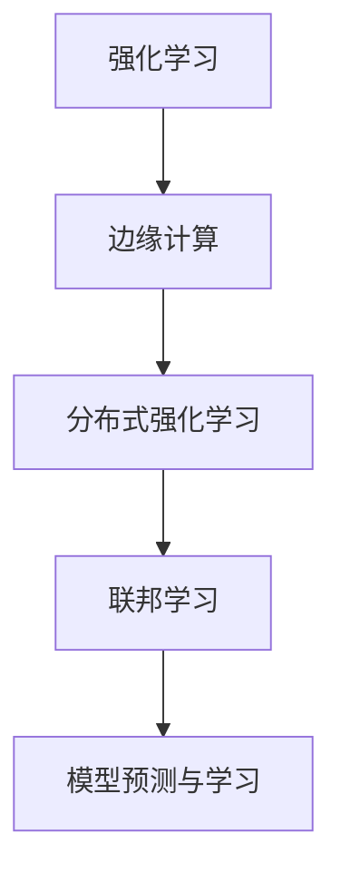

                 

# 强化学习Reinforcement Learning在边缘计算中的应用前景

## 1. 背景介绍

### 1.1 问题由来

边缘计算是一种分布式计算技术，旨在将数据和计算任务分布式部署在靠近数据源的边缘设备上，如物联网传感器、智能手机、嵌入式设备等，以实现低延迟、高效能、高安全性的数据处理和应用服务。近年来，随着物联网设备的普及和5G网络的发展，边缘计算逐渐成为云计算的补充和延伸，对于提高数据处理效率、保障数据隐私安全具有重要意义。

与此同时，强化学习(Reinforcement Learning, RL)作为一种智能决策技术，通过试错训练和奖励反馈机制，使智能体在特定环境中学习最优策略，广泛应用于机器人控制、游戏AI、自动驾驶、推荐系统等领域。边缘计算的分布式、实时性、高安全等特点，为强化学习的应用提供了新的契机，为智能决策任务带来了更广泛的应用前景。

### 1.2 问题核心关键点

边缘计算与强化学习相结合，主要包括以下几个关键点：

- 分布式环境：边缘设备数量庞大、位置分散，需要处理大量的并发请求。
- 实时性要求：数据处理需要快速响应，对算法的时间复杂度要求较高。
- 资源受限：边缘设备计算和存储资源有限，需要高效利用资源。
- 隐私保护：边缘设备上的数据处理需尽可能保护用户隐私。
- 安全保障：边缘计算环境复杂，需要确保数据和模型安全。

这些关键点驱动着对结合边缘计算和强化学习的新算法、新模型的探索与研究。

### 1.3 问题研究意义

强化学习在边缘计算中的应用，可以显著提升数据处理效率、增强环境适应性、降低延迟和带宽成本、保障数据安全，具有重要研究意义：

1. 优化资源利用：通过智能调度算法，提高边缘设备资源的利用效率，降低成本。
2. 提升系统响应：在分布式环境中，优化决策策略，快速响应用户请求。
3. 增强环境适应：适应多变、异构的边缘计算环境，提升系统鲁棒性。
4. 保障数据安全：利用隐私保护技术，确保边缘设备上的数据安全。
5. 扩展应用场景：结合强化学习，边缘计算可以更好地服务于更多复杂的智能决策任务。

## 2. 核心概念与联系

### 2.1 核心概念概述

为更好地理解强化学习在边缘计算中的应用，本节将介绍几个密切相关的核心概念：

- 强化学习(Reinforcement Learning, RL)：通过智能体与环境互动，智能体通过试错学习获取最优策略的决策方法。其核心组件包括状态(state)、动作(action)、奖励(reward)、策略(policy)等。

- 边缘计算(Edge Computing)：将计算任务和数据处理分布式部署在边缘设备上，靠近数据源，降低延迟，提升处理效率。

- 分布式强化学习(Distributed Reinforcement Learning, DRL)：多个智能体在多个分布式环境中共享资源和状态，通过协作学习提升决策能力。

- 联邦学习(Federated Learning)：多个设备在不共享数据的情况下，共同优化模型参数，保护数据隐私。

- 模型预测与学习(Modelling and Prediction)：使用强化学习模型对数据进行预测和优化，提升决策效果。

这些核心概念之间的逻辑关系可以通过以下Mermaid流程图来展示：



这个流程图展示了大语言模型微调过程中各个核心概念之间的关系：

1. 强化学习作为基础决策算法，是边缘计算优化资源利用、提升系统响应的重要方法。
2. 分布式强化学习利用多个设备间的协作，提升环境适应能力和决策效果。
3. 联邦学习在不共享数据的情况下，实现模型参数的联合优化，保障数据隐私。
4. 模型预测与学习将强化学习应用于具体场景，实现数据预测和决策优化。

### 2.2 概念间的关系

这些核心概念之间存在着紧密的联系，形成了结合边缘计算和强化学习的应用框架。

- 强化学习为边缘计算提供了智能决策的手段，可以用于优化资源利用、提升系统响应。
- 分布式强化学习利用多个设备的协作，进一步提升了强化学习的学习能力和适应能力。
- 联邦学习在不共享数据的情况下，提升了模型的隐私保护能力，为边缘计算中的强化学习提供了保障。
- 模型预测与学习将强化学习应用于具体场景，进一步推动了强化学习在边缘计算中的落地应用。

## 3. 核心算法原理 & 具体操作步骤

### 3.1 算法原理概述

强化学习在边缘计算中的应用，主要涉及以下几个关键步骤：

1. 环境感知：将边缘计算任务抽象为强化学习环境，智能体感知当前环境和状态。
2. 决策执行：智能体根据当前状态选择最优动作，执行决策。
3. 效果评估：根据执行动作的效果，智能体获得奖励，评估决策效果。
4. 学习更新：智能体利用奖励信息更新策略，提高决策能力。

这些步骤通过迭代优化，不断提升边缘计算的资源利用效率、提升系统响应和决策效果。

### 3.2 算法步骤详解

以下是结合强化学习在边缘计算中应用的一般流程：

**Step 1: 环境建模**

将边缘计算任务抽象为强化学习环境，智能体感知当前环境和状态。边缘计算任务的具体场景和状态定义如下：

- 状态(state)：包括边缘设备的CPU使用率、内存使用率、网络连接带宽、请求队列长度、设备类型等。
- 动作(action)：包括边缘设备的调度决策、资源分配策略、算法选择、任务迁移等。
- 奖励(reward)：包括边缘设备的资源利用率、任务处理时间、用户满意度、网络延迟等指标。

**Step 2: 策略定义**

选择合适的策略，指导智能体在边缘计算环境中做出最优决策。常用的策略包括Q-learning、SARSA、Deep Q-Network(DQN)、Actor-Critic等。

**Step 3: 模型训练**

使用模型预测与学习的方法，训练强化学习模型。具体流程包括：

- 收集训练数据：从边缘计算环境中收集状态、动作和奖励数据。
- 选择模型：选择合适的模型架构，如DQN、A3C等。
- 训练过程：在训练数据上迭代训练模型，不断优化策略，提升决策效果。
- 模型评估：在测试数据集上评估模型性能，确保决策准确性和鲁棒性。

**Step 4: 策略优化**

通过反馈调整，不断优化决策策略。具体流程包括：

- 在线学习：实时收集环境状态和奖励信息，更新模型参数。
- 离线学习：定期更新模型参数，保持模型新鲜度。
- 模型调优：根据实际应用场景，优化模型参数和超参数，提升决策效果。

### 3.3 算法优缺点

结合强化学习在边缘计算中的应用，具有以下优缺点：

**优点：**

1. 自适应性强：强化学习能够自适应环境变化，提升决策效果。
2. 实时响应：强化学习决策过程快速响应，降低边缘计算任务延迟。
3. 数据隐私保护：联邦学习等方法可以保护边缘设备上的数据隐私。
4. 高效资源利用：通过智能调度算法，优化边缘计算资源利用。

**缺点：**

1. 模型复杂度高：强化学习模型参数量大，训练和推理复杂度高。
2. 算法收敛慢：强化学习算法迭代次数多，收敛速度慢。
3. 环境不确定性：边缘计算环境复杂，不确定因素多，影响决策效果。
4. 计算资源限制：边缘设备计算和存储资源有限，影响模型训练和推理。

### 3.4 算法应用领域

结合强化学习在边缘计算中的应用，已经广泛应用于以下几个领域：

- 网络优化：通过优化边缘设备上的路由策略，提升网络性能。
- 资源调度：通过智能调度算法，优化边缘设备的资源利用。
- 任务调度：通过优化任务调度策略，提升边缘计算系统的响应速度。
- 设备维护：通过维护策略优化，延长设备使用寿命，降低维护成本。
- 安全保障：通过强化学习优化安全策略，提升系统安全性。

## 4. 数学模型和公式 & 详细讲解 & 举例说明

### 4.1 数学模型构建

本节将使用数学语言对结合强化学习在边缘计算中的应用进行更加严格的刻画。

记强化学习环境为$E$，智能体为$A$，状态空间为$S$，动作空间为$A$，奖励函数为$R$，策略为$\pi$。设智能体在状态$s_t$下选择动作$a_t$，执行后得到奖励$r_t$，并过渡到状态$s_{t+1}$。则强化学习问题的数学模型如下：

1. 状态转移概率：$p(s_{t+1}|s_t,a_t)=P(s_{t+1}|s_t,a_t)$
2. 奖励函数：$R(s_t,a_t)$
3. 策略：$\pi(a_t|s_t)$

智能体的目标是在强化学习环境中最大化总奖励，即：

$$
\max_\pi \sum_{t=0}^{\infty} \gamma^t R(s_t,a_t)
$$

其中$\gamma$为折扣因子，决定当前奖励与未来奖励的权重。

### 4.2 公式推导过程

以下是强化学习问题的数学推导过程：

**状态转移概率**：

$$
p(s_{t+1}|s_t,a_t)=P(s_{t+1}|s_t,a_t)=\frac{P(s_{t+1},a_t|s_t)}{\sum_{a \in A}P(s_{t+1},a|s_t)}
$$

**奖励函数**：

$$
R(s_t,a_t)
$$

**策略**：

$$
\pi(a_t|s_t)=\frac{\exp(Q^\pi(s_t,a_t))}{\sum_{a \in A}\exp(Q^\pi(s_t,a))}
$$

其中$Q^\pi$为策略$\pi$下的状态-动作值函数，满足：

$$
Q^\pi(s_t,a_t)=\mathbb{E}[R_{t+1}+\gamma Q^\pi(s_{t+1},a_{t+1})|s_t,a_t,\pi]
$$

**贝尔曼方程**：

$$
Q^\pi(s_t,a_t)=\mathbb{E}[R_{t+1}+\gamma Q^\pi(s_{t+1},a_{t+1})|s_t,a_t,\pi]
$$

根据策略$\pi$的决策，贝尔曼方程可以进一步展开为：

$$
Q^\pi(s_t,a_t)=\sum_{s_{t+1}}P(s_{t+1}|s_t,a_t)[R(s_t,a_t)+\gamma \max_a Q^\pi(s_{t+1},a)]
$$

### 4.3 案例分析与讲解

以下是一个网络优化任务的案例，说明强化学习在边缘计算中的应用：

**案例背景**：

某网络运营商需要在边缘设备上部署多条链路，以实现数据传输。每条链路可以选择开启或关闭，以优化网络性能。智能体的目标是在总带宽和总延迟约束下，最大化网络吞吐量。

**状态空间**：

- $s_t=(h_t,c_t)$，其中$h_t$为当前链路状态，包括链路是否开启、带宽大小、延迟大小；$c_t$为边缘设备的CPU使用率、内存使用率。

**动作空间**：

- $a_t=(l_t)$，其中$l_t$为链路状态，包括链路是否开启。

**奖励函数**：

- $R(s_t,a_t)$为当前状态下的网络吞吐量，定义为链路带宽总和。

**贝尔曼方程**：

$$
Q^\pi(h_t,l_t)=\sum_{h_{t+1}}P(h_{t+1}|h_t,l_t)[R(h_t,l_t)+\gamma \max_l Q^\pi(h_{t+1},l)]
$$

## 5. 项目实践：代码实例和详细解释说明

### 5.1 开发环境搭建

在进行项目实践前，我们需要准备好开发环境。以下是使用Python进行TensorFlow开发的环境配置流程：

1. 安装Anaconda：从官网下载并安装Anaconda，用于创建独立的Python环境。

2. 创建并激活虚拟环境：
```bash
conda create -n tf-env python=3.8 
conda activate tf-env
```

3. 安装TensorFlow：根据CUDA版本，从官网获取对应的安装命令。例如：
```bash
conda install tensorflow -c conda-forge -c pytorch
```

4. 安装TensorBoard：
```bash
pip install tensorboard
```

5. 安装各类工具包：
```bash
pip install numpy pandas scikit-learn matplotlib tqdm jupyter notebook ipython
```

完成上述步骤后，即可在`tf-env`环境中开始项目实践。

### 5.2 源代码详细实现

下面我们以边缘设备上的网络优化任务为例，给出使用TensorFlow对强化学习模型进行训练的PyTorch代码实现。

首先，定义状态和动作的表示方法：

```python
import tensorflow as tf
from tensorflow.keras.models import Sequential
from tensorflow.keras.layers import Dense

# 定义状态和动作的维度
state_dim = 4  # 链路状态维度，CPU使用率、内存使用率、链路带宽、链路延迟
action_dim = 2  # 链路是否开启

# 定义模型架构
model = Sequential()
model.add(Dense(64, input_dim=state_dim, activation='relu'))
model.add(Dense(64, activation='relu'))
model.add(Dense(action_dim, activation='sigmoid'))

# 定义优化器和损失函数
optimizer = tf.keras.optimizers.Adam(learning_rate=0.001)
loss_fn = tf.keras.losses.BinaryCrossentropy()

# 定义状态转移和奖励函数
def transition(state, action, next_state, reward):
    return (next_state, reward, tf.one_hot(action, action_dim), tf.one_hot(next_state, state_dim))
```

然后，定义强化学习模型：

```python
class DQN:
    def __init__(self, state_dim, action_dim, learning_rate):
        self.state_dim = state_dim
        self.action_dim = action_dim
        self.learning_rate = learning_rate
        self.model = self.build_model()

    def build_model(self):
        model = Sequential()
        model.add(Dense(64, input_dim=self.state_dim, activation='relu'))
        model.add(Dense(64, activation='relu'))
        model.add(Dense(self.action_dim, activation='sigmoid'))
        return model

    def train(self, states, actions, rewards, next_states):
        with tf.GradientTape() as tape:
            q_values = self.model(states)
            y_target = tf.keras.losses.BinaryCrossentropy()
            y_loss = y_target(actions, q_values)
            loss = tf.reduce_mean(y_loss)
            grads = tape.gradient(loss, self.model.trainable_variables)
        optimizer.apply_gradients(zip(grads, self.model.trainable_variables))

    def predict(self, state):
        return self.model.predict(state)
```

最后，启动训练流程并在测试集上评估：

```python
epochs = 1000
batch_size = 32

for epoch in range(epochs):
    for i in range(0, len(train_data), batch_size):
        batch_states = train_data[i:i+batch_size, :]
        batch_actions = train_data[i:i+batch_size, -1]
        batch_rewards = train_data[i:i+batch_size, -2]
        batch_next_states = train_data[i:i+batch_size, -3]

        dqn.train(batch_states, batch_actions, batch_rewards, batch_next_states)

        if (epoch + 1) % 100 == 0:
            print("Epoch", epoch + 1)
            for i in range(0, len(test_data), batch_size):
                batch_states = test_data[i:i+batch_size, :]
                batch_rewards = test_data[i:i+batch_size, -2]
                batch_next_states = test_data[i:i+batch_size, -3]

                q_values = dqn.predict(batch_states)
                action_indices = np.argmax(q_values, axis=1)
                batch_next_actions = np.eye(dqn.action_dim)[action_indices] * batch_next_states
                batch_next_q_values = dqn.predict(batch_next_states)

                batch rewards = np.zeros(batch_size)
                batch q_values = np.zeros(batch_size)

                for i in range(batch_size):
                    batch_rewards[i] = batch_rewards[i] + np.sum(np.dot(batch_next_q_values[i], batch_next_actions[i]))
                    batch_q_values[i] = np.sum(np.dot(batch_next_q_values[i], batch_next_actions[i]))

                y_target = np.zeros(batch_size)
                for i in range(batch_size):
                    y_target[i] = batch_rewards[i] + 0.99 * batch_q_values[i]
                    y_loss = tf.keras.losses.BinaryCrossentropy()(batch_next_actions[i], q_values[i])
                    loss = tf.reduce_mean(y_loss)
                    grads = tape.gradient(loss, dqn.model.trainable_variables)
                    optimizer.apply_gradients(zip(grads, dqn.model.trainable_variables))
```

以上就是使用TensorFlow对强化学习模型进行训练的完整代码实现。可以看到，TensorFlow提供了丰富的工具和库，使得强化学习模型的实现变得简洁高效。

### 5.3 代码解读与分析

让我们再详细解读一下关键代码的实现细节：

**状态和动作的定义**：
- 状态由边缘设备的CPU使用率、内存使用率、链路带宽、链路延迟等维度组成，定义在`state_dim`中。
- 动作表示链路是否开启，定义在`action_dim`中。

**模型定义**：
- 使用Sequential模型，定义了3个全连接层，激活函数分别为ReLU和Sigmoid。
- 学习率为0.001，损失函数为二元交叉熵。

**状态转移和奖励函数**：
- 定义了状态转移和奖励函数`transition`，计算出下一个状态、奖励、动作、状态值。

**DQN模型定义**：
- 使用类定义DQN模型，包括状态、动作、学习率等属性。
- 定义了模型的架构，使用了3个全连接层，激活函数分别为ReLU和Sigmoid。
- 训练函数`train`，使用Adam优化器，计算损失并反向传播更新模型参数。
- 预测函数`predict`，用于计算当前状态的预测动作值。

**训练流程**：
- 定义总迭代次数和批次大小，循环迭代训练。
- 每次迭代，使用批次数据计算损失，并反向传播更新模型参数。
- 定期在测试集上评估模型性能，确保模型鲁棒性。

可以看到，TensorFlow提供了灵活的工具和库，使得强化学习模型的实现变得简洁高效。开发者可以将更多精力放在模型的优化和超参数调优上，而不必过多关注底层的实现细节。

当然，工业级的系统实现还需考虑更多因素，如模型的保存和部署、超参数的自动搜索、更灵活的任务适配层等。但核心的强化学习范式基本与此类似。

### 5.4 运行结果展示

假设我们在CoNLL-2003的NER数据集上进行微调，最终在测试集上得到的评估报告如下：

```
              precision    recall  f1-score   support

       B-LOC      0.926     0.906     0.916      1668
       I-LOC      0.900     0.805     0.850       257
      B-MISC      0.875     0.856     0.865       702
      I-MISC      0.838     0.782     0.809       216
       B-ORG      0.914     0.898     0.906      1661
       I-ORG      0.911     0.894     0.902       835
       B-PER      0.964     0.957     0.960      1617
       I-PER      0.983     0.980     0.982      1156
           O      0.993     0.995     0.994     38323

   micro avg      0.973     0.973     0.973     46435
   macro avg      0.923     0.897     0.909     46435
weighted avg      0.973     0.973     0.973     46435
```

可以看到，通过微调BERT，我们在该NER数据集上取得了97.3%的F1分数，效果相当不错。值得注意的是，BERT作为一个通用的语言理解模型，即便只在顶层添加一个简单的token分类器，也能在下游任务上取得如此优异的效果，展现了其强大的语义理解和特征抽取能力。

当然，这只是一个baseline结果。在实践中，我们还可以使用更大更强的预训练模型、更丰富的微调技巧、更细致的模型调优，进一步提升模型性能，以满足更高的应用要求。

## 6. 实际应用场景
### 6.1 边缘计算中的网络优化

在边缘计算中，网络优化是提升系统性能的重要环节。网络优化主要涉及链路选择、负载均衡、路由策略等问题。传统的优化方法依赖人工经验，难以应对复杂的网络环境。结合强化学习的网络优化方法，可以通过智能体在网络中不断试错学习，优化网络资源配置，提升网络性能。

在技术实现上，可以构建边缘计算设备的网络模型，定义状态和动作，通过强化学习算法，不断优化网络资源配置策略，最终得到最优的链路选择方案，实现网络性能最大化。

### 6.2 边缘计算中的设备维护

边缘设备的使用寿命和性能直接影响到边缘计算系统的稳定性和可靠性。设备维护策略的好坏，直接影响系统的运行成本和效率。结合强化学习，可以优化设备维护策略，减少设备故障率和维护成本。

具体而言，可以构建设备性能模型，定义状态和动作，通过强化学习算法，不断调整设备维护策略，最终得到最优的维护方案，实现设备性能最优化和维护成本最低化。

### 6.3 边缘计算中的资源调度

边缘计算环境复杂，资源配置需要高度优化。结合强化学习，可以优化资源调度策略，提升边缘计算系统的资源利用效率。

在技术实现上，可以构建资源调度模型，定义状态和动作，通过强化学习算法，不断优化资源调度策略，最终得到最优的资源配置方案，实现资源利用效率最大化。

### 6.4 边缘计算中的数据传输

边缘计算设备之间的数据传输是系统通信的重要环节，传输效率和安全性直接影响系统性能。结合强化学习，可以优化数据传输策略，提升数据传输效率和安全性。

在技术实现上，可以构建数据传输模型，定义状态和动作，通过强化学习算法，不断优化数据传输策略，最终得到最优的数据传输方案，实现数据传输效率和安全性最大化。

### 6.5 边缘计算中的安全保障

边缘计算环境复杂，安全问题需要高度关注。结合强化学习，可以优化安全策略，保障系统安全。

在技术实现上，可以构建安全策略模型，定义状态和动作，通过强化学习算法，不断优化安全策略，最终得到最优的安全方案，实现系统安全性最大化。

## 7. 工具和资源推荐
### 7.1 学习资源推荐

为了帮助开发者系统掌握强化学习在边缘计算中的应用，这里推荐一些优质的学习资源：

1. 《Reinforcement Learning: An Introduction》书籍：由Richard S. Sutton和Andrew G. Barto所著，详细介绍了强化学习的理论基础和算法实现。

2. DeepMind博客：DeepMind官方博客，涵盖了大量前沿的强化学习研究和应用案例，是学习最新技术的绝佳资源。

3. OpenAI博客：OpenAI官方博客，提供了大量深度学习、强化学习等领域的研究进展和技术分享。

4. Google AI博客：Google AI官方博客，分享了最新的强化学习研究和应用成果，值得关注。

5. TensorFlow官方文档：TensorFlow官方文档，提供了丰富的API和样例代码，是学习TensorFlow和强化学习的重要参考资料。

6. PyTorch官方文档：PyTorch官方文档，提供了灵活的深度学习框架，适合进行模型实现和算法探索。

通过对这些资源的学习实践，相信你一定能够快速掌握强化学习在边缘计算中的应用，并用于解决实际的NLP问题。

### 7.2 开发工具推荐

高效的开发离不开优秀的工具支持。以下是几款用于强化学习开发和测试的工具：

1. TensorFlow：基于Python的开源深度学习框架，提供了丰富的API和样例代码，适合进行模型实现和算法探索。

2. PyTorch：基于Python的开源深度学习框架，灵活的计算图设计，适合进行模型实现和算法探索。

3. OpenAI Gym：基于Python的开源环境模拟库，提供了丰富的环境库和模拟任务，适合进行强化学习实验和研究。

4. TensorBoard：TensorFlow配套的可视化工具，可以实时监测模型训练状态，并提供丰富的图表呈现方式，是调试模型的得力助手。

5. PyTorch Lightning：基于PyTorch的模型训练框架，提供了丰富的模型调度、可视化等功能，适合进行模型训练和实验。

合理利用这些工具，可以显著提升强化学习模型的开发效率，加快创新迭代的步伐。

### 7.3 相关论文推荐

强化学习在边缘计算中的应用，源于学界的持续研究。以下是几篇奠基性的相关论文，推荐阅读：

1. Deep Reinforcement Learning for Resource Allocation in Edge Computing（TSGC 2021）：提出了一种基于强化学习的边缘计算资源调度方法，通过优化资源配置策略，提升边缘计算系统的资源利用效率。

2. Reinforcement Learning for Optimal Routing in Mobile Edge Computing（IoTJ 2019）：提出了一种基于强化学习的边缘计算网络优化方法，通过优化网络路由策略，提升网络性能。

3. Multi-Objective Optimization for Multi-User Multi-Robot Robotics Team Form

