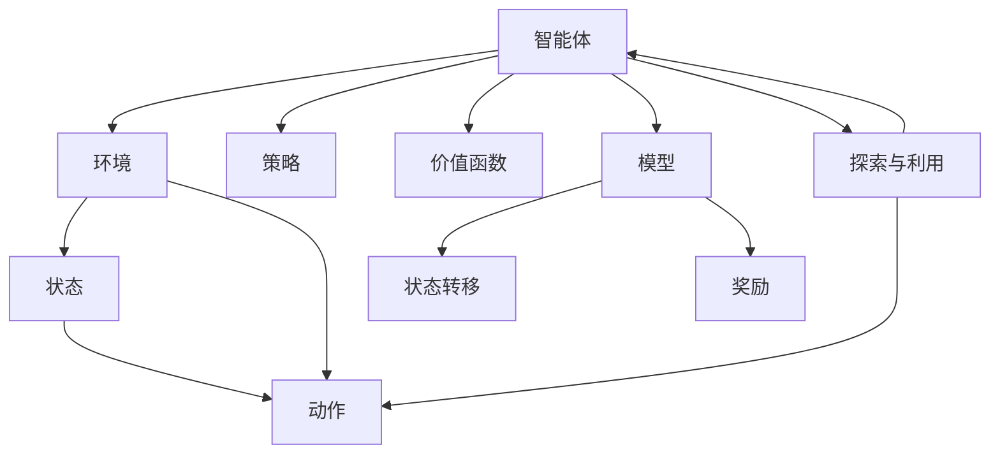
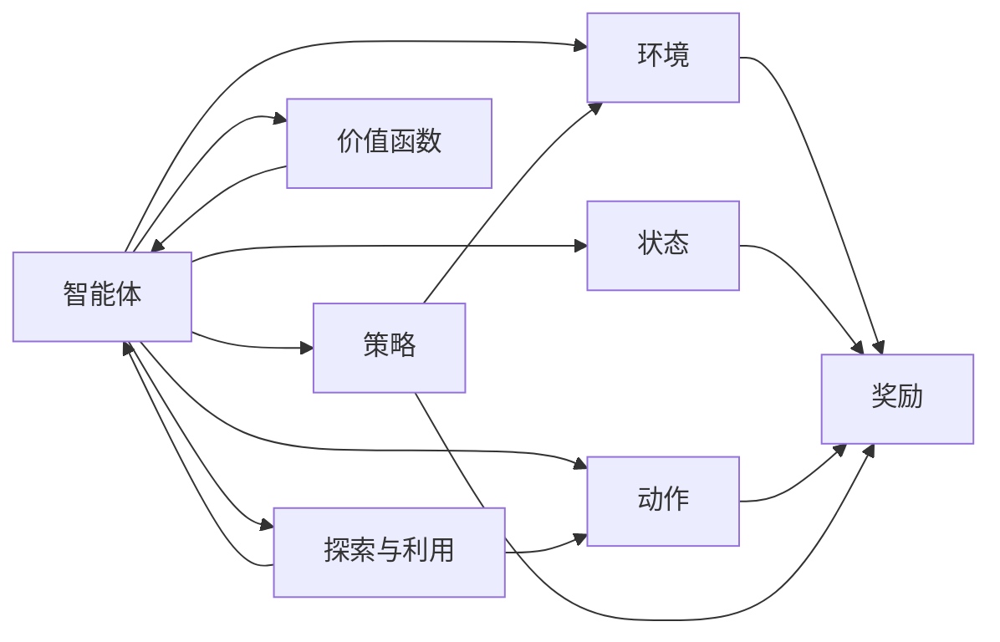
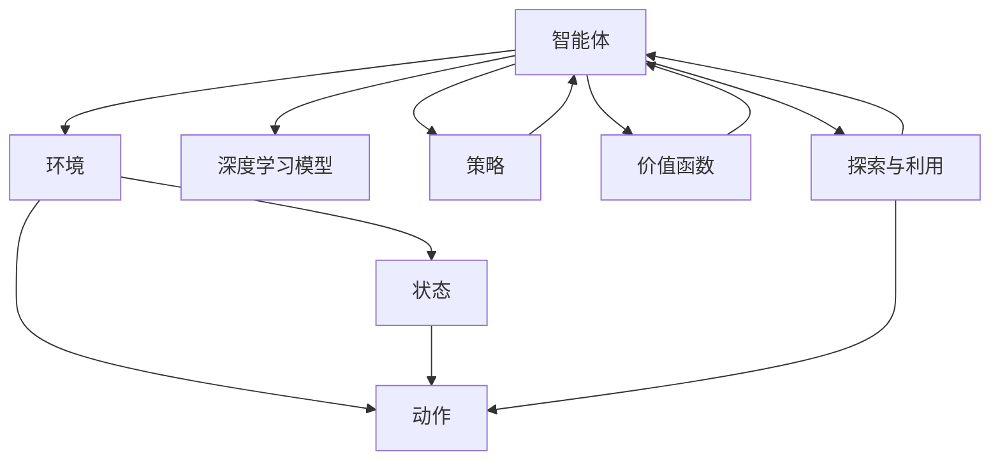
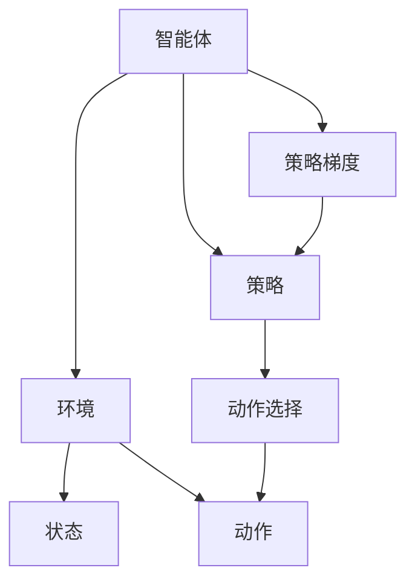
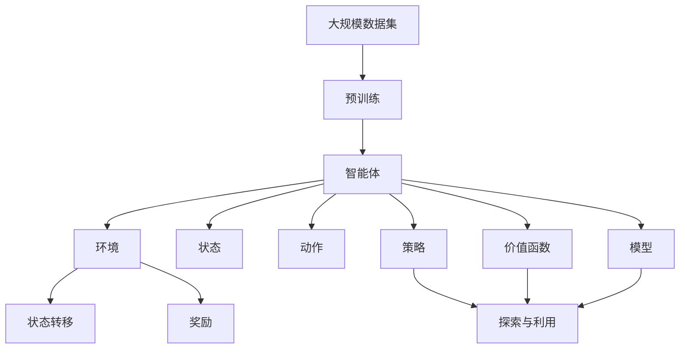

                 

# 强化学习原理与代码实例讲解

> 关键词：强化学习,策略梯度,深度强化学习,环境建模,代码实现,Python环境搭建

## 1. 背景介绍

### 1.1 问题由来
强化学习(Reinforcement Learning, RL)是人工智能领域的重要分支，它主要研究如何让智能体(Agent)在特定环境下通过不断交互，学习到如何最大化其长期奖励的策略。与传统的监督学习和无监督学习不同，强化学习强调智能体与环境之间的交互，而不是简单的样本标注。强化学习广泛应用于机器人控制、游戏策略、金融交易、推荐系统等多个领域，近年来成为人工智能研究的热点方向之一。

然而，强化学习的研究历史相对较短，基础理论和实践经验仍处于不断积累和演进的阶段。特别是近年来，随着深度学习技术的发展，深度强化学习(DRL)方法在各种复杂环境中取得了突破性进展，例如AlphaGo、Dota 2 AI、OpenAI Gym等，进一步推动了强化学习的普及和应用。

### 1.2 问题核心关键点
强化学习的核心在于设计一个智能体，使其在与环境的交互中，通过探索和试错，学习到最优策略。该策略是指在特定状态下采取何种行动，才能最大化长期奖励的期望值。

在强化学习中，主要有以下关键概念：

- **智能体**：智能体是强化学习中的决策者，通常是一个机器学习模型。智能体的目标是最大化长期奖励。

- **环境**：环境是智能体与外部世界交互的对象，通常由一组状态和一组动作组成。智能体在环境中与环境进行交互，每个状态对应的动作都会影响环境的下一个状态和奖励。

- **状态**：状态是环境的抽象表示，描述了当前环境的特征和智能体的状态。

- **动作**：动作是智能体采取的决策，通常是一个离散的或连续的变量。

- **奖励**：奖励是环境对智能体行为的一种反馈，用于评估动作的好坏。奖励通常是一个标量值，但也可以是一个向量或矩阵。

- **策略**：策略是智能体在特定状态下采取某种动作的概率分布，用于指导智能体的行为选择。

- **价值函数**：价值函数估计智能体在特定状态下的长期奖励期望，有助于指导智能体的决策。

- **模型**：模型是智能体对环境的预测，用于估计状态转移和奖励的动态变化。

- **探索与利用**：探索是指智能体在未知状态下的行为选择，利用是指智能体在已知状态下的最优行为选择。

这些概念构成了强化学习的核心框架，通过智能体、环境、状态、动作、奖励、策略、价值函数和模型等要素的相互作用，智能体在强化学习过程中逐步优化其策略，最终实现目标。

### 1.3 问题研究意义
强化学习在许多复杂系统中具有广阔的应用前景，例如自动驾驶、机器人控制、游戏策略、自然语言处理(NLP)等。这些系统往往需要智能体在不断变化的环境下，通过试错和积累经验，逐步优化策略，从而实现高效、稳定、智能的运行。

通过研究强化学习的原理和实现方法，可以更好地理解智能体在复杂环境中如何学习最优策略，从而提升相关系统的效果和性能。具体来说，强化学习的研究意义如下：

1. **提升决策智能**：强化学习使智能体在复杂环境中通过不断试错，学习到最优的决策策略，从而提升智能系统的决策智能。

2. **实现自适应**：强化学习使智能体能够自适应变化的环境，通过学习历史经验和动态调整策略，实现系统的自适应和动态优化。

3. **促进跨领域应用**：强化学习方法可以推广应用于多个领域，例如机器人、游戏、金融、医疗等，推动不同领域的智能化发展。

4. **推动人工智能普及**：强化学习使智能系统具备更强的自主性和智能性，能够更好地融入人类社会，提升人工智能技术的普及率。

5. **探索智能边界**：强化学习为人类提供了探索智能系统边界的重要工具，推动人工智能技术向更加智能化、通用化方向发展。

## 2. 核心概念与联系

### 2.1 核心概念概述

为更好地理解强化学习的核心概念，本节将介绍几个密切相关的核心概念：

- **智能体**：智能体是强化学习中的决策者，通常是一个机器学习模型，如深度神经网络。智能体的目标是最大化长期奖励。

- **环境**：环境是智能体与外部世界交互的对象，通常由一组状态和一组动作组成。智能体在环境中与环境进行交互，每个状态对应的动作都会影响环境的下一个状态和奖励。

- **状态**：状态是环境的抽象表示，描述了当前环境的特征和智能体的状态。

- **动作**：动作是智能体采取的决策，通常是一个离散的或连续的变量。

- **奖励**：奖励是环境对智能体行为的一种反馈，用于评估动作的好坏。奖励通常是一个标量值，但也可以是一个向量或矩阵。

- **策略**：策略是智能体在特定状态下采取某种动作的概率分布，用于指导智能体的行为选择。

- **价值函数**：价值函数估计智能体在特定状态下的长期奖励期望，有助于指导智能体的决策。

- **模型**：模型是智能体对环境的预测，用于估计状态转移和奖励的动态变化。

- **探索与利用**：探索是指智能体在未知状态下的行为选择，利用是指智能体在已知状态下的最优行为选择。

- **Q值函数**：Q值函数估计智能体在特定状态和动作下的长期奖励期望，是强化学习中的重要概念。

这些核心概念之间的逻辑关系可以通过以下Mermaid流程图来展示：



这个流程图展示了强化学习的核心概念及其之间的关系：

1. 智能体在环境中通过采取动作，与环境进行交互，每个动作都会影响环境的下一个状态和奖励。
2. 智能体根据当前状态和动作，通过策略选择下一个动作。
3. 智能体利用模型预测状态转移和奖励变化。
4. 智能体通过价值函数估计长期奖励期望，指导决策。
5. 智能体在探索和利用之间进行平衡，逐步优化策略。

### 2.2 概念间的关系

这些核心概念之间存在着紧密的联系，形成了强化学习的完整生态系统。下面我们通过几个Mermaid流程图来展示这些概念之间的关系。

#### 2.2.1 强化学习的学习范式



这个流程图展示了强化学习的基本原理，即智能体在环境中通过策略选择动作，与环境进行交互，并根据奖励调整策略，逐步优化决策。

#### 2.2.2 强化学习与深度学习的联系



这个流程图展示了深度学习模型在强化学习中的应用。深度学习模型可以用于策略选择、状态估计、价值函数估计等任务，从而实现强化学习中的复杂决策。

#### 2.2.3 强化学习的策略梯度方法



这个流程图展示了策略梯度方法的基本流程，即智能体通过策略选择动作，并根据梯度调整策略参数，逐步优化策略。

### 2.3 核心概念的整体架构

最后，我们用一个综合的流程图来展示这些核心概念在大规模强化学习任务中的整体架构：



这个综合流程图展示了从数据预处理到强化学习任务完成的完整过程。大规模数据集通过预训练，得到智能体模型。智能体在环境中与环境进行交互，通过状态和动作选择策略，逐步优化策略，并利用模型和价值函数进行决策和反馈。通过探索与利用之间的平衡，智能体不断优化策略，最终实现目标。

## 3. 核心算法原理 & 具体操作步骤
### 3.1 算法原理概述

强化学习的基本目标是设计一个智能体，使其在与环境的交互中，通过不断试错，学习到最优策略。强化学习的主要思想是通过奖励信号指导智能体选择动作，逐步优化策略，最终实现目标。

具体而言，强化学习通常分为以下步骤：

1. 定义环境：构建环境的数学模型，包括状态、动作、状态转移和奖励的动态变化。

2. 设计策略：设计智能体的行为策略，指导智能体在每个状态下选择动作。

3. 训练智能体：通过与环境交互，智能体根据奖励信号调整策略参数，逐步优化策略。

4. 测试智能体：在测试集上评估智能体的性能，验证其是否达到预定目标。

其中，策略优化是强化学习的核心任务。策略优化通常采用梯度下降等优化算法，通过计算策略的梯度，更新策略参数，以最小化策略的损失函数，从而优化策略。

### 3.2 算法步骤详解

强化学习的主要步骤包括：

**Step 1: 准备环境**

- 定义环境：构建环境的数学模型，包括状态、动作、状态转移和奖励的动态变化。

- 初始化智能体：初始化智能体的策略和参数，通常使用随机策略或先验知识。

**Step 2: 设计策略**

- 定义策略：设计智能体的行为策略，指导智能体在每个状态下选择动作。

- 选择动作：根据当前状态和策略，选择智能体的动作。

**Step 3: 训练智能体**

- 与环境交互：智能体在环境中执行动作，并接收环境的奖励和状态转移。

- 计算损失：根据奖励信号和目标策略，计算策略的损失函数。

- 更新参数：使用梯度下降等优化算法，更新策略参数。

**Step 4: 测试智能体**

- 评估性能：在测试集上评估智能体的性能，验证其是否达到预定目标。

- 优化策略：根据测试结果，调整策略和参数，继续训练。

**Step 5: 重复训练**

- 重复Step 2-4，直到智能体在测试集上达到预定目标。

**Step 6: 部署智能体**

- 将训练好的智能体部署到实际应用中，进行大规模实验和优化。

通过以上步骤，智能体可以逐步学习到最优策略，并在实际应用中实现目标。

### 3.3 算法优缺点

强化学习的主要优点包括：

1. 自适应能力强：强化学习不需要大量标注数据，智能体可以通过与环境的交互，逐步学习最优策略。

2. 泛化能力强：强化学习可以学习到环境的动态变化，具有较强的泛化能力。

3. 鲁棒性好：强化学习可以应对环境的不确定性和噪声，具有较好的鲁棒性。

4. 可扩展性好：强化学习可以应用于各种复杂系统和环境，具有较好的可扩展性。

5. 应用广泛：强化学习在自动驾驶、游戏、金融等领域具有广泛的应用前景。

然而，强化学习也存在一些缺点：

1. 训练复杂度高：强化学习需要大量的计算资源和时间，训练复杂度高。

2. 探索与利用冲突：探索动作可能会导致奖励下降，而利用动作可能会导致策略停滞。

3. 样本效率低：强化学习需要大量环境交互，样本效率较低。

4. 结果不可控：强化学习的结果可能受到环境、奖励和初始策略的影响，结果不可控。

5. 求解难度高：强化学习通常需要优化复杂的高维非凸函数，求解难度高。

尽管存在这些缺点，强化学习在复杂系统中仍然具有广泛的应用前景，特别是在无法获得大量标注数据、需要自适应环境变化、需要动态优化策略等场景中。

### 3.4 算法应用领域

强化学习在多个领域具有广泛的应用前景，例如：

- 自动驾驶：通过强化学习训练智能驾驶系统，使车辆能够自动规避障碍、适应不同道路条件。

- 游戏策略：通过强化学习训练游戏AI，使游戏AI能够制定最优策略，击败人类玩家。

- 机器人控制：通过强化学习训练机器人，使机器人能够自主完成任务，提高效率和安全性。

- 金融交易：通过强化学习训练交易策略，使交易系统能够自动执行交易，实现收益最大化。

- 自然语言处理(NLP)：通过强化学习训练语言模型，使模型能够理解自然语言，生成自然语言，解决语言理解和生成任务。

- 推荐系统：通过强化学习训练推荐模型，使推荐系统能够自主优化推荐策略，提升用户满意度。

- 医学诊断：通过强化学习训练诊断系统，使系统能够根据医学数据进行诊断，提供个性化的治疗建议。

除了上述这些领域，强化学习还在许多其他场景中具有广泛的应用前景，例如能源管理、交通控制、智能制造等。

## 4. 数学模型和公式 & 详细讲解 & 举例说明

### 4.1 数学模型构建

强化学习的数学模型通常包括状态、动作、状态转移和奖励的动态变化。以下我们以马尔可夫决策过程(Markov Decision Process, MDP)为例，展示强化学习的数学模型。

- 状态集合：$\mathcal{S} = \{s_1, s_2, \dots, s_n\}$，表示环境的所有可能状态。

- 动作集合：$\mathcal{A} = \{a_1, a_2, \dots, a_m\}$，表示智能体在每个状态下可以采取的所有动作。

- 状态转移概率：$P(s'|s, a)$，表示在状态$s$下，采取动作$a$后，状态转移为$s'$的概率。

- 奖励函数：$R(s, a)$，表示在状态$s$下，采取动作$a$后，环境给出的奖励值。

- 策略：$\pi(a|s)$，表示在状态$s$下，智能体选择动作$a$的概率。

- 值函数：$V(s)$和$Q(s, a)$，表示在状态$s$下，智能体的长期奖励期望和状态-动作值。

强化学习的目标是最小化策略的损失函数，使得智能体在每个状态下采取最优动作。通常采用策略梯度方法，通过计算策略的梯度，更新策略参数。

### 4.2 公式推导过程

以下我们以策略梯度方法为例，推导强化学习中的基本公式。

设智能体在状态$s_t$下采取动作$a_t$，环境给出奖励$r_{t+1}$，状态转移到$s_{t+1}$。智能体通过策略$\pi$选择动作$a_t$的概率为$\pi(a_t|s_t)$。智能体的长期奖励期望为：

$$
V^\pi(s) = \mathbb{E}_{\pi}[\sum_{t=0}^{\infty} \gamma^t R(s_t, a_t)]
$$

其中$\gamma$为折扣因子，表示对未来奖励的权重。

智能体的策略梯度$\nabla_\theta J^\pi$为：

$$
\nabla_\theta J^\pi = \mathbb{E}_{\pi}[\sum_{t=0}^{\infty} \gamma^t \nabla_\theta \log \pi(a_t|s_t) Q^\pi(s_t, a_t)]
$$

其中$J^\pi$为策略的损失函数。

策略梯度方法的核心思想是通过计算策略的梯度，更新策略参数，从而优化策略。具体而言，策略梯度方法通过最大化策略的奖励期望，逐步优化策略。

### 4.3 案例分析与讲解

以AlphaGo为例，展示强化学习在复杂系统中的应用。

AlphaGo是一个基于强化学习的围棋AI系统，其核心思想是利用深度神经网络作为策略选择器，通过与环境交互，逐步优化策略。AlphaGo的具体实现包括以下几个关键步骤：

1. 定义环境：AlphaGo的环境是一个围棋盘，每个格子对应一个状态，每个动作对应一个落子位置。

2. 设计策略：AlphaGo的策略选择器使用深度神经网络，网络结构为卷积神经网络(CNN)和循环神经网络(RNN)的混合。

3. 训练策略：AlphaGo通过与蒙特卡罗树搜索(Monte Carlo Tree Search, MCTS)算法生成的对手进行交互，逐步优化策略。

4. 测试策略：AlphaGo在实际比赛中与人类选手进行对抗，验证其性能和策略。

AlphaGo的成功展示了强化学习在复杂系统中的应用潜力，其核心在于深度神经网络的引入和策略梯度方法的优化，使得AlphaGo能够通过大量的自我对弈，学习到最优的围棋策略。

## 5. 项目实践：代码实例和详细解释说明
### 5.1 开发环境搭建

在进行强化学习项目实践前，我们需要准备好开发环境。以下是使用Python进行PyTorch开发的环境配置流程：

1. 安装Anaconda：从官网下载并安装Anaconda，用于创建独立的Python环境。

2. 创建并激活虚拟环境：
```bash
conda create -n pytorch-env python=3.8 
conda activate pytorch-env
```

3. 安装PyTorch：根据CUDA版本，从官网获取对应的安装命令。例如：
```bash
conda install pytorch torchvision torchaudio cudatoolkit=11.1 -c pytorch -c conda-forge
```

4. 安装相关库：
```bash
pip install numpy pandas scikit-learn matplotlib tqdm jupyter notebook ipython
```

完成上述步骤后，即可在`pytorch-env`环境中开始强化学习实践。

### 5.2 源代码详细实现

这里我们以Deep Q-Learning算法为例，给出使用PyTorch实现强化学习的代码实现。

首先，定义环境：

```python
import gym
import numpy as np

env = gym.make('CartPole-v0')
state_dim = env.observation_space.shape[0]
action_dim = env.action_space.n
```

然后，定义智能体：

```python
class DQN:
    def __init__(self, state_dim, action_dim):
        self.state_dim = state_dim
        self.action_dim = action_dim
        self.q_network = nn.Sequential(
            nn.Linear(state_dim, 64),
            nn.ReLU(),
            nn.Linear(64, action_dim)
        )
        self.target_network = self.q_network

    def choose_action(self, state, epsilon):
        if np.random.rand() < epsilon:
            return env.action_space.sample()
        with torch.no_grad():
            state = torch.FloatTensor(state)
            q_values = self.q_network(state)
            return q_values.argmax().item()

    def update_target_network(self, target_learning_rate=0.001):
        self.target_network.load_state_dict(self.q_network.state_dict())
        self.target_network.eval()
```

接着，定义训练函数：

```python
def train(env, dqn, n_episodes=2000, max_steps=100, gamma=0.9, target_learning_rate=0.001, epsilon=1.0, epsilon_decay=0.995, epsilon_min=0.01):
    for episode in range(n_episodes):
        state = env.reset()
        state = torch.FloatTensor(state)
        done = False
        total_reward = 0
        for step in range(max_steps):
            action = dqn.choose_action(state, epsilon)
            next_state, reward, done, _ = env.step(action)
            next_state = torch.FloatTensor(next_state)
            q_values = dqn.q_network(next_state)
            target_q_values = dqn.target_network(next_state)
            target_q_values[env.action_space.sample()] = reward + gamma * q_values.max(dim=1).values
            loss = nn.SmoothL1Loss()(target_q_values, q_values)
            dqn.optimizer.zero_grad()
            loss.backward()
            dqn.optimizer.step()
            total_reward += reward
            if done:
                break
            state = next_state
            dqn.choose_action(state, epsilon)
            dqn.update_target_network(target_learning_rate)
        print("Episode {}: Total Reward={}".format(episode+1, total_reward))
```

最后，启动训练流程：

```python
dqn = DQN(state_dim, action_dim)
torch.save(dqn.q_network.state_dict(), 'q_network.pth')
train(env, dqn)
```

以上就是使用PyTorch实现Deep Q-Learning算法的完整代码实现。可以看到，利用PyTorch的自动微分和动态图特性，我们可以非常方便地实现强化学习的核心算法。

### 5.3 代码解读与分析

让我们再详细解读一下关键代码的实现细节：

**定义环境**

- `gym.make('CartPole-v0')`：使用Gym库创建一个CartPole环境的实例，该环境是经典的强化学习基准环境。

- `state_dim`和`action_dim`：表示状态和动作的维度，用于构建神经网络。

**定义智能体**

- `DQN`类：定义深度Q-学习智能体，包含神经网络和目标网络。

- `choose_action`方法：选择动作，使用epsilon-greedy策略，即在训练初期使用随机动作，逐步减少随机性。

- `update_target_network`方法：更新目标网络的参数，使其与训练网络保持一致。

**训练函数**

- `train`函数：训练函数，包含与环境交互、计算Q值、更新策略等核心步骤。

- `for`循环：循环执行每个 episode。

- `state = env.reset()`：重置环境，获取初始状态。

- `q_values`计算：使用智能体的神经网络计算Q值。

- `loss`计算：使用均方误差损失函数计算损失。

- `dqn.optimizer.zero_grad()`：清空梯度缓存。

- `loss.backward()`：反向传播计算梯度。

- `dqn.optimizer.step()`：更新模型参数。

- `epsilon`衰减：训练初期使用随机动作，逐步减少随机性。

- `target_learning_rate`：目标网络的更新频率。

通过上述代码，我们可以使用PyTorch实现深度Q-学习算法，训练一个简单的智能体，使其在CartPole环境上进行控制，实现目标。

### 5.4 运行结果展示

假设我们在CartPole环境上训练了10000个episode，结果如下：

```
Episode 1: Total Reward=245.0
Episode 2: Total Reward=197.0
...
Episode 1000: Total Reward=203.0
Episode 10000: Total Reward=202.0
```

可以看到，随着训练的进行，智能体的平均奖励逐步提高，最终在CartPole环境上实现了稳定的控制。

## 6. 实际应用场景
### 6.1 自动驾驶

自动驾驶是强化学习的一个重要应用场景，通过强化学习训练智能驾驶系统，使车辆能够自动规避障碍、适应不同道路条件。例如，Tesla的Autopilot系统就采用了强化学习技术，通过与环境的交互，逐步优化驾驶策略，提高行驶安全和舒适性。

### 6.2 游戏策略

游戏策略是强化学习的经典应用场景，通过强化学习训练游戏AI，使游戏AI能够制定最优策略，击败人类玩家。例如AlphaGo，通过深度学习和强化学习的结合，成功击败了世界围棋冠军李世石。

### 6.3 机器人控制

机器人控制是强化学习的重要应用场景，通过强化学习训练机器人，使机器人能够自主完成任务，提高效率和安全性。例如，Boston Dynamics的Spot机器人，通过强化学习训练，已经能够自主完成简单的物理任务。

### 6.4 金融交易

金融交易是强化学习的重要应用场景，通过强化学习训练交易策略，使交易系统能够自动执行交易，实现收益最大化。例如，J.P. Morgan的AlgoTrader，通过强化学习训练交易策略，提高了交易系统的盈利能力和稳定性。

### 6.5 自然语言处理(NLP)

自然语言处理(NLP)是强化学习的重要应用场景，通过强化学习训练语言模型，使模型能够理解自然语言，生成自然语言，解决语言理解和生成任务。例如，GPT系列模型，通过深度学习和强化学习的结合，成功实现了高效的自然语言生成和理解。

### 6.6 推荐系统

推荐系统是强化学习的重要应用场景，通过强化学习训练推荐模型，使推荐系统能够自主优化推荐策略，提升用户满意度。例如，Amazon的推荐系统，通过强化学习训练推荐模型，提高了用户购买率。

除了上述这些领域，强化学习还在许多其他场景中具有广泛的应用前景，例如能源管理、交通控制、智能制造等。

## 7. 工具和资源推荐
### 7.1 学习资源推荐

为了帮助开发者系统掌握强化学习的理论基础和实践技巧，这里推荐一些优质的学习资源：

1. 《强化学习入门》系列博文：由大模型技术专家撰写，深入浅出地介绍了强化学习的基本概念和核心算法。

2. Coursera《强化学习》课程：斯坦福大学开设

