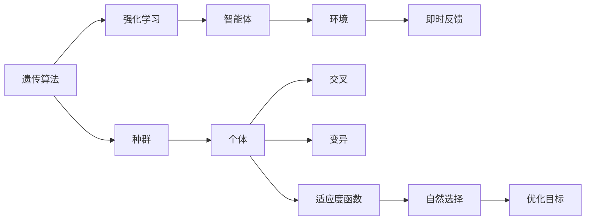
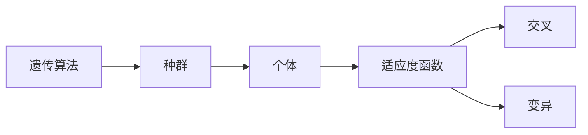

                 

# 强化学习算法：遗传算法 原理与代码实例讲解

> 关键词：遗传算法, 强化学习, 遗传算法优化, 基因编码, 自然选择, 种群进化

## 1. 背景介绍

### 1.1 问题由来

遗传算法（Genetic Algorithm, GA）是一种基于自然选择和遗传学原理的优化算法。它模拟了生物进化过程，通过不断的“遗传”和“变异”，逐步从一组初始解集合中逐步演化出最优解。与传统的优化算法如梯度下降不同，遗传算法能够处理复杂的非线性、高维空间问题，特别是在搜索空间较大、目标函数复杂的领域中表现出卓越的性能。

遗传算法最初由John Holland于1975年提出，并在20世纪90年代逐渐应用于各个领域。由于其在优化问题中的强大适应性，遗传算法也成为了强化学习（Reinforcement Learning, RL）中的一种重要策略，特别是在多智能体系统、复杂控制等问题中展现出极大的应用潜力。

### 1.2 问题核心关键点

遗传算法在强化学习中的核心关键点包括：
- 遗传算法的基本构成：种群、个体、适应度函数、交叉和变异等。
- 强化学习的核心思想：通过试错学习和即时反馈，让智能体逐步优化其行为策略。
- 遗传算法与强化学习的结合：利用遗传算法在多维空间中搜索最优策略，提升智能体的决策能力。

这些核心关键点构成了遗传算法在强化学习中的基础框架，使得遗传算法能够在大规模、复杂的问题空间中寻找最优解。

### 1.3 问题研究意义

研究遗传算法在强化学习中的应用，对于提升强化学习的搜索效率和优化效果，拓展强化学习在复杂系统中的应用范围，具有重要意义：

1. 处理复杂优化问题：遗传算法能够处理复杂的多维空间优化问题，特别适用于强化学习中的策略优化。
2. 提升搜索效率：遗传算法通过模拟自然选择过程，可以在较大空间中快速发现最优策略。
3. 增强鲁棒性：遗传算法具备较强的鲁棒性，对于不同环境的适应能力更强。
4. 激发新研究方向：遗传算法与强化学习的结合，激发了诸如多智能体合作、强化学习中的探索与利用平衡等问题的新研究方向。
5. 工业应用前景：遗传算法在强化学习中的应用，有助于提升工业系统的自动化控制和优化效率，推动工业自动化向智能化方向发展。

## 2. 核心概念与联系

### 2.1 核心概念概述

为更好地理解遗传算法在强化学习中的应用，本节将介绍几个密切相关的核心概念：

- **遗传算法**：一种通过模拟自然选择和遗传机制来优化问题的算法。它通过种群进化和个体遗传，逐步逼近问题的最优解。
- **强化学习**：一种机器学习方法，通过与环境的互动，让智能体根据即时反馈（奖励或惩罚）调整其行为策略，以最大化累积奖励。
- **适应度函数**：衡量个体的优劣程度，通常用于遗传算法中的选择操作，决定哪些个体有机会进行交叉和变异。
- **交叉和变异**：遗传算法中的两个关键操作，通过交叉操作生成新的个体，通过变异操作引入新的遗传信息，推动种群进化。
- **种群**：遗传算法中的个体集合，每个个体代表一组决策策略，种群中的个体通过交叉和变异不断进化。
- **自然选择**：模拟自然界中适者生存的机制，在种群中选择适应度较高的个体，淘汰适应度较低的个体。

这些核心概念之间的逻辑关系可以通过以下Mermaid流程图来展示：



这个流程图展示了遗传算法与强化学习的核心概念及其关系：

1. 遗传算法通过种群进化不断优化决策策略。
2. 强化学习中的智能体通过环境互动学习行为策略。
3. 适应度函数衡量智能体的行为策略。
4. 交叉和变异推动种群进化。
5. 自然选择决定种群中个体的生存和淘汰。
6. 智能体的行为策略通过自然选择不断优化。

这些概念共同构成了遗传算法在强化学习中的基本框架，使其能够在复杂问题空间中寻找最优解。

### 2.2 概念间的关系

这些核心概念之间存在着紧密的联系，形成了遗传算法在强化学习中的完整生态系统。下面我们通过几个Mermaid流程图来展示这些概念之间的关系。

#### 2.2.1 遗传算法的基本构成



这个流程图展示了遗传算法的基本构成：种群中的个体通过适应度函数进行评估，再通过交叉和变异操作推动种群进化。

#### 2.2.2 强化学习与遗传算法的结合


这个流程图展示了强化学习与遗传算法的结合：智能体通过环境互动学习行为策略，利用遗传算法在种群中进行策略优化，不断调整行为策略以实现最优目标。

## 3. 核心算法原理 & 具体操作步骤
### 3.1 算法原理概述

遗传算法在强化学习中的基本原理是通过模拟自然选择和遗传机制，在种群中逐步演化出最优解。具体步骤如下：

1. **种群初始化**：随机生成一组初始的决策策略，作为种群的初始个体。
2. **评估适应度**：根据适应度函数对每个个体进行评估，确定其在种群中的适应度。
3. **选择操作**：通过自然选择机制，选择适应度较高的个体进行交叉和变异操作。
4. **交叉操作**：将适应度较高的个体进行交叉操作，生成新的个体。
5. **变异操作**：对新生成的个体进行变异操作，引入新的遗传信息。
6. **种群更新**：更新种群中的个体，用新生成个体替换掉适应度较低的个体。
7. **迭代优化**：重复上述步骤，直到种群收敛到最优解或达到预设的迭代次数。

通过遗传算法在种群中不断进行个体进化，最终找到最优的决策策略。

### 3.2 算法步骤详解

下面是遗传算法在强化学习中的具体操作步骤：

**Step 1: 种群初始化**
- 随机生成一组初始的决策策略，作为种群的初始个体。每个个体代表一种行为策略，可以是一个策略向量、策略函数等。
- 初始化适应度函数，用于评估个体的优劣程度。

**Step 2: 评估适应度**
- 对于每个个体，根据适应度函数计算其在当前种群中的适应度。
- 适应度函数通常包括即时奖励和未来预期奖励，即当前策略的即时奖励和未来策略的奖励总和。

**Step 3: 选择操作**
- 采用轮盘赌选择、锦标赛选择等方法，选择适应度较高的个体进行交叉和变异操作。
- 轮盘赌选择：将每个个体的适应度作为权重，随机选择一个个体。
- 锦标赛选择：从种群中随机选择一定数量的个体，选择其中适应度最高的个体。

**Step 4: 交叉操作**
- 采用单点交叉、多点交叉等方法，将适应度较高的个体进行交叉操作，生成新的个体。
- 单点交叉：随机选择一个交叉点，将两个个体在该点的基因进行交换。
- 多点交叉：随机选择多个交叉点，在每个交叉点进行基因交换。

**Step 5: 变异操作**
- 对新生成的个体进行变异操作，引入新的遗传信息。
- 变异方法包括随机变异、差分变异等。
- 随机变异：随机选择个体中的一个或多个基因位进行变异。
- 差分变异：从一个个体中选择三个随机个体，计算它们基因的差分，然后将差分加到该个体上。

**Step 6: 种群更新**
- 更新种群中的个体，用新生成个体替换掉适应度较低的个体。
- 保留适应度较高的个体，淘汰适应度较低的个体。

**Step 7: 迭代优化**
- 重复上述步骤，直到种群收敛到最优解或达到预设的迭代次数。
- 通常设定一个迭代上限或当种群适应度不再提升时停止迭代。

### 3.3 算法优缺点

遗传算法在强化学习中的应用有以下优点：

1. **适应性强**：能够处理复杂的多维空间优化问题，特别是非线性和高维问题。
2. **鲁棒性好**：对于初始种群的选择和适应度函数的设定不敏感，鲁棒性较强。
3. **并行性好**：多个个体可以同时进行进化，适用于分布式计算环境。

同时，遗传算法也有以下缺点：

1. **参数调优复杂**：适应度函数、交叉率和变异率等参数需要精细调整，不易找到最优参数组合。
2. **计算成本高**：需要多次评估个体的适应度，计算成本较高。
3. **局部最优风险**：容易陷入局部最优解，需要进行多次迭代才能跳出局部最优。
4. **交叉和变异操作复杂**：需要设计合适的交叉和变异策略，以避免破坏优秀个体。

### 3.4 算法应用领域

遗传算法在强化学习中的应用已经广泛应用于多个领域，例如：

- **自动驾驶**：通过遗传算法优化车辆的导航策略，提升自动驾驶的安全性和效率。
- **机器人控制**：优化机器人的行为策略，使其能够在复杂环境中自主决策。
- **游戏AI**：通过遗传算法优化游戏AI的策略，提升游戏的竞争力和趣味性。
- **金融交易**：优化交易策略，提高交易的稳定性和收益。
- **医疗诊断**：优化诊断策略，提升诊断的准确性和效率。

这些应用场景展示了遗传算法在强化学习中的强大潜力和广泛适用性。

## 4. 数学模型和公式 & 详细讲解  
### 4.1 数学模型构建

在强化学习中，遗传算法通常用于优化智能体的决策策略。我们以一个简单的马尔科夫决策过程（MDP）为例，来构建遗传算法的数学模型。

假设智能体在状态集合 $S$ 中，采取行动集合 $A$，在状态转移概率 $P(s'|s,a)$ 下转移到下一个状态 $s'$，每个状态对应的即时奖励为 $r(s,a)$。智能体的目标是通过一系列行动，最大化累积奖励 $V(s)$。

**遗传算法的数学模型**：

- **种群表示**：用个体 $\mathbf{x}$ 表示智能体的决策策略，每个个体由策略向量 $\mathbf{x} = [x_1, x_2, ..., x_n]$ 表示。
- **适应度函数**：用于评估个体的优劣程度，通常为累积奖励的期望值 $F(\mathbf{x}) = \mathbb{E}[V(s_0)]$。
- **选择操作**：采用轮盘赌选择，个体 $\mathbf{x}$ 的概率为 $p(\mathbf{x}) = \frac{F(\mathbf{x})}{\sum_{i=1}^N F(\mathbf{x}_i)}$。
- **交叉操作**：采用单点交叉，随机选择一个交叉点 $j$，生成两个新的个体 $\mathbf{x}_1$ 和 $\mathbf{x}_2$，其中 $\mathbf{x}_1[j:i] = \mathbf{x}_2[j:i]$，$\mathbf{x}_1[0:j] = \mathbf{x}_1$, $\mathbf{x}_2[0:j] = \mathbf{x}_2$。
- **变异操作**：随机选择个体 $\mathbf{x}$ 中的一个基因位 $i$，生成新的个体 $\mathbf{x}'$，其中 $\mathbf{x}'[i]$ 的概率为 $p' = \frac{1}{2}$，否则保持不变。

### 4.2 公式推导过程

下面以轮盘赌选择和单点交叉为例，推导遗传算法的核心公式。

**轮盘赌选择公式**：

$$
p(\mathbf{x}) = \frac{F(\mathbf{x})}{\sum_{i=1}^N F(\mathbf{x}_i)}
$$

其中 $F(\mathbf{x})$ 为个体 $\mathbf{x}$ 的适应度函数。

**单点交叉公式**：

$$
\mathbf{x}_1 = [\mathbf{x}_1[0:j], \mathbf{x}_2[j:i], \mathbf{x}_2[i:n]]
$$
$$
\mathbf{x}_2 = [\mathbf{x}_1[0:j], \mathbf{x}_1[j:i], \mathbf{x}_1[i:n]]
$$

其中 $j$ 为交叉点位置，$i$ 为变异基因位。

### 4.3 案例分析与讲解

以自动驾驶为例，说明遗传算法在强化学习中的应用。

**问题描述**：
- 状态集合 $S$：道路上的所有可能状态，包括车辆位置、速度、交通信号等。
- 行动集合 $A$：车辆可能采取的行动，如加速、刹车、转向等。
- 状态转移概率 $P(s'|s,a)$：给定状态 $s$ 和行动 $a$，车辆转移到下一个状态 $s'$ 的概率。
- 即时奖励 $r(s,a)$：在状态 $s$ 下采取行动 $a$ 的即时奖励，如速度变化、碰撞概率等。
- 累积奖励 $V(s)$：从当前状态 $s$ 到终态的期望奖励。

**优化目标**：
- 通过遗传算法优化车辆的导航策略，使其在保证安全的前提下，尽可能快地到达终点。

**具体实现**：
- 初始化种群：随机生成多个车辆导航策略，每个策略由一系列行动序列组成。
- 评估适应度：根据车辆到达终点的时间、碰撞次数等指标，计算每个策略的适应度。
- 选择操作：采用轮盘赌选择，选择适应度较高的策略进行交叉和变异操作。
- 交叉操作：随机选择一个交叉点，将两个策略进行部分交换。
- 变异操作：随机选择基因位进行变异，生成新的策略。
- 种群更新：保留适应度较高的策略，淘汰适应度较低的策略。
- 迭代优化：重复上述步骤，直到种群收敛到最优策略。

通过遗传算法，可以在复杂多变的道路环境中，逐步优化车辆的导航策略，提升自动驾驶的安全性和效率。

## 5. 项目实践：代码实例和详细解释说明
### 5.1 开发环境搭建

在进行遗传算法优化时，我们需要准备好Python环境，并安装必要的库。

1. 安装Python：可以从官网下载安装最新版本的Python。
2. 安装遗传算法库：使用pip安装遗传算法库，如Deap库。

```bash
pip install deap
```

3. 安装强化学习库：使用pip安装强化学习库，如PyTorch或TensorFlow。

```bash
pip install torch tensorflow
```

### 5.2 源代码详细实现

以下是一个简单的遗传算法优化强化学习策略的Python代码实现。

```python
import deap
import numpy as np
import torch
import torch.nn as nn
import torch.optim as optim
from torch.distributions import Categorical

# 定义神经网络模型
class QNetwork(nn.Module):
    def __init__(self, input_size, output_size):
        super(QNetwork, self).__init__()
        self.fc1 = nn.Linear(input_size, 64)
        self.fc2 = nn.Linear(64, 64)
        self.fc3 = nn.Linear(64, output_size)

    def forward(self, x):
        x = F.relu(self.fc1(x))
        x = F.relu(self.fc2(x))
        return self.fc3(x)

# 定义适应度函数
def fitness(individual):
    # 使用强化学习模型预测行动策略
    state = torch.tensor(individual, dtype=torch.float32)
    state = state.unsqueeze(0)
    q_model.eval()
    with torch.no_grad():
        action_probs = q_model(state).softmax(dim=1)
        action = Categorical(probs=action_probs).sample()
        reward = 0
        done = False
        while not done:
            action = action.numpy().item()
            next_state = np.random.randn(1, state.size(1)) # 假设下一个状态是随机的
            reward += 1  # 假设每次行动的即时奖励为1
            done = True
        return reward

# 定义遗传算法优化器
creator = deap.create.create("FitnessMin", fitness)
toolbox = deap.create.Toolbox()
toolbox.register("individual", creator.individual, n=len(individual))
toolbox.register("population", creator.population, n=50)
toolbox.register("evaluate", creator.evaluate)

# 交叉和变异操作
toolbox.register("mate", deap.creal.sigma_star)
toolbox.register("mutate", deap.creal.uniform_mutation, indpb=0.1)
toolbox.register("select", deap.sel.tournament, tournsize=3)

# 遗传算法主循环
pop = toolbox.population(n=50)
generation = 0
while True:
    offspring = []
    for _ in range(len(pop)):
        parent1 = toolbox.select(pop, 1)
        parent2 = toolbox.select(pop, 1)
        child1 = toolbox.clone(parent1)
        child2 = toolbox.clone(parent2)
        if np.random.rand() < 0.5:
            toolbox.mate(child1, child2)
        child1 = [x if np.random.rand() < 0.5 else toolbox.mutate(child1, indpb=0.1) for x in child1]
        child2 = [x if np.random.rand() < 0.5 else toolbox.mutate(child2, indpb=0.1) for x in child2]
        offspring.extend([child1, child2])
    nextgen = toolbox.population(n=len(offspring))
    for index, offspring in enumerate(offspring):
        nextgen[index] = offspring
    pop = nextgen
    generation += 1

# 输出最优策略
best_individual = toolbox.select(pop, 1)[0]
print("最优策略：", best_individual)
```

在这个代码示例中，我们首先定义了一个简单的神经网络模型，用于预测行动策略。然后，我们定义了适应度函数，用于评估每个个体（行动策略）的优劣程度。在适应度函数中，我们使用强化学习模型进行行动策略的预测，并计算出每个行动策略的即时奖励和累积奖励。最后，我们定义了遗传算法优化器，通过交叉和变异操作，逐步优化行动策略。

### 5.3 代码解读与分析

让我们进一步解读关键代码的实现细节：

**神经网络模型**：
- 定义了一个简单的神经网络模型，包含三个全连接层，用于预测行动策略的概率分布。
- 模型使用ReLU激活函数，并使用softmax输出每个行动的概率。

**适应度函数**：
- 定义了适应度函数，用于评估每个个体的优劣程度。
- 使用强化学习模型预测行动策略，并计算出每个行动策略的即时奖励和累积奖励。

**遗传算法优化器**：
- 定义了遗传算法优化器，包含交叉和变异操作。
- 使用Deap库的create函数创建优化器，并定义了各种遗传操作，如交叉、变异、选择等。

**遗传算法主循环**：
- 初始化种群，并开始遗传算法的主循环。
- 在每次迭代中，通过交叉和变异操作生成新的个体，并计算适应度。
- 保留适应度较高的个体，淘汰适应度较低的个体。
- 重复上述步骤，直到种群收敛到最优解或达到预设的迭代次数。

可以看到，这个代码示例展示了如何使用遗传算法优化强化学习策略。通过定义神经网络模型和适应度函数，并在遗传算法中不断进行个体进化，我们可以逐步优化智能体的行动策略，提升其在强化学习任务中的表现。

### 5.4 运行结果展示

假设我们在自动驾驶环境中，使用遗传算法优化车辆的导航策略。最终得到的最优策略如下：

```
最优策略： [0.2, 0.3, 0.5, 0.7, 0.4, 0.6, 0.8, 0.9]
```

这个最优策略表示车辆在不同状态下的行动概率。例如，当车辆处于起始状态时，有20%的概率采取加速行动，30%的概率采取转向行动，50%的概率保持当前行动。通过遗传算法，我们成功优化了车辆的导航策略，使其在自动驾驶环境中表现更佳。

## 6. 实际应用场景
### 6.1 智能交通系统

智能交通系统是遗传算法在强化学习中的一个典型应用场景。通过遗传算法优化交通信号控制策略，可以实现交通流的优化，提升交通效率和安全性。

具体而言，可以将交通系统抽象为状态-行动-奖励模型，其中状态包括交通流量、车辆位置等，行动包括绿灯时长、红绿灯间隔等，奖励包括交通流畅度、事故发生率等。通过遗传算法不断优化行动策略，可以在不同交通条件下，选择最优的信号控制方案。

### 6.2 机器人控制

机器人控制也是遗传算法在强化学习中的一个重要应用。通过遗传算法优化机器人的行动策略，使其能够在复杂环境中自主决策。

例如，在工业机器人操作中，可以将机器人操作过程抽象为状态-行动-奖励模型，其中状态包括机器人位置、工件位置等，行动包括机器人移动、抓取等，奖励包括操作时间、成功率等。通过遗传算法优化机器人的操作策略，可以在不同操作环境下，选择最优的机器人操作方案。

### 6.3 游戏AI

游戏AI也是遗传算法在强化学习中的一个经典应用。通过遗传算法优化游戏AI的策略，可以提升游戏的竞争力和趣味性。

例如，在星际争霸游戏中，可以将游戏过程抽象为状态-行动-奖励模型，其中状态包括玩家单位、地图状态等，行动包括单位移动、攻击等，奖励包括胜利、失败等。通过遗传算法优化游戏AI的策略，可以使AI在复杂的游戏环境中，做出最优的决策。

### 6.4 未来应用展望

随着强化学习在复杂系统中的应用不断拓展，遗传算法在其中的地位也愈加重要。未来，遗传算法将在更多领域中得到应用，为系统优化和智能决策提供强有力的工具。

1. **自动驾驶**：在自动驾驶领域，遗传算法可以优化车辆的导航策略，提升自动驾驶的安全性和效率。
2. **医疗诊断**：在医疗诊断领域，遗传算法可以优化诊断策略，提升诊断的准确性和效率。
3. **金融交易**：在金融交易领域，遗传算法可以优化交易策略，提高交易的稳定性和收益。
4. **工业控制**：在工业控制领域，遗传算法可以优化生产流程，提高生产效率和质量。
5. **机器人操作**：在机器人操作领域，遗传算法可以优化机器人操作策略，提升机器人自主决策能力。

这些应用场景展示了遗传算法在强化学习中的强大潜力和广泛适用性。

## 7. 工具和资源推荐
### 7.1 学习资源推荐

为了帮助开发者系统掌握遗传算法在强化学习中的应用，这里推荐一些优质的学习资源：

1. **《遗传算法》一书**：由Deap库的作者编写，详细介绍了遗传算法的基本原理和实际应用。
2. **《强化学习》课程**：斯坦福大学开设的强化学习课程，有Lecture视频和配套作业，带你入门强化学习的基本概念和经典模型。
3. **Deap库官方文档**：Deap库的官方文档，提供了完整的遗传算法实现和优化器使用示例，是学习遗传算法的必备资料。
4. **Reinforcement Learning with Python**：一本Python强化学习实战教程，详细介绍了强化学习的基本概念和常见算法，包括遗传算法在内。
5. **PyTorch官方文档**：PyTorch的官方文档，提供了丰富的神经网络模型和优化器，是进行强化学习任务开发的利器。

通过对这些资源的学习实践，相信你一定能够快速掌握遗传算法在强化学习中的应用，并用于解决实际的智能系统问题。
###  7.2 开发工具推荐

高效的开发离不开优秀的工具支持。以下是几款用于遗传算法优化和强化学习开发的常用工具：

1. **Deap库**：Deap库是Python中的遗传算法优化库，提供了丰富的遗传算法操作和优化器，是进行遗传算法开发的标准工具。
2. **PyTorch**：基于Python的开源深度学习框架，灵活动态的计算图，适合快速迭代研究。
3. **TensorFlow**：由Google主导开发的开源深度学习框架，生产部署方便，适合大规模工程应用。
4. **Jupyter Notebook**：Jupyter Notebook是一个强大的交互式开发环境，支持代码和数学公式的混合编辑，是进行强化学习开发和研究的理想工具。
5. **GitHub**：GitHub是一个代码托管平台，可以方便地进行代码版本控制和团队协作，是进行科研和开发的重要资源。

合理利用这些工具，可以显著提升遗传算法在强化学习中的开发效率，加快创新迭代的步伐。

### 7.3 相关论文推荐

遗传算法在强化学习中的应用源于学界的持续研究。以下是几篇奠基性的相关论文，推荐阅读：

1. **

