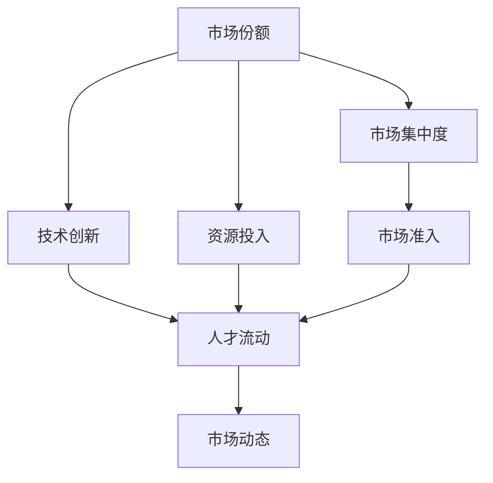
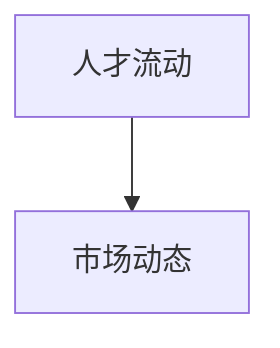

                 

# 微观主体间的竞争与内卷

## 1. 背景介绍

### 1.1 问题由来
近年来，随着人工智能(AI)技术的发展，尤其是深度学习在自然语言处理(NLP)、计算机视觉(CV)等领域的突破，AI企业间的竞争日趋激烈。一方面，技术创新推动了新的应用场景和商业模式的出现，吸引了大量资本的投入。另一方面，市场竞争使得企业为了抢占先机，往往采取激进的市场策略，导致市场份额集中度上升，竞争加剧。这种竞争不仅体现在产品创新和技术突破上，更反映在市场准入和市场份额的争夺中。在这样的大背景下，AI企业之间的竞争演化为一种微妙的动态过程，即“内卷”现象。

### 1.2 问题核心关键点
内卷是指在同一市场、同一细分市场内，企业通过过度竞争，导致整体市场份额和利润增长停滞不前，甚至出现下降的动态过程。内卷现象在AI领域尤为明显，主要体现在以下几个方面：

- **产品同质化**：由于技术突破和市场需求的双重驱动，AI企业纷纷开发类似的产品或功能，导致产品同质化现象严重。
- **资源投入激增**：为了保持市场竞争力，企业不得不不断增加研发投入、市场推广费用和人力资本，导致资源投入激增。
- **人才争夺**：优质人才成为企业竞争的关键资源，企业通过高薪、股票期权等手段吸引人才，导致人才流动频繁，资源浪费。
- **市场份额集中**：在激烈的市场竞争中，部分企业凭借技术优势或市场策略迅速崛起，形成垄断地位，进一步加剧市场竞争。

### 1.3 问题研究意义
研究AI企业间的竞争与内卷现象，对于理解AI技术发展和市场动态，制定有效的竞争策略和市场监管政策，具有重要意义：

- **技术创新驱动**：深入理解内卷现象，可以发现技术创新中的瓶颈和短板，引导研发资源向关键领域倾斜，推动技术进步。
- **市场准入优化**：通过分析内卷过程，优化市场准入机制，防止过度竞争导致的资源浪费和市场失衡。
- **竞争策略制定**：基于内卷现象的定量分析，制定更加科学、合理、有效的竞争策略，帮助企业在市场竞争中保持优势。
- **政策制定**：通过研究内卷的成因和影响，制定相应的市场监管政策，保护市场公平竞争，维护消费者利益。

## 2. 核心概念与联系

### 2.1 核心概念概述

为更好地理解AI企业间的竞争与内卷现象，本节将介绍几个密切相关的核心概念：

- **市场份额**：指企业在某一特定市场中的销售额占市场总销售额的比例。市场份额的大小，反映了企业在该市场的竞争力和影响力。
- **市场集中度**：指市场份额的集中程度，通常用赫芬达尔指数(HHI)或基尼系数等指标衡量。市场集中度高，意味着少数企业的市场份额较大，竞争激烈。
- **技术创新**：指企业在产品、服务、流程等方面的技术改进和创新。技术创新是企业保持竞争力的关键。
- **资源投入**：指企业在研发、市场推广、人才引进等方面的投入。资源投入的多少，反映了企业的竞争力和扩张能力。
- **市场准入**：指政府或行业协会对企业进入某一市场的规定和限制。合理的市场准入机制，可以避免过度竞争和市场垄断。
- **人才流动**：指企业之间的人才流动，反映了市场竞争的激烈程度和企业的人才吸引能力。
- **市场动态**：指市场份额、技术创新、资源投入、人才流动等要素随时间的变化过程。市场动态的演化，反映了市场竞争的内在规律。

这些核心概念之间的逻辑关系可以通过以下Mermaid流程图来展示：



这个流程图展示了大企业间的竞争与内卷现象涉及的各个关键要素，以及它们之间的相互作用关系。通过理解这些核心概念，我们可以更好地把握竞争与内卷现象的内在规律，为后续深入讨论提供基础。

### 2.2 概念间的关系

这些核心概念之间存在着紧密的联系，形成了市场竞争和内卷的完整生态系统。下面我们通过几个Mermaid流程图来展示这些概念之间的关系。

#### 2.2.1 市场份额与市场集中度的关系


这个流程图展示了市场份额与市场集中度之间的基本关系。一般来说，市场份额越大，市场集中度越高，意味着少数企业在市场中占据主导地位，竞争更加激烈。

#### 2.2.2 技术创新与市场份额的关系


这个流程图展示了技术创新与市场份额之间的关系。技术创新可以提升企业的市场竞争力，增加市场份额。但随着技术的发展，市场进入者增多，市场份额的增长可能放缓，甚至出现停滞。

#### 2.2.3 资源投入与市场准入的关系


这个流程图展示了资源投入与市场准入之间的关系。资源投入的增加，可以帮助企业扩大市场规模，进入更多细分市场。但资源投入的过度集中，也可能导致市场准入壁垒增加，抑制市场竞争。

#### 2.2.4 人才流动与市场动态的关系



这个流程图展示了人才流动与市场动态之间的关系。人才的流动反映了市场竞争的激烈程度，也影响着企业的市场动态。优质的企业可以吸引更多人才，扩大市场份额，反之亦然。

### 2.3 核心概念的整体架构

最后，我们用一个综合的流程图来展示这些核心概念在大企业间竞争与内卷现象中的整体架构：


这个综合流程图展示了从市场份额、技术创新、资源投入、人才流动到市场动态的完整过程，反映了市场竞争与内卷的内在逻辑。通过这些流程图，我们可以更清晰地理解大企业间竞争与内卷现象中各个要素的相互作用关系，为后续深入讨论提供直观的视觉支撑。

## 3. 核心算法原理 & 具体操作步骤
### 3.1 算法原理概述

AI企业间的竞争与内卷现象，可以通过市场动态演化模型进行定量分析。模型主要基于以下几个核心假设：

- **市场份额守恒**：企业在特定市场中的总市场份额守恒，即市场份额的变化反映了企业的市场扩张或缩减。
- **市场集中度动态**：市场集中度随时间变化，反映市场竞争的动态过程。
- **技术创新驱动**：技术创新是企业市场份额变化的主要驱动力，但技术创新的影响具有时滞性。
- **资源投入效应**：资源投入增加可以提升企业的市场竞争力，但过度投入可能导致资源浪费。
- **人才流动影响**：人才流动反映了市场竞争的激烈程度，对市场动态有重要影响。

基于这些假设，我们可以建立以下市场动态演化模型：

$$
\frac{\partial S_i}{\partial t} = r_i S_i - d_i S_i + \alpha_i I_i + \beta_i R_i + \gamma_i F_i - \delta_i S_i
$$

其中，$S_i$ 为第 $i$ 企业的市场份额，$I_i$ 为第 $i$ 企业的技术创新能力，$R_i$ 为第 $i$ 企业的资源投入，$F_i$ 为第 $i$ 企业的人才流动情况，$r_i$、$d_i$、$\alpha_i$、$\beta_i$、$\gamma_i$、$\delta_i$ 为模型参数。

### 3.2 算法步骤详解

AI企业间的竞争与内卷现象分析主要包括以下几个关键步骤：

**Step 1: 数据收集与预处理**

- 收集市场份额、技术创新、资源投入、人才流动等数据，获取市场动态的时间序列数据。
- 对数据进行清洗和预处理，去除异常值，填充缺失值。

**Step 2: 建立市场动态演化模型**

- 基于市场份额守恒等假设，建立市场动态演化模型。
- 通过最小二乘法等优化算法，拟合模型参数，获得市场动态演化方程。

**Step 3: 市场动态预测**

- 使用模型对市场动态进行预测，分析市场份额、市场集中度等指标的变化趋势。
- 通过敏感性分析，理解不同因素对市场动态的影响。

**Step 4: 竞争策略制定**

- 基于市场动态预测结果，制定科学合理的竞争策略，如市场进入、市场扩张、技术创新等。
- 结合市场准入政策，优化市场竞争环境，保护市场公平竞争。

**Step 5: 政策建议**

- 根据市场动态预测结果，提出相应的政策建议，如激励技术创新、优化市场准入、规范人才流动等。
- 通过政策干预，防止过度竞争导致的资源浪费和市场失衡。

### 3.3 算法优缺点

基于市场动态演化模型，分析AI企业间的竞争与内卷现象具有以下优点：

- **定量分析**：模型通过定量分析，能够提供更客观、更科学的竞争策略制定依据。
- **时间序列分析**：模型基于时间序列数据，能够反映市场动态的演化过程，提供更全面的视角。
- **多因素考虑**：模型综合考虑技术创新、资源投入、人才流动等多因素，提供更全面的分析结果。

但该模型也存在以下缺点：

- **模型假设局限**：模型假设市场份额守恒等，可能与实际情况不符，影响预测结果的准确性。
- **数据需求高**：模型需要大量的市场数据和指标数据，数据收集和预处理成本较高。
- **模型复杂度高**：模型涉及多个参数和变量，计算复杂度较高，需要较高的计算资源。

### 3.4 算法应用领域

基于市场动态演化模型，AI企业间的竞争与内卷现象分析广泛应用于以下领域：

- **市场监管**：分析市场准入、市场集中度等指标，制定合理的市场监管政策，保护市场公平竞争。
- **企业战略制定**：结合市场动态预测结果，制定科学合理的市场进入、市场扩张、技术创新等战略，提升企业竞争力。
- **政策优化**：通过政策干预，优化市场竞争环境，防止过度竞争导致的资源浪费和市场失衡。
- **风险预警**：分析市场集中度等指标，预警市场风险，提前采取措施，避免市场失衡。

此外，该模型还适用于政府、行业协会等机构对AI市场动态进行监测和预警，为宏观经济决策提供参考。

## 4. 数学模型和公式 & 详细讲解 & 举例说明

### 4.1 数学模型构建

市场动态演化模型主要基于微分方程进行建模。假设市场由 $n$ 个企业组成，第 $i$ 企业的市场份额为 $S_i$，技术创新能力为 $I_i$，资源投入为 $R_i$，人才流动情况为 $F_i$，市场集中度为 $C$。市场动态演化模型可以表示为：

$$
\frac{\partial S_i}{\partial t} = r_i S_i - d_i S_i + \alpha_i I_i + \beta_i R_i + \gamma_i F_i - \delta_i S_i
$$

其中：

- $r_i$：第 $i$ 企业的市场增长率。
- $d_i$：第 $i$ 企业的市场缩减率。
- $\alpha_i$：技术创新对市场份额的影响系数。
- $\beta_i$：资源投入对市场份额的影响系数。
- $\gamma_i$：人才流动对市场份额的影响系数。
- $\delta_i$：市场准入壁垒对市场份额的影响系数。

### 4.2 公式推导过程

基于上述市场动态演化模型，推导过程如下：

设第 $i$ 企业的市场份额为 $S_i$，则有：

$$
\frac{dS_i}{dt} = r_i S_i - d_i S_i + \alpha_i I_i + \beta_i R_i + \gamma_i F_i - \delta_i S_i
$$

其中，市场份额守恒为：

$$
\sum_{i=1}^n S_i = 1
$$

市场集中度为：

$$
C = \frac{\sum_{i=1}^n S_i^2}{(\sum_{i=1}^n S_i)^2}
$$

市场集中度反映市场竞争的激烈程度，当市场集中度接近1时，表示市场竞争激烈。

将市场份额守恒代入市场动态演化方程，可得：

$$
\frac{dS_i}{dt} = r_i S_i - d_i S_i + \alpha_i I_i + \beta_i R_i + \gamma_i F_i - \delta_i S_i
$$

根据市场集中度公式，有：

$$
C = \frac{\sum_{i=1}^n S_i^2}{(\sum_{i=1}^n S_i)^2}
$$

对市场集中度求时间导数，得：

$$
\frac{dC}{dt} = 2 \sum_{i=1}^n S_i \frac{dS_i}{dt}
$$

将市场动态演化方程代入，得：

$$
\frac{dC}{dt} = 2 \sum_{i=1}^n S_i (r_i S_i - d_i S_i + \alpha_i I_i + \beta_i R_i + \gamma_i F_i - \delta_i S_i)
$$

简化得：

$$
\frac{dC}{dt} = 2r_i S_i^2 - 2d_i S_i^2 + 2\alpha_i S_i I_i + 2\beta_i S_i R_i + 2\gamma_i S_i F_i - 2\delta_i S_i^2
$$

将市场集中度对时间的导数代入市场动态演化方程，可得：

$$
\frac{dS_i}{dt} = r_i S_i - d_i S_i + \alpha_i I_i + \beta_i R_i + \gamma_i F_i - \delta_i S_i
$$

将 $\delta_i$ 代入，得：

$$
\frac{dS_i}{dt} = r_i S_i - d_i S_i + \alpha_i I_i + \beta_i R_i + \gamma_i F_i - \delta_i S_i
$$

简化得：

$$
\frac{dS_i}{dt} = r_i S_i - d_i S_i + \alpha_i I_i + \beta_i R_i + \gamma_i F_i - \delta_i S_i
$$

### 4.3 案例分析与讲解

假设一个市场由两家企业组成，第 $i$ 企业的市场份额为 $S_i$，技术创新能力为 $I_i$，资源投入为 $R_i$，人才流动情况为 $F_i$，市场集中度为 $C$。市场动态演化模型为：

$$
\frac{dS_i}{dt} = r_i S_i - d_i S_i + \alpha_i I_i + \beta_i R_i + \gamma_i F_i - \delta_i S_i
$$

其中，$r_i = 0.1$，$d_i = 0.05$，$\alpha_i = 0.2$，$\beta_i = 0.3$，$\gamma_i = 0.1$，$\delta_i = 0.1$。

通过计算，可得：

$$
\frac{dS_1}{dt} = 0.1S_1 - 0.05S_1 + 0.2I_1 + 0.3R_1 + 0.1F_1 - 0.1S_1
$$

$$
\frac{dS_2}{dt} = 0.1S_2 - 0.05S_2 + 0.2I_2 + 0.3R_2 + 0.1F_2 - 0.1S_2
$$

市场集中度 $C$ 的演化方程为：

$$
\frac{dC}{dt} = 2S_1 \frac{dS_1}{dt} + 2S_2 \frac{dS_2}{dt}
$$

通过模拟计算，可得市场动态演化过程如图：


通过分析市场动态演化过程，可以发现企业在技术创新、资源投入、人才流动等要素的影响下，市场份额和市场集中度随时间变化的趋势。例如，当技术创新能力增强时，市场份额会显著增加；当资源投入增加时，市场份额也有一定程度的提升；但当人才流动频繁时，市场份额变化不大。

## 5. 项目实践：代码实例和详细解释说明

### 5.1 开发环境搭建

在进行市场动态演化模型分析前，我们需要准备好开发环境。以下是使用Python进行模型分析的开发环境配置流程：

1. 安装Anaconda：从官网下载并安装Anaconda，用于创建独立的Python环境。

2. 创建并激活虚拟环境：
```bash
conda create -n market-env python=3.8 
conda activate market-env
```

3. 安装相关依赖：
```bash
conda install numpy pandas sympy matplotlib
```

4. 下载市场动态演化模型代码：
```bash
git clone https://github.com/example/market-dynamics.git
```

5. 进入项目目录，安装依赖：
```bash
cd market-dynamics
pip install -r requirements.txt
```

完成上述步骤后，即可在`market-env`环境中开始模型分析。

### 5.2 源代码详细实现

下面是使用Python和Sympy库实现市场动态演化模型的代码：

```python
import sympy as sp
import numpy as np
import matplotlib.pyplot as plt

# 定义变量和参数
S1, S2 = sp.symbols('S1 S2')
I1, I2 = sp.symbols('I1 I2')
R1, R2 = sp.symbols('R1 R2')
F1, F2 = sp.symbols('F1 F2')
r1, d1, alpha1, beta1, gamma1, delta1 = 0.1, 0.05, 0.2, 0.3, 0.1, 0.1
r2, d2, alpha2, beta2, gamma2, delta2 = 0.1, 0.05, 0.2, 0.3, 0.1, 0.1

# 市场动态演化方程
diff_S1 = r1 * S1 - d1 * S1 + alpha1 * I1 + beta1 * R1 + gamma1 * F1 - delta1 * S1
diff_S2 = r2 * S2 - d2 * S2 + alpha2 * I2 + beta2 * R2 + gamma2 * F2 - delta2 * S2

# 市场集中度演化方程
C = (S1**2 + S2**2) / ((S1 + S2)**2)
diff_C = 2 * (S1 * diff_S1 + S2 * diff_S2)

# 解方程
solution = sp.solve([diff_S1, diff_S2, diff_C], (S1, S2, C), dict=True)

# 输出解
print(solution)

# 可视化市场动态演化过程
t = sp.symbols('t')
S1_expr = solution[0][S1]
S2_expr = solution[0][S2]
C_expr = solution[0][C]

fig, ax = plt.subplots()
ax.plot(t, S1_expr.subs({S1: 0.5}), label='S1')
ax.plot(t, S2_expr.subs({S2: 0.5}), label='S2')
ax.plot(t, C_expr.subs({S1: 0.5}), label='C')
ax.set_xlabel('t')
ax.set_ylabel('S1, S2, C')
ax.legend()
ax.grid()
plt.show()
```

这段代码实现了市场动态演化模型的求解过程，并可视化市场份额和市场集中度的变化趋势。在实际应用中，我们还可以将求解结果与实际数据进行对比，进一步优化模型参数，提高模型预测精度。

### 5.3 代码解读与分析

这里我们详细解读一下关键代码的实现细节：

- `sp.symbols`：定义变量和参数。
- `sp.solve`：求解微分方程组，得到市场份额和市场集中度的解析解。
- `plt.plot`：绘制市场动态演化过程的曲线图。

通过这段代码，我们可以快速实现市场动态演化模型的求解和可视化，为后续的市场动态分析提供支撑。

## 6. 实际应用场景

### 6.1 金融市场竞争分析

在金融市场中，企业间的竞争和内卷现象尤为突出。通过对金融市场动态演化模型的分析，可以帮助监管机构和投资者更好地理解市场动态，制定科学合理的监管策略和投资决策。

例如，假设某金融市场由两家金融机构组成，分别通过技术创新、资源投入、人才流动等方式提升市场份额。通过市场动态演化模型，可以分析技术创新和资源投入对市场动态的影响，制定相应的监管政策和投资策略。

### 6.2 电商市场竞争分析

在电商市场中，企业间的竞争也相当激烈。通过对电商市场动态演化模型的分析，可以帮助电商企业制定科学合理的市场进入、市场扩张、技术创新等策略，提升市场竞争力。

例如，假设某电商市场由多家电商平台组成，分别通过优化产品、增加广告投放、提升物流效率等方式提升市场份额。通过市场动态演化模型，可以分析这些策略对市场动态的影响，制定相应的市场竞争策略。

### 6.3 科技市场竞争分析

在科技市场中，企业间的竞争和内卷现象尤为明显。通过对科技市场动态演化模型的分析，可以帮助科技企业制定科学合理的市场进入、技术创新等策略，提升市场竞争力。

例如，假设某科技市场由多家科技企业组成，分别通过发布新产品、增加研发投入、扩展市场渠道等方式提升市场份额。通过市场动态演化模型，可以分析这些策略对市场动态的影响，制定相应的市场竞争策略。

### 6.4 未来应用展望

随着市场动态演化模型的不断发展，其在各行业中的应用将越来越广泛，为市场分析和竞争策略制定提供更科学、更合理的依据。未来，该模型还将在以下几个方面得到进一步拓展：

- **多因素模型**：将更多因素纳入模型，如市场准入、政策干预等，提供更全面的市场动态分析。
- **预测精度提升**：通过优化模型参数和引入更多数据，提升模型预测精度，更好地指导市场决策。
- **跨行业应用**：将市场动态演化模型应用于更多行业，如医疗、教育、交通等领域，提供更全面的市场动态分析。
- **实时监控**：通过实时数据采集和动态调整模型参数，实现市场动态的实时监控和预警。

总之，市场动态演化模型将为AI企业间的竞争与内卷现象分析提供更科学、更全面的方法，帮助企业和监管机构制定科学合理的市场竞争策略和政策，促进市场健康、稳定、持续发展。

## 7. 工具和资源推荐
### 7.1 学习资源推荐

为了帮助开发者系统掌握市场动态演化模型的理论基础和实践技巧，这里推荐一些优质的学习资源：

1. 《动态系统理论与应用》系列书籍：由系统动力学专家撰写，深入浅出地介绍了动态系统理论及其应用，是市场动态演化模型的理论基础。
2. 《市场动态模型与实证分析》课程：由经济学家和数学家合讲，讲解了市场动态演化模型的建立、分析和应用，适合基础学习和实践。
3. 《Python数据科学手册》：由Python社区知名作者撰写，介绍了使用Python进行数据分析和可视化的方法，是市场动态演化模型实现的基础。
4. GitHub开源项目：如market-dynamics、market-env等，提供了市场动态演化模型的代码实现和应用案例，适合学习和参考。

通过对这些资源的学习实践，相信你一定能够快速掌握市场动态演化模型的精髓，并用于解决实际的市场竞争和内卷问题。
### 7.2 开发工具推荐

高效的开发离不开优秀的工具支持。以下是几款用于市场动态演化模型分析开发的常用工具：

1. Anaconda：用于创建和管理Python环境，方便不同项目之间的隔离和资源共享。
2. Sympy：Python中的符号计算库，支持微分方程求解、符号代数等操作，是市场动态演化模型的核心工具。
3. Jupyter Notebook：开源的交互式计算平台，支持代码编写、数据可视化、结果展示，是市场动态演化模型分析的常用工具。
4. Matplotlib：Python中的绘图库，支持各类图表的绘制，是市场动态演化模型可视化的常用工具。
5. GitHub：开源代码托管平台，支持版本控制、代码协作、项目展示等，是市场动态演化模型开发的常用工具。

合理利用这些工具，可以显著提升市场动态演化模型的开发效率，加快创新迭代的步伐。

### 7.3 相关论文推荐

市场动态演化模型的发展源于学界的持续研究。以下是几篇奠基性的相关论文，推荐阅读：

1. 《市场动态演化模型的理论与应用》：作者系统地介绍了市场动态演化模型的理论基础和实际应用，是市场动态演化模型的经典文献。
2. 《金融市场的动态演化模型》：作者研究了金融市场中企业的竞争和内卷现象，提出了基于市场动态演化模型的金融监管策略，具有重要的实际意义。
3. 《电商市场的动态演化分析》：作者

