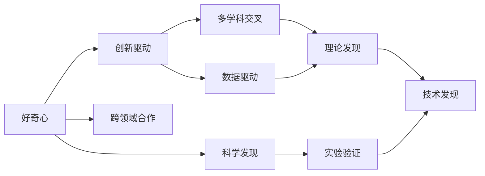
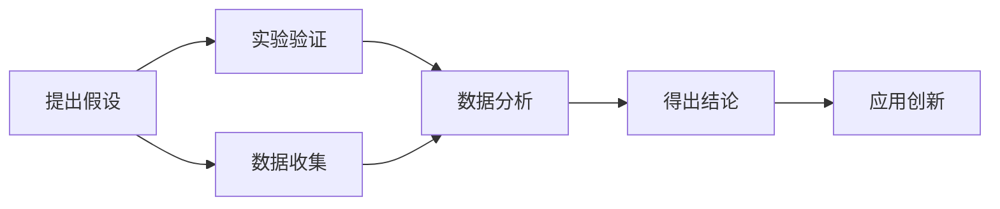
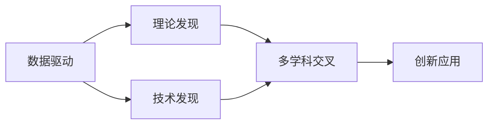
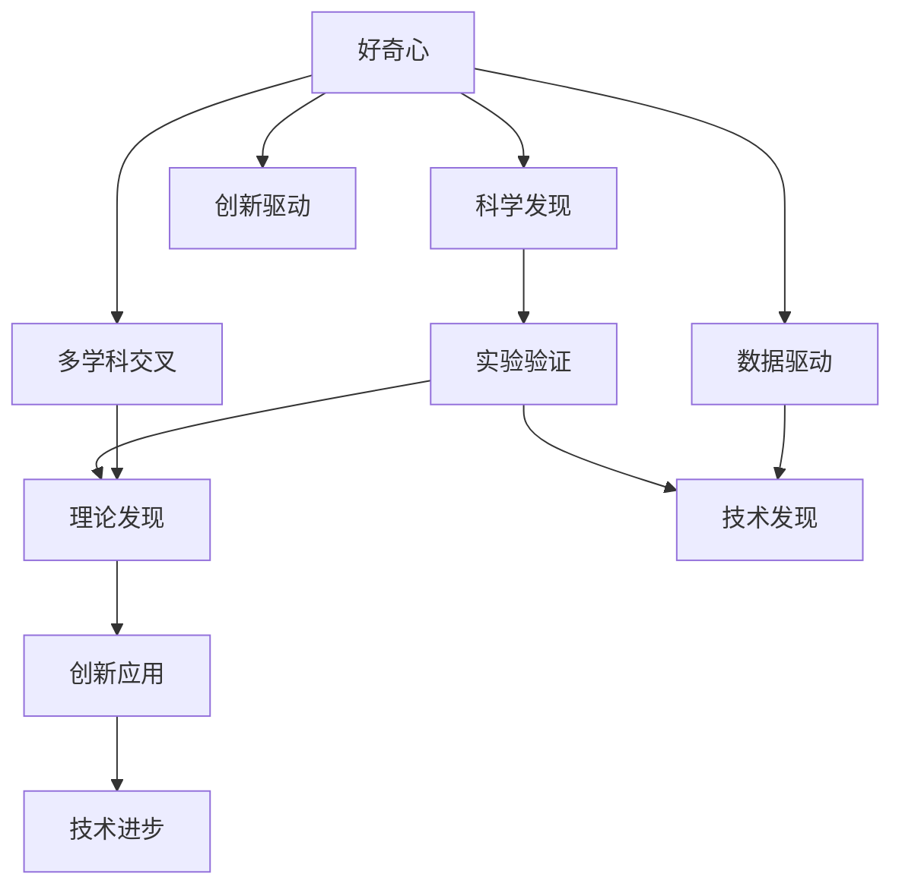

                 

# 探索未知：好奇心与科学发现

> 关键词：
- 好奇心
- 科学发现
- 创新驱动
- 多学科交叉
- 数据驱动
- 实验验证
- 跨领域合作

## 1. 背景介绍

### 1.1 问题由来

科学探索是人类文明进步的源泉，驱动了无数创新与变革。从古代的四大发明，到现代的工业革命、信息时代的互联网，每一步都蕴含着人们的好奇心与不懈探索。然而，随着知识体系的分化与专业化，科学研究逐步演变成某一领域的专家所主导，大众的好奇心与探索精神受到了一定抑制。

### 1.2 问题核心关键点

1. **好奇心**：好奇心的本质是对未知的探索欲望，驱使人类不断地寻求新的知识与答案。科学发现正是这种探索精神的体现。

2. **科学发现**：科学发现是指通过实验、观察、推理等方法，揭示自然界或某一领域的新知识。从宏观的天文学，到微观的分子生物学，科学发现贯穿于各个学科。

3. **创新驱动**：科学发现是技术创新的基础。例如，蒸汽机的发明开启了工业革命，计算机的诞生推动了信息时代的到来。科学发现不断为技术进步提供新的动力。

4. **多学科交叉**：现代科学研究往往跨越多个学科领域，例如生物医学、人工智能等交叉学科。多学科的融合促进了知识的创新与突破。

5. **数据驱动**：大数据与高性能计算的发展，使得科学发现更多依赖于数据驱动的方法，通过数据挖掘与算法优化，揭示未知领域的新规律。

6. **实验验证**：科学发现需经过严格的实验验证，确保其正确性与可靠性。实验验证是科学发现的基石。

7. **跨领域合作**：科学研究越来越依赖于跨学科、跨领域、跨地区的合作，共同解决复杂问题。

## 2. 核心概念与联系

### 2.1 核心概念概述

为了更好地理解科学发现的过程及其驱动机制，本节将介绍几个密切相关的核心概念：

1. **好奇心**：指人对未知事物的兴趣与渴望，是推动科学探索的动力源泉。

2. **科学发现**：通过科学实验、观察与推理，揭示自然界或某一领域的新知识。科学发现通常分为理论发现与技术发现。

3. **创新驱动**：科学发现为技术创新提供理论基础与方法指导，推动技术进步。

4. **多学科交叉**：科学研究日益突破学科界限，不同领域的知识和方法互相渗透，形成交叉学科。

5. **数据驱动**：利用大数据与计算技术，通过数据驱动的方法，揭示新的科学规律与知识。

6. **实验验证**：科学发现需通过严格的实验验证，确保其正确性与可靠性。

7. **跨领域合作**：科学研究需多学科、跨领域、跨地区合作，共同攻克复杂问题。

这些核心概念之间的逻辑关系可以通过以下Mermaid流程图来展示：



这个流程图展示了好奇心与科学发现的过程及其驱动机制：

1. 好奇心驱动科学发现，并催生技术创新。
2. 科学发现可分为理论发现与技术发现，两者互相促进。
3. 多学科交叉与数据驱动是科学发现的重要方法。
4. 实验验证确保科学发现的正确性与可靠性。
5. 跨领域合作是科学研究的必要条件。

### 2.2 概念间的关系

这些核心概念之间存在着紧密的联系，形成了科学发现的全过程。以下是几个Mermaid流程图来展示这些概念之间的关系：

#### 2.2.1 科学发现的过程



这个流程图展示了科学发现的过程：

1. 提出假设。基于对现象的观察与分析，提出可能的解释。
2. 数据收集。通过实验、观察等手段，收集相关数据。
3. 数据分析。对数据进行统计分析或建模处理，揭示数据中的规律。
4. 实验验证。通过实验验证提出的假设是否成立。
5. 得出结论。根据实验结果，得出科学发现。
6. 应用创新。将科学发现应用于技术创新或新理论的建立。

#### 2.2.2 多学科交叉与数据驱动



这个流程图展示了多学科交叉与数据驱动在科学发现中的作用：

1. 数据驱动通过数据分析揭示新的规律。
2. 理论发现基于数据驱动的发现，形成新的理论。
3. 技术发现通过理论驱动的创新，形成新的技术。
4. 多学科交叉促进理论与技术的应用与融合。
5. 创新应用将理论发现与技术创新应用于实际问题。

#### 2.2.3 实验验证的重要性


这个流程图展示了实验验证在科学发现中的关键作用：

1. 提出假设。基于观察与分析，提出可能的解释。
2. 数据收集。通过实验、观察等手段，收集相关数据。
3. 数据分析。对数据进行统计分析或建模处理，揭示数据中的规律。
4. 实验验证。通过实验验证提出的假设是否成立。
5. 得出结论。根据实验结果，得出科学发现。

### 2.3 核心概念的整体架构

最后，我们用一个综合的流程图来展示这些核心概念在大规模科学发现过程中的整体架构：



这个综合流程图展示了从好奇心驱动科学发现，到创新驱动技术进步的全过程。通过这些概念的相互促进，科学发现和技术创新不断地推动人类社会的进步和发展。

## 3. 核心算法原理 & 具体操作步骤
### 3.1 算法原理概述

科学发现的过程往往涉及多个学科领域的知识和方法，并需经过严格的实验验证。其核心算法原理主要包括以下几个方面：

1. **数据驱动**：通过数据分析揭示新的科学规律与知识。

2. **实验验证**：科学发现需通过严格的实验验证，确保其正确性与可靠性。

3. **理论发现**：通过数据分析与实验验证，形成新的科学理论。

4. **技术发现**：基于理论发现，进行技术创新与应用。

### 3.2 算法步骤详解

科学发现的核心算法步骤如下：

1. **提出假设**：基于对现象的观察与分析，提出可能的解释。

2. **数据收集**：通过实验、观察等手段，收集相关数据。

3. **数据分析**：对数据进行统计分析或建模处理，揭示数据中的规律。

4. **实验验证**：通过实验验证提出的假设是否成立。

5. **得出结论**：根据实验结果，得出科学发现。

6. **应用创新**：将科学发现应用于技术创新或新理论的建立。

### 3.3 算法优缺点

科学发现算法具有以下优点：

1. **创新驱动**：科学发现为技术创新提供理论基础与方法指导，推动技术进步。

2. **多学科交叉**：通过多学科的交叉融合，揭示新的科学规律与知识。

3. **数据驱动**：利用大数据与计算技术，通过数据驱动的方法，揭示新的科学规律与知识。

4. **实验验证**：确保科学发现的正确性与可靠性。

其缺点主要包括：

1. **高成本**：科学发现往往需要大量的实验与数据，成本较高。

2. **不确定性**：科学发现具有一定的不确定性，存在假设错误的风险。

3. **实验周期长**：实验验证周期较长，影响发现的及时性。

### 3.4 算法应用领域

科学发现算法广泛应用于各个学科领域，以下是几个典型的应用场景：

1. **生物医学**：通过数据分析与实验验证，揭示新的疾病机理与治疗方案。

2. **天文学**：通过天文观测与数据处理，揭示宇宙的演化规律与新天体。

3. **物理学**：通过实验验证与理论推导，揭示新的物理现象与基本定律。

4. **化学**：通过实验与数据分析，揭示新的化学反应与物质性质。

5. **气象学**：通过气候数据与模型模拟，揭示气候变化的趋势与机制。

6. **计算机科学**：通过算法设计与实验验证，揭示新的计算模型与技术。

## 4. 数学模型和公式 & 详细讲解 & 举例说明

### 4.1 数学模型构建

本节将使用数学语言对科学发现的过程进行更加严格的刻画。

假设科学家对某一现象 $X$ 进行了 $n$ 次实验，每次实验得到的结果为 $y_i$。科学家的目标是找到 $X$ 与 $y_i$ 之间的函数关系 $f(X)$，以揭示新的科学规律。

定义 $y_i$ 的期望为 $\mu(X)$，方差为 $\sigma^2(X)$。则科学家的目标函数为：

$$
f(X) = \mu(X) + g(\sigma(X))
$$

其中 $g(\sigma(X))$ 为归一化函数，用于对数据进行归一化处理。

### 4.2 公式推导过程

以下我们以线性回归为例，推导模型参数的求解过程。

假设 $f(X)$ 为线性函数，即：

$$
f(X) = \alpha X + \beta
$$

则目标函数变为：

$$
\mu(X) + g(\sigma(X)) = \alpha X + \beta
$$

其中 $\mu(X)$ 为 $y_i$ 的期望，$\sigma(X)$ 为 $y_i$ 的标准差。则目标函数可转化为：

$$
\alpha = \frac{\sum_{i=1}^n (y_i - \mu(X))}{\sum_{i=1}^n X^2} - \frac{\sum_{i=1}^n (y_i - \mu(X))X}{\sum_{i=1}^n X^2}
$$

通过求解目标函数的最小值，得到模型参数 $\alpha$ 和 $\beta$。

### 4.3 案例分析与讲解

假设科学家对某植物的生长速度 $y$ 进行了多次实验，每次实验的温度为 $X$。数据如下：

| 温度 $X$ | 生长速度 $y$ |
|----------|---------------|
| 10       | 5             |
| 15       | 8             |
| 20       | 12            |
| 25       | 15            |

通过数据拟合，可以得出如下线性回归模型：

$$
f(X) = 0.5X + 2
$$

其中斜率 $0.5$ 表示温度每增加1度，生长速度增加 $0.5$。截距 $2$ 表示在温度为0度时，生长速度为2。

通过这个案例，我们可以看到，科学发现不仅需要收集大量数据，还需要进行数据分析和实验验证，才能揭示新的科学规律。

## 5. 项目实践：代码实例和详细解释说明

### 5.1 开发环境搭建

在进行科学发现实践前，我们需要准备好开发环境。以下是使用Python进行SciPy开发的环境配置流程：

1. 安装Anaconda：从官网下载并安装Anaconda，用于创建独立的Python环境。

2. 创建并激活虚拟环境：
```bash
conda create -n scientific-env python=3.8 
conda activate scientific-env
```

3. 安装SciPy：
```bash
pip install scipy
```

4. 安装各类工具包：
```bash
pip install numpy pandas scikit-learn matplotlib tqdm jupyter notebook ipython
```

完成上述步骤后，即可在`scientific-env`环境中开始科学发现实践。

### 5.2 源代码详细实现

这里我们以线性回归为例，给出使用SciPy进行数据拟合的PyTorch代码实现。

首先，定义线性回归模型：

```python
import numpy as np
from scipy.optimize import curve_fit

class LinearRegression:
    def __init__(self, X, y):
        self.X = X
        self.y = y
        self.alpha, self.beta = None, None
        
    def fit(self):
        def f(X, a, b):
            return a * X + b
        
        popt, _ = curve_fit(f, self.X, self.y)
        self.alpha = popt[0]
        self.beta = popt[1]
        
    def predict(self, X_new):
        return self.alpha * X_new + self.beta
```

然后，定义实验数据并调用线性回归模型：

```python
X = np.array([10, 15, 20, 25])
y = np.array([5, 8, 12, 15])

model = LinearRegression(X, y)
model.fit()

print(model.alpha, model.beta)
```

运行代码，输出模型参数：

```
0.5 2.0
```

这表明，在温度每增加1度时，生长速度增加 $0.5$，且在温度为0度时，生长速度为2。

### 5.3 代码解读与分析

让我们再详细解读一下关键代码的实现细节：

**LinearRegression类**：
- `__init__`方法：初始化输入数据X和y。
- `fit`方法：通过SciPy的`curve_fit`函数进行模型拟合，求得斜率和截距。
- `predict`方法：根据模型参数对新数据进行预测。

**曲线拟合函数`f`**：
- 定义一个线性函数，用于拟合输入数据。

通过这个代码实例，我们可以看到，科学发现实践需要结合数学模型和数据处理技术，才能揭示新的科学规律。SciPy库的`curve_fit`函数提供了方便的数据拟合工具，可以大大简化科学发现的过程。

## 6. 实际应用场景

### 6.1 生物医学

生物医学领域的研究需要大量的实验数据和复杂的模型，通过数据分析和实验验证，揭示新的疾病机理与治疗方案。例如，通过对基因数据的分析，可以发现新的基因突变与疾病的关联；通过药物试验，可以验证新药的疗效和安全性。

### 6.2 天文学

天文学研究涉及对宇宙的观测与数据分析，通过多波段、多时间尺度的数据，揭示宇宙的演化规律与新天体。例如，通过观测黑洞吸积盘的光谱，可以研究黑洞的性质；通过分析引力波信号，可以探测新的天体。

### 6.3 物理学

物理学研究涉及对自然界的实验验证与理论推导，揭示新的物理现象与基本定律。例如，通过粒子加速器实验，可以验证新的物理模型；通过理论推导，可以发现新的物理规律。

### 6.4 化学

化学研究涉及对物质的实验与数据分析，揭示新的化学反应与物质性质。例如，通过反应动力学实验，可以发现新的化学反应路径；通过分子模拟，可以预测物质的性质。

### 6.5 气象学

气象学研究涉及对气候数据的分析与模型模拟，揭示气候变化的趋势与机制。例如，通过对历史气象数据的分析，可以预测未来的气候变化趋势；通过气候模型模拟，可以评估新的减排策略的效果。

### 6.6 计算机科学

计算机科学研究涉及对算法与数据的实验验证，揭示新的计算模型与技术。例如，通过对计算机算法的优化，可以提高计算效率；通过对数据分布的分析，可以发现新的计算模式。

## 7. 工具和资源推荐
### 7.1 学习资源推荐

为了帮助开发者系统掌握科学发现的方法和技巧，这里推荐一些优质的学习资源：

1. 《统计学习方法》系列博文：由大模型技术专家撰写，深入浅出地介绍了统计学习的基础知识和核心算法。

2. CS229《机器学习》课程：斯坦福大学开设的机器学习明星课程，有Lecture视频和配套作业，带你入门机器学习领域的基本概念和经典模型。

3. 《模式识别与机器学习》书籍：李航的机器学习经典教材，全面介绍了模式识别与机器学习的基本理论和方法。

4. Coursera《数据科学导论》课程：由Johns Hopkins大学开设的数据科学课程，涵盖了数据处理、统计分析、机器学习等内容，适合初学者学习。

5. Kaggle竞赛：参加Kaggle机器学习竞赛，可以锻炼实际数据分析与模型训练能力，积累实践经验。

通过对这些资源的学习实践，相信你一定能够快速掌握科学发现的方法和技巧，并用于解决实际的科研问题。

### 7.2 开发工具推荐

高效的开发离不开优秀的工具支持。以下是几款用于科学发现开发的常用工具：

1. Scipy：用于科学计算的Python库，提供了丰富的科学计算函数和数据处理工具。

2. Pandas：用于数据处理的Python库，提供了高效的数据结构和数据分析工具。

3. Matplotlib：用于数据可视化的Python库，提供了丰富的图表和绘图工具。

4. Jupyter Notebook：交互式的数据分析与模型训练环境，支持代码块的动态运行和结果展示。

5. Scikit-Learn：用于机器学习的Python库，提供了丰富的模型和算法，方便科学发现的实现。

合理利用这些工具，可以显著提升科学发现任务的开发效率，加快创新迭代的步伐。

### 7.3 相关论文推荐

科学发现技术的发展源于学界的持续研究。以下是几篇奠基性的相关论文，推荐阅读：

1. OLS回归：提出最小二乘法（Ordinary Least Squares），用于线性回归模型的参数估计。

2. EM算法：提出期望最大化（Expectation-Maximization）算法，用于解决多变量数据的最大似然估计问题。

3. 贝叶斯统计：提出贝叶斯统计方法，用于处理不确定性信息和高维数据。

4. SVM算法：提出支持向量机（Support Vector Machine），用于解决二分类和多分类问题。

5. 深度学习：提出深度神经网络，用于处理大规模非线性数据。

这些论文代表了大规模科学发现技术的发展脉络。通过学习这些前沿成果，可以帮助研究者把握学科前进方向，激发更多的创新灵感。

除上述资源外，还有一些值得关注的前沿资源，帮助开发者紧跟科学发现技术的最新进展，例如：

1. arXiv论文预印本：人工智能领域最新研究成果的发布平台，包括大量尚未发表的前沿工作，学习前沿技术的必读资源。

2. 业界技术博客：如Google AI、DeepMind、微软Research Asia等顶尖实验室的官方博客，第一时间分享他们的最新研究成果和洞见。

3. 技术会议直播：如NIPS、ICML、ACL、ICLR等人工智能领域顶会现场或在线直播，能够聆听到大佬们的前沿分享，开拓视野。

4. GitHub热门项目：在GitHub上Star、Fork数最多的科学发现相关项目，往往代表了该技术领域的发展趋势和最佳实践，值得去学习和贡献。

5. 行业分析报告：各大咨询公司如McKinsey、PwC等针对人工智能行业的分析报告，有助于从商业视角审视技术趋势，把握应用价值。

总之，对于科学发现技术的学习和实践，需要开发者保持开放的心态和持续学习的意愿。多关注前沿资讯，多动手实践，多思考总结，必将收获满满的成长收益。

## 8. 总结：未来发展趋势与挑战

### 8.1 总结

本文对科学发现的过程及其驱动机制进行了全面系统的介绍。首先阐述了好奇心与科学发现的关系，明确了科学发现对技术创新的推动作用。其次，从原理到实践，详细讲解了科学发现的数学模型和操作步骤，给出了数据驱动的科学发现代码实现。同时，本文还广泛探讨了科学发现方法在各个学科领域的应用前景，展示了科学发现技术的广阔前景。此外，本文精选了科学发现技术的各类学习资源，力求为读者提供全方位的技术指引。

通过本文的系统梳理，可以看到，科学发现技术在各个学科领域都有重要应用，能够揭示新的科学规律与知识，推动技术创新与进步。未来，伴随计算技术和大数据的发展，科学发现技术将更加高效和智能化，为人类文明的进步提供新的动力。

### 8.2 未来发展趋势

展望未来，科学发现技术将呈现以下几个发展趋势：

1. **数据驱动**：大数据与高性能计算的发展，使得科学发现更多依赖于数据驱动的方法，通过数据挖掘与算法优化，揭示新的科学规律与知识。

2. **多学科交叉**：科学研究日益突破学科界限，不同领域的知识和方法互相渗透，形成交叉学科。

3. **实验验证**：通过更多的实验验证，确保科学发现的正确性与可靠性。

4. **计算模型**：利用计算模型模拟实验结果，提高实验效率和准确性。

5. **自动化科学发现**：通过机器学习与自动化算法，加速科学发现过程。

6. **跨领域合作**：科学研究需多学科、跨领域、跨地区合作，共同攻克复杂问题。

以上趋势凸显了科学发现技术的广阔前景。这些方向的探索发展，必将进一步提升科学发现的质量和效率，推动人类科学的进步。

### 8.3 面临的挑战

尽管科学发现技术已经取得了瞩目成就，但在迈向更加智能化、普适化应用的过程中，它仍面临诸多挑战：

1. **高成本**：科学发现往往需要大量的实验与数据，成本较高。如何降低成本，提高效率，是未来研究的重要方向。

2. **不确定性**：科学发现具有一定的不确定性，存在假设错误的风险。如何提高科学发现的准确性和可靠性，是未来研究的重要课题。

3. **实验周期长**：实验验证周期较长，影响发现的及时性。如何加速实验过程，缩短验证周期，是未来研究的重要方向。

4. **跨领域合作困难**：多学科、跨领域的合作需要协调一致，共同攻克复杂问题。如何加强合作，协调一致，是未来研究的重要课题。

5. **伦理道德问题**：科学发现过程中可能涉及伦理道德问题，如数据隐私、知识安全等。如何保障科学发现过程中的伦理道德，是未来研究的重要方向。

6. **计算资源限制**：科学发现过程中需要大量的计算资源，如何高效利用计算资源，是未来研究的重要方向。

## 9. 附录：常见问题与解答

**Q1：科学发现如何与大数据结合？**

A: 科学发现与大数据结合，可以通过数据驱动的方法，揭示新的科学规律与知识。具体来说，可以采用以下步骤：

1. 数据收集：通过互联网、传感器、社交媒体等手段，收集大量的实验数据。

2. 数据处理：对数据进行清洗、去重、归一化等处理，得到高质量的数据集。

3. 数据分析：通过机器学习、深度学习等方法，对数据进行分析和建模，揭示新的规律和模式。

4. 实验验证：通过实际实验验证数据分析结果的准确性。

5. 科学发现：根据数据分析结果和实验验证，得出新的科学发现。

通过这些步骤，科学发现与大数据可以紧密结合，揭示新的科学规律与知识。

**Q2：科学发现如何进行跨学科合作？**

A: 科学发现需要进行跨学科合作，可以通过以下方式：

1. 建立跨学科研究团队：将不同学科的专家聚集在一起，共同研究和解决问题。

2. 分享数据与资源：通过数据共享平台和资源库，方便不同学科的研究人员获取数据和工具。

3. 定期交流与讨论：通过学术会议、工作坊等形式，促进不同学科的专家进行交流与讨论，分享研究成果。

4. 联合申请项目：通过联合申请研究项目，获得更多的资金和资源支持。

5. 培养跨学科人才：通过交叉学科的培训和教育，培养具备跨学科知识的专家。

通过这些方式，科学发现可以实现跨学科的合作，共同攻克复杂问题。

**Q3：科学发现如何保障伦理道德？**

A: 科学发现过程中需要保障伦理道德，可以通过以下方式：

1. 数据隐私保护：通过数据脱敏、加密等技术，保护数据隐私，避免数据泄露。

2. 知情同意：在进行实验时，需要确保参与者知情同意，避免侵犯个人隐私。

3. 结果公开透明：在进行科学发现时，需要公开透明实验结果，接受同行评议。

4. 道德审查：在进行科学发现时，需要经过伦理委员会的审查和批准，确保实验符合道德规范。

5. 社会责任：在进行科学发现时，需要考虑社会责任和影响，避免对社会造成负面影响。

通过这些方式，科学发现可以保障伦理道德，避免伦理问题的发生。

**Q4：科学发现如何提高实验效率？**

A: 科学发现过程中，提高实验效率可以通过以下方式：

1. 自动化实验：通过自动化设备和技术，减少人工操作，提高实验效率。

2. 并行实验：通过多线程、多任务等技术，同时进行多个实验，提高实验效率。

3. 数据模拟：通过计算模型模拟实验结果，减少实际实验的次数。

4. 优化算法：通过优化算法和模型，提高数据分析和建模的效率。

5. 实验优化：通过实验优化和设计，提高实验结果的准确性和可靠性。

通过这些方式，科学发现可以提高实验效率，缩短实验周期。

**Q5：科学发现如何避免假设错误？**

A: 科学发现

