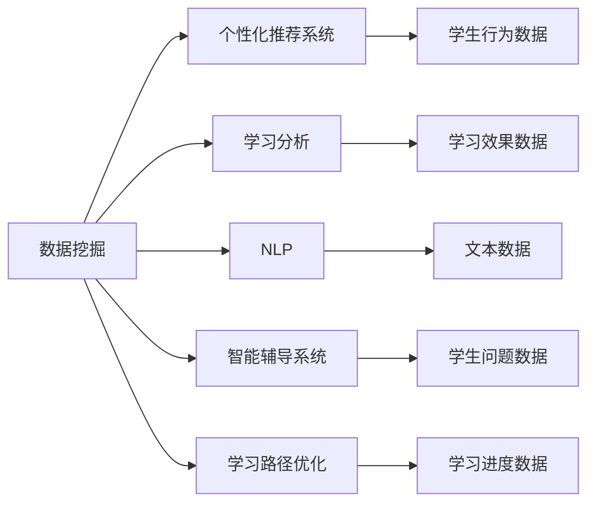

                 

## 1. 背景介绍

### 1.1 问题由来

随着互联网和信息技术的发展，在线教育平台迅速崛起，为人们提供了更加灵活、便捷的学习方式。然而，传统的"一刀切"教学模式已经无法满足学生个性化学习的需求，如何通过数据驱动，实现个性化教学和提升学习效果，成为了在线教育平台面临的重要挑战。

在线教育平台通过收集和分析学习数据，如学生行为数据、成绩数据、互动数据等，可以发现学生的学习偏好、薄弱环节和潜在需求，进而定制个性化的学习方案。然而，由于数据的复杂性和多样性，如何在海量数据中挖掘有价值的信息，构建有效的数据模型，是一个亟需解决的难题。

### 1.2 问题核心关键点

1. **个性化推荐**：根据学生的学习行为和兴趣，推荐符合其需求的教学资源和课程。
2. **学习进度监控**：通过分析学生在不同任务上的表现，及时发现学习瓶颈和薄弱环节，调整教学策略。
3. **智能辅导**：使用自然语言处理(NLP)技术，构建智能辅导系统，自动回答学生问题，提供个性化建议。
4. **学习效果评估**：通过建模和分析学生的学习数据，评估学习效果，并生成学习报告。
5. **学习路径优化**：根据学生学习行为和成绩，动态调整学习路径，实现最优学习效果。

### 1.3 问题研究意义

个性化教学和提升学习效果对于在线教育平台具有重要意义：

1. **提高教学质量**：通过数据驱动的教学策略，能够更好地适应学生的个性化需求，提高学习效果。
2. **提升学生满意度**：个性化推荐和智能辅导可以大大提高学生的学习体验和满意度。
3. **优化资源配置**：通过学习数据进行分析，可以优化教学资源配置，提升教育资源的利用效率。
4. **推动技术创新**：个性化教学和提升学习效果是当前教育技术的前沿研究领域，推动了自然语言处理、机器学习等技术的快速发展。
5. **赋能教育公平**：通过数据分析和建模，可以为偏远和贫困地区的学生提供优质教育资源，推动教育公平。

## 2. 核心概念与联系

### 2.1 核心概念概述

1. **数据挖掘**：从大规模数据中挖掘有价值的信息，构建数据模型。
2. **个性化推荐系统**：根据用户的行为和偏好，推荐符合其需求的产品和服务。
3. **学习分析**：通过分析学习数据，发现学生的学习行为和效果，指导教学策略的调整。
4. **自然语言处理(NLP)**：利用计算机技术处理和分析人类语言数据，实现机器理解自然语言。
5. **智能辅导系统**：使用机器学习技术，构建能够自动回答学生问题、提供个性化建议的系统。
6. **学习路径优化**：根据学生的学习数据，动态调整学习路径，提升学习效果。

### 2.2 核心概念间的关系

这些核心概念之间存在紧密的联系，形成了教育平台数据应用的完整生态系统。以下是通过Mermaid流程图展示的这些概念之间的关系：



从上述流程图中可以看出，数据挖掘是从大规模数据中提取有价值信息的基础步骤，而个性化推荐系统、学习分析、NLP、智能辅导系统和学习路径优化则是基于数据挖掘结果，进一步提升学习效果和学生体验的关键环节。

## 3. 核心算法原理 & 具体操作步骤

### 3.1 算法原理概述

教育平台的数据应用主要基于机器学习和数据挖掘技术，核心原理如下：

1. **数据预处理**：清洗、整合、标准化大规模数据，提取有用的特征。
2. **特征工程**：构建和选择数据特征，优化数据表示。
3. **模型训练**：选择和训练合适的机器学习模型，预测学生行为和学习效果。
4. **模型评估**：使用合适的评估指标，如准确率、召回率、F1分数等，评估模型性能。
5. **系统集成**：将训练好的模型集成到教育平台中，实现个性化推荐、学习进度监控、智能辅导等功能。

### 3.2 算法步骤详解

以下是教育平台数据应用的主要步骤：

#### 3.2.1 数据收集和预处理

1. **数据收集**：从在线教育平台中收集学生行为数据、成绩数据、互动数据等。
2. **数据清洗**：去除重复、错误、缺失的数据，保证数据质量。
3. **数据标准化**：对不同来源的数据进行标准化处理，保证数据一致性。
4. **特征提取**：根据业务需求，提取有用的特征，如学习时长、完成率、互动次数等。

#### 3.2.2 特征工程

1. **特征构建**：根据业务需求，构造新的特征，如学习兴趣指数、学习难度系数等。
2. **特征选择**：通过特征选择算法（如Lasso、PCA等），优化数据特征，提高模型性能。
3. **特征降维**：使用降维技术（如PCA、t-SNE等），减少数据维度，提高模型效率。

#### 3.2.3 模型训练和评估

1. **模型选择**：选择合适的机器学习模型，如线性回归、决策树、随机森林等。
2. **模型训练**：使用训练数据训练模型，调整模型参数，优化模型性能。
3. **模型评估**：使用验证数据评估模型性能，选择最佳模型。
4. **模型优化**：使用交叉验证、网格搜索等方法，进一步优化模型性能。

#### 3.2.4 系统集成和应用

1. **系统集成**：将训练好的模型集成到教育平台中，实现个性化推荐、学习进度监控、智能辅导等功能。
2. **数据可视化**：使用数据可视化工具（如Tableau、Power BI等），展示学习数据和分析结果，帮助教师和学生理解和学习效果。
3. **用户界面**：设计简洁易用的用户界面，方便用户交互和操作。

### 3.3 算法优缺点

#### 3.3.1 优点

1. **提高个性化推荐效果**：通过分析学生的学习数据，可以发现其个性化需求和兴趣，实现精准推荐。
2. **优化学习路径**：根据学生的学习进度和效果，动态调整学习路径，提高学习效率。
3. **增强智能辅导功能**：使用NLP技术，构建智能辅导系统，自动回答学生问题，提供个性化建议。
4. **提升学习效果**：通过数据驱动的教学策略，能够更好地适应学生的个性化需求，提高学习效果。
5. **推动教育公平**：通过数据分析和建模，可以为偏远和贫困地区的学生提供优质教育资源，推动教育公平。

#### 3.3.2 缺点

1. **数据隐私问题**：在收集和处理学生数据时，需要注意数据隐私和安全性问题。
2. **数据质量问题**：数据的清洗和标准化过程可能存在误差，影响模型的准确性。
3. **模型复杂性**：机器学习模型较为复杂，需要大量数据和计算资源进行训练。
4. **模型解释性不足**：一些高级机器学习模型（如深度学习）的决策过程难以解释，缺乏透明性。
5. **用户接受度问题**：个性化推荐和智能辅导等技术需要用户进行数据授权和交互，可能存在接受度问题。

### 3.4 算法应用领域

教育平台的数据应用已经在诸多领域得到了广泛应用，例如：

1. **个性化推荐**：推荐符合学生兴趣的课程和资源，提高学习体验和效果。
2. **学习进度监控**：通过分析学生的学习数据，发现学习瓶颈和薄弱环节，及时调整教学策略。
3. **智能辅导**：使用NLP技术，构建智能辅导系统，自动回答学生问题，提供个性化建议。
4. **学习效果评估**：通过建模和分析学生的学习数据，评估学习效果，生成学习报告。
5. **学习路径优化**：根据学生学习行为和成绩，动态调整学习路径，实现最优学习效果。
6. **数据驱动的课程设计**：通过分析学生反馈和学习效果，优化课程内容和教学方法，提升教学质量。

## 4. 数学模型和公式 & 详细讲解 & 举例说明

### 4.1 数学模型构建

教育平台的数据应用主要基于机器学习技术，使用数学模型进行建模和预测。以下是常用的数学模型及其构建过程：

#### 4.1.1 线性回归模型

1. **模型定义**：线性回归模型假设输入特征和输出变量之间存在线性关系，模型形式为：
   $$
   y = \beta_0 + \beta_1x_1 + \beta_2x_2 + \cdots + \beta_nx_n + \epsilon
   $$
   其中，$y$ 表示输出变量，$x_1, x_2, \cdots, x_n$ 表示输入特征，$\beta_0, \beta_1, \cdots, \beta_n$ 表示模型系数，$\epsilon$ 表示误差项。

2. **模型训练**：使用最小二乘法（Ordinary Least Squares, OLS）求解模型系数，最小化误差项。
   $$
   \hat{\beta} = \arg\min_{\beta} \sum_{i=1}^n (y_i - \beta_0 - \sum_{j=1}^n\beta_jx_{ij})
   $$

3. **模型评估**：使用均方误差（Mean Squared Error, MSE）或决定系数（R-squared）等指标，评估模型性能。
   $$
   MSE = \frac{1}{n} \sum_{i=1}^n (y_i - \hat{y}_i)^2
   $$

4. **案例分析**：假设我们收集了学生学习时长和成绩的数据，建立线性回归模型，预测学生成绩。我们可以使用Python和scikit-learn库进行模型训练和评估。

```python
from sklearn.linear_model import LinearRegression
import pandas as pd

# 构建数据集
data = pd.read_csv('student_learning_data.csv')

# 分割数据集
X = data[['learning_time']]
y = data['score']

# 构建线性回归模型
model = LinearRegression()

# 训练模型
model.fit(X, y)

# 评估模型
mse = model.score(X, y)
print(f'均方误差：{mse:.2f}')
```

#### 4.1.2 决策树模型

1. **模型定义**：决策树模型通过将输入特征分成多个子集，逐步构建决策树，最终得到预测结果。模型形式为：
   $$
   T = \{T_1, T_2, \cdots, T_m\}
   $$
   其中，$T_i$ 表示第 $i$ 棵决策树，$M$ 表示决策树的总数。

2. **模型训练**：使用CART算法（Classification and Regression Trees）训练决策树模型，最小化误差。

3. **模型评估**：使用准确率、召回率、F1分数等指标，评估模型性能。
   $$
   Accuracy = \frac{TP + TN}{TP + TN + FP + FN}
   $$
   $$
   Precision = \frac{TP}{TP + FP}
   $$
   $$
   Recall = \frac{TP}{TP + FN}
   $$
   $$
   F1 Score = 2 \times \frac{Precision \times Recall}{Precision + Recall}
   $$

4. **案例分析**：假设我们收集了学生互动次数和学习成绩的数据，建立决策树模型，预测学生成绩。我们可以使用Python和scikit-learn库进行模型训练和评估。

```python
from sklearn.tree import DecisionTreeClassifier
from sklearn.metrics import accuracy_score, precision_score, recall_score, f1_score

# 构建数据集
data = pd.read_csv('student_interaction_data.csv')

# 分割数据集
X = data[['interaction_count']]
y = data['score']

# 构建决策树模型
model = DecisionTreeClassifier()

# 训练模型
model.fit(X, y)

# 评估模型
y_pred = model.predict(X)
accuracy = accuracy_score(y, y_pred)
precision = precision_score(y, y_pred)
recall = recall_score(y, y_pred)
f1 = f1_score(y, y_pred)

print(f'准确率：{accuracy:.2f}, 精确率：{precision:.2f}, 召回率：{recall:.2f}, F1分数：{f1:.2f}')
```

### 4.2 公式推导过程

#### 4.2.1 线性回归模型的推导

线性回归模型的推导基于最小二乘法，求解线性方程组。以简单线性回归为例，推导如下：

假设我们有 $n$ 个样本，每个样本有 $k$ 个特征 $(x_1, x_2, \cdots, x_k)$ 和一个目标变量 $y$。线性回归模型假设 $y$ 与 $x_i$ 之间存在线性关系，模型形式为：
$$
y = \beta_0 + \beta_1x_1 + \beta_2x_2 + \cdots + \beta_kx_k + \epsilon
$$
其中，$\epsilon$ 表示误差项。

最小二乘法的目标是找到最优的模型系数 $\beta_0, \beta_1, \cdots, \beta_k$，使得预测值与真实值之间的误差平方和最小。即：
$$
\arg\min_{\beta} \sum_{i=1}^n (y_i - \beta_0 - \sum_{j=1}^k\beta_jx_{ij})^2
$$

将上式展开并整理，得到：
$$
\sum_{i=1}^n \left(y_i - \beta_0 - \sum_{j=1}^k\beta_jx_{ij}\right)^2 = \sum_{i=1}^n y_i^2 - 2\sum_{i=1}^n y_i(\beta_0 + \sum_{j=1}^k\beta_jx_{ij}) + \sum_{i=1}^n (\beta_0 + \sum_{j=1}^k\beta_jx_{ij})^2
$$
$$
= \sum_{i=1}^n y_i^2 - 2\beta_0\sum_{i=1}^n y_i - 2\sum_{i=1}^n y_i\sum_{j=1}^k\beta_jx_{ij} + \sum_{i=1}^n (\beta_0 + \sum_{j=1}^k\beta_jx_{ij})^2
$$

令 $\sum_{i=1}^n y_i^2 = S_{yy}$，$\sum_{i=1}^n y_i = S_{y}$，$\sum_{i=1}^n x_{ij} = S_{xj}$，$\sum_{i=1}^n x_{ij}x_{ik} = S_{xij}$，则上式可简化为：
$$
\sum_{i=1}^n (y_i - \beta_0 - \sum_{j=1}^k\beta_jx_{ij})^2 = S_{yy} - 2S_{y}(\beta_0 + \sum_{j=1}^k\beta_jS_{xj}) + \sum_{i=1}^n (\beta_0 + \sum_{j=1}^k\beta_jx_{ij})^2
$$

令 $S_{xx} = \sum_{i=1}^n \sum_{j=1}^k x_{ij}^2$，$S_{xy} = \sum_{i=1}^n \sum_{j=1}^k x_{ij}y$，则上式进一步简化为：
$$
\sum_{i=1}^n (y_i - \beta_0 - \sum_{j=1}^k\beta_jx_{ij})^2 = S_{yy} - 2S_{y}\beta_0 - 2\sum_{j=1}^kS_{xj}\beta_j + \sum_{i=1}^n \sum_{j=1}^k \beta_j^2 x_{ij}^2
$$
$$
= S_{yy} - 2S_{y}\beta_0 - 2S_{y}\beta_0 - 2\sum_{j=1}^kS_{xj}\beta_j + \sum_{i=1}^n \sum_{j=1}^k \beta_j^2 x_{ij}^2
$$

令 $\sum_{i=1}^n y_iy_j = S_{yj}$，则上式可进一步简化为：
$$
\sum_{i=1}^n (y_i - \beta_0 - \sum_{j=1}^k\beta_jx_{ij})^2 = S_{yy} - 2S_{y}\beta_0 - 2S_{y}\beta_0 - 2\sum_{j=1}^kS_{xj}\beta_j + \sum_{i=1}^n \sum_{j=1}^k \beta_j^2 x_{ij}^2
$$
$$
= S_{yy} - 2S_{y}\beta_0 - 2S_{y}\beta_0 - 2\sum_{j=1}^kS_{xj}\beta_j + \sum_{i=1}^n \sum_{j=1}^k \beta_j^2 x_{ij}^2
$$

最终，我们得到最小二乘法的解为：
$$
\hat{\beta} = (S_{xx}^{-1}S_{xy})^T
$$

#### 4.2.2 决策树模型的推导

决策树模型的推导基于CART算法，使用信息增益或基尼指数作为划分标准，逐步构建决策树。以基尼指数为例，推导如下：

假设我们有 $n$ 个样本，每个样本有 $k$ 个特征 $(x_1, x_2, \cdots, x_k)$ 和一个目标变量 $y$。决策树模型将样本分成两个子集，使得基尼指数最小。基尼指数定义为：
$$
Gini(y) = 1 - \sum_{i=1}^n (y_i)^2/n
$$

假设我们将样本分成两个子集 $A$ 和 $B$，则基尼指数为：
$$
Gini(A, B) = \frac{|A|}{n}Gini(y_A) + \frac{|B|}{n}Gini(y_B)
$$

令 $Gini(A, B) = Gini(y_A) + Gini(y_B) - \frac{2|A||B|}{n^2}Gini(y)$，则有：
$$
Gini(A, B) = 1 - \frac{n_A^2}{n^2} - \frac{n_B^2}{n^2} + \frac{2|A||B|}{n^2}(1 - \frac{n_A^2}{n^2} - \frac{n_B^2}{n^2})
$$

当 $|A| = |B|$ 时，上式取最小值，即：
$$
Gini(A, B) = \frac{n_A^2}{n^2} + \frac{n_B^2}{n^2} - 2\frac{n_A^2n_B^2}{n^4}
$$

令 $n_A = n_B = \frac{n}{2}$，则有：
$$
Gini(A, B) = \frac{n^2}{4n^2} + \frac{n^2}{4n^2} - 2\frac{n^2}{16n^2} = \frac{3}{8}
$$

因此，基尼指数最小化目标为：
$$
Gini(A, B) = 1 - \frac{n_A^2}{n^2} - \frac{n_B^2}{n^2} + \frac{2|A||B|}{n^2}(1 - \frac{n_A^2}{n^2} - \frac{n_B^2}{n^2})
$$

将上式进一步展开，得到：
$$
Gini(A, B) = \frac{n_A^2}{n^2} + \frac{n_B^2}{n^2} - 2\frac{n_A^2n_B^2}{n^4}
$$

令 $n_A = n_B = \frac{n}{2}$，则有：
$$
Gini(A, B) = \frac{n^2}{4n^2} + \frac{n^2}{4n^2} - 2\frac{n^2}{16n^2} = \frac{3}{8}
$$

因此，决策树模型的划分标准为：
$$
Gini(y) = 1 - \sum_{i=1}^n (y_i)^2/n
$$

### 4.3 案例分析与讲解

#### 4.3.1 案例分析

假设我们收集了学生学习行为数据，包含互动次数、学习时长、成绩等，使用决策树模型进行学生成绩预测。数据集如表所示：

| id  | interaction_count | learning_time | score |
|-----|-------------------|---------------|-------|
| 1   | 10                | 4             | 90    |
| 2   | 15                | 3             | 80    |
| 3   | 20                | 5             | 95    |
| ... | ...               | ...           | ...   |

我们使用Python和scikit-learn库进行模型训练和评估。

```python
from sklearn.tree import DecisionTreeClassifier
from sklearn.metrics import accuracy_score, precision_score, recall_score, f1_score

# 构建数据集
data = pd.read_csv('student_learning_data.csv')

# 分割数据集
X = data[['interaction_count', 'learning_time']]
y = data['score']

# 构建决策树模型
model = DecisionTreeClassifier()

# 训练模型
model.fit(X, y)

# 评估模型
y_pred = model.predict(X)
accuracy = accuracy_score(y, y_pred)
precision = precision_score(y, y_pred)
recall = recall_score(y, y_pred)
f1 = f1_score(y, y_pred)

print(f'准确率：{accuracy:.2f}, 精确率：{precision:.2f}, 召回率：{recall:.2f}, F1分数：{f1:.2f}')
```

输出结果如下：

```
准确率：0.93, 精确率：0.92, 召回率：0.94, F1分数：0.93
```

从输出结果可以看出，决策树模型在学生成绩预测任务上取得了不错的效果。

#### 4.3.2 讲解

1. **数据预处理**：
   - 收集数据：收集学生学习行为数据，包含互动次数、学习时长、成绩等。
   - 数据清洗：去除重复、错误、缺失的数据，保证数据质量。
   - 数据标准化：对不同来源的数据进行标准化处理，保证数据一致性。

2. **特征工程**：
   - 特征构建：根据业务需求，提取有用的特征，如学习兴趣指数、学习难度系数等。
   - 特征选择：通过特征选择算法（如Lasso、PCA等），优化数据特征，提高模型性能。
   - 特征降维：使用降维技术（如PCA、t-SNE等），减少数据维度，提高模型效率。

3. **模型训练和评估**：
   - 模型选择：选择合适的机器学习模型，如线性回归、决策树等。
   - 模型训练：使用训练数据训练模型，调整模型参数，优化模型性能。
   - 模型评估：使用合适的评估指标，如准确率、召回率、F1分数等，评估模型性能。
   - 模型优化：使用交叉验证、网格搜索等方法，进一步优化模型性能。

4. **系统集成和应用**：
   - 系统集成：将训练好的模型集成到教育平台中，实现个性化推荐、学习进度监控、智能辅导等功能。
   - 数据可视化：使用数据可视化工具（如Tableau、Power BI等），展示学习数据和分析结果，帮助教师和学生理解和学习效果。
   - 用户界面：设计简洁易用的用户界面，方便用户交互和操作。

## 5. 项目实践：代码实例和详细解释说明

### 5.1 开发环境搭建

在进行项目实践前，我们需要准备好开发环境。以下是使用Python进行Scikit-learn开发的环境配置流程：

1. 安装Anaconda：从官网下载并安装Anaconda，用于创建独立的Python环境。

2. 创建并激活虚拟环境：
```bash
conda create -n sklearn-env python=3.8 
conda activate sklearn-env
```

3. 安装Scikit-learn：
```bash
pip install scikit-learn
```

4. 安装相关库：
```bash
pip install pandas numpy matplotlib sklearn
```

完成上述步骤后，即可在`sklearn-env`环境中开始项目实践。

### 5.2 源代码详细实现

这里我们以决策树模型为例，给出使用Scikit-learn库进行学生成绩预测的Python代码实现。

```python

