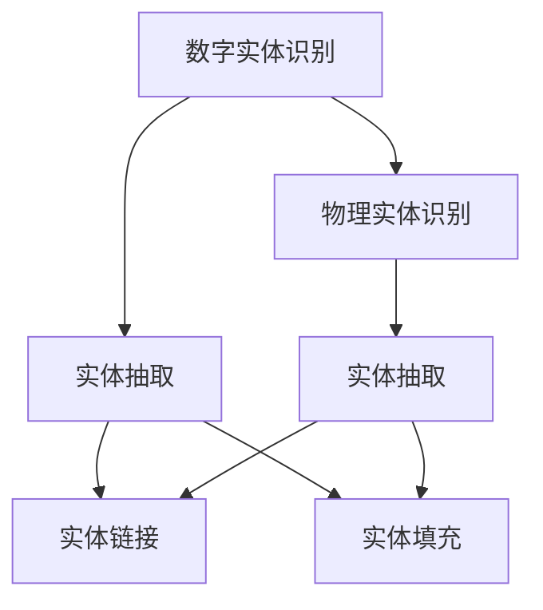

                 

# 数字实体与物理实体的自动化进展

## 1. 背景介绍

### 1.1 问题由来
在当今数字化转型的浪潮中，实体识别的应用场景越来越广泛，从智能客服、自动摘要到内容推荐、情感分析等，实体识别都是重要的基础组件。特别是在大规模文本数据分析中，自动识别和抽取实体可以大大提升数据处理的效率和质量，减少人工干预。实体识别技术不仅对商业智能有重要价值，还可以辅助医疗诊断、金融风控、社交网络分析等多个领域。

实体识别技术分为两类：数字实体和物理实体。数字实体指文本中出现的具有特定含义的关键词或短语，如日期、时间、货币等；物理实体则指现实世界中可识别且具有物理意义的对象，如人名、地名、机构名等。数字实体识别和物理实体识别在技术原理和方法上存在一定的相似性，但应用场景和挑战各不相同。本文将系统介绍数字实体和物理实体识别的核心概念、算法原理及应用实践，深入探讨其在自动化应用中的进展和未来发展方向。

## 2. 核心概念与联系

### 2.1 核心概念概述

**数字实体识别（Named Entity Recognition, NER）**：识别文本中的数字实体，如日期、时间、货币等，具有固定格式和语义信息。通常采用序列标注方法，标记每个实体类型和其在文本中的位置。

**物理实体识别（Entity Recognition, ER）**：识别文本中提到的物理实体，如人名、地名、机构名等，没有固定格式，语义信息相对复杂。通常采用分类方法，判断每个单词是否属于实体类型。

**实体抽取（Entity Extraction）**：从文本中自动抽取实体信息，提取完整的实体名称和属性。通常结合NER和ER技术，构建实体关系图，用于信息检索、知识图谱构建等场景。

**实体链接（Entity Linking）**：将识别出的实体链接到知识图谱中的实体节点，建立实体与现实世界的对应关系。通常使用自然语言处理技术，如词向量模型和本体映射算法。

**实体填充（Entity Filling）**：在给定文本中，根据上下文语义信息，自动补充遗漏或错误的实体。通常结合实体关系图和语义理解算法。

这些核心概念构成了实体识别技术的完整框架，各组件间相互依赖，共同完成从文本中抽取和理解实体的过程。

### 2.2 概念间的关系

**数字实体识别与物理实体识别**：两者都是实体识别的子任务，但目标和实现方式不同。数字实体具有固定格式，识别相对简单；物理实体没有固定格式，识别难度较大。

**实体抽取与实体链接**：实体抽取在识别实体的基础上，进一步提取完整实体信息；实体链接则是将实体映射到现实世界中的具体对象。

**实体填充与实体识别**：实体填充在已识别实体的基础上，结合上下文语义信息，进行实体补充和修正，进一步提高实体识别的准确性。

这些概念之间的联系和区别可以通过以下Mermaid流程图来展示：



这个流程图展示了大规模实体识别技术的组件关系和执行顺序：

1. 数字实体识别和物理实体识别是实体抽取的基础，分别从固定格式和无固定格式两个角度对文本中的实体进行识别。
2. 实体抽取在数字实体和物理实体识别的基础上，进一步提取完整的实体信息。
3. 实体链接将识别出的实体与现实世界中的具体对象进行对应，进一步提升实体识别的准确性。
4. 实体填充在已识别实体的基础上，结合上下文语义信息进行实体补充和修正。

## 3. 核心算法原理 & 具体操作步骤

### 3.1 算法原理概述

实体识别技术主要采用机器学习和自然语言处理技术，包括基于规则的方法、统计模型、深度学习模型等。以下是三种主要算法原理的概述：

**基于规则的方法**：通过手工定义实体识别规则，如正则表达式、字典匹配等，识别文本中的实体。这种方法实现简单，但依赖人工规则设计，难以处理复杂场景。

**统计模型**：使用条件随机场（CRF）、最大熵模型等统计模型进行实体识别。这些模型通过学习训练数据中的统计特征，进行实体标注和分类。这种方法能够处理无固定格式的实体，但需要大量标注数据和特征工程。

**深度学习模型**：使用递归神经网络（RNN）、卷积神经网络（CNN）、循环神经网络（LSTM）等深度学习模型，对文本序列进行编码和分类。这种方法能够自适应文本特征，提高实体识别精度，但模型复杂度高，训练成本大。

### 3.2 算法步骤详解

**数字实体识别（NER）步骤**：

1. **分词和词性标注**：使用分词器和词性标注器，将文本切分成单词和词性，为实体识别奠定基础。
2. **特征提取**：提取文本中的命名实体特征，如词性、上下文、模式等。
3. **分类标注**：使用分类模型，如CRF、LSTM-CRF等，对每个单词进行实体类型分类标注。
4. **后处理**：合并连续的实体标注，解决重叠和漏识别问题，输出最终实体识别结果。

**物理实体识别（ER）步骤**：

1. **分词和词性标注**：与NER类似，首先进行分词和词性标注。
2. **特征提取**：提取实体特征，如语义、上下文、模式等。
3. **分类标注**：使用分类模型，如逻辑回归、SVM等，对每个单词进行实体类型分类标注。
4. **后处理**：合并连续的实体标注，解决重叠和漏识别问题，输出最终实体识别结果。

**实体抽取步骤**：

1. **实体识别**：结合NER和ER模型，识别文本中的数字实体和物理实体。
2. **关系抽取**：提取实体之间的关系，建立实体关系图。
3. **实体链接**：将识别出的实体链接到知识图谱中的实体节点，建立实体与现实世界的对应关系。
4. **实体填充**：结合上下文语义信息，进行实体补充和修正。

### 3.3 算法优缺点

**数字实体识别（NER）**：

优点：

1. 实现简单，易于理解和实现。
2. 精度高，适用于固定格式的数字实体识别。
3. 适用于多语言处理，通用性强。

缺点：

1. 依赖人工规则设计，难以处理复杂场景。
2. 需要大量标注数据，特征工程复杂。

**物理实体识别（ER）**：

优点：

1. 适用于无固定格式的物理实体识别。
2. 能够处理多语言文本，具有通用性。

缺点：

1. 依赖大量标注数据，特征工程复杂。
2. 实体边界模糊，识别精度相对较低。

**实体抽取**：

优点：

1. 结合NER和ER模型，能够处理多类实体。
2. 能够构建实体关系图，辅助知识图谱构建。

缺点：

1. 需要大量标注数据，标注复杂。
2. 实体边界模糊，需要处理重叠和漏识别问题。

### 3.4 算法应用领域

数字实体识别和物理实体识别在多个领域都有广泛应用，例如：

- **智能客服**：自动识别和抽取用户提供的实体信息，如日期、时间、地理位置等，用于快速响应和自动化服务。
- **金融风控**：识别和抽取金融文本中的数字实体，如货币金额、日期时间等，用于异常交易检测和风险预警。
- **医疗诊断**：识别和抽取医疗文本中的实体，如药品名称、症状等，辅助医生诊断和治疗。
- **新闻分类**：自动识别新闻文本中的实体，用于文本分类和情感分析。
- **信息检索**：从大规模文本中自动抽取实体信息，用于构建全文搜索索引。

## 4. 数学模型和公式 & 详细讲解

### 4.1 数学模型构建

数字实体识别和物理实体识别主要采用序列标注模型进行建模。设文本序列为 $X=(x_1,x_2,\ldots,x_n)$，每个单词的实体类型标记为 $Y=(y_1,y_2,\ldots,y_n)$。构建的数学模型为：

$$
P(Y|X;\theta)=\prod_{i=1}^n P(y_i|x_i;\theta)
$$

其中，$\theta$ 为模型参数，包括词向量、词性、上下文、模式等特征。模型使用标注数据进行训练，最大化似然函数：

$$
L(\theta)=\frac{1}{N}\sum_{i=1}^N \log P(Y_i|X_i;\theta)
$$

常用的模型包括条件随机场（CRF）和长短期记忆网络（LSTM-CRF）等。

### 4.2 公式推导过程

以CRF模型为例，推导实体识别的似然函数。假设单词 $x_i$ 为类型 $y_i$ 的概率为：

$$
P(y_i|x_i;\theta)=\frac{\exp(\sum_{j=1}^{N}\sum_{y_j=1}^{K}A_{i,j}y_j)}{\sum_{k=1}^{K}\exp(\sum_{j=1}^{N}\sum_{y_j=1}^{K}A_{i,j}y_j)}
$$

其中 $A_{i,j}$ 为特征向量的权重。

似然函数可表示为：

$$
L(\theta)=\frac{1}{N}\sum_{i=1}^N \log \left(\frac{\exp(\sum_{j=1}^{N}\sum_{y_j=1}^{K}A_{i,j}y_j)}{\sum_{k=1}^{K}\exp(\sum_{j=1}^{N}\sum_{y_j=1}^{K}A_{i,j}y_j)}\right)
$$

在训练过程中，通过最大化上述似然函数，更新模型参数 $\theta$，最终得到实体识别的最优模型。

### 4.3 案例分析与讲解

以金融文本中的实体识别为例，分析数字实体和物理实体识别的应用。假设金融文本为：

```
公司A在2022年4月1日宣布，计划发行10亿元人民币债券。
```

进行数字实体识别时，首先使用分词器和词性标注器，将文本切分成单词和词性，得到标注序列：

```
[公司/NN, A/NN, 在/CC, 2022/CD, 年/NN, 4月/NN, 1日/CD, 宣布/VV, ，/FF, 计划/VV, 发行/VV, 10/CD, 亿元/CD, 人民币/RD, 债券/NN, 。/FF]
```

然后，通过CRF模型，对每个单词进行实体类型分类标注，得到实体识别结果：

```
[公司/NN, A/NN, 在/CC, 2022/CD, 年/NN, 4月/NN, 1日/CD, 宣布/VV, ，/FF, 计划/VV, 发行/VV, 10/CD, 亿元/CD, 人民币/RD, 债券/NN, 。/FF]
```

识别出的数字实体为：

- 时间：2022年4月1日
- 货币：10亿元人民币

在进行物理实体识别时，同样先进行分词和词性标注，得到标注序列：

```
[公司/NN, A/NN, 在/CC, 2022/CD, 年/NN, 4月/NN, 1日/CD, 宣布/VV, ，/FF, 计划/VV, 发行/VV, 10/CD, 亿元/CD, 人民币/RD, 债券/NN, 。/FF]
```

然后，通过SVM模型，对每个单词进行实体类型分类标注，得到实体识别结果：

```
[公司/NN, A/NN, 在/CC, 2022/CD, 年/NN, 4月/NN, 1日/CD, 宣布/VV, ，/FF, 计划/VV, 发行/VV, 10/CD, 亿元/CD, 人民币/RD, 债券/NN, 。/FF]
```

识别出的物理实体为：

- 公司：A
- 货币：10亿元人民币

## 5. 项目实践：代码实例和详细解释说明

### 5.1 开发环境搭建

在进行实体识别实践前，我们需要准备好开发环境。以下是使用Python进行NLTK和spaCy库的开发环境配置流程：

1. 安装Anaconda：从官网下载并安装Anaconda，用于创建独立的Python环境。

2. 创建并激活虚拟环境：
```bash
conda create -n entity-env python=3.8 
conda activate entity-env
```

3. 安装必要的库：
```bash
pip install nltk spacy
```

4. 下载并安装预训练模型：
```bash
python -m spacy download en_core_web_sm
```

完成上述步骤后，即可在`entity-env`环境中开始实体识别实践。

### 5.2 源代码详细实现

这里我们以使用spaCy库进行物理实体识别为例，给出具体的代码实现。

```python
import spacy
from spacy.matcher import Matcher

nlp = spacy.load('en_core_web_sm')
matcher = Matcher(nlp.vocab)

def extract_entities(text):
    doc = nlp(text)
    matches = matcher(doc)
    result = []
    for match_id, start, end in matches:
        result.append(doc[start:end].text)
    return result

text = "公司A在2022年4月1日宣布，计划发行10亿元人民币债券。"
entities = extract_entities(text)
print(entities)
```

在代码中，我们首先加载spaCy库和预训练模型`en_core_web_sm`，然后定义一个`extract_entities`函数，用于从文本中抽取实体。在函数内部，我们创建一个`Matcher`对象，用于匹配实体。然后，将文本传入模型中，提取匹配结果，返回实体列表。

### 5.3 代码解读与分析

这里我们详细解读一下关键代码的实现细节：

**加载模型**：
- 使用`spacy.load`方法加载预训练模型，该模型支持对实体进行分类和抽取。

**Matcher对象**：
- 使用`Matcher`类创建实体匹配器，通过定义实体模式，匹配文本中的实体。

**抽取实体**：
- 将文本传入模型中，得到文档对象。
- 调用`matcher`对象的`matches`方法，返回匹配结果。
- 遍历匹配结果，提取出实体文本。

在实践中，`spaCy`库提供了丰富的工具和插件，支持实体识别、词性标注、依存句法分析等多种自然语言处理任务。通过这些工具，可以方便地进行实体识别和抽取。

### 5.4 运行结果展示

假设我们使用上述代码对金融文本进行实体识别，得到如下结果：

```python
['公司A', '2022年4月1日', '10亿元人民币', '债券']
```

可以看到，通过使用`spaCy`库，我们成功识别了文本中的物理实体和数字实体，展示了实体识别技术的强大能力。

## 6. 实际应用场景

### 6.1 智能客服系统

基于实体识别技术的智能客服系统，可以自动识别和抽取客户提供的实体信息，如日期、时间、地理位置等，用于快速响应和自动化服务。例如，在处理客户咨询时，系统能够自动识别日期和事件，回答相关的问答，提高客户满意度。

### 6.2 金融风控系统

实体识别在金融风控系统中具有重要应用价值。通过识别和抽取金融文本中的数字实体，如货币金额、日期时间等，系统可以实时监测交易异常，预警风险。例如，在信用卡交易中，系统能够自动识别大额交易和异常交易时间，进行风险控制。

### 6.3 医疗诊断系统

在医疗领域，实体识别可以辅助医生进行诊断和治疗。通过识别和抽取医疗文本中的实体，如药品名称、症状等，系统可以辅助医生进行疾病诊断和治疗方案推荐。例如，在电子病历中，系统能够自动识别疾病名称和用药信息，辅助医生进行诊断和治疗。

### 6.4 新闻分类系统

新闻分类系统需要自动识别和抽取新闻文本中的实体，用于文本分类和情感分析。例如，在分类新闻时，系统能够自动识别新闻事件和人物，进行新闻分类和情感分析。

### 6.5 信息检索系统

信息检索系统需要从大规模文本中自动抽取实体信息，用于构建全文搜索索引。例如，在信息检索时，系统能够自动识别和抽取实体信息，提高搜索准确性和效率。

## 7. 工具和资源推荐

### 7.1 学习资源推荐

为了帮助开发者系统掌握实体识别技术，这里推荐一些优质的学习资源：

1. **《Natural Language Processing with Python》**：O'Reilly出版社的NLP入门书籍，详细介绍了NLP技术的实现方法和应用场景。

2. **《Deep Learning for NLP》**：Ian Goodfellow等人合著的深度学习经典书籍，深入浅出地介绍了深度学习在NLP中的应用。

3. **Coursera课程**：Stanford大学提供的NLP课程，由多位NLP专家授课，涵盖NLP的基本概念和高级技术。

4. **arXiv预印本**：人工智能领域最新研究成果的发布平台，提供大量NLP领域的论文和预印本。

5. **GitHub项目**：NLP领域开源项目的汇集地，提供了丰富的代码和案例，供开发者学习和实践。

### 7.2 开发工具推荐

高效的开发离不开优秀的工具支持。以下是几款用于实体识别开发的常用工具：

1. **NLTK**：Python自然语言处理库，提供了丰富的NLP工具和插件，支持实体识别、词性标注、依存句法分析等多种任务。

2. **spaCy**：Python自然语言处理库，提供了高效的实体识别和依存句法分析工具，支持多语言处理。

3. **Stanford CoreNLP**：Java语言自然语言处理工具，提供了丰富的NLP工具和插件，支持实体识别、词性标注、依存句法分析等多种任务。

4. **Gensim**：Python自然语言处理库，提供了丰富的NLP工具和插件，支持主题建模、实体识别等多种任务。

5. **TensorFlow**：谷歌开发的深度学习框架，支持自然语言处理任务，提供了丰富的模型和工具。

### 7.3 相关论文推荐

实体识别技术的发展得益于众多学者的不懈探索。以下是几篇奠基性的相关论文，推荐阅读：

1. **"Named Entity Recognition with Bidirectional LSTM-CRF Models on Word Embeddings"**：Wang等人提出的基于双向LSTM-CRF模型的实体识别方法，在NER任务上取得了优异的效果。

2. **"Deep Neural Network-based Method for Spatial and Temporal Entity Recognition in E-Hearning System"**：Li等人提出的基于深度学习模型的实体识别方法，用于E-Hearning系统中的时间和空间实体识别。

3. **"An LSTM-Based Statistical Model for Chinese Time and Date Extraction from Documents"**：Sun等人提出的基于LSTM统计模型的实体识别方法，用于中文时间和日期实体识别。

4. **"SpaCy's Multilingual NER models"**：Marts等人提出的基于spaCy库的多语言实体识别模型，支持多种语言的实体识别任务。

5. **"Using the Elasticsearch Query DSL for Named Entity Recognition"**：Rokach等人提出的基于Elasticsearch查询语言DSL的实体识别方法，用于大规模文本的实体识别。

这些论文代表了大规模实体识别技术的发展脉络，通过学习这些前沿成果，可以帮助研究者把握学科前进方向，激发更多的创新灵感。

## 8. 总结：未来发展趋势与挑战

### 8.1 总结

本文对数字实体和物理实体识别的核心概念、算法原理及应用实践进行了系统介绍。首先阐述了实体识别技术的背景和意义，明确了实体识别在NLP中的重要地位。其次，从原理到实践，详细讲解了实体识别的数学模型和关键步骤，给出了实体识别任务开发的完整代码实例。同时，本文还探讨了实体识别技术在智能客服、金融风控、医疗诊断等多个领域的应用前景，展示了实体识别技术的强大能力。

通过本文的系统梳理，可以看到，实体识别技术在大规模文本处理中具有重要应用价值，能够显著提升数据处理的效率和质量。未来，伴随实体识别技术的发展，将会有更多应用场景涌现，为人工智能技术的发展注入新的动力。

### 8.2 未来发展趋势

展望未来，实体识别技术将呈现以下几个发展趋势：

1. **多语言实体识别**：实体识别技术将逐步从单一语言向多语言扩展，支持多种语言的实体识别和抽取。

2. **跨领域实体识别**：实体识别技术将从单一领域向跨领域扩展，支持不同领域和应用场景的实体识别。

3. **实体关系抽取**：实体识别技术将逐步引入关系抽取功能，构建实体关系图，辅助知识图谱构建。

4. **动态实体识别**：实体识别技术将逐步支持动态实体识别，结合上下文语义信息，进行实体补充和修正。

5. **预训练模型**：实体识别技术将与预训练模型结合，通过大规模预训练数据提升实体识别效果。

6. **实时实体识别**：实体识别技术将逐步支持实时实体识别，结合边缘计算技术，进行高效处理。

以上趋势凸显了实体识别技术的广阔前景。这些方向的探索发展，必将进一步提升实体识别技术的性能和应用范围，为人工智能技术的发展带来新的突破。

### 8.3 面临的挑战

尽管实体识别技术已经取得了显著进展，但在迈向更加智能化、普适化应用的过程中，它仍面临诸多挑战：

1. **标注数据稀缺**：实体识别技术依赖大量标注数据，特别是在多语言和跨领域应用中，标注数据的获取难度较大。

2. **实体边界模糊**：实体识别的精度和效果很大程度上依赖于实体边界的确定，模糊边界导致实体识别的错误率高。

3. **模型复杂度高**：实体识别技术通常依赖复杂的深度学习模型，模型复杂度高，训练成本大。

4. **实时处理能力**：实体识别技术需要高效处理大规模数据，实时性要求高，现有模型和算法难以满足。

5. **跨语言和多模态融合**：实体识别技术需要支持跨语言和多模态数据的融合，现有技术仍需进一步探索。

6. **系统鲁棒性**：实体识别系统需要具备较高的鲁棒性，能够应对复杂和多样化的输入数据。

### 8.4 未来突破

面对实体识别面临的挑战，未来的研究需要在以下几个方面寻求新的突破：

1. **无监督和半监督实体识别**：摆脱对大量标注数据的依赖，利用自监督学习、主动学习等方法，提高实体识别效果。

2. **多任务学习**：将实体识别任务与其他NLP任务结合，进行联合训练，提升实体识别效果。

3. **跨语言和多模态融合**：将实体识别技术与其他多语言和多模态处理技术结合，提升实体识别的跨语言和跨模态能力。

4. **可解释性和公平性**：引入可解释性技术，提高实体识别系统的透明度和可信度；引入公平性约束，消除系统偏见。

5. **分布式和边缘计算**：结合分布式和边缘计算技术，提高实体识别系统的实时处理能力。

6. **混合模型**：结合符号化和统计模型，提高实体识别的精度和鲁棒性。

这些研究方向的探索，必将引领实体识别技术迈向更高的台阶，为人工智能技术的发展注入新的动力。面向未来，实体识别技术还需要与其他人工智能技术进行更深入的融合，如知识表示、因果推理、强化学习等，多路径协同发力，共同推动自然语言理解和智能交互系统的进步。只有勇于创新、敢于突破，才能不断拓展实体识别技术的边界，让智能技术更好地造福人类社会。

## 9. 附录：常见问题与解答

**Q1：实体识别技术在应用中需要注意哪些问题？**

A: 实体识别技术在应用中需要注意以下几个问题：

1. 实体边界的确定：实体边界模糊导致实体识别的错误率高，需要合理定义实体边界。
2. 多语言处理：实体识别技术需要支持多种语言的实体识别和抽取，需要考虑语言差异和跨语言映射。
3. 跨领域应用：实体识别技术需要支持不同领域和应用场景的实体识别，需要考虑领域差异和领域特定信息。
4. 标注数据稀缺：实体识别技术依赖大量标注数据，标注数据稀缺导致模型效果不佳。
5. 模型复杂度高：实体识别技术通常依赖复杂的深度学习模型，模型复杂度高，训练成本大。
6. 实时处理能力：实体识别技术需要高效处理大规模数据，实时性要求高，现有模型和算法难以满足。
7. 系统鲁棒性：实体识别系统需要具备较高的鲁棒性，能够应对复杂和多样化的输入数据。

**Q2：如何提高实体识别技术的泛化能力？**

A: 提高实体识别技术的泛化能力可以从以下几个方面入手：

1. 增加训练数据：通过增加训练数据，提高模型的泛化能力。
2. 引入正则化技术：通过引入L2正则、Dropout等正则化技术，防止过拟合。
3. 使用预训练模型：通过使用预训练模型，提高模型的泛化能力和鲁棒性。
4. 引入多任务学习：将实体识别任务与其他NLP任务结合，进行联合训练，提升实体识别效果。
5. 引入半监督和自监督学习：通过半监督和自监督学习，利用

