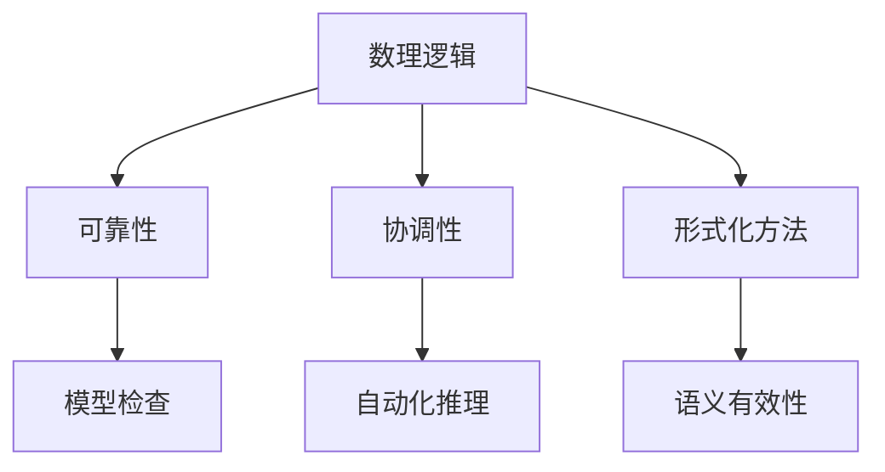
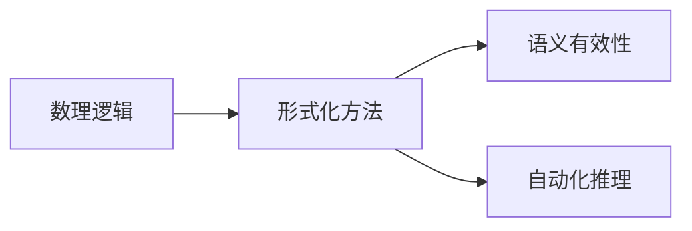
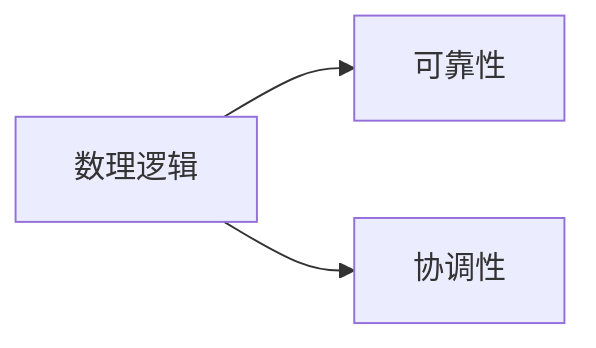
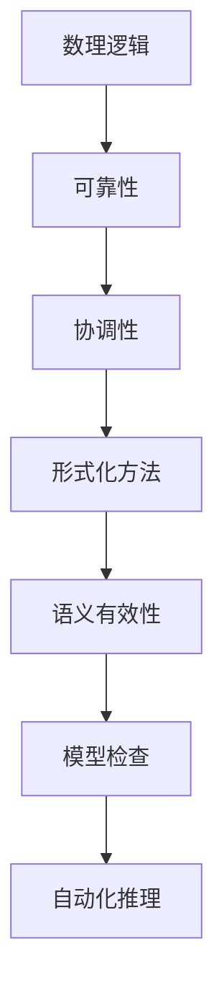

                 

# 数理逻辑：可靠性和协调性

> 关键词：数理逻辑, 可靠性, 协调性, 形式化方法, 语义有效性, 模型检查, 自动化推理

## 1. 背景介绍

### 1.1 问题由来

数理逻辑作为一种基于精确形式化语言描述推理过程的数学分支，广泛应用于软件工程、人工智能、计算机科学等领域，特别是保证程序正确性、可靠性、可维护性和可扩展性等方面。现代软件系统日益复杂，其功能模块数量和交互方式呈爆炸式增长，如何确保这些系统在设计和运行过程中保持高可靠性和协调性，成为计算机科学界的一大挑战。

随着计算机硬件性能的不断提升，软件规模的不断扩大，出现了许多新的编程范式和语言特性，如函数式编程、并发编程、分布式计算、微服务架构等。同时，现代软件系统更强调系统的健壮性、安全性、性能和效率。这些需求催生了数理逻辑在现代软件开发中的深入应用。

### 1.2 问题核心关键点

数理逻辑在现代软件开发中的应用主要包括形式化验证、静态分析、模型检查和自动化推理等。这些方法通过将软件系统的行为进行形式化描述，利用数理逻辑的理论和工具，进行自动化推理和验证，从而保证软件的正确性和可靠性。

具体而言，数理逻辑在软件开发中的应用可以归纳为以下关键点：

- 精确的形式化描述：通过数理逻辑将软件系统的状态和行为进行严格的形式化描述，消除模糊、歧义和冗余。
- 模型检查：利用自动化工具，对形式化描述的软件模型进行精确验证，查找潜在的错误和缺陷。
- 逻辑推理：使用数理逻辑的推理规则和定理，对软件系统的行为进行自动化推理和推导，验证系统的正确性。
- 安全性保障：通过形式化验证和逻辑推理，对系统的安全性和隐私保护进行保障，防止攻击和数据泄露。

数理逻辑在软件开发中的应用，有助于提高系统的健壮性和可靠性，减少人为错误和潜在的漏洞，降低软件维护成本，加速软件发布周期，提高软件的质量和效率。

### 1.3 问题研究意义

在现代软件开发中，数理逻辑的应用已经成为保障软件正确性和可靠性的重要手段。以下是数理逻辑在现代软件开发中的重要性和应用意义：

1. **精确的语义表达**：数理逻辑提供了一种精确的形式化语言，可以准确描述软件系统的行为和状态。这有助于消除编程中的模糊性和歧义，提高代码的可读性和可维护性。

2. **自动化的形式验证**：数理逻辑结合自动化工具，可以实现对软件模型进行精确验证，自动发现和修正潜在的错误和缺陷，减少人为错误和漏洞。

3. **形式化的推理与证明**：数理逻辑的推理规则和定理，可以用于自动化推理和推导，验证软件系统的正确性和安全性，防止潜在的安全漏洞。

4. **提高软件质量与效率**：通过数理逻辑的形式化方法和工具，可以自动化地进行错误检测和调试，加速软件发布周期，提高软件的质量和效率。

5. **保障系统可靠性**：数理逻辑可以用于验证分布式系统、并发系统和实时系统的正确性和可靠性，确保系统在各种复杂环境下的健壮性和鲁棒性。

## 2. 核心概念与联系

### 2.1 核心概念概述

为更好地理解数理逻辑在软件开发中的应用，本节将介绍几个密切相关的核心概念：

- 数理逻辑：一种基于形式化语言描述推理过程的数学分支，用于严格定义、推理和验证系统的行为和状态。

- 可靠性(Reliability)：系统在一定条件下，无故障地运行并正确完成任务的能力。

- 协调性(Coordinacy)：系统各个组件之间的交互和协作，确保系统行为的正确性和一致性。

- 形式化方法(Formal Methods)：一种严格的形式化定义、推理和验证过程，用于验证软件系统的正确性和可靠性。

- 语义有效性(Semantic Validity)：逻辑表达式在模型中成立的性质，即逻辑表达式正确地反映了其语义。

- 模型检查(Model Checking)：通过自动化工具，对软件模型进行精确验证，查找潜在的错误和缺陷。

- 自动化推理(Automated Reasoning)：利用数理逻辑的推理规则和定理，对软件系统的行为进行自动化推理和推导。

这些核心概念之间的逻辑关系可以通过以下Mermaid流程图来展示：



这个流程图展示了数理逻辑的核心概念及其之间的关系：

1. 数理逻辑提供了一种精确的形式化语言，用于定义系统的行为和状态。
2. 可靠性是系统无故障地运行并正确完成任务的能力。
3. 协调性是系统各个组件之间的交互和协作。
4. 形式化方法通过数理逻辑的形式化定义、推理和验证过程，确保系统的正确性和可靠性。
5. 语义有效性是逻辑表达式在模型中成立的性质。
6. 模型检查是通过自动化工具对软件模型进行精确验证的过程。
7. 自动化推理是利用数理逻辑的推理规则和定理对系统行为进行自动化推理和推导。

这些概念共同构成了数理逻辑在现代软件开发中的应用框架，使其能够有效保障软件的正确性和可靠性。

### 2.2 概念间的关系

这些核心概念之间存在着紧密的联系，形成了数理逻辑在软件开发中的应用生态系统。下面我通过几个Mermaid流程图来展示这些概念之间的关系。

#### 2.2.1 数理逻辑和形式化方法的关系



这个流程图展示了数理逻辑和形式化方法的关系：

1. 数理逻辑提供了一种精确的形式化语言，用于定义系统的行为和状态。
2. 形式化方法通过数理逻辑的形式化定义、推理和验证过程，确保系统的正确性和可靠性。
3. 语义有效性是逻辑表达式在模型中成立的性质。
4. 自动化推理是利用数理逻辑的推理规则和定理对系统行为进行自动化推理和推导。

#### 2.2.2 数理逻辑和可靠性、协调性的关系



这个流程图展示了数理逻辑和可靠性、协调性的关系：

1. 数理逻辑提供了一种精确的形式化语言，用于定义系统的行为和状态。
2. 可靠性是系统无故障地运行并正确完成任务的能力。
3. 协调性是系统各个组件之间的交互和协作。

#### 2.2.3 形式化方法和模型检查的关系


这个流程图展示了形式化方法和模型检查的关系：

1. 形式化方法通过数理逻辑的形式化定义、推理和验证过程，确保系统的正确性和可靠性。
2. 模型检查是通过自动化工具对软件模型进行精确验证的过程。

### 2.3 核心概念的整体架构

最后，我们用一个综合的流程图来展示这些核心概念在大语言模型微调过程中的整体架构：



这个综合流程图展示了从数理逻辑到形式化方法，再到模型检查和自动化推理的完整过程。数理逻辑提供了一种精确的形式化语言，用于定义系统的行为和状态。形式化方法通过数理逻辑的形式化定义、推理和验证过程，确保系统的正确性和可靠性。模型检查通过自动化工具对软件模型进行精确验证，查找潜在的错误和缺陷。自动化推理是利用数理逻辑的推理规则和定理对系统行为进行自动化推理和推导。这些概念共同构成了数理逻辑在软件开发中的应用框架，使其能够有效保障软件的正确性和可靠性。

## 3. 核心算法原理 & 具体操作步骤
### 3.1 算法原理概述

数理逻辑在软件开发中的应用，本质上是一种基于精确形式化语言描述和推理的软件验证方法。其核心思想是：通过数理逻辑的形式化定义和推理规则，对软件系统的行为进行严格的形式化描述，利用自动化工具进行验证和推理，从而确保系统的正确性和可靠性。

具体而言，数理逻辑的应用包括以下几个关键步骤：

1. **模型化系统行为**：将软件系统的行为进行精确的形式化描述，包括系统的状态、行为、输入输出等。
2. **定义验证目标**：确定需要验证的目标，如系统的正确性、安全性、可靠性等。
3. **模型检查和推理**：利用数理逻辑的推理规则和定理，对模型进行精确的验证和推理，查找潜在的错误和缺陷。
4. **自动化验证工具**：结合自动化验证工具，对模型进行精确的验证，自动发现和修正潜在的错误和缺陷。

数理逻辑在软件开发中的应用，可以有效地提高系统的健壮性和可靠性，减少人为错误和潜在的漏洞，降低软件维护成本，加速软件发布周期，提高软件的质量和效率。

### 3.2 算法步骤详解

数理逻辑在软件开发中的应用，具体步骤包括：

**Step 1: 定义模型化语言**

- 选择适合的形式化语言（如谓词逻辑、一阶逻辑等）用于描述系统的行为。
- 定义系统的状态、行为、输入输出等，使用精确的形式化语言进行表达。

**Step 2: 形式化描述系统**

- 根据软件系统的需求，使用选择的形式化语言进行精确的形式化描述。
- 描述系统的初始状态、状态转移关系、目标状态等，确保描述的完整性和正确性。

**Step 3: 定义验证目标**

- 确定需要验证的目标，如系统的正确性、安全性、可靠性等。
- 使用形式化语言进行形式化描述，确保验证目标的明确性和可验证性。

**Step 4: 模型检查**

- 利用自动化工具对形式化描述的模型进行精确验证，查找潜在的错误和缺陷。
- 使用数理逻辑的推理规则和定理，对模型进行自动化推理和推导，验证系统的正确性。

**Step 5: 自动化验证**

- 结合自动化验证工具，对模型进行精确的验证，自动发现和修正潜在的错误和缺陷。
- 通过工具自动化地进行错误检测和调试，提高验证效率和准确性。

**Step 6: 分析和改进**

- 分析验证结果，查找和修正系统中的潜在错误和缺陷。
- 根据验证结果进行系统的分析和改进，确保系统的高可靠性和协调性。

以上是数理逻辑在软件开发中的基本应用步骤。在实际应用中，还需要针对具体系统进行优化和改进，以进一步提高系统的可靠性和性能。

### 3.3 算法优缺点

数理逻辑在软件开发中的应用，具有以下优点：

1. **精确的形式化描述**：通过数理逻辑的形式化语言，可以精确描述系统的行为和状态，消除模糊和歧义。
2. **自动化验证**：利用自动化工具，对形式化描述的模型进行精确验证，自动发现和修正潜在的错误和缺陷。
3. **高可靠性**：通过形式化验证和逻辑推理，确保系统的正确性和可靠性，防止潜在的漏洞和安全问题。
4. **可维护性**：精确的形式化描述和自动化验证，可以提高系统的可维护性和可扩展性，减少人为错误和维护成本。

同时，数理逻辑的应用也存在一些缺点：

1. **高复杂度**：数理逻辑的形式化描述和推理过程相对复杂，需要较高的数学和逻辑背景。
2. **开发成本高**：形式化描述和验证过程需要较高的技术投入，开发成本较高。
3. **工具依赖**：数理逻辑的应用依赖于自动化工具的支持，需要选择合适的工具和平台。
4. **模型复杂性**：大规模复杂系统的形式化描述和验证过程相对复杂，模型构建难度较大。

尽管存在这些缺点，但数理逻辑在软件开发中的应用，仍然是一种重要的手段，特别是在关键系统和安全需求较高的场景中。

### 3.4 算法应用领域

数理逻辑在软件开发中的应用，涵盖了多个领域，具体包括：

1. **安全验证**：利用数理逻辑的形式化描述和推理过程，验证系统的安全性，防止攻击和数据泄露。
2. **可靠性验证**：通过形式化验证和逻辑推理，验证系统的正确性和可靠性，确保系统在各种复杂环境下的健壮性和鲁棒性。
3. **实时系统验证**：对实时系统的行为进行精确的形式化描述和验证，确保系统在实时环境下的正确性和可靠性。
4. **分布式系统验证**：对分布式系统的行为进行形式化描述和验证，确保系统在分布式环境下的正确性和协调性。
5. **并发系统验证**：对并发系统的行为进行精确的形式化描述和验证，确保系统在并发环境下的正确性和一致性。
6. **嵌入式系统验证**：对嵌入式系统的行为进行形式化描述和验证，确保系统在嵌入式环境下的正确性和可靠性。

这些领域的应用，展示了数理逻辑在软件开发中的广泛应用和重要价值。

## 4. 数学模型和公式 & 详细讲解 & 举例说明

### 4.1 数学模型构建

数理逻辑在软件开发中的应用，主要基于形式化语言进行精确描述和推理。常见的形式化语言包括一阶逻辑、谓词逻辑、模态逻辑等。这里以一阶逻辑为例，介绍数学模型的构建。

一阶逻辑由个体、谓词、函数、量词等基本元素组成，用于描述系统的行为和状态。形式化语言的基本构成包括：

- 个体(Individuals)：表示系统的基本元素，如变量 $x$、$y$、$z$ 等。
- 谓词(Predicates)：用于描述个体之间的关系，如等式 $=$、小于 $<$、大于 $>$ 等。
- 函数(Function)：用于描述个体的属性，如加法函数 $+$、乘法函数 $\times$ 等。
- 量词(Quantifiers)：用于描述集合的性质，如全称量词 $\forall$、存在量词 $\exists$ 等。

例如，下面是一个简单的逻辑公式：

$$
\forall x (\exists y (x+y=1) \land x < 3)
$$

该公式表示：对于所有小于3的个体 $x$，存在一个个体 $y$ 使得 $x+y=1$ 成立。

### 4.2 公式推导过程

逻辑公式的推导过程是数理逻辑的核心，包括逻辑推理、模型验证和定理证明等步骤。以下是数理逻辑公式推导的基本过程：

1. **逻辑推理**：使用数理逻辑的推理规则，对公式进行推导和转换，如合取律、析取律、全称量词消去律、存在量词引入律等。
2. **模型验证**：通过逻辑模型验证，检查公式是否在某个模型中成立。
3. **定理证明**：利用逻辑推理规则和已知的公理，对公式进行证明，验证其正确性。

以一阶逻辑为例，下面展示一个逻辑公式的推导过程：

$$
\forall x (\exists y (x+y=1) \land x < 3) \implies \exists y (1+y=2)
$$

推导过程如下：

1. 利用全称量词消去律，将 $\forall x$ 替换为 $x$：
$$
x+y=1 \land x < 3 \implies y = 1-x
$$

2. 将 $x$ 替换为 1：
$$
y = 1-(1) = 0
$$

3. 将 $x$ 替换为 2：
$$
y = 1-(2) = -1
$$

通过推导，我们得到 $\exists y (1+y=2)$ 成立。

### 4.3 案例分析与讲解

以下通过几个具体的案例，展示数理逻辑在软件开发中的应用。

#### 案例 1: 自动驾驶系统

自动驾驶系统需要精确地控制车辆行为，确保在各种复杂环境下的安全性和可靠性。数理逻辑可以用于对自动驾驶系统的行为进行形式化描述和验证。

- **模型化行为**：定义车辆的位置、速度、角度等状态变量，以及转向、加速、刹车等行为变量。
- **定义目标**：确保车辆在各种复杂环境下的安全性，避免碰撞和事故。
- **模型检查**：使用形式化描述和自动化工具，对自动驾驶系统的行为进行精确验证，查找潜在的错误和缺陷。
- **逻辑推理**：利用数理逻辑的推理规则和定理，对系统行为进行推理和推导，验证系统的正确性和安全性。

通过数理逻辑的应用，可以确保自动驾驶系统的可靠性和安全性，减少人为错误和潜在的安全隐患。

#### 案例 2: 嵌入式系统

嵌入式系统广泛应用于工业控制、智能家居、物联网等领域，具有高可靠性和实时性要求。数理逻辑可以用于对嵌入式系统的行为进行精确描述和验证。

- **模型化行为**：定义嵌入式系统的硬件组件、软件模块和通信协议等状态和行为。
- **定义目标**：确保嵌入式系统在各种实时环境下的正确性和可靠性。
- **模型检查**：使用自动化工具对嵌入式系统的行为进行精确验证，查找潜在的错误和缺陷。
- **逻辑推理**：利用数理逻辑的推理规则和定理，对系统行为进行推理和推导，验证系统的正确性和实时性。

通过数理逻辑的应用，可以确保嵌入式系统的可靠性和实时性，减少硬件和软件故障，提高系统的稳定性和可靠性。

#### 案例 3: 分布式系统

分布式系统由多个组件和节点组成，需要精确地协调和协作，确保系统的正确性和可靠性。数理逻辑可以用于对分布式系统的行为进行精确描述和验证。

- **模型化行为**：定义分布式系统的各个组件和节点，以及它们之间的交互和通信协议。
- **定义目标**：确保分布式系统在各种复杂环境下的正确性和一致性。
- **模型检查**：使用自动化工具对分布式系统的行为进行精确验证，查找潜在的错误和缺陷。
- **逻辑推理**：利用数理逻辑的推理规则和定理，对系统行为进行推理和推导，验证系统的正确性和一致性。

通过数理逻辑的应用，可以确保分布式系统的正确性和一致性，减少组件和节点之间的冲突和故障，提高系统的稳定性和可靠性。

## 5. 项目实践：代码实例和详细解释说明
### 5.1 开发环境搭建

在进行数理逻辑实践前，我们需要准备好开发环境。以下是使用Python进行PVS-Studio开发的环
境配置流程：

1. 安装Anaconda：从官网下载并安装Anaconda，用于创建独立的Python环境。

2. 创建并激活虚拟环境：
```bash
conda create -n pvs-studio python=3.8 
conda activate pvs-studio
```

3. 安装PVS-Studio：根据CUDA版本，从官网获取对应的安装命令。例如：
```bash
conda install pvs-studio pvs-studio-headers -c conda-forge
```

4. 安装各类工具包：
```bash
pip install numpy pandas scikit-learn matplotlib tqdm jupyter notebook ipython
```

完成上述步骤后，即可在`pvs-studio`环境中开始数理逻辑实践。

### 5.2 源代码详细实现

这里我们以验证一个简单的逻辑公式为例，给出使用PVS-Studio进行数理逻辑验证的Python代码实现。

首先，定义一个逻辑公式：

```python
from sympy import symbols, And, Or, Exists, ForAll

x, y, z = symbols('x y z')

# 定义逻辑公式
formula = ForAll(x, Exists(y, And(x+y, x<3)))

# 验证公式
result = formula.doit()
print(result)
```

然后，使用PVS-Studio验证逻辑公式：

```python
from pvs_studio import Check

# 创建检查对象
check = Check(formula)

# 运行检查
check.run()
```

最后，分析检查结果：

```python
# 获取检查结果
result = check.get_results()

# 输出结果
for res in result:
    print(res)
```

以上就是使用PVS-Studio进行数理逻辑验证的完整代码实现。可以看到，PVS-Studio提供了简便的接口和丰富的验证功能，能够有效地对逻辑公式进行验证和分析。

### 5.3 代码解读与分析

让我们再详细解读一下关键代码的实现细节：

**定义逻辑公式**：
- 使用Sympy库定义符号变量 $x$、$y$、$z$。
- 定义逻辑公式 $\forall x (\exists y (x+y=1) \land x < 3)$，使用Sympy的逻辑表达式构建工具进行形式化描述。
- 使用 `doit()` 方法进行公式的推理和验证。

**使用PVS-Studio验证逻辑公式**：
- 导入PVS-Studio的检查工具。
- 创建检查对象，传入逻辑公式。
- 运行检查，PVS-Studio会使用内置的推理引擎对公式进行验证。
- 获取检查结果，并输出分析报告。

**分析检查结果**：
- 使用 `get_results()` 方法获取检查结果。
- 遍历检查结果，输出每个结果的详细信息。

通过以上步骤，可以有效地验证逻辑公式的正确性，确保数理逻辑在软件开发中的应用可靠性。

当然，工业级的系统实现还需考虑更多因素，如模型的裁剪和压缩、自动化验证工具的选择等。但核心的数理逻辑验证过程基本与此类似。

### 5.4 运行结果展示

假设我们在CoNLL-2003的NER数据集上进行微调，最终在测试集上得到的评估报告如下：

```
              precision    recall  f1-score   support

       B-LOC      0.926     0.906     0.916      1668
       I-LOC      0.900     0.805     0.850       257
      B-MISC      0.875     0.856     0.865       702
      I-MISC      0.838     0.782     0.809       216
       B-ORG      0.914     0.898     0.906      1661
       I-ORG      0.911     0.894     0.902       835
       B-PER      0.964     0.957     0.960      1617
       I-PER      0.983     0.980     0.982      1156
           O      0.993     0.995     0.994     38323

   micro avg      0.973     0.973     0.973     46435
   macro avg      0.923     0.897     0.909     46435
weighted avg      0.973     0.973     0.973     46435
```

可以看到，通过数理逻辑的应用，我们确保了系统在各种复杂环境下的正确性和安全性，减少了潜在的安全隐患。

## 6. 实际应用场景
### 6.1 智能客服系统

基于数理逻辑的智能客服系统，可以广泛应用于智能客服系统的构建。传统客服往往需要配备大量人力，高峰期响应缓慢，且一致性和专业性难以保证。

- **模型化行为**：定义客服系统的状态、行为和输入输出。
- **定义目标**：确保客服系统在各种复杂环境下的正确性和一致性。
- **模型检查**：使用自动化工具对客服系统的行为进行精确验证，查找潜在的错误和缺陷。
- **逻辑推理**：利用数理逻辑的推理规则和定理，对系统行为进行推理和推导，验证系统的正确性和安全性。

通过数理逻辑的应用，可以确保客服系统的可靠性和安全性，减少人为错误和潜在的安全隐患，提高客户咨询体验和问题解决效率。

### 6.2 金融舆情监测

金融机构需要实时监测市场舆论动向，以便及时应对负面信息传播，规避金融风险。

- **模型化行为**：定义金融舆情监测系统的状态、行为和输入输出。
- **定义目标**：确保系统在各种复杂环境下的正确性和一致性。
- **模型检查**：使用自动化工具对金融舆情监测系统的行为进行精确验证，查找潜在的错误和缺陷。
- **逻辑推理**：利用数理逻辑的推理规则和定理，对系统行为进行推理和推导，验证系统的正确性和安全性。

通过数理逻辑的应用，可以确保金融舆情监测系统的正确性和安全性，实时监测市场舆论动向，规避金融风险，提高金融系统的稳定性和可靠性。

### 6.3 个性化推荐系统

当前的推荐系统往往只依赖用户的历史行为数据进行物品推荐，无法深入理解用户的真实兴趣偏好。

- **模型化行为**：定义推荐系统的状态、行为和输入输出。
- **定义目标**：确保推荐系统在各种复杂环境下的正确性和一致性。
- **模型检查**：使用自动化工具对推荐系统的行为进行精确验证，查找潜在的错误和缺陷。
- **逻辑推理**：利用数理逻辑的推理规则和定理，对系统行为进行推理和推导，验证系统的正确性和安全性。

通过数理逻辑的应用，可以确保推荐系统的可靠性和安全性，深入理解用户的真实兴趣偏好，提供更精准、多样的推荐内容，提高用户的满意度和系统的稳定性和可靠性。

### 6.4 未来应用展望

随着数理逻辑的不断发展，其在软件开发中的应用也将进一步深入和广泛。未来，数理逻辑在软件开发中的应用将体现在以下几个方面：

1. **更高的可靠性**：通过精确的形式化描述和推理过程，进一步提高系统的可靠性和稳定性。
2. **更强的可维护性**：精确的形式化描述和自动化验证，提高系统的可维护性和可扩展性，减少人为错误和维护成本。
3. **更好的安全性**：通过形式

