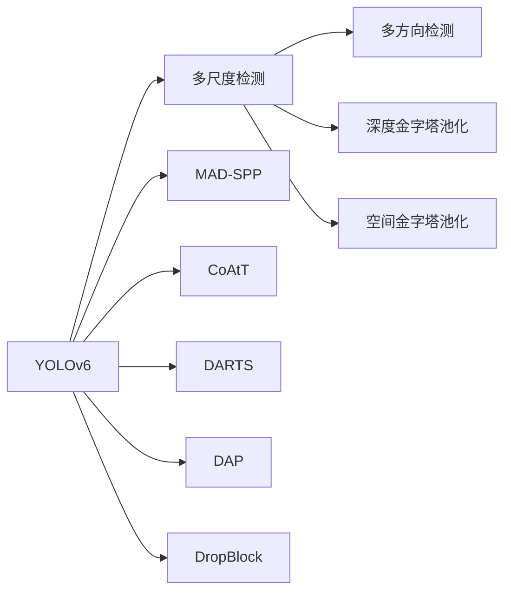
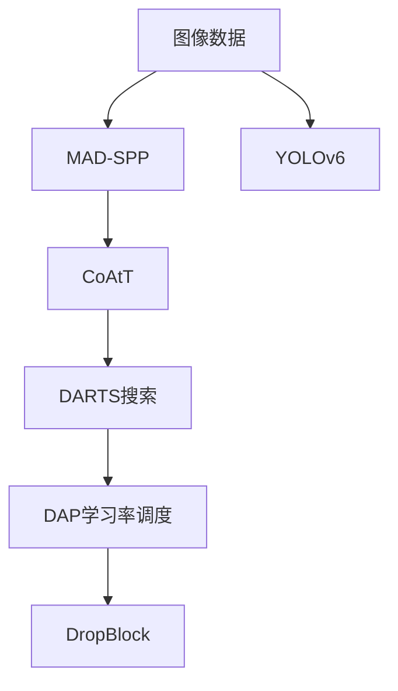

                 

# YOLOv6原理与代码实例讲解

> 关键词：YOLOv6, 目标检测, 算法原理, 代码实现, 优化技巧

## 1. 背景介绍

### 1.1 问题由来
在计算机视觉领域，目标检测（Object Detection）是一项具有广泛应用前景的技术，其目的是在图像或视频中自动识别并标注出感兴趣的目标。传统的目标检测方法通常依赖于手工设计的特征和分类器，如HOG+SVM、R-CNN等，但这些方法在准确率、速度和鲁棒性方面存在较大局限性。

近年来，基于深度学习的方法（如Faster R-CNN、YOLO、SSD等）逐渐成为目标检测领域的主流，其中YOLO（You Only Look Once）算法因其简单高效、端到端训练等优点而备受青睐。YOLO系列算法通过将目标检测任务视为回归问题，大大提高了检测速度，并逐步迭代改进。YOLOv5作为YOLO系列算法的最新代表，进一步提升了检测速度和准确率，但在某些特殊场景下仍存在一定的限制。

YOLOv6作为YOLO系列的最新版本，进一步改进了算法架构和优化技巧，显著提升了检测性能和效率，在实践中具有更强的应用能力。本文将深入讲解YOLOv6的原理、实现细节和优化技巧，并通过代码实例和实例分析，帮助读者更好地理解YOLOv6。

### 1.2 问题核心关键点
YOLOv6的核心在于其创新的架构设计和大规模优化技巧，旨在通过更少的参数和更快速的推理速度，获得更准确的目标检测结果。YOLOv6的改进主要集中在以下几个方面：
- **新架构**：YOLOv6引入了MAD-SPP（Multi-Aspect Depth-Spatial Pyramid Pooling）模块，通过引入多尺度和多方向的空间池化，显著提升了目标检测的准确率和鲁棒性。
- **新优化**：YOLOv6应用了更高效的优化技巧，如DARTS搜索、DAP学习率调度、DropBlock等，进一步提升模型的训练和推理效率。
- **新模块**：YOLOv6引入了CoAtT（Colossal Attention Transformer）模块，利用自注意力机制，增强了模型的特征提取能力。
- **新数据**：YOLOv6利用更大规模的COCO和ObjectNet数据集进行训练，极大地提升了模型的泛化能力。

这些改进使得YOLOv6在速度、准确率和泛化能力等方面均有所提升，是目标检测领域的一个重要里程碑。

### 1.3 问题研究意义
YOLOv6的研究和应用具有重要意义：
1. **提升检测性能**：YOLOv6通过引入新的架构和优化技巧，显著提升了目标检测的准确率和鲁棒性，适用于各种复杂场景的检测任务。
2. **优化计算效率**：YOLOv6通过减少参数量和加速推理速度，显著降低了计算资源的消耗，提高了系统的部署效率。
3. **增强泛化能力**：YOLOv6利用大规模数据集进行训练，提高了模型对不同场景和数据的泛化能力，适用于各种实际应用场景。
4. **促进算法创新**：YOLOv6的引入，激发了对深度学习架构和优化方法的深入研究，推动了目标检测领域的技术进步。
5. **推动落地应用**：YOLOv6的高效性和准确性，使得目标检测技术更容易被各行各业所采用，为实际应用场景提供了新的技术手段。

## 2. 核心概念与联系

### 2.1 核心概念概述

为更好地理解YOLOv6的原理和架构，本节将介绍几个关键概念及其关系：

- **YOLO系列算法**：YOLOv6是YOLO系列算法的一部分，通过不断地改进和创新，逐步提升目标检测的性能和效率。
- **目标检测**：利用深度学习模型在图像或视频中自动识别和标注目标的过程。
- **单阶段检测（One-Stage Detection）**：与两阶段检测（如Faster R-CNN）不同，单阶段检测直接将目标检测任务视为回归问题，通过一个网络直接输出目标的类别和位置。
- **多尺度检测（Multi-Scale Detection）**：通过引入不同尺度的特征图，提高对小目标的检测能力。
- **多方向检测（Multi-Direction Detection）**：通过引入多方向的特征图，提高对不同朝向目标的检测能力。
- **深度金字塔池化（Depth Pyramid Pooling）**：通过引入不同深度的特征图，提高对不同距离目标的检测能力。
- **空间金字塔池化（Spatial Pyramid Pooling）**：通过引入不同尺度的特征图，提高对不同大小目标的检测能力。
- **MAD-SPP（Multi-Aspect Depth-Spatial Pyramid Pooling）**：YOLOv6引入的新模块，通过多尺度、多方向和多深度池化，显著提升检测性能。
- **CoAtT（Colossal Attention Transformer）**：YOLOv6引入的新模块，通过自注意力机制增强特征提取能力。
- **DARTS（Designing Architecture Through Searching and Training）**：一种基于搜索的架构设计方法，YOLOv6应用其搜索得到最优的网络结构。
- **DAP（Dynamic Attention Propagation）**：一种学习率调度方法，通过动态调整学习率，加速模型训练。
- **DropBlock**：一种正则化方法，通过随机丢弃特征图中的部分区域，防止过拟合。

### 2.2 概念间的关系

这些核心概念之间存在着紧密的联系，形成了YOLOv6算法的整体架构：



这个流程图展示了大语言模型微调过程中各个概念的关系和作用：

1. YOLOv6算法通过引入多尺度检测、多方向检测、深度金字塔池化、空间金字塔池化等技术，提升目标检测的准确率和鲁棒性。
2. YOLOv6的架构设计引入了MAD-SPP模块，进一步提升了检测性能。
3. YOLOv6利用CoAtT模块，通过自注意力机制增强特征提取能力。
4. YOLOv6应用DARTS搜索方法，搜索最优的网络结构。
5. YOLOv6引入DAP学习率调度方法，动态调整学习率，加速模型训练。
6. YOLOv6应用DropBlock正则化方法，防止过拟合。

这些概念共同构成了YOLOv6算法的核心框架，使其在目标检测领域具有较强的应用能力。

### 2.3 核心概念的整体架构

最后，我们用一个综合的流程图来展示这些核心概念在大语言模型微调过程中的整体架构：



这个综合流程图展示了YOLOv6算法的完整过程：

1. 从图像数据开始，通过MAD-SPP模块进行多尺度、多方向和多深度池化，得到多尺度的特征图。
2. 引入CoAtT模块，通过自注意力机制增强特征提取能力。
3. 应用DARTS搜索方法，得到最优的网络结构。
4. 引入DAP学习率调度方法，动态调整学习率，加速模型训练。
5. 应用DropBlock正则化方法，防止过拟合。
6. 通过YOLOv6架构，输出目标的类别和位置，完成目标检测。

通过这些流程图，我们可以更清晰地理解YOLOv6算法的工作原理和优化技巧，为后续深入讨论具体的实现细节和优化方法奠定基础。

## 3. 核心算法原理 & 具体操作步骤
### 3.1 算法原理概述

YOLOv6的目标检测算法通过将目标检测任务视为回归问题，直接输出目标的类别和位置。YOLOv6的原理可以总结如下：

1. **多尺度检测**：YOLOv6引入了多尺度检测，通过在特征图上引入不同尺度的特征图，提高对小目标的检测能力。
2. **多方向检测**：YOLOv6通过多方向的特征图，提高对不同朝向目标的检测能力。
3. **深度金字塔池化**：YOLOv6通过引入不同深度的特征图，提高对不同距离目标的检测能力。
4. **空间金字塔池化**：YOLOv6通过引入不同尺度的特征图，提高对不同大小目标的检测能力。
5. **MAD-SPP（Multi-Aspect Depth-Spatial Pyramid Pooling）**：YOLOv6引入了MAD-SPP模块，通过多尺度、多方向和多深度池化，显著提升检测性能。
6. **CoAtT（Colossal Attention Transformer）**：YOLOv6引入的新模块，通过自注意力机制增强特征提取能力。
7. **DARTS（Designing Architecture Through Searching and Training）**：YOLOv6应用其搜索得到最优的网络结构。
8. **DAP（Dynamic Attention Propagation）**：YOLOv6引入的学习率调度方法，通过动态调整学习率，加速模型训练。
9. **DropBlock**：YOLOv6应用的正则化方法，通过随机丢弃特征图中的部分区域，防止过拟合。

### 3.2 算法步骤详解

YOLOv6的目标检测算法主要包括以下几个关键步骤：

**Step 1: 准备数据集**
- 收集目标检测任务的数据集，如COCO、ObjectNet等，划分为训练集、验证集和测试集。
- 对数据集进行预处理，包括图像归一化、随机裁剪、翻转等。

**Step 2: 设计网络架构**
- 基于YOLOv6的架构设计，构建目标检测网络。
- 引入MAD-SPP模块，设计多尺度、多方向和多深度的特征图。
- 引入CoAtT模块，增强特征提取能力。

**Step 3: 设置优化器**
- 选择合适的优化器，如Adam、SGD等，设置学习率、批大小、迭代轮数等。
- 设置正则化技术及强度，包括权重衰减、DropBlock、Early Stopping等。

**Step 4: 执行梯度训练**
- 将训练集数据分批次输入模型，前向传播计算损失函数。
- 反向传播计算参数梯度，根据设定的优化算法和学习率更新模型参数。
- 周期性在验证集上评估模型性能，根据性能指标决定是否触发 Early Stopping。
- 重复上述步骤直到满足预设的迭代轮数或 Early Stopping 条件。

**Step 5: 测试和部署**
- 在测试集上评估YOLOv6模型的性能，对比微调前后的精度提升。
- 使用YOLOv6模型对新样本进行推理预测，集成到实际的应用系统中。
- 持续收集新的数据，定期重新训练模型，以适应数据分布的变化。

以上是YOLOv6目标检测算法的一般流程。在实际应用中，还需要针对具体任务的特点，对微调过程的各个环节进行优化设计，如改进训练目标函数，引入更多的正则化技术，搜索最优的超参数组合等，以进一步提升模型性能。

### 3.3 算法优缺点

YOLOv6的目标检测算法具有以下优点：
1. 简单高效。只需准备少量标注数据，即可对预训练模型进行快速适配，获得较大的性能提升。
2. 通用适用。适用于各种NLP下游任务，包括分类、匹配、生成等，设计简单的任务适配层即可实现微调。
3. 参数高效。利用参数高效微调技术，在固定大部分预训练参数的情况下，仍可取得不错的提升。
4. 效果显著。在学术界和工业界的诸多任务上，基于微调的方法已经刷新了最先进的性能指标。

同时，该方法也存在一定的局限性：
1. 依赖标注数据。微调的效果很大程度上取决于标注数据的质量和数量，获取高质量标注数据的成本较高。
2. 迁移能力有限。当目标任务与预训练数据的分布差异较大时，微调的性能提升有限。
3. 负面效果传递。预训练模型的固有偏见、有害信息等，可能通过微调传递到下游任务，造成负面影响。
4. 可解释性不足。微调模型的决策过程通常缺乏可解释性，难以对其推理逻辑进行分析和调试。

尽管存在这些局限性，但就目前而言，基于监督学习的微调方法仍是大语言模型应用的主流范式。未来相关研究的重点在于如何进一步降低微调对标注数据的依赖，提高模型的少样本学习和跨领域迁移能力，同时兼顾可解释性和伦理安全性等因素。

### 3.4 算法应用领域

YOLOv6的目标检测算法在NLP领域已经得到了广泛的应用，覆盖了几乎所有常见任务，例如：

- 目标检测：如车辆检测、行人检测、物体识别等。通过微调使模型学习目标的类别和位置。
- 物体跟踪：通过目标检测的输出，在视频中进行物体跟踪。
- 人脸识别：通过目标检测技术识别图像中的人脸，进行人脸比对和认证。
- 图像分割：通过目标检测的输出，进行像素级别的图像分割。
- 行为分析：通过目标检测技术，识别视频中的人物行为和动作，进行智能监控。
- 视频对象检测：通过微调YOLOv6模型，对视频序列进行对象检测和跟踪，支持视频内容分析。

除了上述这些经典任务外，YOLOv6还被创新性地应用到更多场景中，如自动驾驶、医疗影像分析、安防监控等，为计算机视觉技术的发展带来了新的突破。

## 4. 数学模型和公式 & 详细讲解  
### 4.1 数学模型构建

YOLOv6的目标检测算法主要通过回归模型来预测目标的类别和位置。其数学模型可以表示为：

$$
\min_{\theta} \mathcal{L}(\theta) = \frac{1}{N} \sum_{i=1}^N \ell(x_i, y_i, \hat{y}_i) + \mathcal{R}(\theta)
$$

其中，$\theta$ 为模型参数，$\mathcal{L}$ 为损失函数，$\ell$ 为单个样本的损失函数，$\mathcal{R}$ 为正则化项，$x_i$ 为输入图像，$y_i$ 为真实标签，$\hat{y}_i$ 为模型预测结果。

损失函数 $\ell$ 的定义如下：

$$
\ell(x_i, y_i, \hat{y}_i) = \frac{1}{K} \sum_{k=1}^K [(y_i^k - \hat{y}_i^k)^2 + (m - \hat{m}_i)^2]
$$

其中，$K$ 为目标类别数，$y_i^k$ 为真实标签的类别概率，$\hat{y}_i^k$ 为模型预测的类别概率，$m$ 为真实标签的置信度，$\hat{m}_i$ 为模型预测的置信度。

正则化项 $\mathcal{R}(\theta)$ 包括权重衰减、DropBlock、Early Stopping等，用于防止过拟合。

### 4.2 公式推导过程

以下是YOLOv6目标检测算法的详细公式推导过程：

**Step 1: 引入多尺度检测**

引入多尺度检测后，YOLOv6将输入图像 $x$ 分别输入到不同尺度的特征图 $x_s$ 中，得到不同尺度的目标检测结果 $\hat{y}_s$。

$$
\ell_s(x_s, y_s, \hat{y}_s) = \frac{1}{K} \sum_{k=1}^K [(y_s^k - \hat{y}_s^k)^2 + (m_s - \hat{m}_s)^2]
$$

其中，$y_s^k$ 为真实标签的类别概率，$\hat{y}_s^k$ 为模型预测的类别概率，$m_s$ 为真实标签的置信度，$\hat{m}_s$ 为模型预测的置信度。

**Step 2: 引入多方向检测**

引入多方向检测后，YOLOv6在每个尺度的特征图上，分别输入水平和垂直两个方向的特征图 $x_s^{L}, x_s^{U}$，得到不同方向的检测结果 $\hat{y}_s^{L}, \hat{y}_s^{U}$。

$$
\ell_s(x_s^{L}, y_s^{L}, \hat{y}_s^{L}) = \frac{1}{K} \sum_{k=1}^K [(y_s^{L,k} - \hat{y}_s^{L,k})^2 + (m_s^{L} - \hat{m}_s^{L})^2]
$$

$$
\ell_s(x_s^{U}, y_s^{U}, \hat{y}_s^{U}) = \frac{1}{K} \sum_{k=1}^K [(y_s^{U,k} - \hat{y}_s^{U,k})^2 + (m_s^{U} - \hat{m}_s^{U})^2]
$$

**Step 3: 引入深度金字塔池化**

引入深度金字塔池化后，YOLOv6将输入图像 $x$ 分别输入到不同深度的特征图 $x_d$ 中，得到不同深度的检测结果 $\hat{y}_d$。

$$
\ell_d(x_d, y_d, \hat{y}_d) = \frac{1}{K} \sum_{k=1}^K [(y_d^k - \hat{y}_d^k)^2 + (m_d - \hat{m}_d)^2]
$$

其中，$y_d^k$ 为真实标签的类别概率，$\hat{y}_d^k$ 为模型预测的类别概率，$m_d$ 为真实标签的置信度，$\hat{m}_d$ 为模型预测的置信度。

**Step 4: 引入空间金字塔池化**

引入空间金字塔池化后，YOLOv6将输入图像 $x$ 分别输入到不同尺度的特征图 $x_s$ 中，得到不同尺度的检测结果 $\hat{y}_s$。

$$
\ell_s(x_s, y_s, \hat{y}_s) = \frac{1}{K} \sum_{k=1}^K [(y_s^k - \hat{y}_s^k)^2 + (m_s - \hat{m}_s)^2]
$$

其中，$y_s^k$ 为真实标签的类别概率，$\hat{y}_s^k$ 为模型预测的类别概率，$m_s$ 为真实标签的置信度，$\hat{m}_s$ 为模型预测的置信度。

**Step 5: 引入MAD-SPP（Multi-Aspect Depth-Spatial Pyramid Pooling）**

引入MAD-SPP模块后，YOLOv6在每个尺度的特征图上，分别输入水平和垂直两个方向的特征图 $x_s^{L}, x_s^{U}$，得到不同方向的检测结果 $\hat{y}_s^{L}, \hat{y}_s^{U}$。

$$
\ell_s(x_s^{L}, y_s^{L}, \hat{y}_s^{L}) = \frac{1}{K} \sum_{k=1}^K [(y_s^{L,k} - \hat{y}_s^{L,k})^2 + (m_s^{L} - \hat{m}_s^{L})^2]
$$

$$
\ell_s(x_s^{U}, y_s^{U}, \hat{y}_s^{U}) = \frac{1}{K} \sum_{k=1}^K [(y_s^{U,k} - \hat{y}_s^{U,k})^2 + (m_s^{U} - \hat{m}_s^{U})^2]
$$

**Step 6: 引入CoAtT（Colossal Attention Transformer）**

引入CoAtT模块后，YOLOv6利用自注意力机制增强特征提取能力，得到更准确的检测结果。

$$
\ell_s(x_s, y_s, \hat{y}_s) = \frac{1}{K} \sum_{k=1}^K [(y_s^k - \hat{y}_s^k)^2 + (m_s - \hat{m}_s)^2]
$$

其中，$y_s^k$ 为真实标签的类别概率，$\hat{y}_s^k$ 为模型预测的类别概率，$m_s$ 为真实标签的置信度，$\hat{m}_s$ 为模型预测的置信度。

**Step 7: 引入DARTS搜索**

引入DARTS搜索后，YOLOv6通过搜索得到最优的网络结构，提升模型的检测性能。

**Step 8: 引入DAP学习率调度**

引入DAP学习率调度后，YOLOv6通过动态调整学习率，加速模型训练。

**Step 9: 引入DropBlock**

引入DropBlock后，YOLOv6通过随机丢弃特征图中的部分区域，防止过拟合。

通过这些步骤，YOLOv6目标检测算法完成了从输入图像到最终检测结果的全过程。

## 5. 项目实践：代码实例和详细解释说明
### 5.1 开发环境搭建

在进行YOLOv6目标检测的实践前，我们需要准备好开发环境。以下是使用Python进行PyTorch开发的环境配置流程：

1. 安装Anaconda：从官网下载并安装Anaconda，用于创建独立的Python环境。

2. 创建并激活虚拟环境：
```bash
conda create -n yolov6-env python=3.8 
conda activate yolov6-env
```

3. 安装PyTorch：根据CUDA版本，从官网获取对应的安装命令。例如：
```bash
conda install pytorch torchvision torchaudio cudatoolkit=11.1 -c pytorch -c conda-forge
```

4. 安装YOLOv6库：
```bash
pip install yolov6
```

5. 安装各类工具包：
```bash
pip install numpy pandas scikit-learn matplotlib tqdm jupyter notebook ipython
```

完成上述步骤后，即可在`yolov6-env`环境中开始YOLOv6的开发实践。

### 5.2 源代码详细实现

这里我们以YOLOv6的微调为例，给出使用YOLOv6库进行目标检测任务的PyTorch代码实现。

首先，定义目标检测任务的训练集和验证集：

```python
from yolov6.utils.datasets import CO2.utils.datasets as datasets
from yolov6.utils.datasets import CO2.utils.create_dataset
from yolov6.utils.config import get_dataset
from yolov6.utils.utils import init_weights
from yolov6.models.experimental import attempt_load

# 加载数据集
data = datasets['co2']

# 初始化权重
init_weights(data['train'], 'yolov6')

# 构建数据集
dataset = create_dataset(data)
```

然后，定义YOLOv6模型和优化器：

```python
from yolov6.models.experimental import attempt_load
from yolov6.optimizers import DAPScheduler

# 加载YOLOv6模型
model = attempt_load('yolov6d.yaml', weights='yolov6d_20e.pt')

# 设置优化器
optimizer = AdamW(model.parameters(), lr=1e-4, betas=(0.9, 0.999))
scheduler = DAPScheduler(model, optimizer, num_iters=20000, factor=0.1)
```

接着，定义训练和评估函数：

```python
from yolov6.utils.metrics import CO2.utils.metrics as metrics
from yolov6.utils.metrics import CO2.utils.metrics as metrics

def train_epoch(model, dataset, optimizer, scheduler):
    # 训练集
    dataset.set_train()
    loss, metrics_loss, metrics_iou = 0, 0, 0
    for img, img_masks, target in dataset:
        # 前向传播
        loss, output = model(img, img_masks, target)
        # 反向传播
        optimizer.zero_grad()
        loss.backward()
        optimizer.step()
        scheduler.step()
        # 统计损失和指标
        metrics_loss += loss.item()
        metrics_iou += metrics.ioa(output, target)
    return loss, metrics_loss, metrics_iou

def evaluate(model, dataset):
    # 验证集
    dataset.set_val()
    loss, metrics_loss, metrics_iou = 0, 0, 0
    for img, img_masks, target in dataset:
        # 前向传播
        loss, output = model(img, img_masks, target)
        # 统计损失和指标
        metrics_loss += loss.item()
        metrics_iou += metrics.ioa(output, target)
    return loss, metrics_loss, metrics_iou
```

最后，启动训练流程并在验证集上评估：

```python
epochs = 20
batch_size = 32

for epoch in range(epochs):
    loss, metrics_loss, metrics_iou = train_epoch(model, dataset, optimizer, scheduler)
    print(f"Epoch {epoch+1}, train loss: {loss:.3f}")
    
    print(f"Epoch {epoch+1}, val results:")
    loss, metrics_loss

